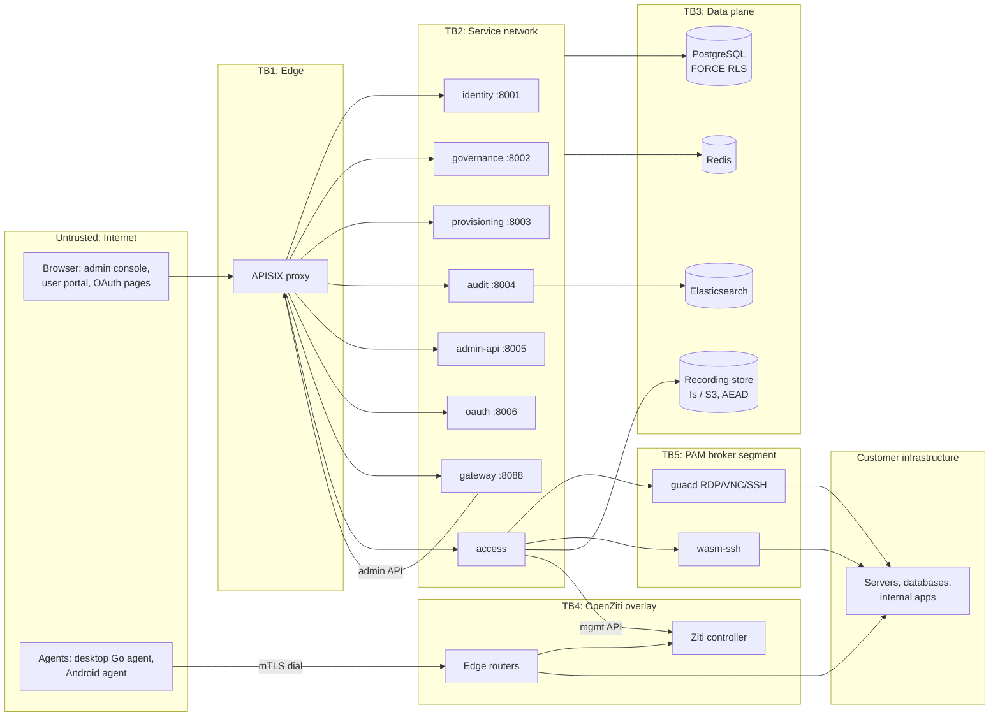

# OpenIDX Threat Model

> **Audience:** security reviewers, auditors, and operators deciding whether
> and how to deploy OpenIDX. **Scope:** the whole platform — the eight Go
> services, the APISIX edge, the OpenZiti overlay, the PAM broker path
> (Guacamole/wasm-SSH/SSH-CA), session recordings, the credential vault, the
> audit pipeline, and the endpoint agents. Every mitigation cited here points
> at code or CI that exists on this commit; nothing below is aspirational.
> If you find a claim the code no longer backs, that is a bug in this
> document — fix the document or the code, never let them disagree
> (the same contract as
> [PROJECT-READINESS-GUIDE.md §7](./PROJECT-READINESS-GUIDE.md)).
>
> Companion documents: [SECURITY-TENANCY.md](./SECURITY-TENANCY.md) (the
> tenant boundary in depth), [SECURITY-HARDENING.md](./SECURITY-HARDENING.md)
> (the enforced production config gates),
> [COMPLIANCE-CONTROL-MAPPING.md](./COMPLIANCE-CONTROL-MAPPING.md)
> (SOC 2 / ISO 27001 mapping), and the readiness guide's §5 recurring
> controls.

---

## 1. System overview and trust boundaries

OpenIDX is self-hosted: the operator runs everything below. One deployment
serves many organizations (tenants), isolated at the database.

Trust boundaries, from least to most trusted:

| # | Boundary | What crosses it | Primary control |
|---|---|---|---|
| **TB1** | Internet → APISIX edge | All user/API traffic | TLS, security headers, rate limiting, CSRF, CORS gates (`ValidateProduction()` refuses wildcard CORS / disabled CSRF in prod) |
| **TB2** | Edge → Go services | Authenticated requests | RS256 JWT verification (JWKS), role checks per route, org resolution per request |
| **TB3** | Services → data plane | SQL, cache ops, audit events | **FORCE row-level security** on every tenant table; parameterized queries; `tools/orgscope` merge-blocking linter |
| **TB4** | Endpoints → Ziti overlay | mTLS dials to dark services | Ziti PKI (per-identity certs), dial policies derived from app assignments; services have **no public listener** |
| **TB5** | access-service → PAM broker | Proxied RDP/VNC/SSH with injected credentials | Vault checkout (step-up-gated), broker-side credential injection, full session recording |
| **TB6** | Anyone → tenant data of another org | Nothing, by design | `org_id` stamped on the pooled connection at checkout (`internal/common/database/rls.go`); fail-closed — no org context ⇒ zero rows |

The **security spine** every access request walks: *authentication*
(OAuth2/OIDC + MFA + risk) → *assignment* (`internal/appaccess` — the single
predicate) → *enforcement* (proxy route / Ziti dial policy / PAM grant) →
*session control* (revocation markers, kill switch) → *audit* (HMAC-chained
events). The platform invariant is **display == enforcement**: any access a
UI shows must be the access the enforcement points grant
(readiness guide §5.3).

## 2. Assets

| # | Asset | Where it lives | Loss impact |
|---|---|---|---|
| A1 | Password hashes, TOTP seeds, WebAuthn credentials, push-device bindings | PostgreSQL | Account takeover across a tenant |
| A2 | OAuth tokens & sessions (access ≤1 h, refresh long-lived) | Signed JWTs client-side; session + revocation state in Redis/PG | Impersonation until expiry/revocation |
| A3 | Privileged credentials & SSH CA private key | `vault_secrets` (envelope-encrypted, §4.6) | Direct compromise of customer servers |
| A4 | Session recordings (screen/terminal) | Filesystem or S3, per-chunk AEAD | Disclosure of everything privileged users saw/typed |
| A5 | Audit trail | PostgreSQL (`unified_audit_events`, HMAC chain) + Elasticsearch | Undetectable abuse; failed audits |
| A6 | Tenant separation itself | PostgreSQL RLS policies | Cross-org data breach — the worst case for a shared install |
| A7 | Ziti PKI, service/dial policies | Ziti controller | Network access to every dark service |
| A8 | Platform secrets: JWT signing key, vault/recording KEKs, DB and APISIX admin credentials | Operator's secret store / env / OpenBao | Platform-wide forgery or decryption |

## 3. Adversaries considered

1. **Internet attacker** — no credentials; phishing, credential stuffing,
   token theft, vulnerability exploitation at TB1.
2. **Authenticated end user** — valid account in one org; tries to reach
   apps/servers beyond their assignments or another tenant's data.
3. **Tenant admin** — full rights in their org; tries to cross TB6 or
   erase their own tracks.
4. **Malicious/compromised privileged user** — has PAM grants; tries to
   exfiltrate vault secrets, disable recording, act unattributably.
5. **Infrastructure-level attacker** — reads a stolen disk/backup, or
   compromises Redis or a single service container.
6. **Supply-chain attacker** — poisons a dependency or the build.

Out of scope: a fully compromised PostgreSQL superuser or host root on the
database node (they can disable RLS), physical attacks, and availability
attacks beyond basic rate limiting. Operators needing those assurances get
them at the infrastructure layer (disk encryption, managed DB, DDoS
protection).

## 4. Component analysis (STRIDE)

Each subsection: what can go wrong → what the code does about it.
**Evidence** paths are the load-bearing implementations and their tests.

### 4.1 Authentication (identity + oauth services)

| Threat | Vector | Mitigation |
|---|---|---|
| Spoofing | Credential stuffing, password spraying | Argon2id (bcrypt verified for legacy hashes) via `internal/common/pwhash`; rate limiting; login-anomaly detection; risk scoring adds **+70** when the source IP is on a configured threat list (`internal/risk/service.go` factor `ip_threat_list`), pushing straight past the MFA step-up threshold (≥ 70, `internal/oauth/mfa_policy.go`) |
| Spoofing | Phishing OTPs | WebAuthn/FIDO2 (origin-bound, unphishable) as first-class factor; push MFA with anti-phishing number |
| Spoofing | Seeded default admin (`admin` / documented password) left in place | **Startup gate**: in production, identity and oauth refuse to boot while the seeded admin (fixed UUID, migration v10) still matches the shipped hash and is enabled — `internal/identity/default_admin_gate.go`, called from both `cmd/identity-service` and `cmd/oauth-service` |
| Tampering | Forged tokens | RS256 asymmetric signing, keys published via JWKS; services verify, never share the private key |
| Elevation | MFA fatigue / bypass | Risk-based step-up; number-matching push; per-secret step-up re-required at vault reveal (§4.6) |
| Info disclosure | WebAuthn challenge replay across replicas | Challenges in Redis with 5-minute TTL (`internal/identity/webauthn.go`), in-memory fallback only for single-replica dev |
| Repudiation | "I never logged in" | Every auth decision lands in the HMAC-chained audit stream (§4.8) |

Evidence: `internal/identity/`, `internal/oauth/`, `internal/risk/`
(`scorer_ip_threat_test.go`), `internal/identity/default_admin_gate_test.go`,
`internal/identity/webauthn_session_store_test.go`.

### 4.2 Sessions and revocation

| Threat | Vector | Mitigation |
|---|---|---|
| Spoofing | Stolen refresh token used after admin revokes the session | Admin revocation (single and revoke-all) writes `revoked_session:<id>` markers to Redis with a 30-day TTL; the oauth refresh grant checks the marker and refuses (`internal/admin/sessions.go`, `internal/oauth/service.go`) |
| Spoofing | Stolen **access** token | Bounded exposure: access tokens live ≤ 1 hour and are not re-checked per request (accepted residual risk R2, §5); the per-user **kill switch** exists for incidents — it severs IAM sessions, PAM sessions, and Ziti dial ability together |
| DoS | Redis down ⇒ revocation silently ineffective | Marker publication failures are surfaced as warnings in the admin API response, not swallowed (`internal/admin/sessions_revoke_test.go` pins this) |

### 4.3 Tenant isolation (PostgreSQL, FORCE RLS)

| Threat | Vector | Mitigation |
|---|---|---|
| Info disclosure / tampering | Any query missing an org predicate | **FORCE row-level security** on every tenant table — applies even to the table owner; org stamped per pooled connection (`internal/common/database/rls.go`); fail-closed |
| Elevation | New code forgets the org scope | `tools/orgscope` static linter is **merge-blocking CI**; install-wide paths must carry an audited `//orgscope:ignore` with a justification (e.g. the vault checkout sweeper, `internal/vault/sweeper.go`) |
| Spoofing | Client-supplied `X-Org-ID` abuse | The header is **ignored** unless the caller is a platform admin (`PlatformAdminPredicate`), and every platform-admin cross-org resolution synchronously records a mandatory audit entry before the request proceeds (`internal/common/middleware/tenant_resolver.go`) |

Evidence: [SECURITY-TENANCY.md](./SECURITY-TENANCY.md) (policy SQL shape,
known non-org-scoped tables), `internal/common/orgctx/`.

### 4.4 Access model and enforcement points (gateway, Ziti, portal)

| Threat | Vector | Mitigation |
|---|---|---|
| Elevation | User reaches an app they were never assigned | Single assignment predicate `internal/appaccess` consumed by portal display, proxy routes, and Ziti dial policies; enforcement rollout is flag-gated (`ACCESS_ASSIGNMENT_ENFORCE`) with a would-deny **assignment report** to run before flipping (residual R4 until flipped) |
| Spoofing | Direct connection to a protected service, bypassing policy | ZTNA services are **dark**: no public listener; reachable only via an authorized Ziti identity's mTLS dial; `tools/darkprobe` verifies both directions (authorized reaches, unauthorized cannot) |
| Tampering | Rogue route/policy injection | APISIX admin API and Ziti management API are reachable only from the service network with dedicated credentials (operator-supplied; see hardening guide) |
| Repudiation | "The platform granted that on its own" | Route/policy changes are admin actions in the audit chain |

### 4.5 PAM broker path (guacd, wasm-ssh, SSH CA)

| Threat | Vector | Mitigation |
|---|---|---|
| Info disclosure | Privileged password shown to the user | Broker-side injection: the vault reveal happens server-side at connection setup (`internal/access/pam_entries.go`); for SSH, short-lived certificates (10 min default, 60 min hard cap) signed by a CA whose private key never leaves the vault (`internal/access/ssh_ca.go`) |
| Elevation | Checkout without justification or beyond window | Checkouts carry reason + expiry; a leader-gated sweeper expires overdue checkouts every 60 s cluster-wide (`internal/vault/sweeper.go`); break-glass is a distinct, loudly-audited path (`internal/access/pam_checkout_control.go`) |
| Repudiation | Privileged user denies actions on a target | Full session recording (§4.7) + audit chain; recordings support retention and legal hold |
| Tampering | Disable recording mid-session | Recording is broker-enforced, not client-optional |
| Info disclosure | guacd speaks cleartext protocols inside its segment | **Operator obligation R3**: guacd must be network-isolated with the access service as its only client (see §5 and SECURITY-HARDENING.md) |

### 4.6 Credential vault (`internal/vault`)

| Threat | Vector | Mitigation |
|---|---|---|
| Info disclosure | Database leak of `vault_secrets` | Envelope encryption: per-version key = HKDF-SHA256(KEK, `secretID:version`), AES-256-GCM; the derivation context binds each blob to its secret and version, so ciphertext cannot be replayed under another secret (`internal/vault/crypto.go`) |
| Info disclosure | KEK sitting in container env | Optional **OpenBao KEK source**: keys fetched once at boot over verified TLS with a scoped token, **fail-closed** — any error aborts startup rather than silently falling back to env (`internal/vault/openbao.go`); without OpenBao this is residual R1 |
| Elevation | Valid-but-stale session reveals a high-value secret | Per-secret `require_step_up`: reveal refuses with 403 + `X-Step-Up-Required` unless a step-up MFA was completed within a short window (≤ 15 min, pinned by `internal/vault/stepup_test.go`; migration v115) |
| Tampering | Key-rotation gaps | Keyring model: new seals use the active KEK id, old versions decrypt under their recorded id until the operator retires that key — rotation without mass re-encryption |
| Repudiation | Untraceable secret use | Every reveal records who, which secret, and the stated reason (JIT checkout, PAM connect, break-glass) |

### 4.7 Session recordings (`internal/access/recording_crypto.go`)

Explicit in-code threat model: a filesystem-level compromise (backup leak,
stolen disk, mistakenly public path) yields only ciphertext. Each recorder
chunk is AES-256-GCM encrypted under a per-session HKDF-SHA256 key from a
32-byte master keyring; frames carry the key id (rotation-safe), a fresh
random 12-byte nonce (never counter-derived), and a length prefix so a
crash-truncated tail is detected instead of corrupting the recording. The
master key lives in the service's secret config, never on the recording
disk. S3 backend inherits the same framing.

### 4.8 Audit pipeline (`internal/audit`)

| Threat | Vector | Mitigation |
|---|---|---|
| Tampering | Admin edits or deletes audit rows to hide abuse | **HMAC-SHA256 chain linking**: each event carries the previous event's hash; verification walks the chain and flags any break (`internal/audit/logger.go`, `IsTampered`, `VerifyChain`) |
| Repudiation | Disputed admin action | Unified events capture actor, org, action, and context; compliance reports and streaming (WebSocket) are read paths over the same store |
| Tampering (injection) | CRLF sequences in attacker-controlled fields forging log lines | Param-derived log fields are scrubbed of `\n`/`\r` before logging (`scrubLogValue` pattern, mirrored across services; CodeQL `go/log-injection` runs in CI as a gate) |
| DoS | Audit backend down ⇒ silent audit loss | Health/readiness endpoints per service; operational control §5.2 requires verifying a test admin action lands in `unified_audit_events` |

### 4.9 Agents (desktop Go agent, Android)

Enrollment is QR + OAuth; Android adds **Play Integrity** verification
(`internal/access/play_integrity.go`) and posture checks feed policy. Remote
support (WebRTC) sessions are recorded under §4.7's crypto, with retention
and legal hold. TURN credentials are minted short-lived
(`internal/access/turn_credentials.go`). A stolen device holds only its own
Ziti identity: policies limit what it can dial, and the kill switch severs it.

### 4.10 Supply chain and SDLC

| Threat | Vector | Mitigation |
|---|---|---|
| Tampering | Vulnerable or malicious dependency | `govulncheck` (symbol-level, **blocking**), Trivy, Dependabot/Renovate; `security-scan.yml`'s aggregate gate no longer carries `continue-on-error` |
| Tampering | Injected code defect | CodeQL (blocking), Semgrep, merge-blocking Required Checks (build, full tests, integration, orgscope) |
| Info disclosure | Committed secrets | Gitleaks in CI (non-blocking for license reasons — documented); `.env.production` templates use `:?` required-var syntax so compose refuses to start with unset secrets |
| Tampering | Image substitution | Images built in CI with provenance/SBOM attestation; binary signing is a P3 roadmap item (readiness guide §4) |

## 5. Residual risks and operator obligations

Honesty section — what the platform does **not** absorb for you:

| # | Residual risk | Operator action |
|---|---|---|
| R1 | Vault/recording KEKs in env vars where OpenBao isn't configured | Configure the OpenBao KEK source, or protect env via your orchestrator's secret store; rotate KEKs on the keyring schedule |
| R2 | Access tokens outlive revocation by up to 1 h (markers bite at refresh) | Use the kill switch during incidents; keep the 1 h TTL (don't extend it) |
| R3 | guacd handles decrypted RDP/VNC/SSH inside its segment | Network-isolate guacd; only the access service may reach it; never expose it publicly |
| R4 | `ACCESS_ASSIGNMENT_ENFORCE` defaults off until the convergence rollout is executed | Run the rollout (assignment report → assign → enforce) — `docs/plans/2026-08-30-access-and-login-convergence.md` |
| R5 | Redis compromise exposes session/challenge state and could suppress revocation markers | Run Redis with auth + TLS, private network only; watch the revocation-warning path |
| R6 | RLS is the tenant wall; a DB superuser can disable it | Restrict superuser access, encrypt DB storage and backups, alert on policy changes |
| R7 | DB backups are not encrypted by OpenIDX itself | Encrypt backups at the storage layer; drill restores (`make dr-game-day`) |
| R8 | JWT signing key age is not tracked in code | Rotate ≤ 90 days per operational control §5.2 |

Assumptions: TLS everywhere at TB1 (enforced for DB by
`ValidateProduction()`); operator keeps host OS and container runtime
patched; time is roughly synchronized (TOTP, token expiry).

## 6. Keeping this model true

Re-check this document whenever: a new service or listener appears; a new
secret class is stored; an enforcement point is added or a flag default
flips (especially R4); or a §5 residual is engineered away. The recurring
verification lives in the readiness guide §5 controls — this file explains
*why* those controls exist; the guide §5 says *when to run them*; the
[control mapping](./COMPLIANCE-CONTROL-MAPPING.md) says *which audit
criteria they satisfy*.
