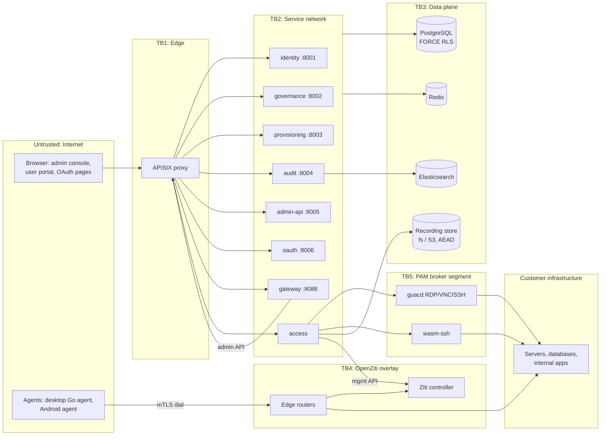

# OpenIDX Threat Model

> **Audience:** security reviewers, auditors, and operators deciding whether
> and how to deploy OpenIDX. **Scope:** the whole platform — the eight Go
> services, the APISIX edge, the OpenZiti overlay, the PAM broker path
> (Guacamole/wasm-SSH/SSH-CA), session recordings, the credential vault, the
> audit pipeline, and the endpoint agents. Every mitigation cited here points
> at code or CI that exists on this commit; nothing below is aspirational.
> If you find a claim the code no longer backs, that is a bug in this
> document — fix the document or the code, never let them disagree.
>
> Companion documents: [SECURITY-TENANCY.md](./SECURITY-TENANCY.md) (the
> tenant boundary in depth), [SECURITY-HARDENING.md](./SECURITY-HARDENING.md)
> (the enforced production config gates),
> [COMPLIANCE-CONTROL-MAPPING.md](./COMPLIANCE-CONTROL-MAPPING.md)
> (SOC 2 / ISO 27001 mapping), and the recurring controls in
> [`docs/evidence/`](https://github.com/mhmtgngr/openidx/tree/main/docs/evidence).
> Nothing here has been verified externally yet: no penetration test has
> been run ([#959](https://github.com/mhmtgngr/openidx/issues/959)).

---

## 1. System overview and trust boundaries

OpenIDX is self-hosted: the operator runs everything below. One deployment
serves many organizations (tenants), isolated at the database.

```mermaid
flowchart LR
    subgraph Internet["Untrusted: Internet"]
        B[Browser: admin console,<br/>user portal, OAuth pages]
        AG[Agents: desktop Go agent,<br/>Android agent]
    end

    subgraph Edge["TB1: Edge"]
        AP[APISIX proxy]
    end

    subgraph Core["TB2: Service network"]
        ID[identity :8001]
        GOV[governance :8002]
        PROV[provisioning :8003]
        AUD[audit :8004]
        ADM[admin-api :8005]
        OA[oauth :8006]
        GW[gateway :8088]
        ACC[access]
    end

    subgraph Data["TB3: Data plane"]
        PG[(PostgreSQL<br/>FORCE RLS)]
        RD[(Redis)]
        ES[(Elasticsearch)]
        REC[(Recording store<br/>fs / S3, AEAD)]
    end

    subgraph Overlay["TB4: OpenZiti overlay"]
        ZC[Ziti controller]
        ZR[Edge routers]
    end

    subgraph Broker["TB5: PAM broker segment"]
        GD[guacd RDP/VNC/SSH]
        WS[wasm-ssh]
    end

    subgraph Targets["Customer infrastructure"]
        SRV[Servers, databases,<br/>internal apps]
    end

    B --> AP --> ID & GOV & PROV & AUD & ADM & OA & GW & ACC
    AG -- mTLS dial --> ZR --> ZC
    Core --> PG & RD
    AUD --> ES
    ACC --> GD & WS
    ACC --> REC
    GD & WS --> SRV
    ZR --> SRV
    GW -- admin API --> AP
    ACC -- mgmt API --> ZC
```

Trust boundaries, from least to most trusted:

| # | Boundary | What crosses it | Primary control |
|---|---|---|---|
| **TB1** | Internet → APISIX edge | All user/API traffic | TLS, security headers, rate limiting, CSRF, CORS gates (`ValidateProduction()` refuses wildcard CORS / disabled CSRF in prod). One deliberate exception: the OAuth/OIDC *protocol* endpoints (token, introspect, revoke, userinfo, device flow, DCR, discovery, JWKS) answer `Access-Control-Allow-Origin: *` because a public client on a relying party's origin must reach them and `*` can never carry cookies (`middleware.OAuthCORS`, `OAUTH_PROTOCOL_CORS_WILDCARD`); the session-carrying login/MFA/consent surface follows `CORS_ALLOWED_ORIGINS` like every other service |
| **TB2** | Edge → Go services | Authenticated requests | RS256 JWT verification (JWKS), role checks per route, org resolution per request |
| **TB3** | Services → data plane | SQL, cache ops, audit events | **FORCE row-level security** on every tenant table; parameterized queries; `tools/orgscope` merge-blocking linter |
| **TB4** | Endpoints → Ziti overlay | mTLS dials to dark services | Ziti PKI (per-identity certs), dial policies derived from app assignments; services have **no public listener** |
| **TB5** | access-service → PAM broker | Proxied RDP/VNC/SSH with injected credentials | Vault checkout (step-up-gated), broker-side credential injection, full session recording |
| **TB6** | Anyone → tenant data of another org | Nothing, by design | `org_id` stamped on the pooled connection at checkout (`internal/common/database/rls.go`); fail-closed — no org context ⇒ zero rows |

The **security spine** every access request walks: *authentication*
(OAuth2/OIDC + MFA + risk) → *assignment* (`internal/appaccess` — the single
predicate) → *enforcement* (proxy route / Ziti dial policy / PAM grant) →
*session control* (revocation markers, kill switch) → *audit* (HMAC-chained
events). The platform invariant is **display == enforcement**: any access a
UI shows must be the access the enforcement points grant
([display = enforcement](https://github.com/mhmtgngr/openidx/blob/main/docs/evidence/display-equals-enforcement.md)).

## 2. Assets

| # | Asset | Where it lives | Loss impact |
|---|---|---|---|
| A1 | Password hashes, TOTP seeds, WebAuthn credentials, push-device bindings | PostgreSQL | Account takeover across a tenant |
| A2 | OAuth tokens & sessions (access ≤1 h, refresh long-lived) | Signed JWTs client-side; session + revocation state in Redis/PG | Impersonation until expiry/revocation |
| A3 | Privileged credentials & SSH CA private key | `vault_secrets` (envelope-encrypted, §4.6) | Direct compromise of customer servers |
| A4 | Session recordings (screen/terminal) | Filesystem or S3, per-chunk AEAD | Disclosure of everything privileged users saw/typed |
| A5 | Audit trail | PostgreSQL (`unified_audit_events`, HMAC chain) + Elasticsearch | Undetectable abuse; failed audits |
| A6 | Tenant separation itself | PostgreSQL RLS policies | Cross-org data breach — the worst case for a shared install |
| A7 | Ziti PKI, service/dial policies | Ziti controller | Network access to every dark service |
| A8 | Platform secrets: JWT signing key, vault/recording KEKs, DB and APISIX admin credentials | Operator's secret store / env / OpenBao | Platform-wide forgery or decryption |

## 3. Adversaries considered

1. **Internet attacker** — no credentials; phishing, credential stuffing,
   token theft, vulnerability exploitation at TB1.
2. **Authenticated end user** — valid account in one org; tries to reach
   apps/servers beyond their assignments or another tenant's data.
3. **Tenant admin** — full rights in their org; tries to cross TB6 or
   erase their own tracks.
4. **Malicious/compromised privileged user** — has PAM grants; tries to
   exfiltrate vault secrets, disable recording, act unattributably.
5. **Infrastructure-level attacker** — reads a stolen disk/backup, or
   compromises Redis or a single service container.
6. **Supply-chain attacker** — poisons a dependency or the build.

Out of scope: a fully compromised PostgreSQL superuser or host root on the
database node (they can disable RLS), physical attacks, and availability
attacks beyond basic rate limiting. Operators needing those assurances get
them at the infrastructure layer (disk encryption, managed DB, DDoS
protection).

## 4. Component analysis (STRIDE)

Each subsection: what can go wrong → what the code does about it.
**Evidence** paths are the load-bearing implementations and their tests.

### 4.1 Authentication (identity + oauth services)

| Threat | Vector | Mitigation |
|---|---|---|
| Spoofing | Credential stuffing, password spraying | Argon2id (bcrypt verified for legacy hashes) via `internal/common/pwhash`; rate limiting; login-anomaly detection; risk scoring adds **+70** when the source IP is on a configured threat list (`internal/risk/service.go` factor `ip_threat_list`), pushing straight past the MFA step-up threshold (≥ 70, `internal/oauth/mfa_policy.go`) |
| Spoofing | Phishing OTPs | WebAuthn/FIDO2 (origin-bound, unphishable) as first-class factor; push MFA with anti-phishing number |
| Spoofing | A TOTP code that was seen or relayed (over a shoulder, in a proxy log, by a phishing page) used again inside its window | A TOTP code is accepted once. Each credential records the time step it last accepted (`mfa_totp.last_step`, migration v207), and `VerifyTOTP` accepts a code only for a later step, in the `UPDATE` that records it, so two requests carrying one code admit one. The same write re-checks the lockout (five wrong codes, fifteen minutes), so guesses sent together cannot outrun it: a right code that arrives as concurrent failures lock the factor is refused. Sign-in, step-up (and so the step-up gate at PAM launch) and the self-service routes all verify through it; enrollment records the step of its confirming code. A hardware token's TOTP and HOTP codes are spent, and its lockout re-checked, the same way through its counter (`internal/identity/totp_replay_testdb_test.go`, `internal/oauth/totp_replay_testdb_test.go`, `internal/identity/lockout_race_testdb_test.go`) |
| Spoofing | Seeded default admin (`admin` / documented password) left in place | **Startup gate**: in production, identity and oauth refuse to boot while the seeded admin (fixed UUID, migration v10) still matches the shipped hash and is enabled — `internal/identity/default_admin_gate.go`, called from both `cmd/identity-service` and `cmd/oauth-service` |
| Tampering | Forged tokens | RS256 asymmetric signing, keys published via JWKS; services verify, never share the private key |
| Tampering | A signed-in user who is not an administrator, or a credential that holds no role, rewrites the organization's OAuth clients (redirect URIs, secret, `api_access`), SAML service providers or SSF streams | The oauth-service's management APIs need the `admin` or `super_admin` role behind their authentication (`requireAdminRole`, `internal/oauth/service.go`); `internal/oauth/management_admin_gate_testdb_test.go` drives every route through the real route table. Dynamic client registration is opened by the initial access token instead and cannot set `api_access` |
| Elevation | Signing in through a social provider (`/oauth/social/callback`) or an enterprise identity provider (`/oauth/callback`, the console's SSO buttons) with a second factor enrolled or an MFA policy in force, so that control of the external account alone is enough | Both ask `evaluateMFA`, the password login's decision (`internal/oauth/external_signin_mfa.go`): a user it would challenge continues to the login page's second-factor step with an MFA session pinned to the offered methods, which `/oauth/mfa-verify` completes; a policy's ended grace period and a risk denial are refused; no code or token is issued before. The social callback's token response without a pending request is only for a user who needs nothing more (`internal/oauth/external_signin_mfa_testdb_test.go`) |
| Elevation | A stolen access token links an account of the thief's as a way to sign in, or unlinks one | Linking (`POST /oauth/social/link/:id/start`) and unlinking (`DELETE /users/me/identity-links/:id`) need the password, or a current TOTP code, on an account that has either, as a factor change does; unlinking removes the link the social sign-in reads, not only the one the profile lists (`internal/oauth/social_link_proof_testdb_test.go`, `internal/identity/identity_link_proof_testdb_test.go`) |
| Tampering | A signed-in user who is not an administrator, or a credential that holds no role, rewrites the organization's OAuth clients (redirect URIs, secret, `api_access`), SAML service providers or SSF streams | The oauth-service's management APIs need the `admin` or `super_admin` role behind their authentication (`requireAdminRole`, `internal/oauth/service.go`); `internal/oauth/management_admin_gate_testdb_test.go` drives every route through the real route table. Their writes take the admin API's step-up gate (`STEPUP_GATE`, `managementStepUp`; `internal/oauth/management_stepup_testdb_test.go`). Dynamic client registration is opened by the initial access token instead and cannot set `api_access` |
| Tampering | A signed-in user who is not an administrator, or a credential that holds no role, rewrites the organization's OAuth clients (redirect URIs, secret, `api_access`), SAML service providers or SSF streams | The oauth-service's management APIs need the `admin` or `super_admin` role behind their authentication (`requireAdminRole`, `internal/oauth/service.go`); `internal/oauth/management_admin_gate_testdb_test.go` drives every route through the real route table. Their writes take the admin API's step-up gate (`STEPUP_GATE`, `managementStepUp`; `internal/oauth/management_stepup_testdb_test.go`). Dynamic client registration is opened by the initial access token instead, registers clients only in the organization `DCR_ORG_ID` names (`internal/oauth/dcr_org_testdb_test.go`), and cannot set `api_access` |
| Elevation | MFA fatigue / bypass | Risk-based step-up; number-matching push; per-secret step-up re-required at vault reveal (§4.6) |
| Spoofing | Guessing an SMS or email code with guesses sent together, each reading the attempt count before any is counted | A challenge counts a guess, and refuses it at `max_attempts`, in the one `UPDATE` that counts it, before the code is compared; the challenge is spent by a conditional status change, so the right code verifies once. The sign-in's and step-up's SMS and email steps and the self-service routes share the verifier (`internal/identity/otp_attempts_testdb_test.go`, `internal/oauth/otp_attempts_testdb_test.go`) |
| Elevation | A stolen access token (the console keeps it in `localStorage`) turns off its owner's second factor, points it at an authenticator of the thief's, adds one of the thief's own, or changes the account's address and resets the password | A self-service change to one's own second factors carries proof from the account holder in the same request: the password, or where the change removes or replaces the TOTP credential, a current code from it (`internal/identity/factor_proof.go`). That covers disabling MFA, removing or replacing TOTP, removing a passkey, push device, SMS, email or phone-call factor, regenerating backup codes, remembering a browser, and adding any factor to an account that has one. A wrong password counts against the sign-in lockout. A first factor on an account with none needs no proof. Changing the account's address needs the password and leaves the new address unverified. A device enrollment's push ticket binds a first factor only. An administrator's resets (bypass codes, set-password, hardware-token unassign) stay admin-only routes (`internal/identity/factor_proof_testdb_test.go`) |
| Spoofing | Anyone names a public client -- the seeded admin console, whose tokens OpenIDX's APIs accept -- at the client credentials grant and is issued an access token | The client credentials grant, like token exchange, admits only a confidential client that presents its secret (`authenticateConfidentialClient`, `internal/oauth/client_auth.go`; `internal/oauth/client_credentials_testdb_test.go`); dynamic registration refuses a public client for either grant |
| Elevation | Whoever holds a user's access token -- the application it was issued to, or anyone it leaked to -- trades it through token exchange (RFC 8693) for a token of another application carrying the user's roles, or keeps it alive past its expiry or its revocation | Token exchange admits only a confidential client registered for the grant that presents its secret; issues a token only for the client itself or an audience an administrator listed for it (`token_exchange_audiences`); refuses a revoked subject or actor token; and issues no more than the subject token had: its organization and roles, a subset of its scope, OpenIDX API access only if the client has it too, no life past its expiry, and its grant time, so the user's revocation cutoff reaches both (`internal/oauth/token_exchange.go`, `internal/oauth/token_exchange_testdb_test.go`) |
| Info disclosure | A directory integration's credential (LDAP or Active Directory bind password, Azure AD client secret, HR system API key) read from the database, a backup or the directory API | Sealed with `ENCRYPTION_KEY` before it is stored, and never returned: reads carry `bind_password_set`, `client_secret_set` or `api_key_set` in its place (`internal/directory/secrets.go`, `internal/admin/service.go`). Only the connection test, the diagnostics, the sync jobs and the login pass-through open it, and one the service cannot open is refused, not sent. An update that leaves it out keeps it only for the same target (host, port, bind DN, TLS and referral settings; tenant and client; HR endpoint), and a sealed value from a client is refused, so the API opens none for a server of the caller's choosing. admin-api seals values earlier releases stored in plaintext when it starts (`SealStoredSecrets`). admin-api, identity-service and oauth-service need the same `ENCRYPTION_KEY` |
| Info disclosure | WebAuthn challenge replay across replicas | Challenges in Redis with 5-minute TTL (`internal/identity/webauthn.go`), in-memory fallback only for single-replica dev |
| DoS / Elevation | An unauthenticated `GET /oauth/magic-link-verify` makes the server bcrypt-compare the token with every pending link in the install (a quarter of a second each), and a link sent for one organization completes a sign-in to another organization's application | A link is found by the SHA-256 of its token (`magic_links.token_lookup`, migration v208) through a unique index, in the organization the request resolved to, and only that row is bcrypt-compared; the pending sign-in must be for an application of the same organization, checked before the link is looked at, and the link is sent to its organization's own host. Links sent before v208 are not found and are asked for again. The magic-link and QR switches are one installation-wide row that only a platform administrator writes (`internal/oauth/magic_link_lookup_testdb_test.go`) |
| Repudiation | "I never logged in" | Every auth decision lands in the HMAC-chained audit stream (§4.8) |

Evidence: `internal/identity/`, `internal/oauth/`, `internal/risk/`
(`scorer_ip_threat_test.go`), `internal/identity/default_admin_gate_test.go`,
`internal/identity/webauthn_session_store_test.go`,
`internal/identity/totp_replay_testdb_test.go`.
`internal/admin/directory_credentials_testdb_test.go`,
`internal/directory/secrets_test.go`.

### 4.2 Sessions and revocation

| Threat | Vector | Mitigation |
|---|---|---|
| Spoofing | Stolen refresh token used after admin revokes the session | Admin revocation (single and revoke-all) writes `revoked_session:<id>` markers to Redis with a 30-day TTL; the oauth refresh grant checks the marker and refuses (`internal/admin/sessions.go`, `internal/oauth/service.go`) |
| Spoofing | Stolen **access** token | Bounded exposure: access tokens live ≤ 1 hour and are not re-checked per request (accepted residual risk R2, §5); the per-user **kill switch** exists for incidents — it severs IAM sessions, PAM sessions, and Ziti dial ability together |
| DoS | Redis down ⇒ revocation silently ineffective | Marker publication failures are surfaced as warnings in the admin API response, not swallowed (`internal/admin/sessions_revoke_test.go` pins this) |
| Spoofing | Stolen access-proxy session cookie used after an admin revokes the session | The proxy and forward-auth read only the session's Redis blob, and revoking a proxy session deletes that blob through the hash the row stores; the idle window's refresh only rewrites a blob that still exists, so it cannot bring a revoked session back, and a delete Redis refuses is answered 503, not 200 (`handleRevokeSession`, `internal/access/proxy_session_revoke_testdb_test.go`) |

### 4.3 Tenant isolation (PostgreSQL, FORCE RLS)

| Threat | Vector | Mitigation |
|---|---|---|
| Info disclosure / tampering | Any query missing an org predicate | **FORCE row-level security** on every tenant table — applies even to the table owner; org stamped per pooled connection (`internal/common/database/rls.go`); fail-closed |
| Elevation | New code forgets the org scope | `tools/orgscope` static linter is **merge-blocking CI**; install-wide paths must carry an audited `//orgscope:ignore` with a justification (e.g. the vault checkout sweeper, `internal/vault/sweeper.go`) |
| Spoofing | Client-supplied `X-Org-ID` abuse | The header is **ignored** unless the caller is a platform admin (`PlatformAdminPredicate`: `super_admin` held in the default organization, `middleware.IsPlatformAdmin`), and every platform-admin cross-org resolution synchronously records a mandatory audit entry before the request proceeds (`internal/common/middleware/tenant_resolver.go`) |
| Elevation | An organization's administrator creates a role named `super_admin` in their own organization to pass as a platform admin | A platform admin is `super_admin` held in the default organization, read from the token's signed `org_id` (`internal/common/middleware/tokenorg.go`); the identity API refuses the role name outside the default organization |
| Elevation | A token or API key of one org presented to a request scoped to another (`X-Org-Slug`, or the default-org fallback) | Access tokens carry `org_id` and API keys their org; every API validator refuses a credential for another org (403) unless its holder is a platform admin, and refuses a token without `org_id` (401). A platform admin's `X-Org-Slug` crossing is audited like `X-Org-ID`'s where the resolver runs after auth (`internal/common/middleware/tokenorg.go`) |
| Info disclosure / tampering | A tenant reads another organization's record or member list or creates organizations through the organization API, or reads and rewrites another's login-page branding, settings and custom domains through `/api/v1/tenants/{orgId}` (`organizations`, `organization_members` and the `tenant_*` tables span the install, outside RLS) | An organization's record and member list are read by its members and a platform admin only; its branding, settings and domains by the organization the request resolved to and a platform admin only; anyone else gets the `404` an unknown id gets, and only a platform admin creates an organization (`requireOrgMember`, `internal/organization/service.go`; `tenantOrgAllowed`, `internal/admin/tenant_branding.go`) |
| Elevation | An organization's owner or admin upgrades its plan, raises its limits or lifts its suspension through `PUT /api/v1/organizations/{id}` | Only a platform admin changes the plan, the status and the limits; an owner or admin may restate them as they are, and a request that would change one is refused whole with `403` naming the fields (`handleUpdateOrganization`, `internal/organization/service.go`) |
| Tampering | An organization's owner or admin lists another organization's users, or ids that name no user, as members in any role string; an admin demotes or removes the owners, or the last owner is removed | A member is a user of the organization (`users.org_id`) in `owner`, `admin` or `member`; another organization's user is answered as no user (`404`), and only a platform admin adds any user. Granting or changing the owner role needs an owner or a platform admin, and the last owner stays (`409`), checked under a lock on the organization's row (`handleAddMember`, `changeMembership`, `internal/organization/service.go`) |
| Spoofing / tampering | An organization's administrator claims a host they do not control -- the install's own sign-in host, or another organization's -- as a verified custom domain, so the public branding endpoint serves their logo, texts and custom CSS on the sign-in page at that host | A claim is verified only when the TXT record `_openidx-challenge.<domain>` holds `openidx-domain-verification=<the claim's token>`, looked up with a 5-second deadline; nothing in the request stands in for it. Unverified claims hold nothing, so a squatter cannot block the owner; one claim per domain can be verified (a partial unique index), and verifying removes other organizations' unverified claims (`handleVerifyTenantDomain`, `internal/admin/tenant_branding.go`; migration v206) |
| Elevation | One organization's admin changes a setting every organization shares (SMS delivery, passwordless defaults, signing keys, the Ziti controller connection, the platform certificate) | Install-wide settings need an **administrator of the default organization**: `admin` or `super_admin` whose own organization, read from `users` rather than from the request, and whose credential's organization are both the canonical default organization, whatever `DEFAULT_ORG_ID` names (`internal/common/middleware/platform_admin.go`). Acting in other organizations needs more: `super_admin` held there (a platform admin) |

Evidence: [SECURITY-TENANCY.md](./SECURITY-TENANCY.md) (policy SQL shape,
known non-org-scoped tables), `internal/common/orgctx/`.

### 4.4 Access model and enforcement points (gateway, Ziti, portal)

| Threat | Vector | Mitigation |
|---|---|---|
| Elevation | User reaches an app they were never assigned | Single assignment predicate `internal/appaccess` consumed by portal display, proxy routes, and Ziti dial policies; enforcement rollout is flag-gated (`ACCESS_ASSIGNMENT_ENFORCE`) with a would-deny **assignment report** to run before flipping (residual R4 until flipped) |
| Spoofing | Direct connection to a protected service, bypassing policy | ZTNA services are **dark**: no public listener; reachable only via an authorized Ziti identity's mTLS dial; `tools/darkprobe` verifies both directions (authorized reaches, unauthorized cannot) |
| Spoofing | Caller forges its own provenance to the upstream (`X-Forwarded-User`, `X-Forwarded-For`, `X-Forwarded-Host`, `X-Ziti-Identity`) | Both proxies own that header namespace: every one of them is **deleted from the outbound request before the verified values are written**, on the route path (`proxyRewrite`, `internal/access/service.go`) and the overlay path (`zitiProxyRewrite`, `internal/access/ziti.go`). Identity comes from the proxy session or the enrolled Ziti identity, never from the request; the client address comes from the resolved peer, never from the caller's claimed chain. `internal/access/proxy_forwarding_test.go` sends a fully forged set through both proxies and asserts on what the upstream receives |
| Tampering | Rogue route/policy injection | APISIX admin API and Ziti management API are reachable only from the service network with dedicated credentials (operator-supplied; see hardening guide). The access service's own route API -- routes, upstream pools, route features, the proxy session list and revocation -- requires the admin role, reads included (`requireAdminRole`, `internal/access/ziti_settings_handlers.go`); `internal/access/route_session_admin_gate_testdb_test.go` drives each of them through the real route table as a plain user, a holder of the `operator` role and an admin |
| Elevation | A signed-in user below the tier the console shows a page at drives the routes behind it: takes control of a device through remote support, admits or removes a device, or reads other users' identities, sessions, devices, posture and the audit trail | Each of those routes is held to its page's tier (`internal/access/role_tiers.go`, the order of `web/admin-console/src/lib/roles.ts`): operator for Remote Support, Agent Fleet, Devices, Users, the Ops Cockpit and Network Topology; auditor, with `compliance_reader`, for the unified audit trail. Remote support also checks that the device, the session and the recording belong to the caller's organization, because the device and the recording store know sessions by id alone. `internal/access/role_tier_gate_testdb_test.go` drives each tier through the real route table |
| Repudiation | "The platform granted that on its own" | Route/policy changes are admin actions in the audit chain |

### 4.5 PAM broker path (guacd, wasm-ssh, SSH CA)

| Threat | Vector | Mitigation |
|---|---|---|
| Info disclosure | Privileged password shown to the user | Broker-side injection: the vault reveal happens server-side at connection setup (`internal/access/pam_entries.go`); for SSH, short-lived certificates (10 min default, 60 min hard cap) signed by a CA whose private key never leaves the vault (`internal/access/ssh_ca.go`) |
| Elevation | Checkout without justification or beyond window | Checkouts carry reason + expiry; a leader-gated sweeper expires overdue checkouts every 60 s cluster-wide (`internal/vault/sweeper.go`); break-glass is a distinct, loudly-audited path (`internal/access/pam_checkout_control.go`) |
| Repudiation | Privileged user denies actions on a target | Full session recording (§4.7) + audit chain; recordings support retention and legal hold |
| Tampering | Disable recording mid-session | Recording is broker-enforced, not client-optional |
| Info disclosure | guacd speaks cleartext protocols inside its segment | **Operator obligation R3**: guacd must be network-isolated with the access service as its only client (see §5 and SECURITY-HARDENING.md) |
| Info disclosure | A route's Guacamole feature password read from the database, a backup or the feature API | Sealed with the access service's `ENCRYPTION_KEY` cipher before it is stored, and never returned: the feature reads carry `guacamole_password_set` in its place (`storedConfigJSON`, `redactFeatureConfig`, `internal/access/feature_manager.go`). An enable that leaves it out reuses it only for the same protocol, host, port and user. Values stored in plaintext by earlier releases are sealed when the access service starts (`SealStoredSecrets`). The vault-backed injection above keeps the password out of the access service altogether |

### 4.6 Credential vault (`internal/vault`)

| Threat | Vector | Mitigation |
|---|---|---|
| Info disclosure | Database leak of `vault_secrets` | Envelope encryption: per-version key = HKDF-SHA256(KEK, `secretID:version`), AES-256-GCM; the derivation context binds each blob to its secret and version, so ciphertext cannot be replayed under another secret (`internal/vault/crypto.go`) |
| Info disclosure | KEK sitting in container env | Optional **OpenBao KEK source**: keys fetched once at boot over verified TLS with a scoped token, **fail-closed** — any error aborts startup rather than silently falling back to env (`internal/vault/openbao.go`); without OpenBao this is residual R1 |
| Elevation | Valid-but-stale session reveals a high-value secret | Per-secret `require_step_up`: reveal refuses with 403 + `X-Step-Up-Required` unless a step-up MFA was completed within a short window (≤ 15 min, pinned by `internal/vault/stepup_test.go`; migration v115) |
| Tampering | Key-rotation gaps | Keyring model: new seals use the active KEK id, old versions decrypt under their recorded id until the operator retires that key — rotation without mass re-encryption |
| Repudiation | Untraceable secret use | Every reveal records who, which secret, and the stated reason (JIT checkout, PAM connect, break-glass) |

### 4.7 Session recordings (`internal/access/recording_crypto.go`)

Explicit in-code threat model: a filesystem-level compromise (backup leak,
stolen disk, mistakenly public path) yields only ciphertext. Each recorder
chunk is AES-256-GCM encrypted under a per-session HKDF-SHA256 key from a
32-byte master keyring; frames carry the key id (rotation-safe), a fresh
random 12-byte nonce (never counter-derived), and a length prefix so a
crash-truncated tail is detected instead of corrupting the recording. The
master key lives in the service's secret config, never on the recording
disk. S3 backend inherits the same framing.

### 4.8 Audit pipeline (`internal/audit`)

| Threat | Vector | Mitigation |
|---|---|---|
| Tampering | Admin edits or deletes audit rows to hide abuse | **HMAC-SHA256 chain linking**: each event carries the previous event's hash; verification walks the chain and flags any break (`internal/audit/logger.go`, `IsTampered`, `VerifyChain`) |
| Repudiation | Disputed admin action | Unified events capture actor, org, action, and context; compliance reports and streaming (WebSocket) are read paths over the same store |
| Tampering (injection) | CRLF sequences in attacker-controlled fields forging log lines | Param-derived log fields are scrubbed of `\n`/`\r` before logging (`scrubLogValue` pattern, mirrored across services; CodeQL `go/log-injection` runs in CI as a gate) |
| DoS | Audit backend down ⇒ silent audit loss | Health/readiness endpoints per service; operational control §5.2 requires verifying a test admin action lands in `unified_audit_events` |

### 4.9 Agents (desktop Go agent, Android)

Enrollment is QR + OAuth; Android adds **Play Integrity** verification
(`internal/access/play_integrity.go`) and posture checks feed policy. Remote
support (WebRTC) sessions are recorded under §4.7's crypto, with retention
and legal hold. TURN credentials are minted short-lived
(`internal/access/turn_credentials.go`). A stolen device holds only its own
Ziti identity: policies limit what it can dial, and the kill switch severs it.

### 4.10 Supply chain and SDLC

| Threat | Vector | Mitigation |
|---|---|---|
| Tampering | Vulnerable or malicious dependency | `govulncheck` (symbol-level, **blocking**), Trivy, Dependabot/Renovate; `security-scan.yml`'s aggregate gate no longer carries `continue-on-error` |
| Tampering | Injected code defect | CodeQL (blocking), Semgrep, merge-blocking Required Checks (build, full tests, integration, orgscope) |
| Info disclosure | Committed secrets | Gitleaks in CI (non-blocking for license reasons — documented); `.env.production` templates use `:?` required-var syntax so compose refuses to start with unset secrets |
| Tampering | Image substitution | Images built in CI with provenance/SBOM attestation; the release checksums and the Helm chart are signed with keyless cosign; the images are not signed yet ([#960](https://github.com/mhmtgngr/openidx/issues/960)) |
| Spoofing | A shipped default names a domain, or a registry or GitHub namespace, the project does not own, so whoever registers it receives what installs send there: the Helm chart's issuer and ingress hosts, the console's support address and WebAuthn fields, Alertmanager's addresses, the welcome mail's link, the SCIM documentation link and the Terraform modules' chart source all did, up to v1.38.0 | No default names one. The chart has no issuer default and requires `config.oauthIssuer`, and refuses any value naming a host under the project's name at .io, .org, .com, .net or .dev (`openidx.rejectPlaceholders`, `deployments/kubernetes/helm/openidx/templates/_helpers.tpl`); `scripts/check-unowned-domains.sh` fails CI when one comes back anywhere in the tree; migration v210 cleared the stored copies of the settings defaults |

## 5. Residual risks and operator obligations

Honesty section — what the platform does **not** absorb for you:

| # | Residual risk | Operator action |
|---|---|---|
| R1 | Vault/recording KEKs in env vars where OpenBao isn't configured | Configure the OpenBao KEK source, or protect env via your orchestrator's secret store; rotate KEKs on the keyring schedule |
| R2 | Access tokens outlive revocation by up to 1 h (markers bite at refresh) | Use the kill switch during incidents; keep the 1 h TTL (don't extend it) |
| R3 | guacd handles decrypted RDP/VNC/SSH inside its segment | Network-isolate guacd; only the access service may reach it; never expose it publicly |
| R4 | `ACCESS_ASSIGNMENT_ENFORCE` is on for a fresh install, but an install from before [#956](https://github.com/mhmtgngr/openidx/issues/956) keeps its own value, which defaults off | Run the rollout (assignment report → assign → enforce) — `docs/plans/2026-08-30-access-and-login-convergence.md` |
| R5 | Redis compromise exposes session/challenge state and could suppress revocation markers | Run Redis with auth + TLS, private network only; watch the revocation-warning path |
| R6 | RLS is the tenant wall; a DB superuser can disable it, and so can SQL running as the application role, by setting `app.bypass_rls` ([#964](https://github.com/mhmtgngr/openidx/issues/964)) | Restrict superuser access, encrypt DB storage and backups, alert on policy changes |
| R7 | DB backups are not encrypted by OpenIDX itself | Encrypt backups at the storage layer; drill restores (`make dr-game-day`) |
| R8 | JWT signing key age is not tracked in code | Rotate ≤ 90 days per operational control §5.2 |

Assumptions: TLS everywhere at TB1 (enforced for DB by
`ValidateProduction()`); operator keeps host OS and container runtime
patched; time is roughly synchronized (TOTP, token expiry).

## 6. Keeping this model true

Re-check this document whenever: a new service or listener appears; a new
secret class is stored; an enforcement point is added or a flag default
flips (especially R4); or a §5 residual is engineered away. The recurring
verification lives in the controls under
[`docs/evidence/`](https://github.com/mhmtgngr/openidx/tree/main/docs/evidence)
— this file explains *why* those controls exist; those files say *when to
run them*; the [control mapping](./COMPLIANCE-CONTROL-MAPPING.md) says
*which audit criteria they satisfy*.
