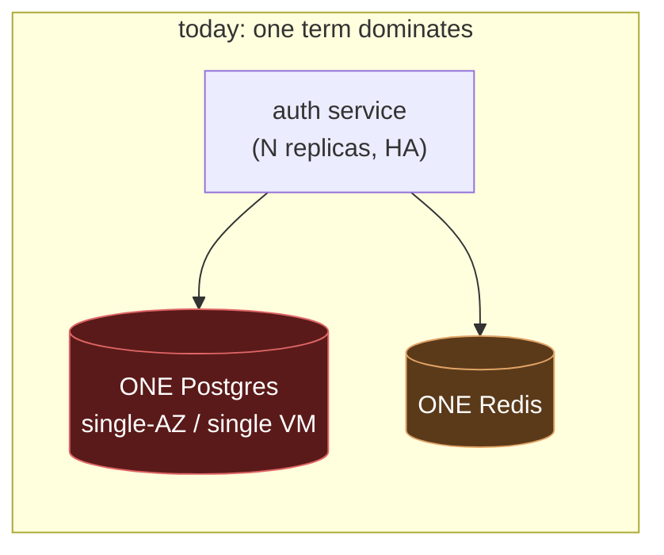
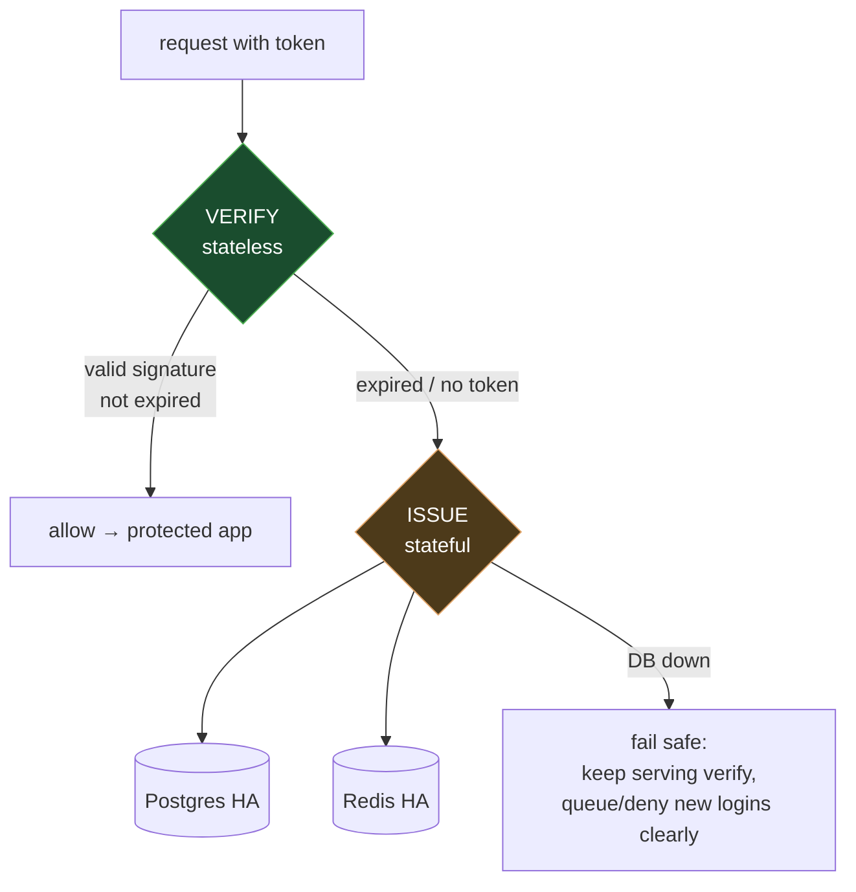

# Always-Available Authentication — A Plan for OpenIDX

> **The framing you gave:** *"micro-services, but a mono-database — a distributed
> monolith. I want microservices at least for availability, because
> authentication is important. I want an always-available system."*
>
> **The honest answer up front:** splitting into more microservices will **not**
> make authentication more available. Availability is bounded by *shared
> dependencies*, and today every service meets at **one Postgres on one VM**.
> Auth is only as available as that database and that box. The work that actually
> buys "always available" is redundancy of the **dependencies auth touches**, plus
> keeping the **verify path** alive even when the **issue path** is degraded.
> This plan does exactly that, in tiers, on top of what the repo already has.

---

## 0. Why "more microservices" is the wrong lever

A microservice boundary buys you three things: independent **deploy**, independent
**scale**, and **fault isolation** — *but only for faults that don't cross the
boundary*. OpenIDX's services already deploy and scale independently. They do
**not** have fault isolation, because they share:

- **one Postgres** (`openidx`, RLS role `openidx_app`) — every service reads/writes it,
- **one Redis** (rate limits, revocation, sessions, locks),
- **one VM** (rootless podman + `systemd --user`) in the current single-box deploy.

Availability composes like a series circuit: `A(login) ≈ A(service) × A(postgres)
× A(redis) × A(VM)`. Adding a ninth service multiplies in *another* term — it can
only lower the product. So the goal is not "more services", it is **fewer shared
single points of failure**, and **graceful degradation** when one is lost.

**Keep the shared DB** (per the system-design review, it is your biggest
simplicity asset and the thing RLS tenant isolation rides on). Make the *database
and the auth read path* redundant instead.

---

## 1. Split auth into two availability classes

The single most important move is conceptual: **authentication is two different
workloads with two different availability profiles.** OpenIDX is already built
this way — we just make it explicit and defend each one separately.

| | **VERIFY path** (validate an existing token) | **ISSUE path** (login, refresh, MFA, consent) |
|---|---|---|
| Question | "Is this caller still allowed in?" | "Prove who you are and mint new tokens." |
| Frequency | Every API request (thousands/sec) | Occasional (login, ~hourly refresh) |
| Dependency today | **Stateless** — RS256 + JWKS, cached 1h (`internal/gateway`, `internal/oauth/signer.go`) | **Stateful** — Postgres (users, sessions, keys) + Redis (revocation, rate limit) |
| If Postgres is down | **Can keep working** (this is the prize) | Fails — cannot safely mint new sessions |
| Target | **99.99%+** — survive a DB outage read-only | **99.9%** — HA the dependencies, fail safe |

**Design principle:** *a database blip must never lock out users who are already
authenticated.* Protected apps stay reachable on cached JWKS + JWT signature +
short-TTL access tokens; only *new logins* and *token refreshes* degrade. This is
what turns "the DB hiccupped" from a **total outage** into a **minor, invisible
brownout**.

---

## 2. What the repo already has (don't rebuild these)

Grounding the plan in reality — these are **done** and the plan builds on them:

- ✅ **Stateless verify** — RS256 JWT + JWKS with a 1h in-gateway cache
  (`internal/gateway/config.go`, `internal/oauth/signer.go`). Verification does
  not hit Postgres.
- ✅ **Leader election** for background loops (`internal/common/leader`, PR #181) —
  so sweeps/schedulers don't multi-run across replicas.
- ✅ **Redis Sentinel failover** support in the DB layer
  (`NewRedisFromConfig`, `internal/common/database/database.go`).
- ✅ **RDS Multi-AZ in prod** (`deployments/terraform/main.tf`: `multi_az =
  var.environment == "prod"`).
- ✅ **Ingress HA** (`deployments/kubernetes/ingress-nginx-values.yaml`: ≥2
  controllers, HPA, AZ spread, PDB, NLB).
- ✅ **Single L7 edge** — gateway-service retired, APISIX is the sole edge (#484).
- ✅ **Multi-replica services** with HPA + PDB + anti-affinity (Helm, values-prod).
- ✅ **DR runbook** — `pg_dump` backups, RPO 1h / RTO 4h (`docs/disaster-recovery.md`).
- ✅ **Right-sized pools**, documented *why not* pgbouncer with RLS (#482,
  `docs/architecture/db-pooling.md`).

**So the K8s path is ~70% there.** The gaps that actually matter for
"always-available auth" are below.

---

## 3. The plan — tiered by availability bought per unit of effort

### Tier 0 — Make the VERIFY path unkillable (highest ROI, do first)

The prize: **existing sessions survive a full Postgres outage.** Small, cheap,
high impact.

1. ✅ **Done — Serve-stale JWKS on refresh failure.** The shared verify path
   (`internal/common/middleware/middleware.go`, used by all 8 services, plus the
   retired gateway's `internal/gateway/middleware/auth.go`) now keeps serving the
   last-good key set when a JWKS refresh fails, bounded by `JWKS_MAX_STALE`
   (default 12h). So even if `oauth-service`/DB is down, in-flight verification
   never breaks. Metrics: `openidx_jwks_refresh_failures_total`,
   `openidx_jwks_serve_stale_total`, `openidx_jwks_stale_seconds`
   (`internal/common/middleware/jwks_metrics.go`); alerts in the
   `openidx.jwks_availability` PrometheusRule group. The oauth JWKS endpoint
   itself serves from an in-memory atomic snapshot, so it does not hit Postgres
   per request — the verify path is DB-independent end to end. Tests:
   `internal/common/middleware/jwks_stale_test.go`.
2. **Keep access-token TTL short, refresh-token TTL long.** Confirm access tokens
   are short-lived (≈5–15 min) and revocation is checked from Redis, not Postgres,
   on the hot path. Long-lived refresh tokens mean a DB brownout is only felt at
   the next refresh, not immediately. *Effort: S — mostly verification.*
3. **Revocation must fail *safe for availability without unsafe for security*.**
   Today rate-limit fails closed on auth paths (good). For **revocation lookups**,
   decide explicitly: on Redis miss/outage, do you (a) trust the short-lived JWT
   (available, tiny risk window = token TTL) or (b) deny (safe, unavailable)?
   Recommend **(a) for access tokens** given their short TTL, **(b) for
   high-value admin scopes**. Document and enforce per-scope. *Effort: M.*
4. ✅ **Done — Liveness/readiness probe split.** Every Helm service pointed BOTH
   its liveness and readiness probe at `/health`, which returns 503 when the
   shared DB is down — so a DB blip would make Kubernetes restart *every* pod at
   once, wiping the warm JWKS caches and turning a brownout into a crash-loop
   outage. Fixed: liveness → `/health/live` (process-only, always 200), readiness
   → `/health/ready` (drains from the LB when the critical DB dep is down) across
   all service templates. The Go handlers already implemented these semantics
   correctly; the probes just weren't using them.

**Exit criteria:** kill Postgres in staging → already-logged-in users keep using
protected apps for at least the access-token TTL; Grafana shows verify success
flat, only issue/refresh error rate rises.

### Tier 1 — HA the ISSUE path's dependencies (the real SPOFs)

4. **Postgres: from Multi-AZ to fast, tested failover.** RDS Multi-AZ is set for
   prod.
   - ✅ **Done — bounded dial + optional statement timeout.** pgx's default
     `ConnectTimeout` was 0 (unbounded), so a runtime reconnect to a *dead*
     primary during an RDS/Patroni failover could hang for the OS TCP timeout
     (minutes), pin the acquiring request, and exhaust the pool — a DB failover
     cascading into a service-wide outage. `internal/common/database` now sets a
     **5s connect timeout** (tunable `DB_CONNECT_TIMEOUT`) so failover fails fast
     and the pool re-dials the promoted primary, plus an **opt-in
     `DB_STATEMENT_TIMEOUT`** (30s in prod values) so a query on a degraded
     primary can't hold a connection open forever. Wired through the Helm
     configmap (`database.connectTimeout` / `database.statementTimeout`), set in
     `values-prod.yaml`. Tests: `internal/common/database/pool_config_test.go`.
   - **Still to do:** add a **failover game-day** to the DR runbook and verify the
     pool reconnects without a service restart. For the **single-VM deploy** this
     is the biggest gap: a single Postgres container on one VM has **no failover
     at all** — see Tier 3. *Effort: M.*
5. **Redis: turn on Sentinel/managed failover in prod paths.** The code supports
   Sentinel; ensure prod actually runs ≥3-node ElastiCache/Sentinel and never the
   single in-cluster Redis. The security-sensitive rate-limit path already
   **fails closed** on auth routes when Redis is unavailable
   (`internal/common/middleware/ratelimit.go`); the divergent in-memory limiter
   the earlier review flagged (`zt_policy_handler`) has since been removed. Keep
   this property under test. *Effort: M.*
6. **Add a read replica and route read-mostly auth queries to it.** Login needs
   the primary (writes a session), but JWKS key reads, discovery, user lookups for
   MFA challenge, and policy reads can hit a **reader endpoint**. This removes read
   load from the primary and gives a warm standby.
   - ✅ **Done — read-pool seam.** `internal/common/database` now opens an optional
     second pool from `DATABASE_READ_URL` and exposes `(*PostgresDB).Reader()`,
     which returns the replica pool when configured and **falls back to the
     primary** otherwise (correct by construction — a call site can always use
     `Reader()` safely). Replica unavailability **never fails startup** (degrades
     to primary-only) and is surfaced by a **non-critical** `database_replica`
     health check (a replica outage degrades health but does not fail readiness).
     Wired via the external-secret store (`externalSecrets.readReplica`).
     Tests: `read_replica_test.go`, `read_replica_checker_test.go`.
   - **Deliberately NOT auto-routed yet.** Query call sites still use the primary
     `Pool`; adoption is intentionally per-query because reading from a lagged
     replica is only safe where read-after-write does not matter. The signing-key
     load path, for instance, must NOT move to the replica (a just-rotated key
     could be missing on a lagged standby). Migrate read-mostly reports
     (audit/governance dashboards) first. *Effort remaining: per-call-site.*

### Tier 2 — Degrade gracefully, don't fall over

7. **Explicit brownout behavior on the issue path.** When Postgres is unreachable,
   `/health/ready` should flip so the LB drains new logins from that replica, but
   the **verify path stays `live`**. Return a clear, retryable `503` with
   `Retry-After` for login (not a 500 stack), so clients back off instead of
   hammering. *Effort: S–M.*
8. **Circuit-breaker + bounded timeouts** on every dependency call in the issue
   path so a slow Postgres/Redis doesn't exhaust the pool and cascade. (pgx pool is
   sized; add per-call `context` deadlines and a breaker around Redis/ES.) *Effort: M.*
9. **Idempotent, replayable side effects.** Refresh-token rotation, session
   creation, and audit writes should be safe to retry after a mid-request failover
   (audit already went async + outbox in #483 — extend that discipline to session
   writes). *Effort: M.*

### Tier 3 — Remove the ultimate SPOF: the single VM

The single-box deploy's real ceiling is **the VM itself** (Postgres, Redis, APISIX,
Ziti all one-of). Two honest paths:

- **3a. Stay single-box, accept the RTO.** Keep the mono-DB, but make recovery
  *fast and boring*: hot standby Postgres via streaming replication to a second
  VM (or managed RDS), automated restore drills, infra-as-code so the box is
  rebuildable in minutes. Cheapest; availability capped at ~99.9%. *Effort: M.*
- **3b. Move prod to the K8s/EKS path you already have.** Multi-AZ nodes, managed
  RDS Multi-AZ + read replica, ElastiCache failover, ≥2 APISIX + clustered etcd,
  ingress HA. This is where "always available" actually lives, and the Helm/
  Terraform is ~70% written. Recommended target for a real "auth is important"
  posture. *Effort: L (mostly wiring + game-days, not greenfield).*

### Tier 4 — Only *then* consider a service split (and only one)

If, after Tiers 0–3, one workload still has a *genuinely different* availability
profile, carve **only that one** out with its own store:

- **Best candidate: audit/event ingestion** — high write volume, eventual
  consistency is fine, and you don't want audit backpressure to ever slow a login.
  It already has an outbox (#483); giving it its own store decouples its failure
  domain from auth.
- **Do not** split identity/oauth off the shared DB — login, MFA, sessions, and
  consent are one transactional story; separating them trades your cheap RLS
  tenant boundary and one consistent story for distributed-transaction pain and
  *lower* availability.

---

## 4. Priority-ordered checklist

| # | Item | Tier | Effort | Buys |
|---|------|------|--------|------|
| 1 | Serve-stale JWKS + staleness alert | 0 | S | Verify survives DB down |
| 2 | Confirm short access-TTL / Redis revocation on hot path | 0 | S | Brownout not outage |
| 3 | Per-scope revocation availability policy | 0 | M | Safe degradation |
| 4 | `/health/ready` flips on issue-path, `live` stays for verify | 2 | S | LB drains cleanly |
| 5 | Prod Redis = Sentinel/ElastiCache, kill in-memory RL fallback | 1 | M | Remove Redis SPOF |
| 6 | Postgres failover game-day + pool reconnect proof | 1 | M | Trust the failover |
| 7 | Circuit breakers + bounded deadlines on issue path | 2 | M | No cascade |
| 8 | Read replica + `DATABASE_READ_URL` read pool | 1 | M–L | Offload + warm standby |
| 9 | Single-box → hot standby OR move prod to EKS path | 3 | M–L | Kill the VM SPOF |
| 10 | (Optional) split audit ingestion to its own store | 4 | L | Isolate write spikes |

Items 1–4 are a few days and deliver most of the felt availability. 5–9 are the
real durability work. 10 is deferred until measurements justify it.

---

## 5. How we'll know it works (verifiable objectives)

Availability claims are worthless without a test that fails when they're false.
Build these into a `make ha-drill` / chaos suite:

- **Chaos game-days:** in staging, kill (a) Postgres primary, (b) Redis, (c) an
  auth replica, (d) the whole VM. Record: did verify stay up? did login return a
  clean 503? did failover complete within RTO? Automate as a scripted drill.
- **SLO dashboards (Grafana):** separate SLOs for `auth_verify_success_rate`
  (target 99.99%) and `auth_issue_success_rate` (target 99.9%), with error-budget
  burn alerts. The split in §1 is only real if it's measured separately.
- **Synthetic probes:** a continuous "log in → call protected API → refresh"
  canary from outside, so brownouts are caught before users report them.

**Definition of done for "always-available auth":** a killed Postgres primary is a
non-event for verification and a <RTO, clearly-degraded event for issuance, proven
by an automated drill in CI/staging — not by assertion.

---

## 6. One-paragraph summary

Don't add microservices for availability; it multiplies shared-dependency risk
instead of reducing it. Split authentication into a **stateless verify path**
(make it survive a full database outage — cheap, highest ROI) and a **stateful
issue path** (HA its Postgres/Redis dependencies and degrade it *safely* to a
clear, retryable brownout). Keep the shared database, remove the single points of
failure it and the single VM represent, and *measure* verify and issue
availability separately so "always available" is a tested fact, not a hope.
