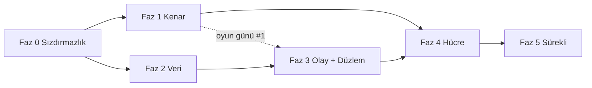

> **Archived record of 2026-09-13.** It is not maintained: [ADR 0001](../adr/0001-product-focus-and-trusted-core.md) froze the programme on 2026-09-23, and the priorities are in [ROADMAP.md](../../ROADMAP.md).

# Küresel Ölçek Dönüşümü — Uygulama Planı

> **⚠️ DONDURULDU — 2026-09-23.** Bu program, proje sahibinin kararıyla ([ADR 0001](../adr/0001-product-focus-and-trusted-core.md))
> **dondurulmuştur.** Buradaki fazlar, takvim ve açık maddeler şu an uygulanmıyor. Öncelikler
> [ROADMAP.md](../../ROADMAP.md)'dedir: M1 "Güvenilir Çekirdek" (v2.0 LTS). **Yeniden başlatma
> tetikleyicisi:** birden fazla bölgeye ihtiyaç duyan ilk müşteri ya da MSP. Belge, tasarım
> referansı olarak korunur; yeni iş eklenmez.
>
> **Tasarım:** `docs/architecture/2026-09-13-global-scale-cell-architecture-and-ddos.md`
> (önce onu oku; bu plan oradan argüman alır, tekrar etmez).
> **Takvim ve kilometre taşları:** `docs/archive/2026-09-13-global-scale-roadmap.md` (fazların haftalara, sprintlere ve karar noktalarına bağlanması).
> **Biçim:** Her görev dosya adı, kabul ölçütü ve onay kutusu taşır. Bir görev
> "bitti" sayılmak için kabul ölçütünün **ölçülmüş** olması gerekir; "yaptım" yetmez
> (`docs/openidx-k8s-always-on.md` §4'ün dersi).
> **Sıra:** Fazlar bağımlılık sırasındadır. Faz 0 ve Faz 1 paralel gidebilir; Faz 2,
> Faz 3'ün önkoşuludur; Faz 4 hepsini bekler.

---

## Küresel kısıtlar

- Her davranış değişikliği bir bayrak arkasında, varsayılan bugünkü davranış
  (depo geleneği: `ACCESS_ASSIGNMENT_ENFORCE`, `STEPUP_GATE` tri-state modeli).
- Migrasyon yüksek su çizgisi **v187**; bu plan v188'den başlar, numaralar görevlerde.
  `DO $$` blokları yok.
- `orgscope` yeşil kalır; RLS entegrasyon testleri (`internal/common/database/rls_enforcement_test.go`)
  her faz sonunda **pgcat arkasında** da koşar.
- `make lint`, `make test`, `make k8s-chaos` (statik) her PR'da; canlı kaos faz kapısında.
- Hiçbir görev PR'ı "kenar sağlayıcı seçimi" gibi ürün kararını sessizce almaz;
  karar ADR'de, PR onu uygular.

## Roller

| Rol | Sahip olduğu fazlar |
|---|---|
| Kenar / Ağ mimarı | Faz 1, Faz 4 yönlendirme |
| Platform / Veri | Faz 0 (Redis, PG), Faz 2 |
| Servis mühendisliği | Faz 3 |
| SRE / Güvenlik | Faz 0 (zaman aşımı, kota), Faz 5, tüm oyun günleri |

---

## Faz 0 — Sızdırmazlık (2 hafta, kod değişikliği küçük, etki büyük)

Amaç: bugün bir kenar sağlayıcısı öne konduğunda **kendini DDoS eden** noktaları kapatmak.
Hepsi tasarım §3 bulgularının doğrudan karşılığıdır.

### 0.1 Redis'i rollere ayır (B2)

**Dosyalar:** `internal/common/config/config.go`, `internal/common/database/database.go`,
`cmd/*/main.go`, `deployments/docker/docker-compose.yml`, Helm `values*.yaml`, `templates/configmap.yaml`
- [x] `REDIS_RATELIMIT_URL`, `REDIS_SESSION_URL`, `REDIS_REVOCATION_URL` konfig alanları; boşsa `REDIS_URL`'e düşer (geri uyumlu).
- [x] `DistributedRateLimit` yalnız ratelimit istemcisini alır; `internal/revocation` tüketicileri revocation istemcisini; `leader` ve login/MFA oturum anahtarları session istemcisini.
- [x] Compose: üç `redis` servisi; ratelimit örneğinde `--maxmemory 256mb --maxmemory-policy allkeys-lru`; diğerlerinde `noeviction` + AOF.
- [x] Helm: `redis.ratelimit/session/revocation` alt-değerleri; prod'da üç ElastiCache/Azure Cache uç noktası (Terraform `modules/elasticache` üç kez).
- **Kabul:** `redis-cli -h ratelimit DEBUG POPULATE 5000000` ile bellek doldurulduğunda login **çalışmaya devam eder** (session Redis etkilenmez); test `internal/common/middleware/ratelimit_isolation_test.go`.

### 0.2 Gerçek IP zinciri (B3)

**Dosyalar:** `deployments/docker/apisix/apisix.yaml`, `deployments/apisix-edge/seed-edge-routes.sh`,
`internal/common/middleware/trustedproxies.go`, Helm `configmap.yaml`
- [x] APISIX global rule: `real-ip` eklentisi, `source: http_x_forwarded_for` **yalnız** `trusted_addresses` içinden; `limit-req`/`limit-count` anahtarı `$remote_addr` (real-ip sonrası).
- [x] `OIDX_TRUSTED_PROXIES` Helm'de kenar CIDR listesini alan bir değerden üretilir (`edge.trustedCidrs` → `OIDX_EDGE_TRUSTED_CIDRS`, servislerde birleştirilir); `*` değeri `ValidateProduction()`'da **reddedilir**.
- [x] CronJob `edge-cidr-sync`: sağlayıcı CIDR listesini çeker, ConfigMap'i günceller, alınamazsa eskiyi korur. *(Sayaç yerine Job başarısızlığı kullanılır: `OpenIDXEdgeCidrSyncFailed` kuralı `kube_job_status_failed` üzerinden; bir CronJob Prometheus sayacı yayamaz.)*
- **Kabul:** İki farklı `X-Forwarded-For` ile aynı kenar IP'sinden gelen istekler **ayrı** kovalara düşer (test `ratelimit_realip_test.go`); güvenilmeyen kaynaktan sahte XFF yok sayılır.

### 0.3 Zaman aşımı ve boyut sertleştirme (B5, Y2)

**Dosyalar:** `cmd/*/main.go` (http.Server), `internal/server/graceful.go`, `deployments/docker/nginx/nginx.conf`, APISIX rotaları
- [x] Tüm servislerde `ReadHeaderTimeout: 5s`, `MaxHeaderBytes: 16<<10`; ortak yapıcı `server.NewHTTP(cfg)` ile tek yerde (bugün her `main.go` kendi yazıyor).
- [x] `http.MaxBytesReader` rota gruplarına: oauth/governance/audit 1 MB, admin-api ve provisioning (SCIM bulk) 5 MB, identity (CSV import) 10 MB; access ve gateway kenara bırakıldı (yayınlanan uygulamaları proxy'ler). *(Audit search GET'tir; gövde sınırı yerine sorgu zaman aşımı Faz 2.4'te.)*
- [x] HTTP/2: `http2.Server{MaxConcurrentStreams: 100}`.
- [x] nginx: `client_body_timeout 10s; client_header_timeout 10s; limit_conn_zone ... limit_conn perip 50; http2 on`.
- [x] APISIX: her rotada `limit-conn` (ISSUE 200, ADMIN 100, VERIFY 1000 eşzamanlı), `proxy_read_timeout` düzlem başına; ISSUE `retries: 0`.
- **Kabul:** `slowhttptest -c 2000 -H` origin'e karşı: sağlıklı istek p99 < 2× baseline. *(Uygulamada `openidx_http_header_timeout_total` sayacı eklenmedi: Go `http.Server` başlık zaman aşımını olay olarak dışa vermez; birim testi bunun yerine yavaş başlığın `ReadHeaderTimeout` içinde kesildiğini ölçer — `internal/server/http_test.go`.)*

### 0.4 `/health/ready` ve `/metrics` dışa kapansın

- [x] APISIX'te `/health/*`, `/metrics`, `/ready` için `priority: 100` rota → 404; iç ağdan probe'lar doğrudan pod'a.
- **Kabul:** Kenar üzerinden `GET /health/ready` → 404; K8s probe'ları yeşil.

### 0.5 HPA açık ve doğru sinyal (Y1)

**Dosyalar:** Helm `values-prod.yaml`, `templates/hpa.yaml`
- [x] `autoscaling.enabled: true` tüm servislerde; `behavior.scaleUp` 60 s'de ×2, `scaleDown` 300 s stabilizasyon.
- [x] Geçici: CPU %60 (KEDA Faz 3'te gelir).
- **Kabul:** `k6` ile 3× baseline yük → 2 dk içinde replika artar, p99 SLO içinde kalır.

### 0.6 CORS tutarlılığı (O1, O2)

- [x] `cmd/oauth-service/main.go:159-170` satır içi CORS kaldırılır; `ValidateProduction()`'ın izin verdiği ortak CORS middleware'i kullanılır; OAuth için `*` **bilinçli** istisna ise `OAUTH_CORS_WILDCARD=true` bayrağı ve belgede gerekçe.
- [x] APISIX rotalarındaki CORS kopyaları (compose 11, loader 7) tek global rule'a; protokol uçları (token, introspect, revoke, userinfo, discovery) rota seviyesinde `*` — tasarım gereği, çerez taşımaz. *(Kiracı alan adlarından dinamik üretim Faz 4.1 kiracı dizini ile gelir.)*
- **Kabul:** `docs/THREAT-MODEL.md` TB1 satırı kodla uyuşur; kiracı origin listesi `apisix.yaml`'da **tam bir kez** geçer (test: `deployments/docker/apisix_test.go`).

### 0.7 Redis kaybında ISSUE için kademeli düşüş

**Dosya:** `internal/common/middleware/ratelimit.go`
- [x] Redis hatasında auth yolları için replika-yerel sayaç (kota/`RATE_LIMIT_REPLICA_HINT`), süre `RATE_LIMIT_LOCAL_FALLBACK_MAX` (varsayılan 60 s), sonra kapalı-başarısız; `openidx_rate_limit_local_fallback_seconds` gauge; `OpenIDXRateLimitOnLocalFallback` uyarısı 10 s'de.
- **Kabul:** Redis restart (10 s) sırasında login başarı oranı > %99; 60 s'ten uzun kesintide 503 (test `ratelimit_fallback_window_test.go`).

**Faz 0 çıkış kapısı:** Yukarıdaki yedi kabul ölçütü staging hücresinde ölçülmüş;
`docs/architecture/...-ddos.md` §3'te B2, B3, B5, Y1, Y2, O1, O2 satırları "kapandı" işaretli.

**Durum (2026-09-13):** Yedi görevin kodu birleşti; her biri kendi commit'inde ve
birim/entegrasyon düzeyinde ölçüldü (testler: `internal/common/database/redis_roles_test.go`,
`internal/common/middleware/ratelimit_{isolation,realip,fallback_window}_test.go`,
`internal/server/http_test.go`, `deployments/docker/{apisix,nginx,routes,config}_test.go`,
`deployments/apisix-edge/seed-edge-routes.test.sh`; Helm: lint + kubeconform 64/0).
**Staging ölçüm günü henüz yapılmadı** — k6/slowhttptest/`DEBUG POPULATE` ölçümleri bir
hücre gerektirir. M0 bu ölçüm yapılıp `docs/evidence/` altına yazılınca ilan edilir;
kod bitmiş olması M0 değildir.

---

## Faz 1 — Küresel kenar ve origin gizleme (4–6 hafta)

### 1.1 Kenar sağlayıcı modülü (ADR-3)

**Dosyalar:** `deployments/terraform/modules/edge-cloudflare/`, `modules/edge-aws/` (CloudFront + Shield Advanced + WAFv2), `modules/edge-azure/` (Front Door Premium)
- [x] Ortak arayüz: girdi `edge_hostnames[]`, `zone_domain`, `origin_hostname`, `rules_file`; çıktı `edge_cidrs[]`, `origin_verification` (mTLS CA / gizli başlık / `X-Azure-FDID`), `edge_hostname`. Kök: `deployments/terraform/edge` tek `edge_provider` değişkeniyle seçer.
- [x] Her modül `terraform validate` ile CI'da (`.github/workflows/terraform.yml`): kök + cloudflare + azure; aws kök üzerinden (us-east-1 alias gerektirir).
- [x] Kural seti Git'te: `modules/edge-common/rules.json` (§5.3 tablosu); `deployments/terraform/edge_rules_test.go` her kuralın tabloda adlandırıldığını ve boyut sınırlarının Go tabanıyla eşit olduğunu doğrular.
- **Kabul:** Üç modül aynı kök girdisiyle `terraform validate` geçer (ölçüldü: 3/3); kural seti belgede ve kodda aynı (test). *`terraform plan` gerçek hesap ister — K1 verilince.*

### 1.2 Origin gizleme (§5.2)

**K1 = Azure Front Door Premium** olduğu için origin gizleme mTLS ile değil, **iki katman** ile yapılır (Cloudflare seçilseydi Authenticated Origin Pulls tek başına yeterdi):

- [x] **Ağ katmanı:** AKS alt ağına NSG — yalnız `AzureFrontDoor.Backend` servis etiketi 80/443'e girebilir, `Internet` açıkça reddedilir (`deployments/terraform/azure/main.tf`). Servis etiketi, elle kopyalanmış CIDR listesinin aksine Azure tarafından güncel tutulur. Çıktı: `origin_locked_to_front_door`.
- [x] **Uygulama katmanı:** servis etiketi **her kiracının** Front Door'unu kabul eder, bu yüzden origin ayrıca "hangi Front Door" sorusunu sorar: `X-Azure-FDID` = profil GUID'i. Ingress `configuration-snippet` ile 403 döner (`edge.originVerify.*`; yarı yapılandırma render'ı düşürür), APISIX kenarı için `EDGE_ORIGIN_VERIFY_HEADER/VALUE` global `request-validation` kuralı. Controller'da `allow-snippet-annotations: "true"` (1.9'dan beri varsayılan kapalı — açılmazsa annotation sessizce yok sayılırdı).
  - [x] **Yer tutucu interlock'u (2026-09-19 ölçüldü):** `values-prod.yaml` GUID'i `REPLACE-WITH-FRONT-DOOR-PROFILE-GUID` olarak gönderiyordu ve `required` yalnızca boşluğa bakar; `values-prod.yaml` + `cells/eu-1.yaml` render'ı (rollout-cell.yml'in kurduğu şekil) snippet'i bu harfi harfine dizeyle karşılaştırıyordu — kenardan gelen HER isteğe 403, render "başarılı". Artık `templates/no-placeholders.yaml` (`openidx.rejectPlaceholders`) tüm değerleri (liste ve alt-chart dâhil) yürür ve `REPLACE-WITH` taşıyan ilk dizede yolunu adlandırarak düşer. Kümeye ulaşmayan render'lar (lint, statik kaos drill, imaj denetimi) override'ı komut satırında verir, values dosyasında değil. Üç hücre dosyası değerin kendilerine ait olduğunu söylüyor. Bu GİZİL bir kusurdu (henüz gerçek hücre yok), canlı değil; ama rollout yolunun ilk kullanımında canlı olurdu.
- [x] Origin hostname'i kamuya yayınlanmaz; **ama** CT log'u hostname'leri yayınladığı için "kimse bilmiyor" bir kontrol sayılmaz — kontrol yukarıdaki iki katmandır.
- **Kabul:** Sağlayıcı dışı IP'den origin'e istek → NSG'de reddedilir; servis etiketinden gelen ama `X-Azure-FDID` taşımayan istek → **403**. *(Render ve seed düzeyinde ölçüldü: annotation üç durumda da doğru — kapalı/açık/yarı; canlı `curl` ölçümü M1 oyun gününde.)*

### 1.3 Önbellek ve statik yük

- [x] SPA hash'li varlıklar `Cache-Control: public, immutable` + 1 yıl (üç nginx yapılandırmasında: üretim imajı, geliştirme imajı, kenar kutusu); `index.html` `no-cache` (güvenlik başlıkları tekrarlanarak — nginx `add_header` birleştirmez); `/.well-known/openid-configuration` 3600 s ve `jwks.json` 300 s başlıkları zaten handler'larda vardı. **Bulgu:** compose TLS proxy'sindeki `proxy_cache_valid` yıllardır zone'suzdu — hiçbir şey önbelleklenmiyordu; `openidx_edge` zone'u tanımlandı, `proxy_cache_lock` + `use_stale` eklendi.
- **Kabul:** 100k rps JWKS floodu → origin'e ≤ 10 rps. *(Kenar sağlayıcısı önbelleği `edge-common/rules.json` `cache_rules` ile geldi; ölçüm oyun günü #1'de.)*

### 1.4 Bot direnci ve hesap-başına sayaç (Y3)

**Dosyalar:** `internal/common/middleware/ratelimit.go`, `internal/risk`, `internal/oauth/service.go` (handleLogin), `internal/stepup`
- [x] `login_fail:{org}:{sha256(username)}` sayacı (session Redis, `internal/botgate`); eşik `LOGIN_FAIL_CHALLENGE_AFTER` (5) / `LOGIN_FAIL_WINDOW_SECONDS` (900) → `403 challenge_required`; kenar skoru `X-Edge-Bot-Score` (eşik altı → ilk hatadan önce challenge); Cloudflare Turnstile doğrulayıcı (`TURNSTILE_SECRET`), `challenge_token` ile yeniden gönderim.
- [x] Bayrak `BOT_GATE=off|observe|enforce`; observe modunda karar `unified_audit_events`'e `bot_gate` eylemiyle (`would_challenge`); `ReportModeGates` sayımına eklendi.
- [x] **Kalan kalem kapandı (2026-09-16): login sayfası artık challenge'ı GERÇEKTEN sunabiliyor** — ve oraya varmak için, talimatı imkânsız kılan iki şeyin düzeltilmesi gerekti.
    - **ÖNCE NE VARDI.** `403 challenge_required` gövdesi "doğrulamayı tamamlayıp yeniden deneyin" diyordu. O yanıtta ne bir challenge adı ne de bir site key vardı, ve Turnstile widget'ı site key olmadan çizilemez — açık anahtar yapılandırmada HİÇ YOKTU, yalnız gizli olan vardı. Yani sayfanın tek hamlesi cümleyi basmaktı: kişi talimatı okuyor, yapacak bir şey bulamıyor ve kendisini az önce reddeden sayaca geri deniyordu. **Birine, yapmasının yolunu vermediği bir şeyi yapmasını söyleyen bir kontrol, işini yapmadan başarı bildiren bir kontrolle aynı kusurdur; yalnızca kullanıcı yönünde arızalanır.**
    - **SITE KEY ARTIK REDDİN YANINDA GİDİYOR.** Yeni `TURNSTILE_SITE_KEY` (`config.turnstileSiteKey`; gizli depoda değil, chart'ta — zaten challenge gören her tarayıcıya sunuluyor). Kapı `ChallengeSiteKey()`'i yalnız bir DOĞRULAYICI da yapılandırılmışken cevaplıyor, çünkü **her yarım tek başına bir çıkmaz**: doğrulayıcı var site key yok = bugün sevk edilen hâl; site key var doğrulayıcı yok = daha kötüsü, çünkü çalışıyor gibi görünür — widget çizilir, kişi çözer, `Check` doğrulayıcı olmadığı için token'ı YOK SAYAR ve onu en başta reddeden sayaca düşer. Çıkışı olmayan bir döngü, kilitlenme gibi değil bozuk giriş gibi okunur. Metin de anahtarı izliyor: anahtar varsa "doğrulamayı tamamlayın", yoksa "birkaç dakika bekleyin" — yumuşak kilidin gerçekten olduğu şey.
    - **BİR ALT KATMAN: tarayıcının yüklemesine izin verilmeyen challenge.** Turnstile, `challenges.cloudflare.com`'dan gelen ve kendini aynı kaynaktan bir iframe içinde çizen bir script; yani `script-src 'self'` + `frame-src` yokluğu **iki yarıyı da** engelliyor — sessizce, tarayıcıda, buradaki her test geçtikten çok sonra. Üç nginx yapılandırması ölçüldü: sevk edilen konsol imajının kullandığı `nginx/admin-console.conf` HİÇ CSP koymuyor (orada bugün çalışırdı); SPA'yı kendisi sunan `oidx-nginx/nginx.conf` ve `conf.d/openidx.tdv.org.conf` ise engelleyen birer CSP koyuyor. **Üçte ikisinde CANLI, gizil değil.** Artık login BELGESİNİ sunan bloklarda tek bir sabitlenmiş kaynağa izin var; statik varlık bloğu dar politikayı koruyor ve bir test onu orada tutuyor.
    - **Konsol yarısı:** `TurnstileChallenge` bileşeni + login sayfasının işlemesi. Widget çözülünce kişinin ZATEN yazdığı kimlik bilgileri `challenge_token` ile yeniden gönderiliyor — kapı parolayı kontrol etmeden ÖNCE reddetti, yani onlarda yanlış olan bir şey yoktu; yeniden yazdırmak, başkasının tahmin denemeleri için onları ikinci kez cezalandırmak olurdu.
    - **ON mutasyon kırmızı, İKİ no-op kontrol yeşil, üç ayrı suit:** reddin site key'i düşürmesi; challenge çizilemezken eski cümlenin dönmesi; kapının doğrulayıcısız site key vermesi; sayfanın anahtarı yok sayması, anahtarsız widget çizmesi, `challenge_token`'ı düşürmesi ve her hatada widget çizmesi; `frame-src`'ın düşmesi; kaynağın belge yerine statik varlık bloğuna eklenmesi; iki belge yapılandırmasından birinin atlanması. CSP muhafızı İKİ YÖNLÜ türetiliyor: widget kaldırılırsa, izin artık kullanıcısı olmayan bir genişletme diye bildiriliyor.
- **Kabul:** 10.000 IP'den hesap başına 3 deneme simülasyonu (k6) → 5. denemede challenge; meşru kullanıcı (doğru parola) challenge görmez. *(Birim testte ölçüldü: `internal/botgate/botgate_test.go` — adres bağımsız 6. deneme challenge, doğru parola sayaç sıfırlar; k6 senaryosu 1.5'te.)*

### 1.5 DDoS oyun günü #1

- [x] `test/load/ddos/` altında altı k6 senaryosu: JWKS flood, token flood (geçersiz client), login spray, slowloris, SCIM bulk, audit search; ortak `common.js` VERIFY p99 (<30 ms) ve ISSUE meşru başarı (>%99) eşiklerini paylaşır. `scripts/ddos-drill.sh` (`--check` kümesiz sözdizimi+yapı doğrular, canlı koşu STAGING url'sine karşı, üretim/loopback reddedilir), `scripts/ddos-drill.test.sh`, `make ddos-drill`, CI adımı.
- [x] Runbook `docs/runbooks/ddos-under-attack.md` (tasarım §5.7'nin tam sürümü: alarm sinyalleri, kenar "under attack", dar kaynak kesimi, ADMIN'den ISSUE'ya kaynak, hücre hedefi, ters sırayla stand-down).
- [ ] **Kalan (canlı koşu):** k6 + STAGING hücresi gerektirir. `--check` ve self-test CI'da yeşil; gerçek "VERIFY p99 değişmedi / ISSUE > %99" ölçümü **oyun günü M1'de** `docs/evidence/`'e yazılır.
- **Kabul:** Her senaryoda VERIFY p99 < 30 ms **değişmez**; ISSUE meşru trafik başarı > %99; olay zaman çizelgesi belgelenir. *(Senaryolar ve eşikler kodda; ölçüm oyun günü M1.)*

---

## Faz 2 — Veri katmanı (6–8 hafta)

### 2.1 RLS `SET LOCAL` refactor (B1, ADR-4)

**Dosyalar:** `internal/common/database/rls.go`, `database.go`, yeni `tx.go`, `tools/orgscope`
- [x] `database.WithTx(ctx, fn)`: `BEGIN` → `set_config(..., true)` (SET LOCAL; `SET LOCAL app.org_id = $1` geçerli SQL değil, parametreli `set_config` kullanılır) → fn → `COMMIT`. Tek-ifade sorgular için `db.Exec/Query/QueryRow` sarmalayıcıları; `Query`/`QueryRow` işlemi satırların ömrü boyunca açık tutar ve `Close`/`Scan` ile kapatır.
- [x] `beforeAcquire` kancası bayrakla kapatılır: `RLS_MODE=session|local` (varsayılan `session`); yedi servis başlangıçta `SetRLSMode` çağırır (migrate hariç: DDL, tek bağlantı, bypass).
- [x] **Tasarım değişti — daha güvenli ve çok daha küçük.** Plan 1.950 çağrı yerinin elle taşınmasını öngörüyordu; **her atlanan satır sessizce kapsamsız bir sorgu** olurdu (FORCE RLS altında sıfır satır döner, test kırmızıya dönmez). Bunun yerine kapsam **tipe** taşındı: `database.ScopedPool` (`scopedpool.go`), `PostgresDB.Pool`'un tipi. Metot kümesi `*pgxpool.Pool` ile aynı olduğu için **1.933 çağrı yeri tek karakter değişmeden** kapsamlı hale geldi; soru "bu satırı hatırladık mı?" yerine "derleniyor mu?" oldu. Derleyici 11 değer-geçişi yerini buldu; her biri tek tek incelendi (`Raw()` = kurulum-geneli/istatistik, arayüz = kiracı tablosu okuyanlar). **Bulgu:** `audit.CrossOrgAuditor` bypass bağlamıyla yazıyor — `Raw()` verilseydi local modda hiç işaret taşımaz ve zorunlu çapraz-org denetim satırı `WITH CHECK` tarafından reddedilirdi; arayüze çevrildi.
- [x] **`orgscope` `Raw()` kuralı** (`tools/orgscope/rawpool.go`). Üç bulgu: (1) `Raw()` üzerinden erişilen kiracı tablosu — **SQL'de `org_id` yazması bulguyu temizlemez**, çünkü politika onu `current_setting('app.org_id')` ile karşılaştırır, kapsam yoksa satır görünmez; (2) `Raw()` üzerinden yapılan, SQL'i okunamayan bir çağrı (bu depoda sorgular çoğunlukla değişkende) → **kapalı düşer**, `Begin()` dahil; (3) vetlenmemiş bir fonksiyona verilen kapsamsız havuz — `rawHandoffAllowed` kaydı, her girdi gerekçesiyle (`installWideTables` ile aynı desen). Kaçış yolu aynı `//orgscope:ignore <gerekçe>`. CI kapısı artık `./internal ./cmd` (meşru handoff'lar `cmd/`'de yaşıyor). 16 test; ayrıca gerçek ağaçta mutasyonla doğrulandı.
- [x] **Bulgu — 2.1b'nin bıraktığı gerçek delik: `Reader()`.** Tip değişimi `db.Pool`'u kapsamlı yaptı ama `Reader()` çıplak `*pgxpool.Pool` döndürmeye devam ediyordu. Replika yapılandırılmadığında `Reader()` birincile düşer, yani **hiçbir şey bozulmadı, hiçbir şey derlenmedi bile denemedi** — ve local modda ~12 okuma yolu sorgusu (kullanıcı id/kullanıcı adı/e-posta ile, oturumlar, gruplar, oauth istemcileri) hiç `app.org_id` taşımayacaktı. FORCE RLS altında bu hata değil, **sıfır satır**: login "böyle bir kullanıcı yok" derdi. `Reader()` artık `*ScopedPool` döndürüyor; **tek bir üretim çağrı yeri** (`WithReadTx`) derlemeyi kırdı, kalan ~12'si değişmeden kapsamlı hale geldi. Gerçek Postgres'e karşı ölçüldü (`TestScopedPool_ReaderIsScopedToo`) ve `Reader().Raw()` mutasyonuyla kırmızıya döndüğü (`no rows in result set`) doğrulandı.
- [x] `rls_local_test.go` iki modda da koşar, **tek bağlantılı** havuzda (pooler'ın yarattığı şekil): iki kiracı dönüşümlü 25 tur, 200 eşzamanlı okuma, sızıntı = 0; commit sonrası kapsam bağlantıda kalmıyor (pooling'i güvenli kılan özellik); çapraz-kiracı yazma `WITH CHECK` ile reddediliyor; hata yollarında bağlantı sızıntısı yok. Süit **superuser rolü reddeder** (Postgres superuser'ı her politikadan muaf tutar — aksi halde kemer kesikken de yeşil yanardı) ve iki mutasyonla kırmızıya döndüğü doğrulandı. CI işi: `rls-isolation`.
- **Kabul:** Kanarya hücrede `RLS_MODE=local` 2 hafta; `orgscope` yeşil; sızıntı testi 0.

- [x] **Kapsam linti artık GÖREMEDİĞİ bağlantıları da sayıyor — ve oradan canlı bir kusur çıktı (2026-09-16).**
    - **ORGSCOPE'UN KÖR NOKTASI, ÖLÇÜLDÜ.** `Raw()` kuralının iki sorusu da bir `ScopedPool`'dan başlıyor, çünkü 2.1b kapsamı O TİPE koydu. `pgx.Connect` ya da `pgxpool.New` ile açılan bir bağlantı hiç ScopedPool OLMUYOR — ne `Raw()` ne `Pool`, başka bir nesne — yani iki soru da ona hiç sorulmuyor. Lint işaretli kapıyı bekliyordu, yanındaki duvarı değil. `internal/` ve `cmd/` altında test dışı ALTI dosya böyle bağlantı açıyor; her biri artık "işinin taşıyacak kiracısı yok" gerekçesiyle kütükte, yenisi ise o cümle yazılana kadar bloklayan bir bulgu.
    - **KÜTÜK İLK KOŞUSUNDA YAZARINI YAKALADI.** Ölçümden değil hafızadan yazdığım üç girdi — `cmd/migrate/main.go` (veritabanına `Raw()` üzerinden gidiyor, doğrudan bağlantıyla değil) ve `internal/common/database` altındaki iki dosya (kuralın zaten atladığı yer; o paket kapsamı KURAN paket) — `TestTheDirectConnRegisterDoesNotRot` tarafından tek tek bildirildi. Yaptığını söylemeyen bir girdi, gözden geçirilmiş bir karar gibi okunur ve değildir.
    - **VE SAYIMIN GÖTÜRDÜĞÜ CANLI KUSUR.** `cmd/rekey` her kiracının şifreli kolonlarını yeniden şifreliyor, yani kiracılar arası bypass'a ihtiyacı var — ve onu TEK bir `pool.Exec` ile, en iyi çaba, hatası atılarak alıyordu. `set_config(..., false)` OTURUM kapsamlı: bir backend'e ait, havuz ise çok backend. Gerçek sunucuda ölçüldü: o tek `Exec`'ten sonra onu sunan bağlantı `app.bypass_rls = "on"`, aynı havuzdan ikinci bir bağlantı `""` bildirdi. Sonraki bağlantıya düşen her sorgu bypass'sız koşar ve `FORCE ROW LEVEL SECURITY` altında bu bir hata değil, **SIFIR SATIR**. Hiçbir şey görmeyen bir rekey hiçbir şey yazmaz, "0 rekeyed" basar, 0 ile çıkar; bir sonraki KEK rotasyonu da hâlâ canlı veriyi çözen bir anahtarı emekli eder.
    - **Gizil mi canlı mı:** havuzun aynı bağlantıyı geri verip vermemesine bağlıydı — bu binary'nin sıralı işinde genelde veriyor, bir bağlantı yaşlanır ya da eşzamanlı bir şey koşarsa vermiyor. Havuzun keyfine dayanan bir doğruluk, bu depoda güvenilen değil YAZILAN türdendir. Bypass artık `AfterConnect`'te: havuzun açtığı HER bağlantı taşıyor; ve binary hâlâ kiracılar arası okuyamıyorsa hiç başlamıyor — "SET hata vermedi" ile "satırları görüyorum" farklı iddialar olduğu için veritabanına ne doğru diye soruyor.
    - **Altı mutasyon kırmızı, temel yeşil:** bypass'ın bağlantı başına yerine havuzda bir kez alınması (kusuru YENİDEN ÜRETİYOR ve yeni test yakalıyor); görebilme kontrolünün sabit "evet"e bağlanması; bildirilmemiş yeni bir doğrudan bağlantı; taşınmış bir dosyayı adlandıran kütük girdisi; gerekçenin inceltilmesi; ve lintin `pgx.Connect`'e kör edilmesi. **YEDİNCİSİ HİÇ UYGULANMADI** — düzenleme tutmadı, suit yeşil kaldı; bu sinyal değil ve tekrarlandığı not edildi. `pgxpool.New`'i kör etmek de bir şey kanıtlamadı, sebebi ölçüldü: `cmd/rekey` bu değişiklikte `NewWithConfig`'e taşındı, yani o yazılışı kullanan dosya kalmadı. **Kurucu listesi bir SÖZLÜK, sayım değil** — dosya artık bunu yazıyor.
    - rekey kontrollerinin `ci.yml`'de kendi adımı ve adlandırılmış `--- PASS:` kontrolleri var.

- [x] **Zamanlayıcıyı ölçen bir testi, kodu ölçen üç testle değiştir (2026-09-16).** `main`'de `323f692`'te `Go CI` kırmızıya döndü: `TestOnlyOneReplicaClaimsACertificateRotation`. Doğru cevap ne "flake" ne de rotasyonda bir kusurdu.
    - Test iki replikayı tek sertifikada yarıştırıp **tam birinin** geri çekilmesini şart koşuyordu. Burada ölçüldü: **20 koşuda 6 başarısızlık.** Sebep yapısal. `RotateCertificate` `UPDATE ... SET status='rotating' WHERE id=$1 AND status='active'` ile talep alıyor ve bu talep dışlayıcı — ama testin kullandığı CA yolu (Ziti denetleyicisi olmadan tamamlandığı için seçilmiş) sertifikayı reddedip `revertCertStatus` çağırıyor ve satırı doğrudan `active`'e geri koyuyor. Talep mikrosaniyeler sürüyor. İkinci replikanın geri çekilip çekilmemesi, `UPDATE`'inin o pencereye düşüp düşmemesine bağlı: yani **"iki eşzamanlı replikadan tam biri geri çekilir" hiçbir zaman kodun bir özelliği değildi** — zamanlayıcının özelliğiydi.
    - Yerine doğru olan üç şey kondu: **tutulan bir talep herkesi dışlar** (talep yarışılarak değil doğrudan tutulmuş hâlde; kaybedilecek pencere yok) ve geri çekilme `errRotationNotClaimed` olmak zorunda, çünkü izleyicinin log seviyesi tam bu ayrımdan seçiliyor; **bırakılan bir talep yeniden alınır** — eski iddianın neden tutamayacağının sebebi: CA sertifikasında ardışık iki talep iki no-op'tur, çift rotasyon değil; ve **her serpiştirmede**, her yarışmacı ya geri çekilmiştir ya talebi alıp CA'yı reddetmiştir (üçüncü bir sonuç yok) ve satır her hâlükârda `active` kalır, çünkü `rotating`'de park etmiş bir sertifikayı hiçbir replika bir daha eline almaz.
    - **30 koşuda 0 başarısızlık** (öncesi: 20'de 6). Dört mutasyon kırmızı, bir no-op kontrol yeşil: talebin `AND status='active'`'i kaybetmesi; reddin sertifikayı `rotating`'de park etmesi; geri çekilmenin `errRotationNotClaimed`'i sarmalamayı bırakması; ve bir CA sertifikasının başarıyla döndürülmüş gibi bildirilmesi. CI adımının adlandırılmış `--- PASS:` kontrolleri de güncellendi — hiçbir şeyin aramadığı, adı değişmiş bir test, o kontrollerin önlemek için var olduğu sessiz atlamanın ta kendisidir.

### 2.2 pgcat transaction pooler

**Dosyalar:** Helm `templates/pgcat.yaml`, `_helpers.tpl`, sekiz servis şablonu, `prometheus-rules.yaml`, `values.yaml`, `.github/workflows/helm.yml`
- [x] pgcat ×2, `pool_mode = "transaction"`, `maxUnavailable: 0`, PDB `minAvailable: 1`, düğümler arası anti-affinity. **Varsayılan kapalı.**
- [x] **Kilit (override yok):** `pgcat.enabled=true` iken `config.rlsMode != "local"` ise chart **render olmayı reddeder**. Gerekçe ölçüm: kenar durumu değil, `docs/evidence/2026-09-13-rls-transaction-pooling.md` §1. İkinci ret: `preparedStatementsCacheSize = 0` (pgcat'in **kendi varsayılanı**) → tek sorgu koşturamayan bir filo.
- [x] **Yönlendirme chart'ın işi, operatörün değil.** Sekiz istek-sunan Deployment `DATABASE_URL`'ı `<release>-pgcat:6432`'ye çevirir (`env`, `envFrom`'u yener); **migrate Job'ı, bootstrap hook'u ve backup CronJob'ı doğrudan DSN'de kalır** — hiçbiri transaction pooling'de yaşamaz (migrasyonun advisory lock'u session kapsamlı, `pg_dump` tek oturumda tek anlık görüntü ister). Plan bunu "operatör `DATABASE_URL`'ı çevirir" diye bırakıyordu; bu, hiçbir şeyin kullanmadığı ya da yarısının kullandığı bir pooler demekti.
- [x] Bağlantı bütçesi `replicaCount × poolSize` = 2 × 40 = **80, sabit** (poolerʼsız: `8 × replika × DB_MAX_CONNS`, HPA ile çarpılır).
- [x] Görünürlük: pgcat Prometheus exporter'ı açık + kendi ServiceMonitor'ı; `OpenIDXPoolerClientsWaiting` (havuz tükendi → istek kuyrukta) `OpenIDXDBPoolSaturation`'ın yerini alır, `OpenIDXPoolerNoRedundancy` veritabanının önündeki yeni tek hata noktasını korur. Metrik adları pgcat v1.2.0 kaynağından doğrulandı (`pgcat_pools_*`).
- [x] CI: "The transaction pooler is safe by construction" — beş iddia (varsayılan kapalı, iki ret, sekiz servis yönlendirildi, Job'lar yönlendirilmedi, `pgcat.toml` TOML olarak ayrışır ve `prepared_statements_cache_size` **pool** bölümünde). **Her biri koruduğu şey kırılarak** kırmızıya döndürüldü.
- [x] **Plan'dan sapma — `DB_MAX_CONNS` 10 → 4 yapılmadı.** Pooler'ın arkasında bu sayı artık Postgres'i korumuyor; pooler'a açılan *ucuz istemci* bağlantılarını boyutluyor. Düşürmek yalnızca servis içi eşzamanlılığı kısardı, backend sayısını değil. Gerekçe koda ve `values.yaml`'a yazıldı.
- [x] **Bulgular (hepsi kaynak/registry denetiminden, çalışan pgcat'ten değil):** `1.1.1` etiketi **yok** (registry'de tek sürüm etiketi `v1.2.0`); `prepared_statements` diye bir `[general]` anahtarı yok ve pgcat bilinmeyen anahtarları **sessizce yok sayıyor**; imajda `ENTRYPOINT` yok (`CMD ["pgcat"]`), yani yalnız `args` vermek binary'yi TOML dosyasıyla değiştiriyordu. Üçü de `helm lint`, `helm template` ve kubeconform'dan geçiyordu.
- [ ] **Kalan:** `values-prod.yaml`'da açılması, Terraform RDS `max_connections`, ve asıl ölçüm.
- **Kabul:** ISSUE HPA 30 replikaya çıkarken PG bağlantı sayısı sabit. *(Ölçülmedi — kanarya kapısı geçerli: `RLS_MODE=local` 2 hafta + `orgscope` bitmiş olmalı. `docs/architecture/db-pooling.md` "the chart ships the pooler" notuyla güncellendi.)*

### 2.3 Okuma replikası varsayılan (ADMIN)

- [x] **Önce kabul kriterinin kendisi yalandı, onu düzelttik.** Üç yerde (`Reader()` yorumu, sağlık denetleyicisi, `values-prod.yaml`) "replika kaybında trafik şeffafça birincile düşer" yazıyordu. Bu **yalnızca açılışta** doğruydu: `NewPostgres` replika havuzunu açamazsa `readPool` nil kalır ve `Reader()` sonsuza dek birincili döndürür. Havuz bir kez açıldıktan sonra `Reader()` onu koşulsuz veriyordu — saat 03:00'te ölen bir replika (failover, yeniden başlatma, ağ bölünmesi, RDS bakım penceresi) o replikaya yönlenmiş **her okumayı, süreç yeniden başlatılana kadar** düşürürdü. Replika denetleyicisi tasarımı gereği kritik olmadığı için readiness bu süre boyunca yeşil kalırdı.
- [x] **Gerçek geri düşüş** (`internal/common/database/readerfallback.go`): replika havuzu birincile bir referans ve bir devre kesici taşır. **Altyapı hatası** (bağlantı reddi, kırık boru, havuz tükendi) → çağrı birincide yeniden denenir; `Reader()` sözleşme gereği salt-okunur olduğu için yeniden deneme güvenli. **`PgError`** → sunucu *cevap verdi*; sorgu hatalı ve birincide de aynı şekilde hatalı olurdu — buna **25006 (salt-okunur işlemde yazma)** dahil, ki bu "`Reader()`'ı asla yazma için kullanma" kuralını uygulanabilir tutan şeydir (aksi halde yazma sessizce birincile yönlenirdi). Üç ardışık altyapı hatasından sonra kesici 30 sn açılır; kesinti başına istek başına bir başarısız çevirme değil, soğuma başına bir tane maliyeti olur. Soğuma bitince kesici kapanmaz, **tek bir yoklama** geçirir.
- [x] **Ölçüldü, iddia edilmedi:** gerçekten dinlenmeyen bir porta bakan replika havuzuyla `QueryRow`/`Query`/`Begin` hepsi cevap vermeye devam ediyor — birinciden, ve **hâlâ kiracı-kapsamlı**; kesicinin açıldığı da doğrulanıyor (`TestReaderFallback_deadReplicaStillServesReads`). Ters yön de: cevap veren bir replika kendi okumasını sunuyor, etrafından dolaşılmıyor. Üç mutasyonla kırmızıya döndürüldü (bağlama yok, kesici hiç açılmıyor, `PgError` altyapı hatası sayılıyor).
- [x] Görünürlük: `openidx_db_replica_fallback_total{reason}` ve `openidx_db_replica_breaker_open`; `OpenIDXReadReplicaOffloadLost` (kesici 5 dk açık → offload kayıp, istekler iyi) ve `OpenIDXReadReplicaFlapping` (kesici oturmadan sürekli geri düşüş → her istek yolunda boşa bir çevirme). `make ha-drill` yeni bir bölüm kazandı.
- [x] **Bulgu — `rls-isolation` CI işi `-run 'RLS'` çalıştırıyordu**, ve `TestScopedPool_*` bu üç harfi içermiyor: 2.1b'nin ~1.950 çağrı yerinin kapsamlı olduğunu kanıtlayan süit **CI'da hiç koşmamıştı**. Regex genişletildi ve dört testin adı tek tek "PASS etti mi" diye denetleniyor (`-run` hiçbir şeyle eşleşmezse 0 ile çıkar — sessiz yeşil).
- [ ] **Kalan — `values-prod.yaml` `readReplica: true` YAPILMADI.** Adım 1 (mağazaya `database-read-url` yazmak) olmadan bayrağı açmak, ExternalSecret'ı var olmayan bir anahtara referans verdirir ve **tüm gizin** senkronizasyonunu düşürür — taze bir cutover'da her bağlantı dizesini. Varsayılan, kurulabilen olmalı; açma adımı runbook'ta.
- [ ] **ADMIN düzlemi sorgularının `Reader()`'a taşınması — 1. parti yapıldı (2026-09-13).** Analitik/pano yüzeyi: `analytics_enhanced.go`, `risk_analytics.go`, `predictive_analytics.go`, `dashboard.go` — **26 okuma**, sıfır yazma. Hepsi `audit_events`, `login_history`, `user_sessions` ve `users` üzerinde gün/saat/hafta kovalarına göre toplulaştırma; bir konsol grafiği bir saniyelik gecikmeyi gösteremez. Bunlar aynı zamanda **en pahalı** ADMIN sorguları, yani offload'ın var olma sebebi.
  - **Varsayılanda davranış değişmiyor:** `Reader()` replika yapılandırılmamışken `db.Pool` döndürüyor, yani `readReplica` kapalı her kurulumda çağrı birebir aynı havuza gidiyor.
  - **Muhafaza iki yönlü** (`internal/admin/replica_offload_test.go`), çünkü yalnız biri akla geliyor: (a) bildirilen bir dosya **yalnız** replikayı kullanmalı ve **yazmamalı** — `Reader()` üzerinden yazma sunucuda 25006 ile reddedilir, yani hata üretimde çıkar, CI'da değil; (b) bildirilmemiş bir dosya `Reader()`'a **hiç dokunamaz** — bir sorgunun, gecikmeye dayanıp dayanmadığına kimse karar vermeden geçişte offload edilmesini durduran şey bu.
  - Her girdi **neden** gecikmeye dayandığını yazmak zorunda; "bu bir okuma" gerekçe sayılmıyor (bir oku-yazdıktan-sonra da okumadır) ve test 30 karakterden kısa gerekçeyi reddediyor.
  - **Kanıt:** dört mutasyon kırmızı — bir okumayı birincile geri almak, offload edilmiş dosyaya yazma sızdırmak, bildirilmemiş bir dosyayı replikaya geçirmek, gerekçeyi boşaltmak.
  - **2. parti (aynı gün):** `ai_intelligence.go` (8) ve `pam_overview.go` (7) — 15 okuma daha. İkisi de tam okuma: risk ortalamaları, uyarı sayıları, sır/rotasyon/erişim-talebi sayaçları. Hepsi geçmişin özeti, hiçbiri bir şeye karar vermiyor.
  - **Sayımın ikinci yarısı eklendi: `stayOnPrimary`.** Okuması olup yazması olmayan bir dosya, yukarıdaki testlerin aynısını geçtiği için *offload edilebilir görünüyor* — ama hepsi değil. `dsar_processor.go` bir **worker**: `data_subject_requests`'i birazdan üzerinde işlem yapacağı iş için yokluyor, yani gecikmeli bir replika ona başka bir replikanın aldığı talebi verir ya da bekleyen birini gizler — ders kitabı oku-yazdıktan-sonra. `tilequery.go` ise **çağıranın verdiği SQL'i** koşan genel bir yardımcı; onu offload etmek bütün çağıranları aynı anda, kimsenin okumadıkları dahil, offload etmek olurdu. Gerekçeler yazıldı ki bir sonraki parti bunları yeniden türetmek zorunda kalmasın.
  - **Yeni muhafız — karar verilmemiş dosya kalamaz** (`TestEveryReadOnlyFileIsDecided`): okuması olup yazması olmayan her dosya iki listeden **tam birinde** olmak zorunda. Hiçbirinde olmayan dosya, karar verilmemiş dosyadır; bir sonraki kişinin tahmin etmesi böyle başlar.
  - **Kanıt (2. parti):** iki mutasyon daha kırmızı — offload edilmiş bir dosyayı listeden düşürmek, ve birincide kalması gereken worker'ı replikaya geçirmek (bu ikisi *iki ayrı testten* birden yakalanıyor).
  - **3. parti: sayım tamamlandı, ve sınır ölçülerek bulundu (aynı gün).** Kalan 22 dosyanın **hepsinde yazma var** ve hepsi CRUD yüzeyi. Bu önemli, çünkü konsol yazmadan sonra ne yapıyor: TanStack Query uygulaması ve değiştirdiği listeyi **anında geçersiz kılıyor**. Sayıldı: **384 `invalidateQueries` çağrısı, 81 dosyada** — mutasyon yapan 90 dosyanın neredeyse tamamı. Yani bu ekranlarda "liste" gecikmeye dayanan bir okuma **değil**; POST döndükten milisaniyeler sonra yapılan bir oku-yazdıktan-sonra. Bir yönlendirme kuralı oluşturup tazelenen listede göremeyen yönetici beklemez, bir daha oluşturur.
  - **Dosya düzeyinde 2.3 burada bitiyor:** 1. ve 2. parti sınırın diğer tarafındaki her şeyi aldı; geriye dosya düzeyinde aday kalmadı. Yirmi iki dosyanın her biri gerekçesiyle `stayOnPrimary`'de, ve sayım artık **okuması olan her dosyanın** iki listeden tam birinde olmasını şart koşuyor (yalnız salt-okuma olanların değil). Bir yazması da olan dosya yine de bir karar gerektiriyor; karar neredeyse hep aynı, ve onu yazmak bir sonraki kişinin yeniden türetmesini engelliyor.
  - **Sıradaki adım "fonksiyon düzeyi sayım" sanılmıştı; ölçüm onu çürüttü.** Bu dosyalarda okuyup hiç yazmayan **132 fonksiyon** ve onlarda **194 sorgu** var — kalan fırsat gibi görünüyor, ta ki adları okunana kadar: `handleListAIAgents`, `handleGetAttestationCampaign`, `handleListRecommendations`. Bunlar tam da oku-yazdıktan-sonra olan okumalar. Yazma aynı fonksiyonda değil, `handleCreateX`'te; ilişki konsolun **oluştur-sonra-tazele** akışında kuruluyor ve iki işleyiciye yayılıyor. Yani "bu fonksiyon yazmıyor" ölçütü, yapılmaması gereken hamlelere tam olarak izin verirdi.
  - **Ölçüt yapısal değil, anlamsal:** mesele *ekranın* ne yaptığı ve bunu Go kaynağının hiçbir şekli karara bağlayamaz. Gerçekten kalan (kimsenin az önce yazmadığı tarihsel toplamlar üzerindeki işleyiciler — `ispm GetPostureTrends`, `mfa_management MFAEnrollmentStats` gibi) ekran ekran, konsola bakarak, o kartın bir mutasyondan sonra tazelenip tazelenmediğini söyleyebilecek biri tarafından karara bağlanmalı. *(Bu cümlenin son yarısı — "daha fazla makine yardımcı olmaz" — 4. partide yanlış çıktı; düzeltmesi aşağıda.)*
  - **Kanıt (3. parti):** iki mutasyon daha kırmızı — bir CRUD dosyasını karar listesinden düşürmek, ve güvenlik-kritik `settings_repository.go`'yu replikaya geçirmek (ikincisi yine iki ayrı testten yakalanıyor).
  - **4. parti (2026-09-14): "daha fazla makine yardımcı olmaz" yarısı yanlıştı.** *Go kaynağı üzerinde* makine yardımcı olmuyor — o kısım doğru. Ama ölçüt konsolun ne yaptığıysa ve **konsol bu depoda duruyorsa**, ölçütün makinel bir cevabı var: TanStack Query uygulamasında bir kart, bir mutasyon onun anahtarını geçersiz kılıyorsa tazelenir, kılmıyorsa tazelenmez. Bu bir sezgi değil, konsolun oku-yazdıktan-sonra tanımının kendisi — ve grep'lenebilir.
  - **Karar, kanıtıyla birlikte.** İki işleyici taşındı: `ispm.go` `handleGetPostureTrends` (`ispm_scores` üzerinde 90 günlük anlık görüntü, grafik olarak çiziliyor) ve `mfa_management.go` `handleMFAEnrollmentStats` (kiracı genelinde faktör başına kayıt sayıları). Her iki anahtar da (`ispm-trends`, `mfa-enrollment-stats`) konsolda **tam bir kez** geçiyor — kendi `useQuery`'sinde — ve **hiçbir `invalidateQueries` çağrısında geçmiyor.
    - `ispm-trends`: tarama (`scan`) bugünün satırını *yazıyor*, ama `['ispm-score']` ve `['ispm-findings']` geçersiz kılıp bu anahtarı kılmıyor. Yani grafik taramadan sonra zaten tazelenmiyor; bir saniyelik replikasyon gecikmesi, ekran yeniden kurulana kadar süren bir bayatlığın yanında görünmez.
    - `mfa-enrollment-stats`: bu ekran **politika** yazıyor, kayıt değil — kayıt, kullanıcının kendi self-servis akışında, başka bir serviste yazılıyor. Ekrandaki üç mutasyonun üçü de `['mfa-policies']` geçersiz kılıyor. Bu `mfa_*` tablolarına dokunan tek ADMIN yazması `privacy.go`'daki DSAR silme ve o başka bir ekranda, başka anahtarlarla.
  - **Muhafaza: zincirin tamamı çivilendi** (`offloadedHandlers`, `internal/admin/replica_offload_test.go`). Konsol anahtarı → `queryFn`'in çektiği URL → `service.go`'daki rota kaydı → işleyici → replika. Halkalardan biri kopsa gerekçe artık var olmayan bir ekranı anlatıyor olurdu. En önemlisi: **konsolda bu anahtarlardan biri geçersiz kılınmaya başlarsa test kırmızıya döner** — değişiklikle aynı depoda, aynı CI'da. Dosya düzeyi sayımın veremeyeceği özellik bu: karar, dayandığı şey her kımıldadığında makinece yeniden denetleniyor.
  - Ayrıca `invalidateQueries()` (argümansız — **her şeyi** tazeler) artık bildirilmek zorunda: tek örneği `tenant-selector.tsx`, ve o bir oku-yazdıktan-sonra değil, kiracı bağlamının değişmesi. Bildirilmemiş yeni bir tanesi testi düşürür, çünkü offload edilmiş her kartı sessizce oku-yazdıktan-sonra hâline getirecek şey tam olarak odur.
  - **Birincide kalan dosyada tek tek işleyici muhafazası sayarak çalışıyor, yasaklayarak değil:** dosyadaki `.Reader()` sayısı, bildirilen işleyici gövdelerindeki sayıyı aşarsa test düşer. Yani "bu dosya zaten izinli" diye ikinci bir sorgu sessizce replikaya kayamıyor.
  - **2.3'ün ölçülmemiş varsayımı da ölçüldü (aynı gün).** `Reader()` üzerinden bir okuma çıplak bir `SELECT` değil: `RLS_MODE=local`'da `BEGIN` + `set_config('app.org_id', …, true)` + `SELECT`. Replika ise yazma saydığı her şeye 25006 diyor. Bu şekil reddedilseydi kırılan tek bir işleyici olmazdı — `values-prod.yaml` `readReplica: true` yaptığı gün **offload edilmiş altı dosyanın hepsi birden** kırılırdı. `default_transaction_read_only=on` oturumuyla (aynı sunucu, aynı ret) ölçüldü: iki işleyici de cevap veriyor, **kiracı-kapsamlı** kalıyor, ve okudukları havuz bir yazmayı gerçekten 25006 ile reddediyor. CI'ya kendi adımı eklendi.
  - **Kanıt (4. parti): on bir mutasyon kırmızı.** Konsol tarafı: taramaya `['ispm-trends']` geçersizleştirmesi eklemek; bildirilmemiş argümansız `invalidateQueries()`; anahtarı yeniden adlandırmak; `tenant-selector` girdisini düşürmek; konsol yolunu kırmak (boş dizinde her iddia sessizce geçerdi). Go tarafı: işleyiciyi `db.Pool`'a geri almak; aynı dosyada bildirilmemiş ikinci bir `.Reader()`; `service.go`'da rotayı yeniden adlandırmak. Ölçüm tarafı: replikayı salt-okunur olmaktan çıkarmak; okuma havuzunu hiç açmamak; işleyiciden `WHERE org_id = $1`'i düşürmek.
  - **5. parti (2026-09-16): iki işleyici daha, ve ölçütün İKİ DELİĞİ — ikisi de türetilerek bulundu.**
    - **DELİK 1: sayım TILE hakkında konuşuyor, replikaya taşınan ise HANDLER.** İşleyici katmanı, bildirilen ANAHTARIN konsolda tek yerde bildirildiğini ve hiçbir şeyin onu geçersiz kılmadığını denetliyordu. Ama bir işleyici bir ROTA'ya cevap verir ve o rotayı birden fazla kart, birden fazla anahtar altında çekebilir. `internal/admin` rotalarını çeken her `useQuery` türetildi: **`/api/v1/security-alerts` iki farklı anahtarla çekiliyor** — ops kokpitinde `['ops-security-alerts']` (hiçbir şey geçersiz kılmıyor) ve iki başka ekranda `['security-alerts']` (bir mutasyon geçersiz KILIYOR). `handleListSecurityAlerts`, kokpit hakkında tamamen doğru bir cümleyle bildirilebilir ve dosyadaki her testi geçerdi; diğer ekranlar ise kendi yazmalarından sonra okurdu. **GİZİL, CANLI DEĞİL:** bugüne kadar bildirilen iki işleyicinin hiçbiri rotasını paylaşmıyor. Tam da BU partide canlı olurdu, çünkü `/security-alerts` yalnız konsol ölçütüne bakınca "güvenli" görünen adaylardan biri. Yeni muhafız (`TestOffloadedHandlerRoutesAreFetchedOnlyUnderTheDeclaredKey`) bildirilen bir işleyicinin rotasını çeken HER anahtarın bildirilen anahtar olmasını şart koşuyor.
    - **DELİK 2: `invalidateQueries` bir kartı tazelemenin tek yolu değil.** `useQuery` bir `refetch()` döndürüyor ve o, hiçbir şeyi geçersiz kılmadan o bileşenin sorgusunu yeniden çekiyor. Yani "bu anahtarı hiçbir mutasyon geçersiz kılmıyor" GEREKLİ ama YETERLİ değil. Ölçüldü: konsolda **yedi `refetch()` çağrısı**, altısı bir Yenile düğmesinin `onClick`'inde — taze veri isteyen bir operatör bir oku-yazdıktan-sonra değildir; replikada ne varsa onu alır, bir saniye önce tıklasa da alacağı şeyi — ve **hiçbiri bildirilen bir anahtarı taşıyan dosyada**. Bu da gizil; yine de not düşülmek yerine muhafaza altına alındı, çünkü birim DOSYA ve `refetch()` o bileşendeki `useQuery` örneğine bağlı.
    - **Parti: iki işleyici.** `mfa_management.go handleListUserMFAStatus` (`['mfa-user-status', page]`) — bir önceki partide taşınan kartla aynı ekranda; ekranın üç mutasyonu da politika CRUD'u ve üçü de `['mfa-policies']` geçersiz kılıyor. `notification_management.go handleNotificationStats` (`['notification-stats']`) — ekranın **yedi** mutasyonunun her biri `['routing-rules']` ya da `['broadcasts']` geçersiz kılıyor. Bu kartın içinde **son beş yayının önizlemesi** var ve keskin kenar orada: bir yayın gönderildiğinde bu kart ZATEN tazelenmiyor, yani sayfa yeniden kurulana kadar bayat; bir saniyelik replikasyon gecikmesi o bayatlığın içinde görünmüyor. Gerekçe bu; "yazan yok" değil.
    - **Anahtar eşleyici artık ÖN EK kabul ediyor.** `mfa-user-status` sayfalı (`['mfa-user-status', page]`) ve TanStack ön ekle geçersiz kılıyor; yalnız tek elemanlı biçimi eşleyen bir regex bu katmanın sayfalı bir ekran hakkında hiçbir şey söyleyememesi demekti — ki ekranların çoğu sayfalı.
    - **Salt-okunur replika yolu testi iki işleyiciyi daha kapsıyor:** gerçek PostgreSQL oturumunda `default_transaction_read_only=on` ile cevap veriyorlar, **kiracı-kapsamlı** kalıyorlar, ve okudukları havuz hâlâ bir yazmayı 25006 ile reddediyor. CI adımı zaten adlandırılmış kontrolü taşıyor.
    - **SEKİZ mutasyon kırmızı, tur başına bir NO-OP KONTROL yeşil.** Sayım tarafı: kokpit anahtarını gerekçe göstererek `handleListSecurityAlerts`'i bildirmek (yeni muhafız kırmızı ve diğer ekranın adını veriyor); bildiren ekrana `refetch()` eklemek; bir okumayı `db.Pool`'a geri almak; yayın gönderiminin `['notification-stats']`'i geçersiz kılmaya başlaması; rotanın `service.go`'da yeniden adlandırılması; ön ek toleransının kaldırılması; `mfa_management.go`'da bildirilmemiş ikinci bir `.Reader()`. Veritabanı tarafı: bir okumanın `WHERE org_id` filtresini kaybetmesi.
    - **BİR MUTASYON YEŞİL KALDI VE SEBEBİ YİNE TESTTEYDİ.** Yedek kod alt sorgusundan `b.user_id = u.id` korelasyonunu düşürmek `ada`'nın sayısını değiştirmiyor — çünkü bu kiracının kullanılmamış kodlarının hepsi zaten onun. İddia, iki dalın aynı cevabı verdiği tek satırı okuyordu. Artık hiç kodu olmayan `grace` de denetleniyor ve mutasyon kırmızıya dönüyor. **Yeşil kalan bir mutasyon bazen sorgu hakkında değil, İDDİA hakkında bir olgudur.**
- **Kabul:** `make ha-drill` replika kaybında ADMIN birincile düşer, ISSUE etkilenmez. *(Geri düşüşün kendisi ölçüldü ve drill'e eklendi. Kod tarafı 4. partiyle bitti: dosya düzeyi sayım kapalı, fonksiyon düzeyi kalan iki kalem kanıtıyla taşındı, ve okumaların salt-okunur bir sunucuda çalıştığı ölçüldü. Geriye yalnızca **dağıtım** adımı kalıyor: mağazaya `database-read-url`, sonra `values-prod.yaml` `readReplica: true`.)*

### 2.4 Düzlem başına PG rolü ve `statement_timeout`

- [x] **Migrasyon v189** (plan v188 diyordu; o numarayı `temp_link_pam_entry` almış): `openidx_issue` (2 s), `openidx_admin` (10 s), `openidx_event` (30 s). Hepsi `IN ROLE openidx_app` ile yaratılıyor — v53'ün DML izinlerini **ve onlarla birlikte v37 FORCE RLS politikalarını** miras alıyorlar (politikalar `TO openidx_app` verildiği için, o ayrıcalıklara sahip her role uygulanır). Yani bir düzlem rolü `openidx_app` kadar kiracı-kapsamlı; daha az yetkili olabilir, daha fazla asla. `NOBYPASSRLS` yine de tek tek yazılı: kemeri sessizce atlayan bir rol **hata vermez, her kiracının satırını döndürür**.
- [x] **Neden rol, neden DSN parametresi değil.** `statement_timeout` bağlantı başına da verilebilirdi (`options=-c statement_timeout=2000`) ve daha küçük bir değişiklik olurdu — ama o zaman DSN'de yaşar, yani kimsenin diff'lemediği bir values dosyasında yanlış olmaya bir kopyala-yapıştır uzaklıktadır ve veritabanına "bu servis ne yapabilir" diye sormanın yolu yoktur. Role bağlıyken **sunucunun bir özelliği**: `\drds` listeler, operatör bir gizi düzenleyerek kaybedemez, gece 3'te o rolle açılan bir psql oturumunda da yürürlüktedir.
- [x] **Neden uygulama zaman aşımı yetmez.** Context iptali Go çağrısını terk eder; backend CPU'yu yakmaya ve kilitleri tutmaya devam eder. Sorgu *çalışırken* onu durdurabilecek tek katman veritabanıdır.
- [x] **Plandan sapma — `idle_in_transaction_session_timeout` da eklendi** (60 s/120 s/300 s). Yalnız `statement_timeout` önemsizce atlatılır: `BEGIN`, bir hızlı sorgu, sonra işlemi açık tut — backend çivilenir, kilitleri durur, vacuum en eski anlık görüntüyü geçemez. Değerler bilerek çok daha gevşek, ki yalnızca gerçekten takılmış işi yakalasın.
- [x] **Ölçüldü:** gerçek PostgreSQL'e karşı üç rol de kendi kiracısını görüyor, diğerini görmüyor, çapraz-kiracı yazma reddediliyor ve hiçbiri `BYPASSRLS` taşımıyor; ADMIN rolünde 15 s'lik sorgu **sunucu tarafından ~10 s'de iptal ediliyor** (test 10,05 s sürüyor) ve bağlantı iptalden sağ çıkıyor; ISSUE bağımsız (kendi girişi, kendi 2 s'si). Dört mutasyonla kırmızıya döndü — en önemlisi `BYPASSRLS`: rol o anda **iki kiracının da satırlarını görüyor**.
- [x] CI: `rls-isolation` işine yeni adım (süperuser DSN'i gerektirir — `CREATE ROLE` tam da uygulamanın kendi rolünün yapamadığı şey, ki v53'ün amacı bu). Üç testin adı tek tek "PASS etti mi" diye denetleniyor.
- [x] **Bulgu — roller migrasyona ait değil, bootstrap hook'una ait.** İlk hâli `CREATE ROLE` yapan düz bir migrasyondu; `TestMigrationsRunAsLeastPrivilegedOwner` onu **`permission denied to create role` ile düşürdü** ve haklıydı: migrasyon Job'ı veritabanı *sahibi* olarak bağlanır, Bitnami alt-chart'ının yarattığı düz `NOCREATEROLE` bir login rolüdür — `CREATE ROLE`, `GRANT` ve `ALTER ROLE ... SET`'in üçü de orada reddedilir. Bu yüzden roller v53'ün `openidx_app`'i gibi **süperuser bootstrap hook'unda** yaratılıyor; v189'un her ayrıcalıklı ifadesi "zaten öyle mi?" ile korunuyor, yani hook koştuktan sonra migrasyon yalnızca `pg_roles` ve `pg_db_role_setting` okuyup hiçbir şey değiştirmiyor. Ayrıcalıklı DSN'li harici veritabanında işi kendisi yapar; ayrıcalıksız ve ön-yaratımsız bir kurulumda **yüksek sesle düşer** — v53'ün belgelediği sözleşmenin aynısı. Ayrıca önceden var olan bir düzlem rolü `BYPASSRLS` taşıyorsa migrasyon **sessizce onarmaz, istisna fırlatır**: bu kaymış bir ayar değil, orada olmayan bir kiracı sınırıdır.
- [x] **Dağıtım yarısı — `database.planeRoles` (2026-09-13).** Varsayılan kapalı; açıldığında sekiz servisin her biri kendi düzleminin rolüyle bağlanıyor. Atama tabloda (`database.planeRoles.assignments`), yani şablon düzenlemeden değiştirilebiliyor: oauth→ISSUE, audit→EVENT, kalan altısı→ADMIN.
  - **Açık kalan iki soru cevaplandı, birincisi kabul edilerek:** (a) `identity-service` hâlâ iki düzleme birden hizmet ettiği için **ADMIN (10 s)** alıyor — daha sıkısı konsol sorgularını keserdi; `SERVICE_PROFILE` süreci ikiye böldüğünde auth yarısı `issue`'ya geçecek. (b) pgcat ile birlikte açılamıyor: chart **render etmeyi reddediyor** ve nedenini söylüyor — ikisi de `DATABASE_URL`'ı `env` olarak enjekte ediyor, *ve* asıl mesele bir transaction pooler'ın sunucu bağlantılarını kendi havuz kullanıcısıyla açması; bütçeleri geri almak pgcat'e üç havuz kullanıcısı vermek, yani hücrenin backend bütçesini üçe bölmek demek. Bu bir bayrak değil, maliyeti olan bir boyutlandırma kararı.
  - **Sessiz olacak olan etkileşim yakalandı ve ölçüldü.** `DB_STATEMENT_TIMEOUT` bağlantı *runtime parametresi* olarak gönderiliyor ve runtime parametresi, role iliştirilmiş `ALTER ROLE ... SET` değerini **ezer**. `values-prod.yaml` `statementTimeout: "30s"` ayarlıyor — yani bayrağı çevirmek üç düzleme de 30 saniye verirdi, her serviste, hiçbir logda tek satır olmadan. Ölçüm: `DB_STATEMENT_TIMEOUT=45s` ile test üç rol için de 45 000 ms raporluyor. Chart bu bileşimi de reddediyor ve temizlenecek dosyayı adıyla söylüyor.
  - **Asıl açık soru buydu ve ölçüldü:** roller izinlerini *miras alıyor*, kendileri hiçbirine sahip değil — 220 tablo 190 küsur migrasyona yayılmış, kimi `openidx_app`'e açıkça GRANT veriyor, kalanı v53'ün default privileges'ına güveniyor. İkisini de almayan tek bir tablo, ayağa kalkan, sağlık kontrolünü geçen ve tek bir uçta `permission denied for table` diyen bir servis demek. Tam zinciri en az ayrıcalıklı sahiple uygulayıp ölçtük: **üç rol de 220 tablonun tamamına ve her sequence'a erişiyor** (`TestV189PlaneRolesReachEveryTableAfterTheFullChain`), ve bütçeler `database.NewPostgres`'in açtığı havuzda hayatta kalıyor (`...BudgetsSurviveTheApplicationPool`).
  - **Altı kilit**, her biri çözecek düğmeyi adıyla söylüyor: pgcat ile birlikte; `statementTimeout` doluyken; kimlik bilgisi yokken; üç URL'den yalnız ikisi verilmişken; harici veritabanına `password` verilmişken; atama tablosunda düzlem olmayan bir ad varken. Hepsi CI'da (`helm.yml`, "Each plane connects as its own role, or none of them does") ve her biri koruduğu şey kırılarak doğrulandı — atamayı değiştirmek ve bir servisin bağlantısını kaldırmak dahil.
- **Kabul:** ADMIN'de 15 s'lik yapay sorgu → iptal; ISSUE etkilenmez. *(Ölçüldü ve CI'da koşuyor.)* Düzlemler artık gerçekten o rollerle bağlanıyor — ama hiçbiri üretim trafiği görmedi: chart desteğini göndermek onu çalıştırmış olmakla aynı şey değil.

### 2.5 Keyset sayfalama

- [x] **Audit olay listesi**: `?cursor=` ile keyset. İmleç `(timestamp, id)` konumunu taşıyan, sürüm önekli, opak bir değer; `X-Next-Cursor` başlığıyla dönüyor. Bozuk imleç **400**, sessizce ilk sayfaya düşmüyor — düşseydi çağırana zaten okuduğu sayfayı "sonraki" diye verirdi, ki denetim kaydında bu hatadan beter. `OFFSET` yolu aynen duruyor (`X-Total-Count` yayınlanmış bir başlık ve konsol onu okuyor).
- [x] **Migrasyon v190:** `(org_id, timestamp DESC, id DESC)`. Mevcut iki indeks bu sorguyu karşılayamıyordu: `idx_audit_events_timestamp` tek sütunlu ve **kurulum geneli** (yani taraması her kiracının olaylarını gezip sizinkiler dışındakileri atıyor — v176'nın `(org_id, event_type)` için düzelttiği kusur), `(org_id, event_type)` ise sıralama sorgusu için yanlış ikinci sütunla başlıyor. İki sütunda da `DESC` süs değil: bileşik bir indeks geriye okunurken **her** sütunu ters çevirmek zorundadır.
- [x] **Bulgu — `ORDER BY timestamp DESC` tek başına tam sıralama değil.** Sütunun varsayılanı `NOW()` ve bir patlama aynı mikrosaniyede birkaç satır yazıyor; eşit satırlar herhangi bir sırada ve her seferinde aynı sırada gelmek zorunda değil. `OFFSET` sayfalamasıyla bu, bir satırın **iki ardışık sayfada birden ya da hiçbirinde** görünmesi demek — denetim kaydında mevcut en kötü yanlış cevap. Yani `id` ile eşitlik bozma, imlecin zaten ihtiyaç duyduğu bir **doğruluk düzeltmesi**.
- [x] **Bulgu — asıl maliyetin yarısı `COUNT(*)` ve keyset ona dokunmuyor.** Aynı filtrelerle sayım her eşleşen satırı okur: sayfa numarası ne olursa olsun bu fonksiyondaki pahalı ifade odur, dolayısıyla yalnız `OFFSET`'i düzelten bir imleç derin-sayfa bütçesini yine patlatırdı. İmleç yolunda sayım **hiç çalıştırılmıyor** (imleçle gezen çağıran 1000. sayfaya atlamıyor, kaydı yürüyor) ve sayım yapılmadığı için `X-Total-Count` sıfır gönderilmek yerine **hiç gönderilmiyor** — satır döndürürken "toplam 0" diyen bir liste, başlıksız olandan daha kötü.
- [x] Ölçüldü: gerçek Postgres'e karşı imleçle sayfalama **her satırı tam bir kez**, sırayla, eşitlik patlaması dahil geziyor; başka kiracının satırı hiç gelmiyor; `EXPLAIN` v190 indeksini kullanıyor ve **sıralama yapmıyor**. Üç mutasyon kırmızıya döndü (sayım imleç yolunda da koşuyor, karşılaştırma yönü ters, indeks `org_id` ile başlamıyor).
- [x] **Dördüncü mutasyon tutmadı, bu yüzden testin şekli değişti.** Eşitlik bozmayı kaldırmak davranış testlerini **yeşil bırakıyor**: Postgres eşit satırları seçtiği indeksin sırasında döndürüyor ve v190'ın indeksi `id` taşıyor, yani tehlike gizli kalıyor. Garanti `ORDER BY`'dan gelmek zorunda — planlayıcı sıralama seçmekte özgür ve o gün eşitler yığın sırasında gelir. Sıralama tek bir yerde (`eventOrdering`) ve **bir karar olarak** sabitlendi; mutasyonu artık kırmızı.
- [x] **Kalan iş yapıldı (2026-09-13) — ama beklenen şekilde değil, ve nedeni önemli.** SCIM **imleç olamaz**: RFC 7644 §3.4.2.4 bir ListResponse'u `startIndex` ile sayfalıyor ve `totalResults`'ı **zorunlu** kılıyor, yani offset'i istemci seçiyor ve sayım hesaplanmak zorunda — ikisinden birini bırakmak taramayı kurtarmıyor, protokolü bozuyor. Düzeltilebilecek olan sıralamaydı, ve o zaten indeks gerekmeden önce **doğruluk** gerekçesiyle düzeltilmeliydi.
  - **Eşitlikler burada garanti, nadir değil.** `created_at` varsayılanı `NOW()`, ve Postgres'te `NOW()` **işlem** zaman damgası: bir işlemin yazdığı her satır birebir aynı değeri taşır. Ölçüldü: *tek işlemde 200 satır → 1 farklı `created_at`*. Bir SCIM toplu oluşturma, bir dizin senkronu, bir CSV içe aktarma — her biri tam eşitlenen bir blok indiriyor.
  - Sıralama artık `(created_at, id)` ve tek bir yerde (`internal/provisioning/scim_ordering.go`), `TestSCIMOrderingIsTotal` ile bir **karar** olarak sabitli. **Migrasyon v191** `users` ve `groups` üzerine `(org_id, created_at, id)` ekliyor: `org_id` ile başlıyor çünkü her SCIM okuması önce kiracı-kapsamlı — `(created_at)` indeksi kurulum geneli olur ve sizinkini bulmak için her kiracının satırını gezerdi (v176'nın `audit_events` için düzelttiği, v190'ın kaçındığı kusur).
  - `internal/audit/reports.go` ve `service.go` rapor listeleri aynı sınıf kusuru taşıyordu; eşitlik bozma eklendi. **İmleç eklenmedi ve nedeni yazıldı:** bunlar kiracı başına onlarca satırlık rapor listeleri — 2.5'in hedeflediği derin-sayfa maliyetini ödeyecek kimse yok, imleç karşılıksız karmaşıklık olurdu.
  - **Protokolün izin vermediği kısım açıkça yazıldı:** iki sayfa arasında istemcinin konumunun önüne bir satır girerse sonraki her `OFFSET` bir kayıyor ve sınırdaki satır hiç dönmüyor. Aynı şekilde ölçüldü: *tek bir eşzamanlı eklemeden sonra 200 kullanıcının 1'i sessizce kayıp*. Bu, indeks tabanlı sayfalamanın bir özelliği; kaldıran şey imleç ve SCIM'in imleci koyacak yeri yok.
- [x] **Sıralamayı test ederken bulunan üretim hatası — SCIM listesi isimsiz kullanıcıları sessizce düşürüyordu.** `users.first_name`, `last_name` ve `email` nullable; liste ise düz `string`'lere tarıyordu, yani soyadı olmayan her kullanıcıda `rows.Scan` düşüyordu — ve döngü buna **`continue`** ile cevap veriyordu. Cevap `totalResults = N` taşıyor, içinde N kullanıcının **hiçbiri** yok, HTTP 200, hiçbir logda iz yok. SCIM istemcisi kısa sayfayı tam dizin olarak okur: o hesaplar her alt uygulama açısından **yoktur**. Eşzamanlılık ya da eşitlik gerektirmediği için sayfalama kusurundan da beter. `COALESCE` + tarama hatasını döndürme ile düzeltildi (gruplarda da).
  - **İki düzeltme üst üste biniyor ve biri diğerini gizliyor:** `COALESCE` varken hiçbir tarama düşmüyor, yani `continue`'yu geri koymak davranış testlerini **yeşil** bırakıyor. Bu yüzden `continue` kaynakta ayrıca sabitlendi (`TestSCIMListLoopsDoNotSwallowScanErrors`) — mutasyonu artık kırmızı.
  - **Kanıt:** beş mutasyon kırmızı — eşitlik bozmayı kaldırmak (1 kullanıcı iki sayfada, 2 kullanıcı hiçbirinde), sıralama sabitini SQL'de kullanmamak, `COALESCE`'u geri almak, `continue`'yu geri koymak, ve premisin kendisi (tek işlem → tek zaman damgası) ölçüldü.
- **Kabul:** 50M satırda sayfa 1000 → p99 < 100 ms. *(50M satırlık ölçüm yapılmadı — bu bir yük ortamı işi. Test edilen, iddianın mekanizması: plan indekse **seek** ediyor, tarama yapmıyor, ve sayım imleç yolunda hiç koşmuyor. Zamanlama iddiası bu makineyi ölçerdi, değişikliği değil.)*

---

## Faz 3 — Olay omurgası ve servis düzlemleri (6–8 hafta)

### 3.1 Outbox platform ilkeli (B4, ADR-6)

**Dosyalar:** `internal/common/events/outbox.go`, migrasyon **v192** (`outbox` tablosu, `org_id`, RLS), `cmd/event-relay/`

> Migrasyon numarası **v189 → v192**: v189 bu arada düzlem rollerine gitti (2.4), v190 audit keyset indeksi, v191 SCIM sıralama indeksi.

- [x] `OutboxBus.Publish(ctx, ev)` aktif `pgx.Tx`'i context'ten alır; yoksa hata (yayın işlem dışında yapılamaz). **(2026-09-13)**
  - **Tek garanti atomiklik.** Satırı yaz sonra yayınla: aradaki çökme olayı kaybeder ve veritabanında onu borçlu olduğumuzu söyleyen hiçbir şey kalmaz. Yayınla sonra yaz: platform olmamış bir şeyi duyurmuş olur. İkisi de yeniden denemeyle kapanmaz, çünkü yeniden denemesi gereken süreç ölen süreçtir. Olayı **aynı işleme** yazmak pencereyi tamamen kaldırıyor: ya iki taahhüt birden ya hiçbiri.
  - **İşlem context'te taşınıyor** (`PostgresDB.WithTxCtx`), elle aşağı geçirilmiyor. Elle geçirmeyi zahmetli bulan ilk çağrı yeri olayı işlem dışına yazar — ve bu kod okurken aynı görünür. Kapanışın yakaladığı **dış** context ile yayın yapmak da aynı sebeple gürültülü biçimde hata veriyor; yanlışın gitmesi gereken yön bu.
  - **id bir imleç değil ve bu ölçüldü.** `bigserial` numarayı INSERT anında verir, işlem COMMIT anında görünür olur; bunlar farklı anlardır ve sırası ters olabilir. İki eşzamanlı işlem elle sürüldü: **düşük id ikinci taahhüt etti**, `id > lastSeen` ile sayfalayan bir röle o satırı **kalıcı olarak kaybetti**, durum tabanlı talep (`published_at IS NULL ... FOR UPDATE SKIP LOCKED` — v95'ten beri SCIM kuyruğunun kullandığı şekil) ikisini de teslim etti.
  - **v192 bu ölçümün etrafında şekillendi:** geri kalan iş indeksi **kısmi** (`WHERE published_at IS NULL`), yani tablonun değil birikmiş işin boyunda kalıyor; `org_id` doğuştan `NOT NULL` + gerçek foreign key ve FORCE RLS kemeri tabloyla **birlikte** geliyor (sonraki bir migrasyona bırakılan kemer, aradaki her satırı denetlenmiş değil güvenilmiş yapar); `UNIQUE (org_id, event_id)` tüketicinin yeniden teslimi tanımasını sağlıyor — kiracı bazında, çünkü kiracılar arası çakışma bir rastlantıdır ve bir kiracının yazmasını başkasının yüzünden düşürmemeli.
  - **Teslim en-az-bir-kez ve bunu söylüyor.** Röle satırı, broker kabul ettikten *sonra* işaretliyor; iki olgu arasındaki çökme yeniden teslim eder. Tam-bir-kez, broker ile bu veritabanının birlikte taahhüt etmesini gerektirirdi; edemezler.
  - **Kanıt:** altı mutasyon kırmızı — işlemsiz yayını sessizce başarılı saymak, kiracı şartını kaldırmak, `WithTxCtx`'in dış context'i vermesi, tablonun `FORCE` olmaması, geri-kalan-iş indeksinin kısmi olmaması, `event_id`'nin kiracı yerine küresel tekil olması.
- [x] **Süreç içi bus silindi.** `internal/common/events` bir `Bus` arayüzü, `MemoryBus`, abonelikler ve paket düzeyinde global `Publish`/`Subscribe` taşıyordu — 346 satır artı 315 satır test — ve ağaçta **kendi dosyası dışında tek bir yayıncı ya da abone yoktu**. Outbox'ın yanında bırakmak, kullanılmamış bırakmaktan kötüydü: "olay bus'ı" arayan biri hangisi daha kolay okunuyorsa onu seçerdi ve aradaki fark, birinin süreç ölünce her şeyi kaybetmesi. Olay zarfı ve olay-tipi sözlüğü kaldı; bir outbox satırı onlardan yapılıyor.
- [x] Relay worker: 100'lük batch, `Sink` arayüzüne teslim, başarıda `published_at`. **(2026-09-13)** — *NATS JetStream ve `events.<cell>.<org>.<type>` konu şeması 3.2'de; `Sink` tam da bunun için bir arayüz, böylece rölenin garantileri broker olmadan ölçülebiliyor.*
  - **Lider seçimi YOK ve bu plandan kasıtlı bir sapma.** `FOR UPDATE SKIP LOCKED` zaten koordinasyonun kendisi: başka bir rölenin tuttuğu satır bu röleye görünmüyor. Lider, bir kiralama (lease) getirir; kiralama ise bu tasarımda olmayan bir başarısızlık kipi ekler — lider öldüğü an ile kiralaması dolduğu an arasında **hiç kimse** röle yapmaz ve biriken iş tam o süre kadar büyür. Liderin satın alacağı şey küresel sıralamadır; bu outbox küresel sıralama **vaat etmiyor** (id bir dizi değeri, taahhüt sırası değil). Vermediğimiz bir garanti için erişilebilirlik boşluğu ödemek yanlış takas. **Ölçüldü: eşzamanlı dört röle 60 olayı tam 60 kez teslim etti**, hiçbir satır iki kez talep edilmedi.
  - **Talep, yayın ve işaretleme tek işlem.** SKIP LOCKED'ın aldığı satır kilidi işlem bitene kadar sürüyor; bu yüzden ne bir `claim` sütunu var, ne `processing` durumu, ne de ölü rölenin bıraktığı satırları toplayan bir süpürücü — ölmek işlemi geri alır ve satır yeniden serbest kalır. Bedeli, işlemin ağ yayını boyunca açık kalması: EVENT düzleminin `idle_in_transaction` bütçesi (300 s, 2.4) tam bunun için boyutlandırılmış, ve o bütçeyi aşacak kadar yavaş bir sink, uğruna sessizce işlem tutulacak değil bağırılacak bir sink.
  - **Zehirli olay** `MaxAttempts`'te duruyor ve **tabloda kalıyor**, son hatasıyla: araştırılacak bir şey, silinecek bir şey değil.
  - **Kanıt:** beş mutasyon kırmızı — sink kabul etmeden önce işaretlemek (en-fazla-bir-kez'e çevirir), `SKIP LOCKED`'ı kaldırmak, deneme sınırını kaldırmak, reddedilen teslimi yine de yayınlanmış saymak, rölenin çapraz-kiracı bypass'ını kaldırmak.
- [x] **Saklama süpürücüsü (`SweepPublished`).** v192 süpürücü için bir indeks ekliyordu; kullanıcısı olmayan indeks tam da bu deponun kovaladığı kusur, o yüzden süpürücü de burada. Teslim edilmiş satır bir makbuz — bir olaydan sonra ilk soru "bu olay yayınlandı mı, ne zaman" — ama tablo her servisin yazma yolunda, dolayısıyla sonsuza kadar saklamak haftalar önce bitmiş bir fayda için her vacuum'u yavaşlatır. Silme **sınırlı gruplar** hâlinde: bir aylık olayı tek `DELETE` ile silmek, her servisin yazdığı tabloda uzun bir kilit demek — bu programın tekrar tekrar bulduğu şeklin ta kendisi. Yüklem `published_at IS NOT NULL` içeriyor, yani teslim edilmemiş bir olay **hiçbir zaman** yaşlandırılamaz; dikkatsiz bir yüklemin yanlış yaptığı vaka ölçüldü: **sink'in reddettiği doksan günlük bir olay** her turdan sağ çıkıyor, kırk günlük teslim edilmiş satırlar gidiyor. `KeepFor` sıfırken kapalı. **Üç mutasyon kırmızı:** yüklemi `created_at`'e çevirmek, sıfır `KeepFor`'u "hepsini sil"e çevirmek, grup sınırını kaldırmak.
- [x] ~~Mevcut SSF ve SCIM outbound outbox'ları bu ilkele göç eder (iki ayrı tablo kalkar).~~ **KARAR (2026-09-17, yetki devriyle): YAPILMAYACAK.** İki kuyruk da (`ssf_stream_delivery`, provisioning outbound) aynı PostgreSQL'de, `FOR UPDATE SKIP LOCKED` ile talep edilen, yeniden deneme ve ölü mektup taşıyan, süpürücü sayımında `coordClaim` olarak kayıtlı dayanıklı kuyruklar. Paylaşılan outbox'a taşımak hiçbir kusuru kapatmaz ve iki güvenlik-kritik teslimatı `nats.enabled: false` arkasına koyar — 3.1'deki "olay yolu hızlandırıcıdır, bağımlılık değil" kararının doğrudan sonucu. Tablo sayısını azaltmak, varsayılan kurulumda çalışmayı bırakan bir teslimat için ödenecek bedel değil.
  - **ÖLÇÜLDÜ (2026-09-16) ve kalemin asıl gerekçesi bu çıktı — dayanıklılık değil, ERİŞİLEBİLİRLİK.** SSF'in kendi kuyruğu (`ssf_stream_delivery`) zaten dayanıklı: itme işçisi, yeniden deneme, geri çekilme, takılan satırı yeniden kuyruğa alma, ölü mektup. Onu paylaşılan outbox'a taşımak tek başına hiçbir kusuru kapatmaz. Kapattığı şey şu:
  - **`/.well-known/ssf-configuration` YEDİ olay türünü `events_supported` olarak ilan ediyordu; ürün BİRİNİ gönderiyor.** `EmitCAEPEvent`'in tek üretim çağrısı `revokeAllUserSessions` içinde ve yalnızca `session-revoked` üretiyor. `account-disabled`, `account-purged`, `credential-change`, `assurance-level-change`, `token-claims-change`, `device-compliance-change`: hiçbiri hiç gönderilmedi. Bir alıcı bu belgeyi okuyup `account-disabled`'a abone oluyor, `enabled` bir akış geri alıyor ve sonsuza dek bekliyor — iki tarafta da yanlış yapılandırılmış hiçbir şey yok, ayıklanacak hiçbir şey yok. Kendisine sunulan şeyi istedi. Dalın tekrar eden şekli, bir katman yukarıda: **var olmayan bir ürünü tarif eden bir yetenek belgesi.**
  - **Sebep yapısal, gözden kaçma değil:** `EmitCAEPEvent` bu servisin metodu. Hesabı devre dışı bırakan yollar identity, access, admin, directory ve provisioning'de; duruş değişimi access'te. Sever sayımında düzeltilen dokuz yolun **hiçbiri** onu çağıramaz. Outbox tam olarak bu dikiş: sever yolu olayı kendi işlemiyle aynı anda outbox'a yazar, oauth-service'teki bir tüketici onu SET'e çevirir ve mevcut `ssf_stream_delivery` itme işçisine verir.
  - **Bu turda yapılan: ilan dürüst hâle getirildi ve kilitlendi.** `events_supported` artık yalnızca `session-revoked`. Altı olay terk edilmedi, **inşa edilmedi** — ve fark kayıtta yazılı. `CreateSSFStream` `events_requested`'ı ilan edilen listeye karşı doğrulamadığı için mevcut hiçbir akışın davranışı değişmedi; değişen tek şey belgenin artık doğru olması.
  - **Sayım iki yönü de tutuyor** (`TestEverySSFEventAdvertisedIsActuallyEmitted`): ilan edilip üretilmeyen bir olay derlemeyi kırıyor, üretilip ilan edilmeyen bir olay da (hiçbir alıcının abone olamayacağı bir SET). Sabitleri `ssf.go`'dan, ilanı `ssf_handlers.go`'dan, üreticileri `EmitCAEPEvent` çağrılarından **kendisi okuyor** — hiçbiri elle listelenmiş değil, ve her iki tarafta da boş okuma vakum geçişi yerine hata veriyor. Liste ancak bir üretici belirdiğinde büyüyebilir.
  - **Kanıt: dört mutasyon kırmızı** — üreticisi olmayan bir olayı ilan etmek, son üreticiyi silip ilanı bırakmak, ilan edilmeyen bir olayı üretmek, ve üretileni değiştirip her iki yönü birden tetiklemek.
  - **Açık kalan (ölçülmüş, sıradaki kalem):** ~~outbox tüketicisi + sever yollarından `account-disabled` / `token-claims-change` üretimi.~~ **`account-disabled` yarısı KAPANDI (2026-09-17, aşağıdaki karar maddesi):** `events_supported` iki olaya büyüdü, sayım büyümeyi kabul etti. `token-claims-change` hâlâ üretilmiyor ve ilan edilmiyor.
  - **KARARA BAĞLANAN YÖN (2026-09-16):** dikiş sorunu gerçek — sever yolları başka servislerde, `EmitCAEPEvent` oauth-service'te — ama çözümü outbox+NATS DEĞİL. SSF'in zaten dayanıklı bir kuyruğu var (`ssf_stream_delivery`, aynı PostgreSQL). Yön: CAEP olayını doğrudan o kuyruğa yazan paylaşılan bir paket; sever yolu bunu **kendi işlemi içinde** yapar, oauth-service'teki mevcut itme işçisi teslim eder. Broker'sız, dayanıklı, ve varsayılan kurulumda çalışır. Outbox üzerinden gitmek, federe bir güvenlik sinyalini `nats.enabled: false` arkasına koymak olurdu. Bu, döngünün sonraki kalemlerinden biri. **DÜZELTME (2026-09-17):** "doğrudan `ssf_stream_delivery`'ye yazan paket" sütuna karşı ölçüldü ve ÇALIŞMAZ — `set_jwt NOT NULL`, yani kuyruğa yazan imzalı bir SET tutmalı, sever yolları ise anahtarı tutmuyor. Dikiş bir adım geriye alındı: `ssf_pending_events` (v196) + oauth-service'te drainer. Karar maddesi aşağıda.
- [x] **KAPANDI (2026-09-15): `cmd/event-relay/` röleyi koşturuyor.** Aşağıdaki madde, açık kaldığı sürece doğruydu; 3.2 Sink'i getirdi, bu binary de onu röleye bağladı. Yeni muhafız `TestSomeBinaryRunsTheOutboxRelay`, `cmd/` altında `events.NewRelay` **ve** `events.NewNATSSink` çağıran bir binary arıyor — ikinci yarısı önemli, çünkü bir stub'a bağlı röle "röle koşuyor" cümlesinin harfini yerine getirir ve hiçbir şey teslim etmez. *(Üretici tarafı — oturum iptali, kiracı silme, kill-switch — hâlâ 3.3'ün işi.)* Özgün madde, kaydı bozulmasın diye aşağıda duruyor:
- [x] **KAPANDI (2026-09-17) — bu maddenin iki yarısı da ayrı ayrı kapandı:** röleyi `cmd/event-relay/` koşturuyor (2026-09-15, `TestSomeBinaryRunsTheOutboxRelay`), üretici ucu ise ölçülüp karara bağlandı (2026-09-16, `producers` kütüğü: bu bus'a yazacak her üretici broker YOKKEN koruduğu tamamlanma garantisini adlandırmak zorunda; adlandıramayan buraya ait değil). Aşağıdaki metin, açık olduğu günün kaydı olarak duruyor. ~~Açık ve altı çizilerek yazılıyor: bu outbox'a henüz hiçbir üretim kodu yazmıyor ve röleyi hiçbir süreç koşturmuyor.~~ İlkel, röle ve saklama gerçek bir PostgreSQL'e karşı ölçüldü; ama bir mekanizmanın *gönderilmiş* olması *çalıştırılmış* olmakla aynı şey değil — 2.4'te düzlem rolleri için yazılan cümlenin aynısı. Üretici tarafı (oturum iptali, kiracı silme, kill-switch) 3.3'ün işi; `cmd/event-relay/` binary'si ise bir Sink gerektiriyor, o da 3.2. **Bu durum, az önce sildiğim süreç-içi bus'ın kusurunun aynısına bir adım mesafede:** hiçbir şeyin yazmadığı bir tablo, hiçbir şeyin import etmediği bir paketten yalnızca niyetiyle ayrılır. Fark, sıralamanın planlı olması ve burada yazılı olması; o yüzden ilk üretici gelene kadar bu madde açık kalıyor.
  - **ÖLÇÜLDÜ VE MAKİNEYE BAĞLANDI (2026-09-16): bu cümlenin ikinci yarısı 2026-09-15'te kapandı (`cmd/event-relay`), BİRİNCİ YARISI HÂLÂ DOĞRU — ve onu hiçbir şey ölçmüyordu.** `NewOutboxBus`'ın paket dışında tek çağıranı yok; `events.Event{}` paket dışında hiç kurulmuyor; üretim kodundaki tek `INSERT INTO outbox`, `OutboxBus.Publish`'in kendi içinde. Yani röle, hiçbir şeyin yazmadığı bir tabloyu boşaltıyor. Bunu yakalamak için yazılan muhafız (`TestSomeBinaryRunsTheOutboxRelay`) kendi yorumunda *"hiçbir şey yayınlamadığında kırılır"* diyordu; **tüketici ucunu ölçüp üretici ucu hakkında rapor veriyordu.** Bu dalın tekrar eden kusur şekli, onu önlemek için yazılmış muhafızın içinde.
  - **Yeni muhafız `outbox_has_producer_test.go`, üretici ucunu ŞEKLE göre ölçüyor** (`internal/` ve `cmd/` altında `NewOutboxBus` çağıran her fonksiyon, AST ile): üretici yoksa `noProducerYet` sabiti sebebi SÖYLEMEK zorunda; üretici varken o sabit doluysa bayat diye kırılıyor; her üretici `producers` kütüğünde olmalı; kütükteki hayalet giriş kırılıyor; boş ağaç (vakum) kırılıyor. Tüketici muhafızının yorumu da kapsamını doğru söyleyecek şekilde düzeltildi ve **o cümlenin geri gelmesi de bir testle kilitlendi**. Yedi mutasyon: altı kırmızı, biri (üretici + kütük + sabit boş = meşru gelecek) bilerek YEŞİL — pozitif yolun kontrolü.
  - **KARAR (2026-09-16, yetki devriyle): olay veri yolu bir HIZLANDIRICIDIR, BAĞIMLILIK DEĞİL.** `nats.enabled` varsayılan false; `elasticsearch.enabled` varsayılan true. Bu bus'a ilk üretici olarak düşünülen iki yol — denetim indeksleyicisi ve SSF iletimi — bugün broker'sız bir tamamlanma garantisi taşıyor (PostgreSQL'de `indexed_at IS NULL` mutabakatı; HTTP teslimat + yeniden deneme). İkisini de bus'a taşımak, dayanıklı durumdan kendini iyileştiren bir garantiyi, varsayılan kurulumda HİÇ gerçekleşmeyen bir teslimatla değiştirmek olurdu. Daha önce önerdiğim **chart interlock'u da reddediyorum**: semptomu tedavi eder (render'ı kırar), bağımlılık yönünü düzeltmez. Dolayısıyla `producers` kütüğü her gelecek üreticiyi, broker YOKKEN koruduğu tamamlanma garantisini adlandırmaya zorluyor; adlandıramayan bu bus'a ait değil.
- **Kabul:** Relay 10 dk kapalı → olay kaybı 0, kuyruğa alınan sayı = üretilen sayı; idempotent tüketici çift teslimi yutar (test `outbox_relay_test.go`). *(Karşılandı. Kesinti, uyumak yerine her denemeyi reddeden bir sink ile kuruldu — kesintiyi kesinti yapan şey her denemenin başarısız olması ve röle on dakikalık bir reddedişle on saniyelik olanı ayırt edemez. Beş tam drain boyunca sink her seferinde reddetti: teslim 0, birikmiş iş bozulmadan 25 satır. Sink dönünce 25'inin hepsi, her biri **bir kez** geldi. Kabulden sonra zorlanan bir çökme üç olayın üçünü de yeniden teslim etti ve aynı üç `event_id` ikişer kez göründü — idempotent tüketici altı teslimde üç olay sayıyor.)*

### 3.2 NATS JetStream (hücre içi)

- [x] **Helm `templates/nats.yaml` ×3 (2026-09-15).** Varsayılan KAPALI ve kapalıyken render'da tek bir `nats` satırı bile yok. StatefulSet (Deployment değil: her eş hem rota listesindeki kararlı adı hem de KENDİ store'unu istiyor), headless + istemci Service, ConfigMap, Secret, PDB ve kendi ServiceMonitor'ı.
  - **Muhafaza pgcat dersinin aynısı: uymayan değeri render etmek yerine REDDET.** Yedi ret ölçüldü: `replicaCount` 2/4/0 (Raft çoğunlukla commit eder — iki eşte çoğunluk yine iki, yani bir pod kaybı yazmayı durdurur; tek düğümden *daha kötü*, çünkü tek düğüm hiç söz vermemişti), iki parola, boş `jetstream.size`, boş `subjectPrefix`. 1, 3 ve 5 render oluyor.
  - **`store_dir` bağlı birimde, çünkü başka türlü olamaz:** kapsayıcı `securityContext`'i `readOnlyRootFilesystem` dayatıyor ve kullanılamayan bir store sessizce belleğe düşmüyor, `[FTL] Can't start JetStream` + çıkış 1 veriyor.
  - **Komut satırının iki yarısı da yazılı.** İmaj `ENTRYPOINT` taşıyor (pgcat'in tersi), yani yalnız `args` doğru olurdu — yine de `command` de yazıldı, ki kubelet'in ne çalıştırdığı bu deponun hiç koşmadığı bir kabuk betiğine bağlı olmasın.
  - **PDB bütçesi quorum'dan türetiliyor**, yuvarlak bir sayıdan değil: `(n-1)/2`. Üç eşte bu 1, yani sabit bir `1` ile aynı görünür — bu yüzden CI adımı **beş eşte de** render edip 2 bekliyor.
  - **Bulgu — `1Gi`, `1GB` ve `1073741824` nats-server'da AYNI**, ama `1G` değil: o ondalık, %7 küçük ve sessizce geçerli. `nats-server -t`'nin bastığı sha256 ile ölçüldü, o yüzden Kubernetes birimleri dönüştürülmeden geçiyor.
  - **Bulgu — sunucu düz metin parolaya `[WRN] Plaintext passwords detected, use nkeys or bcrypt` diyor.** Parola bir Kubernetes Secret'ında duruyor ve config'e `$VAR` olarak giriyor, ama sunucu genişletilmiş hâli görüyor. Helm'in bcrypt'i yok; nkeys'e geçiş 3.3 ile birlikte değerlendirilecek, ve o zamana kadar uyarı **bastırılmadı** — susturulan bir uyarı verilmiş bir karar gibi görünür, oysa verilmedi.
- [x] **Kiracı bazlı konu izinleri — ve tam olarak ne oldukları.** İki kullanıcı: röle `{prefix}.>` ve `$JS.API.>` yayımlayabilir, `_INBOX.>` dinleyebilir; tüketici `{prefix}.>` + `_INBOX.>` dinleyebilir, yalnız `$JS.API.>` yayımlayabilir. **Chart'ın kendi render ettiği config ile başlatılan gerçek sunucuya karşı beşinin de ölçüldü:** röle `openidx.org-1.user.created` yayımlıyor (izinli), `secrets.exfiltrate` yayımlayamıyor, `openidx.>` dinleyemiyor; tüketici dinleyebiliyor, yayımlayamıyor. NATS izin ihlali **asenkron** geliyor (Publish nil döner, `-ERR` sonra gelir), o yüzden her durum flush edip hata işleyicisinin yakaladığını okuyor.
  - **İddia edilmeyen:** bu bir KİRACI sınırı değil. Konular `{prefix}.<org_id>.<event>` ve bir izin listesi çalışma zamanında yaratılan organizasyonları sayamaz. Bu yoldaki kiracı yalıtımı, yayımcının `org_id` damgalaması ve tüketicinin yazmasını kapsaması — veritabanının taşıdığı kemerin aynısı. Bunu config'in içine yazmak, birinin ileride o bloğu olmadığı bir sınır sanmasından ucuz.
- [x] **`cmd/event-relay/` ve uçtan uca ölçüm (2026-09-15).** Röleyi koşturan süreç: Postgres + NATS + `NATSSink` + `Relay.Run`, artı lider-kapılı saklama süpürücüsü (`leader.RunPeriodic`; süpürücü bir *talep* değil, yani her replika aynı satırların kendi grubunu silerdi). Drenaj **lider seçmiyor** ve bu bir eksik değil: `FOR UPDATE SKIP LOCKED` koordinasyonun kendisi.
  - **Broker yoksa başlamayı reddediyor.** Sink'i olmayan bir röle dışarıdan sağlıklı görünür: satırları talep eder, teslim edemez, geri alır, yeniden talep eder. Hiçbir şey kaybolmaz — outbox tam bunun için — ama hiçbir şey de teslim edilmez ve kusurun görünür olduğu tek yer, kimsenin en son baktığı yer olan tablodur. Açılışta ölmek, aynı olgunun yüksek sesli hâli. **Ölçüldü:** `NATS_URL` boşken çıkış kodu 1 ve sebebi yazıyor; CI adımı bunu her koşuda deniyor.
  - **UÇTAN UCA ÖLÇÜM BİR KUSUR BULDU, ve kusur 3.2'de birleşmişti.** Parçaların her biri tek tek ölçülmüştü; *birlikte* çalıştıkları ölçülmemişti. İş işlemi içinde yazılan üç olay talep edildi ve **sıfırı teslim edildi**: sink'in konu doğrulaması nokta içeren her şeyi reddediyordu, ve bu platformun olay sözlüğü **noktalı** (`event.go`: `user.created`, `session.revoked`). Kural ilkeli görünüyordu ve paketin kendi yayımladığı sözlüğü reddediyordu; birim testi de aynı yanlış kuralı kodladığı için yeşildi.
    - **Düzeltme, iki yarıyı ayırmak:** kiracı token'ı **tek token** kalıyor (oradaki bir nokta olayı başka bir kiracının konumuna taşır; UUID zaten tek token), olay tipi ise **noktalı bir hiyerarşi olabilir** — abonenin `<prefix>.<org>.user.>` ile abone olmasının sebebi bu. İkisi de joker (`*`, `>`), boşluk, kontrol karakteri ve boş token reddediyor.
    - **Ders, kuraldan büyük:** birim testi kodla aynı varsayımı paylaşıyordu, o yüzden ikisi birlikte yanlıştı ve ikisi birlikte yeşildi. Bunu yalnız *kompozisyon* yakalayabilirdi.
  - **Kesinti ölçüldü:** reddeden bir sink'e karşı üç tam drenaj, beş satır her seferinde yerinde; sink dönünce beşinin hepsi **birer kez** teslim edildi. Outbox'ın tablosunu hak ettiren özellik bu.
  - **Kanıt: üç mutasyon kırmızı** — röleyi başlatmamak, sink'i bir stub ile değiştirmek, ve nokta yasağını geri getirmek (sonuncusu hem birim hem uçtan uca testte).
- [x] **Röle dağıtılabilir hâle geldi (2026-09-15).** `Dockerfile.event-relay`, `docker.yml` matrisinde bir imaj, `templates/event-relay.yaml` (Deployment + Service + PDB) ve `eventRelay` values bloğu. Varsayılan kapalı. Port 8009 yalnız `/health` ve `/metrics` taşıyor: röle istek sunmuyor, o yüzden Ingress yok ve Service'in tek işi Prometheus'a bir hedef vermek.
  - **Birden fazla replika güvenli ve zaten amaç bu.** Drenaj satırları `FOR UPDATE SKIP LOCKED` ile talep ediyor, yani bir rölenin tuttuğu satır diğerlerine görünmüyor — lider yok, kiralama yok, ve replikalar bir *quorum* değil *kapasite*. PDB bu yüzden `minAvailable: 1`: tek röle bile tabloyu boşaltır, bütçenin işi yalnızca birikmiş işi sahipsiz bırakmamak.
  - **Kilit: broker'sız röle render edilmiyor.** Binary `NATS_URL` yoksa başlamayı reddediyor — bilerek, çünkü başlayıp her yayını düşüren bir röle sağlıklı görünürken birikmiş iş kimsenin bakmadığı yerde büyür. O ret doğru ve aynı zamanda bir CrashLoopBackOff; chart aynı soruyu bir katman önce, hiçbir maliyeti olmadan cevaplıyor. Harici bir broker (`eventRelay.natsUrl`) da geçerli bir cevap — kilit *sahip olmak* hakkında, chart'ın sahibi olması hakkında değil.
  - **Bağlantı broker'dan türetiliyor, yanına tekrar yazılmıyor:** `NATS_URL` chart'ın **istemci** Service'inden (headless olandan değil — o, eşlerin birbirini bulma yolu), parola broker'ın kendi Secret'ından, konu ön eki `nats.subjectPrefix`'ten. Yanlış host, yanlış parola ya da izinlerinin kapsamadığı bir ön ek, sunucu tarafından **her olayda** reddedilir; values dosyası bu sapmanın görünmez olacağı yerdir.
  - **Kanıt: dört mutasyon kırmızı** — kilidi sessiz bir varsayılana çevirmek, `NATS_URL`'i headless Service'e yöneltmek, ön eki sabitlemek, ve varsayılan-kapalı kapısını kaldırmak. (İlk denemede ikisi *şablonu bozarak* kırmızı olmuştu; derlenmeyen bir mutasyon sinyal değildir, o yüzden ikisi de şablon geçerli kalacak şekilde yeniden yazıldı.)
  - **CI adımını yazarken iki tuzak ölçülerek bulundu:** `render | grep -q` kalıbı, `grep -q` ilk eşleşmede boruyu kapattığı için helm'i SIGPIPE ile öldürüyor ve `pipefail` **başarılı** bir eşleşmeyi düşmüş adıma çeviriyor — harici broker URL'si render'da dururken "ulaşmadı" dedi. İkincisi aynı ailenin üyesi: başarısız bir render ile eşleşmeyen bir grep, boru hattı için aynı cevap. İkisi de önce dosyaya yazarak çözüldü.
- [x] **CI: "The broker is safe by construction" (`helm.yml`).** Altı özellik, ve sonuncusu bu adımın kubeconform'a yaslanmak yerine var olma sebebi: bir chart, ConfigMap'i SUNUCUNUN reddettiği bir config taşıyan, sözdizimsel olarak geçerli bir Kubernetes manifest'i render edebilir — ve bunu ilk öğrenen kubelet olur. `nats-server -t` config'i ayrıştırıp çıkıyor, ayrıştırıcı her derinlikte katı, ve adım chart'ın *gerçekten render ettiği* config'i ona okutuyor. Binary modül proxy'sinden kuruluyor: tek statik dosya, kapsayıcı çalıştırıcısı yok, Go'nun zaten kullandığının ötesinde yeni bir güven kökü yok.
  - **Kanıt: yedi mutasyon.** Altısı ilk seferde kırmızı (quorum kilidini gevşetmek, `command`'ı düşürmek, store'u birimin dışına almak, bütçeyi `1`e sabitlemek, rotaları tek eşten üretmek, ve bir izin anahtarını `alow` diye yazmak — sonuncusunu **yalnız gerçek ayrıştırıcı** yakalıyor).
  - **Yedincisi YEŞİL kaldı ve muhafızın kendisinde bir boşluk buldu.** "Varsayılan kapalı" kontrolü `if render | grep -q ...` biçimindeydi; `enabled` kapısı kaldırılmış bir şablonda render *parola eksikliğinden başarısız oluyor*, grep hiçbir şey görmüyor, ve bir boru hattı için "çıktıda NATS yok" ile "çıktı yok" aynı cevap. `set -e` de `if` koşulunun içinde yardım etmiyor. Render artık kendi satırında bir dosyaya yazılıyor; mutasyon şimdi kırmızı.
- [x] **Go yarısı: `NATSSink` (2026-09-15).** `internal/common/events/nats_sink.go`, `Sink` arayüzünü gerçekleyen tek uygulama. `go.mod`'a `nats.go` v1.53.1 eklendi — bu commit'in tek yeni bağımlılığı.
  - **`js.Publish`, ve fiyatı yazılı.** Ölçüm 3.2 keşif turunda yapılmıştı; şimdi deponun kendi kodunda tekrarlandı: 200 yayın, hepsi çağrı döndüğünde stream'de, **233 µs/olay**. Mutasyonla `PublishAsync`'e çevrildiğinde aynı 200 yayın **11 µs/olay**'a düşüyor — yirmi kat "hızlanma", ve olaylar kayboluyor. Bir profil bir gün bu satırı gösterecek; muhafız (`no_async_publish_test.go`) o anda kırmızıya dönsün diye var. **Grep değil AST**, çünkü dosyanın kendi yorumu iki yasak çağrının da adını geçiriyor: cümleyi çağrıdan ayıramayan bir muhafız, etrafından dolaşılır — ve insanlar etrafından, cümleyi yazmayarak dolaşır.
  - **Mesaj kimliği tekilleştirme için, iz alanı için değil.** Röle **tasarımı gereği** at-least-once: yayımlar, sonra işareti commit eder, ve ikisi arasındaki çökme yeniden teslim eder. Bu doğru takas (kopya tanınabilir, kayıp olay tanınamaz) ve kopyaları olağan trafik yapar. `Nats-Msg-Id` = olay kimliği olunca broker tekrarı iki dakikalık pencerede düşürüyor, yani olağan çökme-yeniden-teslimi tüketiciye **hiç ulaşmıyor**. Pencere varsayılandan uzun: bir röle yeniden başlamasını aşmayan pencere hiçbir şey satın almaz.
  - **Konu inşa ediliyor, interpolasyon yapılmıyor.** `.` token ayırıcı, `*` ve `>` joker: `user.>` tipinde bir olay, iddia ettiği yerden başka bir yere yayımlanır ve dar izinli bir abonenin aldığını genişletir. Sekiz şekil reddediliyor (iki joker, iki ayırıcı, iki boş, boşluk, satır sonu), ve reddin **yayından önce** olduğu gerçek broker'a karşı ölçüldü: stream'de sıfır mesaj.
  - **Yedi günlük saklama STREAM'in özelliği**, sunucunun config'inin değil — bu yüzden chart'ta değil burada, ve sink stream'i kendisi yaratıyor: başkasının farklı ayarlarla yarattığı bir stream, rölenin garantisini röleye dokunmadan değiştirirdi. Geri okunarak doğrulanıyor.
  - **Kanıt: beş mutasyon kırmızı** — `PublishAsync`'e çevirmek (iki testten birden), mesaj kimliğini düşürmek, konu doğrulamasını kaldırmak, saklamayı 1 güne indirmek, kiracıyı gövdeden çıkarmak.
  - **CI: "The event sink does not return before the broker has the event"** — `rls-isolation` işine, gerçek bir `nats-server` başlatarak. Yedi testin adı tek tek "PASS etti mi" diye denetleniyor, çünkü `TEST_NATS_URL` yoksa hepsi *atlanır* ve atlanan bir süit yeşil görünür.
- **Kabul:** Bir NATS pod kaybı → yayın sürer; `make k8s-chaos` canlı moda eklenir. *(İŞARETSİZ ve ölçülene kadar öyle kalacak: gerçek bir küme ister, tek süreç üç replikalı quorum değil. Chart'ın üç eşi render ettiği ve bütçesinin quorum'dan türediği ölçüldü; eşin gerçekten kaybedilmesi ölçülmedi.)*

#### Keşif ölçümleri (2026-09-14) — kod yazılmadan önce

Bu kalem "ölçecek broker yok" diye park edilmişti. **Bu yanlıştı ve ölçerek düzeltildi:**
`nats-server` bir Go modülü, ve modül proxy'sinden inip *bu kapta çalışıyor*
(`go install github.com/nats-io/nats-server/v2@v2.14.6`, 23 MB'lık tek binary, bağımlılık yok).
Yani 3.2'nin hem yapılandırma hem de yayın yarısı, hiçbir küme olmadan, gerçek sunucuya karşı
ölçülebilir. Aşağıdakiler bu binary'ye ve gerçek registry'ye karşı **ölçüldü**, belgeden okunmadı.

- **Röle sözleşmesi ölçüldü, ve ihlali sessiz.** `internal/common/events/relay.go` `Sink`
  arayüzü şunu yazıyor: *"Publish must be synchronous: returning nil means the broker has
  ACCEPTED the event. A sink that returns before then turns this relay's at-least-once into
  at-most-once, silently."* NATS istemcisinde üç yayın API'si var ve ikisi bu sözleşmeyi
  sessizce bozuyor. 200 mesaj yayımlanıp **çağrı döndüğü anda** stream'in kaç mesaj tuttuğu
  sayıldı:

  | API | Gönderilen | Çağrı döndüğünde stream'de | 750 ms sonra | Süre |
  |---|---|---|---|---|
  | `nc.Publish` (core, ateşle-unut) | 200 | **33** | 200 | 0,1 ms |
  | `js.PublishAsync` (ACK sonra gelir) | 200 | **60** | 200 | 0,6 ms |
  | `js.Publish` (PubAck'i bekler) | 200 | **200** | 200 | 32,5 ms |

  Röle `Publish` nil dönünce outbox satırını **siliyor**. İlk iki satır, satırların %83'ünün ve
  %70'inin broker onu kabul etmeden silineceği anlamına geliyor — kayıp, kimse bir şey
  görmeden. Doğru API `js.Publish` ve maliyeti gerçek: mesaj başına 163 µs'ye karşı 0,5 µs.
  Bu, garantinin fiyatı; kimse ne takas ettiğini bilmeden "optimize etmesin" diye buraya yazıldı.
  Sink yazıldığında muhafız da yazılacak: dosya `nc.Publish` ya da `PublishAsync` çağıramaz.

- **pgcat tuzağı burada YOK: `nats-server` bilinmeyen anahtarı reddediyor.** 2.2'de pgcat'in
  `[general]` altındaki bilinmeyen bir anahtarı **sessizce yok sayması** gerçek bir kusurdu.
  Aynı soru üç düzeyde soruldu ve üçünde de sunucu **başlamayı reddetti**, satır ve sütun vererek:
  - üst düzey bilinmeyen alan → `unknown field "this_key_does_not_exist"`
  - `permissions` içinde yanlış yazılmış anahtar → `Unknown field "publsh" parsing permissions`
  - `publish` içinde `allow` yerine `alow` → `only 'allow' or 'deny' are permitted`

  Bu, kiracı bazlı konu izinleri için **güvenlik açısından belirleyici**: yanlış yazılmış bir
  izin anahtarı sessizce "kısıtlama yok"a dönüşmüyor. Yani bu sınıf için ek makine
  yazmaya gerek yok — ve bir sonraki kişi bunu yeniden araştırmasın diye burada yazılı.

- **İmaj denetimi (registry'den, `library/nats`).** Güncel `2.14.6` (ayrıca bakımdaki `2.12.15`
  hattı); `2.14.6-alpine3.22` mevcut. Config blob'undan okunanlar:
  - `Entrypoint = ["docker-entrypoint.sh"]`, `Cmd = ["nats-server", "--config", "/etc/nats/nats-server.conf"]`
    — yani **pgcat'in tersi**: orada `ENTRYPOINT` yoktu ve yalnız `args` vermek binary'yi config
    dosyasıyla değiştiriyordu. Burada yalnız `args` vermek doğru; entrypoint yerinde kalır.
  - Varsayılan config yolu **`/etc/nats/nats-server.conf`** — ConfigMap ya oraya bağlanmalı ya
    da `args` başka bir yol vermeli.
  - `User = None`, yani **root**. Chart'ın `runAsNonRoot` duruşuyla çakışıp çakışmadığı
    şablon yazılırken ilk bakılacak şey.
  - Açık portlar: 4222 (istemci), 6222 (küme), 8222 (izleme).

- **Ölçülemeyen ve öyle kalacak olan:** "Bir NATS pod kaybı → yayın sürer" kabul kriteri
  gerçek bir küme istiyor. Tek süreçlik bir sunucu üç replikalı bir quorum'u taklit etmez;
  `ziti_reconciler.go`'ya verilen dürüstlüğün aynısı, o satır ölçülene kadar işaretlenmeyecek.

- **Şablonun karşılaşacağı üç kısıt, şablon yazılmadan önce ölçüldü.** Chart'ın güvenlik
  duruşu `values.yaml`'da tek yerde: `podSecurityContext` = `fsGroup: 1000` + `runAsNonRoot`,
  kapsayıcı `securityContext` = `runAsUser: 1000`, `readOnlyRootFilesystem: true`, bütün
  yetenekler düşürülmüş. Her iş yükü şablonu ikisini de uyguluyor — pgcat dahil. İmaj ise
  root koşuyor (yukarıdaki `User = None`), yani:
  1. `runAsUser: 1000` uygulanacak ve sorun değil — `nats-server` root istemiyor.
  2. `readOnlyRootFilesystem: true` ile JetStream'in `store_dir`'i **bağlanmış bir birim
     olmak zorunda**; imajın kök dosya sistemindeki bir yol olamaz. `fsGroup: 1000` da
     PVC'yi grup-yazılabilir yapan parça, yani ikisi birlikte çalışıyor.
     Sessizce bellek moduna düşme **yok**: kullanılamayan bir store ile sunucu
     `[FTL] Can't start JetStream` verip **1 ile çıkıyor** (ölçüldü).
  3. İmajın varsayılan config yolu `/etc/nats/nats-server.conf` ve dosya yoksa sunucu
     `no such file or directory` ile **başlamıyor** (ölçüldü) — yani ConfigMap oraya
     bağlanmazsa hata sessiz değil, pod CrashLoopBackOff'a düşer. Bağlama noktaları kök
     dosya sisteminden ayrı olduğu için `readOnlyRootFilesystem` buna engel değil.

### 3.3 Tüketiciler

- [x] ~~Audit indexer (PG sıcak + ES); `internal/audit/service.go` çift yazımı kalkar, `StartESReconciler` emekli.~~ **KARARA BAĞLANDI VE YAPILMAYACAK (2026-09-16).** Aşağıdaki üç seçenekten hiçbiri seçilmedi, çünkü ölçüm sorunun öncülünü çürüttü: olay yolu üretimde hiç bayt taşımıyor (3.1'e bakın — outbox'ın üretici ucu). Çift yazım bir kusur değil, bir **garanti**: PostgreSQL doğruluk kaynağı, `indexed_at IS NULL` bekleyen iş kümesi, `StartESReconciler` (leader-gated) onu kapatan mutabakat döngüsü — broker'ın hiç görmediği boşluklardan da iyileşir. `StartESReconciler` emekli OLMAYACAK; o, bu yolun tamamlanma garantisi. ES'in bus üzerinden EK bir tüketici olması ileride mümkün; TEK tüketici olması değil.
  - **ÖNCE KARARA BAĞLANMASI GEREKEN BİR DAĞITIM KISITI VAR ve bu madde onu yazmıyordu (ölçüldü, 2026-09-15).** `values.yaml`: `elasticsearch.enabled: true` (**varsayılan açık**), `nats.enabled: false`, `eventRelay.enabled: false` (**ikisi de varsayılan kapalı**). Yani bu madde harfiyen uygulanırsa — çift yazım kalkar, indeksleme yolu veri yoluna taşınır — **mevcut her varsayılan kurulumda denetim aramasının ES yarısı çalışmayı bırakır**: olaylar outbox'a yazılır, röle koşmadığı için orada kalır, konsol boş bir dizin arar. Bu bir kod sorunu değil; *broker'ı, bugün brokersiz çalışan bir özellik için zorunlu hâle getirme* kararı.
  - **Üç seçenek var ve üçü de bedelini açık yazıyor:** (a) NATS'ı ES denetim araması için zorunlu kıl (chart kilidi: `elasticsearch.enabled && !nats.enabled` → `fail`), yani mevcut kurulumlar yükseltmede broker açmak zorunda; (b) iki yol birlikte yaşasın (bus varsa bus, yoksa bugünkü ateşle-unut + uzlaştırıcı) — **ama bu tam olarak bugün bulunan 3 numaralı kusurun şekli**: ayrı yazılmış iki yarı zamanla birbirinden uzaklaşır; (c) ES indekslemesi outbox'a hiç taşınmasın, çift yazım kalsın ve madde yalnızca *uzlaştırıcının* emekliliğini kapsasın. Karar alınmadan kod yazılmamalı; alternatifi, yükseltmede sessizce arama kaybeden bir kurulum.
  - **Bu arada maddenin tek "bedava" yarısı yapıldı ve makineye bağlandı:** `LogEvent`'in yorumu *"uzlaştırıcı yakalar — ES arama bütünlüğünü garanti eder"* diyor; bu cümle bu fonksiyon hakkında değil, **bütün dağıtım** hakkında bir iddia. `StartESReconciler` tek bir binary'de koşuyor ve ES istemcisi de tek bir binary'de kuruluyor; ikisi aynı binary, dolayısıyla cümle doğru — ama **hiçbir şey onu doğru tutmuyordu**. ES istemcisi verilen ikinci bir servis (konsolun denetim araması, bir raporlama worker'ı) ateşle-unut indeksler ve arkasında uzlaştırıcı olmaz: ES'in düşürdüğü her yazım sessizce kaybolur, `indexed_at` sonsuza dek NULL kalır, satır PostgreSQL'dedir ve konsolun araması onu hiç göstermez.
  - `TestEveryBinaryWithAnElasticsearchClientRunsTheReconciler` artık `cmd/` altındaki binary'leri **kendisi buluyor** (süpürücü sayımıyla aynı şekil, bir listeye güvenmiyor) ve iki yönü de denetliyor: istemcisi olup uzlaştırıcısı olmayan bir binary, **ve** uzlaştırıcısı olup istemcisi olmayan bir binary — ikincisi `s.es == nil` ile hemen dönen bir no-op'tur ve kapsama gibi okunur.
  - **Kanıt: üç mutasyon kırmızı** — başka bir binary'ye ES istemcisi vermek, uzlaştırıcıyı başlatmayı bırakmak, istemcisiz bir uzlaştırıcı çağrısı eklemek.
- [x] **Bu maddenin gerekçesi ölçülürken çift yazımda canlı bir kusur çıktı: arama dizini, PostgreSQL'in REDDETTİĞİ denetim olayını alıyordu (2026-09-15).** Çift yazımı kaldırmadan önce onun ne yaptığını ölçmek gerekiyordu; `LogEvent` INSERT'in sonucuna **bakmadan** ES yazımını başlatıyordu.
  - **İki mağaza var ve yalnız biri kayıt.** PostgreSQL'deki `audit_events` kurcalamaya-karşı-kanıtlı mağaza: v181 ona `chain_seq`, `prev_hash` ve `event_hash` verdi ve mühürleyici her satırı org başına bir diziye zincirliyor. Elasticsearch arama için bir kopya tutuyor ve **konsolun okuduğu o**. Aradaki gecikme tek yönlü olmak zorunda: PostgreSQL dizinin önünde olabilir (yazım ateşle-unut, uzlaştırıcı arkasını topluyor), ama **dizin PostgreSQL'in önünde olamaz** — kaydın hiç kabul etmediği bir belgenin sıra numarası, özeti ve mührü yoktur, zincir doğrulaması da yalnızca *var olan* satırları yürür. Yani zincir "sağlam" demeye devam ederken konsol, zincirin hakkında hiçbir şey söylemediği bir olayı gösterir.
  - **Karşı taraf: kiracılar arası üzerine yazma.** `id` aynı zamanda Elasticsearch **belge kimliği** ve `POST /api/v1/audit/events` gövdesinden geliyor; bu uç nokta bilerek kimlik doğrulamasız (servisten servise, ağ yalıtımıyla korunuyor). `audit_events.id` üzerindeki PRIMARY KEY, o belge kimliğini tekil yapan sistemdeki **tek** şey. Dolayısıyla başka bir kiracının olay kimliğini veren bir çağrı INSERT'i reddettiriyor ve dizindeki belgeyi **üzerine yazıyordu** — ölçüldü: org A'nın reddedilen olayı org B'nin belgesinin yerine geçti, PostgreSQL'de org B'nin satırı olduğu gibi durdu. Kaydın hiçbir yerinde bunun olduğu yazmıyor.
  - **Saldırgan da gerekmiyor, ve bu hâli zaten yaşandı:** `LogEvent`'in kendi yorumu, access-service'in yaydığı **her** denetim olayının reddedildiği bir dönemi kaydediyor (kimlik boştu, sütun `uuid`). Bu taraftan bakınca o dönem olayların hepsini dizine, hiçbirini zincire gönderdi. Bugünkü aynı şekil ise 2.4'ün düzlem başına koyduğu `statement_timeout` — ve o, tam olarak yük altında geliyor.
  - **Düzeltme tek satır ve gerekçesi kaynakta yazılı:** `err != nil` ise `LogEvent` dizin yazımına hiç gelmeden dönüyor. Ters yön (PG kabul etti, ES düşürdü) **değişmedi**; tasarlanmış durum o ve uzlaştırıcı onu kapatıyor.
  - **Ölçüm gerçek PostgreSQL + gerçek HTTP Elasticsearch ile** (ürünün kendi istemcisi, tel üzerinden) — soru iki gidiş-dönüş arasındaki *sıralama* hakkında, ki bu bir mock'un sahip olabileceği bir şey değil. Testler `audit_events`'i kendi şemalarında kuruyor: uygulama rolü şema açamaz ve paylaşılan tabloyu ezmek aynı işteki diğer adımları da düşürürdü.
  - **Kanıt: beş mutasyon kırmızı** — düzeltmeyi geri almak (iki test), hiçbir şeyi dizine yazmamak (boşluk muhafızı, üç test), belgeden org damgasını düşürmek, `indexed_at` damgasını düşürmek, uzlaştırıcının arka toplamasını durdurmak.
  - **Bir doğrulama da yapıldı, varsayılmadı:** `LogEvent`'in yorumu "uzlaştırıcı yakalar" diyor, ama uzlaştırıcıyı yalnızca `cmd/audit-service` başlatıyor. Sayıldı — ES istemcisi de zaten yalnızca orada kuruluyor (`database.NewElasticsearchFromConfig` ağaçta tek çağrı yerinde), dolayısıyla ES'i olan her süreç uzlaştırıcıyı da koşuyor ve cümle doğru.
- [x] ~~Webhook deliverer: satır içi ateşleme kalkar; `internal/webhooks` tüketici olur.~~ **KARAR (2026-09-17, yetki devriyle): YAPILMAYACAK.** Aşağıdaki ölçüm satır içi ateşlemenin kusurunun "kuyruk Redis, kayıt PostgreSQL, hangisinin kuyrukta olduğunu kimse yazmıyor" olduğunu gösterdi ve v194 `queued_at` ile teslimat TALEP EDİLEN bir satır oldu. Geriye kalan tek şey taşıyıcıyı outbox+NATS yapmaktı; bu, çalışan bir PostgreSQL teslimatını varsayılanı kapalı bir broker'a bağlamak olurdu. 3.1 kararı burada da geçerli: `internal/webhooks` kendi kuyruğunu talep ederek koşmaya devam eder.
- [x] **Mevcut teslimatçı ölçüldü ve dört canlı kusur çıktı; hepsi tek bir eksiğe bağlıydı: kuyruk Redis, kayıt PostgreSQL ve hangi teslimatın zaten kuyrukta olduğunu hiçbir şey yazmıyordu (2026-09-15).** Satır içi ateşlemeyi kaldırmadan önce teslimatçının ne yaptığını ölçmek gerekiyordu.
  - **1 — Süpürücü sırt çantasını çoğaltıyordu.** `Publish` satırı `pending` olarak yazıp Redis'i dürtüyor; `processRetryBatch` ise `pending` satırları tarayıp kuyruğa geri koyuyor, ki bu Redis'te kaybolan bir dürtüyü kurtarmak için **doğru**. Ayırt edemediği şey şuydu: hiç kuyruğa girmemiş bir teslimat ile tüketicinin henüz sırası gelmemiş bir teslimat. Satır kuyrukta beklerken **ve** HTTP çağrısı boyunca `pending` kalıyor. Yani her otuz saniyede boşalmamış sırt çantasının tamamı yeniden kuyruğa giriyordu — **ölçüldü: üç turdan sonra tek olay için dört kayıt**, ve dört süpürücü aynı anda koştuğunda 20 teslimat için **80 kayıt**. Bu "en az bir kez" değil; en az bir kez *tekrarlayabilen* bir teslimattır, buysa çıktısı tüketicinin ne kadar geride olduğuyla büyüyen bir geri besleme döngüsü — yani tüketici zaten zorlanırken en hızlı büyüyen şey.
  - **2 — Lider kapısı tek koruma olarak kalmıştı.** Yukarıdaki 80 sayısı tam olarak Redis düştüğünde olan şey: `leader.RunPeriodic` istemci yokken "her replika koşar"a düşüyor ve süpürücü talep etmediği için sırt çantası replika sayısıyla çarpılıyordu.
  - **3 — Geri çekilme yazılıp bir satır sonra hükümsüz kılınıyordu.** `scheduleRetry` `next_retry_at`'i bir, beş ve otuz dakika sonrasına yazıyor, **ardından teslimat kimliğini doğrudan Redis kuyruğuna geri itiyordu**. Tüketici `BRPop` üzerinde bloke olduğu için onu milisaniyeler içinde geri alıyor; tüketici tarafında `next_retry_at`'i okuyan hiçbir şey yok. Sonuç, uç noktanın dövülmesi değil — deneme tavanı üç. Sonuç, **üç denemenin de bir saniyenin altında tükenmesi ve teslimatın `failed` damgalanması**: otuz altı dakikalık bir kesintiyi atlatmak için var olan bir yeniden deneme politikası hiçbir şeyi atlatmıyordu, ve on saniyede geri gelen bir müşteri uç noktası olayı çoktan kaybetmiş oluyordu.
  - **4 — Tekillik muhafızı bir okuma, talep değil.** `deliverWebhook` satır `delivered` diyorsa erken dönüyor; bu, birincisi bittikten **sonra** tüketilen bir kopyayı yutuyor — **doğrulandı**, ve tek tüketicili bir boşaltmada 1. maddenin kopyalarının neden POST olarak görünmediğinin sebebi bu. **Aynı anda** tüketilen kopyayı yutamıyor: kontrol bir `SELECT` ve gönderim onunla `UPDATE` arasında. Ölçüldü: dört tüketici, tek olay, **dört POST**.
  - **Düzeltme: `queued_at` (v194) talebi taşıyor.** Süpürücü `UPDATE ... RETURNING` ile seçtiğini talep ediyor; tüketici satırı okumak yerine talep ediyor (`queued_at` geleceğe itiliyor, ikinci tüketici READ COMMITTED altında yüklemi taahhüt edilmiş satıra karşı yeniden değerlendirip eşleşmiyor); `scheduleRetry` artık Redis'i dürtmüyor ve deneme bitince **talebi bırakıyor** (`queued_at = NULL`); `Publish` kuyruğa koyduğunu yazıyor.
  - **Neden ikinci bir sütun, neden `next_retry_at` yeniden kullanılmadı — ve bu, düzeltmenin ilk sürümü kırıldığı için biliniyor:** ikisi farklı soruları yanıtlıyor. `next_retry_at` teslimatın **ne zaman vadesi geldiğini**, `queued_at` ise **onu birinin tutup tutmadığını** söylüyor. Talebi `next_retry_at`'e katlamak, süpürücünün kendi talebini tüketiciye "vadesi gelmemiş teslimat" gibi gösterdi: süpürücü kuyruğa koydu, tüketici reddetti ve **müşterinin uç noktası sıfır kez çağrıldı**. Uçtan uca test bunu yakaladı; tek sütun iki anlamı taşıyamıyor, çünkü süpürücünün az önce talep ettiği satırı bir tüketiciye devredebilmesi gerekiyor.
  - **Yeni bir durum değeri yok, dolayısıyla hiçbir şey askıda kalamaz:** teslimatı tutan sürece ne olursa olsun satır `deliveryClaimFor` sonrasında yeniden talep edilebilir hâle geliyor. Kaybolan dürtünün kurtarılması artık otuz saniye yerine talep penceresini bekliyor; süpürücü kaybolmuş bir dürtüyle yavaş bir tüketiciyi ayırt edemiyor ve diğer yönde yanılmak kuyruğu çarpan şeydi. Bedeli kaynakta yazılı.
  - **Ölçüm gerçek PostgreSQL + gerçek Redis + isabet sayan gerçek bir HTTP uç noktasıyla**; her soru iki sürecin tek satıra aynı anda ne yaptığı hakkında.
  - **Kanıt: altı mutasyon kırmızı** — süpürücünün talep yerine taraması, tüketicinin satırı kimin tuttuğuna bakmaması, tüketicinin vadeyi yok sayması, süpürücünün vadeyi yok sayması, denemenin talebi bırakmaması, `Publish`'in kuyruğa koyduğunu yazmaması.
  - **Bir mutasyon yeşil kaldı ve kalması doğru:** `scheduleRetry`'ın Redis dürtüsünü geri koymak. Tüketici artık vadesi gelmemiş bir teslimatı reddettiği için o dürtü **zararsız** — kuyruğu boşuna çalkalıyor, ama erken bir gönderime dönüşemiyor. Dürtüyü kaldırmak bu yüzden hijyen, düzeltmenin kendisi değil; ve testler mekanizmayı değil davranışı ölçtüğü için kırmızıya dönmemeleri gerekiyor. Ölçüm sayımındaki `SKIP LOCKED` / düz `FOR UPDATE` kaydıyla aynı şekil, aynı sebeple.
  - **İlk mutasyon turunda üçü uygulanmadan "yeşil" göründü** (kabuk tırnak hatası) ve bu sayılmadı: uygulanmayan bir mutasyon sinyal değil. Yeniden koşulduklarında ikisi, testlerin hangi savunmanın yük taşıdığını ayırt edemediğini gösterdi — geri çekilme hem tüketicide hem süpürücüde ayrı ayrı korunuyordu ve hiçbir test ikisini ayıramıyordu. İki test daha eklendi (`TestTheSweepLeavesADeliveryAloneUntilItsRetryIsDue`, `TestAConsumerRefusesADeliveryWhoseBackoffHasNotElapsed`) ve ikisi de kırmızıya döndü.
- [x] ~~Kill-switch olayı → Ziti reconciler + session revoker; hedef p95 < 2 s (ADR-11).~~ **KARAR (2026-09-17, yetki devriyle): olay tabanlı sürüm YERİNE eşzamanlı kesme; bu madde 3.3'ün kesme yollarıyla kapandı.** `executeKillSwitch` bugün istek içinde, sırayla: hesabı kapatır, SSF `account-disabled` sinyalini kuyruğa alır, oturumları ve iptal işaretçilerini yazar, erişim token'larını ve API anahtarlarını iptal eder, PAM kiralarını/JIT yükseltmelerini keser, **Ziti denetleyicisinde cihaz kimliklerinin edge/API oturumlarını sonlandırıp kimliği siler** ve Guacamole oturumlarını kapatır — her adım en-iyi-çaba ve `warnings` alanında adıyla raporlanır. Hedeflenen "p95 < 2 s" bir olayın Ziti'ye ulaşma süresiydi; eşzamanlı yolda bu süre isteğin kendi süresidir ve istek dönmeden kesme tamamlanmıştır. Ölçülmeyen ve iddia edilmeyen: denetleyici çağrısının kendi gecikmesi (bu ortamda denetleyici yok). Olay yolunu buraya bağlamak 3.1 kararına aykırı olurdu: bir konteynman, `nats.enabled: false` kurulumda da çalışmak zorunda. `ziti_reconciler.go` yol/servis mutabakatı için durur; kill-switch onun işi değil.
- [x] **Kill-switch'in yanındaki on altı yol sayıldı: bir kullanıcının erişimini kesen yolların çoğu iptal işaretçisini hiç yazmıyordu (2026-09-15).** `internal/revocation`'ın kendi paket yorumu kusurun bir yarısını kaydediyor (governance işaretçiyi hiçbir şeyin okumadığı bir anahtara yazıyordu) ve diğer yarısını adlandırıyor: *"aynı kusurun öteki yarısı, bir kullanıcının erişimini kesip işaretçiyi hiç yazmayan bir yol — ve kesme yolları tam olarak buydu."* `deprovisionUser` ile kill-switch düzeltilmişti. **Geri kalanı kimse saymamıştı.**
  - **Sayım (AST + çağrı grafiği, isimle erişilebilirlik):** bir kullanıcı satırını `enabled=false` yapan ya da silen **on yedi** fonksiyon var; başlangıçta **ikisi** (kill-switch ve `DeleteSCIMUser`) işaretçiyi yazıyordu. Diğerleri yalnızca **bir sonraki girişi** durduruyor: `/oauth/userinfo` ve `/oauth/introspect` kullanıcı-başına işaretçiyi ve token-başına kara listeyi okuyor, başka hiçbir şeyi — dolayısıyla tarayıcıdaki erişim token'ı kendi süresi dolana kadar cevap vermeye devam ediyor.
  - **Üçü bu turda düzeltildi ve üçü de "hesap ele geçirildi" yolları:**
    - **CAEP alıcısı (`applyCAEPEvent`)** — federe bir partner `session-revoked`, `account-disabled` ya da `credential-change` gönderiyor; kod oturumları ve yenileme token'larını iptal edip hesabı kapatıyordu, erişim token'ına dokunmuyordu. **CAEP'in var olma sebebi tam olarak bu sinyal.** Paket yorumunun kill-switch için anlattığı kusurun birebir aynısı, bir katman üstte.
    - **Risk otomatik kilidi (`RemediateAccountLock`)** — imkânsız seyahat, kaba kuvvet, engelli IP tespit edildiğinde hesabı kilitliyor; yani ürünün "bu hesap ele geçirildi" dediği an.
    - **Ayrılan çalışan çıkışı (`handleOffboardUser`)** — işlem hesabı kapatıyor, API anahtarlarını iptal ediyor, rolleri/grupları söküyor, oturum satırlarını siliyor. İşaretçi Redis'te olduğu için **commit'ten sonra** yazılıyor: işlemin içine giremez, öncesine yazmak ise geri alınan bir çıkışta kullanıcıyı boşuna keserdi.
  - **On biri kayda geçti, düzeltilmedi — ve sebebi işin kendisinden daha önemli.** `internal/identity/user_repository.go::Delete` sayımda kusur gibi *görünüyor* ama değil: çağıranı (`Service.DeleteUser`) `deprovisionUser`'ı **bilerek önce** çağırıyor, ki eşzamanlı bir yenileme hâlâ var olan kullanıcıya karşı sızmasın. Toplu bir yama oraya ikinci bir işaretçi yazımı eklerdi ve hiçbir şey kırmızıya dönmezdi. Her kalem çağıranı okunarak karara bağlanmalı.
  - **Asıl bulgu: `internal/directory`'nin iptal istemcisi yok.** HRIS ve Azure AD senkronları bir insanın ayrıldığına karar verip hesabı kapatıyor, ama zorlama noktasının okuduğu Redis'e ulaşamayan bir serviste koşuyorlar — yani "buraya `RevokeUserTokens` ekle" onlar için mevcut bir seçenek değil. Bu eksik bir satır değil; **3.3'ün tüketici işinin somut, ölçülmüş gerekçesi**: tek bir `user.severed` olayı, onu iptale çeviren tek bir tüketici, ve bu yolların her biri elinde olmayabilecek bir istemciye uzanmak yerine yayın yapar.
  - **Kayıt yalnızca küçülüyor** (`deadservice` ve süpürücü sayımıyla aynı şekil): artık üremeyen bir kayıt satırı da, kayıtta olmayan yeni bir kesme yolu da koşuyu düşürüyor.
  - **Aynı turda kayıt 12'den 5'e indi.** `internal/admin`'in altı yolu ve `internal/identity`'nin JML eylem koşucusu — hepsi iptal istemcisi olan bir `*Service` üzerinde — düzeltildi: toplu kapatma/silme, yaşam döngüsü politikası, ISPM düzeltmesi, DSAR silme ve kısıtlama, bayat hesap temizliği, ve `disable_user` / `revoke_sessions` yaşam döngüsü eylemleri.
  - **Bayat hesap temizliği yüklem ile kesiyordu, kimlikle değil** (`WHERE ... last_login_at < 90 gün`), yani iptal edecek kimlik listesi yoktu. `RETURNING id` eklendi; kimlik listesi eksik gelirse bu sessizce az-iptal etmek yerine hata olarak kaydediliyor.
  - **IBDR karantinası kendi Redis istemcisini almadı, iptal *fonksiyonunu* aldı.** `ibdrService` admin `Service`'inden kuruluyor; ona ayrı bir istemci vermek, bu üründe aynı işaretçi yazımının birkaç elle yazılmış kopyasının nasıl oluştuğunun ta kendisi. Alan `nil` iken panik yok — kesinti müdahalesi yine koşmalı — ve tam da bu yüzden alanın sessizce `nil` kalması fark edilmezdi.
  - **Sayımın göremediği yer ölçüldü ve kendi muhafızıyla kapatıldı.** Sayım erişilebilirliği *isimle* çözüyor; bir struct alanı üzerinden yapılan çağrının bildirilmiş adı yok, dolayısıyla bu yol takip edilemiyor — kayıtta `revokes-indirectly` olarak yazılı, "sorun yok" diye değil. **Ölçüldü:** üç kurulumun hepsinden enjeksiyonu kaldırmak sayımı yeşil bırakıyor. Bu yüzden kablolama, sorunun yanıtlanabildiği yerde — kurulumların yanında — ayrı bir testle denetleniyor ve o mutasyon kırmızıya dönüyor.
  - **DÜZELTME — "`internal/directory`'nin iptal istemcisi yok" iddiası YANLIŞTI ve aynı turda düzeltildi.** İddia `SyncEngine` struct'ına bakılarak kuruldu (bir veritabanı tutamacı, bir logger, başka bir şey yok) ve oradan paketin tamamı hakkında bir iddiaya, oradan da "bunu ancak olay veri yolu çözer" sonucuna atladı. **Çağrı yerlerine bakmak iki dakika sürdü ve tersini gösterdi:** `Service` zaten `SetRedis` ile bir `*redis.Client` alıyor ve zamanlayıcıyı **başlatan** iki binary'nin (`identity-service`, `admin-api`) ikisi de onu geçiriyor. (`oauth-service` servisi kuruyor ama başlatmıyor, yani senkron yolları hiç koşmuyor.)
  - Bağlantı küçük bir değişiklikti, dolayısıyla henüz var olmayan bir mimariye ertelenmek yerine **yapıldı**: `SyncEngine` bir `revoke` geri çağrısı alıyor (IBDR karantinasıyla aynı desen), `Service.SetRevoker` onu iletiyor ve iki binary `revocation.Revoker(redis.RevocationDB(), log)` ile bağlıyor. **`SetRedis`'ten ayrı bir metot olması kasıtlı:** o genel istemciyi lider kapısı için alıyor, işaretçi ise **iptal** Redis'ine gitmek zorunda — roller üçe ayrıldı ve zorlama noktası yalnız onu okuyor. Yanlış istemciye yazmak, bu paketin kendi yorumundaki kusurun ta kendisi olurdu.
  - **Hatanın şekli kaydedilmeye değer:** iki alanlı bir struct o struct hakkında kanıttır, çağıranlarının neye ulaşabildiği hakkında değil; ve "bunun için veri yolu gerekiyor", bakmamaktan çıkarılabilecek en pahalı sonuç.
  - **Üç kayıt listede kalıyor çünkü sayım düzeltmeyi GÖREMİYOR** — `e.revoke(...)` bir struct alanı üzerinden çağrı, isimle erişilebilirliğin takip edeceği bildirilmiş bir adı yok. Göremediği yeri iki muhafız kapatıyor: `revoker_wiring_test.go` zamanlayıcıyı başlatan bir binary geri çağrıyı vermediğinde kırmızıya dönüyor, `deprovision_revokes_testdb_test.go` ise gerçek bir PostgreSQL'e karşı gerçek bir deprovision sürüyor ve motor geri çağrıyı çağırmazsa düşüyor.
  - **Geri çağrı `nil` iken panik yok ve bu da ölçülü:** iptal istemcisi olmayan bir kurulum yine deprovision yapabilmeli, çünkü koşmayı reddeden bir senkron, canlı token bırakan bir senkrondan kötüdür.
  - **Sayım çağrının VAR olduğunu kanıtlar, ATEŞLENDİĞİNİ değil — bu ayrım ölçüldü.** On üç çağrı yeri artık tek bir yardımcıya dayanıyor ve bayat hesap temizliğinin ifadesi `Exec`'ten `Query ... RETURNING id`'ye değişti (kimlik listesi olmadan iptal edilecek hiçbir şey yoktu). İkisi de gerçek PostgreSQL + gerçek Redis'e karşı sürülüyor ve işaretçi, **zorlama noktasının okuduğu anahtardan** geri okunuyor.
  - **Testler genel ve iptal rollerine İKİ AYRI Redis veritabanı bağlıyor, kasıtlı olarak.** Tek istemci ile "işaretçi yanlış role gitti" görünmez olurdu — ve hiçbir şeyin okumadığı bir yere yazılan işaretçi, `internal/revocation`'ın var olma sebebi olan kusurun ta kendisi. **Ölçüldü:** `RevocationDB()` yerine genel istemciyi koymak iki testi de kırmızıya çeviriyor.
  - **Kanıt (bu yarı için): üç mutasyon kırmızı** — temizliğin kapatıp iptal etmemesi, yardımcının `nil` güvenli olmaktan çıkması, ve işaretçinin genel Redis'e yazılması. Dördüncüsü derlenmedi ve sayılmadı.
  - **Kanıt: beş mutasyon kırmızı** — CAEP düzeltmesini geri almak (kayıtsız yeni bir kesme yolu), üremeyen bir kayıt satırı bırakmak, artık iptal eden bir yolu `unaudited` olarak listede tutmak, admin düzeltmelerinden birini (ISPM) geri almak, ve karantina servisinin iptal enjeksiyonunu düşürmek.
  - **İki mutasyon turu sayılmadı ve sebebi kaydedildi.** Biri uygulanmadan "yeşil" göründü (kabuk tırnak hatası). Diğerinde `git checkout` ile geri alma, **henüz commit edilmemiş kendi ISPM düzeltmemi sildi** ve sonraki mutasyonun sonucunu maskeledi — bunu yakalayan şey sayımın kendisi oldu. İkisi de temiz bir ağaçta yeniden koşuldu.
  - **CI iki kırmızı verdi ve ikisi de bu turun kendi işiydi (2026-09-15).**
    - **Üçüncü kırmızı, ve bu sefer kusur ürünün değil koşum takımının içindeydi.** `rls-isolation` işi `internal/access`'i kapsayan bir adımda düştü — bu PR'ın dokunmadığı bir paket — ve **sebebi logdan çıkarılamadı, çünkü logda sebep yoktu.** On altı adımın hepsi `out=$(go test ... 2>&1)` + `echo "$out"` kalıbıyla, `set -euo pipefail` altında yazılmış: test DÜŞTÜĞÜNDE kabuk atamada duruyor ve echo satırına hiç gelmiyor. Bu adımlar "hangi isimli test koştu ve geçti" demek için eklenmişti; tam da göstermek üzere kuruldukları başarısızlığı gizlediler. Bu, serinin konusu olan kusurun ürün yerine koşum takımındaki hâli. Her yakalama artık `|| { echo "$out"; exit 1; }` ile bitiyor; ölçüldü — eski şekil hiçbir şey yazmadan 1 ile çıkıyor, yenisi ayrıntıyı yazıp 1 ile çıkıyor, ve dosyadaki her `run:` bloğu değişiklikten sonra `bash -n` ile yeniden ayrıştırıldı.
    - **`internal/access` düşüşü DÜZELTİLMEDİ ve düzeltilmiş gibi yazılmıyor:** o adımın yedi testi de, CI'ın kurduğu şekilde (taze, `openidx_app` sahipli) bir veritabanına karşı yerelde geçiyor. Ortada henüz düzeltilecek bir şey yok; yapılan şey, bir sonraki tekrarın ne olduğunu söyleyebilmesini sağlamak.
    - **İptal, Redis olmadığında kesme isteğini çökertiyordu.** Her çağıran `RevocationDB()` üzerinden geçiyor; sözleşmesi `nil` güvenli olmak ve Redis yoksa `nil` bir `*redis.Client` döndürmek. O `nil` bir `redis.UniversalClient` parametresine geçiyor — ve **arayüz içindeki nil işaretçi, nil arayüz değildir**, dolayısıyla `client == nil` muhafızı onu geçiriyor ve bir sonraki satır `nil` alıcı üzerinde `Set` çağırıyor. Elden geldiğince çalışan bir kesme için **panik en kötü sonuç**: "token'lar kesilmedi" yerine "kesme hiç bitmedi" oluyor ve hesap paniğin böldüğü yarım durumda kalıyor. Muhafız tek bir boğaz noktasında — `RevokeUserTokens` ve `Revoker`'ın paylaştığı yerde — düzeltildi; `IsNil`'den önce `Kind` bakılıyor, çünkü `IsNil` nil olamayan bir tür üzerinde panikler ve arayüzü karşılayan bir değer türü kullanılabilirdir, yok sayılmamalıdır.
    - **Redis hakkında hiçbir iddiası olmayan bir suit yakaladı:** yaşam döngüsü kiracı-yalıtım testleri `Service`'i veritabanı ve logger ile kuruyor, başka hiçbir şeyle — yani `executeLifecycleAction`'ın `disable_user` dalı istemcisiz iptale ulaşıyor. **Mutasyon:** eski `client == nil` muhafızını geri koymak hem o suiti hem de yeni birim testlerini CI'daki paniğin aynısıyla kırmızıya çeviriyor.
    - **Bir anahtar iddiası hâlâ `perms:v2:` yazıyordu.** İzin önbelleği anahtarı bu seride `perms:v3:`e (kaçışlı rol adlarıyla) taşınmıştı; yetki devri önbellek-zehirlenmesi testi ise geri okuduğu anahtarı **elle** kuruyordu, yani artık hiçbir şeyin yazmadığı bir anahtarı Redis'ten istiyor ve yazılma amacı olan şey yerine önbellek okumasında düşüyordu. Artık zorlama noktasının kullandığı tek yapıcıyı (`PermissionCacheKey`) çağırıyor; ikisi bir daha ayrışamaz.
- [x] **Kill-switch'in *yazdığı* şey ölçüldü ve iptal kendi kendini geri alıyordu (2026-09-15).** p95 hedefine bakmadan önce iptalin *kalıcı* olup olmadığı sorusu vardı; değilmiş.
  - **Bir iptal, iptal ettiği şeyden daha uzun yaşamak zorundadır.** Bu pakette iki iptal mekanizması var ve bu soruyu farklı yanıtlıyorlardı. **Token-başına kara liste doğru yapıyor:** `MarkAccessTokenRevoked` Redis TTL'ini token'ın kendi bitişinden türetiyor (`ttl := time.Until(expiresAt)`), yani kayıt token ne zaman ölürse o zaman ölüyor. **Kullanıcı-başına işaretçi** — `/oauth/logout-all`'ın, bir erişim gözden geçirmesinin, ayrılan bir çalışanın kaldırılmasının ve **kill-switch'in** yazdığı şey — sabit bir `revocation.MarkerTTL` (yedi gün) kullanıyor ve kendi yorumu bunu *"bu ürünün ürettiği herhangi bir erişim token'ından rahatça uzun (varsayılan bir saat)"* diye gerekçelendiriyor.
  - **Bir saat varsayılan, sınır değil.** `access_token_lifetime` **istemci başına** bir `INTEGER` sütunu, istemci kaydı üzerinden ayarlanıyor ve **hiçbir şey onu sınırlamıyordu** (`Role` gibi burada da `binding` doğrulaması yok; `oauth_client_store.go` yalnızca sıfırsa 3600 yapıyordu). Otuz güne ayarlanmış bir istemci otuz günlük token üretiyor; onu iptal eden işaretçi yedi günde sona eriyor. `IsAccessTokenRevoked` **eksik bir işaretçiyi "iptal edilmemiş" olarak okuyor** — doğru olarak, çünkü hiç-iptal-edilmemiş ile süresi-dolmuş arasında ayrım yapamaz — yani sekizinci günde iptal edilmiş token yeniden kabul ediliyor.
  - **Kendi kendini geri alan bir iptal, hiç iptal olmamasından kötüdür**, çünkü bir operatör onun başarıyla tamamlandığını gördü.
  - **Değişmez tek cümle:** *hiçbir yol, onu iptal edebilecek işaretçiden daha uzun yaşayan bir erişim token'ı üretmez.* `maxAccessTokenLifetimeSeconds` artık `revocation.MarkerTTL`'den **türetiliyor** (bir politika tercihi değil, iptal edebilen şeyin uzunluğu), `EffectiveAccessTokenLifetime()` üretimde kırpıyor ve istemci kaydı fazlasını **reddediyor**.
  - **Kırpma ve reddetme aynı şey değil ve ikisi de gerekli:** kırpma, sütunu zaten uzun ayarlamış kurulumlardaki satırları kapsıyor (üretim anında reddetmek çalışan bir istemciyi en kötü anda bozardı); reddetme ise **yeni** bir istemciyi yapılandıran kişinin otuz gün isteyip yedi gün alarak ilk sayıya inanmasını engelliyor.
  - **Üretim yollarının sayımı da test:** yedi yerde `client.AccessTokenLifetime` okunuyordu. Bir kırpma yalnızca onu kullanan çağrı yerlerinde yardım eder ve gelecek yıl eklenecek yeni bir izin türü, yanındaki koda tıpatıp benzeyen tek bir alan okumasıyla iptal edilemeyen bir token üretebilir. Sayım AST ile yapılıyor (alan adı bu dosyanın kendi yorumlarında da geçiyor) ve kırpmanın kendisi ile sütunu veritabanına yazan mağaza muaf.
  - **Kanıt: altı mutasyon kırmızı** — kırpmayı kaldırmak, üç ayrı üretim yolunu ham alana döndürmek, tavanı işaretçinin üstüne çıkarmak, kayıttaki reddi kaldırmak. Sonuncusu ilk turda **yeşil kaldı** ve sebebi basitti: reddi ölçen bir test yazmamıştım. İki test eklendi — reddin kendisi ve `Create` ile `Update`'in **ikisinin de** onu çağırdığı (yalnızca `Create`'e bağlanmış bir ret, mevcut bir istemciyi bir ekran sonra sınırın ötesine düzenlemeye izin verirdi).
  - *p95 < 2 s ölçümü hâlâ açık: uçtan uca bir kill-switch olayı için üretici tarafı (outbox'a yazan kod) gerekiyor, o da bu maddenin geri kalanı.*
- [x] Cache invalidation: rol/izin değişimi → session Redis anahtarları. **Ölçüldü, kusur doğrulandı, ve KAPANDI (2026-09-15 → 2026-09-16).** Başlık uzun süre *"ilk yol düzeltildi, dokuzu açık"* diyordu; altındaki turlar bunu geçersiz kıldı ve **kaydın yapılanı eksik anlatması da bir kusur olduğu için** burada düzeltiliyor. Nihai durum: sever sayımı (`internal/revocation/sever_census_test.go`) yeşil ve kayıtta **sıfır `unaudited` satır** var. Sayım ÜÇ kesme şeklini tanıyor — hesap (`users`), hibe (`user_roles`/`group_memberships`), cascade (`DELETE FROM groups`/`roles`) — ve iptal etmeyen yeni bir yol derlemeyi kırıyor. Kayıtta kalanların hepsi `revoked-by-caller` ya da `revokes-indirectly`, yani gerçekten iptal ediyorlar; sayım yalnızca isim tabanlı erişilebilirlikle göremediği için listede duruyorlar. İkinci bir sayım (`internal/common/middleware`, `TestEveryAuthMiddlewareBindsTheSubject`) öznenin bağlanmasını aynı şekilde çivileyor. Kalan iş bu maddede değil: **maddenin taşıdığı soru “rol/izin değişimi canlı oturuma ulaşıyor mu” idi ve cevabı artık makinece denetleniyor.**
  - **İzin önbelleği bu soruyu yapısal olarak yanıtlayamıyor.** Zorlama noktasının rol listesi JWT `roles` claim'inden geliyor (`middleware.go:541`, `identity/service.go:464` → `PermissionResolver` `middleware.go:731`, anahtar `PermissionCacheKey(orgID, sortedRoles)`). `invalidatePermissionCache` yalnızca *"R rolünün izinleri değişti"* sorusunu yanıtlar. *"U'nun rol ÜYELİĞİ değişti"* sorusunu yanıtlayamaz: U'nun token'ı hâlâ eski rolü taşır, ve o rol kümesinin önbellek girdisi o rolü gerçekten taşıyan herkes için **doğrudur** — silinemez. Değişmesi gereken şey token; zorlama noktasının bunun için okuduğu tek şey kullanıcı-başına iptal işaretçisi.
  - **SAYIM: kullanıcının etkin rol kümesini azaltan on yol.** `identity/role_expiry.go`, `identity/service.go:3001` (DeleteRole), `:3477` (RemoveUserRole), `:3535` (UpdateUserRoles), `:6242` (offboard), `:6680` (lifecycle `remove_role`), `admin/bulk_operations.go:216`, `admin/privacy.go:935` (DSAR), `admin/attestation.go:726`, `jitgrant/jitgrant.go:100`. 6242 ve 935 zaten hesabı kapattığı için #902 onlara iptali ekledi; kalanlar **her biri çağıranı okunarak** karara bağlanacak — toplu yama ikinci bir işaretçi yazımı üretir ve hiçbir test kırmızıya dönmez (sever sayımının dersi).
  - **İLK YOL DÜZELTİLDİ — süresi dolan yükseltme, kendi son kullanma tarihinden uzun yaşıyordu.** `expires_at` bu ürünün zaman sınırlı yükseltmesi: biri 15:00'a kadar admin yapılıyor. 15:00'te süpürücü satırı siliyor, bir sayı loglıyor ve duruyor; 14:00'te üretilmiş token "admin" demeye devam ediyor. Süpürücünün iptal edecek **kimliği de yoktu**: yüklemle kesip `RowsAffected` bildiriyordu, ve bir sayı iptal edilemez. `RETURNING user_id` eklendi (bayat hesap temizliğiyle aynı düzeltme), işaretçi **iptal** Redis'ine yazılıyor, aynı turda birden çok ataması dolan kullanıcı bir kez iptal ediliyor.
  - **Ölçüm** gerçek PostgreSQL + gerçek Redis, genel ve iptal rolleri **iki ayrı Redis veritabanına** bağlı (yanlış role yazım görünür kalsın diye), işaretçi zorlama noktasının okuduğu anahtardan geri okunuyor. **Dört mutasyon kırmızı:** iptali kaldırmak, genel Redis'e yazmak, vade yüklemini kaldırmak (canlı yükseltmeleri de süpürür), `RETURNING`'i kaldırıp sayıya dönmek. Beşincisi derlenmedi ve sayılmadı.
  - **Redis'i olmayan kurulum yine süpürüyor:** koşmayı reddetmek yükseltmeyi yerinde bırakırdı, bu da kaldırıp "token kesilmedi" demekten kötü.
  - **İKİNCİ TUR: yönetici düzleminin üç yolu da düzeltildi** — `RemoveUserRole` (`:3477`), `UpdateUserRoles` (`:3535`), `DeleteRole` (`:3001`). Üçü de bir yöneticinin doğrudan sürdüğü HTTP işleyicilerinden çağrılıyor (`:4301`, `:4339`, `:4224`) ve **hiçbiri hesabı kapatmıyor**, yani sever işi hiçbirini kapsamıyordu.
  - **`DeleteRole`, kendi yorumunun zaten söylediği yoldu:** denetim olayının üstünde *"Deleting a role silently revokes it from every user who held it, so the event is a mass revocation as much as a definition change"* yazıyordu — kod biliyordu ve her sahibin token'ını rolü adlandırır hâlde bırakıyordu. Üstelik **yüklemle** kesiyordu, yani iptal edecek kimliği yoktu: `RETURNING user_id` eklendi, bu seride aynı düzeltmeyi gerektiren üçüncü yer.
  - **Hibe iptal değildir ve düzeltme ikisini bir tutmuyor.** `UpdateUserRoles` bütün kümeyi değiştiriyor, yani aynı anda hem verme hem alma. Her rol yazımında iptal etmek, birine fazladan rol *verildiğinde* canlı oturumu kesmek demek olurdu — hiçbir güvenlik kazancı olmadan, çünkü yeni rolü henüz taşımayan bir token izin vermemesi gereken hiçbir şeye izin vermiyor. Bu yüzden yalnızca **fark** (`lostRoles`) kesiyor: rol eklemek ve kümeyi kendisiyle değiştirmek oturuma dokunmuyor.
  - **Beş mutasyon kırmızı:** `RemoveUserRole`'ün iptalini kaldırmak, `DeleteRole`'ünkini kaldırmak, `UpdateUserRoles`'te koşulsuz iptal etmek (hibeleri de keser), `lostRoles`'ü fark yerine tamamını döndürür yapmak, `DeleteRole`'den `RETURNING`'i kaldırmak. Biri ilk denemede derlenmedi; sayılmadı, derlenir haliyle tekrarlandı ve kırmızıya döndü.
  - **Kalan altı yol:** `identity/service.go:6242` (offboard) ve `:6680` (lifecycle `remove_role`) ile `admin/privacy.go:935` (DSAR) — bu üçü hesabı da kapattığı için #902'de iptal aldı, **teyit edilecek**; `admin/bulk_operations.go:216`, `admin/attestation.go:726`, `jitgrant/jitgrant.go:100` — bunlar açık.
  - **ÜÇÜNCÜ TUR — `jitgrant.Revoke` ailesinin beş çağrı yeri okundu; sayım bir yerde YANLIŞTI ve düzeltildi (2026-09-15).** Kendi yorumu *"the one place role / group / application revocations live"* diyen bu fonksiyon satırı siliyor, token'a dokunmuyor — ama **iptalin fonksiyonun içinde olmaması gerekiyor**: Redis PostgreSQL işlemine katılamaz, ve geri alınan bir işlemde yazılmış işaretçi kullanıcıyı boşuna keser. Doğru yer her zaman commit'ten SONRA, çağıranda. Bu yüzden çağrı yerinin kendisi değil, **bir üst çerçeve** okunmalı.
    - **`governance/service.go:632` (`revokeReviewItemAccess`) AÇIK DEĞİL — önceki sayımım hatalıydı.** İki çağıranın (`:596` tekil karar, `:1435` toplu karar) ikisi de `revokeReviewItemAccess`'in döndürdüğü kullanıcı kimliğini topluyor, `tx.Commit` başarılı olduktan **sonra** `killUserSessions` çağırıyor; o da `s.redis.RevocationDB()`'ye **zorlama noktasının gerçekten okuduğu** `revocation.UserTokensRevokedAtKey` anahtarını yazıyor. Yani erişim gözden geçirmesi kararı — yorumun birebir adlandırdığı vaka — zaten kapalı. **Hatanın sebebi kaydedilmeye değer:** `jitgrant.Revoke`'un *doğrudan* çağrı yerlerini ölçmüştüm, oysa iptal bir çerçeve yukarıda yaşıyor. "İsim saymak kod okumak değildir" dersinin tersi yönü: bir çağrı yerinde iptal görmemek, o yolun iptal etmediği anlamına gelmez. `internal/revocation` paketinin doc'u governance'ın `killUserSessions`'ının **vaktiyle** hiçbir okuyucusu olmayan `auth:user_revoked:<uid>` anahtarını yazdığını kaydediyor; bugünkü hali düzeltilmiş, ve bu da varsaymayıp okumanın ikinci sebebi.
    - **`EndAllForUser`'ın iki çağıranı da teyit edildi:** `identity/service.go:905` (deprovisionUser) ve `access/kill_switch.go:243` — ikisi de `RevokeUserTokens` çağırıyor, #902'de alınmış.
    - **Açık kalan dört yol:** `governance/jit_expiry.go:94` (JIT süre süpürücüsü; `enqueueNetworkRevocation` çağırıyor ama o **Ziti devrelerini** kesiyor, JWT'yi değil — süresi dolan bir yükseltme token'da yaşamaya devam ediyor); `access/lifecycle_sweep.go:86` → `jitgrant.EndAllForDisabledUsers` yalnızca `int64` döndürüyor, **iptal edecek kimliği yok** (bu seride `RETURNING` gerektiren 4. yer); `admin/attestation.go:726` ve `admin/bulk_operations.go:216` — ikisi de `jitgrant.Revoke`'u atlayıp elle DELETE yazmış.
    - **Bittikten sonra: yalnızca küçülen bir SAYIM testi.** `user_roles`'tan silen her yol ya iptal etmeli ya da kayıtta gerekçesiyle yazılı olmalı — böylece yeni bir kesme yolu sessizce eklenemesin.
  - **DÖRDÜNCÜ TUR — JIT süre süpürücüsü düzeltildi (2026-09-16).** *"15:00'a kadar admin"* sözünü tutan tek kod bu süpürücü; atama satırını siliyor ve duruyordu. 14:00'te üretilmiş erişim token'ı rolü `roles` claim'inde taşımaya devam ediyor, zorlama noktası da o claim'in izinlerini her istekte çözüyor — yani 15:01'de satır yok, denetim kaydı `jit_access_expired`/`success` diyor ve yükseltme token kendi ömrünü doldurana kadar çalışmaya devam ediyordu. **Var olma sebebi bir son tarih olan süpürücü, o son tarihi kaçıran yoldu.**
    - **Yanı başında iki başka kesme vardı ve ikisi de bu değil:** DELETE *gelecekteki* bir girişin okuyacağını kaldırıyor, `enqueueNetworkRevocation` ise örtü üzerindeki Ziti devrelerini kapatıyor. Üçü üç ayrı şey bitiriyor.
    - **Hangi kaynak türünün kesilmesi gerektiği artık tek yerde yanıtlanıyor:** `jitgrant.TokenCarries`, iptalin kendisinin yanında. Cevap token'ın özelliği, o yüzden **veren ne koyuyor, zorlama noktası ne okuyor** diye okunuyor: `role`, `privileged_role`, `group` birer claim — birini bitirmek token'da canlı bir kimlik bilgisi bırakır; `application` hiçbir claim'de yok — uygulama erişimi kullanıldığı anda tablodan okunuyor, yani **satırın gitmiş olması zorlamanın kendisi**, ve orada kesmek hiçbir kararı değiştirmeyen bir yeniden girişe zorlardı. Bilinmeyen tür **evet** diyor: kimsenin sınıflandırmadığı bir türün unutulmuş bir claim olması, canlı okunan bir tablo olmasından olası; o yönde yanılmanın bedeli bir yeniden kimlik doğrulama, diğer yönde kendi vadesinden uzun yaşayan erişim.
    - **İşaretçi ancak erişim gerçekten gittikten sonra yazılıyor.** Başarısız bir iptal isteği `fulfilled` bırakıp sonraki tura erteliyor ve hiçbir şey kesmiyor: erişimi hâlâ canlı olan bir kullanıcı için yazılmış işaretçi, hiçbir şeyi düzeltmeyen ama logda son tarih uygulanmış gibi okunan bir yeniden giriştir.
    - `killUserSessions` artık çağrıldığı sebebi alıyor — işaretçi tek bir anahtar, ve log satırı çağıranın hayatta kalan tek izi.
    - **Ölçüm** gerçek PostgreSQL + gerçek Redis, genel ve iptal rolleri **iki ayrı veritabanında**. **Beş mutasyon kırmızı:** iptali kaldırmak, genel Redis'e yazmak, `TokenCarries`'i her zaman true yapmak (uygulama kararını siler), erişim kaldırılmadan ÖNCE kesmek, eksik-Redis muhafızını kaldırmak. Redis'i olmayan kurulum yine süpürüyor — koşmayı reddetmek yükseltmeyi hem veritabanında hem token'da canlı bırakırdı.
  - **BEŞİNCİ TUR — yaşam döngüsü uzlaştırma süpürücüsü düzeltildi, ve SAYIMDAKİ ETİKETİM YANLIŞTI (2026-09-16).** Kayıtta *"yüklemle süpürüyor, `RETURNING` gerekiyor"* yazıyordu. Kodu okuyunca öyle olmadığı görüldü: `EndAllForDisabledUsers` satırları `requester_id` ile birlikte SELECT ediyor — **kimlikler baştan beri elindeydi**, yalnızca geri döndürülmüyordu, çünkü fonksiyon bir SAYI döndürüyordu. Bir sayı iptal edilemez. `RETURNING` gerekmedi; düzeltme imzayı değiştirmekti.
    - **Bu süpürücü tam olarak token'ı KESMEYEN yollar için var.** Kendi başlık yorumu söylüyor: `deprovisionUser` API ile devre dışı bırakmayı anında işliyor (ve token'ı kesiyor); bu süpürücü ise SCIM deaktivasyonu, dizin senkronu, yaşam döngüsü politikası, doğrudan veritabanı değişikliği — yani **kesmeyen her yol** — için ağ. Ağ erişimi yakalıyor, kimlik bilgisini geçiriyordu.
    - **Asimetri kusuru gizleyen şeydi:** kardeşi `EndAllForUser` kullanıcıyı PARAMETRE olarak alıyor, o yüzden iki çağıranı zaten iptal ediyordu (#902'de teyit edildi). Bu fonksiyon kullanıcıları KENDİSİ BULUYOR ve yalnızca kaç tane bulduğunu bildiriyordu.
    - **Liste hatayla BERABER dönüyor, hatanın yerine değil.** Yarıda kalan bir süpürücü gerçek erişim kaldırmış olur; hata yolunda listeyi düşürmek, kısmi başarısızlığı **erişimi kesip kimlik bilgisini kesmeyen tek vaka** yapardı. Satırlar aynı sebeple vadeye göre sıralı: bir kesinti önek bırakır, sırasız sorgu sonraki turda başka bir kümeyi dener.
    - **Altı mutasyon kırmızı:** iptali kaldırmak, genel Redis'e yazmak, `TokenCarries` filtresini kaldırmak, tekilleştirmeyi kaldırmak, hata yolunda listeyi düşürmek, `ORDER BY`'ı kaldırmak. **Sonuncusu önce yeşil kaldı ve sebebi mazeret değil düzeltme gerektirdi:** PostgreSQL ekleme sırasıyla döndürüyordu ve o sıra testin istediğiyle çakışıyordu — test şansı ölçüyordu. Test artık başarısız satırı ÖNCE ekliyor ve EN GEÇ vadeye koyuyor, böylece fiziksel sıra ile vade sırası çelişiyor.
    - Yeni testler CI'daki **isim beyaz listesine** eklendi (`ci.yml`, "Concurrent sweeps recorded as idempotent converge the same way" adımı); yoksa yeniden adlandırılan ya da atlanan bir test sessizce kaybolurdu.
  - **ALTINCI TUR — sever sayımı kapandı ve SAYIMIN KENDİSİ GENİŞLETİLDİ (2026-09-16).** Kapanan dört yol: `admin/attestation.go` (erişim sertifikasyonu kararı — `jitgrant.Revoke` yerine elle DELETE yazılmış, `tx` içinde), `admin/bulk_operations.go`'un `remove_role` **ve** `remove_from_group` dalları, `identity.RemoveGroupMember`, ve `identity.DeleteGroup`.
    - **`remove_from_group` sayımda YOKTU.** Kayıt yalnızca `bulk_operations.go:216`'yı (yani `remove_role`) adlandırıyordu; aynı switch'te ikinci bir kesen dal vardı. İsim saymak yine eksik kaldı.
    - **Grup bir claim'dir.** `internal/oauth` token'a `roles`'u `user_roles`'tan, `groups`'u `group_memberships`'ten kuruyor. Rol yarısı #902'de kapandı; grup yarısı açıktı ve kimse fark etmedi, çünkü üyelik silmek **kullanıcı satırına dokunmuyor** — sayımın tanıdığı tek şekil oydu.
    - **Grup silmek toplu kaldırmadır ve kimseyi adlandırmıyordu:** depo yüklemle kesip hiçbir şey bildirmiyordu, `DeleteGroup`'un iptal edeceği kimlik yoktu. `RETURNING user_id` — bu programda aynı sebeple dördüncü kez.
    - **Yalnızca kayıp keser.** Toplu `assign_role` kimseyi kesmiyor, ve iki kaldırma da sahip olmayanı kesmiyor (`RowsAffected` 0): token'a ulaşmamış bir hibe izin vermemesi gereken hiçbir şeye izin vermez, orada kesmek güvenlik kazancı olmayan bir kesintidir.
    - **SAYIM İKİNCİ KESME ŞEKLİNİ TANIYOR:** `user_roles` ya da `group_memberships`'ten silip iptal etmeyen yeni bir yol artık derlemeyi kırıyor. Bakabilir bakmaz **dört tane daha** buldu:
      - `jitgrant.Revoke` → `revoked-by-caller`. İptal bilerek çağıranlarda: fonksiyon `Execer` alıyor, yani çağıran kendi işlemi içinde koşturabiliyor; Redis işleme katılamaz ve geri alınan bir işlemde yazılmış işaretçi kullanıcıyı hâlâ sahip olduğu erişimden atar. **Bütün çağıranlar okundu.**
      - `identity/group_repository.go::Delete` → `revoked-by-caller`, `DeleteGroup` döndürdüğü herkesi kesiyor.
      - `directory/sync.go::replaceDirectoryMemberships` ve `provisioning/service.go::UpdateSCIMGroup` → **AÇIK, ama düzeltmesi tahmin edilmeden adıyla yazıldı.** İkisi de tüm üyelikleri tek işlemde silip güncelleri geri ekliyor, yani sildiklerinin çoğunu hemen geri koyuyor; silme anında kesmek her senkronda her senkronize grubun her üyesini boşuna çıkış yaptırırdı. Yalnızca **FARK** bir iptaldir — `RETURNING user_id` eksi yeni üye listesi, commit'ten sonra kesilir; `identity`'deki `lostRoles`'ün aynı şekli. Kayıt yalnızca küçüldüğü için ikisi de unutulamaz. **Sonraki kalem bunlar.**
    - **On mutasyon kırmızı, ve ikisi mazeret değil DÜZELTME gerektirdi.** (1) Sertifikasyonun iptalini commit sonrasından DELETE'in yanına taşımak yeşil kaldı: suitin enjekte ettiği tek hata DELETE'in kendisini düşürüyordu ve handler her iki yerleşime de varmadan dönüyordu. Ayrı eden vakayı `DEFERRABLE` bir kısıt tetikleyicisiyle kurdum: DELETE başarılı, COMMIT düşüyor — işlem içinde yazılmış bir işaretçi, rolü geri veren geri alımdan sağ çıkardı. (2) İki toplu mutasyon önce "yeşil" göründü çünkü testler **sessizce ATLANMIŞTI**: tek bir `export` içinde bir değişkeni aynı ifadede set edilen diğerinden türetmiştim. Ortam kanıtlanarak tekrarlandılar. **Atlanan bir testle koşan mutasyon sinyal değildir — derlenmeyen mutasyonun aynısı.**
    - **Yerel not:** `internal/access` paketinin TAMAMINI `OPENIDX_TEST_DATABASE_URL` ile `TEST_POSTGRES_DSN` aynı veritabanını gösterirken koşmak, paket içi şema kirliliği üretiyor (FK taşıyan tablolar `DROP TABLE ... users`'ı reddediyor) ve **değişikliğimden önce de üretiyordu** — dosyam çıkarılıp ölçüldü. CI'da bu ikisi ayrı veritabanları ve süpürücü testleri kendi filtresiyle koşuyor; CI'ın birebir filtresiyle 14/14 yeşil.
  - **YEDİNCİ TUR — son iki yol kapandı, ve onları ararken SAYIMIN HİÇ GÖREMEDİĞİ ÜÇÜNCÜ BİR ŞEKİL ÇIKTI (2026-09-16).**
    - `directory/sync.go::replaceDirectoryMemberships` ve `provisioning/service.go::UpdateSCIMGroup` — ikisi de tüm üyeliği tek işlemde silip günceli geri ekliyor. İkisi de artık `DELETE ... RETURNING user_id` yapıyor, geri koyduklarını çıkarıyor ve **yalnızca farkı** commit'ten sonra kesiyor. Silme anında kesmek, her senkronda her senkronize grubun her üyesini boşuna çıkış yaptırırdı.
    - **CASCADE: `group_memberships.group_id` ve `user_roles.role_id` `ON DELETE CASCADE` taşıyor.** Yani EBEVEYNİ silmek bütün atamaları beraberinde götürüyor ve **cümle çocuk tabloyu hiç adlandırmıyor.** SQL okuyan sayim bu yüzden kümeyi "kapalı" bildiriyordu. Tam olarak bu durumda ÜÇ canlı yol vardı: SCIM grup silme, ve LDAP ile Azure AD senkronlarının dizinde artık olmayan grubu yerelde silmesi. Üçü de her üyeden sessizce bir claim alıyordu, token'ları o claim'i taşımaya devam ederken.
    - **Cascade hiçbir şey döndürmez**, o yüzden bu yollarda `RETURNING` kullanılamıyor: üyeler silmeden **ÖNCE** okunuyor, sildikten **SONRA** kesiliyor. Farklı bir düzeltme olduğu için sayımda da ayrı bir şekil.
    - **Sayım artık bu üçüncü şekli de tanıyor.** Kayıtta `unaudited` satır kalmadı; iki dizin yolu `revokes-indirectly` olarak listede duruyor, çünkü iptalleri enjekte edilen `e.revoke` fonksiyon alanından geçiyor ve isim tabanlı erişilebilirlik bunu izleyemiyor — onu `revoker_wiring_test.go` kapatıyor.
    - **Altı mutasyon kırmızı. BİRİ YEŞİL KALDI ve bu GEÇEN TURUN AYNI BOŞLUĞUYDU** — iki kez yazmaya değer: SCIM iptalini commit sonrasından işlemin içine taşımak geçti, çünkü hiçbir test COMMIT'i düşürmüyordu; düşen bir DELETE her iki yerleşime de varmadan dönüyor. `DEFERRABLE` bir kısıt tetikleyicisi artık tam o vakayı kuruyor: DELETE başarılı, COMMIT düşüyor, iki üyelik de geri geliyor — işlem içinde yazılmış işaretçi o geri alımdan sağ çıkardı. **Ders: "commit'ten sonra" kuralını ölçen test, başarısız DELETE değil başarısız COMMIT kurmalı — bunu baştan yazmalıydım.**
    - Redis'i olmayan kurulum ve dizin iptalini hiç bağlamamış kurulum yine senkron yapıyor.
  - **SEKİZİNCİ TUR — OPA'nın ÖZNESİ BOŞTU, ve bulgu ilk sandığımdan BÜYÜKTÜ (2026-09-16).** Yan bulgu olarak `groups`'un hiç bağlanmadığını kaydetmiştim. Çağrı yerlerini okuyunca çok daha fazlası çıktı:
    - `OPAAuthz` yetkilendirme girdisini `c.Get("roles")` ve `c.Get("groups")`'tan kuruyor. **Hiçbir yer `c.Set("groups")` yapmıyordu** — ne üretimde ne testte.
    - **Dahası:** OPA'yı bağlayan üç servisten ikisi (`governance-service`, `provisioning-service`) KENDİ auth middleware'ini kullanıyor ve o middleware `user_id`, `email`, `name` bağlıyor, **ne `roles` ne `groups`.** Yani `internal/common/middleware`'e yapacağım düzeltme onlara hiç ulaşmayacaktı. İlk yamam tam olarak bu yüzden eksikti; **"çağrı yerlerini oku" dersi üçüncü kez.**
    - **BULGUNUN ŞEKLİNİ DOĞRU KOYMAK GEREKİYOR:** `authz.rego` `default allow := false` ile başlıyor ve rol üzerinden izin veriyor. Boş rol listesiyle bu **sessiz bir delik değil** — `ENABLE_OPA_AUTHZ` açılırsa iki yol dışında her şeyi REDDEDEN bir servis. Muhtemelen bu yüzden kimse açmamış. Ters yönde düşen tek şey görevler ayrılığı (`deny`): çakışan rollerin BİRLİKTE tutulmasını arıyor, boş liste hiçbirini sağlamıyor, yani o kural hiç mesaj üretmemiş.
    - **Bu şekil `opa.ResourceContext`'in kendi doc'unda ZATEN İKİ KEZ kayıtlı:** `owner` ve kaynak `tenant_id`. İkisi de silinmiş, çünkü middleware onları **dolduramıyordu**. Bunlar tersi: claim'ler baştan beri üretiliyordu, sadece aktarılmıyordu — o yüzden silinmedi, **doldurdum.**
    - **Tek yerde:** `middleware.BindSubjectClaims`. `AuthWithAPIKey`, `SoftAuth`, governance ve provisioning'in kendi middleware'leri onu çağırıyor. Dört kopya olsaydı zaten dördünün birbirinden uzaklaşması bu kusuru üretmişti.
    - **YENİ SAYIM:** auth middleware'lerini kendisi buluyor (token claim'i okuyup çağıranın kimliğini yazan fonksiyon) ve özneyi bağlamayan varsa derlemeyi kırıyor. `internal/identity` gerekçesiyle kayıtta (ne OPA ne `RequireRole` kullanıyor). Kayıt yalnızca küçülür.
    - **DAVRANIŞ DEĞİŞİYOR, açıkça yazılıyor:** OPA açık olan kurulumlarda governance ve provisioning "neredeyse her şeyi reddet"ten "politika karar versin"e geçiyor, ve üç serviste de `admin-group` kuralı artık ateşleniyor. Politikanın söylediği bu; sadece söyleyecek girdi verilmemiş. `ENABLE_OPA_AUTHZ=true` koşan biri bu yükseltmeyi almadan önce `deployments/docker/opa/policies/authz.rego` okumalı.
    - **Dört mutasyon kırmızı.** Beşincisi mutasyon değil gerçek bir bulgu oldu: sayım ilk koşusunda **kendi paketinin** middleware'lerini suçladı, çünkü yalnızca nitelenmiş `middleware.BindSubjectClaims` çağrısını eşliyordu, paket içindeki çıplak tanımlayıcıyı değil. Dedektör düzeltildi.
  - **YAN BULGU (bu turda okundu, ayrı kalem):** `middleware.OPAAuthz` OPA'ya gönderdiği girdide `Groups`'u `c.Get("groups")`'tan alıyor — **ama hiçbir yer `c.Set("groups", …)` yapmıyor**, ne üretimde ne testte. Token `groups` claim'ini taşıyor (`oauth/service.go:1256`), middleware onu bağlamın içine hiç koymuyor. OPA üç binary'de `EnableOPAAuthz` arkasında bağlı (`governance-service`, `provisioning-service`, `admin-api`), yani grup üyeliğine dayanan her Rego kuralı **her zaman boş bir kümeyle** değerlendiriliyor. Aynı şekil: çalışıyor görünen, doğrulaması boş bir denetim. Ayrı kalem olarak açıldı.
- [x] **Mevcut geçersiz kılma ölçüldü: iptal edilen bir izin, rolün adına bağlı olarak yürürlükte kalabiliyordu (2026-09-15).** `PermissionResolver`, bir rol kümesinin etkin izinlerini `perms:v2:<org>:<sıralı rol adları>` altında önbelleğe alıyor ve `RequirePermission` kararı **o önbellekten** veriyor. Yazma yolu (`SetRolePermissions`) `invalidatePermissionCache`'i çağırıyordu; o da `perms:*<rolAdı>*` deseniyle bir Redis `SCAN` yapıyordu. **Bir rol adı desen değildir.**
  - **1 — Asıl bulgu: `ops[x]` adlı bir rolün izni iptal edildiğinde geçersiz kılma HİÇBİR ŞEYLE eşleşmiyordu.** `[x]` Redis glob'unda bir karakter sınıfı; `perms:*ops[x]*` deseni "ops" ardından **tek bir `x` karakteri** arıyor, oysa silinmesi gereken anahtar gerçek bir `[` içeriyor. Rol adları `handleCreateRole`'da **hiçbir doğrulamadan geçmeden** istek gövdesinden bağlanıyor (`Role` struct'ında `binding` etiketi yok). Sonuç: iptal commit oluyor, API 200 dönüyor ve zorlama noktası izni TTL dolana kadar (beş dakika) vermeye devam ediyor. **Konusu erişim denetimi olan bir üründe, başarı raporlayıp yürürlüğe girmeyen bir iptal kusurun kendisidir**; önbellek yalnızca kusurun yaşadığı yer. Gerçek Redis'e karşı ölçüldü, üç ad için (`ops[x]`, `team[a-z`, `back\slash`).
  - **2 — Alt dize rol değildir.** `perms:*ops*` deseni `devops`'u da siliyordu.
  - **3 — Desende kiracı terimi yoktu.** Rol adları kiracı başına; aynı `admin` her organizasyonda var. Bir kiracının rol düzenlemesi, **diğer bütün kiracıların** o addaki önbellek girdisini boşaltıyordu: büyük bir kurulumda tek bir düzenleme, platformdaki her yöneticiyi aynı anda yeniden sorgulatıyor.
  - **4 — Virgül, adın içinde de geçebiliyorsa ayraç değildir.** v2 anahtarı rol adlarını `,` ile birleştiriyordu; dolayısıyla `{reader, writer}` **kümesi** ile adı tam olarak `reader,writer` olan **tek bir rol** aynı anahtarı üretiyordu. İki farklı izin kümesi, tek girdi, ve hangisi önce doldurduysa diğerine o servis ediliyordu.
  - **Düzeltme: anahtar tek bir yerde inşa ediliyor ve orada çözümleniyor** (`internal/common/middleware/permcachekey.go`). Kaçış nedeni de bu: iki yarı ayrı ayrı yazıldığı için birbirinden uzaklaşmışlardı — biri birleştiriyor, diğeri tahmin ediyordu. Adlar anahtarın **içinde kalıyor** (geçersiz kılmanın girdileri role göre bulması gerekiyor, bir özet bunu gizlerdi) ama her biri kaçışlanıyor, böylece ayraç tek bir anlama geliyor ve bir ad yapı taşıyamıyor. Geçersiz kılma artık yalnızca **kendi organizasyonunun** girdilerini tarıyor ve üyeliği, çözülmüş adlar üzerinde **tam eşitlikle** karara bağlıyor — alt dize ya da glob ile değil.
  - **`v3:` segmenti eski anahtarları emekliye ayırıyor** (`v2:`'nin karışmış yetkilendirmeleri emekliye ayırdığı gibi). Kademeli dağıtımda eski pod'lar v2, yeniler v3 okuyup yazıyor; her ikisi kendi içinde doğru, ama yeni bir pod üzerinden yapılan iptal, eski bir pod'un servis ettiği v2 girdisini temizlemiyor — beş dakikalık bir pencere, ve bedeli burada yazılı.
  - **Kısmi bir tarama artık sessiz değil:** `iter.Err()` kontrol ediliyor ve hata kaydediliyor, çünkü yarım kalmış bir tarama tam olarak bu fonksiyonun engellemek için var olduğu şeyi — yürürlükte kalan bayat yetkiler — bırakır.
  - **Kanıt: altı mutasyon kırmızı** — v2 anahtar biçimine dönmek, kaçışı kaldırmak, glob taramasına dönmek, üyeliği alt dizeye çevirmek, desenden kiracı terimini düşürmek, desendeki glob kaçışını kaldırmak. Sonuncusu ilk turda **yeşil kaldı** ve sebebi bulundu: org kimlikleri UUID, yani bugün glob meta karakteri içeremiyorlar — kaçış, hâlâ var olmayan bir çağrıya karşı bir muhafız. Ölçülebilir hâle getirmek için `permcachekey_test.go`'ya doğrudan bir birim testi eklendi ve mutasyon kırmızıya döndü.
- **Kabul:** Kill-switch uçtan uca p95 ölçülür ve panoda; audit olayı ES'te ≤ 5 s.

### 3.4 Düzlem ayrımı (ADR-2)

**Dosyalar:** `cmd/verify-service/`, `cmd/identity-auth/` (veya identity-service bayrakla iki profil), `cmd/*-worker/`, Helm şablonları, `networkpolicy.yaml`
- [x] **`verify-service`: yalnızca JWKS, ve kalanın neden kalmadığı ölçülerek yazıldı (2026-09-16).** `cmd/verify-service` `/.well-known/jwks.json` servis ediyor, havuzu yok; `cmd/verify-service/main_test.go` geçişli import grafiğini yürüyor ve `github.com/jackc/pgx` ya da `internal/common/database` göründüğü an derlemeyi kırıyor. İddia "bugün bağlantı açmıyor" değil, **açamaz** — o yüzden PostgreSQL'e çıkışı olmayan bir NetworkPolicy ile, veritabanının asla kaldıramayacağı bir replika sayısında koşabilir.
  - **Madde yazıldığı gibi uygulanamıyor ve sebebi arızi değil.** Üçünden ikisi PG'siz servis edilemez:
    - **Introspection istemci kimlik doğrulaması arkasında.** RFC 7662 §2.1 bunu şart koşuyor ve `requireTokenEndpointClientAuth` zaten *bu uç nokta bir zamanlar tamamen açık olduğu için* var. **Çağıranı** doğrulamak `oauth_clients`'ı okumak demek. Veritabanısız kalmak için o denetimi atlayan bir katman, o middleware'in kapattığı deliği yeniden açardı; kayıt defterini önbellekleyen bir katman ise **hiçbir şey tutmadığı** iddiasıyla var olan bir katmanda istemci sırları tutardı. Üstelik refresh token bir satır — doğrulanacak imza yok, çevrimdışı bakılacak bir şey yok.
    - **`/access/.auth/*` bir doğrulama değil, bir oturum açma akışı.** `/login` ve `/callback` OIDC takasını koşuyor; `/idps` `identity_providers` ve `proxy_routes` okuyor. Yalnızca `/session` veritabanısız (Redis blob'u) ve tek bir oturum-bilgisi ucu forward-auth değildir.
  - **Kalan yine de kendi sürecine değer:** JWKS üründeki en yüksek yayılımlı uç nokta — her RP ve her yan-araç doğrulayıcı onu yokluyor — ve bugün onu **token basan ve yazma havuzunu tutan** pod cevaplıyor.
  - **Erişilemeyen issuer + boş önbellek = 503, boş anahtar kümesi DEĞİL.** 200 ile `{"keys":[]}`, bir RP'ye "bu issuer hiçbir şey imzalamıyor" diye **yetkili bir cevap** verir ve o cevapla yapılacak doğru şey, elindeki her token'ı — geçerli olanlar dahil — reddetmektir. Katman ayrıca **yalnızca kendisinin doğrulayabileceği anahtarları** yayımlıyor (RSA, `use=sig`, çözülebilen): ürünün kabul etmeyeceği bir anahtarı ilan etmek, aynı yalanın öbür yönü.
  - **Kanıt: altı mutasyon kırmızı** — `internal/common/database` importu (doğrudan), `internal/metrics` üzerinden **yalnızca geçişli** pgx, 503 yerine boş 200, kararlı sıralamanın kaldırılması, serve-stale dalının düşürülmesi, doğrulanamayan anahtarların da yayımlanması.
  - **Dağıtım yarısı da kapandı (aynı gün).** `verifyService.enabled` (varsayılan kapalı; kapalıyken render **bayt bayt** eskisiyle aynı), Deployment + Service + PDB, ve `networkPolicy.enabled` ile birlikte **Egress'i olan tek politika**: DNS ve issuer, başka hiçbir yer. Derleme muhafızı ile ağ politikası aynı iddiayı iki katmanda söylüyor — tek zorlama noktası olan bir iddia, tam olarak bir refactor kadar yaşar.
    - **Platform Secret'ı ve `-db-url` BİLEREK bağlanmıyor.** Her servis ikisini `envFrom` ile alıyor; bu almıyor, ve binary bunun için yazıldı: platformun üretim doğrulayıcısını atlıyor. O doğrulayıcı üretimde bir şifreleme anahtarı, bir vault KEK'i ve bir denetim zinciri sırrı şart koşuyor — **hiçbirini kullanmayan**, hiçbir şey şifrelemeyen, vault'u olmayan ve mühürleyecek zinciri olmayan bir süreçten. Onları bağlamak, kurulumdaki en hassas malzemeyi, tek iddiası "hiçbir şey taşımıyorum" olan pod'a vermek olurdu — üstelik **herkese açık bir belgeyi** servis edebilsin diye.
    - **İki politika ayrı ayrı doğru, birlikte bozuk olabiliyordu:** katmanın egress kuralı issuer'a bağlanmaya izin veriyor, issuer'ın kendi ingress politikası ise onu tanımıyordu. Kusursuz render eden, sağlık denetimini geçen ve sonsuza dek 503 veren bir katman. `oauth-service` politikasına kural eklendi ve CI iddiası **iki tarafı birden** okuyor.
    - **Bir mutasyon yeşil kaldı ve sebebi bulundu:** JWKS URL'sini elle sabitlemek, CI'ın render sürüm adı `openidx` olduğu için **türetilmiş değerle bayt bayt aynı** çıkıyordu — test şansı ölçüyordu (süpürücüdeki `ORDER BY` ile aynı şekil). Adım artık `verify-render-check` sürüm adıyla render ediyor ve mutasyon kırmızı.
    - **Kanıt: üç chart mutasyonu kırmızı** — platform Secret'ını bağlamak, issuer'ın ingress kuralını düşürmek, JWKS URL'sini sabitlemek (çarpışmayan sürüm adıyla). Ayrıca: bayrak kapalıyken render bayt bayt aynı, ve issuer'sız `enabled=true` render'ı **reddediyor**.
  - **Kenar kuralı da kapandı (aynı gün) — madde artık tam.** `ingress.yaml` bugüne dek `/.well-known` için tek bir **Prefix** kuralıyla her şeyi issuer'a gönderiyordu. `verifyService.enabled` arkasına **Exact** `/.well-known/jwks.json` kuralı eklendi; Kubernetes Exact'a Prefix'ten öncelik verdiği için (listedeki sıradan bağımsız) yalnızca anahtar kümesi taşınıyor. `openid-configuration`, SSF meta verisi ve mobil uygulama ilişkilendirme dosyaları issuer'da kalıyor — üçü de veritabanından/yapılandırmadan üretiliyor, bu katmanın hiçbirini cevaplayacak hâli yok. Discovery belgesindeki `jwks_uri` değişmiyor: aynı genel URL, farklı pod.
    - **İddia kuralın varlığını değil, İSTEĞİN NEREYE DÜŞTÜĞÜNÜ ölçüyor.** Düzlem ayrımı adımındaki `route()` eşleştiricisi (Exact önce, sonra en uzun Prefix) yeniden kullanılıyor; beş yol açıkken, altı yol kapalıyken sürülüyor.
    - **Bir mutasyon yeşil kaldı ve sebebi testin kendisiydi.** `Exact`'ı `Prefix` yapmak hiçbir şeyi kırmadı, çünkü `/.well-known/jwks.json` en uzun önek olarak da `/.well-known`'ı yeniyor — test ettiğim her yol iki türde de aynı yere gidiyordu. İki eşleşme türü yalnızca **alt yollarda** ayrışıyor, ve o durumu hiç sürmüyordum. `/.well-known/jwks.json/anything` eklendi: Exact ile issuer'a düşüyor, Prefix ile katmana. Mutasyon artık kırmızı. Yeşil kalan bir mutasyon her zaman kodun değil, bazen testin ölçmediğinin kanıtıdır.
    - **Kanıt: üç kenar mutasyonu kırmızı** — `Exact`→`Prefix`, kuralı issuer'a yöneltmek (katman render olur, hiçbir şey ona ulaşmaz), kuralı bayrağın dışına almak (katman kapalıyken JWKS'i taşır). Ayrıca bayrak kapalıyken tüm chart render'ı **bayt bayt** aynı.
- [x] **Düzlem ayrımını engelleyen şey ölçüldü: düzlem karıştıran paketler (2026-09-16).** Bir binary'nin PG-siz olamamasının sebebi kendi kodu değildi.
  - **`internal/common/middleware` → `internal/common/jwksverify` (düzeltildi).** Doğrulama bir açık anahtar ve bir imza ister, veritabanı değil; ama onu tutan paket `PermissionResolver` ve `RequireFreshMFA`'yı da tutuyor, o ikisi kiracı kapsamlı tablo okuyor — yani **sadece bir bearer doğrulayan her binary'nin** import grafiğinde `pgx` duruyordu. **Kopyalanmadı:** `middleware` yeni paketi çağırıyor ve eski yazımlarını takma ad olarak koruyor, böylece ağaçta hâlâ tek bir anahtar önbelleği, tek bir serve-stale penceresi ve tek bir algoritma sabitlemesi var; hiçbir çağrı yeri değişmedi. (Dört kopya olsaydı dördünün birbirinden uzaklaşması bu kusuru üretirdi — aynı gerekçe `BindSubjectClaims`'te de yazılı.)
  - **`internal/metrics`** havuz toplayıcısı için `pgx`'e uzanıyor → verify katmanı `/metrics`'i doğrudan `promhttp` ile veriyor.
  - **`cmd/gateway-service` bir PostgreSQL sürücüsü bağlıyor — ve BU İDDİA YANLIŞ ÖLÇÜLMÜŞTÜ, düzeltiliyor (2026-09-16).** Yukarıdaki satır "tek sebebi `database.NewRedisFromConfig`'in Postgres yarısıyla aynı pakette olması" diyordu. Bu, tek bir `main.go`'daki tek bir import'a bakılarak yazılmıştı ve **yanlıştı**: binary pgx'e **beş bağımsız yoldan** ulaşıyor — `internal/common/middleware`, `internal/metrics`, `internal/common/syssettings`, `internal/appaccess` ve `internal/stepup`. Redis yarısını ayırmak bu beş yoldan **birini** kaldırdı, binary hâlâ sürücüyü bağlıyor. İddia ölçülmeden önce birleştirilmiş bir PR gövdesine ve bu plana girmişti.
    - **Import LİSTESİ okumak, import GRAFİĞİ ölçmek değildir** — bu dalın üründe defalarca bulduğu hatanın aynısı, bir çerçeve aşağıdan verilmiş bir hüküm. Ders kayda geçti ve bir muhafızla bağlandı.
    - **`tools/planecensus`**: düzlem haritası `go list -deps` ile **türetiliyor**. `dbFree` kütüğü, değeri veritabanı tutmamaya bağlı olan binary'leri adlandırıyor (bugün yalnızca `verify-service`); oradaki bir binary sürücü kazanırsa derleme kırılıyor. `notes` kütüğü sürücüye ulaşan ve bunun **kasıtlı** olduğu binary'leri gerekçesiyle yazıyor; orada adı geçen bir binary temizlenirse "açıklaman artık yanlış, `dbFree`'ye taşı" diyerek kırılıyor. Var olmayan bir binary'yi adlandıran kütük girdisi de kırılıyor. Diğer servislerin veritabanına ulaşması **denetlenmiyor** — ulaşmaları gerekiyor, ve gürültü çıkaran bir kapıyı insanlar kapatır.
    - **`internal/common/redisclient` yine de ayrıldı ve gerekçesi düzeltildi:** `database.go` tek dosyada üç paketti (Postgres 33-320, Redis 322-620, Elasticsearch 622-796). Redis yarısı artık kendi yaprak paketinde ve **PG-siz bir binary bir Redis istemcisi tutabilir** — `jwksverify` ile aynı yöntem, takma adlarla, **hiçbir çağrı yeri değişmeden**. Bunun bugün bir tüketicisi yok (`verify-service` Redis istemiyor); kazanç gizil, ve bu da yazılı. `gateway-service`'i PG-siz yapmak tek bir import'tan çok daha büyük bir iş ve açıkça değer de etmiyor: auth, havuz metrikleri, ayarlar, uygulama erişimi ve step-up'ın hepsi kiracı kapsamlı tablo okuyor.
    - **Kanıt: üç mutasyon kırmızı** — `dbFree`'deki bir binary'ye sürücü eklemek, var olmayan bir binary'yi kütüğe yazmak, ve temiz bir binary için `notes`'ta sürücü iddia etmek.
- [x] **İptal anahtarı ve iptal denetimi `internal/revocation`'a taşındı (2026-09-16).** O paket zaten "bu üründe kullanıcı-başına iptal işaretçisinin iki yazımı vardı, biri hiç okunmuyordu" diye açılmıştı. Erişim token'ı kara liste anahtarı `internal/oauth`'a özeldi — iptal eden uç nokta ile zorlama noktası tek süreçken doğruydu. Artık değiller. `internal/oauth` paylaşılan denetimi **kendi devre kesicisinin içinde** çağırıyor: kesici, o servisin Redis kararması sırasındaki politikası, cevabın parçası değil. **Okunamayan bir işaretçi artık "işaretçi yok" değil, hata**: biri iptal etmiş ve kaydı yorumlanamıyor, o hâlde token reddedilir.
- [x] identity-service `SERVICE_PROFILE=auth|admin`: auth profili yalnız login/MFA/passwordless rotalarını kaydeder. **(2026-09-13)**
  - Sınıflandırma *tipte*: `internal/identity/profile.go` içindeki `planeGroup`, `*gin.RouterGroup` yerine geçer ve düzlemi servis edilmeyen rotayı kaydetmez — 182 kayıt satırı olduğu gibi kaldı (2.1b'deki `ScopedPool` hamlesinin aynısı).
  - 182 rotanın tamamı `routePlanes` tablosunda: 71 ISSUE, 111 ADMIN. Tabloda olmayan bir rota **her iki profilde de** servis edilir (üretimde sessiz kaybolma yok) ve `TestEveryIdentityRouteIsClassified` kırmızıya döner.
  - `SERVICE_PROFILE` yazım hatası **ölümcül**: bayrağın işi rota *kaldırmak*; sessizce hepsini servis eden bir süreç, uğruna bölündüğü yalıtımı geri verirdi.
  - Portal ve bildirim grupları (`cmd/identity-service/main.go`) ADMIN'e bağlandı; arka plan worker'ları bu adımda değişmedi (aşağıdaki `cmd/*-worker` maddesi).
  - **Arka plan yarısı da kapandı (2026-09-16).** Süpürücüler `serviceProfile`'ı hiç okumuyordu: `SERVICE_PROFILE=auth` yalnızca login rotalarını kaydediyor ama **ADMIN düzlemi süpürücüsü `StartRoleExpirationChecker`'ı da koşuyordu.** O süpürücü her org'daki süresi dolmuş zaman-sınırlı atamaları siliyor ve onları taşıyan token'ları kesiyor — hiçbir yanı bir login'e ait değil. Artık `serviceProfile.ServesAdmin()` arkasında; bölünmemiş süreç `ProfileAll` ve ADMIN'e hizmet ettiği için **varsayılan kurulumda hiçbir değişiklik yok.**
    - **GEREKÇE GİZİL, CANLI DEĞİL — ve ayrım kaydın kendisi.** Süpürücü lider kapılı, yani maliyet zaten küme genelinde dakikada bir replikaydı; bugün seçimi bir auth pod'unun kazanması zararsız, çünkü `values.yaml` **her iki yarıya da `admin` veritabanı rolünü** veriyor. Tehlikeyi yaratan şey o dosyanın "sıradaki" diye yazdığı hamle: auth yarısının `issue` rolüne geçişi. O rolün `statement_timeout`'u bir login sorgusuna göre ölçülü, her org üzerinde koşan bir `DELETE`'e göre değil; geçişten sonra bir ISSUE pod'una seçilen bu süpürücü kazandığı her turda başarısız olurdu. Şimdi bağlamak, o hamleyi bir olay yerine bir yapılandırma değişikliği olarak bırakıyor.
    - **SMS izleyici BAĞLANMADI ve bu bir istisna değil, kuralın kendisi.** Tek bir `system_settings` satırını okuyup **hiçbir şey yazmıyor**: tik, *bu sürecin kendi* SMS sağlayıcısını değiştiriyor. Onu atlayan bir pod, bir yöneticinin çoktan değiştirdiği sağlayıcı üzerinden kod göndermeye devam ederdi — ve MFA kodlarını gönderen pod tam olarak auth yarısı. Süpürücü sayımı onu zaten `per-process` olarak kaydediyor, aynı gerekçeyle.
    - **Sayım** (`cmd/identity-service/background_plane_test.go`): her arka plan başlatıcısı ya `adminPlaneStarters` (profil kapısı arkasında olmalı) ya `everyProfileStarters` (kapıya girmemeli, ve bir pod'un onu atlamasının neden yanlış olacağı yazılı) olmak zorunda. Sınıflandırılmamış yeni bir başlatıcı derlemeyi kırıyor; artık çağrılmayan bir kütük girdisi de. Kayıt yalnızca küçülür.
    - **Kanıt: dört mutasyon kırmızı** — ADMIN süpürücüsünün kapısını kaldırmak (asıl kusur), süreç-başına bir başlatıcıyı kapıya almak (sayımın uyardığı tuzak), var olmayan bir başlatıcıyı kütüğe yazmak, ve sınıflandırılmamış bir başlatıcı bırakmak. Beşinci deneme **derlenmedi, o yüzden sinyal sayılmadı** ve derlenen bir biçimde tekrarlandı.
  - **ÖLÇÜM DÜZELTMESİ:** bu planın daha önceki bir paragrafı süpürücü sayımında "on bir ticker açıkça karar verilmedi olarak duruyor" diyordu. Kayıt bugün **tek** `undecided` girdisi taşıyor (`internal/access/ziti_reconciler.go`, ölçecek Ziti controller olmadığı için bilerek park), ve `TestTheUndecidedBacklogDoesNotGrow` o sayıyı 1'e sabitliyor. Koordinasyon sorusu kapalı; açık olan soru farklı ve bu madde onun ilk somut örneği: **hangi süpürücüler istek sunan süreçlerin İÇİNDE koşuyor.** Yedi istek sunan binary yirmiden fazla süpürücü başlatıyor (`access-service` tek başına on tane).
  - Sınıflandırma veri olarak da yayımlanıyor: `files/identity-planes.json`, `go run ./tools/identityplanes` ile üretilir ve `TestPlaneManifestMatchesTheRouteTable` tabloyla senkron tutar — kenar yönlendirme kuralları bunun üzerinden üretilecek.
  - **Kanıt:** dört mutasyon kırmızı — login rotasını ADMIN'e taşımak, bir rotayı sınıflandırma dışı bırakmak, bilinmeyen profili sessizce `all` yapmak, filtreyi tamamen devre dışı bırakmak. Manifest için iki mutasyon daha.
  - **Helm yarısı ve kenar yönlendirmesi de tamam (`identityService.planeSplit`).** Kapalıyken tek Deployment — render **bayt bayt** eskisiyle aynı. Açıkken `-identity-auth` (`SERVICE_PROFILE=auth`) ve `-identity-admin` (`SERVICE_PROFILE=admin`), Ingress ISSUE yollarını birinciye, kalan her şeyi ikinciye gönderiyor.
  - **Bileşen etiketi bilerek `identity-service` kaldı** iki yarıda da: NetworkPolicy, ServiceMonitor ve PDB onun üzerinden seçiyor; yeniden adlandırmak pod'ları üçünden birden sessizce düşürürdü — önemlisi NetworkPolicy. Yarılar ek `openidx.io/plane` etiketiyle ayrılıyor, ki bu etiket split kapalıyken hiç yok: mevcut Deployment'ın (değiştirilemez) selector'ı aynı kalıyor.
  - **Kenar kuralları manifestten üretiliyor**, elle yazılmıyor: 77 ISSUE rotası 65 kurala indirgeniyor (61 Exact + 4 Prefix), geri kalan her şey catch-all ile ADMIN'e düşüyor. Sınıflandırılmamış yeni bir rota da ADMIN'e düşer ve **cevaplanır** (`ProfileAdmin` sınıflandırılmamış her rotayı sunar), 404 almaz.
  - **Yönlendirilebilirlik bir kısıt olarak yazıldı** (`TestThePlaneSplitIsRoutable`): aynı yolu iki düzlem sunamaz (Ingress metoda bakamaz) ve bir ISSUE öneki bir ADMIN rotasının üzerine uzanamaz. Altı giriş kurala uymuyor ve nedeni tabloda yazılı; hepsi ISSUE'ya kaydı, çünkü maliyetler simetrik değil — yanlışlıkla ISSUE'da olan rota ucuz düzleme biraz yük ekler, yanlışlıkla ADMIN'de olan rota düzlem atıldığı anda çalışmaz.
  - **CI'daki render simülasyonu Go testindeki bir hatayı buldu:** Kubernetes `Prefix` eşleşmesi *eleman bazlı*, string öneki değil — yani `/invitations` kuralı `/invitations`'ın kendisini de talep ediyor. İlk sürüm bunu `strings.HasPrefix` sanmıştı ve `GET|POST /invitations`'ı ADMIN'de bırakmıştı; gerçek Ingress kurallarını 182 rotanın somut yoluyla süren adım itiraz etti. Artık iki taraf da aynı semantiği kullanıyor.
- [x] **Süpürücü sayımı ve üç düzeltme (2026-09-13).** Bu maddenin gerekçesi ölçülürken **üç canlı kusur** çıktı: bir servisin `main`'inde başlatılan süpürücü o Deployment'ın **her pod'unda** koşuyor; `access-service` iki replika ile geliyor ve üretimde sekize, `audit-service` üç ile gelip ona ölçekleniyor. Ağaçtaki **on iki** süpürücü zaten `leader.RunPeriodic` üzerinden geçiyordu; üçü geçmiyordu ve özel bir yanları yoktu.
  - **EDR yoklayıcısı müşterinin CrowdStrike / Intune / Jamf kiracısını replika başına bir kez arıyordu.** Süpürücü hiçbir şeyi talep etmiyor: `last_sync_at`'i aralığından eski olan kaynakları seçiyor ve `last_sync_at` yalnız senkron **bittiğinde** yazılıyor — yani her replika aynı dakikada aynı kaynağı "zamanı gelmiş" görüyor. Beş dakikada bir yoklaması istenen bir kaynak o pencerede iki ila sekiz kez, **müşterinin kendi rate limit'i üzerinden** yokladı; üstelik her senkron, Ziti zorlama yolunun erişimi iptal etmek için okuduğu posture sonuçlarını yazıyor.
  - **Guacamole dış denetim senkronu** her uzak oturumu **taze bir uuid** birincil anahtarıyla ekliyor, dolayısıyla `ON CONFLICT DO NOTHING` mantıksal bir kopya için **asla** tetiklenemiyor: aynı pencereyi yoklayan iki replika, bir kayıtlı oturum için iki denetim satırı yazdı. Bir uyumluluk ürününde bu israf değil, **yanlış cevap** — ayrıcalıklı uzak oturumları sayan bir denetçi gerçeğin replika sayısı katını görür. Ayrıca hiçbir replikanın kilitlemediği tek bir ortak imleci ilerletiyor.
  - **Elasticsearch uzlaştırıcısı** aynı 500 belgeyi replika başına bir kez indeksliyor ve `indexed_at`'i replika başına bir kez damgalıyordu. ES yazımları belge kimliğiyle idempotent olduğu için bozulma yok; bedeli, ürünün **en yüksek hacimli** yolunda N kat yazma yükü — hem de tam ES'in zaten geride olduğu anda, ki uzlaştırıcının yapacak işi olduğu tek an o.
  - **Dördüncüsü ve en pahalısı: kullanım ölçümü (faturalama).** Rollup tekil bir imleç satırını okuyor, sonrasındaki olayları çekiyor, her biri için `count = count + 1` yapıyor — **artırma**, idempotent yazma değil — ve imleci ilerletiyor. İmleç **kilitsiz** okunuyordu; üç `audit-service` replikası aynı imleci okudu, aynı grubu çekti, her sayacı artırdı ve imleci aynı yere taşıdı. Rollup'ın üstündeki yorum "imleç her olayın en fazla bir kez toplanmasını garantiler" diyordu: tek süreç için doğru, üç süreç için yanlış. **Müşterinin faturalandığı günlük kullanım replika sayısı kadar şişiyordu.**
    - Düzeltme, imleç satırına tüm grup boyunca tutulan bir `FOR UPDATE SKIP LOCKED` — **lider kapısı değil.** Lider seçimi Redis üzerinde koşuyor ve istemci yokken "her replika koşar"a düşüyor; yalnızca işi tekrarlayan bir süpürücü için kabul edilebilir, çift saymaması gereken bir sayaç için değil. Kilit, koruduğu sayının bulunduğu veritabanında duruyor.
    - **Ölçüldü:** 40 olay üzerinde dört eşzamanlı toplayıcı 40 fatura ediyor; kilit kaldırıldığında daha fazlasını ediyor. **Eksik imleç satırı** artık sessizlik değil, hata kaydı — hiçbir şeyi toplamamak, çift faturalamanın yanlış yaptığı kadar geliri kaybettirir ve sağlıklı boş bir worker gibi görünür.
    - **Bir mutasyon yeşil kaldı ve kalması doğru:** `SKIP LOCKED` yerine düz `FOR UPDATE` de doğru — beklemek çift saymıyor, sadece replikayı beş yüz satırlık bir grubun arkasına kuyruğa sokuyor. Bu bir doğruluk değil işletme tercihi ve testin kırmızıya dönmemesi gerekiyor; tercih kaynakta yazılı.
  - **Beşincisi: SIEM iletici.** Ölçüm imleciyle aynı şekil — kilitsiz okuma, grup, teslim, ilerlet. Aşağı akıştaki veri yanlış değil (SIEM olay kimliğiyle tekilleştiriyor; kodun imleç ilerletme hatasını zaten tolere etmesinin sebebi de bu) ama SIEM ürünleri **alım hacmi üzerinden faturalandırıyor**: müşteri tek bir denetim akışı için replika sayısı kadar ödedi ve karşı taraftaki her korelasyon kuralı her olayı üç kez gördü. Aynı şekilde düzeltildi — imleç satırı tüm grup boyunca `FOR UPDATE SKIP LOCKED` ile tutuluyor, çünkü "Redis her düştüğünde müşterinin SIEM faturası üçe katlanıyor" kimsenin onaylayacağı bir bozulma değil. Eksik imleç satırı artık sessizce duran bir akış değil, hata kaydı.
  - **Denetim zinciri mühürleyicisi zaten güvenliydi ve artık öyle kayıtlı:** org başına `pg_advisory_xact_lock` alıyor — iş talep edilebilir bir *satır kümesi* değil, yalnızca tek bir yazarın uzatabileceği bir dizi olduğunda doğru ilkel budur. Sayım, bunu olmadığı bir şekle zorlamak yerine dördüncü geçerli cevap olarak `advisory-lock`'u kazandı.
  - Üçü de artık `leader.RunPeriodic` üzerinden geçiyor. **Türetilmiş bir sayım** (`internal/common/leader/sweeps_census_test.go`) `internal/` ve `cmd/` altındaki her `time.NewTicker`'ı kendisi buluyor ve hiçbir kaydın adlandırmadığı biri varsa kırmızıya dönüyor; böylece dördüncüsü sessizce eklenemiyor — yazan kişi hangi cevabın geçerli olduğunu söylemek zorunda: lider, `FOR UPDATE SKIP LOCKED` talebi, ya da gerçekten süreç-başına. `SKIP LOCKED` içermeyen bir `claim` kaydı ve artık ticker'ı olmayan bir dosya için kalan kayıt da kırmızı. **On bir ticker açıkça "karar verilmedi" olarak duruyor** — sayılıyor ve adlandırılıyor, sessizce geçirilmiyor; orgscope'un `needsScoping` kütüğüyle aynı şekil, aynı sebeple.
  - **Kanıt:** üç mutasyon kırmızı — EDR süpürücüsünü çıplak ticker'a geri döndürmek, talep etmeyen bir dosyayı `claim` olarak kaydetmek, ticker'ı olmayan bir dosya için kayıt bırakmak.
- [x] **Sayımdan bir kalem karara bağlandı: `lifecycle_sweep.go` → "idempotent" (2026-09-14).** Bu süpürücü her replikada koşuyor ve kendi yorumu bunun sorun olmadığını söylüyordu: "her ifade yalnızca hâlâ etkin satırlara dokunur, tekrar eden tur'lar (ya da yarışan replikalar) zararsızdır." Bu, eşzamanlılık altındaki SQL hakkında bir iddia — yani bu programın tekrar tekrar "tek süreç için doğru, birkaç süreç için yanlış" bulduğu türden. **Doğru çıktı ve artık ölçümü var: sekiz eşzamanlı süpürücü tek bir süpürücüyle aynı duruma iniyor, üstelik oturmuş bir duruma** — sonrasında atılan bir tur daha hiçbir şeyi değiştirmiyor.
  - **Sebebi adlandırmaya değer:** süpürücünün yazmaları `UPDATE ... WHERE <hâlâ etkin>` şeklinde ve READ COMMITTED altında ikinci güncelleyici satır kilidinde bekleyip yüklemini *taahhüt edilmiş* satıra karşı yeniden değerlendiriyor — dolayısıyla hiçbir şeyle eşleşmiyor. **Koordinasyonu veritabanı yapıyor**; burada ne lider ne talep gerekmesinin sebebi bu.
  - **Sayım beşinci bir cevap kazandı (`idempotent`).** Bu cevap bir mekanizmaya değil gerekçesine dayandığı için, bekçi bu ağaçta *gerçekten yanlış çıkmış* iki şekli kontrol ediyor: tur başına bir `INSERT` (Guacamole denetim senkronu replika başına bir kopya satır yazıyordu) ve oku-değiştir-yaz artırma (ölçüm rollup'ı müşteriyi replika başına bir kez faturalandırıyordu). İkisi de idempotentliği kanıtlamıyor; ikisi de onun en yaygın yokluğunu yakalıyor. "Karar verilmedi" listesi 11'den 10'a indi.
  - **Kanıt:** dört mutasyon kırmızı — hibe bitişini şimdi yerine geleceğe itmek, çekiliş iptalinden "hâlâ etkin" yüklemini düşürmek, etkin kullanıcıları da iptal etmek, yükseltme işaretlemesinden id filtresini düşürmek.
  - **Testin ilk taslağı bunlardan ikincisini kaçırdı** ve bu kayda değer: satır *sayıyordu* — "kaç çekilişte `returned_at` var" — yani her turda o damgayı taze bir `NOW()` ile yeniden yazan bir süpürücü hiçbir sayacı oynatmıyordu. Oysa idempotentliği sağlayan şey tam da o yüklem. Test artık sayıları değil, yeniden yazılacak **değerleri** özetliyor.
- [x] **Sayımdan ikinci kalem: `posture.go` → "idempotent" (2026-09-14).** 15 dakikalık ticker'ın gövdesi tek bir ifade: `DELETE FROM device_posture_results WHERE expires_at < NOW()`. Tekrar etme yarısı burada neredeyse bedava — ikinci replikanın sileceği satırlar zaten yok. Ölçülmeye değer olan diğer yarısıydı: **bu süpürücü hiçbir şeye karar vermiyor.**
  - **Neden önemliydi:** boşalttığı tablo erişim vekilinin duruş (posture) zorlamasını besliyor; bir cihazın duruş verisini silen bir süpürücü, o cihazı *izinli*den *reddedilmiş*e taşıyan şey olabilirdi — yani Zero Trust zorlama yolunda, replika başına bir kez koşan bir **geçiş**. Değil: `EvaluateIdentityPosture` sonucu **süresi dolmuş** bir kontrolü de, **hiç sonucu olmayan** bir kontrolü de aynı şekilde başarısız sayıyor. Dolayısıyla zaten süresi dolmuş bir satırı silmek hiçbir kararı değiştiremez.
  - **Test satır saymıyor, kararı ölçüyor** (`posture_expiry_testdb_test.go`): kontrol başına izinli/reddedilmiş haritası süpürücünün öncesi ve sonrasında birebir aynı olmak zorunda. Satır saymak, canlı sonuçları da silen bir süpürücüyü geçirirdi — ve o süpürücü, duruşu hâlâ geçerli olan her cihaza karşı sessiz bir hizmet reddi olurdu. Üç mutasyon kırmızı: süresi dolmuşlar yerine canlı satırları silmek, `WHERE`'i tamamen düşürmek, hiçbir şey silmemek. Sekiz eşzamanlı süpürücü tek süpürücüyle aynı yere iniyor ve durum oturuyor.
  - **Bekçinin kapsamı yanlıştı, bunu açığa çıkaran bu kalem oldu.** İdempotentlik bekçisi idempotentliği bozan iki şekli **dosyanın tamamında** arıyordu; süpürücüsünden başka bir şey barındırmayan 145 satırlık bir dosyada işe yaradı ve denenen ikinci kayıtta yanlış alarm verdi: `posture.go` 1054 satır ve istek yolunda beş alakasız `INSERT` içeriyor. Cevap dosyaya değil **süpürücüye** dair olduğu için, `idempotent` kaydı artık kendi fonksiyonunu adlandırıyor ve bekçi yalnızca o fonksiyonun gövdesini okuyor. Fonksiyon adlandırmayan ya da dosyada olmayan bir fonksiyonu adlandıran kayıt kırmızı. "Karar verilmedi" listesi 10'dan 9'a indi.
- [x] **Sayımdan üçüncü kalem: `sms_config_watcher.go` → "süreç-başına" (2026-09-14).** Tur tek bir `system_settings` satırını okuyor ve **hiçbir şey yazmıyor**: bu sürecin kendi SMS sağlayıcısını ve OTP ayarlarını değiştiriyor, `lastUpdatedAt` su-seviyesi de watcher'ın kendi goroutine'indeki yerel bir değişken. Lidere bağlamak **kusurun kendisi** olurdu: lider olmayan her pod, yöneticinin az önce değiştirdiği sağlayıcı üzerinden kod göndermeye ayakta kaldığı sürece devam ederdi. "Karar verilmedi" listesi 9'dan 8'e indi.
- [x] **İmza anahtarı yenileme her SAML imzasıyla yarışıyordu (2026-09-14).** `signer.go` sayımda (doğru biçimde) "süreç-başına" duruyor — yenilemeyi lidere bağlamak on iki `oauth-service` replikasının on birini bayat bir JWKS sunar hâle getirirdi. Ama o kaydı denetlerken başka bir şey çıktı: `refreshSigner` anlık görüntüyü atomik işaretçiyle takas ettikten **sonra** `s.privateKey` ve `s.publicKey` düz alanlarını da atıyordu; bu alanları SAML imzalama yolları (`signRedirectBinding`, `signAssertionEnveloped`, `samlSigningCertBase64`, step-up jetonu) **istek goroutine'lerinde**, kilitsiz okuyor. Üstelik yazan yalnızca ticker değil: `verificationKeyfunc` bilinmeyen bir `kid` gördüğünde yenilemeyi satır içi çağırıyor, yani bir istek diğeriyle yarışabiliyordu.
  - **Ölçüldü:** `go test -race` ilk denemede bildirdi — hem işaretçi alanı hem de gösterdiği `rsa.PrivateKey` yapısı için. Düzeltmeden sonra aynı test temiz (`internal/oauth/signer_race_testdb_test.go`).
  - **Düzeltme:** yenileme artık atomik işaretçiden başka bir şey yazmıyor; tüm okuyucular `activePrivateKey()` / `activePublicKey()` üzerinden geçiyor (anlık görüntü yoksa kurulum anındaki anahtara düşüyor — birim testleri `Service`'i veritabanısız kuruyor). Eski alanlar yalnızca `NewService` içinde, bir kez yazılıyor.
  - **Düzeltmenin iki yarısı birbirinin yerine geçmiyor ve bu da varsayılmadı, ölçüldü.** Yarış için hem yazma hem senkronsuz okuma gerekiyor: `-race` testi **okuma** yarısını tutuyor (imzalama yoluna alan okumasını geri koyun, kırmızıya döner); yalnızca **yazmayı** geri koymak testi yeşil bırakıyor, çünkü artık alanı eşzamanlı okuyan yok. Bu yüzden yazma yarısının kendi türetilmiş muhafızı var: paketin kendi kaynaklarını okuyup kurulum dışındaki her atamada kırmızıya dönüyor.
- [x] **Sayımdan dördüncü kalem ve yeni bir kusur: `ziti_fabric.go` → "lider" (2026-09-14).** 30 saniyelik tur tek fonksiyonda iki farklı iş yapıyor ve sayımdaki sorunun iki ayrı cevabı varmış. Sağlık kontrolü ve yeniden kimlik doğrulama **süreç-başına** ve her replikada koşmalı: her pod kendi SDK oturumunu tutuyor, lider başkası diye kendi yeniden bağlanmasını atlayan bir pod bağlantısız kalırdı. Ardından yazdığı yedi metrik ise tam tersi — çevrimiçi yönlendirici, servis/kimlik/politika sayısı **fabric'in** özellikleri, pod'un değil.
  - **Sonuç:** sekiz replika aynı olguyu sekiz kez yazıyordu ve bedeli yalnızca depolama değildi: fabric genel bakışı `ziti_metrics`'in **en son 50 satırını** okuyor; bu pencere ~3,5 dakikalık geçmişten, aynı anın sekiz kopyasıyla **26 saniyeye** düşüyordu.
  - **Düzeltme ve ölçüm:** metrik yarısı `leader.IsLeaderForTick` ile tur başına kapılandı; sağlık kontrolü ve yeniden doğrulama olduğu gibi kaldı. Gerçek Redis ve gerçek veritabanıyla aynı kovada yarışan sekiz replika **yedi** satır yazıyor (kapı sorulup sonucu yok sayıldığında **elli altı**), ve Redis'siz bir kurulum metriklerini yine kaydediyor — tek replikanın koordine olacağı bir eşi yok. "Karar verilmedi" listesi 8'den 7'ye indi.
- [x] **Sayımdan beşinci kalem ve duran olmayan bir süpürücü: `guacamole_users.go` → "idempotent" (2026-09-14).** Tek ticker iki süpürücü çalıştırıyor. Deprovision süpürücüsü önce broker hesabını sonra eşleme satırını siliyor; ikinci replikanın zaten silinmiş hesabı silmesi tolere edilen 404, satır her hâlükârda gidiyor — yakınsıyor. **Stale-grant süpürücüsü ise işini hiç işaretlemiyordu:** biten bir oturumun bıraktığı READ yetkisini iptal edip hiçbir şey yazmıyordu, dolayısıyla aynı satırlar her turda yeniden eşleşiyordu — Mart'ta biten bir oturum Haziran'da hâlâ, beş dakikada bir iptal ediliyordu. Görünmezdi, çünkü olmayan bir yetkiyi iptal etmek de tolere edilen 404: **süpürücü hiç hata vermediği için çalışıyor görünüyordu.**
  - **Asıl bedel boşa giden çağrılar değil:** sorgu ilerleme işareti olmadan `LIMIT 200` taşıyor, yani eşleşen satır sayısı ikiyüzü geçtiğinde (kurulum yaşlandıkça artar, hiç azalmaz) süpürücü rastgele ikiyüzünü tekrar geziyor, kalanlara hiç ulaşmayabiliyordu — ve en çok iptal edilmesi gereken yetkiler (tarayıcısı kapatılmış, başka hiçbir şeyin temizlemediği oturumlar) tam da o limitin arkasında kalabilenler.
  - **v193** `pam_entry_sessions.guac_revoked_at` kolonunu ve süpürücünün kendi yüklemi üzerine kısmi bir indeks ekliyor; işaret **yalnızca broker onayladığında** yazılıyor. Reddedilen bir iptal satırı işaretsiz bırakıyor ki bir sonraki tur yeniden denesin — erişim ayaktayken "iptal edildi" yazmak, bu süpürücünün kapatmak için var olduğu sessiz deliğin ta kendisi.
  - **Ölçüm:** gerçek PostgreSQL + HTTP broker ile ilk tur biten ve 13 saatlik oturumu iptal ediyor, canlı oturuma dokunmuyor; **ikinci tur broker'ı sıfır kez çağırıyor.** Üç mutasyon kırmızı: yüklemden işareti düşürmek (eski süpürücü — ikinci turda yine iptal ediyor), reddedilen iptali "yapıldı" saymak, bayatlık penceresini daraltıp canlı oturumları kesmek. "Karar verilmedi" listesi 7'den 6'ya indi.
- [x] **Sayımdan altıncı kalem: `remote_support_api.go` → "idempotent" (2026-09-14).** Janitor, `status IN ('pending','active')` olan satırları `'expired'` yapıyor — cevabın dayandığı şekil tam da bu: yazma işleminin kendisi yüklemi yanlış kılıyor, ikinci replika hiçbir şeyle eşleşmiyor. Sekiz eşzamanlı janitor iki öksüz oturumu birer kez sonlandırıyor, aktivitesi taze olana dokunmuyor ve durum oturuyor.
  - **Test satır saymıyor, değerleri özetliyor** ve bu burada teknik bir ayrıntı değil: kusur şekli, her turda kendini yeniden uygulayıp `ended_at`'i taze bir `NOW()` ile yeniden yazan bir süpürücü. Destek oturumlarını uyumluluk için kaydeden bir üründe ileri kayan bir `ended_at`, "bu oturum ne zaman bitti" sorusuna **yanlış cevap**tır; boşa yazma değil. İki mutasyon kırmızı: kendini temizleyen yüklemi düşürmek ve boşta kalma penceresini ters çevirip canlı oturumları operatörünün elinden almak.
  - Dosyadaki **diğer** ticker süpürücü değil: `runPeer`'ınki tek bir bağlı eş için websocket keepalive'ı — tanımı gereği süreç-başına; onu lidere bağlamak, bir liderin başka bir pod'un websocket'ini açık tutması demek olurdu. "Karar verilmedi" listesi 6'dan 5'e indi.
- [x] **Sayımdan yedinci kalem: `agent_api.go` → "idempotent" (2026-09-14).** Sayımdaki soru "bir tur bir şey İTİYOR mu?" idi; itiyor: askıya aldığı her ajan için birleşik denetim akışına bir `agent.suspended` satırı yazıyor. Bu, Guacamole denetim senkronunun yanlış yaptığı şeklin ta kendisi — tek bir kayıtlı olay için replika başına bir satır; uyumluluk ürününde bu israf değil, **yanlış cevap**.
  - **Burada doğru olmasının sebebi:** talep ile iş **aynı ifade** — `UPDATE ... WHERE compliance_status = 'grace_period' ... RETURNING`. İkinci replika satır kilidinde bekliyor, yüklemini taahhüt edilmiş satıra karşı yeniden değerlendiriyor, geriye hiçbir satır almıyor ve denetim INSERT'ine hiç ulaşmıyor. Sekiz eşzamanlı uygulayıcı iki ajanı askıya alıyor ve her birini **birer kez** duyuruyor. İki mutasyon kırmızı: yüklemi kendini temizlemez hâle getirmek, ve müsamaha penceresini ters çevirip hâlâ süresi içindeki cihazı askıya almak.
  - **Testte her replikanın kendi bağlantı havuzu var ve bu düzen merakı değil:** süpürücü `RETURNING` imlecini bir bağlantıda açık tutarken denetim satırlarını başka bir bağlantıda yazıyor, yani bir replika aynı anda iki bağlantı istiyor. Tek havuzu paylaşan sekiz goroutine sekiz replika değildir — sekizmiş gibi yapan tek bir süreçtir ve birden fazlası satır aldığı anda havuz tükenmesinden kilitleniyor. Zor yoldan bulundu: ilk mutasyon koşusu **başarısız olmak yerine askıda kaldı.** "Karar verilmedi" listesi 5'ten 4'e indi.
- [x] **Sayımdan sekizinci kalem ve en ağır kusur: `remote_support_retention.go` → "idempotent" (2026-09-14).** Tek ticker beş süpürücü çalıştırıyor. Temizleme süpürücüleri zaten kendi işlerini temizliyordu (her aday sorgusu kendi `purged_at`'ini süzüyor); iş, kayıt **mühürleyicisindeydi** ve sayımdaki tahminden ("mühürleme zincir şeklinde bir yazma") çok daha kötü çıktı.
  - **İki replika bir kaydı mühürlediğinde kaydı yok ediyordu.** `sealOneGuacRecording` dosyayı **yerinde** şifreli metne çeviriyor, aday sorgusu ise `recording_sealed_at IS NULL` süzüp hiçbir şeyi **talep etmiyordu**. Aynı turdaki iki replika aynı satırı görüp aynı dosyayı mühürlüyor; ikincisi birincinin şifreli metnini düz metin sanarak yeniden şifreliyor. Diskteki sonuç **çift şifreli**, `recording_sha256` ikinci mühürleyicinin gördüğü şifreli metnin özeti, ve tek bir çözme geçişi oturumu değil şifreli metni veriyor. Ayrıcalıklı oturumları uyumluluk için kaydeden bir üründe bu, **sessizce yok edilmiş delil**: satır "mühürlendi" diyor, dosya mühürlü görünüyor, oynatma yok.
  - Süpürücünün kendi yorumu aynı bozulmayı başka bir yol için zaten adlandırmıştı: rename ile metadata yazımı arasında çöken bir tur, satır mühürsüz kalırken diski şifreli metne çeviriyor ve sonraki tur yeniden mühürlüyor — "elle uzlaştırma gerekir" diye kabul edilmişti.
  - **Düzeltme: mühürleyici şifreli metni reddediyor ve bu bir tahmin değil kanıt** — sonda ilk çerçeveyi çözüyor, AES-GCM doğruluyor. Böylece mühür her replika sayısında **yapısı gereği** idempotent oluyor ve çökme yolu da aynı satırla kapanıyor. Duyuru yarısı bir talep (`recordGuacSeal`): mührü kaydeden replika duyuran replikadır; "bu kayıt ne zaman, hangi anahtarla mühürlendi" sorusuna iki cevap olamaz.
  - **İkinci kusur, ölçümün kendisinden çıktı:** `nextFrame` çerçeve uzunluğunu dosyadan okunan bir `uint32` olarak **doğrulamadan** ayırıyordu — başlığı "dört gigabayt" diyen bir dosya oynatma yolunda dört gigabayt ayırtıyordu. Yazma tarafı hep sınırlıydı (`maxRecordingChunkBytes`); okuma tarafı değildi. Düz metin kayıtları sondalayan test üç küçük dosyayı **12,7 saniyede** okudu — bu, Go'nun o ayırmaları sıfırlaması. Sınırla birlikte onda bir saniyenin altında; sınırı devre dışı bırakan mutasyon 16 saniyelik takılmayı yeniden üretiyor.
  - **Yedi mutasyon kırmızı:** reddi kaldırmak, sondayı her şeye "evet" dedirtmek, çerçeve sınırını kapatmak, damgayı talep olmaktan çıkarmak, talebin cevabını yok saymak, kayıtta var olmayan bir fonksiyon adlandırmak, ve kardeş dosyadaki `INSERT` yapan bir fonksiyonu adlandırmak.
  - **Sayımın kendisi de düzeldi:** kayıt, ticker'ı başlatan dosyayı anahtar alıyor (doğru anahtar — yeni ticker orada belirir) ama mühürleyici kendi başına bir alt sistem olduğu için kardeş dosyada duruyor. Bekçi artık önce kaydın dosyasına, sonra paketine bakıyor; bekçiliğini koruyor (fonksiyon var olmalı ve okunan onun gövdesi) ama ticker ile süpürücülerinin aynı dosyada olduğu varsayımını bırakıyor. "Karar verilmedi" listesi 4'ten 3'e indi.
- [x] **Sayımdan dokuzuncu kalem: `ziti_user_sync.go` → "idempotent" (2026-09-14).** Yoklayıcı **iki sistem arasında** kontrol-sonra-uygula: kimliği olmayan on kullanıcıyı seçiyor (her replika aynı onu seçiyor), denetleyiciden kimlik istiyor, sonra kalıcılaştırıyor. Hiçbir şey bozulmuyor, çünkü aynı ad üzerinde her sistemde birer benzersizlik kısıtı var: denetleyici yinelenen kimlik adını reddediyor (kaybeden, kazananınkini benimsiyor — bu yol zaten var) ve `ziti_identities.name` UNIQUE, `name` = kullanıcı kimliği.
  - **Yakınsamayan şey RAPORDU.** Kaybeden INSERT benzersizlik ihlali veriyordu ve yoklayıcı `Auto-sync failed for user` diye **başarısızlık** yazıyordu — kaybeden replika başına, tur başına, az önce **başarıyla senkronlanmış** bir kullanıcı için. Senkron hatası bekleyen bir operatör otuz saniyede bir hiçbir şey ifade etmeyen bir alarm görüyordu; bu, insanlara o kanalı görmezden gelmeyi öğreten alarm türü. INSERT artık talep (`ON CONFLICT (name) DO NOTHING`).
  - **Denetleyici yarısı ÖLÇÜLMEDİ, sözleşmesinden OKUNDU** — erişilebilir bir Ziti denetleyicisi yok; sayımın `ziti_reconciler.go`'ya uyguladığı dürüstlüğün aynısı. **Veritabanı yarısı gerçek PostgreSQL'e karşı ölçüldü**, ve test ayakta kalan satırın bir kayıt jetonu taşıdığını da sabitliyor: kaybedenin yazdığı bir satır, benimsenen kimliğin boş JWT'sini taşırdı ve o kullanıcı hiçbir cihazı kaydettiremezdi. İki mutasyon kırmızı.
  - **Sayım bekçisi de öğrendi:** kuralı "tur başına bir INSERT, replika başına bir satır" idi — bu ağaçta gerçekten yanlış çıkan şekil — ama `ON CONFLICT (<kolon>) DO NOTHING` taşıyan bir INSERT **taleptir**: ikinci replikanın satırı yazılmaz, bir anahtar tarafından reddedilir. **Çakışma hedefi adlandırılmış olmalı ve sebebi Guacamole kusuru:** o senkron da `ON CONFLICT DO NOTHING` diyordu ve bunu hiç tetikleyemiyordu, çünkü eklediği satır taze üretilmiş bir uuid birincil anahtar taşıyordu. Hedefsiz `ON CONFLICT` hangi benzersiz indeksin var olduğuna dair bir cümledir; adlandırılmış olan, talebin dayandığı anahtara dair bir cümle. İki mutasyon daha kırmızı.
  - "Karar verilmedi" listesi 3'ten 2'ye indi (`ziti_hardening.go` ve bilerek park edilmiş `ziti_reconciler.go`).
- [x] **Sayımdan onuncu kalem: `ziti_hardening.go` → "idempotent" (2026-09-14).** Saatlik sertifika son-kullanma izleyicisi her replikada koşuyor ve her replika aynı sertifikaları listeliyor — ama rotasyon **her zaman talep ediyordu**: `UPDATE ziti_certificates SET status='rotating' WHERE id=$1 AND status='active'`, yani tam olarak bir replika döndürüyor, diğerleri çekiliyor. O kısım doğruydu.
  - **Yanlış olan, diğerlerinin ne DEDİĞİYDİ:** `Auto-rotation failed for certificate`, Error seviyesinde, başka bir replikanın doğru biçimde döndürdüğü bir sertifika hakkında. Sertifika rotasyonu güvenlikle ilgili bir işlem; her saat başı, aslında başarılı olmuş bir rotasyon için hata gören bir operatör o satırı atlamayı öğrenir — kullanıcı-senkron yoklayıcısındaki kusurun aynısı, birer birer alarm. Talebi kaybetmek artık kendi hata türü (`errRotationNotClaimed`) ve izleyici onu olduğu gibi kaydediyor. İki mutasyon kırmızı: talebin yüklemini düşürmek ve çekilmeyi yine başarısızlıktan ayırt edilemez kılmak.
  - Replika başına kalan maliyet listelemenin kendisi, saatte bir. "Karar verilmedi" listesi 2'den **1'e** indi — geriye yalnızca bilerek park edilmiş `ziti_reconciler.go` kaldı.
- [ ] governance/provisioning/audit ticker'ları `cmd/<svc>-worker` binary'lerine; API pod'larında `RunPeriodic` çağrısı yok.
    - **Üçüncü sayım eklendi (2026-09-16): periyodik işi ADLA değil ŞEKİLLE bulan.** Var olan iki sayımın ikisi de bir YAZILIŞA bağlı: süpürücü sayımı yalnız `time.NewTicker` içeren dosyaları geziyor, `cmd` sayımı ise bir `main.go`'nun yaptığı `Start<Ad>(` çağrılarını türetiyor. İkisini de kullanmayan, zamanlayıcıyla tekrarlayan bir döngü **ikisine de görünmez**.
    - **Ve böyle biri bu ağaçta var — tahminle değil ölçümle bulundu.** `internal/common/events.Relay.Run` outbox yoklayıcısı: sonsuza dek `case <-time.After(PollInterval)` ile dönüyor, dosyasında SIFIR `time.NewTicker` var, ve `cmd/event-relay` onu `go relay.Run(ctx)` diye başlatıyor — `Start`-bir şey adı değil. Yani süpürücü sayımı dosyayı hiç açmıyor, `cmd` sayımı giriş noktasını hiç adlandırmıyor. Her iki muhafız da geçiyor ve hiçbiri ona bakmıyor.
    - **GİZİL, CANLI DEĞİL.** Röle her partiyi `FOR UPDATE SKIP LOCKED` ile alıyor, yani iki röle sadece tolere edilir değil DOĞRU — **kilit, koordinasyonun kendisi**. Bu artık yazılı; yazmaya değmesinin sebebiyle birlikte: bu röleden kopyalanan ama `SKIP LOCKED` iddiası OLMAYAN gelecekteki bir yoklayıcı, diğer iki sayımın var olma sebebi olan kusurdur ve tam da ikisinin okumadığı yazılışla gelir.
    - **Türetildi:** sayaçsız dönen ve içinde `time.After / Tick / Sleep / NewTimer / NewTicker` bekleyen her döngü. **Bu ağaçta beş tane**, her biri ya lider kapısında ya da her replikada koşmasının neden doğru olduğu yazılı kütükte: röle (satır kilidi), e-posta kuyruk tüketicisi (Redis `BRPop` dağıtıyor; oradaki `Sleep` periyot değil hata sonrası geri çekilme), migrasyon kilidi bekleyişi (kilit zaten amacın kendisi ve döngü bir süre sınırında bitiyor), Ziti hosted-service dinleyicisi (pod başına bir terminatör ZATEN amaç — toplamda bir tane olsaydı her dial tek bir pod'a düşerdi) ve CLI durum yoklaması (birinin yazdığı komutun replikası olmaz).
    - **"Sınırsız" ölçütü `for {}` VE post deyimi olmayan `for cond {}`'u kapsıyor.** İkinci şekil bugün hiçbir şeyle eşleşmiyor — ölçüldü — ve yine de dâhil edildi ki türetim "bu ağaca göre biçilmiş" olmasın; sayaçlı `for i := 0; i < n; i++` yeniden deneme bilerek DIŞARIDA, çünkü sekiz kez yeniden denemek periyodik iş değildir.
    - **Altı mutasyon kırmızı, bir no-op kontrol yeşil:** bildirilmemiş yeni bir `runEvery` şekilli döngü; rölenin dosyasının lider kapısı adlandırmaya başlaması (kütük girdisi bayatlar); taşınmış bir döngüyü adlandıran kütük girdisi; gerekçenin inceltilmesi; türetimin `time.After`'a kör edilmesi — röleyi saklayan yazılışın ta kendisi; ve sabitlenen sayının ağaçtan sapması.
    - **BU KALEM HÂLÂ AÇIK ve sayım onu kapatmıyor:** sınıflandırma ölçülebilir, AYIRMANIN faydası (yük) bu ortamda ölçülemez ve iddia edilmiyor.
- [ ] APISIX upstream'leri düzlem başına; `nodeSelector: plane=issue` ayrı düğüm havuzu. *(Kubernetes Ingress yarısı yapıldı — `identityService.planeSplit`; NetworkPolicy bilerek bileşen etiketiyle her iki yarıyı kapsıyor.)*
    - **Düğüm havuzu yarısı yapıldı (2026-09-17).** Önce ölçüldü: chart'ın hiçbir yerinde `nodeSelector` ya da `tolerations` yoktu; `planeSplit` iki Deployment üretiyordu ama ikisi aynı düğümleri paylaşıyordu — ADMIN yükü ISSUE'nun CPU'sunu hâlâ alabilirdi. `planeSplit.auth` ve `planeSplit.admin` artık `nodeSelector` (havuzun etiketi) ve `tolerations` (havuzun taint'i) alıyor; ikisi de varsayılan boş ve yalnız ayarlandığında render ediliyor — havuz adlandırmamış bir kurulum aynen eskisi gibi zamanlanır, ve bu yokluk da iddia ediliyor (render edilmiş `nodeSelector: {}` "yok" değildir). Helm iş akışında kendi adımı iki modu da render ediyor. Dört mutasyon kırmızı (seçici hiç render edilmez; iki yarıya da auth havuzu; tolerations düşer; boş seçici yine de render edilir), no-op kontrol yeşil. **Taint'li havuz için ikisi de gerekir** — yalnız seçici pod'ları Pending bırakır, yalnız toleration her yere indirir; values yorumunda yazılı.
    - **APISIX düzlem başına upstream YAPILMADI, iddia edilmiyor:** Docker kenarı tek bir `identity-service` konteyneri çalıştırıyor; düzlem başına upstream'in işaret edeceği bir şey yok — o yığın da iki profil koşmadan olmaz — ve APISIX rotaları Ingress kurallarının aksine `identity-planes.json`'dan üretilmiyor, elle yazılmış. İkisi aynı karar; burada alınmadı.
- **Kabul:** ADMIN düzlemine 10× yük → ISSUE p99 değişmez (k6 senaryosu "admin flood"); verify-service pod'unda PG bağlantısı 0.

### 3.5 Kabul denetleyicisi ve maliyet kotası (ADR-10)

**Dosyalar:** `internal/common/middleware/admission.go`, `ratelimit.go`
- [x] `Admission(cfg)`: `MaxInflight`, `QueueTimeout`, 503 + `Retry-After`; metrik `openidx_admission_{inflight,rejected_total,queue_wait_seconds}`. **(2026-09-13)**
  - **Bu bir hız sınırı değil ve fark önemli.** Depodaki hız sınırlayıcı **varışları** sınırlıyor ve sürecin *hâlihazırda ne taşıdığını göremiyor*: saniyede 200 istek, her biri 5 ms sürerken iyi, bozulmuş bir veritabanına karşı 2 s sürerken ölümcül — dakikalık bir sayaç ikisini ayırt edemez. Sabit bir kaynağı (bağlantı havuzu, CPU, bekleyen isteğin tuttuğu bellek) koruyan şey **aynı anda uçuşta kaç istek olduğuna** konan sınırdır.
  - **Önlediği başarısızlık "yavaş" değil.** Sınır yokken aşırı yüklü servis her şeyi kabul eder: goroutine'ler birikir, her biri gövdesini ve havuz sırasındaki yerini tutar, gecikme her istemcinin zaman aşımını geçer, istemciler yeniden dener, yük artar. Hiçbir şey tamamlanmaz ve süreç, kimsenin artık beklemediği işlerle dolu bir kuyrukla ölür. Sınırlı kuyruk + hızlı ret bunu *bozulmuş ama ayakta*'ya çevirir.
  - **Neden kuyruk var:** 20 ms süren bir patlama aşırı yük değil; onu reddetmek servisi sıradan titreşimde bozuk gösterirdi. Kuyruk patlamayı emer; kuyruğun **zaman aşımı** ise bir kesintiyi emmesini engeller.
  - **Varsayılan geçişli:** `MaxInflight <= 0` iken middleware hiçbir şey yapmıyor. Ölçülmeden tahmin edilen bir sınır, kendi eliyle yaratılmış bir kesintidir.
  - `/health`, `/ready`, `/metrics` **asla** kapıdan geçmiyor: kapının yük attığını operatörün öğrendiği yer orası, ve kendi aşırı yükünü gizleyen bir kapı hiç kapı olmamasından kötüdür.
  - Kuyrukta beklerken bağlantıyı kapatan istemci yerini **anında** bırakıyor; yoksa kuyruk gerçek talebi değil terk edilmiş istekleri ölçer.
  - `queue_wait_seconds` hem kabul edilen hem reddedilen istekler için gözleniyor — yalnız başarıda ölçülen bir kuyruk, var olma sebebi olan aşırı yükü gizler.
  - **Kanıt:** altı mutasyon kırmızı — slotu bırakmamak, `Retry-After`'ı göndermemek, kuyruğu kaldırmak, istemci iptalini dinlememek, health yolunu kapıya sokmak, ve `MaxInflight=0`'ı 1 slotlu kapıya çevirmek.
  - **Bir mutasyon yeşil kaldı, testin şekli değişti:** "geçişli" testi yalnız durum kodlarını sayıyordu ve 1 slotlu kapı onu geçiyordu (30 × 2 ms tek slottan 60 ms'de akıyor, varsayılan kuyruk bütçesinin çok altında). Özellik *eşzamanlılık* olduğu için ölçülen de artık eşzamanlılık; o mutasyon şimdi kırmızı.
- [x] Rota maliyeti tablosu (`RouteCost`), kiracı bütçesi birim/pencere; bayrak `RATELIMIT_COST_MODE=off|observe|enforce`. **(2026-09-13)**
  - **Ölçüldü, tartışılmadı.** Deponun kendi Argon2id parametrelerine karşı (`pwhash.Default`, m=19456 KiB, t=2): bir parola doğrulaması **37,3 ms ve 19.926.087 bayt**, bir JWKS cevabı **6,0 µs ve 540 bayt**. CPU'da altı bin kat, bellekte otuz yedi bin kat — ve tehlikeli olan yarısı bellek: yüz eşzamanlı giriş iki gigabayt Argon2 karalama alanı tutar, istek hızı hâlâ sıradan görünürken.
  - **Bu sayılar ağırlık olmuyor.** Oranı birebir yansıtan bir tablo bütçenin tamamını tek sınıfa harcatır ve mekanizmayı "fazladan aritmetiği olan bir giriş sınırlayıcısı"na çevirir — ki auth katmanı zaten odur. Ağırlıklar **sıralı (ordinal)**: 1, 2, 5, 10. Ölçüm **sırayı** belirliyor, tam sayıları değil.
  - **Aldığımız şey bir yük atma önceliği.** Bütçesini tüketen kiracı `/oauth/token`'da 429 alırken, aynı kiracının relying party'leri JWKS'i çekmeye ve ellerindeki token'ları doğrulamaya devam ediyor. Kiracıyı tümden kesmek, bir ekibin yük testini o ekibin çalıştırdığı her uygulama için kimlik doğrulama kesintisine çevirirdi.
  - **Maliyeti 1 olan rotalar ne atılıyor ne de harcatıyor.** JWKS yolunda bir Redis gidiş-dönüşü, isteği sunmaktan pahalı olurdu; ayrıca bir panonun yoklaması bütçeyi harcayabilseydi kiracının kendi konsolu kendi girişlerini attırabilirdi. Ucuz trafiği sınırlamak istek sayacının işi ve zaten yapıyor.
  - **Redis kaybında açık başarısızlık (fail open).** Bu bir kapasite denetimi, güvenlik denetimi değil: auth katmanı kaba kuvvet için kapalı başarısız oluyor, bu ise bir Redis kesintisinde filo çapında her pahalı isteği reddetmemek için açık — o reddediş, mekanizmanın önlemek için var olduğu kesintinin ta kendisi olurdu.
  - **`observe` bir mod değil, boyutlandırma yöntemi.** `openidx_ratelimit_cost_rejected_total{mode="observe"}` neyin reddedileceğini hiçbir şeyi reddetmeden söylüyor. Tanınmayan bir mod başlangıçta reddediliyor, sessizce `off` olmuyor.
  - **Önekler eleman bazlı eşleşiyor** (3.4'te Ingress'in öğrettiği ders): `/oauth/logout` ile `/oauth/logout-all` ayrı — string önekiyle bir oturum kapatma, her oturumu iptal eden bir fan-out'un maliyetini alırdı.
  - **Kanıt:** dokuz mutasyon kırmızı — iadeyi kaldırmak, ucuz rotaları harcatmak, kiracı ayrımını kaldırmak, string önekine dönmek, kapalı başarısız olmak, `observe`'ü reddettirmek, eşiği `after`'a kaydırmak, bilinmeyen modu sessizce `off` yapmak, token uç noktasını ucuza düşürmek. İki mutasyon daha montaj bekçisi için (bir servisten `Admission`'ı ya da bütçeyi düşürmek).
- [x] **Sekiz servise montaj + türetilmiş bekçi.** Bütçe **kiracı çözücüden sonra** bağlanıyor: öncesinde her istek atıfsız `"_"` kovasına düşer ve bir kiracının seli diğer her kiracının pahalı işini attırırdı. `gateway-service` gerekçesiyle muaf — Host'tan `X-Org-Slug` türetip arka uçların çözmesine bırakıyor, kendisi kiracı çözmüyor; slug ile anahtarlamak aynı kiracı için ikinci bir anahtar uzayı açardı ve iki bütçe de yanlış olurdu. Bekçi `cmd/`'den **türetiliyor**, listelenmiyor — gateway'in bir sürüm boyunca hiçbir şeyin okumadığı bir hız sınırı yapılandırması taşıması tam olarak bu yüzden.
- **Kabul:** Token floodu (maliyet 5) kiracı bütçesini tüketir, aynı kiracının JWKS/okuma istekleri (maliyet 1) **etkilenmez**; komşu kiracı hiç etkilenmez. *(Karşılandı ve tek bir yürüyüşte ölçülüyor — üçü tek bir özelliğin parçaları olduğu için: 40 token isteği 50 birimlik bütçeye karşı 10 kabul/30 ret verirken, aynı kiracının JWKS ve discovery istekleri **her turda** 200 dönüyor ve komşu kiracının sekiz girişinin hiçbiri reddedilmiyor.)*
- **Açık kalan:** hiçbir bütçe üretimde ölçülmedi. Rakam `observe` modunda bir hafta koşturulmadan `enforce`'a alınmamalı — ve bu bir ihtiyat cümlesi değil, mekanizmanın kullanım talimatı.
- **Bilinen boşluk:** `admission.go`'daki kapı eşzamanlılığı **tek biçimli** sınırlıyor — bir slot 19,9 MB Argon2 tutuyor da olabilir 540 bayt JSON de. Ucuz duruma göre boyutlanmış bir `MaxInflight` pahalı durumda yine OOM eder. Slotu rotanın maliyeti kadar saydırmak bariz sonraki adım ve **kasıtlı olarak atılmadı**: kapının hızlı yolunu değiştiriyor ve bu mekanizmanın sayıları üzerine bir şey inşa edilmeden önce `observe` ile ölçülmesi gerekiyor.

### 3.6 KEDA

- [x] Prometheus tetikleyicileri: ISSUE kuyruk bekleme p95, VERIFY rps/pod, EVENT outbox teslim gecikmesi p95. **(2026-09-13)** — `templates/keda-scaledobject.yaml`, `keda.*` değerleri; varsayılan **kapalı**.
  - **Neden zaten bir HPA varken.** 0.5'teki HPA CPU ve belleğe bakıyor; ikisi de **gecikmeli** göstergeler. Yük altındaki bir düzlem **önce kuyruğa girer**, CPU'yu sonra yakar: istekler slot, bağlantı, kilit bekler ve pod'un CPU'su %40'ta dururken her çağıran saniyelerce gecikme görür. CPU hedefi geçtiğinde kuyruk çoktan bir dakikadır derin, ve o an gelen replikalar onlarsız başlamış bir soruna bir dakika geç kalmış olur.
  - **ISSUE → `openidx_admission_queue_wait_seconds` p95.** Bu, 3.5'teki kabul kapısının ürettiği sayının ta kendisi ve düzlem geri kaldığı **anda** yükseliyor. (`ADMISSION_MAX_INFLIGHT` ayarlı olmalı; yoksa histogramın gözlemi olmaz ve tetikleyici sonsuza kadar sıfır okur — bu tetikleyicinin yazılı ön koşulu.)
  - **VERIFY → pod başına rps.** Doğrulama CPU biçimli ve durumsuz; rps/pod replika başına yükün doğrudan vekili ve kullanımdan önce hareket ediyor.
  - **EVENT → `openidx_outbox_relay_lag_seconds` p95.** Plan NATS tüketici gecikmesi diyordu; **NATS henüz yok (3.2)** ve EVENT düzleminin bugünkü kuyruğu outbox. Aynı soruyu var olan kuyruğa soruyoruz; NATS gelince bu bir tetikleyici **kazanır**, anlamı değişmez.
  - **Bir Deployment'ta iki otomatik ölçekleyici bir yapılandırma değil, bir hata.** KEDA pod'ları kendisi ölçeklemiyor: her ScaledObject için **kendi HPA'sını yaratıyor**. Yani hem bunu hem chart'ın kendi HPA'sını taşıyan bir servis, aynı `scaleTargetRef`'e bakan iki HorizontalPodAutoscaler alır; her biri kendi metriğinden bir replika sayısı hesaplar ve yazar. Pazarlık etmezler. Deployment **en son yazanı** izler ve ikisi var olduğu sürece salınır — bu salınım yük altında flapping gibi görünür, yani otomatik ölçeklemenin önlemek için açıldığı şey gibi. Chart bunu **render etmeyi reddediyor**; üretimde keşfedilecek bir şey değil.
  - **İkinci kilit:** `keda.prometheusAddress` boşken render başarısız. Okuyacak yeri olmayan bir tetikleyici, ScaledObject'i `minReplicas`'ta bırakır ve hatayı kimsenin bakmadığı bir `status` alanına yazar.
  - **Kanıt:** dört mutasyon kırmızı — ISSUE'yu CPU'ya bağlamak, iki-ölçekleyici kilidini kaldırmak, KEDA'yı varsayılan açık yapmak, adres kilidini kaldırmak.
- **Kabul:** Faz 0.5 HPA testi tekrar; ölçekleme CPU'dan **önce** tetiklenir. *(Render tarafı karşılandı ve CI'da: her düzlem kendi adına yazılmış sinyalle ölçekleniyor, hiçbir ScaledObject bir cpu/memory sorgusu taşımıyor — taşısaydı gecikmeli gösterge geri gelirdi ve hiçbir şey yanlış görünmezdi — ve KEDA'nın ölçeklediği hiçbir Deployment ayrıca chart'ın HPA'sını taşımıyor. **Ölçülmedi:** "CPU'dan önce tetiklendi" cümlesi bir chart render'ından çıkarılamaz; 0.5'in kendi kabulü gibi **oyun günü M1'de** ölçülüp `docs/evidence/`'e yazılacak.)*

---

### Arka plan işinin koordinasyon sayımı (2026-09-16)

`cmd/background_work_census_test.go`: her binary'nin çağırdığı her `Start*` başlatıcısı bir koordinasyon cevabına bağlanmak zorunda.

- **ÖLÇÜM:** 26 başlatıcı — **14 leader-gated, 11 kendi dosyasında ticker, 1 periyodik değil** (`cmd/profiler`'ın pprof dinleyicisi, gerekçesiyle kütükte). `access-service` tek başına 11 başlatıyor.
- **ÖNCE VARSAYDIM, SONRA ÖLÇTÜM:** "süpürücülerin bir kısmı kapısız koşuyor olabilir" beklentisiyle başladım. Değil. On tanesi `leader.RunPeriodic`'e devrediyor; ticker ve kapı aynı yardımcıda. **Kapısız süpürücü YOK.** Ölçüp bulamamak da bir sonuçtur.
- **ASIL BOŞLUK BU ÖLÇÜMDEN ÇIKTI:** `internal/common/leader` sayımı işi `time.NewTicker` arayarak buluyor. Ticker bir yardımcıya taşınınca sayım onu GÖRMÜYOR. `leader.RunPeriodic` için bu doğru — çünkü o yardımcı kapının kendisi. Ama kapısı OLMAYAN bir `runEvery(d, fn)` yardımcısı sekiz serviste çağrılsa, sayım TEK dosya görür, sekiz süpürücü replika başına koşar ve ağaçta bunu söyleyen hiçbir şey olmaz. Yeni sayım tam bu şekli yakalıyor (mutasyonla doğrulandı: yeni ve kapısız bir süpürücü eklemek kırmızı).
- **KENDİ SAYIM NOTUM BİLE BAYATLADI:** elle saydığımda 10 leader-gated çıkardım; türetilmiş sayı 14. Bazı dosyalar HEM ticker HEM kapı taşıyor ve sınıflandırıcı önce kapıyı okuyor. Elle taşınan bir sayı sabitlenseydi dört süpürücü kapısını kaybedip yeşil okunabilirdi.
- **6 mutasyon kırmızı, 1 no-op kontrol yeşil.** Aralarında: kapının import takma adıyla gizlenmesi (metin eşleyen bir sayımın kör noktası), periyodik bir başlatıcının "periyodik değil" diye kütüğe yazılması, sabitlenmiş sayının düşmesine izin verilmesi, ve yeni kapısız bir süpürücü.
- **ÖLÇÜLMEYEN, İDDİA EDİLMEYEN:** bu süpürücülerin `cmd/<svc>-worker`'a AYRILMASININ faydası. Bu bir yük sorusu — istek sunan bir pod'un CPU ve havuz bütçesinden ne kadarını aldıkları — ve yük altında bir staging hücresi ister. Sınıflandırma ölçülebilir; ayırmanın faydası ölçülemez.

## Faz 4 — Hücre modeli ve ikinci bölge (8–12 hafta)

### 4.1 Kiracı dizini (küresel kontrol düzlemi, minimal)

**Dosyalar:** `cmd/tenant-directory/` (küçük, salt-okur ağır), `org_cells` migrasyonu — **plandaki v190 bayat: ağaçtaki gerçek yüksek su seviyesi v194, yani bu tablo v195'ten küçük bir numara alamaz**, Terraform `modules/global-control-plane`
- [x] `org → {cell_id, region, residency, status}`; yazma yalnız kayıt/taşıma. **(Go yarısı bitti — 2026-09-16; kenar KV yarısı AÇIK)**
    - **v195 `org_cells`** + `internal/common/celldir` (`Lookup`, `HomeCell`, upsert `Place`). Gerçek PostgreSQL'e karşı ölçüldü: 195 migrasyonun tamamı temiz bir veritabanına uygulandı.
    - **Bu YÖNLENDİRME kararı; 421 onun ARKASINDAKİ emniyet.** İkisini karıştırmak kolay: `cell.Guard` yanlış hücreye varmış bir token'a 421 döndürür — yani karar zaten verilmiş ve yanlışmış demektir. Bu tablo kararın kendisi. Biri diğerinin yerine geçmez.
    - **DAMGA ARTIK KİRACININ EVİ, SÜRECİN KENDİSİ DEĞİL — ve bu, bir önceki kalemde açıkta kalan bir boşluğu kapatıyor.** Önce `s.cellID` damgalanıyordu, yani token'ı BASAN hücre. Bu, bir hücreden diğerine TAŞINAN token'ı yakalar; **yanlış hücreye VARAN bir girişi yakalayamaz**: `us-1` kiracısına hizmet eden bir `eu-1` issuer'ı `cell=eu-1` damgalar, her `eu-1` muhafızı `eu-1`'i `eu-1` ile karşılaştırıp kabul eder, ve istek o kiracıyı tutmayan bir veritabanından yanıtlanır — 421'in yerine geçmek için var olduğu o kendinden emin 404, muhafızın izleyemediği tek kapıdan giriyor. Üç erişim-token yolu da artık ev hücresini çözüyor; **RFC 8693 token takası dâhil**, ve orada en çok önemli: `oauth-service` muhafızı takmıyor, yani başka hücreden gelen bir subject token orada takas edilebilir ve aksi hâlde bu hücrenin kabul ettiği bir token'a aklanırdı.
    - **İki geri düşüş de bugünkü davranışa iniyor, bilerek:** hücresiz kurulum (`CELL_ID` boş — bugün her kurulum) dizini HİÇ okumuyor; dizin okunamıyorsa sunan hücre damgalanıp log yazılıyor. Kapalı-arıza veren bir issuer, kontrol düzlemi kesintisini kimlik doğrulama kesintisine çevirirdi — planın kendi kabul ölçütü ("dizin 10 dk kapalı → mevcut kiracılar için sıfır etki") tam olarak buna bütçe ayırıyor.
    - **`organizations`'a YABANCI ANAHTAR YOK ve mesele bu.** Hücreli dağıtımda dizin KÜRESEL, `organizations` HÜCRE BAŞINA: "org X `us-1`'de yaşıyor" satırı tam olarak bu hücrenin veritabanında bulunmayan bir org hakkındadır. FK, tablonun var olma sebebi olan tek olguyu kaydetmesini imkânsız kılardı. Bedeli yazıldı: org silinince yerleşimi hiçbir şey temizlemiyor, bunu kontrol düzlemi üstlenir. **`cell_id` boş olamaz (CHECK):** `cell.Misdirected` boş hücreyi "bu token claim'den eski" diye okuyup isteği SUNAR, yani boş hücreli bir yerleşim "hiçbir yere yerleşmemiş ve kimse tarafından reddedilmeyen" bir kiracı olurdu.
    - **Kemer:** `org_id` kapsamlı, `FORCE` RLS, yaratılışta uygulandı (v192'nin gerekçesi: politikasını sonraki migrasyonda alan tablo o aralığı kemersiz geçirir). Kiracılar arası meşru okuyucular `orgctx.WithBypassRLS` kullanıyor — outbox rölesi ve SSF vericisi zaten böyle yapıyor.
    - **13 mutasyon kırmızı, 3 kontrol yeşil.** Üç ders kayda değer:
        1. **İlk kemer testi süperkullanıcı olarak koştu ve DÜŞTÜ — şanslı yön.** `FORCE ROW LEVEL SECURITY` politikayı tablonun SAHİBİNE uzatır; süperkullanıcı RLS'i tamamen atlar. Ters yazılmış olsaydı ("kendi satırımı görebiliyorum") süperkullanıcı altında sonsuza dek geçer ve hiçbir şey kanıtlamazdı. Rol artık **kontrol ediliyor**, ve atlayan bir rol testi skip değil FAIL ediyor.
        2. **`internal/oauth`'u `OPENIDX_TEST_DATABASE_URL` ile koşturmak şemayı siliyor** (`ssfSetupTestDB` → `DROP SCHEMA public CASCADE`; kendi yorumu "bu değişkene karşı TEK paket koş" diyor). Dört mutasyon kod hiç değişmeden kırmızı raporladı; sebep şema silinmişti. **Kırmızıya dönen bir mutasyon da otomatik olarak sinyal değildir — sebebini bul.** Artık her mutasyon turunda bir NO-OP KONTROL koşuyor.
        3. **Bir mutasyon yeşil kaldı ve sebebi TESTTEYDİ:** "hücresiz kurulum dizini okumaz" iddiası dönen DEĞERE bakıyordu; sunan hücre boşken sonuç her iki dalda da `""`, yani iddia dalları ayırt edemiyordu. Test artık çağrının olup olmadığını SAYIYOR.
    - **Süit kendi şemasını kurulu migrasyondan uyguluyor** (`internal/common/events`'in v192 için yaptığı gibi): önceden migrate edilmiş veritabanına ihtiyaç yok, loader'ın gerçekten sevk ettiği SQL test ediliyor, ve tabloyu SAHİPLENEN rolle koşmak `FORCE`'un yokluğunu ölçülebilir kılıyor — sahip olmayan bir bağlantıda `FORCE`'u silmek testi yeşil bırakıyordu.
    - **YERLEŞİM ARACI GELDİ (2026-09-16): `openidx cell place|show`.** Ölçüldü: `celldir.Place`'in `internal/` ve `cmd/` genelinde **hiçbir çağıranı yoktu**. Okuma yarısı canlıydı (issuer, token'ı kiracının EV hücresiyle damgalamak için bakıyor), yani dizin yalnızca "yerleştirilmemiş" cevabını verebilen bir tabloydu ve her token onu basan hücreye düşüyordu. Paketin kendi yorumu bile `Execer` için "the write surface, **for the placement tool**" diyordu; o araç yoktu. **İlan edilmiş ama kullanılamayan bir yetenek** — bu dalın tekrar tekrar bulduğu şeklin, iddia yanlış değil ARAÇ EKSİK hâli.
    - **Uç nokta değil, komut.** Kiracı yerleştirmek bir KONTROL DÜZLEMİ eylemi ve kontrol düzlemi bir hücrenin İÇİNDE değil: `eu-1`'deki bir admin-api'nin "bu kiracı `us-1`'de yaşıyor" demesi, hepsini kapsayan bir dizine tek hücrenin bakışıdır ve aynı yazmayı her hücrenin yapması gerekirdi. Ayrıca komut, o kiracıya HENÜZ HİÇBİR HÜCRE hizmet etmeden önce koşabilen tek şey.
    - **Kemerin araca maliyeti, varsayılarak değil ÖLÇÜLEREK.** `org_cells` org-kapsamlı ve FORCE-kemerli; kiracı kapsamı taşımayan bir bağlantı hiçbir şey yazamaz — bu bağlantı dâhil. Yerleştirme, `app.bypass_rls`'i YEREL olarak açan bir işlem içinde koşuyor (outbox rölesi ve SSF vericisinin geçtiği kapı; tabloyu kemersiz bırakıp herkese vermek yerine çağrı yerinde adlandırılıyor). `TestWithoutTheControlPlaneBypassTheBeltRefusesTheWrite` aynı `INSERT`'i bypass'sız sürüyor ve politikanın reddetmesini şart koşuyor — gerçek PostgreSQL'de, tabloyu SAHİPLENEN rolle, ki `FORCE`'u gözlenebilir kılan tek şey bu.
    - **Altı mutasyon kırmızı, temel yeşil:** komutun bypass'ı bırakması (yazma reddediliyor); boş hücre reddinin kalkması; upsert'ün yerleşik kiracıyı artık taşımaması; taşımanın `created_at`'i yeniden yazması (o, kiracının İLK yerleştirildiği an); `show`'un yerleştirilmemiş org'u hata sayması (oysa bugünkü her kurulumda cevabın kendisi); ve v195'ten `FORCE`'un silinmesi — kemerin reddini kabule çeviriyor.
    - Suit'in **kendi CI adımı ve adlandırılmış `--- PASS:` kontrolleri** var: DSN vermeyen bir işte veritabanı testi sessizce SKIP eder.
    - **AÇIK KALAN:** okuma yolunun kenar KV'ye itilmesi (60 s TTL) ve `cmd/tenant-directory` bu pencerede YOK — kenar APISIX ve ölçülemez. Kiracılar arası bir `list` de yok: `celldir`'de olmayan bir okuma yüzeyi ister ve bu, yazma yolunu var etmenin parçası değil, kontrol düzleminin okuma yolu hakkında ayrı bir karardır. **İddia edilmiyor.**
- [x] JWT `cell` claim'i; yanlış hücreye gelen istek `421 Misdirected Request` + `X-OpenIDX-Cell`. **(Go yarısı bitti — 2026-09-16)**
    - `internal/common/cell`: `Claim`, `Header`, `Misdirected`, `Guard`. `CELL_ID` (`config.cellId`) boşsa — bugün her kurulum — hiçbir şey değişmiyor.
    - **Bu yönlendirme DEĞİL.** Kiracıyı hangi hücrenin sunacağına kenar karar veriyor (dizin + KV); bu paket o kararın bayat olduğu durumda ne olacağı. Dizin yaygın durumu doğru yapar, 421 nadir durumu okunur yapar; **ikisi aynı şey değil ve biri diğerinin yerine geçmez**. Bu satırın dizin yarısı (`org_cells`, `cmd/tenant-directory`) hâlâ açık.
    - **Üç akış erişim token'ı basıyor, birini damgalamak hiçbirini damgalamamaktan kötü olurdu.** `GenerateJWT`, SAML akışının `generateTokensForUser`'ı ve RFC 8693'ün `issueExchangedToken`'ı. Yazarken yalnız birincisi damgalıydı: o hâlde muhafız, çağıranın NASIL giriş yaptığına göre bir token'ı reddedip diğerini sunardı — bildirilmesi en zor arıza türü. Üçü de damgalanıyor; `internal/oauth/cell_claim_census_test.go` paketin bastığı her `jwt.MapClaims`'i kaynaktan türetiyor ve her biri ya "damgalı taşıyıcı" kütüğünde ya da neden olmadığının yazılı gerekçesinde. ID token'ları (iki tane) damgalanmıyor: ID token istemcinin OKUDUĞU şey, taşıyıcı olarak geri sunulmuyor, yani muhafız onu hiç görmüyor.
    - **Damgasız token bilerek sunuluyor.** Claim'i zorunlu kılmak `CELL_ID`'yi bir bayrak günü yapardı: o an ayakta olan her token — aynı sürecin saniyeler önce bastıkları dâhil — düşerdi. Geçiş penceresinde eski token'lı yanlış yönlendirilmiş bir istek zaten alacağı 404'ü alır. Maliyet keşfedilmek yerine yazıldı.
    - **Muhafız ALTI binary'de:** `access-service`, `admin-api`, `audit-service`, `governance-service`, `identity-service`, `provisioning-service`. Yalnız `oauth-service` takılı DEĞİL; `cmd/cell_guard_census_test.go` gerekçesini tutuyor: kararı verilmemiş bir durum — token basan, kiracı kaydı sunmayan bir servis.
    - **`CELL_ID` paylaşılan ConfigMap'ten geçiyor** ve `helm.yml` hangi container'ların onu gerçekten tükettiğini doğruluyor (beş muhafız + damgayı basan `oauth-service`). Bir hücrede bir servisin yabancı token'ı reddedip diğerinin sunması, hiçbirinin reddetmemesinden kötüdür — davranış o zaman hangi uca vurulduğuna bağlı olur. `verify-service` bilerek listede yok: hiç `envFrom` taşımıyor ve anahtar kümesi her hücrede aynı.
    - **14 mutasyon kırmızı:** `Misdirected`'ın iki kapısı ve karşılaştırması ayrı ayrı, `X-OpenIDX-Cell` başlığının düşürülmesi, bağlayıcının claim'i düşürmesi ve claim olmayan bir değeri bağlaması, üç damga sitesinin her biri, iki ID token'ının damgalanması, kütüğe girmemiş yeni bir basım, sayımın **her iki dalı** ayrı ayrı (kayıtlı bir mount'un düşmesi VE kayıtsız bir servisin mount etmesi), ConfigMap anahtarının varsayılan açılması ve bir servisin ConfigMap'i okumayı bırakması. Bir mutasyon derlenmedi (`cell` import'u kullanılmaz kaldı), derlenir hâle getirilip tekrarlandı.
    - **CodeQL 421 yolundaki log satırını işaretledi ve haklıydı.** `c.Request.URL.Path` ham hâlde `zap.String`'e gidiyordu. Depoda bunun için zaten bir paket var (`internal/common/logsafe`) ve o paketin KENDİ yorumu vektörü adıyla yazmış: "request target'taki yüzde-kodlu bir %0A, `c.Request.URL.Path`'e gerçek bir satır sonu olarak varır". Ama muhafızı (`no_tainted_field_test.go`) yalnızca `c.Param`/`c.Query`/`c.GetHeader`'dan bir YERELE atanan değerleri izliyordu; ilk satırı `if len(tainted) == 0 { return }` idi, yani `c.Request.URL.Path`'i satır içi loglayan bir fonksiyonu hiç incelemiyordu. **İlan edilen ama var olmayan bir yetenek** — bu dalın tekrar tekrar bulduğu şeklin ta kendisi. Beş site (benimki + `internal/common/handlers/decorator.go`'da dört tane) `logsafe.String`'e alındı, muhafız `.Path/.RawPath/.RawQuery/.Fragment`'i nerede geçerse görüyor, ve `c.Request.RemoteAddr` bilerek DIŞARIDA (net/http yazıyor, çağıran değil; gürültü üreten muhafız kapatılan muhafızdır) — dışarıda oluşu bir eksiklik değil, bir test vakası. Beş mutasyon daha kırmızı.
    - **ÖLÇÜLMEYEN yarı, iddia edilmiyor:** sayım atamayı okuyor, imzalanmış bir token'ı değil — `GenerateJWT` ve `generateTokensForUser`'ın claim kümesi canlı PostgreSQL satırlarından kuruluyor ve bu pakette uçtan uca token basan bir test yok. Çalışma zamanı yarısı (`cell` claim'inin gin bağlamına ulaşıp 421 üretmesi) `internal/common/middleware`'de ölçülüyor. Arada ölçülmeyen şey ikisinin birleşimi: bu atamanın yazdığı dizginin claims haritasına varan dizgi olduğu. Bu, iki tarafın da zaten kullandığı bir JWT gidiş-dönüşü; tohumlanmış bir veritabanı kurmaktansa adını koymak daha dürüst.
- [x] `cell.Guard` `identity-service`'e takıldı — ve engelin kaydedilmiş gerekçesi yanlıştı. **(2026-09-16)**
    - `RegisterRoutesForProfile` variadic `extraMiddleware` alıyor, `cmd/identity-service` diğer beş servisin geçtiği gibi `cell.Guard(cfg.CellID, log)` geçiyor.
    - **KAYITLI ENGEL UCUZ YARISIYDI.** `cmd/cell_guard_census_test.go` bu servisi "bir kişilik backlog" olarak tutuyor ve gerekçesi "rota kayıtçısının imzasını değiştirmek gerekiyor" diyordu. Gerekti, ve tek bir variadic parametreye mal oldu: `Service` zaten `cfg` ve `logger` taşıyor, yani hiçbir şeyi baştan geçirmek gerekmedi. **Gerçekten yolda duran şey o kütükten görünmüyordu:** `openIDXAuthMiddleware` `roles`'ü ELDE çıkarıyor ve başka hiçbir şey bağlamıyordu, yani `c.Get(cell.Claim)` her istekte boştu. Onun üstüne takılan bir muhafız, yanlış yönlendirilmiş her isteğe 200 döner ve İKİ ayrı sayım servisi "korunuyor" diye kaydederdi — **görevini yaptığını bildiren, ama var etmesi gereken şeyi var etmemiş bir kontrol.** Yanlış engeli adlandıran bir backlog girdisi, hiç alınmamış bir ölçümdür.
    - **MUAFİYET BİR ANA DAİR İDDİADIR, BİR ÖZELLİĞE DEĞİL.** `internal/common/middleware`'in özne kütüğü bu middleware'i "identity-service OPAAuthz da RequireRole da takmıyor, kendi handler'larıyla yetkilendiriyor; burada özneyi bağlamak fix kılığında bir no-op olurdu" gerekçesiyle tutuyordu. Bu ROLLER VE GRUPLAR için doğruydu; `BindSubjectClaims` üçüncü bir anahtar (token'ı basan hücre) üstlendiğinde fonksiyonun tamamı için doğru olmaktan çıktı. Kütüğün yazdığı değişmemişti, fonksiyonun yaptığı değişmişti. Middleware artık `middleware.BindSubjectClaims`'i çağırıyor ve `subjectRegister` BOŞ.
    - **Muhafız sorgu maliyeti olan her şeyin ÖNÜNDE**, `PermissionResolver`'dan önce: bu hücrenin hiç yanıtlamaması gereken bir isteğin, önce çağıranın izinlerini PostgreSQL ve Redis'ten çözmesi için bir sebep yok.
    - **Uçtan uca ölçüldü, hiçbir şey taklit edilmeden** (`internal/identity/cell_guard_test.go`): gerçek bir RSA anahtarı gerçek bir token'ı imzalıyor, gerçek bir JWKS ucu açık yarısını sunuyor, gerçek middleware doğruluyor ve `GET /users` — yönetimsel kiracı verisi — `X-OpenIDX-Cell` ile 421 dönüyor. Muhafıza doğrudan bir claims haritası veren bir test yukarıdaki kusura karşı GEÇERDİ; bu test geçemez, çünkü claim'i gin bağlamına koyan tek şey test edilen middleware'in kendisi.
    - **Beş mutasyon kırmızı, bir NO-OP KONTROL yeşil:** `main.go`'nun muhafızı geçmeyi bırakması (sayım kırmızı), el yazımı roles bloğunun geri gelmesi (421 kırmızı ve yanlış yönlendirilmiş istek nil havuza varıyor), muhafızın `PermissionResolver`'dan SONRA takılması (aynı nil havuz — sıra böylece okunarak değil ÖLÇÜLEREK doğrulanıyor), `X-OpenIDX-Cell` başlığının düşmesi, ve ek middleware'in kimlikli grup yerine PUBLIC gruba takılması.
    - **Bir önceki kalemde "ölçülmedi" denen yarının bir parçası artık ölçülüyor:** imzalı bir token'daki `cell` claim'inin gin bağlamına ulaşıp 421 ürettiği, gerçek bir imza doğrulamasının ardından ölçülüyor. Hâlâ ölçülmeyen: `internal/oauth`'un damga sitelerinin bu dizgiyi claims haritasına YAZDIĞI — o taraf canlı PostgreSQL satırlarından kuruluyor ve orada uçtan uca token basan bir test yok. İddia edilmiyor.
- [x] **SSF akış yapılandırması artık akışın NE ALACAĞINI söylüyor — `events_delivered`, keşif belgesinin ilan ettiği TEK listeden hesaplanıyor; hiç teslimat yapamayacak bir akış etkin yaratılıp sessiz bırakılmak yerine reddediliyor. (2026-09-17)**
    - Keşif belgesi daha önce dürüst hâle getirilmişti: `events_supported` yalnızca bu vericinin gönderdiğini adlandırıyor. Bu, aynı dürüstlüğün bir adım sonrası. Alıcı `events_requested` gönderiyor; SSF cevapta `events_delivered` — desteklenenle kesişim — verir; OpenIDX isteği aynen geri yansıtıp etkin bir akış veriyordu. `credential-change` isteyen bir alıcıya — hiç gönderilmemiş — hiçbir şey söylenmiyor, bekliyordu. Akış yapılandırması ve keşif belgesi birbirinden ayrı düşebilecek iki yerdi ve alıcı yalnızca ikincisini okuyor.
    - `ssfEventsSupported` artık `ssf_handlers.go`'da TEK değişken: işleyici onu ilan ediyor, `ssfEventsDelivered` ona karşı kesişim alıyor (ilan sırasıyla). Boş istek "her şey" demek — emit tarafının (`streamWantsEvent`) zaten verdiği okuma; bir test iki tarafı aynı cevapta tutuyor. `SSFStream` her okumada `events_delivered` taşıyor. `CreateSSFStream` kesişimi boş olan isteği INSERT'ten ÖNCE, sunulan liste hatanın içinde olacak şekilde reddediyor. İlan edilen olaylar sayımı değişkeni okuyor ve ayrıca işleyicinin `events_supported` anahtarını O değişkene sabitliyor: işleyicide yeniden büyüyen bir literal liste ikinci bir gerçek değil, sayım hatası.
    - **Beş mutasyon kırmızı, no-op kontrol yeşil:** `events_delivered`'ın isteği yansıtması; reddin kaldırılması (akış yaratılıyor); okuma yolunun isteği yansıtması (canlı veritabanına karşı CRUD testi yakalıyor); işleyicinin kendi literal listesini büyütmesi (sayım sabiti); boş isteğin yapılandırma tarafında "hiçbir şey" demesi (emit tarafı her şeyi teslim ederken).
    - **Ölçülmeyen:** alıcıya dönük HTTP tur-dönüşü sürülmedi; işleyici yaratma hatasını eskisi gibi 400'e eşliyor, değişmedi.
- [x] **KAPANDI: kesilen bir hesap artık `account-disabled`'a abone SSF alıcılarına ulaşıyor — aylarca ilan edilip bir kez bile gönderilmeyen RISC olayı, dikişi ölçümün gösterdiği yere kurularak. (2026-09-17)**
    - **SORUN YAPISALDI, İHMAL DEĞİL.** SSF vericisi (`EmitCAEPEvent`) oauth-service'in bir metodu: kiracının akışlarını okuyor, issuer anahtarıyla SET imzalıyor, `ssf_stream_delivery`'ye yazıyor — ve o tablonun `set_jwt` sütunu `NOT NULL`. Kullanıcıyı kapatan/silen yollar identity, directory, admin, access, risk ve provisioning'de: başka binary'ler, imza anahtarı yok, çağıracak yol yok. Daha önce kayda geçen yön ("`ssf_stream_delivery`'ye kesme işlemi içinde yazan paylaşılan paket") o sütuna karşı ölçüldü ve çalışmıyor: anahtarı olmayan üreticinin yazacak SET'i yok. Dikiş bir adım geride.
    - **Migrasyon v196, `ssf_pending_events`:** sinyal başına satır, org-kapsamlı ve FORCE RLS, `FOR UPDATE SKIP LOCKED` ile talep, bitti işareti `published_at`, zehir sınırı `attempts`, kısmi backlog indeksi. Outbox'ın şekli BİLEREK, ama **outbox'ın kendisi DEĞİL** — iki ölçülmüş sebeple: outbox yapısı gereği tek tüketicili (röle talep edip siliyor; ikinci bir drainer satırları paylaşmaz, BÖLER) ve sink'i NATS, chart varsayılanı kapalı — varsayılan kurulumun çalıştırmadığı bir broker'ın arkasındaki güvenlik sinyali, varsayılan kurulumun hiç göndermediği sinyaldir.
    - **`internal/common/ssfsignal`:** üretici yarısı. `Enqueue(ctx, exec, Signal)` `Exec` şeklindeki her tutamacı alıyor — havuz ya da kesme işleminin kendisi — ve kiracısız ya da öznesiz sinyali reddediyor.
    - **Drainer, oauth-service'te:** `StartSSFSignalDrainer` bypass-RLS altında bir parti talep ediyor, satırın olay türünü bir izin listesinden paketin KENDİ sabitine çözüyor (zehirli bir satır issuer'a kimsenin ilan etmediği bir olayı imzalatamaz), süreç içi çağıranların kullandığı aynı `EmitCAEPEvent`'i çağırıyor ve satırı kaç akışa ulaştığıyla birlikte yayınlandı işaretliyor — "sıfır akışa boşaltıldı" satırdan okunuyor ve "kayboldu"dan ayrı. En-az-bir-kez, yönü yazılı: önce gönder sonra işaretle; çöküş kaybetmez, tekrar gönderir; RFC 8935 alıcıları `jti` ile zaten tekilleştiriyor. Takılı talepler beş dakika sonra geri veriliyor. `internal/common/leader`'daki süpürücü sayımı drainer'ı talep-eşgüdümlü (claim) olarak kaydediyor: satır kilidi eşgüdümün kendisi, istenen sayıda replika güvenle boşaltır, lider gerekmez — ve bu kayıt, sayım kırmızıya döndüğü için eklendi; "dokunulan paketlerin testleri" ağacı tarayan sayımları kapsamıyordu.
    - **On beş üretici bağlandı.** Kullanıcı deposundaki `Delete`; iki HRIS deprovision dalı; dört dizin-senkron dalı (LDAP/Azure AD silindi/kapatıldı); IBDR karantinası; her admin kesmesi (`revokeAfterSever`'ın yanına `signalAfterSever`: bayat hesap temizliği, toplu kapat/sil, yaşam döngüsü politikası kapat/sil, ISPM düzeltmesi, DSAR silme ve kısıtlama); kill switch; anomali oto-düzeltmesi; yaşam döngüsü `disable_user`; gelen SCIM silme; ve **offboarding — enqueue KESME İŞLEMİNİN İÇİNDE**: işlem tutan tek yol, dolayısıyla "burada kapatıldı VE partnerlere söylenecek, ya da ikisi de olmadı" garantisinin bedava olduğu tek yol. Diğer her üretici kesmeden sonra en-iyi-çaba, başarısızlıkta gürültülü — token iptaliyle aynı sözleşme.
    - **`events_supported` ikiye çıktı**; ilan edilen olaylar sayımı (`EmitCAEPEvent`'e geçen sabiti okuyan) drainer'ın çağrısını görüyor, çünkü izin listesi bir değişkene değil bir SABİTE çözüyor.
    - **Sever sayımı artık ikinci bir soru soruyor.** "Kullanıcıyı kapatan/silen her yol token'ları da iptal ediyor mu"nun yanında, "ondan çıkan bir yol account-disabled sinyalini kuyruğa alıyor mu" — geçişli, ve almaması GEREKENLER için bir kütükle. Tek giriş: SSF ALICISINDAKİ `applyCAEPEvent` — partnerden gelen kapatmayı yerelde uyguluyor; yeniden göndermek olayı gönderen partner dâhil her akışa yankılatır, birbirine abone iki OpenIDX kurulumu döngüye girer. Alıcı uygular, üretmez.
    - **Canlı PostgreSQL'de, RLS kemeri yürürlükte olsun diye `openidx_app` olarak, loader'ın gönderdiği v196 DDL ile ölçüldü:** kiracının abone akışına bir imzalı SET; yalnızca session-revoked isteyen akışına hiç; her şeyi isteyen DİĞER kiracının akışına hiç. SET'in `events`'i RISC URI'sini, üreticinin claim'lerini ve e-posta öznesini taşıyor; ikinci drain hiçbir şey yapmıyor. Bilinmeyen olay türü sıfır akışla emekli ediliyor, imzalanmıyor. Takılı talep geri veriliyor, deneme sınırını aşmış satıra dokunulmuyor, tolerans içindeki taze talep hâlâ öteki drainer'ın. Kiracı yalnızca kendi bekleyen satırlarını görüyor ve başka kiracıya satır yazamıyor. CI dördünü adıyla koşuyor.
    - **Dokuz mutasyon kırmızı, no-op kontrol yeşil:** drainer'ın hiç göndermemesi; takılı taleplerin geri verilmemesi; deneme sınırının hiç ısırmaması; fan-out'un kiracıları aşması (bu vericinin bir zamanlar taşıdığı `OR $1<>''` şekli); öteki drainer'ın taze talebinin çalınması; sıfır-akış satırlarının emekli edilmemesi; bir üreticinin düşürülmesi (sayım adını veriyor); kütük girdisinin yanlış yazılması (sayım bulamadığı girdiyi reddediyor); ve offboarding enqueue'sunun commit'in ARKASINA alınması — `TestOffboardingIsAllOrNothing` üçüncü bir vaka kazandı (yazılamayan sinyal) ve bu mutasyon altında ayrılan kapatılmış, operatöre "offboarded" denmiş, partnerlere hiç söylenmemiş çıkıyor: bu kalemin kaldırdığı şeklin ta kendisi.
    - **Ölçülmeyen ve iddia edilmeyen:** on saniyelik ticker ve `cmd/oauth-service`'teki süreç bağlaması okunuyor, sürülmüyor; drainer'ın çekirdeği doğrudan sürülüyor. Gerçek bir alıcının bu SET'leri kabul ettiği, itme işçisinin mevcut sözleşmesi — burada değişmedi.
- [x] **KARAR: legal-hold koymak ve kaldırmak admin yetkisi ister — step-up sayımının "kararsız" bıraktığı soru karara bağlandı. (2026-09-17)**
    - `POST` ve `DELETE /remote-support/sessions/:id/legal-hold` kiracıdaki her kimlikli çağırana açıktı: takıldıkları grup yalnızca kimlik doğrulama taşıyor, işleyiciler rol değil oturum görünürlüğü denetliyor. İkisi de ana makine açmıyor, kimlik bilgisi göstermiyor — PAM lansmanlarının tazelik kapısı yanlış kontroldü — ama **hold'u kaldırmak, saklama süpürücüsünün koruduğu kaydı silmesini serbest bırakan şey.** İki yazım da artık `requireAdminRole()` alıyor; `STEPUP_GATE` altında o kapı admin YAZIMINA zaten taze ikinci faktör istiyor, kaldırma bunu miras alıyor. Liste (`GET .../legal-holds`) açık kaldı: hangi hold'ların var olduğunu okumak hiçbir şey vermez.
    - `RegisterRemoteSupportAdminRoutes` artık iki adlı kapı alıyor (`stepUp`, `admin`) ve `admin`'i `RegisterLegalHoldAdminRoutes`'a veriyor; takılma yeri (`service.go`) `requireFreshMFA(...)` ve `requireAdminRole()` geçiyor.
    - **SAYIM BİR PARAMETREYİ BİRDEN FAZLA ÇERÇEVE İZLEMEYİ ÖĞRENMEK ZORUNDA KALDI.** Kapı çözümlemesi adla geçilen kapıyı kabul edip kapsayan fonksiyonun çağıranlarına bakıyordu — BİR seviye. `RegisterLegalHoldAdminRoutes(r, admin)` `RegisterRemoteSupportAdminRoutes`'un içinden PARAMETREYLE çağrılıyor, gerçek kapı bir çerçeve daha yukarıda `service.go`'da. Yazımların kapılandığı gün sayım onları kapısız saydı — `admin` yazımına güvenmemekte HAKLI, kapıyı yazan çerçeveye varmadan durmakta HAKSIZ. Çözümleme artık geçişli (derinlik sınırı 3); hiçbir şey geçmeyen bir çağıran hâlâ açık bir takılma. İki "kararsız" kütük girdisi silindi — kapılı rota kütükte oturamaz, test bunu kırar.
    - **Davranışsal çift**, metin okuyan sayımın göremediğini ölçüyor: `requireAdminRole` `user`/rolsüz'ü reddedip `admin`/`super_admin`'i geçiriyor; legal-hold kaydı iki yazımın önüne kapı koyup okumanın önüne koymuyor (veritabanı değil, nöbetçi bir kapıyla gözlenerek).
    - **Sekiz mutasyon, no-op kontrol iki yanda yeşil — ve ikisi ilk koşuda YEŞİL kaldı, her biri sayımda bir sınırı açığa çıkardı, ikisi de kapatıldı:** (1) takılma yerinin admin kapısına `nil` geçmesi yeşil kaldı — çağıran çözümlemesi çağıran satırındaki HERHANGİ bir kapıyı kabul ediyordu, dolayısıyla BAŞKA parametreye giden tazelik kapısı legal-hold yazımlarına sayıldı. *Görevini yaptığını bildiren ama var etmesi gereken şeyi var etmemiş kontrol* — bu ağacın sayımlarında dördüncü kez. Çözümleme artık PARAMETRE KONUMUNU izliyor: rotanın zinciri hangi parametreyi adlandırıyor, her çağrı yerinde o hangi argüman, orada ne var (gerçek kapı; başka parametre → yinele; başka her şey → açık takılma). Düzeltmeden sonra kırmızı. (2) İki kapının takılma yerinde YER DEĞİŞTİRMESİ sayımın KENDİ KURALIYLA yeşil kaldı — iki kapıdan herhangi birini sınıflandırma sayıyor — oysa taze ikinci faktörlü HER kullanıcı hold kaldırabilirdi. `TestTheLegalHoldGateIsTheAdminGateNotTheFreshnessGate` takılma satırını HANGİ kapının NEREYE gittiğine göre sabitliyor (`TestTheLaunchRoutesActuallyCarryTheGate` ile aynı şekil). Sabitlemeden sonra kırmızı. İlk seferde kırmızı olanlar: kaydın parametreyi yok sayması (sayım ve davranış); `withGate`'in kapıyı düşürmesi — **metin değişmiyor, sayım YEŞİL kalıyor, yalnızca davranış testi kırmızı** (varlık sebebi bu); `requireAdminRole`'ün herkesi geçirmesi; çağıran çözümlemesinin geçişsiz yapılması; okumanın da kapılanması (pozitif yol kontrolü).
- [x] **VERİ BÜTÜNLÜĞÜ: ayrıcalıklı oturum kaydı iki kez mühürlenip çözülmez hâle gelebiliyordu — yarış ölçüldü, kök nedeni bulundu, yapısal olarak kapatıldı. (2026-09-16)**
    - **ÖLÇÜM:** `TestTwoConcurrentSealersAnnounceTheSealOnce` `main`'de **60 koşuda 1** düşüyordu: `got 32801 bytes, want 32768` — `32801 − 32768 = 33`, tam bir mühür zarfı. Diskteki dosya `seal(seal(plaintext))`; tek çözme geçişi şifreli metin döndürüyor. Uyum için ayrıcalıklı oturum kaydeden bir üründe bu, denetçinin belgelenen yoldan okuyamayacağı bir kanıt — ve satırda bunu söyleyen hiçbir şey yok.
    - **KÖK NEDEN:** `sealOneGuacRecording` "bu yol düz metin mi?" diye soruyor, SONRA yolu açıyordu: **aynı ad üzerinde iki ayrı `open(2)`.** Diğer replikanın `rename`'i ikisinin arasına düşünce ikinci çağrı YENİ inode'u — diğer replikanın şifreli metnini — çözüyor; mühürleyici ise artık adın arkasında olmayan bir inode hakkındaki "düz metin" cevabını elinde tutarak şifreliyi şifreliyordu. Yanında ikinci bir yarış: her mühürleyici **aynı** temp adını (`path+".sealing"`) `O_TRUNC` ile kullanıyordu; iki eşzamanlı mühürleyici birbirinin çerçevelerini yazım ortasında siliyordu.
    - **DÜZELTME, kilitle değil YAPISAL:** `openUnsealedRecording` dosyayı BİR kez açıp düz metin olduğunu **o tanıtıcı üzerinde** kanıtlıyor (`sealedFile` yolu değil `*os.File`'ı alıyor — AES-GCM doğrulaması artık şifrelenecek inode hakkında), sıfıra geri sarıyor; `sealFrom` ondan **özel** bir `os.CreateTemp`'e şifreliyor. Diğer replika bu açıştan sonra rename yaparsa bu mühürleyici eski düz metin inode'unu şifreler ve rename'i geçerli bir tek zarfı aynı düz metnin başka bir geçerli tek zarfıyla değiştirir — aynı digest, farklı nonce'lar; kimin duyuracağına satır talebi (`recordGuacSeal`) karar verir, dosya her iki durumda sağlam. `alreadySealed(path)` yalnızca cevabı isteyenler için yol-formu sarmalayıcı olarak kaldı; mühürleyicinin kendisi onu kullanamaz.
    - **DÜZELTMEDEN SONRA ÖLÇÜM: 60 koşuda 0.**
    - **Yarışla değil ELLE sürülen deterministik testler** (`guac_recording_seal_interleaving_test.go`): B düz metni açıp bekletiliyor; A baştan sona mühürlüyor; B tuttuğu tanıtıcıdan mühürlüyor → tek zarf ve B'nin digest'i düz metninki. Pencerenin kendisi iki olgu olarak gösteriliyor — yola göre "düz metin" cevabı, sonra şifreli veren yeni bir açış — ve yeni API o konumda reddediyor. İki mühürleyiciye asla aynı temp dosyası verilmiyor. CI adımı `A recording is sealed once, and announced once` üçünü de adıyla arıyor.
    - **Dört mutasyon kırmızı, no-op kontrol iki yanda yeşil:** `sealFrom`'un yola göre yeniden açması (eski TOCTOU); temp adının ortak `path+".sealing"`e dönmesi; sıfıra geri sarmanın düşmesi (kayıt başını kaybediyor — iki test yakalıyor); `sealedFile`'ın hep düz metin demesi.
    - **Bu yarış daha önce nasıl kaçtı:** yarış testi zamanlayıcıya bağlıydı ve 60'ta 1 düşüyordu — "flake" denip geçilebilirdi. Sayıldı ve kök nedeni bulundu: kusur kodun kendisindeydi.
- [x] **GÜVENLİK: kiracıdaki herhangi bir kimlikli kullanıcı, o kiracıdaki herhangi bir kayıtlı cihazın ETKİLEŞİMLİ denetimini alabiliyordu — ve tam olarak bunu yakalamak için yazılmış sayım rotayı ÜÇ AYRI SEBEPLE göremiyordu. (2026-09-16)**
    - `POST /api/v1/access/remote-support/sessions` adı verilen bir ajan üzerinde uzaktan denetim oturumu başlatıyor; varsayılan kipi `view` değil **`interactive`**. Ve **hiçbir yetkilendirme kapısı taşımıyordu**: takıldığı grupta `promoteWebSocketBearer` ve kimlik doğrulama middleware'inden başka bir şey yok; `HandleStartSession` kiracılığı ve istek şeklini denetliyor ama ne rolü ne de MFA tazeliğini; ve ikinci kontrol gibi görünen cihaz tarafı onayı **ÇAĞIRAN TARAFINDAN SEÇİLİYOR** — `consent_required` başlatma isteğinin gövdesinde bir alan ve **varsayılanı `false`**. Çıkarsanmadı: rota tablosundan, grubun middleware zincirinden ve işleyicinin kendisinden ÖLÇÜLDÜ.
    - Artık `requireFreshMFA("remote_support.start_session")` taşıyor, `POST /pam/apps/:id/launch` ile **aynı uygulama noktasında** — çünkü bir cihazın etkileşimli denetimini almak tam olarak o eylem. Kapı `RegisterRemoteSupportAdminRoutes`'a parametre olarak geçiliyor: kapı `Service` üzerinde bir metot, o işleyicinin ise `Service`'i yok.
    - **SAYIM NEDEN GÖREMEDİ.** `stepup_route_census_test.go` TEK dosya (`service.go`), TEK grup adı (`api`) ve TEK yol ön eki (`/pam/`) okuyordu. Ölçüldü: `internal/access` **beş BAŞKA dosyada 23 mutasyon rotası** kaydediyor, `r`, `router` ve `publicAgent` alıcıları üzerinde — bu üç sınırdan HERHANGİ BİRİ bu rotayı gizlemeye yetiyordu. **Bir YAZIMA bağlı muhafız, o yazımların hiçbirini kullanmayan işi göremez.** Dosya ve alıcı sınır olmaktan çıktı: sayım artık paketteki her test-dışı dosyayı okuyor ve her alıcıyı kabul ediyor.
    - **YOL ÖN EKİ KALDIRILAMAZ, ve bu dürüst kısım.** Hangi rotanın ayrıcalıklı erişim açtığını ağaçtaki hiçbir şey söylemiyor — sayımın var oluş sebebi zaten birine bu yargıyı YAZDIRMAK. O yüzden kalıyor, ama artık sayım gibi görünmek yerine `privilegedSurfaces` adıyla açıkça bir **SÖZLÜK** olarak adlandırılıyor, her girdisinin hâlâ bir rotayla eşleştiği denetleniyor (hiçbir şeyle eşleşmeyen bir ön ek sonsuza kadar geçer), ve artık kalan kör nokta — DÖRDÜNCÜ bir ön ek altındaki ayrıcalıklı bir yüzey — keşfedilmeyi beklemek yerine yazılı.
    - **Yeni görünür olan rotalar sınıflandırıldı:** oturum başlatma kapılı; oturumu bitirme, kayıt yükleme çifti ve cihazın kendi onay geri çağrısı gerekçeleriyle kütükte (onayı kapılamak tam ters yön: o, makinenin başındaki kişinin REDDETTİĞİ uç). İki girdi ise **çözülmüş değil, KARARSIZ olanı** kaydediyor: bir oturum kaydına legal hold koymak/kaldırmak hiçbir ana makineye erişim vermiyor, yani tazelik kapısı onun için yanlış kontrol — ama bunlar kiracıdaki her kimlikli çağırana açık yönetişim eylemleri ve `requireAdminRole()` almalı mı sorusunu kimse karara bağlamamış. Miras alınmak yerine karara bağlansın diye yazıldı.
    - **BU SAYIMIN KENDİ KAPI DENETİMİNİN İLK HÂLİ, tam da bu dosyanın yakalamak için var olduğu şekilde yanlıştı — ve onu bir MUTASYON buldu.** Kayıt satırındaki `privileged...` yazımını kapı kanıtı sayıyordu; dolayısıyla `svc.requireFreshMFA(...)`'yı takılma yerinden silmek sayımı **YEŞİL** bıraktı: *görevini yaptığını bildiren, ama var etmesi gereken şeyi var etmemiş bir kontrol.* Artık variadic kapı **ÇÖZÜLÜYOR**: parametre hiçbir şey kanıtlamaz, sayım kapsayan fonksiyonun HER çağrısını okuyup **hepsinin** argümanlarında gerçek bir kapı arıyor. İki çağrıdan birinin kapılı olması, bir portta korunan başka portta açık olan bir servistir.
    - **Yedi mutasyon kırmızı, iki yanında da NO-OP KONTROL yeşil:** kapının takılma yerinden düşmesi (ilk turda yeşil kalan ve `gatedBy`'ın var oluş sebebi olan mutasyon); `/remote-support/`'un sözlükten silinmesi; hiçbir rotayla eşleşmeyen bir ön ek; taramanın yeniden `service.go`'ya daraltılması; alıcının yeniden `api`'ye daraltılması; bir kütük girdisinin silinmesi; ve aynı yardımcının kapısız ikinci bir takılması.
    - **ÖLÇÜLEN ile ÖLÇÜLMEYEN:** burada ölçülen KAYIT — rotanın kapıyı taşıdığı. Kapının kendisinin gerçekten reddettiği (okunamayan oturumda kapalı düşmesi, konsol penceresine uyması, makine çağıranları geçirmesi) bulunduğu yerde, `stepup_gate_test.go`'da ölçülüyor ve değişmedi.
- [x] **Hücre muhafızının KENDİ kör noktası: takıldığı ölçülüyordu, ona NE ULAŞABİLDİĞİ ölçülmüyordu. (2026-09-16)**
    - **BİRİNCİ KÖR NOKTA — SAYIM YEDİ BİNARY ADLANDIRIYORDU, `cmd/` ON YEDİ TUTUYOR.** `cmd/cell_guard_census_test.go` hangi binary'nin `cell.Guard` taktığını `main.go`'nun metninden okuyordu. Geri kalan on tanesi muaf DEĞİLDİ, ertelenmiş de değildi — **görünmezdi**, ki bu ikisinden de kötüdür: bu dosyadaki hiçbir şey onlardan hiç söz etmeyecekti. Yarın eklenen, kimlik doğrulamasının arkasında kiracı verisi sunan bir binary sessizce onlara katılırdı ve sayım, kendi seçtiği bir küme hakkında tam görünümlü bir yanıt vermeye devam ederdi. **Bir liste ya SÖZLÜKTÜR ya SAYIM** — bu, sayım gibi okunuyor sözlük gibi davranıyordu. Evren artık ağaçtan türetiliyor: `cmd/` altında `main.go` taşıyan her dizin `mounts`, `unmounted` (istek sunuyor, muhafız takılı değil, **gerekçesiyle**) veya `notRequestServing` kütüklerinden TAM BİRİNDE olmak zorunda; hiçbirinde olmayan koşuyu kırıyor.
    - **KAPATMAK BİR KUSUR BULMADI, ve bu dürüst sonuç.** Onun da kapsam dışı oluşu meşru ve gerekçeleri artık yazılı: `gateway-service` hiç kimlik doğrulamıyor (admission, hız sınırı, güvenlik başlıkları ve `OrgSlugHeader` takıp proxy'liyor — doğrulanmış bir hücre claim'i yok, oraya takılan muhafız hiçbir şeyi reddetmez; kaldı ki hücre modelinde dizin araması KENARIN işi, ve yönlendirmeyi DOĞRU yapmak ile yanlış yönlendirmeyi VARIŞTA okunur yapmak ayrı işler); `verify-service` tek uç sunuyor, `/.well-known/jwks.json`, ve onu herkese sunuyor — bu yolda çağıran kimliği hiç yok, anahtar kümesi de kiracı verisi değil (hücre başına imzalama anahtarı bunu değiştirir, o da yapılmamış bir altyapı kalemi); `event-relay`'in HTTP yüzeyi `/health` ve `/metrics`; `demo-app` bir gösteri relying party'si; altı tanesi (`backup`, `migrate`, `openidx`, `openidx-connect`, `profiler`, `rekey`) CLI ya da toplu iş. Bir kusur kadar değerli: **bir sonraki görünmez olamaz.**
    - **Sınıflandırma güvenilmiyor, DENETLENİYOR.** "İstek sunmuyor" diye kütüğe yazılan bir binary'nin `main.go`'sunda dinleyici bulunmamalı — yoksa sayımı sağlamanın en ucuz yolu yeni bir servisi `notRequestServing`'e yazıp bir daha düşünmemek olurdu. **Kendi kendini yazan bir muafiyet**, bu dalın tekrar tekrar bulduğu kusur şeklinin ta kendisi. Bir de ayna denetimi var: dört dinleyici yazımının hâlâ gerçek sunucularla eşleşmesi gerekiyor, çünkü **hiçbir şeyle eşleşmeyen bir yazıma bağlı muhafız sonsuza kadar geçer.**
    - **İKİNCİ KÖR NOKTA `cmd/`'den KAPATILAMAZ, ve bir kusuru az kalsın gönderen de oydu: muhafızı takmak, ÖNÜNDEKİ kimlik doğrulamasının muhafızın okuduğu claim'i bağlayıp bağlamadığı hakkında hiçbir şey söylemez.** `identity-service` rolleri elde bağlıyor, hücre claim'ini hiç bağlamıyordu; oraya takılan bir muhafız yanlış yönlendirilmiş her isteğe 200 dönerken sayım onu "korunuyor" diye kaydederdi. O düzeltildi — ama ÖZELLİK hâlâ ölçülmüyordu, yani sayım her iki durumda da başarı bildirmeye devam ederdi. `internal/common/middleware/cell_credential_census_test.go` bunu artık **takılma sayımı değil, KİMLİK BİLGİSİ TÜRÜ sayımı** olarak ölçüyor: gerçek RSA imzalı token'lar, gerçek bir JWKS ucu, gerçek middleware, ve muhafız her binary'nin taktığı sırayla takılı.
    - **Beş yoldan üçü 421 veriyor, İKİSİ HİÇ REDDEDİLEMİYOR:**
        - **API anahtarı** hiç claim taşımıyor. `AuthWithAPIKey` onu evrensel-tekil hash'iyle **bu sürecin kendi veritabanında** arıyor (`internal/apikeys` `ValidateAPIKey`) ve `user_id`, `org_id`, `scopes`, `roles`'ü satırdan bağlayıp `BindSubjectClaims`'e VARMADAN dönüyor — ölçüldü: hücre anahtarı hiç set edilmiyor ve muhafız sunuyor. Bu **doğru**: burada doğrulanan bir anahtar bu hücrenin tuttuğu bir satırdır, reddedilecek yanlış yönlendirme yoktur. Bedel öbür tarafta ve **burada düzeltilemez**: başka hücredeki bir kiracıya ait geçerli bir anahtar bu veritabanında hiç yoktur, yani `401 invalid API key` döner — gerçekte bir yönlendirme hatası olan şey için bir kimlik bilgisi hatası. İkisini ayırmak kiracı dizinini ister (`internal/common/celldir`), `cell.Guard`'ın bilerek almadığı veritabanı bağımlılığını.
        - **Kimliksiz istek** (`SoftAuth`, `Authorization` başlığı yok) hiçbir çağıran adlandırmıyor, dolayısıyla hiçbir kiracı da adlandırmıyor; yanlış yönlendirilmiş olabileceği bir hücre yok.
    - **BURADA CANLI KUSUR YOK — GİZİL OLAN İLE CANLI OLANI AYIRMAK GEREKİYOR.** İki muafiyet de bugün, kendilerine yazılan gerekçelerle doğru. Canlı olan yalnızca SESSİZLİKTİ: "access-service `cell.Guard` takıyor" diye okuyan bir operatörün, o servisin iki kimlikli yolundan birinin hiçbir zaman 421 üretemeyeceğini öğrenmesinin bir yolu yoktu. Muafiyetler artık ölçülüyor, yani birini yanlışlayan bir değişiklik gönderilmek yerine koşuyu kırıyor. Bir de **KONTROL** var: aynı kimlik bilgisi SUNAN hücreyi adlandırdığında sunulmak zorunda — o olmadan her isteği reddeden bir middleware de sayımı sağlardı.
    - **On mutasyon kırmızı, iki yanında da NO-OP KONTROL yeşil:** `BindSubjectClaims`'in hücre claim'ini bağlamayı bırakması; muhafızın reddetmek yerine `c.Next()` demesi; muhafızın HER ŞEYİ reddetmesi (kontrol yakaladı — varlık sebebi tam olarak bu); `api_key`'in kör-nokta kütüğünden silinmesi; API anahtarı dalının claim'i sonuçta bağlaması; kütüğün hiçbir şeyin üretmediği bir tür adlandırması; bir binary'nin her kütükten düşmesi; bir binary'nin iki kütüğe birden yazılması; bir CLI'ın dinleyici kazanması; ve ayna denetiminin hiçbir şeyin kullanmadığı bir yazımı araması.
- **Kabul:** Kiracı dizini 10 dk kapalı → mevcut kiracılar için sıfır etki (kenar önbelleği); yeni kayıt kuyruğa.

### 4.2 Hücre Terraform modülü

- [ ] `modules/cell`: VPC/VNet, küme, pgcat+PG (Multi-AZ), 3 Redis, NATS, ES, Ziti fabric, Helm release; girdi `cell_id, region, size=s|m|l`.
- [ ] "Küçük hücre" profili (tek AZ, min replika) ilk pazarlar için.
  - **Ölçülebilen yarısı yapıldı (2026-09-17): hücre şekli kind üzerinde kuruluyor ve sürülüyor.** Planın eklediği her anahtar (pgcat + `RLS_MODE=local`, okuma replikası, identity düzlem ayrımı, `CELL_ID` ve onu okuyan muhafız) lint job'ında yalnız *render* olarak kanıtlanıyordu; "ayrı ayrı doğru, birlikte bozuk" tam orada yaşar. `values-ci-cell.yaml` hepsini `values-ci.yaml` üstüne açar; `helm.yml`'deki yeni `kind-cell` job'ı bu ağacın identity ve oauth binary'leriyle kurar ve **canlı** kümede iddia eder: migrasyonlar doğrudan DSN'den indi ve streaming replikaya ulaştı (iki tarafta aynı sayı), servisler pooler'dan bağlanıyor; kuşak pooler **içinden** `openidx_app` olarak tutuyor (kapsamsız 0 satır; işlem-yerel bypass'ta tohumlanan satırlar; COMMIT sonrası yine 0); iki identity Deployment'ı yalnız kendi düzlemini sunuyor (`/users` admin'de 401, auth'ta 404; WebAuthn listesi tersi), ikisi de pooler üzerinden sağlıklı ve replikayı okuyor; `client_credentials` token'ı `cell: canary-1` taşıyor ve canlı admin pod'u kabul ediyor; kiracı dizinde `eu-1`'e yerleştirilince issuer `eu-1` damgalıyor ve aynı pod `421 Misdirected Request` + `X-OpenIDX-Cell: canary-1` veriyor, geri taşınınca yine sunuyor — sahte token yok, yalnız yerleşim değişti. İki helm geçişi bilerek: `--wait` post-install hook'ları her Deployment hazır olana dek bekletir, şema isteyen servis şemayı getiren migrasyonu kilitlerdi. **Kurarken ölçülüp chart'ta düzeltilen üç kusur:** replication mimarisi primary Service'ini `-postgresql-primary` yapıyor ve chart'ın her DSN'i standalone adı yazıyordu (`openidx.postgresHost` helper'ı); pgcat upstream'e `openidx_app` olarak bağlanıyor ama v53 rolü parolasız yaratıyor, yani bundled PostgreSQL'de pooler hiç giriş yapamazdı (bootstrap hook artık parolayı veriyor); bundled veritabanında `DATABASE_READ_URL` hiç yoktu ve Postgres NetworkPolicy'si replika pod'larını kapsamıyordu (`database.bundledReadReplica`); ve job'ın **ilk koşusunun ölçtüğü dördüncüsü:** bundled veritabanıyla sıfırdan `helm install --wait` pgcat açıkken kilitleniyor — pgcat'in giriş yaptığı rolü post-install hook yaratıyor, `--wait` post-install hook'ları her Deployment hazır olana dek tutuyor, pgcat ise giriş reddedilince başlangıçta çıkıyor; on iki dakika `Role "openidx_app" does not exist` ve CrashLoopBackOff, hook'lar hiç yaratılmadan. İlk geçiş artık pooler'ı da sıfırda tutuyor; `values.yaml` operatöre aynısını söylüyor. **Üçüncü koşunun ölçtüğü beşincisi:** pooler'ın kendi NetworkPolicy'si yoktu, pod'ları chart'ın default-deny'ının seçtiği etiketi taşıyor ve kind politikaları uyguluyor — sağlıklı, upstream bağlantılarını tutan bir pooler on iki dakika hiçbir servisten erişilemez kaldı. `-pgcat-allow` artık DSN'in yönlendirildiği sekiz servisi, tam onları, kabul ediyor; lint iki kümenin aynı olduğunu doğruluyor. **Dördüncü koşunun ölçtüğü altıncısı:** pooler'ı açan yükseltme pooler'la sekiz servisi birlikte döndürüyor; servisler önce çeviriyor, tasarım gereği hızlı düşüyor ve CrashLoopBackOff'un büyüyen gecikmesi yakınsamayı on dakika öteliyor — `--wait`'in ve `--atomic`'in tahammülünün ötesine. Her havuzlanan servis artık `wait-for-pooler` init container'ı taşıyor; lint yönlendirilen her Deployment'ta olduğunu doğruluyor. **Altıncı koşunun, öncekiler tutunca ölçtüğü yedincisi:** issuer'ın NetworkPolicy'si yalnız gateway'i ve admin konsolunu kabul ediyordu; oysa yedi servis bearer token'ı doğrudan oauth-service'ten `/.well-known/jwks.json` çekerek doğruluyor — politikayı uygulayan bir CNI'da sertleştirilmiş profil, issuer'ın saniyeler önce bastığı token'a 401 verdi (`failed to fetch JWKS: context deadline exceeded`), sağlık kontrolleri yeşilken. `networkPolicy.enabled` olan her kurulumda gizil; düz kind job'ı göremezdi çünkü hiç token sunmuyor ve düzlem ayrımı adımı için 401 beklenen yanıt. `-oauth-service-allow` artık token doğrulayanları kabul ediyor; lint bu kümeyi render'dan türetiyor (`OAUTH_JWKS_URL`'i doğrudan ya da ConfigMap üzerinden kim taşıyor) ve her birinin kabul edildiğini doğruluyor. **Kanıtlanmayan, dosyada yazılı:** yük ve failover zamanlaması, üç Redis rolü üç örnekte, `planeRoles` (pooler'la kilitli), ingress ve dış secret'lar — gerçek hücre ister.
- **Kabul:** `terraform apply` sıfırdan hücre < 90 dk; `make k8s-chaos` canlı yeşil; `make dr-game-day` geçer.

### 4.3 İkinci bölge ve kanarya hücre

- [ ] `eu-1` (mevcut) + `us-1`; `canary-1` küçük hücre, sürüm dalgası: canary → eu-1 → us-1.
- [x] Release workflow (`.github/workflows/release.yml`) hücre sıralı dağıtım adımı.
  - **Yapıldı (2026-09-17) — dalganın şekli; canlı dağıtım değil.** Önce ölçüldü: `release.yml` binary üretiyor, chart'ı basıp imzalıyor ve **hiçbir yere dağıtmıyordu**; hücre sıralı bir adımın tutunacağı yer yoktu. Şimdi: yeniden kullanılabilir `rollout-cell.yml` — her çağrı bir hücre, `cell-<id>` GitHub ortamında (hücrenin `KUBECONFIG`'i ve zorunlu gözden geçiren orada), `helm upgrade --install --atomic`, `values-prod.yaml` üstüne hücrenin kendi `deployments/kubernetes/cells/<id>.yaml`'ı, ve dağıtım sonrası ConfigMap'ten `CELL_ID`'yi geri okuyup kendi adıyla cevap vermeyen hücreyi reddeden adım — ve `release.yml`'de birbirini `needs` ile bekleyen üç job: `canary-1 → eu-1 → us-1`. Gelemeyen hücre geri alınır (`--atomic`), job düşer, sonraki hücreler **denenmez**. **Varsayılan kapalı:** yalnız `CELL_ROLLOUT` deposu değişkeni `"true"` ise koşar; hücresi olmayan kurulumda release eskisiyle aynı. Şekil muhafızı `scripts/check-release-rollout.sh` (sıra, sonraki hücrede `always()` yok, kapı, `secrets: inherit`, `--atomic`, ortam, kimlik doğrulaması, her values dosyası kendini adlandırır); öz-testi on bükülmüş şekilde kırmızı. **Ölçülmedi, iddia edilmiyor:** canlı dağıtım (bu ortamda hücre yok) ve hücreler arası bake (canary'nin sağlıklı mı, yalnız ayakta mı olduğu) — otomatikleşene kadar `cell-eu-1` ortamındaki zorunlu gözden geçiren.
- **Kabul:** Bir hücrenin tamamen kapatılması (oyun günü) diğer hücrenin SLO'larını **hiç** etkilemez; ölçüm panoda.

### 4.4 Hücre başına anahtar ve KEK

- [ ] JWT imza anahtarı `kid=<cell>-<n>`; `cmd/rekey` hücre kapsamı; OpenBao/KMS hücre başına.
  - **Kod yarısı yapıldı (2026-09-17): anahtar hangi hücrenin bastığını söyler.** `signingkeys.NewStore` hücre kimliğini alır; üretilen ve döndürülen her kid `<cell>-key-<hex>` (tek hücreli kurulumda `openidx-key-<hex>` — `CELL_ID` boşken hiçbir şey değişmez); eski içe aktarma her hücrede `openidx-key-1` kalır çünkü yükseltme öncesi token'lar o adı taşır. `<n>` sayaç değil rastgele hex: replikalar arasında sayacı koordine eden bir şey yok ve kid'in tek ve okunur olması yeter. **Bu atıftır, yalıtım değil:** bir hücre başka hücrenin token'ını kendi JWKS'inde o kid olmadığı için reddeder, adı ne olursa olsun (çapraz hücre testi: yabancı token yabancı kid'i adlandırarak reddedilir, bu hücrenin kid'ini giyen sızmış yabancı anahtar imzada düşer, hücrenin kendi token'ı geçer — pozitif kontrol); önek, o reddi günlükte "eu-1 anahtarı us-1'e ulaştı" diye okunur kılar. **Ölçerken bulunan:** step-up JWT'si (`generateStepUpToken`) hangi anahtar etkinse onunla imzalanırken kid olarak sabit `openidx-key-1` yazıyordu — her taze kurulumda (ilk anahtar üretilir, içe aktarılmaz) ve ilk rotasyondan sonra her kurulumda token kendini imzalamamış bir anahtarı adlandırıyordu. **Gizil**: ağaçta o token'ı doğrulayan yok; yine de düzeltildi — ürünün verdiği bir token kendi anahtarını yanlış adlandıramaz. `internal/oauth`'ta kid başlığını sabit dizeden atayan hiçbir yer kalmasın diye AST sayımı. Beş mutasyon kırmızı, no-op kontrol yeşil.
  - **Yapılmadı:** OpenBao/KMS hücre başına altyapı. `cmd/rekey` için hücre kapsamı gerekmiyor: tek bir veritabanını yeniden şifreler ve bir hücre bir veritabanıdır.
- **Kabul:** Bir hücrenin imza anahtarının sızması diğer hücrede token doğrulatamaz (test: çapraz hücre JWT → 401). *Kod tarafı `jwksverify` çapraz hücre testiyle pinlendi (2026-09-17); canlı iki hücre arasında ölçüm altyapı gelince.*

### 4.5 Ziti kontrol düzlemi koruması (Y4)

- [ ] Controller/router ayrı hostname + L4 LB, kenar HTTP yolundan çıkar; enrollment JWT 15 dk, tek kullanımlık, kiracı başına saatte N (`access-service`).
  - **Kod yarısı yapıldı (2026-09-17): tek kullanımlık, gerçekten tek kullanımlık.** Bir kayıt token'ı (`agent_enrollment_tokens`) iki kamuya açık yoldan cihaz kabul ediyor — ajanın `POST /agent/enroll`'u ve karanlık modun `POST /api/v1/access/enroll`'u — ve her yol kontrolün kendi kopyasını taşıyordu. **Ölçüldü** (gerçek tablo, v43 + v86 kayıtlı DDL'den): karanlık mod kopyası `expires_at`'ı okuyor ama hiç karşılaştırmıyordu, yani 24 saatlik bir token sonsuza dek geçerliydi (**canlı kusur**); ajan kopyası süreyi karşılaştırıyor ama `used_at` işaretini başaramazsa yalnızca uyarı yazıyordu, yani harcanamayan tek kullanımlık token kabul ediliyor ve harcanabilir kalıyordu (**gizil**: UPDATE'in başarısız olması gerekir); ve ikisi de harcamayı bir *talep* yapmıyordu — eski SELECT-sonra-UPDATE şekli yeniden üretildiğinde aynı anda yirmi itfa beş turda 12, 20, 12, 7 ve 12 cihaz kabul etti, ajan yolundan 19 (**canlı**, ölçüldü). **Karar:** iki yol da `redeemEnrollmentToken`'ı çağırır; harcama `UPDATE ... SET used_at = NOW() WHERE id = $1 AND used_at IS NULL`, sıfır satır = ret; harcaması başarısız olan token itfa edilmemiş sayılır (ajan yolu 503 verir, hiçbir kimlik bilgisi basılmaz); reusable filo token'ı hiç harcanmaz ama süresi yine dolar. Yedi PostgreSQL testi + şekil sayımı (paketteki hiçbir test dışı dosya sunulan `token_hash` ile tabloyu aramaz ya da `SET used_at` yazmaz, itfacı hariç). Yedi mutasyon kırmızı, no-op kontrol yeşil.
  - **Filo kiracı başına — karar verildi ve uygulandı (2026-09-17, v197).** `enrolled_agents`, `agent_posture_results`, `agent_enrollment_tokens` 196 migrasyon boyunca `org_id` taşımadı; `internal/access`'teki üç yorum filonun *bilerek* kurulum-geneli olduğunu söylüyordu ve v159 bunun bıraktığı deliği ölçmüştü (bir kiosk politikası başka kiracının cihazına hedeflenebiliyordu). **Ölçüldü** (gerçek şema, kayıtlı tüm migrasyonlardan): admin filo listesi, iptal ve onay kurulumun tamamınındı; bir kiracıda basılan token'la kaydolan cihaz her kiracının konsolunda listeleniyordu; kota için sayılacak sütun yoktu. **Karar:** filo bir organizasyonun konsolundan yönetiliyor, iptal ediliyor, listeleniyor ve kilitleniyor; üründeki diğer her organizasyon-başına tablo gibi kuşaklanır. v197: üç tabloya `org_id`, en-kesin-önce backfill (token → basan kullanıcı; cihaz → kaydeden kullanıcı → kabul eden token → bağlı known_device; posture → ajanı; kalan → en eski organizasyon), NOT NULL + `organizations`'a CASCADE FK, v93'ün kurulum-geneli parmak izi anahtarı yerine `(org_id, device_fingerprint)` (bir fiziksel makine iki kiracı tarafından yönetilebilir), üçünde `FORCE ROW LEVEL SECURITY`. Dört paketteki her filo sorgusu kiracı taşıyor; admin işleyicileri bağlamda organizasyon yoksa 403, kendi satırı değilse 404. **İki kiracı-öncesi kapı açık ve açık olduğu yazılı:** token itfası (SHA-256 anahtarlı) ve ajan kimlik doğrulaması (agent_id anahtarlı) açık bypass altında koşar, satırın kendi `org_id`'sini isteğin bağlamına koyar; sonrası kuşaklı — ajanın raporu kendi kiracısına düşer, başka yere değil. Kiosk çözücüsü cihazın politikanın organizasyonunda kayıtlı olmasını da ister: v159'un açık bıraktığı hedef kapandı. `needsScoping` 5 → 2. İki PostgreSQL suiti (kemer `openidx_app` olarak; migrasyon uçtan uca), yedi mutasyon kırmızı, no-op kontrol yeşil. FORCE'un gizil kalması bekleniyordu (çalışma rolü sahip değil), iki suitte de **canlı** çıktı: kemer fikstürünün rolü tabloyu kendi kuruyor, yani FORCE'un kemerin kendisi olduğu tek-rollü kurulum.
  - **Kota — karar verildi ve uygulandı (2026-09-20, v201): saatte 100 / kiracı, üç basım noktasında, `0` kapatır.** Önceki not korunuyor: "kiracı başına saatte N" kotası **artık uygulanabilir** (`agent_enrollment_tokens.org_id` var) ama uygulanmadı — N bir ürün sayısı ve bu ortamda yük yok; sayılacak sütun ve kuşak hazır. Enrollment *session* TTL'i zaten 15 dk (`enrollSessionTTL`); admin token'ları 24 s, reusable 10 yıl — bu süreler ürün kararı, değiştirilmedi. L4 LB ve ayrı hostname altyapı; bu ortamda ölçülemez.
- **Kabul:** Enrollment floodu (k6, 10k/dk) → controller Raft sağlıklı, kurulu tüneller kesilmez, meşru enrollment < 5 s.

---

## Faz 5 — Sürekli (çeyreklik)

- [ ] DDoS oyun günü (Faz 1.5 senaryoları + yeni vektörler) her çeyrek, her hücrede.
- [ ] `make k8s-chaos` canlı aylık; sonuç `docs/evidence/` altına.
- [ ] SLO incelemesi; hata bütçesi politikası (`docs/PRODUCTION-READINESS.md`'e bölüm).
- [ ] Kenar CIDR/kural drift denetimi (Git ↔ sağlayıcı) haftalık CI.
- [ ] Bu plan ve tasarım belgesi çeyrek sonunda yeniden doğrulanır; kapanan bulgular çizilir.

---

## Bu ortamda yapılabilenlerin sonu — açık kalanlar ve neyle açılırlar (2026-09-17)

Bu bölüm planın **kod tarafında** kalan hiçbir kalem olmadığını söylemek için
değil, kalan her kalemin **neden bu ortamda ölçülemediğini ve neyle
açılacağını** tek yerde söylemek için var. Kural değişmedi: bir kalem ancak
kabul ölçütü ÖLÇÜLDÜĞÜNDE kapanır; aşağıdakilerin hiçbiri "yaptım" diye
işaretlenmedi ve işaretlenmeyecek. Her satır üç şey söyler: ne kaldı, neyi
bekliyor, kim/ne verince kapanır.

| Kalem | Ne kaldı | Neden burada değil | Neyle açılır |
|---|---|---|---|
| **1.5** k6 DDoS oyun günü (satır 150) | Altı senaryonun STAGING hücresine karşı **canlı** koşusu; "VERIFY p99 değişmedi / ISSUE > %99" ölçümü | Bir hücre yok. `--check` ve öz-test CI'da yeşil; ölçüm bir küme ister | Oyun günü M1; sonuç `docs/evidence/` altına yazılınca kapanır |
| **2.2** pgcat üretimde (satır 192) | `values-prod.yaml`'da `pgcat.enabled=true`; Terraform RDS `max_connections`; "ISSUE HPA 30 replikaya çıkarken PG bağlantısı sabit" ölçümü | Chart pooler'ı gemiye aldı ve `RLS_MODE=local` kilidi render'da; asıl iddia yük altında bir RDS ister | Kanarya kapısı: `RLS_MODE=local` 2 hafta + `orgscope` yeşil; sonra prod values + RDS parametresi tek PR |
| **2.3** okuma replikası varsayılan (satır 202) | `values-prod.yaml` `readReplica: true` | Mağazaya `database-read-url` yazılmadan bayrağı açmak ExternalSecret'ı **tüm gizin** senkronunu düşürecek bir anahtara bağlar; kod tarafı (gerçek geri düşüş, kesici, 25006 ölçümü) bitti | Runbook'taki iki adım: mağazaya reader endpoint'i, sonra bayrak |
| **2.3** `Reader()` partileri (satır 203) | Bugün **dokuz** dosya replikada (`ai_intelligence`, `analytics_enhanced`, `dashboard`, `ispm`, `mfa_management`, `notification_management`, `pam_overview`, `predictive_analytics`, `risk_analytics`); `internal/admin`'de `db.Pool` okuyan **57** dosya birincide | Ölçüt yapısal değil anlamsal: bir işleyicinin offload edilebilmesi konsolda **hangi ekranın** onu okuduğuna ve o ekranın bir mutasyondan sonra tazelenip tazelenmediğine bağlı (4. ve 5. partilerin dersi). Her aday, konsol kaynağı okunarak tek tek karara bağlanır; otomatik bir kural yanlış işleyiciyi taşır | Ekran ekran kanıtla, parti parti; sayım (`replica_offload_test.go`) iki yönlü muhafazasıyla yeni partiyi sırt sırta korur |
| **3.4** süpürücüler `cmd/<svc>-worker`'a (satır 650) | governance/provisioning/audit periyodik işlerinin ayrı binary'lere taşınması | Sınıflandırma ölçüldü (üç sayım: süpürücü, `cmd`, şekil); **ayırmanın faydası yük ister** ve bu ortamda yük yok. Yük ölçülmeden taşımak, "daha iyi" iddiasını kanıtsız yapar | Bir hücrede `SERVICE_PROFILE` ile ISSUE/ADMIN ayrımının ölçümü; süpürücülerin API pod'una maliyeti görünürse taşınır |
| **3.4** APISIX düzlem başına upstream (satır 658) | Docker kenarında `identity-auth` / `identity-admin` upstream'leri | Compose yığını **tek** identity konteyneri koşturuyor; upstream'in işaret edeceği şey yok, ve APISIX rotaları `identity-planes.json`'dan üretilmiyor (Ingress kuralları üretiliyor). Düğüm havuzu yarısı yapıldı | Compose'a iki profil + rotaların üretilmesi — tek karar, iki dosya |
| **4.2** `modules/cell` + küçük hücre profili (809–810) | Terraform modülü; `terraform apply` < 90 dk ölçümü | Bulut hesabı ve `terraform apply` yetkisi ister; burada yalnız `terraform validate` mümkün. Küçük hücrenin **değer** yüzü var (`deployments/kubernetes/cells/canary-1.yaml`) ve **işlevsel yüzü kind'da ölçülüyor** (`values-ci-cell.yaml`, `kind-cell` job'ı: pooler + local RLS + replika + düzlem ayrımı + 421, canlı); altyapı yüzü ve yük yok | K5 kararı (bölge, `s`/`m`) + bir bulut aboneliği |
| **4.3** `eu-1` + `us-1` + `canary-1` (satır 815) | Hücrelerin kendisi; "bir hücre kapanınca diğerinin SLO'su değişmez" oyun günü | 4.2'yi bekler. Dağıtım dalgasının şekli yapıldı ve muhafızlı (`rollout-cell.yml`, `check-release-rollout.sh`); dalganın **koştuğu** hiç görülmedi | 4.2 + `CELL_ROLLOUT=true` + `cell-<id>` ortamları; ilk gerçek dalga `docs/evidence/`'e |
| **4.4** OpenBao/KMS hücre başına (satır 822) | Hücre başına KEK; sızan anahtarın çapraz hücrede doğrulatamaması **canlı** testi | Kod yarısı yapıldı (`kid=<cell>-key-<hex>`, çapraz hücre `jwksverify` testi); KEK bir KMS ister | 4.2 modülüne KMS/OpenBao girdisi; `ENCRYPTION_KEY` mağazadan hücre başına |
| **4.5** Ziti controller L4 LB (satır 829) | Ayrı hostname + L4 LB | Kotanın N'i **karar verildi ve uygulandı (2026-09-20, v201): saatte 100 / kiracı**, üç basım noktasında, 429 + `Retry-After`, `0` kapatır ve açık kapı olarak raporlanır. Geriye yalnız L4 LB kaldı — altyapı | LB 4.2 ile |
| **5** çeyreklik takvim (838–842) | Oyun günü, canlı kaos, SLO incelemesi, CIDR drift, planın yeniden doğrulanması | Bunlar **takvim** kalemleri, kod değil; her biri bir hücre ve bir tarih ister. Statik yarıları var: `make k8s-chaos` statik CI'da, `edge-cidr-sync` CronJob'u chart'ta, k6 `--check` CI'da | M1 sonrası ilk çeyrek; her koşu `docs/evidence/` altına |

**Bu turda kapanan kod kalemleri (2026-09-16 → 2026-09-17, PR #911–#922):** legal-hold admin kapısı; SSF `account-disabled` dikişi (v196) ve `events_delivered`; dört kalemin kararla kapanması (olay yolu bağımlılık değil); kayıt token'ının tek itfacısı; `kid` hücre adı + step-up kid düzeltmesi; düzlem başına düğüm havuzu; release dalgası. **Sonrasında:** filo kiracı başına (v197, #924) ve hücre şeklinin kind kanıtı (`kind-cell`). Her biri ölçüm → mutasyon → belge → PR sırasıyla gitti; hiçbirinde "yaptım" yazan bir kutu, ölçülmemiş bir kabul ölçütünün önüne geçmedi.

**Karar bekleyenler (planın sessizce alamayacağı):** K2 (ilk kamu pazarı/bölge), K5 (hücre boyutu) — 4.2/4.3'ün önünde. "Filo kiracı başına mı" **kullanıcı kararıyla kapandı (2026-09-17, v197)**; 4.5 kotasının N'i **benim kararımla kapandı (2026-09-20, v201: saatte 100)** — kullanıcı "karar gerekiyorsa sen karar ver" dedi. K2 ve K5 bulut kararlarıdır; onları vermem. Bunlar ADR ister, PR değil.

**KAPANDI (2026-09-19, ikinci pencere): `/oauth/authorize` artık mevcut tarayıcı oturumunu okuyor.** `internal/oauth/browser_session.go`: kod verilirken `openidx_sso` çerezi (HttpOnly, SameSite=Lax, her ortamda Secure — Semgrep bulgusu üzerine koşulsuz yapıldı, issuer her dağıtımda https; 24 s; içinde oturum kimliği değil rastgele bir belirteç, Redis `sso_session:<belirteç>` → oturum) konur; `/authorize` istemci/redirect_uri/scope/response_type doğrulamasından sonra çerezi çözer, oturum canlı-iptal edilmemiş-süresi geçmemiş ve **isteğin kiracısına ait** ise assignment/ABAC ve consent kapılarından geçirip kodu doğrudan istemciye yönlendirir; her eksik şekil (çerez yok, unutulmuş belirteç, iptal/süresi geçmiş/silinmiş/başka kiracı oturumu, `prompt=login`, `max_age`'den yaşlı) login akışına düşer ve çözülemeyen çerez silinir. `prompt` ve `max_age` ilk kez okunuyor: `prompt=none` UI göstermez, `login_required`/`consent_required` ile redirect_uri'ye cevap verir; `none`+başka değer, bilinmeyen değer, bozuk `max_age` → `invalid_request`. `/oauth/logout` çerezin oturumunu da keser (DB revoked + `revoked_session:` işaretçisi, eşleme silinir, çerez temizlenir). Yeni kod verme noktası iki muhafıza da (`TestEveryMintSiteCallsAssignmentGate`, `TestNoUngatedMintSite`) kayıtlı. Gerçek PostgreSQL (taze `openidx_oauth`) + miniredis ile ölçüldü; on dört mutasyon (iptal/süre/kiracı denetimi düşürüldü, max_age yok sayıldı, prompt muhafızı düşürüldü, consent atlandı, HttpOnly kaldırıldı, bayat çerez tutuldu, logout oturumu bıraktı, kod verme çerez koymadı, assignment kapısı atlandı — hem kaynak muhafızı hem davranış testi yakaladı, çerezsiz `prompt=none` cevapsız kaldı, authcode oturum bağı düşürüldü) tek tek kırmızı; derlenmeyen ilk consent mutasyonu sinyal sayılmadı, derlenir hâle getirilip tekrarlandı; yalnız log metnini değiştiren kontrol yeşil. **Sınır, açıkça:** çerez login sayfasının `/oauth/login` isteğinin cevabında konur; bu istek üretim düzeninde (nginx konsolu ve issuer'ı tek origin'den sunar) aynı-origin'dir, compose yığınında (`localhost:3000` ↔ `oauth.localtest.me:8446`) çapraz-origin ve kimlik bilgisizdir — orada çerez hiç saklanmaz, SSO yoktur, ki bu önceki durumdur. `Allow-Credentials` kararı ayrı bir kalemdir ve alınmadı. Aşağıdaki metin, açık olduğu günün ölçüm kaydı olarak duruyor:

**5c'nin götürdüğü ikinci kalem (2026-09-19, aynı pencere): ID token'da `auth_time` yoktu.** `GenerateIDToken` oturum satırını `sid` ve `amr` için zaten okuyordu ama `auth_time` koymuyordu; kod tabanındaki tek `auth_time` sosyal/SAML anlık-verme yolundaki `now` idi (orada doğru: token, assertion tüketildiği anda veriliyor). SSO ile bu boşluk canlı bir kusura döndü — iki saatlik bir oturumdan verilen token o iki saati söylemiyordu ve OIDC Core §3.1.2.1 `max_age` istenmişse `auth_time`'ı ZORUNLU kılar. Oturum okuması artık tek org-kapsamlı sorguda `auth_methods` + `started_at` döndürüyor (`sessionAuthContext`); `auth_time = started_at`; oturum yoksa, kimlik bilinmiyorsa ya da satır başka kiracınınsa **verilmiyor, `iat`'tan tahmin edilmiyor**. Keşif belgesinin `claims_supported`'ı `auth_time` ve `amr`'yi ilan ediyor (ikisi de zaten taşınıyordu, ilan edilmiyordu). Gerçek PostgreSQL'de ölçüldü; altı mutasyon (iat'tan auth_time, hiç verilmeme, started_at okunmama, kiracı filtresi düşürülme, claims_supported'dan auth_time / amr çıkarılma) kırmızı, yorum-metni kontrolü yeşil.

**5c'nin üçüncü kalemi (2026-09-19): `/oauth/authorize/v2` çerezi okumuyordu.** Mobil kimlik doğrulayıcının tarayıcı-login yedeğinin açtığı uç (`docs/mobile-authenticator-developer-guide.md` §3.2) `HandleAuthorizeRequest`'te "would be from session cookie / for now, redirect to login" yorumunu taşıyor ve her istekte login'e yönlendiriyordu — yönlendirdiği login `/oauth/login` → `issueAuthorizationCode` üzerinden tamamlandığı için çerez bu tarayıcılara ZATEN veriliyor, hiç okunmuyordu. Doğrulamalardan (client, redirect_uri, response_type, scope, PKCE) sonra `prompt`/`max_age` ayrıştırılıyor ve `/oauth/authorize` ile aynı hızlı yol (`authorizeFromBrowserSession`) koşuyor; yeni kod verme noktası yok (sayım değişmedi). consent POST'unun istemciden aldığı `session_id`'ye çerez BAĞLANMADI: sahiplik doğrulanmadan bu, başka kullanıcının oturumu için SSO çerezi dağıtmak olurdu — kapsam dışı ve yazılı. Gerçek PostgreSQL'de ölçüldü; üç mutasyon (hızlı yol hiç sorulmuyor, prompt hataları yutuluyor, max_age hataları yutuluyor) kırmızı, yorum-metni kontrolü yeşil.

**5c'nin dördüncü kalemi (2026-09-19): v2 consent POST'u istemcinin verdiği `session_id`'yi sahiplik doğrulamadan koda bağlıyordu.** Önceki kalemde "çerez bağlanmadı" diye kapsam dışı bırakılan uç ölçüldü ve daha derin çıktı: `handleAuthorizeConsentV2` `session_id`'yi `authcode_session`'a yazıyor, token ucu buradan `sid`/`amr`/`auth_time` okuyor (kiracı-kapsamlı, kullanıcı-kapsamlı DEĞİL); `amr`'yi access-service MFA kararında güveniyor (`amrIndicatesMFA` → cihaz oto-güven, kayıt oturumu). Yani bearer'ı olan X, Y'nin oturum kimliğini vererek kendi token'larına Y'nin `amr=[mfa]`'sını taşıtabilirdi. Kod tabanında istemci-sağlanan session_id'nin koda ulaştığı TEK yer bu (login akışları sunucu-yaratımı oturum bağlar); repo kaynaklarında bu POST'u çağıran istemci yok. Artık `sessionBelongsTo` (org + user + canlı) geçmeyen her `session_id` `400 invalid_request` — sessizce düşürülmüyor, çünkü ya istemci hatası ya girişim ve ikisi de görünür olmalı. Mutlu-yol testi aynı işleyicide İKİNCİ kusuru buldu: mint'ten SONRA yönlendirmeyi kurmak için saklanan isteği yeniden okuyordu, oysa mint o isteği az önce tüketmişti (anahtarı siler) — her başarılı consent `500 server_error` veriyordu, ucun başarı yolu hiç tamamlanmamıştı; yönlendirme artık mint öncesi okunan istekten kuruluyor. Gerçek PostgreSQL'de ölçüldü; beş mutasyon (sahiplik kontrolü kaldırıldı, sorgudan user_id filtresi düştü, canlılık filtresi düştü, kiracı filtresi düştü, yönlendirme mint-sonrası yeniden okumadan kuruldu) kırmızı, yorum-metni kontrolü yeşil. Kiracı-filtresi mutasyonu ilk geçişte YEŞİL kalmıştı — aynı kullanıcının başka kiracıdaki oturumunu hiçbir test denemiyordu; hiç ateşlenmeyen dal tam olarak kusurun şekli, dala test eklendi ve mutasyon kırmızıya döndü.

**5c'nin beşinci kalemi (2026-09-19): consent ekranı ilan edilmiş ama var olmayan bir yetenekti.** `consent.go`'nun paket yorumu "tarayıcı bir onay ekranı çizer ve kararı /oauth/consent'e gönderir" diyor; `docs/OAUTH-OIDC.md` "Step 2: User consents (handled by OpenIDX UI)"; `FEATURE_TEST_GUIDE_TR` "consent ekranı artık zorlanıyor (PR #513)". Ölçüm: `web/admin-console/src/pages/login.tsx` `mfa_required`, `concurrent_limit_reached` ve `redirect_url` işliyor, `consent_required`'ı HİÇBİR yerde işlemiyor; repo içinde `/oauth/consent`'e POST eden tek satır yok (`consent_required` metni konsolda yalnız uzak-destek sayfasının kendi onay kutusunda geçiyor). Sunucu #513'ten beri `require_consent` açık uygulamada `200 {consent_required, consent_session, client_name, scopes}` döndürüyor; sayfa `redirect_url` bulamayınca sessizce login formunda kalıyor, `login_session` harcanmış. Yani "Require consent"i açmak uygulamayı tarayıcıdan ulaşılmaz kılıyordu — gizil gerekçe değil, canlı kusur; 5c'nin SSO hızlı yolu consent gereken oturumu "login sayfası consent ekranını çizer" diye o sayfaya düşürdüğü için artık SSO'nun da önündeydi. Düzeltme: yedi tamamlama yolunun (parola, MFA doğrulama, WebAuthn, push, passkey, QR yoklama, force-login) her biri cevabı tek `finishAuth`'a veriyor — challenge ise onay ekranı (uygulama adı, istenen scope'lar, İzin ver / Reddet), değilse `redirect_url`; karar `POST /oauth/consent`'e gidiyor ve onun `redirect_url`'i aynı yolla izleniyor (onayda kod, redde istemciye `access_denied`); tek kullanımlık challenge reddedilince düşürülüyor ve söyleniyor. Sayfanın testinde kaynak sayımı: `completeOIDCRedirect(` yalnız `finishAuth` içinde (1), `.redirect_url` okuması yalnız orada (2), `finishAuth(` çağrısı tam 8 — kendi başına `redirect_url` izleyen bir yol yeniden belirirse kırmızı. en+tr dizgeleri eklendi. vitest ile ölçüldü; beş mutasyon (challenge yok sayıldı, karar hep İzin ver, `consent_session` gönderilmedi, MFA yolu yardımcıyı atladı, reddedilen challenge tutuldu) kırmızı, yorum kontrolü yeşil. Konsolun UI muhafızları (control-names, raw-literals, keyboard, destructive-confirm) enforce modunda temiz.

**5c'nin altıncı kalemi (2026-09-19, üçüncü pencere): SSO bir ekran eksik duruyordu — consent gereken canlı oturum şifreyi yeniden istiyordu.** Ölçüm: `authorizeFromBrowserSession` consent gereken (ya da `prompt=consent`) canlı oturumu `return false` ile login sayfasına düşürüyor; login sayfasının consent ekranına giden tek yolu `/oauth/login`'e şifre göndermek; `login_session` stash'i `prompt`/`max_age` taşımıyor (bu ikisi yalnız `/authorize`'da okunuyordu), yani sayfa oturumdan devam etse bile `prompt=login` isteğini ayırt edemezdi. Düzeltme üç parça: (1) hızlı yol, kullanılabilir oturum var ama UI gereken durumda (consent açık ya da `prompt=consent`) stash'e `sso_resume=1` ipucu yazıyor (oturum kimliğini stash'e YAZMIYOR — resume ucu çerezi yeniden çözer), `/authorize` ve `/authorize/v2` login URL'sine `resume=1` ekliyor ve stash'e ham `prompt`/`max_age` yazıyor; `prompt=consent` artık yeniden kimlik doğrulama değil yeniden onay demek (§3.1.2.1 onayın yeniden ALINMASINI ister, kullanıcının yeniden kimlik doğrulamasını değil); (2) `POST /oauth/login/resume {login_session}`: çerez → `resolveBrowserSession` (kiracı-kapsamlı, canlı), stash `prompt` login/select_account ise ya da oturum `max_age`'den yaşlıysa ya da kullanılabilir oturum yoksa `401 login_required` (bayat çerez silinir; stash TÜKETİLMEZ, form onu kullanabilir); aksi hâlde `login_session` tüketilir, `sso_resume` denetim olayı yazılır ve istek `issueAuthorizationCode`'dan geçer (assignment kapısı → consent challenge → kod → çerez); `prompt=consent` kayıt ne olursa olsun `beginConsent`. Yeni kod verme noktası yok. (3) Login sayfası URL'deki `resume=1` ipucunu (yalnız URL'den, saklı `login_session`'dan değil) okuyup bir kez resume çağırıyor ve cevabı `finishAuth`'a veriyor; 401/ağ hatası formu olduğu gibi bırakıyor; `completeOIDCRedirect`/`finishAuth` `useCallback`'e alındı, kaynak sayımı 9 çağrıya güncellendi. OpenAPI: yeni uç (spec sayımı önce kırmızı, sonra yeşil) ve `/authorize` 302 açıklaması. Gerçek PostgreSQL'de ölçüldü: ipucu tam olarak oturum kullanıcıyı taşıyabildiğinde çıkıyor (çerezsiz, iptal edilmiş, `prompt=login`/`select_account` → yok); resume consent challenge'ı veriyor ve stash'i OTURUMUN kullanıcısını adlandırıyor, olağan karar ucu oturuma bağlı kodu basıyor, tüketilmiş `login_session`'ın ikinci resume'u 400; kayıtlı onayla resume doğrudan basıyor ve çerezi yeniliyor; v2 aynı. Sunucu tarafında dokuz mutasyon (ipucu hiç konmuyor; oturum kimliği stash'te kalıyor; kayıtlı onayla `prompt=consent` basıyor; resume `prompt=login`'i yok sayıyor; `max_age`'i yok sayıyor; `login_session`'ı tüketmiyor; `prompt=consent`'i sıradan istek sayıyor; `/authorize` prompt'u stash'lemiyor; başka kiracının oturumuyla cevap veriyor) kırmızı, yorum kontrolü yeşil. Konsolda üç mutasyon (ipucu URL'den okunmuyor; reddedilen cevap işleniyor; ipucu saklı `login_session`'dan da geçerli) kırmızı, kontrol yeşil — ikincisi ilk geçişte YEŞİL kalmıştı, sebep testteydi: 401 gövdesinde `finishAuth`'un işleyebileceği hiçbir şey yoktu; test gövdeye `redirect_url` koyarak "ret asla izlenmez"i sabitledi ve mutasyon kırmızıya döndü.

**5c'nin yedinci kalemi (2026-09-19, üçüncü pencere): Back-Channel Logout ilan edilmiş ama var olmayan bir yetenekti.** Ölçüm: keşif belgesi `backchannel_logout_supported: true` ve `backchannel_logout_session_supported: true` yazıyor (service.go:1788); `oauth_clients.back_channel_logout_uri` sütunu v63'ten beri var; `OAuthClient` struct'ında alan yok, client store okumuyor, DCR kabul etmiyor, konsol formunda yok ve kod tabanında tek bir logout_token basılmıyor — uç noktasını kaydeden ve ilana güvenen bir bağlı uygulama, kullanıcı burada çıkış yaptıktan sonra kendi oturumunu açık tutuyordu; SSO (5c) bir girişi her uygulamaya açtığı için bir çıkışın hepsini kapatabilmesi artık şart. Düzeltme: `backchannel_logout.go` — logout token ID-token anahtarıyla RS256, `typ=logout+jwt`, `iss`/`sub` (bağlı uygulamanın ID token'da gördüğü özne: pairwise ya da açık)/`aud`/`iat`/`exp` (2 dk)/`jti`/`events` (`http://schemas.openid.net/event/backchannel-logout`)/`sid`, hiçbir zaman `nonce`; hedefler = oturumun yaratıldığı client ∪ oturuma bağlı refresh token tutan client'lar, yalnız oturumun kiracısında URI kaydı olanlar; teslim `application/x-www-form-urlencoded logout_token=` POST, 200 = alındı, 10 sn, arka planda, tek deneme, `backchannel_logout` delivered/failed denetim olayı — iptali asla geciktirmez ya da başarısız kılmaz. Tetik TEK huniden: `revokeSessionWithRedis` (çerezli/id_token_hint'li/bearer'lı `/oauth/logout`, `/oauth/logout-all`, SSF alıcısı, eşzamanlı oturum tahliyesi, force-login sonlandırması, hareketsizlik ve mutlak zaman aşımı süpürücüleri). Client alanı birinci sınıf: `back_channel_logout_uri` (`/api/v1/oauth/clients` POST/PUT), DCR `backchannel_logout_uri` (yanıtta yankılanır), https (localhost'ta http) doğrulaması. OpenAPI ve `docs/OAUTH-OIDC.md` bölümü. **Açıkça yapılmayan:** konsolun uygulama formu alanı sunmuyordu (sekizinci kalemde kapandı); identity-service'in kendi sonlandırdığı oturumlar bu sürecin iptali değil, duyurulmuyor; yeniden deneme yok (spec MAY). Gerçek PostgreSQL + gerçek HTTP alıcı ile ölçüldü: token şekli ve imzası; oturum başına her bağlı uygulamaya tam bir mesaj (login client'ı hem oturum sahibi hem refresh token tutucusu olsa da bir); yalnız çerezle logout; kullanıcı-geneli iptalde oturum başına ayrı `sid`; 500 dönen ve dinlemeyen alıcı iptali başarısız kılmıyor; başka kiracıdaki aynı client_id'ye gidilmiyor; store gidiş-dönüş ve temizleme; DCR. On iki mutasyon (sid yok; nonce var; yanlış events adı; refresh token client'ları söylenmiyor; kiracı filtresi yok; 200 dışı teslim sayılıyor; huni bildirmiyor; store Update yazmıyor; DCR düşürüyor; http her yerde kabul; sub ham kullanıcı kimliği; +kontrol) kırmızı, yorum kontrolü yeşil — sub mutasyonu ilk geçişte YEŞİL kalmıştı, sebep testteydi (pairwise özne açık değildi); pairwise'ı açan test eklendi ve mutasyon kırmızıya döndü. Hücre-damgası sayımı (`TestEveryTokenThisPackageMintsHasDecidedAboutTheCellStamp`) yeni basımı yakaladı ve damgasız kaydına gerekçesiyle eklendi; refresh-grant test fikstürü de sütunu aldı (üretim şeması v63'ten beri taşıyor).

**5c'nin sekizinci kalemi (2026-09-19, üçüncü pencere): Uygulamalar düzenleyicisinin "PKCE Zorunlu" kutusu gösteriyor ama uygulamıyordu; back-channel logout URI'sinin alanı yoktu.** Ölçüm: konsolun düzenleme diyaloğu her uygulama için bir "Require PKCE" kutusu gösteriyor ve kaydette `pkce_required` gönderiyor; `GET /api/v1/applications` ve listesi alanı hiç döndürmüyor (kutu her zaman varsayılanı, işaretli, gösteriyor); `UpdateApplication` izin listesi anahtarı yok sayıyor ve `oauth_clients`'a eşitleme onu taşımıyor — bu depoda tekrar tekrar bulunan aile: gösteren ama uygulamayan kontrol. Yedinci kalemin URI alanı da konsolda yoktu (konsol `applications` API'sini düzenliyor, `oauth_clients`'ı değil). Düzeltme: `Application` yapısına `PKCERequired *bool` ve `BackChannelLogoutURI *string` (işaretçi: arkasında OAuth client olmayan proxy-app karosu için anahtarlar YOK, sahte false/"" değil); GET ve liste `oauth_clients`'a `client_id` + kiracı üzerinden LEFT JOIN; `UpdateApplication` iki alanı kabul edip destekleyen client satırına yazıyor (URI doğrulaması OAuth store ve DCR ile PAYLAŞILAN `validation.ValidateBackChannelLogoutURI` — üç yazıcı ayrışamaz; reddedilen URI'de hiçbir satır yazılmaz, işleyici 400 döner; yalnız bu iki alanı adlandıran yük geçerli bir güncelleme). Konsol: düzenleme diyaloğunda alan, ikisi de uygulamadan ilklendiriliyor; kayıt diyaloğunda da URI; en+tr dizgeleri; OpenAPI `Application`/`ApplicationUpdate` şemaları. Migrasyonlu gerçek PostgreSQL'de (`openidx_admin`) ölçüldü: detay ve liste kiracının kendi client satırını veriyor ve karo için anahtarları atlıyor; güncelleme yalnız destekleyen client'a iniyor, temizleme kalıcı, ilgisiz düzenleme ikisine dokunmuyor, yalnız-client yükü kabul; güvensiz URI hiçbir satır yazılmadan reddediliyor. Sunucuda yedi mutasyon (pkce yok sayılıyor; URI yok sayılıyor; doğrulama yok; işleyici 500; detay client'a katılmıyor; liste katılmıyor; reddedilen URI uygulama satırını yine de yazıyor) kırmızı, kontrol yeşil; konsolda üç mutasyon (yük URI'yi atıyor; kutu varsayılanı gösteriyor; URI ilklendirilmiyor) kırmızı, kontrol yeşil. Öğrenilen: `client_id` her iki tabloda küresel benzersiz, kiracılar arası aynı client_id senaryosu kurulamıyor — JOIN yine kiracı-kapsamlı yazıldı ve testte ikinci kiracı kendi client_id'siyle okunuyor.

**5c'nin dokuzuncu kalemi (2026-09-19, üçüncü pencere): Başka bir binary'nin sonlandırdığı oturum bağlı uygulamalara duyurulmuyordu.** Ölçüm: back-channel logout yalnız oauth-service'in tek iptal hunisinden (`revokeSessionWithRedis`) ateşleniyor; `internal/` altında `sessions` satırlarını iptal eden ya da silen ON ALTI ifade, BEŞ başka binary'de (identity: oturum sayfaları/`Terminate`, parola değişimi, offboarding, lifecycle `revoke_sessions`, deprovision; admin: revoke-session, revoke-all, ihlal yanıtı `revokeUserSessions`, DSAR delete ve restrict; risk: `RemediateRevokeSessions`; access: cihaz iptali, kill switch; provisioning: deprovision), ham `UPDATE`/`DELETE` ile çalışıyor ve hiçbiri imza anahtarını tutmuyor; ALTISI satırı SİLİYOR, yani oauth-service'te sonradan koşacak bir süpürücü oturumun var olduğunu bile bulamaz. Karar: v196 (`ssf_pending_events`) dikişinin aynısı — tetikleyici değil (depoda hiç yok, açık kod tercih ediliyor), süpürücü değil (silinen satır): `internal/common/sessionend` (`ForUser`/`ForSession`/`ForSessions`) kesen yol KENDİ ifadesinden ÖNCE, elindeki handle üzerinde (offboarding'de işlem içinde, işlemle birlikte commit/rollback) tek `INSERT … SELECT` ile oturumun kiracı/kullanıcı/id'sini ve ulaştığı istemcileri (login client ∪ oturuma bağlı refresh token'ların client'ları) `backchannel_logout_pending`'e (v198: zorunlu org-RLS, SKIP LOCKED talep, `claimed_at` geri verme, `attempts` zehir sınırı, `delivered`/`failed` sayaçları, boş yakalamayı reddeden CHECK) yazıyor; yalnız CANLI ve en az bir istemcinin ulaştığı oturumlar (oauth'un zaten duyurduğu iptal edilmiş oturum ikinci kez duyurulmaz; kimsenin ulaşmadığı oturum için satır yok). oauth-service'te `StartBackchannelLogoutDrainer` (SSF sinyal drainer'ının şekli; ticker sayımına `claim` olarak kayıtlı; main.go'da başlatıldığı testle kilitli) satırları talep edip yakalanan istemcileri kiracının kayıtlı URI'lerine çözüyor ve huninin kullandığı `deliverBackchannelTargets` ile teslim ediyor (huninin `backchannelLogoutTargets`'ı iki yarıya ayrıldı: satır okuma + paylaşılan `resolveBackchannelTargets`). MUHAFIZ: `sessionend/census_test.go` `internal/` altındaki her fonksiyonu AST ile okuyor; gövdesinde `DELETE FROM sessions` ya da `UPDATE sessions SET revoked` dizgesi taşıyan bir fonksiyon `sessionend.For*` çağırmıyorsa kırmızı; tek muaf `revokeSessionWithRedis` (gerekçeli). Gerçek PostgreSQL (`openidx_oauth`, tablo loader'ın gönderdiği v198 DDL'inden) ve gerçek HTTP alıcıyla ölçüldü: identity biçiminde silinen oturum login client'ına ve refresh-token client'ına doğru `sid`/`aud`/`sub` ile duyuruluyor, URI'siz istemci duyurulmuyor, yayımlanan satır ikinci kez taranmıyor; `ForSession` yalnız adlanan CANLI oturumu alıyor; kimsenin ulaşmadığı oturum yakalanmıyor; adaylar yalnız yakalamanın kiracısında çözülüyor (başka kiracıda aynı client_id + URI sessiz); 500 veren RP failed=1 ve satır bitmiş (yeniden denenmez — spec MAY); bayat talep geri veriliyor, zehirli satır (attempts=10) bırakılıyor; başarısız offboarding hiçbir şey yakalamıyor (`offboard_test.go` v198 ile). ON mutasyon kırmızı, kontrol yeşil: canlı filtresi düşer; yalnız login client yakalanır; kiracı filtresi düşer; sonuç yazılmaz; attempts sınırı yok; bayat geri verme yok; adaylar çözümlemeye verilmez; bir üretici yakalamayı unutur (sayım yakaladı); main drainer'ı başlatmaz; CHECK düşer. Bir ders: "bir üretici unutur" mutasyonunun ilk denemesi derlenmedi (sed aralığı fonksiyonu yedi) — derlenene kadar sinyal sayılmadı, python ile tam blok silinerek yinelendi ve kırmızı geldi. Yazılmayan: teslim hâlâ tek deneme (spec MAY); iptal edilmiş oturumun refresh token'ları başka yolda silinirse yakalama zaten önce koştuğu için etkilenmez, ama yakalama ile silme arasında oluşan YENİ bir refresh token (aynı milisaniye) duyurulmaz — ölçülmedi, yazıldı.

**5c'nin on dördüncü kalemi (2026-09-20, dördüncü pencere): introspection ve revocation kiracıdaki HER belirteç için cevap veriyordu.** Ölçüm (gerçek PostgreSQL, gerçek middleware zinciri): aynı kiracıda iki kayıtlı istemci ve `other-app`'e verilmiş bir refresh token; `app` olarak `/oauth/introspect` `{"active":true,"client_id":"other-app","sub":"<son kullanıcı>","scope":"openid offline_access"}` döndürüyor — yani bir uygulama, kiracıdaki BAŞKA bir uygulamayı KİMİN kullandığını ve hangi kapsamla kullandığını bir belirteç dizgesinden öğrenebiliyor; `app` olarak `/oauth/revoke` ise o belirteci gerçekten iptal ediyor — RFC 7009 §2.1 bunu kelimesi kelimesine yasaklıyor ("verifies whether the token was issued to the client making the revocation request"). **İki uç nokta da istemci kimlik doğrulamasını ZATEN istiyordu; kimin doğrulandığına bakmıyordu** — kanıtlayıp sonra söylememek, gösterip uygulamamanın bir başka biçimi. Düzeltme: middleware çağıranı gin bağlamına yazıyor, `internal/oauth/token_owner.go` sahiplik kuralını TEK yerde tutuyor; sizin olmayan bir belirtecin yanıtı, var olmayan bir belirtecin yanıtıdır — introspection `active:false` (RFC 7662 §2.2), revocation 200 deyip hiçbir şey yapmıyor. **Hata dönmek RFC 7009 §2.2.1'ce serbest ama alınmadı:** hata "var ama senin değil" ile "yok"u ayırır, bu da kayıtlı bir istemciye kiracının tüm belirteçleri üzerinde bir VARLIK KAHİNİ verir — ve bulgudaki saldırgan tam olarak kayıtlı bir istemci. **İki yarı aynı tür karar değil, ve kod bunu söylüyor:** iptal kontrolü bir spec MUST'ıdır, karşı tarafta meşru çağıran yoktur; introspection kuralı ise bilinçli bir KAPALI VARSAYILANDIR ve bir kapıyı kapatır — ayrı bir kaynak sunucunun başka istemcinin belirtecini introspect etmesi (RFC 7662'nin asıl senaryosu). Bu ağaçta kimse yapmıyor (verify-service kendi introspection'ını sunuyor, bu uca çağrı yapmıyor); yeniden açmak istemci başına açık bir izin istemeli, "kimliği doğrulanmış her istemci her şeyi introspect edebilir"e dönmek değil. **Bir asimetri bilerek:** hiç istemci adı taşımayan bir belirteç introspection'da reddedilir ama iptal edilebilir — ifşa eden işlem reddetmeye, yok eden işlem yapmaya doğru başarısız olmalı; bir öldürme anahtarı için "hâlâ çalışıyor" yanlış yön. Sunucunun kendi kesme yolları (logout, yeniden kullanım tespiti, yönetici) bu uçlardan geçmiyor, etkilenmedi. SEKİZ mutasyon kırmızı, kontrol yeşil. **Ders:** üç eski test bu değişiklikle kırmızıya döndü çünkü işleyiciyi middleware'siz çağırıyorlardı ve biri "bu uç nokta tasarım gereği kimlik doğrulamasızdır" diye YANLIŞ bir yorum taşıyordu — rota zaten `requireTokenEndpointClientAuth` arkasındaydı. Testler zayıflatılmadı; her biri gerçek istek şekline (adı konmuş bir çağıran) taşındı, çünkü aksi hâlde kendi adlandırdıkları sebepten değil, çağıran olmadığı için geçerlerdi.

**5c'nin on üçüncü kalemi (2026-09-20, dördüncü pencere): kapsam üyeliği ALT DİZGE ile sınanıyordu.** Ölçüm (gerçek PostgreSQL + GERÇEK token uç noktası, doğrudan fonksiyon çağrısı değil): kapsamı `openidx` olan bir yetki kodu **ID TOKEN** ile yanıtlanıyor — `openid` hiç istenmemişken; bu uydurma bir değer değil, ÜRÜNÜN KENDİ ADI. Kapsamı `openid offline_access_reports` olan bir kod **REFRESH TOKEN** ile yanıtlanıyor — `offline_access` hiç istenmemişken; yani uzun ömürlü bir kimlik bilgisi, onu istemeyen bir istemciye veriliyor. Sebep: beş karar `strings.Contains(<scope>, "...")` ile veriliyordu (`device_flow.go` 407/412, `service.go` 3749/3755/3925) ve ikisi istemcinin NE ALDIĞINA karar veriyor. RFC 6749 §3.3 kapsam dizgesini boşlukla ayrılmış TAM kapsamlar listesi yapar; beş karar da paketin zaten sahip olduğu tek bölücüye (`splitScope` → `scopeGrants`) devredildi ve `openid`/`offline_access` birer sabit oldu — her kararda tekrar edilen bir dizge, kimsenin yeniden adlandıramayacağı bir isimdir. Bir AST SAYIMI deseni yasaklıyor: `strings.Contains(<adı scope geçen bir şey>, "<sabit>")` artık testte kırmızı, yani altıncısı ortaya çıkamaz. ALTI mutasyon kırmızı, kontrol yeşil. **Ders:** bir mutasyon derlenmediğinde (bu turda `scope_claims.go` hiç `strings` import etmediği için bir kez oldu) sinyal yoktur — import'u ekleyip TEKRARLA; tekrarlandığında kırmızıydı. Kapsam: yalnız `internal/oauth`; `internal/` ve `cmd/` taraması bu desenden başka yerde bulmadı, o yüzden sayım paket-yereldir.

**5c'nin on ikinci kalemi (2026-09-20, dördüncü pencere): verilen kapsam hiçbir şeyi kısıtlamıyordu.** Ölçüm (gerçek PostgreSQL + httptest): kapsamı yalnız `openid` olan bir belirteç `email` ve `name` taşıyor; aynı belirteçle `GET /oauth/userinfo` `email`, `name`, `given_name`, `family_name` ve `preferred_username` döndürüyor. Kapsam kaydediliyor, onay ekranında gösteriliyor, belirtecin kendi `scope` claim'ine yazılıyor — ve hiçbir şey tarafından okunmuyor. **Sebep bir atlanmış dal değil, yapısal:** kimlik claim'i yayan üç yerden `GenerateIDToken` ve `GetUserInfo` `scope`'u parametre olarak HİÇ almıyor (yani grant onlara ilkece bile ulaşamıyor), `GenerateJWT` alıyor ama yalnız claim'e kopyalamak için. Kuralı uygulayan tek yayıcı SAML akışının kendi access token'ı — yani kural anlaşılmış, sadece başka yerde uygulanmamış. Gösterip uygulamayan denetim ailesinin en pahalı örneği: onay ekranı kullanıcının sözleşmesidir, token uç noktasının okumadığı bir sözleşme süstür. Düzeltme (OIDC Core §5.4, kural `internal/oauth/scope_claims.go`'da TEK yerde): `profile` → `name`, `given_name`, `family_name`, `preferred_username`; `email` → `email`, `email_verified`; kapsamı verilmeyen claim BOŞ değil YOK (boş bir claim'i RP "kullanıcının adı yok" diye okuyabilir, yokluğu okuyamaz); **boş kapsam hiçbir şey vermez** — "her şey" diye okumak, `scope` göndermeyen istemciyi dürüstçe soranın önüne geçirirdi. `email_verified` artık satırdan OKUNUYOR, varsayılmıyor, ve üç durumlu (`*bool`): yok = `email` kapsamı verilmedi, false = verildi ve adres doğrulanmamış, true = verildi ve doğrulanmış — düz `bool` + `omitempty` ile ilk ikisi telde aynı baytlardı, oysa RP tam da bu claim'e bakarak kimliği mevcut bir yerel hesapla eşleştirip eşleştirmeyeceğine karar ediyor. **Kapılanmayanlar bilerek:** `roles`, `groups`, `permissions` son kullanıcı hakkında claim değil, bu issuer'ın arkasındaki kaynak sunucularının okuduğu YETKİLENDİRME olguları; `profile`'a bağlamak `openid` isteyen bir istemci için yetkilendirmeyi sessizce kapatırdı — düzeltilen kusurdan çok daha kötüsü. Keşif belgesi artık `preferred_username`, `roles`, `groups`, `permissions`'ı da ilan ediyor (dördü de yayılıyordu, hiçbiri ilan edilmiyordu) ve bir SAYIM bunu birlikte tutuyor. ON BİR mutasyon kırmızı, kontrol yeşil. **DERS (bu oturumda DÖRDÜNCÜ kez sebep testteydi):** `authCode.Scope`'u sabit bir dizgeyle değiştiren mutasyon YEŞİL kaldı, çünkü bütün testler `GenerateIDToken`'ı doğrudan çağırıyordu — grant'ı fonksiyona taşıyan KABLO hiç koşulmamıştı. *Hiçbir şeyin yönlendirmediği bir fonksiyonun uyguladığı kural, düzeltilen kusurun bir kat yukarısıdır.* Düzeltme: gerçek bir yetki kodunu gerçek işleyiciden geçiren uçtan uca test, ARTI her basım yerinin kapsamını okuduğunu (sabit dizge olmadığını) doğrulayan AST sayımı — ikincisi kendi uçtan uca testi olmayan cihaz akışını da kapsıyor. **Davranış değişikliği:** yalnız `openid` isteyip yine de kimlik claim'i alan bir istemci artık `profile` ve/veya `email` istemek zorunda; token yanıtının `scope` alanı zaten ne verildiğini söylüyor.

**5c'nin on birinci kalemi (2026-09-20, dördüncü pencere): onuncu kalemin sıkılaştırması konsoldan ulaşılamıyordu.** Ölçüm: `UpdateApplication`'a `post_logout_redirect_uris` anahtarıyla gidilen bir güncelleme `no valid fields to update` hatasıyla dönüyor (anahtar izin listesinde hiç yok), uygulama detayı ve listesi bu alanı hiç döndürmüyor, konsolun Applications düzenleyicisinde karşılığı olan bir kutu yok. Yani onuncu kalemde eklenen tam eşleşme kuralı yalnız dinamik istemci kaydı (`POST /oauth/register`) ve OAuth istemci API'si üzerinden kurulabiliyor; ürünün gönderdiği TEK yönetim arayüzüyle yönetilen bir kurulum kalıcı olarak origin geri düşüşünde kalıyor — üstelik OAuth servisi tam da o geri düşüşte operatöre "register post_logout_redirect_uris to tighten it" diye öğüt veriyor. **Ölçülen kusur öğüdün kendisi değil, öğüdün tutulamaz olması:** gösterip uygulamayan denetim ailesinin öbür ucundan okunuşu. Düzeltme: admin `Application` alanı `*[]string` (üç durum ayrı durmak zorunda: `nil` = arkada OAuth istemcisi yok, anahtar hiç yazılmıyor; boş dilime işaretçi = istemci var ama hiçbir şey kaydetmemiş, yani hâlâ gevşek kuralda olan ve alanı BOŞ görmesi gereken istemci; dolu = kayıtlı liste — düz `[]string` son iki durumu aynı eksik anahtara indirip alanı tam da ona ihtiyacı olan uygulamalardan saklardı), her iki okuma SELECT'i `oc.client_id` ile birlikte sütunu alıyor (sütunun kendisi ayıramaz: "hiçbir şey kaydetmedi" bilerek SQL NULL, tile'ın olmayan satırı da NULL), yazma yolu anahtarı kabul ediyor — YOK ise sütuna dokunmuyor (bir ad değişikliği bir istemciyi ihmalle geri gevşetemez), VAR ve boşsa temizliyor (operatörün bilerek geri dönüşü) —, boş satırlar kırpılıyor (konsol her satıra bir URI gönderiyor, sondaki satır sonu yoksa eşleşemeyecek bir `""` kaydederdi ve sıradan bir düzenleme hata verirdi), eşleşemeyecek girdi 400 ile reddediliyor ve hiçbir şey yazılmıyor. Kural `internal/common/validation`'a taşındı: sütunun ÜÇ yazıcısı var (istemci mağazası, dinamik kayıt, bu düzenleyici) ve bir kez yazılmış kural aralarında kayamaz — `ValidateBackChannelLogoutURI`'nin orada durmasıyla aynı gerekçe. Konsol: kayıt ve düzenleme diyaloglarında **Post-logout redirect URIs** kutusu, iki dilde metin, OpenAPI iki şemada. Gerçek PostgreSQL ve konsolun kendi suitiyle ölçüldü: yazma, temizleme, dokunmama, boş satır kırpma, reddetme, kiracı kapsamı, üç okuma durumu. SEKİZ mutasyon kırmızı, kontrol yeşil. Yazılmayan: `front_channel_logout_uri` (v63) hâlâ ölü sütun; `prompt=select_account` hesap seçici bir kusur değil bir özellik.

**5c'nin onuncu kalemi (2026-09-20, dördüncü pencere): RP-Initiated Logout 1.0'ın üç boşluğu — `state` düşüyordu, `client_id` okunmuyordu, "kayıtlı" yanlış listeden türetiliyordu.** Ölçüm: `handleLogout` `state` parametresini hiç okumuyor (`grep '"state"' service.go` çıkan on satırın hiçbiri logout yolunda değil) — oysa §2 "If included in the logout request, the OP MUST pass this value back" diyor; `hintClientID` yalnız `id_token_hint`'in `aud`'undan geliyor, yani ID token'ı artık elinde olmayan (süresi geçmiş, çıkışta atılmış, hiç saklanmamış) bir RP'nin `client_id` ile yaptığı yasal çağrı 400 alıyor; ve `postLogoutRedirectAllowed` izin listesini `redirect_uris`'ten ORIGIN karşılaştırarak türetiyor — fonksiyonun kendi yorumu "a first-class post_logout_redirect_uris column can tighten this to exact-match later" diye bitiyor. Origin eşleşmesi RP'nin kendi host'undaki HER yola evet diyor: bir açık yönlendirici, bir kullanıcı-içeriği sayfası, yarım kalmış bir rota; iki callback kaydeden RP bütün sitesini çıkış hedefi olarak almış oluyor. Düzeltme: v199 `oauth_clients.post_logout_redirect_uris` (JSONB, NULL "hiç kaydetmedi" demek — `DEFAULT` yok, çünkü varsayılan her istemciyi kaydetmiş gibi gösterirdi); `state` hedefe ekleniyor (kayıtlı değerin kendi sorgusunun YANINA; state yoksa hiçbir şey eklenmiyor, çünkü RP kendi değerini eşleştiriyor olabilir); `client_id` çağıranı tanıtıyor ve `id_token_hint` ile çelişirse 400 (§2 MUST verify; herhangi bir yöne çözmek bir istemcinin oturumunu başka istemcinin sayfasına nişanlamak olurdu); kayıtlı liste varsa TAM EŞLEŞME (yol ve sorgu dahil), yoksa eski origin kuralı korunuyor. **İkinci kural bir taviz değil, yazılmış bir karar:** koşulsuz tam eşleşme, sütunu ekleyen yükseltmede her kurulumdaki her istemcinin çıkış yönlendirmesini reddederdi — hiçbiri henüz bir şey kaydetmemiştir — ve varsayılan kurulabilir kalmak zorunda; sıkılaştıran şey kaydın kendisi, ve her geri düşüş istemci kimliğiyle loglanıyor ki operatör hâlâ gevşek kuralda olanı görebilsin. Alan birinci sınıf: store okuyor/yazıyor, DCR kabul edip yankılıyor, OpenAPI iki şemada ve `/oauth/logout` parametrelerinde belgeliyor. httptest ve gerçek PostgreSQL ile ölçüldü: state geri dönüyor ve mevcut sorgunun yanına biniyor; statesiz istek kayıtlı değeri bayt bayt koruyor; kayıtlı sayfa izleniyor ve AYNI host'taki kayıtsız kardeş yol reddediliyor; hiç kaydetmemiş istemci sayfasına ulaşıyor ama başka host'a hâlâ gidemiyor; çelişen `client_id` reddediliyor, uyuşan geçiyor; store listeyi temizleme dahil gidiş-dönüş yapıyor; kayıt asla eşleşemeyecek girdiyi reddediyor. ON İKİ mutasyon kırmızı, kontrol yeşil. **İki ders:** (1) `client_id` uyuşmazlığı mutasyonu ilk turda YEŞİL kaldı ve sebep yine TESTTEYDİ — sahte mağazada tek istemci vardı, dolayısıyla uyuşmazlık denetimi kaldırıldığında istek yine 400 alıyordu ama "diğer istemci yok" diye; mağaza iki istemciye çıkarıldı (ve ikincisi tam da istenen sayfayı kaydetmiş durumda) ve mutasyon kırmızıya döndü. (2) Üç mutasyon "PATTERN-MISS" verdi ve koşum yeşil bastı: **eşleşmeyen bir desen mutasyon değildir**, çünkü `postLogoutRedirectAllowed` `post_logout_redirect.go`'da değil `service.go`'da duruyordu; doğru dosyada tekrarlanınca üçü de kırmızı. Yazılmayan: konsolun OAuth istemci düzenleyicisinde bu liste için alan yok (sekizinci kalemin şekli, ayrı bir kalem); `front_channel_logout_uri` sütunu (v63) hâlâ hiçbir şey tarafından okunmuyor ve keşif belgesinde ilan EDİLMİYOR, yani ölü sütun — ilan edilmiş yalan değil.

**5c'nin on beşinci kalemi (2026-09-20, dördüncü pencere): PKCE, tarayıcıların gerçekten vardığı yetkilendirme uç noktasında HİÇ uygulanmıyordu — ve `pkce_required` hiçbir şeye karar vermiyordu.** Ölçüm doğrudan canlı işleyiciye (`handleAuthorize`, `internal/oauth/service.go`; mount edilen rota bu, `/oauth/authorize/v2` değil): **public** bir istemci `code_challenge` olmadan 302 ile login sayfasına taşınıyor; `code_challenge_method=MD5` kabul ediliyor; base64url olmayan bir challenge kabul ediliyor; konsolun Applications düzenleyicisinde açılan `pkce_required` işaretli bir confidential istemci de challenge'sız geçiyor. Bekleyen isteğin Redis'teki gövdesinde `code_challenge` boş kalıyor, dolayısıyla akışın sonunda basılan kodun challenge'ı da boş ve token uç noktasındaki `if authCode.CodeChallenge != ""` denetimi **hiçbir şeyi doğrulamıyor** — yani public istemcilerin dayandığı koruma, onu atlayan için pratikte isteğe bağlı. `/oauth/authorize/v2` public yarısını başından beri denetliyordu ama konsol, referans compose yığını ve mobil geri düşüş o rotayı kullanmıyor. **Bu, aynı işleyiciden aynı şekilde kaybolan ÜÇÜNCÜ denetim:** önce `scope`, sonra `response_type`, şimdi PKCE — üçü de "v2'de var, canlıda yok" diye kaldı. `pkce_required` ise gösterip uygulamayan denetim ailesinin en saf hâli: sütun saklanıyor, admin API sunuyor, konsol düzenliyor (sekizinci kalemde bunu ben bağladım) ve **hiçbir kod okumuyordu**.

Düzeltme: kural tek dosyaya alındı (`internal/oauth/pkce_policy.go` — `pkceRequired` ve `validatePKCERequest`), ve istemciden `code_challenge` KABUL EDEN beş istek yolunun hepsi onu çağırıyor: canlı `/oauth/authorize`, `/oauth/authorize/v2`, `idp_hint` ile dış IdP'ye sapan SSO hoppası, consent POST'u ve native login-init. Public istemci her yolda challenge vermek zorunda; `pkce_required` işaretli confidential istemci de öyle. **İşaretsiz confidential istemci bilerek değişmedi:** her mevcut kayda açmak, bugün çalışan istemcilerin BİR SONRAKİ isteğini reddederdi; operatörün açtığı anahtar artık karar veren şey. Ret, kullanıcıya değil RFC 6749 §4.1.2.1 gereği istemcinin kayıtlı `redirect_uri`'sine gidiyor (SSO hoppası hariç: orada `redirect_uri` henüz istemciye karşı doğrulanmamıştır, doğrulanmamış bir adrese hata yollamak açık yönlendiricidir — bu yüzden 400). Altıncı bir giriş noktası için AST sayımı: `code_challenge`'ı istekten okuyan her fonksiyon ya kuralı çağırır ya da gerekçesiyle muafiyet defterine yazılır.

**İki politika ayrı ayrı doğru, birlikte bozuktu.** Konsolun "dış IdP ile giriş" düğmesi kendi authorize URL'ini elle kuruyor ve challenge göndermiyordu; sunucu kabul ediyordu çünkü kural yoktu, ve takas adımında `code_verifier` olarak boş dize gidiyordu. Kuralı SSO hoppasına koymak, tek başına, konsolun o düğmesini kırardı. Düğme artık birincil giriş düğmesiyle aynı çifti üretip `sessionStorage`'ın aynı anahtarına yazıyor — geri dönen kod böylece yalnız kabul edilmiş değil, doğrulanmış oluyor.

Gerçek httptest ve miniredis ile ölçüldü, iki kontrol vakasıyla: geçerli S256 challenge'lı public istemci ve işaretsiz confidential istemci hâlâ geçiyor. ON mutasyon kırmızı, kontrol yeşil. **Üç ders:** (1) uzunluk sınırı mutasyonu (43..128) ilk turda YEŞİL kaldı ve sebep yine TESTTEYDİ — "bozuk format" vakam zaten base64 denetimine takılıyordu, geçerli base64url olup KISA olan bir vaka yoktu; eklendi, kırmızıya döndü. (2) v2 işleyicisinin delege etmeyi bırakması da YEŞİL kaldı, çünkü tablom yalnız canlı işleyiciyi sürüyordu — oysa bu tam da önlemeye çalıştığım kayma; aynı tablo artık v2 doğrulayıcısından da geçiriliyor. (3) SSO mutasyonu DERLENMEDİ (`ssoClient` kullanılmaz kaldı) — **derlenmeyen bir mutasyon sinyal değildir**; derlenir hâle getirilip tekrarlandı, kırmızı. Değişen dokuz mevcut test zayıflatılmadı: hepsi public istemciyle PKCE'siz authorize sürüyordu ve login/SSO yönlendirmesini ölçüyordu, PKCE'nin atlanabilirliğini değil — fixture'larına geçerli bir challenge eklendi ki her biri yine kendi adını verdiği sebeple kırmızıya dönebilsin. Yazılmayan: token uç noktasındaki `if authCode.CodeChallenge != ""` koşulu yerinde bırakıldı — artık boş challenge'lı kod basılamadığı için vakum değil, ama kodun kendi sütununa bakan ikinci bir savunma katmanı olarak duruyor.

~~**Ölçüldü ama bu pencerede yapılmadı (2026-09-19): `/oauth/authorize` mevcut oturumu okumuyor.**~~ Bu bir artık değil, bir ÖZELLİK, ve tabloya değil buraya yazılıyor çünkü altyapı değil zaman istiyor: httptest ile bu ortamda ölçülebilir. Ölçüm: `handleAuthorize` (`internal/oauth/service.go`) her istekte `login_session` üretip login sayfasına yönlendiriyor; `handleLogin`/MFA/passwordless tamamlanışları `identityService.CreateSession` ile 24 saatlik bir `sessions` satırı yaratıyor ama **hiçbir OAuth login yolu tarayıcıya çerez koymuyor** (`openidx_session` adı yalnız SAML SLO'nun sildiği ve `saml.go`'nun okuduğu çerez; onu koyan da OAuth tarafında yok). `prompt` ve `max_age` parametreleri `/authorize`'da hiç okunmuyor. Sonuç: aynı tarayıcıda ikinci bir istemciye giriş yeniden kimlik doğrulama ister; SSO yok. Şekli: (1) kod verilirken `Secure; HttpOnly; SameSite=Lax` bir oturum çerezi (`sessions.id`'ye bağlı, `session_repository.go`'daki revoked/expires_at denetimiyle doğrulanır); (2) `/authorize` çerezi bulur ve oturum geçerliyse `issueAuthorizationCode`'a gider (assignment kapısı ve consent orada zaten var), `prompt=login` ile yeniden giriş, `prompt=none` ile `login_required` hatası, `max_age` ile oturum yaşı denetimi; (3) `end_session` çerezi siler ve oturumu iptal eder; (4) mutasyonlar: çerez yok → login; iptal edilmiş oturum → login; `prompt=none` + oturum yok → hata yönlendirmesi. Bu pencerede (05:18–09:18 UTC) sıradaki dört PR'ın ardından kalan süre bu şeklin güvenli bir uygulamasına yetmedi; "yaptım" yazılmadı.

**On altıncı kalem (2026-09-20, beşinci pencere): `front_channel_logout_uri` ölü sütunu düşürüldü (v202).** Onuncu kalemde not edilmişti: "v63 sütunu hâlâ hiçbir şey tarafından okunmuyor ve keşif belgesinde ilan EDİLMİYOR, yani ölü sütun — ilan edilmiş yalan değil." Ölçüm bugün de aynı: ağaçta (Go, TypeScript, OpenAPI, Helm) tam BİR yerde geçiyor, onu yaratan `ALTER TABLE`. Yanındaki `back_channel_logout_uri` bir özellik oldu (on birinci kalem: saklanır, kayıtta kabul edilir, konsolda düzenlenir, keşifte ilan edilir, TESLİM edilir); bu sütun hiçbirini olmadı. **Karar:** v151'in hiç okunmayan `guacamole_connection_pool`'a verdiği hükmün aynısı — düşür. Her satır her zaman NULL taşıdı, veri kaybı yok; Down sütunu v63'ün ilan ettiği gibi geri koyar. **Muhafız, öncülü ölçüyor:** `TestV202DropsAColumnNothingReads` migration paketi dışındaki hiçbir test-dışı Go dosyasının sütunu anmadığını doğrular — yarın Front-Channel Logout 1.0 eklenecekse sütun, okuyucusu, yazıcısı, keşif iddiası ve teslimiyle birlikte yeni bir migration'da gelir; v202 geri alınarak değil. "İhtimale karşı" duran bir sütun, gösterip uygulamayan denetimin şema hâlidir.

**Karar 3 (2026-09-20, beşinci pencere) — ADR: olay veri yolu sert bağımlılık OLMAZ.** Bekleyen iki soru aynı soruydu: (a) audit indexer olay yoluna taşınsın ve `StartESReconciler` emekli edilsin mi; (b) SSF outbox tüketicisi ve sever yollarındaki `account-disabled` NATS üzerinden mi aksın? **Bağlam:** `elasticsearch.enabled` varsayılan TRUE, `nats.enabled` varsayılan FALSE; outbox yapısı gereği tek tüketicili. **Karar:** ikisi de PG destekli ÜRETİM yolu olarak kalır — `StartESReconciler` denetim tablosundan Elasticsearch'ü geri doldurur, `ssf_pending_events` (v196) ve `backchannel_logout_pending` (v198) drainer'ları başka binary'lerin yazdığı satırları anahtarın bulunduğu süreçte imzalı SET/logout token'a çevirir. Saf geçiş, varsayılan kurulumda bu üç özelliği **sessizce** durdururdu; sessizce duran bir özellik bu programın avladığı kusurun ta kendisidir. **"events" modu için anahtar EKLENMEDİ:** var olmayan bir moda anahtar koymak "ilan edilen ama var olmayan yetenek"tir — bir chart interlock'u bile, arkasında mod yoksa, yalnızca yalanı doğrulanabilir kılar. **Sonuç:** kod değişmedi, çünkü ÖLÇÜM kodun zaten kararla uyumlu olduğunu gösterdi — `cmd/audit-service/main.go` reconciler'ı yalnız `es != nil` arkasında başlatıyor (ihtiyacı olan tek şeyi adlandıran tek kapı), `cmd/oauth-service/main.go` üç drainer'ı koşulsuz başlatıyor; iki dosyada da `NATSURL`/broker geçmiyor. **Muhafız:** iki `pg_backed_starters_test.go` — AST üzerinde her `Start*` çağrısını saran `if` koşullarının kimliklerini toplar; audit'te yalnız `es` izinli, oauth'ta hiçbir koşul izinli değil; broker sözlüğünden (`NATSURL`, `nats`, `Broker`, `EventBus`, `Outbox`…) bir kimlik görülürse kırmızı; başlatıcı kaybolursa kırmızı. Çağrı yerlerine kararın kendisi yorum olarak yazıldı. ALTI mutasyon kırmızı (reconciler broker'a bağlanır / redis'e bağlanır / kaldırılır; signal drainer broker'a bağlanır; push worker herhangi bir koşula bağlanır; backchannel drainer kaldırılır), kontrol yeşil. **Ne zaman yeniden açılır:** bir hücrede yük ölçümü ES reconciler'ının ya da drainer'ların PG'ye maliyetini gösterdiğinde — o zaman olay yolu bir optimizasyon olarak, `nats.enabled=true` ile kapılı ve chart'ta interlock'lu, ÖLÇÜMLE gelir. Bugün onu getirecek ölçüm yok.

**Karar 2 (2026-09-20, beşinci pencere): kiracı başına enrolment kotası — saatte 100, üç kapıda, `0` kapatır.** Ölçüm: `agent_enrollment_tokens`'a INSERT eden üç işleyici var (`HandleGenerateToken`, `HandleGenerateQR`, `HandleCreateEnrollSession`) ve hiçbiri kiracının kaç token bastığına bakmıyordu; bir cihaz kayıt token'ı filoya makine kabul eden şeydir, onu sınırsız basabilen konsol kimliği sınırsız kayıt yaptırabilir. v197 tabloyu kiracıya bağlayıp saymayı MÜMKÜN kılmıştı, sayı ürün kararı diye açık bırakılmıştı. **Karar:** varsayılan **saatte 100 / kiracı** — filo kuran kiracı cihaz başına değil BİR yeniden kullanılabilir token basar, dolayısıyla 100 her meşru hızın çok üstünde, sınırsız uç noktanın izin verdiğinin çok altında; `AGENT_ENROLLMENT_QUOTA_PER_HOUR` ile ayarlanır; `0` bilerek kapatır (lab) ve o zaman diğer rapor-modu kapılarıyla birlikte açılışta "açık kapı" olarak raporlanır. Kural `internal/access/enrollment_quota.go`'da tek yerde; üç basım noktası INSERT'ten önce çağırıyor; AST sayımı dördüncüsünü çağırmadan bıraktırmaz. Pencere Redis kovası değil tablodan sayılan kayan bir saat: satırlar zaten kayıt ve zaten kiracıya ait, sayaç yeniden başlatmada kaybolmaz; sınırda yarışan iki istek N+1 basabilir — kota bir defter değil bir tavan, bu kabul edilmiş bir kesinsizlik ve yazıldı. v201 `(org_id, created_at)` indeksi: v197'nin tek sütunlu indeksi bu yüklemi kiracının bütün geçmişini tarayarak cevaplıyordu. Tam migrasyonlu şemaya karşı üç kapıda ölçüldü: kota dolunca üçü de 429 + `Retry-After` (>0, ≤3600), ret hiçbir şey basmaz, ikinci kiracı etkilenmez, penceredışı token sayılmaz, `0` sınırsız. ON mutasyon kırmızı (her kapının çağrıyı bırakması — davranış ve sayım ayrı ayrı, kiracıyı unutan sayaç, `0`'ın anlamını yitirmesi, bire-bir kayma, pencerenin unutulması, `Retry-After`'ın düşmesi, kapı raporunun silinmesi, indeks sütunlarının yer değiştirmesi), kontrol yeşil.

**Okumakla değil RENDER ile bulunan bir chart kusuru:** `AGENT_ENROLLMENT_QUOTA_PER_HOUR: {{ ... | default 100 | quote }}` — operatörün açıkça yazdığı `0`'ı sessizce `100`'e çeviriyordu, çünkü Helm'in `default`'u sıfırı boş sayar. Yani "0 kapatır" vaadi, values.yaml'daki yorumda yazılı ve şablonda YALAN idi — ilan edilen ama var olmayan yetenek, bu kez YAML'da. Şablon yalnız DEĞER YOKKEN geri düşüyor artık (`kindIs "invalid"`); dört durum render edildi: varsayılan `"100"`, `0` → `"0"`, `7` → `"7"`, `null` → `"100"`. Aynı `| default N` deseni chart'ta başka sayısal anahtarlarda da var (`LOGIN_FAIL_CHALLENGE_AFTER`, `LOGIN_FAIL_WINDOW_SECONDS`); orada sıfır zaten anlamsız, bu yüzden bu kalemde dokunulmadı ama not düşüldü. **Ders:** bir konfigürasyon anahtarının "kapatır" değeri, o değeri taşıyan HER katmanda render edilip okunmalı — Go tarafı doğruyken YAML tarafı yalan söylüyordu.

**Karar 1 (2026-09-20, beşinci pencere — kullanıcı "karar gerekiyorsa sen karar ver" dedi): dış kimlik bağları kiracıya ait; `needsScoping` defteri boş.** `user_identity_links` ve `social_account_links`, üründe kiracı kuşağı dışında kalan SON iki tabloydu ve lintin veremeyeceği bir ürün sorusuna park edilmişlerdi: bir dış hesap aynı anda iki kiracıda bir kullanıcıya bağlanabilir mi, bağlanırsa satır kimin? **Karar:** bir bağ, yapıldığı kimlik sağlayıcısının kiracısına aittir. `identity_providers` v155'ten beri `org_id` taşıyor — her sağlayıcı satırı tek bir kuruluşun — dolayısıyla `provider_id` zaten tam olarak bir kiracıyı adlandırıyor; iki kuruluşta hesabı olan danışman iki FARKLI sağlayıcı satırından giriş yapar ve iki bağ tutar, her kiracıda bir, hiçbiri öbüründen görünmez. Bu "evet, kiracı başına bir kez" demektir; kuşağı tekdüze tutar ve hiçbir mevcut girişi kırmaz. **Teklik `(provider_id, external_id)` olarak KALDI:** ilk yazdığım karar `(org_id, provider, external_id)` idi; ölçüm `provider_id`'nin zaten bir kiracı terimi olduğunu gösterdiğinde genişletmek fazlalık oldu — ve Down'a hiçbir kazanç için veri üstünde patlayabilecek bir cümle eklerdi. Kendi kararımı ölçüme göre daralttım ve yazdım.

Ölçüm (değişiklikten ÖNCE): iki admin liste işleyicisi kiracı terimini `LEFT JOIN ... AND ip.org_id = $2` üstünde taşıyordu — v155'in `federation_rules` kusuru aynı kelimelerle: LEFT JOIN sol tablonun her satırını tutar, sağ tarafı NULL'lar; terim süsleme, yüklem değil; liste bir kullanıcının bağlarını HANGİ kiracı sorarsa sorsun döndürüyordu. İki DELETE çıplak id ile adresliyordu. `orgscope` sütun eklenir eklenmez tam DOKUZ sorguyu işaretledi (kendi saydığım dokuzla bire bir) — LEFT JOIN'li iki okumayı İŞARETLEMEDİ, çünkü SQL metninde `org_id` kelimesi geçiyor; kelimenin varlığı yüklemin varlığı değildir, o ikisini de elle düzelttim ve RLS'siz (superuser) çalışan işleyici testleriyle sabitledim.

Düzeltme: v200 (`org_id` + backfill: sağlayıcının kuruluşu → kullanıcının kuruluşu → en eski; `NOT NULL` + FK + indeks + politika + FORCE RLS + GRANT; sütun DEFAULT'u yok), üç pakette dokuz sorgu kiracı terimi taşıyor, defter boş ve "yeni tablo org_id'sini kendi migration'ında alır, burada park yeri yok" notuyla. **Bir sürpriz:** kiracılar arası upsert (`ON CONFLICT ... WHERE org_id = ...`) RLS altında çakışan satırı görmediği için PostgreSQL'in **sessizce** `INSERT 0 0` diye uyguladığı bir yazmaya döndü — hata yok, satır yok, çağırana "bağ var" denmiş. Ürün yolu buna ulaşamıyor (`loadSocialProviderConfig` `WHERE id=$1 AND org_id=$2`), ama sessizce olmayan bir yazma tam da bu deponun `silentwrite` lintinin reddettiği şekil; iki upsert de `RowsAffected()==0` ise `errLinkHeldByAnotherTenant` döndürüyor. Uygulama rolü (`openidx_app`) olarak ölçüldü: iki tabloda da kiracı yalnız kendi bağlarını görür; başka kiracının satırını id ile okuyamaz, silemez, taklit edip yazamaz (WITH CHECK); aynı dış özne her kiracıda bir kez bağlanır. ON mutasyon kırmızı (iki LEFT JOIN geri dönüşü, üç DELETE org terimi düşmesi, SELECT org terimi düşmesi → sinyal `orgscope`, iki sessiz upsert geri dönüşü, migration'da FORCE düşmesi ve DEFAULT sızması), kontrol yeşil. **Ders:** tam zincir testi yerelde v53'te "role openidx_app cannot be dropped" ile kırmızı — `origin/main` worktree'de de aynı yerde kırmızı; rol küme çapında ve yedi başka yerel veritabanında bağımlılığı var. Ortam kusuru; CI her suiti kendi konteynerinde koşturuyor. Aynı koşumda zincir v200'e kadar UP çıktı ve v200→v54 DOWN indi — kanıt bu, "test kırmızı ama benim değil" değil.

**Pencere kapanışı (2026-09-20, 07:42–10:42 UTC): iki PR, dört kalem, üç karar — ve kararları ben verdim.** Kullanıcı 07:40'ta "karar gerekiyorsa sen karar ver" dedi; planın "sessizce alamayacağı" diye bıraktığı üç ürün sorusu bu pencerede ölçümle kapandı. **#951 → `c1db66f`** (Karar 1: v200, `user_identity_links` ve `social_account_links` kiracı kuşağında, `needsScoping` defteri BOŞ — üründe kuşak dışında tablo kalmadı). **#952 → `aa59ab4`** (beş commit; üçü kalem, ikisi CodeQL turu: Karar 2 — kiracı başına saatte 100 enrolment token'ı, v201 indeksi, üç basım noktası, sayım, chart; Karar 3 — olay yolu sert bağımlılık değil, ADR + iki `pg_backed_starters` muhafızı; on altıncı kalem — v202 `front_channel_logout_uri` ölü sütunu düşürüldü). Toplam OTUZ mutasyon kırmızı (10 + 11 + 6 + 3), dört no-op kontrolü yeşil. **CodeQL turu:** `refuseIfEnrollmentQuotaExceeded`'ın iki log satırı iki kez işaretlendi — önce ham `zap.String` (haklı: sihirbaz yolunda kiracı kimliği `c.GetString("org_id")`'den, yani bir token claim'inden gelir), sonra `logsafe.String`'e alınmış hâliyle de (analizör için temizleyici kirliliği kaldırmıyor). Çözüm alanı silmek oldu: istek günlükleyicisi (`middleware/logging.go`) aynı bağlam anahtarından `org_id`'yi zaten her satıra basıyor, alan gereksizdi. Ders: **bir yıkayıcıdan geçirmek, alanın gerekli olduğunu göstermez — önce alanın zaten var olup olmadığına bak.** `build (tools)` bir kez Docker Hub token alımında `connection reset` ile düştü (hiçbir build adımı koşmadan, temel imaj metadata'sında); bu PR'ın değil, sonraki push'un koşusuyla kapandı.

**Kararlar ve gerekçeleri, ölçümle daraltılmış hâlleriyle:**
1. *Bir dış hesap iki kiracıda bağlanabilir mi?* Evet, her kiracıda bir kez; bağ, yapıldığı sağlayıcının kiracısına aittir. İlk yazdığım karar tekliği `(org_id, provider, external_id)` yapmaktı; ölçüm `identity_providers.org_id`'nin (v155) `provider_id`'yi zaten bir kiracı terimi kıldığını gösterdi, anahtar genişletilmedi. Kararı ölçüme göre daraltmak, kararı vermekten daha az cesaret istemez.
2. *Kota N kaç?* 100/saat/kiracı. Filo kuran kiracı cihaz başına değil bir yeniden kullanılabilir token basar; 100 meşru hızın çok üstünde, sınırsızın çok altında. `0` kapatır ve açık kapı olarak raporlanır. Sayı yükle sınanmadı — ürün yargısıdır ve gerekçesiyle `config.go`'da yazılıdır.
3. *Olay yolu sert bağımlılık olsun mu?* Hayır. Varsayılan kurulumda `nats.enabled=false`; saf geçiş üç özelliği sessizce durdururdu. "events" modu için anahtar eklenmedi: var olmayan moda anahtar, ilan edilen ama var olmayan yetenektir. Kod zaten kararla uyumluydu; muhafız, uyumun kalmasını sağlar.

**Bu pencerenin dersleri:**
1. **LEFT JOIN üstündeki kiracı terimi süslemedir.** `LEFT JOIN identity_providers ip ON ... AND ip.org_id = $2` hiçbir şeyi filtrelemez; `orgscope` SQL metninde `org_id` kelimesini görür ve yüklemi göremez. Kelimenin varlığı yüklemin varlığı değildir — iki okuma elle düzeltildi, RLS'siz koşan işleyici testleriyle sabitlendi.
2. **RLS altında `ON CONFLICT ... DO UPDATE ... WHERE org_id` sessiz bir `INSERT 0 0` olabilir.** Çakışan satır görünmez, WHERE yanlış, PostgreSQL hiçbir şey uygulamaz ve hata vermez. `RowsAffected()` okunmalı; okunmadı diye çağıran "bağ var" sanır. `silentwrite` lintinin varlık sebebi tam olarak bu şekil.
3. **Helm'in `default`'u sıfırı yutar.** `{{ .Values.x | default 100 }}` operatörün açıkça yazdığı `0`'ı `100` yapar; "0 kapatır" vaadi values.yaml'da doğru, şablonda yalandı. Bir anahtarın "kapat" değeri onu taşıyan HER katmanda render edilip okunmalı — Go tarafı doğruyken YAML yalan söylüyordu. Şimdi CI üç durumu render ederek doğruluyor.
4. **Ortam kusuru ile kod kusuru ayrımı yazılmalı.** Tam zincir testi yerelde v53'te "role openidx_app cannot be dropped" ile kırmızı; `origin/main` worktree'de de aynı yerde kırmızı; rol küme çapında ve yedi başka yerel veritabanında bağımlılığı var. CI her suiti kendi konteynerinde koşturuyor. Aynı koşumda zincir v200'e kadar UP çıktı ve DOWN indi — kanıt bu; "test kırmızı ama benim değil" değil, "kırmızının sebebi şu, ve şurada ölçüldü".
5. **Kalemler paralel hazırlanabilir, ama tek dala serî iner.** Üç kalem ayrı worktree'lerde bitti; birleştirmede CHANGELOG ve plan aynı çapaya eklendiği için çakıştı, migration numaraları (v201, v202) sıraya dizilmek zorunda kaldı. Çözüm mekanik ve dürüsttü: üç ayrı commit, tek PR, gövde ikisini de değil üçünü de anlatıyor.

**Kalan:** planın kod tarafında ölçülebilir, karar bekleyen kalem YOK. Kalanlar altyapı (hücre, yük, KMS, L4 LB) ve iki bulut kararı (K2 bölge, K5 hücre boyutu) — bunlar ADR ister, bu ortamda ölçülemez ve ben vermem.

**Pencere kapanışı (2026-09-20, 02:02–07:02 UTC): beş PR birleşti, hepsi 5c'nin OAuth/OIDC uyum kuyruğundan.** #945 → `65e5cff` (verilen kapsam gerçekten kısıtlasın: ID token, access token, UserInfo), #946 → `d82ec85` (kapsam üyeliği alt dizgeyle sınanıyordu — `openidx` kapsamı `openid` sayılıyor ve ID token alıyordu, `offline_access_reports` refresh token alıyordu), #947 → `aa40388`, #948 → `7d52250`, ve #949 → `901925b` (iki kalem birden: introspection/revocation sahipliği + PKCE). Toplam kırk mutasyon kırmızı, beş no-op kontrolü yeşil.

**#949 neden iki kalem taşıdı:** on beşinci kalem, on dördüncünün CI'ı sürerken bitti; bu ortamda basılmamış iş bırakılamıyor ve yalnız tek bir dala push iznim var, dolayısıyla ayrı PR yerine aynı PR'a ikinci commit olarak girdi. Başlık ve gövde ikisini de anlatacak şekilde yeniden yazıldı — yarısını anlatan bir açıklama bırakmak, diff'i okuyacak kişiye karşı dürüst olmazdı.

**Bu pencerenin dersleri, sırayla:**
1. **Mount edilen rotanın hangi işleyici olduğunu doğrula.** `/oauth/authorize` için iki aday vardı ve yanlışını okuyarak başladım: `AuthorizeHandler.HandleAuthorizeRequest` PKCE'yi (kısmen) denetliyor, ama `service.go:1634` `svc.handleAuthorize`'ı bağlıyor ve o hiçbir şey denetlemiyordu. Kod okurken "kural var" demek, kuralın İSTEĞİN DÜŞTÜĞÜ yerde olduğunu söylemez.
2. **Aynı işleyiciden aynı şekilde kaybolan ÜÇÜNCÜ denetim.** Önce `scope`, sonra `response_type`, şimdi PKCE — üçü de "v2'de var, canlıda yok" diye kaldı ve üçü de ayrı pencerelerde tek tek bulundu. Bir kusur üçüncü kez aynı şekli aldığında artık tekil bir hata değil, o dosyanın yapısal özelliğidir; bu yüzden düzeltme tek bir kurala + giriş noktalarını sayan bir AST muhafızına bağlandı, yoksa dördüncüsü de gelirdi.
3. **Ayrı ayrı doğru iki politika birlikte bozuk olabilir.** Kuralı SSO hoppasına koymak tek başına konsolun kendi "dış IdP ile giriş" düğmesini kırardı: o düğme challenge'sız URL kuruyor ve takasta boş `code_verifier` gönderiyordu. Sunucu tarafı doğru, istemci tarafı doğru, ikisi birlikte sessizce çalışıyordu — çünkü hiçbir kural yoktu.
4. **Yeşil kalan bir mutasyonun sebebi bu oturumda BEŞ KEZ kodda değil TESTTEYDİ.** Eksik vaka, tek istemcili sahte mağaza, yalnız bir işleyiciyi süren tablo. Mutasyon yeşil kaldığında ilk varsayım "demek ki kural gereksiz" değil, "demek ki testim o dalı hiç ateşlemiyor" olmalı.
5. **Gösterip uygulamayan denetim ailesi devam ediyor.** `pkce_required` bu ailenin en saf örneğiydi: sütun saklanıyor, API sunuyor, konsol düzenliyor — ve hiçbir kod okumuyordu. Üstelik o anahtarı konsola sekizinci kalemde ben bağlamıştım; bir kontrolü görünür kılmak, onu uygulanır kılmaz.

**Bu turda kapanan kalemler (2026-09-19, PR #927–#934 ve bu PR):** belge ve CI gerçekliği (statik kaos drill'i CI'da, Terraform matrisi 10/10); v1.36.0 sürümü ve dispatch yolunda mobil varlıklar; docs sitesinde 18 kaynak doküman (snippets, `check_paths`); konsol API-docs sayfası kanonik spec'leri gösteriyor (on bayat kopya silindi); `values-prod.yaml` yer tutucu interlock'u ve `serviceMonitor`/`alerting`/`backup` dürüstlüğü; NOTICE + `THIRD_PARTY_NOTICES.md` (go-licenses, muhafızlı) + `SUPPORT.md` + DCO denetimi CI'da; identity'de `super_admin` tek yazım (on satır, canlı 403 kusuru); rol atama incelemesi composite roller üzerinden erişimi adlandırıyor. Her biri ölçüm → mutasyon → belge → PR sırasıyla gitti.

## Bağımlılık grafiği

## Başarı tanımı (proje sonu)

| Ölçüt | Hedef | Nasıl ölçülür |
|---|---|---|
| Hücre kaybı blast radius | Yalnız o hücrenin kiracıları | Faz 4.3 oyun günü |
| Verify p99 saldırı altında | < 30 ms, değişmez | Faz 1.5 / 5 k6 |
| Issue meşru başarı saldırı altında | > %99 | aynı |
| PG bağlantısı vs replika | Bağımsız (pgcat) | Faz 2.2 |
| Kill-switch uçtan uca | p95 < 2 s | Faz 3.3 panosu |
| Kiracı sızıntısı | 0, iki RLS modunda | Faz 2.1 testi, `orgscope` |
| Origin'e doğrudan erişim | İmkânsız | Faz 1.2 |
