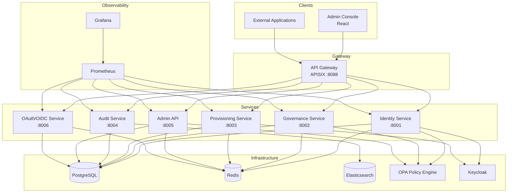
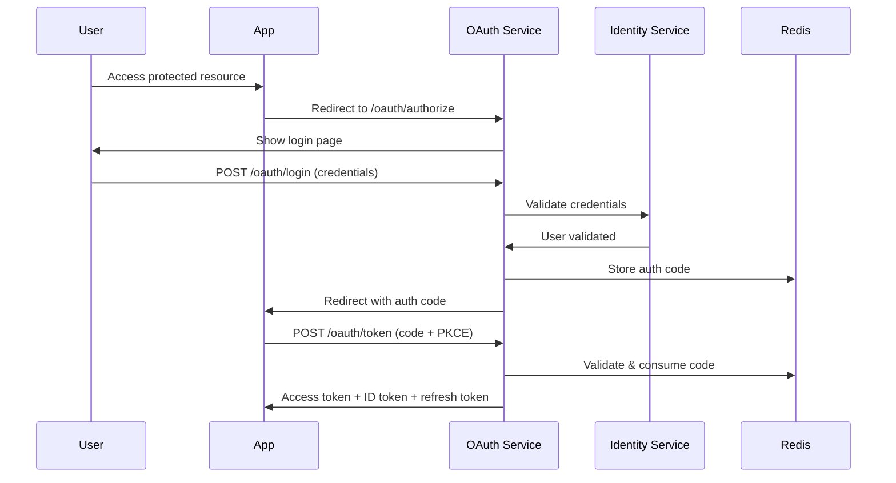

# Architecture

OpenIDX is built as a set of loosely-coupled microservices, each owning a specific domain.

## System Diagram

## Services

### Identity Service (port 8001)

Core identity management: users, groups, roles, permissions, sessions, and MFA. Handles user CRUD, search, CSV import/export, password management, and identity provider federation (OIDC/SAML).

**MFA support:**

- TOTP (Time-based One-Time Passwords)
- WebAuthn / FIDO2 (hardware security keys, biometrics)
- Push notifications

### Governance Service (port 8002)

Access governance and compliance: access review campaigns, review item decisions (approve/revoke/flag), batch decisions, and policy management with evaluation engine.

**Policy types:** Separation of duty, risk-based, time-bound, location-based.

### Provisioning Service (port 8003)

SCIM 2.0 compliant user and group provisioning for automated identity lifecycle management. Includes provisioning rules engine with triggers, conditions, and actions.

**SCIM operations:** List, Create, Get, Replace, Patch, Delete for both Users and Groups.

### Audit Service (port 8004)

Comprehensive audit trail: event logging with filtering, compliance report generation (SOC2, ISO 27001, GDPR, HIPAA, PCI-DSS), statistics, and CSV/JSON export.

### Admin API (port 8005)

Backend for the Admin Console: dashboard statistics, system settings, application management, SSO configuration, directory integrations (LDAP, Azure AD, Google), and MFA method configuration.

### OAuth/OIDC Service (port 8006)

OAuth 2.0 authorization server with OpenID Connect:

- Authorization code flow with PKCE
- Client credentials grant
- Refresh token rotation
- Token introspection and revocation
- OIDC discovery and JWKS endpoints
- SAML 2.0 support
- OAuth client management

## Data Flow

### Authentication Flow

## Technology Stack

| Layer | Technology |
|-------|-----------|
| Language | Go 1.22 |
| HTTP Framework | Gin |
| Database | PostgreSQL 16 (pgx driver) |
| Cache | Redis 7 (go-redis) |
| Search | Elasticsearch 8.12 |
| Frontend | React 18, TypeScript, Vite, Tailwind CSS |
| API Gateway | Apache APISIX 3.8 |
| Policy Engine | Open Policy Agent 0.61 |
| Identity Provider | Keycloak 23 |
| Observability | Prometheus + Grafana |
| Infrastructure | Docker, Kubernetes (Helm), Terraform (AWS) |
