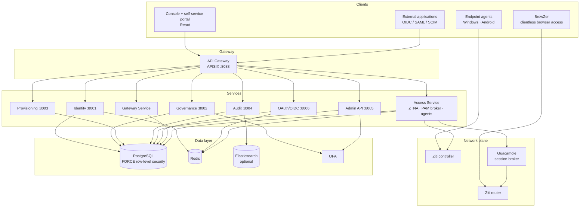
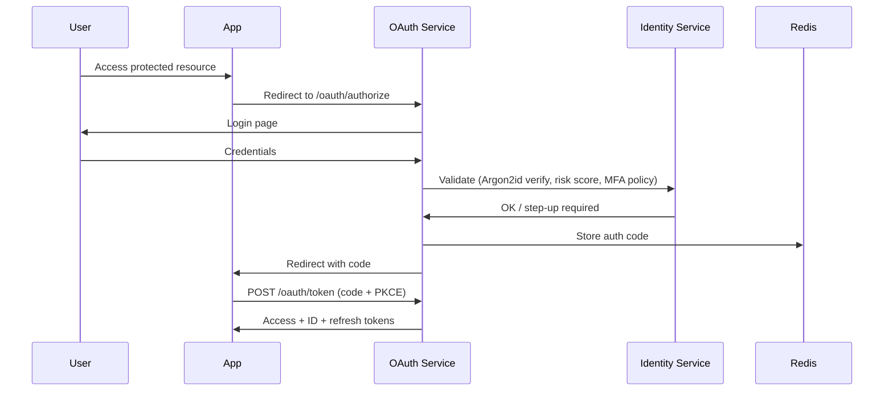

# Architecture

OpenIDX is a set of loosely-coupled Go services over **one PostgreSQL
database** — cross-pillar reads are scoped SQL joins, not service-to-service
integrations. The IdP is OpenIDX's own OAuth/OIDC service (there is no
Keycloak), and the network plane is an OpenZiti overlay driven by a
desired-state reconciler.

## System diagram

```mermaid
graph TB
    subgraph Clients
        AdminUI[Console + self-service portal<br/>React]
        Agent[Endpoint agents<br/>Windows · Android]
        BrowZer[BrowZer<br/>clientless browser access]
        ExtApp[External applications<br/>OIDC / SAML / SCIM]
    end

    subgraph Gateway
        APISIX[API Gateway<br/>APISIX :8088]
    end

    subgraph Services
        IS[Identity :8001]
        GS[Governance :8002]
        PS[Provisioning :8003]
        AS[Audit :8004]
        AA[Admin API :8005]
        OS[OAuth/OIDC :8006]
        GW[Gateway Service]
        AC[Access Service<br/>ZTNA · PAM broker · agents]
    end

    subgraph Network plane
        ZC[Ziti controller]
        ZR[Ziti router]
        GD[Guacamole<br/>session broker]
    end

    subgraph Data layer
        PG[(PostgreSQL<br/>FORCE row-level security)]
        RD[(Redis)]
        ES[(Elasticsearch<br/>optional)]
        OPA[OPA]
    end

    AdminUI --> APISIX
    ExtApp --> APISIX
    Agent --> ZC
    BrowZer --> ZR
    APISIX --> IS & GS & PS & AS & AA & OS & GW & AC

    IS & GS & PS & AS & AA & OS & GW & AC --> PG
    IS & OS & AC --> RD
    AS --> ES
    GS & AA --> OPA
    AC --> ZC
    AC --> GD
    GD --> ZR
```

## Services

| Service | Port | Responsibility |
|---|---|---|
| **Identity** | 8001 | Users, groups, roles, sessions, MFA (TOTP, WebAuthn/passkeys, push, hardware tokens), federation (OIDC/SAML), passwordless, account lifecycle & deprovisioning |
| **Governance** | 8002 | Access reviews & certification campaigns, ABAC policies via OPA, SoD (fail-closed), risk/time-bound assignments, approval workflows |
| **Provisioning** | 8003 | SCIM 2.0 users & groups, provisioning rules, directory sync (LDAP / AD / Azure AD) |
| **Audit** | 8004 | Unified tamper-evident audit events (HMAC hash-chain), real-time streaming, Elasticsearch indexing, SOC 2 / ISO 27001 / GDPR reports, SIEM forwarding |
| **Admin API** | 8005 | Aggregated admin surface behind the console: dashboards, settings, applications, API keys, webhooks, notifications |
| **OAuth/OIDC** | 8006 | The IdP: authorization code + PKCE, client credentials, refresh rotation with replay detection, token exchange, revocation, JWKS rotation, step-up, SAML 2.0 IdP with Single Logout |
| **Gateway** | 8088 | APISIX integration, proxy routes, app publishing |
| **Access** | — | Zero-trust enforcement: OpenZiti identity sync & reconciler, posture, PAM entries/vault/broker, endpoint agents, kiosk & remote support, the cross-pillar kill switch |

Supporting binaries: `cmd/migrate` (schema migrations, ~137 versions),
`cmd/backup` (backup/restore with verification), `cmd/rekey` (re-encrypts
secrets under a new KEK), `cmd/openidx-connect` (PAM CLI).

## The security spine

- **Multi-tenancy at the database.** Every tenant table carries `org_id`
  under PostgreSQL **FORCE row-level security**; the tenant is stamped onto
  each pooled connection at checkout and resolved per request from
  subdomain, JWT, or header. No tenant context yields zero rows, and a
  merge-blocking linter (`tools/orgscope`) fails CI on any unscoped query.
- **One grant model.** Application assignment drives the portal, the
  proxy, `/oauth/authorize`, and Ziti dial policies through one predicate
  (`internal/appaccess`) — staged behind flags with a reachability report.
  See [Concepts](concepts.md).
- **Fail-closed startup.** `ValidateProduction()` refuses to boot with
  insecure secrets, wildcard CORS, disabled CSRF, or plaintext datastore
  links; a DB-backed gate additionally refuses production while the seeded
  default admin password still authenticates.
- **Revocation that propagates.** Session revocation publishes Redis
  markers the OAuth service enforces; deprovisioning and the kill switch
  sever IAM sessions, API keys, vault checkouts, live privileged sessions,
  and Ziti circuits.

## Authentication flow

```mermaid
sequenceDiagram
    participant User
    participant App
    participant OAuth as OAuth Service
    participant Identity as Identity Service
    participant Redis

    User->>App: Access protected resource
    App->>OAuth: Redirect to /oauth/authorize
    OAuth->>User: Login page
    User->>OAuth: Credentials
    OAuth->>Identity: Validate (Argon2id verify, risk score, MFA policy)
    Identity->>OAuth: OK / step-up required
    OAuth->>Redis: Store auth code
    OAuth->>App: Redirect with code
    App->>OAuth: POST /oauth/token (code + PKCE)
    OAuth->>App: Access + ID + refresh tokens
```

Login risk scoring feeds the MFA decision: new device, unusual location,
failed attempts, impossible travel, and **the IP threat list** (a listed
source alone forces MFA and denies MFA-less accounts).

## Technology stack

| Layer | Technology |
|-------|-----------|
| Language | Go 1.26 |
| HTTP framework | Gin |
| Database | PostgreSQL 16 (pgx), FORCE row-level security |
| Cache / coordination | Redis 7 (go-redis) |
| Search (optional) | Elasticsearch 8 |
| Frontend | React, TypeScript, Vite, Tailwind, Radix, TanStack Query |
| API gateway | Apache APISIX |
| Policy engine | Open Policy Agent |
| Identity provider | **OpenIDX's own OAuth/OIDC service** (no Keycloak) |
| Network overlay | OpenZiti (controller + router, BrowZer) |
| Session broker | Apache Guacamole, plus in-browser wasm-ssh |
| Observability | Prometheus, Grafana, Loki, Jaeger (OpenTelemetry) |
| Infrastructure | Docker Compose (prod overlay), Kubernetes (Helm), Terraform (AWS), systemd |
