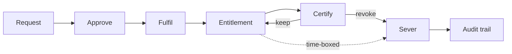

# Governance (IGA)

Identity governance answers two questions an auditor will ask, and one your
users will: **who has access to what**, **who said they should**, and **how do
I ask for more**. OpenIDX answers all three from the same database as the IdP,
the PAM broker and the network overlay — which is why a revoke here severs a
live session there.

## The loop



Everything below is a step in that loop. The important property is that
**fulfilment is real**: approving a request grants the access, and if the grant
fails, the approval reports the failure instead of closing the ticket
(`internal/governance/workflows.go`, `fulfillRequest`).

## Requesting access

A user asks for access from **My Access → Request Access** in the console, or
over the API:

```bash
curl -X POST https://openidx.example.com/api/v1/governance/requests \
  -H "Authorization: Bearer $TOKEN" \
  -H "Content-Type: application/json" \
  -d '{"resource_type":"application","resource_id":"<app-id>","justification":"On-call rotation"}'
```

Requests can be time-boxed. A **JIT** grant carries an expiry, and a background
worker revokes it when the clock runs out rather than leaving it to a human to
remember (`StartJITExpirationChecker`). That is the difference between
"temporary access" as a policy and as a fact.

Users track their own requests at `GET /requests`, and cancel one with
`POST /requests/{id}/cancel`.

## Approving

Approvers see their queue at **Governance → Access Requests**, or
`GET /api/v1/governance/my-approvals`. A decision is
`POST /requests/{id}/approve` or `/deny`.

Who approves what is an **approval policy** (`/approval-policies`): match on
the resource, name the approvers, and require one step or several. A
multi-step policy advances only when each step is satisfied, so
"manager, then application owner" means both.

## Certification campaigns

A campaign asks owners to confirm, item by item, that access is still
warranted. A **review** is one round of that; a **campaign** is a review that
recurs on a schedule. Both live under **Governance → Access Reviews**.

One round:

```bash
curl -X POST https://openidx.example.com/api/v1/governance/reviews \
  -H "Authorization: Bearer $TOKEN" \
  -H "Content-Type: application/json" \
  -d '{
    "name": "Q3 user access",
    "type": "user_access",
    "reviewer_id": "<manager-user-id>",
    "start_date": "2026-10-01T00:00:00Z",
    "end_date": "2026-10-31T00:00:00Z"
  }'
```

Four review types, each populated from real state rather than a spreadsheet
(`populateReviewItems` in `internal/governance/service.go`):

| `type` | What each item is |
|---|---|
| `user_access` | one enabled user's direct assignment to one role, named by the role |
| `role_assignment` | the same assignment, named by what it grants: a composite role's item reads `platform_admin (also grants: auditor, reader)`, so the reviewer certifies the reach, not the label |
| `application_access` | one enabled user's membership in one group (groups are how applications are assigned) |
| `privileged_access` | one enabled user's assignment to `admin`, `manager` or `auditor` |

Reviewers decide per item at `GET /reviews/{id}/items`, or in bulk with
`POST /reviews/{id}/items/batch-decision`. A **revoke** decision does not file
a ticket — it removes the entitlement, and because entitlements drive the
overlay and the PAM broker, the user's reach shrinks with it.

To make it recur, create a scheduled campaign (`POST /campaigns`) with a
`schedule`, a `reviewer_strategy`, and `auto_revoke` if undecided items should
expire closed rather than open. `POST /campaigns/{id}/run` starts a round now;
`GET /campaigns/{id}/runs` is the history you show an auditor.

## Entitlements: who has what, computed

`GET /entitlements` is the joined answer across users, groups, roles and
applications — the thing you export when an auditor asks "show me who can
reach the finance app".

- `GET /entitlements/orphans` — access with no owning identity (a leaver's
  leftovers, a deleted group's members).
- `GET /entitlements/statistics` — counts by type, for the dashboard.
- `POST /entitlements/rebuild` — recompute after a bulk import.

## Separation of duties

An SoD rule says two entitlements must not be held by the same person
("raise a payment" and "approve a payment"). OpenIDX enforces SoD **at grant
time** on the role path: fulfilling a request that would create a violation
fails closed with an `SoDViolationError`, and the approval reports the refusal
rather than closing as done (`checkSoDForRoleGrant`). It also sweeps for
violations that predate the rule:

```bash
curl -X POST https://openidx.example.com/api/v1/governance/sod/sweep \
  -H "Authorization: Bearer $TOKEN"
```

Findings land in `GET /sod/violations`, each with a status you move as you
remediate (`POST /sod/violations/{id}/status`). The preventive half failing
closed is deliberate: a rule that only reports is a rule that gets ignored.

## Lifecycle: joiner, mover, leaver

Lifecycle policies (**Governance → Lifecycle Policies**) turn a change in
identity state into a change in access — a new hire gets the baseline, a
transfer loses the old department's roles, a leaver is deprovisioned. Preview
one against the current population before you arm it:

```bash
curl -X POST https://openidx.example.com/api/v1/lifecycle-policies/preview \
  -H "Authorization: Bearer $TOKEN" \
  -H "Content-Type: application/json" \
  -d '{"trigger":"user.disabled","conditions":[],"actions":[{"type":"revoke_all_access"}]}'
```

Executions are recorded (`GET /lifecycle/executions`) so "the policy ran" is
something you can show rather than assume.

For the leaver path specifically, the **kill switch** on the user's admin page
is the synchronous version: it severs tokens, sessions, vault checkouts, live
privileged sessions and network circuits, and reports which of those failed
rather than claiming success.

## Policies that decide, and policies that describe

Two policy engines meet here, and the difference matters:

- **Access policies** (`/policies`) and **ABAC policies** (`/abac-policies`)
  are evaluated at the enforcement points — the token endpoint and the access
  proxy. ABAC has three modes (`ABAC_ENFORCE=off|observe|enforce`); in
  `observe` it records what it *would* deny without denying it, so you can see
  the blast radius before you turn it on. The console shows which mode is
  live. A new install starts in `observe` and stays there: `enforce` is not a
  default, it is a step you take (decided in #956). Take it once the
  `access.abac.would_deny` records name only the people your policies are
  meant to stop; the
  [configuration reference](../deployment/configuration.md#turning-the-gates-on-for-an-existing-install)
  has the steps.
- **Approval policies** describe who signs off. They gate the request, not the
  request's runtime.

Test either without granting anything: `POST /policies/{id}/evaluate` and
`POST /abac-policies/evaluate` run the same evaluator production runs.

## Delegated administration, and what its scope really does

A delegation hands one person a named set of administrative permissions until
a date, within your organization.

**A new delegation can only be scoped to the Organization.** That scope is
enforced, by the tenant predicate the delegation is read under. Group, Role and
Application scopes are refused when you create a delegation or edit one,
because they were never enforced. The permission check compares resource and
action only, so a narrower scope did not stop the delegated permissions
applying wherever that permission is checked in your organization.

**Delegations created before this change keep their scope and still work.**
They grant what they always granted: their permissions across the whole
organization. The console marks each one "not enforced", and you can still edit
its permissions, expiry and status. Check that each of those permission sets is
one you would grant across the whole organization.

Enforcing a narrower scope needs the identity of the resource each request acts
on, which the permission middleware does not have. Narrowing an existing
delegation would also silently revoke access someone relies on. Until
scope-aware enforcement exists, refusing the narrower scopes keeps the console
from offering a control it does not enforce (#956).

## What is API-only today

Three governance-adjacent capabilities ship with a working API and no console
screen. They are documented rather than hidden:

| Capability | Where |
|---|---|
| Outbound SCIM provisioning to downstream apps | `POST /api/v1/provisioning/targets` |
| HR-driven joiner/mover/leaver (BambooHR, generic HRIS) | directory type `bamboohr` via the directories API |
| Shared Signals (SSF/CAEP) stream transmission | `POST /ssf/streams` on the oauth service |

See [Provisioning (SCIM)](../api/provisioning.md) and the OpenAPI specs for
request shapes.

## Going deeper

- [Concepts — the four pillars](concepts.md) for how governance relates to
  IAM, PAM and ZTNA.
- [Governance API](../api/governance.md) for the full endpoint list.
- [Privileged Access](privileged-access.md) — a certification revoke ends a
  live PAM session, and this is why.
