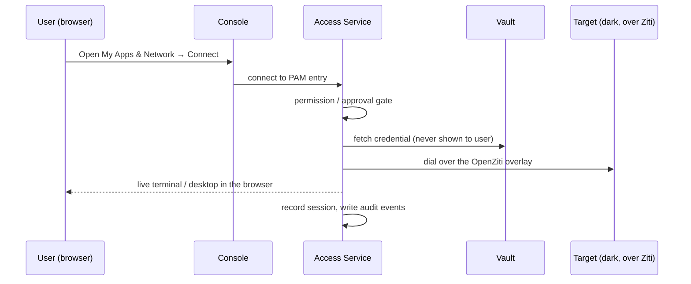

# Privileged Access (PAM)

Privileged access in OpenIDX means two things working together: a
**credential vault** that owns powerful secrets so people don't, and a
**session broker** that opens SSH/RDP/VNC connections *for* you — with the
credential injected server-side, the session recorded, and the whole thing
riding the zero-trust overlay so the target needs no inbound port.

## How a privileged session works

The user never sees the password or key. Revoking their access (or the
admin kill switch) terminates the live session, not just future ones.

## For admins: setting it up

1. **Create a connection (PAM entry).** Console → **PAM Connections**.
   Choose the protocol (SSH/RDP/VNC) and the **renderer**:
   *Guacamole* (the default full remote-desktop broker) or *wasm-ssh*
   (in-browser xterm.js SSH over a WebSocket relay — no guacd needed).
2. **Point it at a vaulted credential.** Console → **Vault Secrets**.
   Secrets are envelope-encrypted (AES-256-GCM under a rotatable KEK);
   automated **rotation policies** cover SSH, AWS IAM, GCP service
   accounts, Postgres, MySQL and LDAP credentials.
3. **Grant access.** PAM entry grants name the users or roles that may
   connect or reveal, optionally time-bounded. Sensitive entries can
   require **checkout approval** — the request lands with approvers before
   a session can start. **Break-glass** exists for emergencies and is
   loudly audited.
4. **Put it on the overlay.** A PAM target reached over OpenZiti has no
   inbound port anywhere; the access service dials it through the fabric.
5. **Recordings & retention.** Sessions are recorded encrypted at rest,
   with retention policies and **legal holds**. Recordings and transcripts
   are reviewable from the console; the audit trail links session,
   credential, and user.
6. **Quick Links.** Curate a searchable launcher of external tools and
   PAM connections for users (`type=external` opens a vetted URL,
   `type=pam` launches the brokered session clientlessly).

## For users: getting a session

1. Open **My Apps & Network**. Your privileged connections appear
   alongside your apps.
2. Click **Connect**. If the entry needs approval, you'll see the request
   flow; otherwise the terminal or desktop opens right in the browser —
   nothing to install.
3. Need a credential itself (rare, discouraged)? **Reveal** is a separate,
   separately-granted, separately-audited action with checkout semantics —
   return it when done.
4. Your sessions, requests, and JIT elevations show under **My Access**;
   an admin (or an access-review revoke) can end them at any time.

## The mental model

- **The vault owns credentials; people borrow reach.** A grant is to a
  *connection*, not to a password.
- **PAM grants are deliberately their own enforcement layer.** Ordinary
  app reach converges on application assignment; privileged access stays a
  separate, stricter decision (`pamEntryAllowed` at connect *and* reveal).
- **Everything lands in one audit trail** (`unified_audit_events`), so a
  user's privileged activity correlates with their logins and network
  circuits in one query — and one kill switch severs all of it.

## Going deeper

- [Remote access lifecycle scenarios](https://github.com/mhmtgngr/openidx/blob/main/docs/remote-access-lifecycle-scenarios.md) — personas, RACI, four end-to-end scenarios
- [Remote support runbook](https://github.com/mhmtgngr/openidx/blob/main/docs/remote-support-runbook.md) — attended support with device-side consent
- [How the pillars interrelate](https://github.com/mhmtgngr/openidx/blob/main/docs/IAM_PAM_ZITI_INTERRELATION.md) — the seams between IAM, PAM and the overlay
