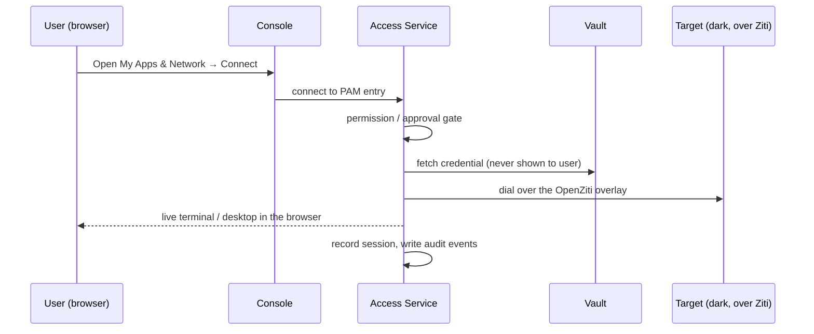

# Privileged Access (PAM)

Privileged access in OpenIDX means two things working together: a
**credential vault** that owns powerful secrets so people don't, and a
**session broker** that opens SSH/RDP/VNC connections *for* you — with the
credential injected server-side, the session recorded, and the whole thing
riding the zero-trust overlay so the target needs no inbound port.

## How a privileged session works

```mermaid
sequenceDiagram
    participant U as User (browser)
    participant C as Console
    participant A as Access Service
    participant V as Vault
    participant T as Target (dark, over Ziti)
    U->>C: Open My Apps & Network → Connect
    C->>A: connect to PAM entry
    A->>A: permission / approval gate
    A->>V: fetch credential (never shown to user)
    A->>T: dial over the OpenZiti overlay
    A-->>U: live terminal / desktop in the browser
    A->>A: record session, write audit events
```

The user never sees the password or key. A session lasts as long as the
access that opened it: when the grant ends (a request's window closes, an
administrator removes it, the role or group carrying it goes) or the admin
kill switch is pressed, the live session ends within half a minute, not just
future ones. A session an administrator opened without a grant is not ended
for the lack of one.

## For admins: setting it up

1. **Create a connection (PAM entry).** Console → **PAM Connections**.
   Choose the protocol (SSH/RDP/VNC) and the **renderer**:
   *Guacamole* (the default full remote-desktop broker) or *wasm-ssh*
   (in-browser xterm.js SSH over a WebSocket relay — no guacd needed).
2. **Point it at a vaulted credential.** Console → **Vault Secrets**.
   Secrets are envelope-encrypted (AES-256-GCM under a rotatable KEK);
   automated **rotation policies** cover SSH, AWS IAM, GCP service
   accounts, Postgres, MySQL and LDAP credentials.
3. **Grant access.** PAM entry grants name the users or roles that may
   connect or reveal, optionally time-bounded. A user can also ask for a
   time-bound connection through **Access Requests**; approving the request
   writes the grant, and it ends with the request's window. Sensitive entries can
   require **checkout approval** — the request lands with approvers before
   a session can start. **Break-glass** exists for emergencies and is
   loudly audited.
4. **Put it on the overlay.** A PAM target reached over OpenZiti has no
   inbound port anywhere; the access service dials it through the fabric.
5. **Pin the SSH host key.** An entry's `settings.ssh_host_key` takes one
   `authorized_keys` line (the same shape the SSH rotator's connector config
   uses). When it is set, the clientless SSH relay **enforces** it: a
   different host key fails the connection, and a stored key that cannot be
   parsed fails it too — never a quiet fall back to accepting anything.
   When it is not set the hop is unpinned, and both the service log and the
   `pam.ws_connect` audit event say so (`host_key_pinned: false`), so
   "which of my entries accept any host key" is a question you can answer.
   Set `PAM_SSH_REQUIRE_HOST_KEY=true` to refuse unpinned entries outright.
6. **Recordings & retention.** Sessions are recorded encrypted at rest,
   with retention policies and **legal holds**. Recordings and transcripts
   are reviewable from the console; the audit trail links session,
   credential, and user.
7. **Quick Links.** Curate a searchable launcher of external tools and
   PAM connections for users (`type=external` opens a vetted URL,
   `type=pam` launches the brokered session clientlessly).

## For users: getting a session

1. Open **My Apps & Network**. Your privileged connections appear
   alongside your apps.
2. Click **Connect**. If the entry needs approval, you'll see the request
   flow; otherwise the terminal or desktop opens right in the browser —
   nothing to install. An entry listed without **Connect** can be asked for:
   **Access Requests → Request Access → PAM Connection**, for a duration.
   Once the request is approved, Connect appears until the window ends.
3. Need a credential itself (rare, discouraged)? **Reveal** is a separate,
   separately-granted, separately-audited action with checkout semantics —
   return it when done.
4. Your sessions, requests, and JIT elevations show under **My Access**;
   an admin (or an access-review revoke) can end them at any time.

## External (vendor) users

An external user's session runs under fixed controls, whatever the entry or
the install's settings say:

- **Approved by their sponsor.** Every launch needs a launch approval, even
  on an entry that asks for none. The user asks for one with **Request
  access**. Their sponsor is told, finds it in their queue
  (`GET /api/v1/access/pam/sponsored/entry-requests`) and approves or denies
  it (`POST .../sponsored/entry-requests/{id}/approve` or `/deny`, with a fresh
  second factor). An administrator who is not the sponsor can deny it but not
  approve it (`external_launch_needs_sponsor`). No administrator bypass
  applies to the external user, whatever roles their token claims.
- **Recorded.** The session is recorded, keystrokes included. Without
  `GUACAMOLE_RECORDING_PATH` the launch is refused
  (`external_recording_unavailable`).
- **On the overlay.** The entry's reach mode must be `ziti`, whatever
  `PAM_REQUIRE_ZTNA` says. A direct-reach entry and a website entry are
  refused (`ztna_required_direct_reach`, `ztna_required_website_entry`).
- **On its own broker connection and identity.** The session runs on a
  broker connection of its own, opened by a broker account that can open
  nothing else. That needs `GUACAMOLE_PER_USER_IDENTITIES=true`. Without it,
  or when the account cannot be set up at launch, the launch is refused
  (`external_broker_identity_required`) rather than handed the shared broker
  token, which opens every connection on the broker.
- **Hardened.** Clipboard in both directions, drive redirection, file
  transfer over the drive or SFTP, and printing are off. The entry's settings
  cannot turn them back on, or leave the screen, the pointer or touches out of
  the recording.
- **A working day at most.** The lifecycle sweep ends the session after 8
  hours, whatever grant it rides. An idle timeout is not enforced yet: the
  broker reports no per-session activity to measure one by.
- **No credential in their hands.** Reveal and break-glass
  (`external_reveal_forbidden`), SSH certificates
  (`external_ssh_ca_forbidden`) and cloud keys
  (`external_cloud_jit_forbidden`) are refused. So is the browser SSH
  terminal, which records nothing (`external_recording_unavailable`).

The entry list and the broker status show an external user what their launch
will do: approval and recording on, no Reveal, and the overlay enforced. Each
refusal is audited: `pam.launch_denied`, `pam.reveal_denied`,
`pam.ssh_cert_denied`, `pam.cloud_jit_denied` and `pam.ztna.denied`, marked
`external`.

## The mental model

- **The vault owns credentials; people borrow reach.** A grant is to a
  *connection*, not to a password.
- **PAM grants are deliberately their own enforcement layer.** Ordinary
  app reach converges on application assignment; privileged access stays a
  separate, stricter decision (`pamEntryAllowed` at connect *and* reveal).
- **Everything lands in one audit trail** (`unified_audit_events`), so a
  user's privileged activity correlates with their logins and network
  circuits in one query — and one kill switch severs all of it.

## Going deeper

- [Remote access lifecycle scenarios](https://github.com/mhmtgngr/openidx/blob/main/docs/remote-access-lifecycle-scenarios.md) — personas, RACI, four end-to-end scenarios
- [Remote support runbook](https://github.com/mhmtgngr/openidx/blob/main/docs/remote-support-runbook.md) — attended support with device-side consent
- [How the pillars interrelate](https://github.com/mhmtgngr/openidx/blob/main/docs/IAM_PAM_ZITI_INTERRELATION.md) — the seams between IAM, PAM and the overlay
