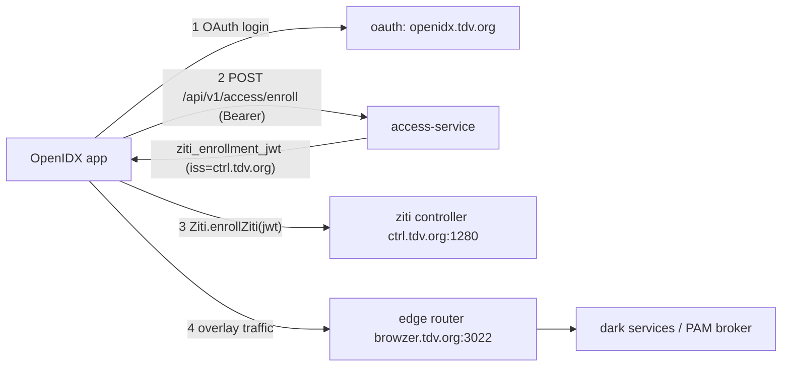

# OpenIDX Mobile — Native OpenZiti Integration Guide

**Audience:** the developer building the native Android (Kotlin / Jetpack Compose)
OpenIDX app. This is the concrete plan to add **OpenZiti** so the app reaches
OpenIDX services over the zero-trust overlay instead of the public internet.

**Status of the backend (all live on `openidx.tdv.org`, verified):**

- The Ziti **controller advertises `ctrl.tdv.org`** (public-resolvable FQDN), not
  `localtest.me`. Enrollment JWTs minted now carry `iss/ctrls = ctrl.tdv.org:1280`.
- `POST /api/v1/access/enroll` mints a **fresh, non-expired** enrollment JWT every
  call (the old "31-day-stale JWT" bug is fixed).
- The data API is **auth-hard-blocked** (`ACCESS_API_REQUIRE_AUTH=true`): a call
  with no token returns 401. So the app must always send a bearer.
- The **PAM Ziti session broker** is deployed (`ziti_broker:true`), so PAM
  `reach_mode=ziti` connections dial their target over the overlay.

> There is already a working native Kotlin reference in this repo:
> `agent-android/core/src/main/java/com/openidx/agent/core/ZitiClient.kt`
> (uses `org.openziti:ziti-android:0.30.0`). **Copy its patterns** — this guide
> is the mobile-app-specific version of that.

---

## 0. The one-paragraph mental model

The phone enrolls **once** into the Ziti overlay using a one-time JWT from the
OpenIDX backend. After enrollment the SDK holds a certificate-based identity in
the Android KeyStore. From then on, the app's normal HTTPS calls to
overlay-published services are transparently tunneled over Ziti (mutually
authenticated, no inbound exposure on the server). The controller
(`ctrl.tdv.org`) and edge router (`browzer.tdv.org`) must be reachable from the
phone's network (corporate Wi-Fi or VPN today; a public edge later).



---

## 1. Prerequisites & dependencies

### 1.1 Gradle

```kotlin
// app/build.gradle.kts (or core module)
dependencies {
    implementation("org.openziti:ziti-android:0.30.0") // same version the agent uses
    implementation("com.squareup.okhttp3:okhttp:4.12.0")
}
```

Minimum SDK 26+. The Ziti Android SDK needs the standard networking permissions
you already have (`INTERNET`). It does **not** need `VPN`/`tun` for the seamless
socket-factory mode used here (that's the SDK-embedded mode, not the OS VPN
tunneler).

### 1.2 Network reachability (non-negotiable)

The phone must resolve and reach, on its current network:

| Host | Port | Purpose |
|---|---|---|
| `ctrl.tdv.org` | 1280 | Ziti controller (enroll + control plane) |
| `browzer.tdv.org` | 3022 | Edge router (data plane; the router is registered under this name) |

Today these resolve via **corporate DNS (10.10.12.30)**, so the phone must be on
corporate Wi-Fi or VPN. Quick check from the phone browser:
`https://ctrl.tdv.org:1280/edge/client/v1/version` should return JSON.

> The controller's TLS cert now includes `ctrl.tdv.org` in its SAN (added via
> `alt_server_certs`, same intermediate CA), so certificate validation succeeds.

---

## 2. The enrollment flow (do this exactly)

### 2.1 Get a fresh enrollment JWT from OpenIDX

The app is already logged in (OAuth v1, `Authorization: Bearer <access_token>`).
Call the Tier-0 enroll door — it authenticates the bearer and returns a fresh
Ziti enrollment JWT for **this** user's device identity.

```
POST https://openidx.tdv.org/api/v1/access/enroll
Authorization: Bearer <access_token>
Content-Type: application/json

{}
```

Response:

```json
{
  "ziti_enrollment_jwt": "eyJhbGciOiJSUzI1NiIsInR5cCI6IkpXVCJ9....",
  "identity_name": "00000000-0000-0000-0000-000000000001"
}
```

- `ziti_enrollment_jwt` — one-time OTT, `iss/ctrls = https://ctrl.tdv.org:1280`,
  short-lived but **always fresh** (the backend re-issues if the previous one
  lapsed). Enroll with it promptly.
- `identity_name` — the user id the identity is bound to (informational).

Kotlin (reuse your existing authed OkHttp client):

```kotlin
suspend fun fetchEnrollmentJwt(accessToken: String): String {
    val req = Request.Builder()
        .url("https://openidx.tdv.org/api/v1/access/enroll")
        .header("Authorization", "Bearer $accessToken")
        .post("{}".toRequestBody("application/json".toMediaType()))
        .build()
    apiClient.newCall(req).execute().use { resp ->
        if (resp.code == 401) error("not authenticated — refresh token first")
        if (!resp.isSuccessful) error("enroll failed: ${resp.code}")
        val body = resp.body!!.string()
        return JSONObject(body).getString("ziti_enrollment_jwt")
    }
}
```

### 2.2 Enroll into the overlay with the SDK

Mirror `ZitiClient.kt`. `Ziti.init` is **process-global** and must run once
before any other Ziti call (do it in `Application.onCreate`), and enrollment runs
on a background thread inside the SDK.

```kotlin
import org.openziti.android.Ziti

class OidxZiti(private val appContext: Context) {

    fun initOnce() {
        // seamless=true → the JVM default socket factory routes overlay hosts
        // through Ziti after init. Idempotent; the SDK guards double-init.
        runCatching { Ziti.init(appContext, /* seamless = */ true) }
            .onFailure { Log.w(TAG, "Ziti.init failed; direct transport fallback", it) }
    }

    fun enroll(jwt: String) {
        initOnce()
        runCatching { Ziti.enrollZiti(jwt.toByteArray(Charsets.UTF_8)) }
            .onFailure { Log.w(TAG, "ziti enrollment failed", it) }
        // enrollment completes asynchronously — observe Ziti.identityEvents
    }

    /** OkHttp client that explicitly dials over Ziti (for short-lived callers). */
    fun zitiHttp(): OkHttpClient =
        runCatching {
            OkHttpClient.Builder().socketFactory(Ziti.getSocketFactory()).build()
        }.getOrElse { OkHttpClient() }

    companion object { private const val TAG = "OidxZiti" }
}
```

### 2.3 Detect enrollment completion

Enrollment is async. Listen for the SDK's identity/context events and flip UI
state (show an "OpenZiti" row as connected — the current app is missing this per
the findings report §2.5 #12).

```kotlin
// Collect Ziti.identityEvents (SDK exposes a flow/callback of context state).
// On CONTEXT_READY / status OK → mark device "on overlay".
```

### 2.4 Persistence across restarts

The SDK stores the enrolled identity in the Android KeyStore + a `ziti`
sharedPrefs file. On process restart just call `Ziti.init(...)` again (see
`initializeFromStored()` in the reference) — **do not** re-enroll. Re-enroll only
if the identity is missing/revoked.

---

## 3. Using the overlay

### 3.1 Seamless mode (default, simplest)

With `seamless = true`, once enrollment finishes, any plain `OkHttpClient()` in
the app already routes overlay-advertised hosts through Ziti. You usually don't
change your API call sites at all.

### 3.2 PAM `reach_mode=ziti` (the dark-desktop path)

When a PAM connection reports `reach_mode == "ziti"` (from
`GET /api/v1/access/pam/entries`), the target is reached over the overlay by the
server-side PAM Ziti broker. The app flow is unchanged from direct mode:

1. `POST /api/v1/access/pam/entries/{id}/connect` → returns a Guacamole
   `connect_url`.
2. Open that URL in the in-app WebView.

The difference is purely server-side (broker dials the target over Ziti). **Show
an "OpenZiti" badge** when `reach_mode == "ziti"` so the user knows the hop is
zero-trust. (Also fix the WebView black-screen from findings §Finding B — that's
unrelated to Ziti.)

### 3.3 What to send on every API call

The data API is hard-auth. Always attach `Authorization: Bearer <token>` and, per
findings §Finding A / A7, **do not log the user out on a single 401** — try a
token refresh first, only then re-login.

---

## 4. Module structure (recommended)

```
app/
  di/                     ZitiModule (provide OidxZiti singleton)
  data/ziti/
    OidxZiti.kt           SDK wrapper (this guide, §2.2)
    EnrollmentApi.kt      POST /api/v1/access/enroll (§2.1)
    ZitiState.kt          enrolled? on-overlay? (StateFlow for UI)
  ui/device/
    DeviceScreen.kt       "This device" — add the OpenZiti row (§2.3)
```

`Application.onCreate`:

```kotlin
override fun onCreate() {
    super.onCreate()
    oidxZiti.initOnce()   // boots any stored identity
}
```

Enroll trigger (from the "Enroll this device" button — note this button currently
logs the user out because `/agent/enroll/oauth` 401's; that's the backend A3 bug,
being addressed separately — for Ziti enroll use `/api/v1/access/enroll` which
takes the same bearer and works):

```kotlin
viewModelScope.launch {
    val jwt = enrollmentApi.fetchEnrollmentJwt(session.accessToken)
    oidxZiti.enroll(jwt)
}
```

---

## 5. Test plan (prove each layer)

| # | Test | Pass criteria |
|---|---|---|
| 1 | Reachability | Phone browser opens `https://ctrl.tdv.org:1280/edge/client/v1/version` → JSON |
| 2 | Enroll JWT | `POST /api/v1/access/enroll` with a valid bearer returns `ziti_enrollment_jwt` whose decoded `iss` is `https://ctrl.tdv.org:1280` |
| 3 | SDK enroll | After `Ziti.enrollZiti(jwt)`, `Ziti.identityEvents` fires a ready/OK event; identity persists across app restart |
| 4 | Overlay dial | An overlay-advertised call succeeds while the same host is NOT publicly reachable |
| 5 | PAM ziti | A PAM entry with `reach_mode=ziti` connects and renders in the WebView |

**Backend-side verification (ask the OpenIDX operator, or the enrolled identity
shows up):** the controller lists the new identity as enrolled/online; you can
confirm `hasApiSession=true` after the app connects.

---

## 6. Common failure modes

| Symptom | Cause | Fix |
|---|---|---|
| Enroll JWT `iss` is `localtest.me` | Talking to an old cached identity | Always fetch a fresh JWT via `/api/v1/access/enroll`; new identities get `ctrl.tdv.org` |
| TLS `unknown authority` at enroll | Controller CA not trusted, or reached via wrong host | The SDK trusts the CA embedded in the JWT; don't override the trust store. Ensure you pass the JWT bytes verbatim |
| `ctrl.tdv.org` won't resolve | Phone not on corporate DNS | Corporate Wi-Fi or VPN; long-term, publish the controller behind a public edge |
| Traffic not tunneling | `Ziti.init` not called / not seamless | Call `Ziti.init(context, seamless=true)` in `Application.onCreate` before any request |
| 401 on every data call | Missing/expired bearer | Attach `Authorization: Bearer`; refresh on 401 before logout (findings A7) |

---

## 7. Roadmap alignment with the findings report

This guide closes the Ziti items the mobile findings report flagged as 0%:

- **Z1** (controller under a real FQDN) — **done server-side** (`ctrl.tdv.org`).
- **Z2** (fresh JWT per call) — **done server-side**.
- **Z3** (PAM entries reachable over Ziti) — **broker deployed**; toggle per entry.
- **Z4** (integrate the Android Ziti SDK: enroll/status/dial) — **this guide** +
  the `ZitiClient.kt` reference.
- **Z5** (loopback proxy / route `reach_mode==ziti`) — seamless mode covers the
  common case; the PAM broker handles the target hop, so the app only needs to
  honor the `reach_mode` badge (§3.2).

For the non-Ziti mobile fixes (WebView black screen, null-list crashes, mark-read
UI, FCM push, passkey management), see the findings report §2.5 and §6 — those are
independent of this overlay work.
