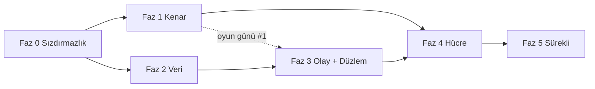

# Küresel Ölçek Dönüşümü — Uygulama Planı

> **Tasarım:** `docs/architecture/2026-09-13-global-scale-cell-architecture-and-ddos.md`
> (önce onu oku; bu plan oradan argüman alır, tekrar etmez).
> **Takvim ve kilometre taşları:** `docs/plans/2026-09-13-global-scale-roadmap.md` (fazların haftalara, sprintlere ve karar noktalarına bağlanması).
> **Biçim:** Her görev dosya adı, kabul ölçütü ve onay kutusu taşır. Bir görev
> "bitti" sayılmak için kabul ölçütünün **ölçülmüş** olması gerekir; "yaptım" yetmez
> (`docs/openidx-k8s-always-on.md` §4'ün dersi).
> **Sıra:** Fazlar bağımlılık sırasındadır. Faz 0 ve Faz 1 paralel gidebilir; Faz 2,
> Faz 3'ün önkoşuludur; Faz 4 hepsini bekler.

---

## Küresel kısıtlar

- Her davranış değişikliği bir bayrak arkasında, varsayılan bugünkü davranış
  (depo geleneği: `ACCESS_ASSIGNMENT_ENFORCE`, `STEPUP_GATE` tri-state modeli).
- Migrasyon yüksek su çizgisi **v187**; bu plan v188'den başlar, numaralar görevlerde.
  `DO $$` blokları yok.
- `orgscope` yeşil kalır; RLS entegrasyon testleri (`internal/common/database/rls_enforcement_test.go`)
  her faz sonunda **pgcat arkasında** da koşar.
- `make lint`, `make test`, `make k8s-chaos` (statik) her PR'da; canlı kaos faz kapısında.
- Hiçbir görev PR'ı "kenar sağlayıcı seçimi" gibi ürün kararını sessizce almaz;
  karar ADR'de, PR onu uygular.

## Roller

| Rol | Sahip olduğu fazlar |
|---|---|
| Kenar / Ağ mimarı | Faz 1, Faz 4 yönlendirme |
| Platform / Veri | Faz 0 (Redis, PG), Faz 2 |
| Servis mühendisliği | Faz 3 |
| SRE / Güvenlik | Faz 0 (zaman aşımı, kota), Faz 5, tüm oyun günleri |

---

## Faz 0 — Sızdırmazlık (2 hafta, kod değişikliği küçük, etki büyük)

Amaç: bugün bir kenar sağlayıcısı öne konduğunda **kendini DDoS eden** noktaları kapatmak.
Hepsi tasarım §3 bulgularının doğrudan karşılığıdır.

### 0.1 Redis'i rollere ayır (B2)

**Dosyalar:** `internal/common/config/config.go`, `internal/common/database/database.go`,
`cmd/*/main.go`, `deployments/docker/docker-compose.yml`, Helm `values*.yaml`, `templates/configmap.yaml`
- [x] `REDIS_RATELIMIT_URL`, `REDIS_SESSION_URL`, `REDIS_REVOCATION_URL` konfig alanları; boşsa `REDIS_URL`'e düşer (geri uyumlu).
- [x] `DistributedRateLimit` yalnız ratelimit istemcisini alır; `internal/revocation` tüketicileri revocation istemcisini; `leader` ve login/MFA oturum anahtarları session istemcisini.
- [x] Compose: üç `redis` servisi; ratelimit örneğinde `--maxmemory 256mb --maxmemory-policy allkeys-lru`; diğerlerinde `noeviction` + AOF.
- [x] Helm: `redis.ratelimit/session/revocation` alt-değerleri; prod'da üç ElastiCache/Azure Cache uç noktası (Terraform `modules/elasticache` üç kez).
- **Kabul:** `redis-cli -h ratelimit DEBUG POPULATE 5000000` ile bellek doldurulduğunda login **çalışmaya devam eder** (session Redis etkilenmez); test `internal/common/middleware/ratelimit_isolation_test.go`.

### 0.2 Gerçek IP zinciri (B3)

**Dosyalar:** `deployments/docker/apisix/apisix.yaml`, `deployments/apisix-edge/seed-edge-routes.sh`,
`internal/common/middleware/trustedproxies.go`, Helm `configmap.yaml`
- [x] APISIX global rule: `real-ip` eklentisi, `source: http_x_forwarded_for` **yalnız** `trusted_addresses` içinden; `limit-req`/`limit-count` anahtarı `$remote_addr` (real-ip sonrası).
- [x] `OIDX_TRUSTED_PROXIES` Helm'de kenar CIDR listesini alan bir değerden üretilir (`edge.trustedCidrs` → `OIDX_EDGE_TRUSTED_CIDRS`, servislerde birleştirilir); `*` değeri `ValidateProduction()`'da **reddedilir**.
- [x] CronJob `edge-cidr-sync`: sağlayıcı CIDR listesini çeker, ConfigMap'i günceller, alınamazsa eskiyi korur. *(Sayaç yerine Job başarısızlığı kullanılır: `OpenIDXEdgeCidrSyncFailed` kuralı `kube_job_status_failed` üzerinden; bir CronJob Prometheus sayacı yayamaz.)*
- **Kabul:** İki farklı `X-Forwarded-For` ile aynı kenar IP'sinden gelen istekler **ayrı** kovalara düşer (test `ratelimit_realip_test.go`); güvenilmeyen kaynaktan sahte XFF yok sayılır.

### 0.3 Zaman aşımı ve boyut sertleştirme (B5, Y2)

**Dosyalar:** `cmd/*/main.go` (http.Server), `internal/server/graceful.go`, `deployments/docker/nginx/nginx.conf`, APISIX rotaları
- [x] Tüm servislerde `ReadHeaderTimeout: 5s`, `MaxHeaderBytes: 16<<10`; ortak yapıcı `server.NewHTTP(cfg)` ile tek yerde (bugün her `main.go` kendi yazıyor).
- [x] `http.MaxBytesReader` rota gruplarına: oauth/governance/audit 1 MB, admin-api ve provisioning (SCIM bulk) 5 MB, identity (CSV import) 10 MB; access ve gateway kenara bırakıldı (yayınlanan uygulamaları proxy'ler). *(Audit search GET'tir; gövde sınırı yerine sorgu zaman aşımı Faz 2.4'te.)*
- [x] HTTP/2: `http2.Server{MaxConcurrentStreams: 100}`.
- [x] nginx: `client_body_timeout 10s; client_header_timeout 10s; limit_conn_zone ... limit_conn perip 50; http2 on`.
- [x] APISIX: her rotada `limit-conn` (ISSUE 200, ADMIN 100, VERIFY 1000 eşzamanlı), `proxy_read_timeout` düzlem başına; ISSUE `retries: 0`.
- **Kabul:** `slowhttptest -c 2000 -H` origin'e karşı: sağlıklı istek p99 < 2× baseline. *(Uygulamada `openidx_http_header_timeout_total` sayacı eklenmedi: Go `http.Server` başlık zaman aşımını olay olarak dışa vermez; birim testi bunun yerine yavaş başlığın `ReadHeaderTimeout` içinde kesildiğini ölçer — `internal/server/http_test.go`.)*

### 0.4 `/health/ready` ve `/metrics` dışa kapansın

- [x] APISIX'te `/health/*`, `/metrics`, `/ready` için `priority: 100` rota → 404; iç ağdan probe'lar doğrudan pod'a.
- **Kabul:** Kenar üzerinden `GET /health/ready` → 404; K8s probe'ları yeşil.

### 0.5 HPA açık ve doğru sinyal (Y1)

**Dosyalar:** Helm `values-prod.yaml`, `templates/hpa.yaml`
- [x] `autoscaling.enabled: true` tüm servislerde; `behavior.scaleUp` 60 s'de ×2, `scaleDown` 300 s stabilizasyon.
- [x] Geçici: CPU %60 (KEDA Faz 3'te gelir).
- **Kabul:** `k6` ile 3× baseline yük → 2 dk içinde replika artar, p99 SLO içinde kalır.

### 0.6 CORS tutarlılığı (O1, O2)

- [x] `cmd/oauth-service/main.go:159-170` satır içi CORS kaldırılır; `ValidateProduction()`'ın izin verdiği ortak CORS middleware'i kullanılır; OAuth için `*` **bilinçli** istisna ise `OAUTH_CORS_WILDCARD=true` bayrağı ve belgede gerekçe.
- [x] APISIX rotalarındaki CORS kopyaları (compose 11, loader 7) tek global rule'a; protokol uçları (token, introspect, revoke, userinfo, discovery) rota seviyesinde `*` — tasarım gereği, çerez taşımaz. *(Kiracı alan adlarından dinamik üretim Faz 4.1 kiracı dizini ile gelir.)*
- **Kabul:** `docs/THREAT-MODEL.md` TB1 satırı kodla uyuşur; kiracı origin listesi `apisix.yaml`'da **tam bir kez** geçer (test: `deployments/docker/apisix_test.go`).

### 0.7 Redis kaybında ISSUE için kademeli düşüş

**Dosya:** `internal/common/middleware/ratelimit.go`
- [x] Redis hatasında auth yolları için replika-yerel sayaç (kota/`RATE_LIMIT_REPLICA_HINT`), süre `RATE_LIMIT_LOCAL_FALLBACK_MAX` (varsayılan 60 s), sonra kapalı-başarısız; `openidx_rate_limit_local_fallback_seconds` gauge; `OpenIDXRateLimitOnLocalFallback` uyarısı 10 s'de.
- **Kabul:** Redis restart (10 s) sırasında login başarı oranı > %99; 60 s'ten uzun kesintide 503 (test `ratelimit_fallback_window_test.go`).

**Faz 0 çıkış kapısı:** Yukarıdaki yedi kabul ölçütü staging hücresinde ölçülmüş;
`docs/architecture/...-ddos.md` §3'te B2, B3, B5, Y1, Y2, O1, O2 satırları "kapandı" işaretli.

**Durum (2026-09-13):** Yedi görevin kodu birleşti; her biri kendi commit'inde ve
birim/entegrasyon düzeyinde ölçüldü (testler: `internal/common/database/redis_roles_test.go`,
`internal/common/middleware/ratelimit_{isolation,realip,fallback_window}_test.go`,
`internal/server/http_test.go`, `deployments/docker/{apisix,nginx,routes,config}_test.go`,
`deployments/apisix-edge/seed-edge-routes.test.sh`; Helm: lint + kubeconform 64/0).
**Staging ölçüm günü henüz yapılmadı** — k6/slowhttptest/`DEBUG POPULATE` ölçümleri bir
hücre gerektirir. M0 bu ölçüm yapılıp `docs/evidence/` altına yazılınca ilan edilir;
kod bitmiş olması M0 değildir.

---

## Faz 1 — Küresel kenar ve origin gizleme (4–6 hafta)

### 1.1 Kenar sağlayıcı modülü (ADR-3)

**Dosyalar:** `deployments/terraform/modules/edge-cloudflare/`, `modules/edge-aws/` (CloudFront + Shield Advanced + WAFv2), `modules/edge-azure/` (Front Door Premium)
- [x] Ortak arayüz: girdi `edge_hostnames[]`, `zone_domain`, `origin_hostname`, `rules_file`; çıktı `edge_cidrs[]`, `origin_verification` (mTLS CA / gizli başlık / `X-Azure-FDID`), `edge_hostname`. Kök: `deployments/terraform/edge` tek `edge_provider` değişkeniyle seçer.
- [x] Her modül `terraform validate` ile CI'da (`.github/workflows/terraform.yml`): kök + cloudflare + azure; aws kök üzerinden (us-east-1 alias gerektirir).
- [x] Kural seti Git'te: `modules/edge-common/rules.json` (§5.3 tablosu); `deployments/terraform/edge_rules_test.go` her kuralın tabloda adlandırıldığını ve boyut sınırlarının Go tabanıyla eşit olduğunu doğrular.
- **Kabul:** Üç modül aynı kök girdisiyle `terraform validate` geçer (ölçüldü: 3/3); kural seti belgede ve kodda aynı (test). *`terraform plan` gerçek hesap ister — K1 verilince.*

### 1.2 Origin gizleme (§5.2)

**K1 = Azure Front Door Premium** olduğu için origin gizleme mTLS ile değil, **iki katman** ile yapılır (Cloudflare seçilseydi Authenticated Origin Pulls tek başına yeterdi):

- [x] **Ağ katmanı:** AKS alt ağına NSG — yalnız `AzureFrontDoor.Backend` servis etiketi 80/443'e girebilir, `Internet` açıkça reddedilir (`deployments/terraform/azure/main.tf`). Servis etiketi, elle kopyalanmış CIDR listesinin aksine Azure tarafından güncel tutulur. Çıktı: `origin_locked_to_front_door`.
- [x] **Uygulama katmanı:** servis etiketi **her kiracının** Front Door'unu kabul eder, bu yüzden origin ayrıca "hangi Front Door" sorusunu sorar: `X-Azure-FDID` = profil GUID'i. Ingress `configuration-snippet` ile 403 döner (`edge.originVerify.*`; yarı yapılandırma render'ı düşürür), APISIX kenarı için `EDGE_ORIGIN_VERIFY_HEADER/VALUE` global `request-validation` kuralı. Controller'da `allow-snippet-annotations: "true"` (1.9'dan beri varsayılan kapalı — açılmazsa annotation sessizce yok sayılırdı).
- [x] Origin hostname'i kamuya yayınlanmaz; **ama** CT log'u hostname'leri yayınladığı için "kimse bilmiyor" bir kontrol sayılmaz — kontrol yukarıdaki iki katmandır.
- **Kabul:** Sağlayıcı dışı IP'den origin'e istek → NSG'de reddedilir; servis etiketinden gelen ama `X-Azure-FDID` taşımayan istek → **403**. *(Render ve seed düzeyinde ölçüldü: annotation üç durumda da doğru — kapalı/açık/yarı; canlı `curl` ölçümü M1 oyun gününde.)*

### 1.3 Önbellek ve statik yük

- [x] SPA hash'li varlıklar `Cache-Control: public, immutable` + 1 yıl (üç nginx yapılandırmasında: üretim imajı, geliştirme imajı, kenar kutusu); `index.html` `no-cache` (güvenlik başlıkları tekrarlanarak — nginx `add_header` birleştirmez); `/.well-known/openid-configuration` 3600 s ve `jwks.json` 300 s başlıkları zaten handler'larda vardı. **Bulgu:** compose TLS proxy'sindeki `proxy_cache_valid` yıllardır zone'suzdu — hiçbir şey önbelleklenmiyordu; `openidx_edge` zone'u tanımlandı, `proxy_cache_lock` + `use_stale` eklendi.
- **Kabul:** 100k rps JWKS floodu → origin'e ≤ 10 rps. *(Kenar sağlayıcısı önbelleği `edge-common/rules.json` `cache_rules` ile geldi; ölçüm oyun günü #1'de.)*

### 1.4 Bot direnci ve hesap-başına sayaç (Y3)

**Dosyalar:** `internal/common/middleware/ratelimit.go`, `internal/risk`, `internal/oauth/service.go` (handleLogin), `internal/stepup`
- [x] `login_fail:{org}:{sha256(username)}` sayacı (session Redis, `internal/botgate`); eşik `LOGIN_FAIL_CHALLENGE_AFTER` (5) / `LOGIN_FAIL_WINDOW_SECONDS` (900) → `403 challenge_required`; kenar skoru `X-Edge-Bot-Score` (eşik altı → ilk hatadan önce challenge); Cloudflare Turnstile doğrulayıcı (`TURNSTILE_SECRET`), `challenge_token` ile yeniden gönderim.
- [x] Bayrak `BOT_GATE=off|observe|enforce`; observe modunda karar `unified_audit_events`'e `bot_gate` eylemiyle (`would_challenge`); `ReportModeGates` sayımına eklendi.
- [ ] **Kalan:** admin-console login sayfası `challenge_required` yanıtında Turnstile widget'ını gösterip `challenge_token` ile yeniden göndermeli (frontend işi; K1 Cloudflare ise). Şimdilik enforce modunda challenge = pencere sonuna kadar yumuşak kilit.
- **Kabul:** 10.000 IP'den hesap başına 3 deneme simülasyonu (k6) → 5. denemede challenge; meşru kullanıcı (doğru parola) challenge görmez. *(Birim testte ölçüldü: `internal/botgate/botgate_test.go` — adres bağımsız 6. deneme challenge, doğru parola sayaç sıfırlar; k6 senaryosu 1.5'te.)*

### 1.5 DDoS oyun günü #1

- [x] `test/load/ddos/` altında altı k6 senaryosu: JWKS flood, token flood (geçersiz client), login spray, slowloris, SCIM bulk, audit search; ortak `common.js` VERIFY p99 (<30 ms) ve ISSUE meşru başarı (>%99) eşiklerini paylaşır. `scripts/ddos-drill.sh` (`--check` kümesiz sözdizimi+yapı doğrular, canlı koşu STAGING url'sine karşı, üretim/loopback reddedilir), `scripts/ddos-drill.test.sh`, `make ddos-drill`, CI adımı.
- [x] Runbook `docs/runbooks/ddos-under-attack.md` (tasarım §5.7'nin tam sürümü: alarm sinyalleri, kenar "under attack", dar kaynak kesimi, ADMIN'den ISSUE'ya kaynak, hücre hedefi, ters sırayla stand-down).
- [ ] **Kalan (canlı koşu):** k6 + STAGING hücresi gerektirir. `--check` ve self-test CI'da yeşil; gerçek "VERIFY p99 değişmedi / ISSUE > %99" ölçümü **oyun günü M1'de** `docs/evidence/`'e yazılır.
- **Kabul:** Her senaryoda VERIFY p99 < 30 ms **değişmez**; ISSUE meşru trafik başarı > %99; olay zaman çizelgesi belgelenir. *(Senaryolar ve eşikler kodda; ölçüm oyun günü M1.)*

---

## Faz 2 — Veri katmanı (6–8 hafta)

### 2.1 RLS `SET LOCAL` refactor (B1, ADR-4)

**Dosyalar:** `internal/common/database/rls.go`, `database.go`, yeni `tx.go`, `tools/orgscope`
- [x] `database.WithTx(ctx, fn)`: `BEGIN` → `set_config(..., true)` (SET LOCAL; `SET LOCAL app.org_id = $1` geçerli SQL değil, parametreli `set_config` kullanılır) → fn → `COMMIT`. Tek-ifade sorgular için `db.Exec/Query/QueryRow` sarmalayıcıları; `Query`/`QueryRow` işlemi satırların ömrü boyunca açık tutar ve `Close`/`Scan` ile kapatır.
- [x] `beforeAcquire` kancası bayrakla kapatılır: `RLS_MODE=session|local` (varsayılan `session`); yedi servis başlangıçta `SetRLSMode` çağırır (migrate hariç: DDL, tek bağlantı, bypass).
- [x] **Tasarım değişti — daha güvenli ve çok daha küçük.** Plan 1.950 çağrı yerinin elle taşınmasını öngörüyordu; **her atlanan satır sessizce kapsamsız bir sorgu** olurdu (FORCE RLS altında sıfır satır döner, test kırmızıya dönmez). Bunun yerine kapsam **tipe** taşındı: `database.ScopedPool` (`scopedpool.go`), `PostgresDB.Pool`'un tipi. Metot kümesi `*pgxpool.Pool` ile aynı olduğu için **1.933 çağrı yeri tek karakter değişmeden** kapsamlı hale geldi; soru "bu satırı hatırladık mı?" yerine "derleniyor mu?" oldu. Derleyici 11 değer-geçişi yerini buldu; her biri tek tek incelendi (`Raw()` = kurulum-geneli/istatistik, arayüz = kiracı tablosu okuyanlar). **Bulgu:** `audit.CrossOrgAuditor` bypass bağlamıyla yazıyor — `Raw()` verilseydi local modda hiç işaret taşımaz ve zorunlu çapraz-org denetim satırı `WITH CHECK` tarafından reddedilirdi; arayüze çevrildi.
- [x] **`orgscope` `Raw()` kuralı** (`tools/orgscope/rawpool.go`). Üç bulgu: (1) `Raw()` üzerinden erişilen kiracı tablosu — **SQL'de `org_id` yazması bulguyu temizlemez**, çünkü politika onu `current_setting('app.org_id')` ile karşılaştırır, kapsam yoksa satır görünmez; (2) `Raw()` üzerinden yapılan, SQL'i okunamayan bir çağrı (bu depoda sorgular çoğunlukla değişkende) → **kapalı düşer**, `Begin()` dahil; (3) vetlenmemiş bir fonksiyona verilen kapsamsız havuz — `rawHandoffAllowed` kaydı, her girdi gerekçesiyle (`installWideTables` ile aynı desen). Kaçış yolu aynı `//orgscope:ignore <gerekçe>`. CI kapısı artık `./internal ./cmd` (meşru handoff'lar `cmd/`'de yaşıyor). 16 test; ayrıca gerçek ağaçta mutasyonla doğrulandı.
- [x] **Bulgu — 2.1b'nin bıraktığı gerçek delik: `Reader()`.** Tip değişimi `db.Pool`'u kapsamlı yaptı ama `Reader()` çıplak `*pgxpool.Pool` döndürmeye devam ediyordu. Replika yapılandırılmadığında `Reader()` birincile düşer, yani **hiçbir şey bozulmadı, hiçbir şey derlenmedi bile denemedi** — ve local modda ~12 okuma yolu sorgusu (kullanıcı id/kullanıcı adı/e-posta ile, oturumlar, gruplar, oauth istemcileri) hiç `app.org_id` taşımayacaktı. FORCE RLS altında bu hata değil, **sıfır satır**: login "böyle bir kullanıcı yok" derdi. `Reader()` artık `*ScopedPool` döndürüyor; **tek bir üretim çağrı yeri** (`WithReadTx`) derlemeyi kırdı, kalan ~12'si değişmeden kapsamlı hale geldi. Gerçek Postgres'e karşı ölçüldü (`TestScopedPool_ReaderIsScopedToo`) ve `Reader().Raw()` mutasyonuyla kırmızıya döndüğü (`no rows in result set`) doğrulandı.
- [x] `rls_local_test.go` iki modda da koşar, **tek bağlantılı** havuzda (pooler'ın yarattığı şekil): iki kiracı dönüşümlü 25 tur, 200 eşzamanlı okuma, sızıntı = 0; commit sonrası kapsam bağlantıda kalmıyor (pooling'i güvenli kılan özellik); çapraz-kiracı yazma `WITH CHECK` ile reddediliyor; hata yollarında bağlantı sızıntısı yok. Süit **superuser rolü reddeder** (Postgres superuser'ı her politikadan muaf tutar — aksi halde kemer kesikken de yeşil yanardı) ve iki mutasyonla kırmızıya döndüğü doğrulandı. CI işi: `rls-isolation`.
- **Kabul:** Kanarya hücrede `RLS_MODE=local` 2 hafta; `orgscope` yeşil; sızıntı testi 0.

### 2.2 pgcat transaction pooler

**Dosyalar:** Helm `templates/pgcat.yaml`, `_helpers.tpl`, sekiz servis şablonu, `prometheus-rules.yaml`, `values.yaml`, `.github/workflows/helm.yml`
- [x] pgcat ×2, `pool_mode = "transaction"`, `maxUnavailable: 0`, PDB `minAvailable: 1`, düğümler arası anti-affinity. **Varsayılan kapalı.**
- [x] **Kilit (override yok):** `pgcat.enabled=true` iken `config.rlsMode != "local"` ise chart **render olmayı reddeder**. Gerekçe ölçüm: kenar durumu değil, `docs/evidence/2026-09-13-rls-transaction-pooling.md` §1. İkinci ret: `preparedStatementsCacheSize = 0` (pgcat'in **kendi varsayılanı**) → tek sorgu koşturamayan bir filo.
- [x] **Yönlendirme chart'ın işi, operatörün değil.** Sekiz istek-sunan Deployment `DATABASE_URL`'ı `<release>-pgcat:6432`'ye çevirir (`env`, `envFrom`'u yener); **migrate Job'ı, bootstrap hook'u ve backup CronJob'ı doğrudan DSN'de kalır** — hiçbiri transaction pooling'de yaşamaz (migrasyonun advisory lock'u session kapsamlı, `pg_dump` tek oturumda tek anlık görüntü ister). Plan bunu "operatör `DATABASE_URL`'ı çevirir" diye bırakıyordu; bu, hiçbir şeyin kullanmadığı ya da yarısının kullandığı bir pooler demekti.
- [x] Bağlantı bütçesi `replicaCount × poolSize` = 2 × 40 = **80, sabit** (poolerʼsız: `8 × replika × DB_MAX_CONNS`, HPA ile çarpılır).
- [x] Görünürlük: pgcat Prometheus exporter'ı açık + kendi ServiceMonitor'ı; `OpenIDXPoolerClientsWaiting` (havuz tükendi → istek kuyrukta) `OpenIDXDBPoolSaturation`'ın yerini alır, `OpenIDXPoolerNoRedundancy` veritabanının önündeki yeni tek hata noktasını korur. Metrik adları pgcat v1.2.0 kaynağından doğrulandı (`pgcat_pools_*`).
- [x] CI: "The transaction pooler is safe by construction" — beş iddia (varsayılan kapalı, iki ret, sekiz servis yönlendirildi, Job'lar yönlendirilmedi, `pgcat.toml` TOML olarak ayrışır ve `prepared_statements_cache_size` **pool** bölümünde). **Her biri koruduğu şey kırılarak** kırmızıya döndürüldü.
- [x] **Plan'dan sapma — `DB_MAX_CONNS` 10 → 4 yapılmadı.** Pooler'ın arkasında bu sayı artık Postgres'i korumuyor; pooler'a açılan *ucuz istemci* bağlantılarını boyutluyor. Düşürmek yalnızca servis içi eşzamanlılığı kısardı, backend sayısını değil. Gerekçe koda ve `values.yaml`'a yazıldı.
- [x] **Bulgular (hepsi kaynak/registry denetiminden, çalışan pgcat'ten değil):** `1.1.1` etiketi **yok** (registry'de tek sürüm etiketi `v1.2.0`); `prepared_statements` diye bir `[general]` anahtarı yok ve pgcat bilinmeyen anahtarları **sessizce yok sayıyor**; imajda `ENTRYPOINT` yok (`CMD ["pgcat"]`), yani yalnız `args` vermek binary'yi TOML dosyasıyla değiştiriyordu. Üçü de `helm lint`, `helm template` ve kubeconform'dan geçiyordu.
- [ ] **Kalan:** `values-prod.yaml`'da açılması, Terraform RDS `max_connections`, ve asıl ölçüm.
- **Kabul:** ISSUE HPA 30 replikaya çıkarken PG bağlantı sayısı sabit. *(Ölçülmedi — kanarya kapısı geçerli: `RLS_MODE=local` 2 hafta + `orgscope` bitmiş olmalı. `docs/architecture/db-pooling.md` "the chart ships the pooler" notuyla güncellendi.)*

### 2.3 Okuma replikası varsayılan (ADMIN)

- [x] **Önce kabul kriterinin kendisi yalandı, onu düzelttik.** Üç yerde (`Reader()` yorumu, sağlık denetleyicisi, `values-prod.yaml`) "replika kaybında trafik şeffafça birincile düşer" yazıyordu. Bu **yalnızca açılışta** doğruydu: `NewPostgres` replika havuzunu açamazsa `readPool` nil kalır ve `Reader()` sonsuza dek birincili döndürür. Havuz bir kez açıldıktan sonra `Reader()` onu koşulsuz veriyordu — saat 03:00'te ölen bir replika (failover, yeniden başlatma, ağ bölünmesi, RDS bakım penceresi) o replikaya yönlenmiş **her okumayı, süreç yeniden başlatılana kadar** düşürürdü. Replika denetleyicisi tasarımı gereği kritik olmadığı için readiness bu süre boyunca yeşil kalırdı.
- [x] **Gerçek geri düşüş** (`internal/common/database/readerfallback.go`): replika havuzu birincile bir referans ve bir devre kesici taşır. **Altyapı hatası** (bağlantı reddi, kırık boru, havuz tükendi) → çağrı birincide yeniden denenir; `Reader()` sözleşme gereği salt-okunur olduğu için yeniden deneme güvenli. **`PgError`** → sunucu *cevap verdi*; sorgu hatalı ve birincide de aynı şekilde hatalı olurdu — buna **25006 (salt-okunur işlemde yazma)** dahil, ki bu "`Reader()`'ı asla yazma için kullanma" kuralını uygulanabilir tutan şeydir (aksi halde yazma sessizce birincile yönlenirdi). Üç ardışık altyapı hatasından sonra kesici 30 sn açılır; kesinti başına istek başına bir başarısız çevirme değil, soğuma başına bir tane maliyeti olur. Soğuma bitince kesici kapanmaz, **tek bir yoklama** geçirir.
- [x] **Ölçüldü, iddia edilmedi:** gerçekten dinlenmeyen bir porta bakan replika havuzuyla `QueryRow`/`Query`/`Begin` hepsi cevap vermeye devam ediyor — birinciden, ve **hâlâ kiracı-kapsamlı**; kesicinin açıldığı da doğrulanıyor (`TestReaderFallback_deadReplicaStillServesReads`). Ters yön de: cevap veren bir replika kendi okumasını sunuyor, etrafından dolaşılmıyor. Üç mutasyonla kırmızıya döndürüldü (bağlama yok, kesici hiç açılmıyor, `PgError` altyapı hatası sayılıyor).
- [x] Görünürlük: `openidx_db_replica_fallback_total{reason}` ve `openidx_db_replica_breaker_open`; `OpenIDXReadReplicaOffloadLost` (kesici 5 dk açık → offload kayıp, istekler iyi) ve `OpenIDXReadReplicaFlapping` (kesici oturmadan sürekli geri düşüş → her istek yolunda boşa bir çevirme). `make ha-drill` yeni bir bölüm kazandı.
- [x] **Bulgu — `rls-isolation` CI işi `-run 'RLS'` çalıştırıyordu**, ve `TestScopedPool_*` bu üç harfi içermiyor: 2.1b'nin ~1.950 çağrı yerinin kapsamlı olduğunu kanıtlayan süit **CI'da hiç koşmamıştı**. Regex genişletildi ve dört testin adı tek tek "PASS etti mi" diye denetleniyor (`-run` hiçbir şeyle eşleşmezse 0 ile çıkar — sessiz yeşil).
- [ ] **Kalan — `values-prod.yaml` `readReplica: true` YAPILMADI.** Adım 1 (mağazaya `database-read-url` yazmak) olmadan bayrağı açmak, ExternalSecret'ı var olmayan bir anahtara referans verdirir ve **tüm gizin** senkronizasyonunu düşürür — taze bir cutover'da her bağlantı dizesini. Varsayılan, kurulabilen olmalı; açma adımı runbook'ta.
- [ ] **ADMIN düzlemi sorgularının `Reader()`'a taşınması — 1. parti yapıldı (2026-09-13).** Analitik/pano yüzeyi: `analytics_enhanced.go`, `risk_analytics.go`, `predictive_analytics.go`, `dashboard.go` — **26 okuma**, sıfır yazma. Hepsi `audit_events`, `login_history`, `user_sessions` ve `users` üzerinde gün/saat/hafta kovalarına göre toplulaştırma; bir konsol grafiği bir saniyelik gecikmeyi gösteremez. Bunlar aynı zamanda **en pahalı** ADMIN sorguları, yani offload'ın var olma sebebi.
  - **Varsayılanda davranış değişmiyor:** `Reader()` replika yapılandırılmamışken `db.Pool` döndürüyor, yani `readReplica` kapalı her kurulumda çağrı birebir aynı havuza gidiyor.
  - **Muhafaza iki yönlü** (`internal/admin/replica_offload_test.go`), çünkü yalnız biri akla geliyor: (a) bildirilen bir dosya **yalnız** replikayı kullanmalı ve **yazmamalı** — `Reader()` üzerinden yazma sunucuda 25006 ile reddedilir, yani hata üretimde çıkar, CI'da değil; (b) bildirilmemiş bir dosya `Reader()`'a **hiç dokunamaz** — bir sorgunun, gecikmeye dayanıp dayanmadığına kimse karar vermeden geçişte offload edilmesini durduran şey bu.
  - Her girdi **neden** gecikmeye dayandığını yazmak zorunda; "bu bir okuma" gerekçe sayılmıyor (bir oku-yazdıktan-sonra da okumadır) ve test 30 karakterden kısa gerekçeyi reddediyor.
  - **Kanıt:** dört mutasyon kırmızı — bir okumayı birincile geri almak, offload edilmiş dosyaya yazma sızdırmak, bildirilmemiş bir dosyayı replikaya geçirmek, gerekçeyi boşaltmak.
  - **2. parti (aynı gün):** `ai_intelligence.go` (8) ve `pam_overview.go` (7) — 15 okuma daha. İkisi de tam okuma: risk ortalamaları, uyarı sayıları, sır/rotasyon/erişim-talebi sayaçları. Hepsi geçmişin özeti, hiçbiri bir şeye karar vermiyor.
  - **Sayımın ikinci yarısı eklendi: `stayOnPrimary`.** Okuması olup yazması olmayan bir dosya, yukarıdaki testlerin aynısını geçtiği için *offload edilebilir görünüyor* — ama hepsi değil. `dsar_processor.go` bir **worker**: `data_subject_requests`'i birazdan üzerinde işlem yapacağı iş için yokluyor, yani gecikmeli bir replika ona başka bir replikanın aldığı talebi verir ya da bekleyen birini gizler — ders kitabı oku-yazdıktan-sonra. `tilequery.go` ise **çağıranın verdiği SQL'i** koşan genel bir yardımcı; onu offload etmek bütün çağıranları aynı anda, kimsenin okumadıkları dahil, offload etmek olurdu. Gerekçeler yazıldı ki bir sonraki parti bunları yeniden türetmek zorunda kalmasın.
  - **Yeni muhafız — karar verilmemiş dosya kalamaz** (`TestEveryReadOnlyFileIsDecided`): okuması olup yazması olmayan her dosya iki listeden **tam birinde** olmak zorunda. Hiçbirinde olmayan dosya, karar verilmemiş dosyadır; bir sonraki kişinin tahmin etmesi böyle başlar.
  - **Kanıt (2. parti):** iki mutasyon daha kırmızı — offload edilmiş bir dosyayı listeden düşürmek, ve birincide kalması gereken worker'ı replikaya geçirmek (bu ikisi *iki ayrı testten* birden yakalanıyor).
  - **3. parti: sayım tamamlandı, ve sınır ölçülerek bulundu (aynı gün).** Kalan 22 dosyanın **hepsinde yazma var** ve hepsi CRUD yüzeyi. Bu önemli, çünkü konsol yazmadan sonra ne yapıyor: TanStack Query uygulaması ve değiştirdiği listeyi **anında geçersiz kılıyor**. Sayıldı: **384 `invalidateQueries` çağrısı, 81 dosyada** — mutasyon yapan 90 dosyanın neredeyse tamamı. Yani bu ekranlarda "liste" gecikmeye dayanan bir okuma **değil**; POST döndükten milisaniyeler sonra yapılan bir oku-yazdıktan-sonra. Bir yönlendirme kuralı oluşturup tazelenen listede göremeyen yönetici beklemez, bir daha oluşturur.
  - **Dosya düzeyinde 2.3 burada bitiyor:** 1. ve 2. parti sınırın diğer tarafındaki her şeyi aldı; geriye dosya düzeyinde aday kalmadı. Yirmi iki dosyanın her biri gerekçesiyle `stayOnPrimary`'de, ve sayım artık **okuması olan her dosyanın** iki listeden tam birinde olmasını şart koşuyor (yalnız salt-okuma olanların değil). Bir yazması da olan dosya yine de bir karar gerektiriyor; karar neredeyse hep aynı, ve onu yazmak bir sonraki kişinin yeniden türetmesini engelliyor.
  - **Kalan fırsat dosyadan daha ince ve adıyla yazıldı:** bu CRUD dosyalarının *içindeki* istatistik/skor/trend işleyicileri (`ispm` `GetPostureScore`/`GetPostureTrends`, `mfa_management` `MFAEnrollmentStats`, `ai_recommendations` `RecommendationStats`, `attestation` kampanya ilerlemesi) gecikmeye dayanıyor ama muhafız dosya düzeyinde çalıştığı sürece taşınamıyorlar. Bunları taşımak sayımı **fonksiyon düzeyine** indirmeyi gerektiriyor — bu, burada doğaçlanacak bir şey değil, sıradaki iş.
  - **Kanıt (3. parti):** iki mutasyon daha kırmızı — bir CRUD dosyasını karar listesinden düşürmek, ve güvenlik-kritik `settings_repository.go`'yu replikaya geçirmek (ikincisi yine iki ayrı testten yakalanıyor).
- **Kabul:** `make ha-drill` replika kaybında ADMIN birincile düşer, ISSUE etkilenmez. *(Geri düşüşün kendisi ölçüldü ve drill'e eklendi; "ADMIN" kısmı yukarıdaki iki kalem bitince tamamlanır.)*

### 2.4 Düzlem başına PG rolü ve `statement_timeout`

- [x] **Migrasyon v189** (plan v188 diyordu; o numarayı `temp_link_pam_entry` almış): `openidx_issue` (2 s), `openidx_admin` (10 s), `openidx_event` (30 s). Hepsi `IN ROLE openidx_app` ile yaratılıyor — v53'ün DML izinlerini **ve onlarla birlikte v37 FORCE RLS politikalarını** miras alıyorlar (politikalar `TO openidx_app` verildiği için, o ayrıcalıklara sahip her role uygulanır). Yani bir düzlem rolü `openidx_app` kadar kiracı-kapsamlı; daha az yetkili olabilir, daha fazla asla. `NOBYPASSRLS` yine de tek tek yazılı: kemeri sessizce atlayan bir rol **hata vermez, her kiracının satırını döndürür**.
- [x] **Neden rol, neden DSN parametresi değil.** `statement_timeout` bağlantı başına da verilebilirdi (`options=-c statement_timeout=2000`) ve daha küçük bir değişiklik olurdu — ama o zaman DSN'de yaşar, yani kimsenin diff'lemediği bir values dosyasında yanlış olmaya bir kopyala-yapıştır uzaklıktadır ve veritabanına "bu servis ne yapabilir" diye sormanın yolu yoktur. Role bağlıyken **sunucunun bir özelliği**: `\drds` listeler, operatör bir gizi düzenleyerek kaybedemez, gece 3'te o rolle açılan bir psql oturumunda da yürürlüktedir.
- [x] **Neden uygulama zaman aşımı yetmez.** Context iptali Go çağrısını terk eder; backend CPU'yu yakmaya ve kilitleri tutmaya devam eder. Sorgu *çalışırken* onu durdurabilecek tek katman veritabanıdır.
- [x] **Plandan sapma — `idle_in_transaction_session_timeout` da eklendi** (60 s/120 s/300 s). Yalnız `statement_timeout` önemsizce atlatılır: `BEGIN`, bir hızlı sorgu, sonra işlemi açık tut — backend çivilenir, kilitleri durur, vacuum en eski anlık görüntüyü geçemez. Değerler bilerek çok daha gevşek, ki yalnızca gerçekten takılmış işi yakalasın.
- [x] **Ölçüldü:** gerçek PostgreSQL'e karşı üç rol de kendi kiracısını görüyor, diğerini görmüyor, çapraz-kiracı yazma reddediliyor ve hiçbiri `BYPASSRLS` taşımıyor; ADMIN rolünde 15 s'lik sorgu **sunucu tarafından ~10 s'de iptal ediliyor** (test 10,05 s sürüyor) ve bağlantı iptalden sağ çıkıyor; ISSUE bağımsız (kendi girişi, kendi 2 s'si). Dört mutasyonla kırmızıya döndü — en önemlisi `BYPASSRLS`: rol o anda **iki kiracının da satırlarını görüyor**.
- [x] CI: `rls-isolation` işine yeni adım (süperuser DSN'i gerektirir — `CREATE ROLE` tam da uygulamanın kendi rolünün yapamadığı şey, ki v53'ün amacı bu). Üç testin adı tek tek "PASS etti mi" diye denetleniyor.
- [x] **Bulgu — roller migrasyona ait değil, bootstrap hook'una ait.** İlk hâli `CREATE ROLE` yapan düz bir migrasyondu; `TestMigrationsRunAsLeastPrivilegedOwner` onu **`permission denied to create role` ile düşürdü** ve haklıydı: migrasyon Job'ı veritabanı *sahibi* olarak bağlanır, Bitnami alt-chart'ının yarattığı düz `NOCREATEROLE` bir login rolüdür — `CREATE ROLE`, `GRANT` ve `ALTER ROLE ... SET`'in üçü de orada reddedilir. Bu yüzden roller v53'ün `openidx_app`'i gibi **süperuser bootstrap hook'unda** yaratılıyor; v189'un her ayrıcalıklı ifadesi "zaten öyle mi?" ile korunuyor, yani hook koştuktan sonra migrasyon yalnızca `pg_roles` ve `pg_db_role_setting` okuyup hiçbir şey değiştirmiyor. Ayrıcalıklı DSN'li harici veritabanında işi kendisi yapar; ayrıcalıksız ve ön-yaratımsız bir kurulumda **yüksek sesle düşer** — v53'ün belgelediği sözleşmenin aynısı. Ayrıca önceden var olan bir düzlem rolü `BYPASSRLS` taşıyorsa migrasyon **sessizce onarmaz, istisna fırlatır**: bu kaymış bir ayar değil, orada olmayan bir kiracı sınırıdır.
- [x] **Dağıtım yarısı — `database.planeRoles` (2026-09-13).** Varsayılan kapalı; açıldığında sekiz servisin her biri kendi düzleminin rolüyle bağlanıyor. Atama tabloda (`database.planeRoles.assignments`), yani şablon düzenlemeden değiştirilebiliyor: oauth→ISSUE, audit→EVENT, kalan altısı→ADMIN.
  - **Açık kalan iki soru cevaplandı, birincisi kabul edilerek:** (a) `identity-service` hâlâ iki düzleme birden hizmet ettiği için **ADMIN (10 s)** alıyor — daha sıkısı konsol sorgularını keserdi; `SERVICE_PROFILE` süreci ikiye böldüğünde auth yarısı `issue`'ya geçecek. (b) pgcat ile birlikte açılamıyor: chart **render etmeyi reddediyor** ve nedenini söylüyor — ikisi de `DATABASE_URL`'ı `env` olarak enjekte ediyor, *ve* asıl mesele bir transaction pooler'ın sunucu bağlantılarını kendi havuz kullanıcısıyla açması; bütçeleri geri almak pgcat'e üç havuz kullanıcısı vermek, yani hücrenin backend bütçesini üçe bölmek demek. Bu bir bayrak değil, maliyeti olan bir boyutlandırma kararı.
  - **Sessiz olacak olan etkileşim yakalandı ve ölçüldü.** `DB_STATEMENT_TIMEOUT` bağlantı *runtime parametresi* olarak gönderiliyor ve runtime parametresi, role iliştirilmiş `ALTER ROLE ... SET` değerini **ezer**. `values-prod.yaml` `statementTimeout: "30s"` ayarlıyor — yani bayrağı çevirmek üç düzleme de 30 saniye verirdi, her serviste, hiçbir logda tek satır olmadan. Ölçüm: `DB_STATEMENT_TIMEOUT=45s` ile test üç rol için de 45 000 ms raporluyor. Chart bu bileşimi de reddediyor ve temizlenecek dosyayı adıyla söylüyor.
  - **Asıl açık soru buydu ve ölçüldü:** roller izinlerini *miras alıyor*, kendileri hiçbirine sahip değil — 220 tablo 190 küsur migrasyona yayılmış, kimi `openidx_app`'e açıkça GRANT veriyor, kalanı v53'ün default privileges'ına güveniyor. İkisini de almayan tek bir tablo, ayağa kalkan, sağlık kontrolünü geçen ve tek bir uçta `permission denied for table` diyen bir servis demek. Tam zinciri en az ayrıcalıklı sahiple uygulayıp ölçtük: **üç rol de 220 tablonun tamamına ve her sequence'a erişiyor** (`TestV189PlaneRolesReachEveryTableAfterTheFullChain`), ve bütçeler `database.NewPostgres`'in açtığı havuzda hayatta kalıyor (`...BudgetsSurviveTheApplicationPool`).
  - **Altı kilit**, her biri çözecek düğmeyi adıyla söylüyor: pgcat ile birlikte; `statementTimeout` doluyken; kimlik bilgisi yokken; üç URL'den yalnız ikisi verilmişken; harici veritabanına `password` verilmişken; atama tablosunda düzlem olmayan bir ad varken. Hepsi CI'da (`helm.yml`, "Each plane connects as its own role, or none of them does") ve her biri koruduğu şey kırılarak doğrulandı — atamayı değiştirmek ve bir servisin bağlantısını kaldırmak dahil.
- **Kabul:** ADMIN'de 15 s'lik yapay sorgu → iptal; ISSUE etkilenmez. *(Ölçüldü ve CI'da koşuyor.)* Düzlemler artık gerçekten o rollerle bağlanıyor — ama hiçbiri üretim trafiği görmedi: chart desteğini göndermek onu çalıştırmış olmakla aynı şey değil.

### 2.5 Keyset sayfalama

- [x] **Audit olay listesi**: `?cursor=` ile keyset. İmleç `(timestamp, id)` konumunu taşıyan, sürüm önekli, opak bir değer; `X-Next-Cursor` başlığıyla dönüyor. Bozuk imleç **400**, sessizce ilk sayfaya düşmüyor — düşseydi çağırana zaten okuduğu sayfayı "sonraki" diye verirdi, ki denetim kaydında bu hatadan beter. `OFFSET` yolu aynen duruyor (`X-Total-Count` yayınlanmış bir başlık ve konsol onu okuyor).
- [x] **Migrasyon v190:** `(org_id, timestamp DESC, id DESC)`. Mevcut iki indeks bu sorguyu karşılayamıyordu: `idx_audit_events_timestamp` tek sütunlu ve **kurulum geneli** (yani taraması her kiracının olaylarını gezip sizinkiler dışındakileri atıyor — v176'nın `(org_id, event_type)` için düzelttiği kusur), `(org_id, event_type)` ise sıralama sorgusu için yanlış ikinci sütunla başlıyor. İki sütunda da `DESC` süs değil: bileşik bir indeks geriye okunurken **her** sütunu ters çevirmek zorundadır.
- [x] **Bulgu — `ORDER BY timestamp DESC` tek başına tam sıralama değil.** Sütunun varsayılanı `NOW()` ve bir patlama aynı mikrosaniyede birkaç satır yazıyor; eşit satırlar herhangi bir sırada ve her seferinde aynı sırada gelmek zorunda değil. `OFFSET` sayfalamasıyla bu, bir satırın **iki ardışık sayfada birden ya da hiçbirinde** görünmesi demek — denetim kaydında mevcut en kötü yanlış cevap. Yani `id` ile eşitlik bozma, imlecin zaten ihtiyaç duyduğu bir **doğruluk düzeltmesi**.
- [x] **Bulgu — asıl maliyetin yarısı `COUNT(*)` ve keyset ona dokunmuyor.** Aynı filtrelerle sayım her eşleşen satırı okur: sayfa numarası ne olursa olsun bu fonksiyondaki pahalı ifade odur, dolayısıyla yalnız `OFFSET`'i düzelten bir imleç derin-sayfa bütçesini yine patlatırdı. İmleç yolunda sayım **hiç çalıştırılmıyor** (imleçle gezen çağıran 1000. sayfaya atlamıyor, kaydı yürüyor) ve sayım yapılmadığı için `X-Total-Count` sıfır gönderilmek yerine **hiç gönderilmiyor** — satır döndürürken "toplam 0" diyen bir liste, başlıksız olandan daha kötü.
- [x] Ölçüldü: gerçek Postgres'e karşı imleçle sayfalama **her satırı tam bir kez**, sırayla, eşitlik patlaması dahil geziyor; başka kiracının satırı hiç gelmiyor; `EXPLAIN` v190 indeksini kullanıyor ve **sıralama yapmıyor**. Üç mutasyon kırmızıya döndü (sayım imleç yolunda da koşuyor, karşılaştırma yönü ters, indeks `org_id` ile başlamıyor).
- [x] **Dördüncü mutasyon tutmadı, bu yüzden testin şekli değişti.** Eşitlik bozmayı kaldırmak davranış testlerini **yeşil bırakıyor**: Postgres eşit satırları seçtiği indeksin sırasında döndürüyor ve v190'ın indeksi `id` taşıyor, yani tehlike gizli kalıyor. Garanti `ORDER BY`'dan gelmek zorunda — planlayıcı sıralama seçmekte özgür ve o gün eşitler yığın sırasında gelir. Sıralama tek bir yerde (`eventOrdering`) ve **bir karar olarak** sabitlendi; mutasyonu artık kırmızı.
- [x] **Kalan iş yapıldı (2026-09-13) — ama beklenen şekilde değil, ve nedeni önemli.** SCIM **imleç olamaz**: RFC 7644 §3.4.2.4 bir ListResponse'u `startIndex` ile sayfalıyor ve `totalResults`'ı **zorunlu** kılıyor, yani offset'i istemci seçiyor ve sayım hesaplanmak zorunda — ikisinden birini bırakmak taramayı kurtarmıyor, protokolü bozuyor. Düzeltilebilecek olan sıralamaydı, ve o zaten indeks gerekmeden önce **doğruluk** gerekçesiyle düzeltilmeliydi.
  - **Eşitlikler burada garanti, nadir değil.** `created_at` varsayılanı `NOW()`, ve Postgres'te `NOW()` **işlem** zaman damgası: bir işlemin yazdığı her satır birebir aynı değeri taşır. Ölçüldü: *tek işlemde 200 satır → 1 farklı `created_at`*. Bir SCIM toplu oluşturma, bir dizin senkronu, bir CSV içe aktarma — her biri tam eşitlenen bir blok indiriyor.
  - Sıralama artık `(created_at, id)` ve tek bir yerde (`internal/provisioning/scim_ordering.go`), `TestSCIMOrderingIsTotal` ile bir **karar** olarak sabitli. **Migrasyon v191** `users` ve `groups` üzerine `(org_id, created_at, id)` ekliyor: `org_id` ile başlıyor çünkü her SCIM okuması önce kiracı-kapsamlı — `(created_at)` indeksi kurulum geneli olur ve sizinkini bulmak için her kiracının satırını gezerdi (v176'nın `audit_events` için düzelttiği, v190'ın kaçındığı kusur).
  - `internal/audit/reports.go` ve `service.go` rapor listeleri aynı sınıf kusuru taşıyordu; eşitlik bozma eklendi. **İmleç eklenmedi ve nedeni yazıldı:** bunlar kiracı başına onlarca satırlık rapor listeleri — 2.5'in hedeflediği derin-sayfa maliyetini ödeyecek kimse yok, imleç karşılıksız karmaşıklık olurdu.
  - **Protokolün izin vermediği kısım açıkça yazıldı:** iki sayfa arasında istemcinin konumunun önüne bir satır girerse sonraki her `OFFSET` bir kayıyor ve sınırdaki satır hiç dönmüyor. Aynı şekilde ölçüldü: *tek bir eşzamanlı eklemeden sonra 200 kullanıcının 1'i sessizce kayıp*. Bu, indeks tabanlı sayfalamanın bir özelliği; kaldıran şey imleç ve SCIM'in imleci koyacak yeri yok.
- [x] **Sıralamayı test ederken bulunan üretim hatası — SCIM listesi isimsiz kullanıcıları sessizce düşürüyordu.** `users.first_name`, `last_name` ve `email` nullable; liste ise düz `string`'lere tarıyordu, yani soyadı olmayan her kullanıcıda `rows.Scan` düşüyordu — ve döngü buna **`continue`** ile cevap veriyordu. Cevap `totalResults = N` taşıyor, içinde N kullanıcının **hiçbiri** yok, HTTP 200, hiçbir logda iz yok. SCIM istemcisi kısa sayfayı tam dizin olarak okur: o hesaplar her alt uygulama açısından **yoktur**. Eşzamanlılık ya da eşitlik gerektirmediği için sayfalama kusurundan da beter. `COALESCE` + tarama hatasını döndürme ile düzeltildi (gruplarda da).
  - **İki düzeltme üst üste biniyor ve biri diğerini gizliyor:** `COALESCE` varken hiçbir tarama düşmüyor, yani `continue`'yu geri koymak davranış testlerini **yeşil** bırakıyor. Bu yüzden `continue` kaynakta ayrıca sabitlendi (`TestSCIMListLoopsDoNotSwallowScanErrors`) — mutasyonu artık kırmızı.
  - **Kanıt:** beş mutasyon kırmızı — eşitlik bozmayı kaldırmak (1 kullanıcı iki sayfada, 2 kullanıcı hiçbirinde), sıralama sabitini SQL'de kullanmamak, `COALESCE`'u geri almak, `continue`'yu geri koymak, ve premisin kendisi (tek işlem → tek zaman damgası) ölçüldü.
- **Kabul:** 50M satırda sayfa 1000 → p99 < 100 ms. *(50M satırlık ölçüm yapılmadı — bu bir yük ortamı işi. Test edilen, iddianın mekanizması: plan indekse **seek** ediyor, tarama yapmıyor, ve sayım imleç yolunda hiç koşmuyor. Zamanlama iddiası bu makineyi ölçerdi, değişikliği değil.)*

---

## Faz 3 — Olay omurgası ve servis düzlemleri (6–8 hafta)

### 3.1 Outbox platform ilkeli (B4, ADR-6)

**Dosyalar:** `internal/common/events/outbox.go`, migrasyon **v189** (`outbox` tablosu, `org_id`, RLS), `cmd/event-relay/`
- [ ] `OutboxBus.Publish(ctx, ev)` aktif `pgx.Tx`'i context'ten alır; yoksa hata (yayın işlem dışında yapılamaz).
- [ ] Relay worker: lider seçimli, 100'lük batch, NATS JetStream'e `events.<cell>.<org>.<type>`; başarıda `published_at`.
- [ ] Mevcut SSF ve SCIM outbound outbox'ları bu ilkele göç eder (iki ayrı tablo kalkar).
- **Kabul:** Relay 10 dk kapalı → olay kaybı 0, kuyruğa alınan sayı = üretilen sayı; idempotent tüketici çift teslimi yutar (test `outbox_relay_test.go`).

### 3.2 NATS JetStream (hücre içi)

- [ ] Helm `templates/nats.yaml` ×3, stream retention 7 gün, kiracı bazlı konu izinleri.
- **Kabul:** Bir NATS pod kaybı → yayın sürer; `make k8s-chaos` canlı moda eklenir.

### 3.3 Tüketiciler

- [ ] Audit indexer (PG sıcak + ES); `internal/audit/service.go` çift yazımı kalkar, `StartESReconciler` emekli.
- [ ] Webhook deliverer: satır içi ateşleme kalkar; `internal/webhooks` tüketici olur.
- [ ] Kill-switch olayı → Ziti reconciler + session revoker; hedef p95 < 2 s (ADR-11).
- [ ] Cache invalidation: rol/izin değişimi → session Redis anahtarları.
- **Kabul:** Kill-switch uçtan uca p95 ölçülür ve panoda; audit olayı ES'te ≤ 5 s.

### 3.4 Düzlem ayrımı (ADR-2)

**Dosyalar:** `cmd/verify-service/`, `cmd/identity-auth/` (veya identity-service bayrakla iki profil), `cmd/*-worker/`, Helm şablonları, `networkpolicy.yaml`
- [ ] `verify-service`: JWKS sunumu, introspection, `/access/.auth/*` forward-auth; PG bağımlılığı **yok** (import guard testi: `internal/common/importguard` deseniyle `pgx` importu yasak).
- [x] identity-service `SERVICE_PROFILE=auth|admin`: auth profili yalnız login/MFA/passwordless rotalarını kaydeder. **(2026-09-13)**
  - Sınıflandırma *tipte*: `internal/identity/profile.go` içindeki `planeGroup`, `*gin.RouterGroup` yerine geçer ve düzlemi servis edilmeyen rotayı kaydetmez — 182 kayıt satırı olduğu gibi kaldı (2.1b'deki `ScopedPool` hamlesinin aynısı).
  - 182 rotanın tamamı `routePlanes` tablosunda: 71 ISSUE, 111 ADMIN. Tabloda olmayan bir rota **her iki profilde de** servis edilir (üretimde sessiz kaybolma yok) ve `TestEveryIdentityRouteIsClassified` kırmızıya döner.
  - `SERVICE_PROFILE` yazım hatası **ölümcül**: bayrağın işi rota *kaldırmak*; sessizce hepsini servis eden bir süreç, uğruna bölündüğü yalıtımı geri verirdi.
  - Portal ve bildirim grupları (`cmd/identity-service/main.go`) ADMIN'e bağlandı; arka plan worker'ları bu adımda değişmedi (aşağıdaki `cmd/*-worker` maddesi).
  - Sınıflandırma veri olarak da yayımlanıyor: `files/identity-planes.json`, `go run ./tools/identityplanes` ile üretilir ve `TestPlaneManifestMatchesTheRouteTable` tabloyla senkron tutar — kenar yönlendirme kuralları bunun üzerinden üretilecek.
  - **Kanıt:** dört mutasyon kırmızı — login rotasını ADMIN'e taşımak, bir rotayı sınıflandırma dışı bırakmak, bilinmeyen profili sessizce `all` yapmak, filtreyi tamamen devre dışı bırakmak. Manifest için iki mutasyon daha.
  - **Helm yarısı ve kenar yönlendirmesi de tamam (`identityService.planeSplit`).** Kapalıyken tek Deployment — render **bayt bayt** eskisiyle aynı. Açıkken `-identity-auth` (`SERVICE_PROFILE=auth`) ve `-identity-admin` (`SERVICE_PROFILE=admin`), Ingress ISSUE yollarını birinciye, kalan her şeyi ikinciye gönderiyor.
  - **Bileşen etiketi bilerek `identity-service` kaldı** iki yarıda da: NetworkPolicy, ServiceMonitor ve PDB onun üzerinden seçiyor; yeniden adlandırmak pod'ları üçünden birden sessizce düşürürdü — önemlisi NetworkPolicy. Yarılar ek `openidx.io/plane` etiketiyle ayrılıyor, ki bu etiket split kapalıyken hiç yok: mevcut Deployment'ın (değiştirilemez) selector'ı aynı kalıyor.
  - **Kenar kuralları manifestten üretiliyor**, elle yazılmıyor: 77 ISSUE rotası 65 kurala indirgeniyor (61 Exact + 4 Prefix), geri kalan her şey catch-all ile ADMIN'e düşüyor. Sınıflandırılmamış yeni bir rota da ADMIN'e düşer ve **cevaplanır** (`ProfileAdmin` sınıflandırılmamış her rotayı sunar), 404 almaz.
  - **Yönlendirilebilirlik bir kısıt olarak yazıldı** (`TestThePlaneSplitIsRoutable`): aynı yolu iki düzlem sunamaz (Ingress metoda bakamaz) ve bir ISSUE öneki bir ADMIN rotasının üzerine uzanamaz. Altı giriş kurala uymuyor ve nedeni tabloda yazılı; hepsi ISSUE'ya kaydı, çünkü maliyetler simetrik değil — yanlışlıkla ISSUE'da olan rota ucuz düzleme biraz yük ekler, yanlışlıkla ADMIN'de olan rota düzlem atıldığı anda çalışmaz.
  - **CI'daki render simülasyonu Go testindeki bir hatayı buldu:** Kubernetes `Prefix` eşleşmesi *eleman bazlı*, string öneki değil — yani `/invitations` kuralı `/invitations`'ın kendisini de talep ediyor. İlk sürüm bunu `strings.HasPrefix` sanmıştı ve `GET|POST /invitations`'ı ADMIN'de bırakmıştı; gerçek Ingress kurallarını 182 rotanın somut yoluyla süren adım itiraz etti. Artık iki taraf da aynı semantiği kullanıyor.
- [ ] governance/provisioning/audit ticker'ları `cmd/<svc>-worker` binary'lerine; API pod'larında `RunPeriodic` çağrısı yok.
- [ ] APISIX upstream'leri düzlem başına; `nodeSelector: plane=issue` ayrı düğüm havuzu. *(Kubernetes Ingress yarısı yapıldı — `identityService.planeSplit`; NetworkPolicy bilerek bileşen etiketiyle her iki yarıyı kapsıyor.)*
- **Kabul:** ADMIN düzlemine 10× yük → ISSUE p99 değişmez (k6 senaryosu "admin flood"); verify-service pod'unda PG bağlantısı 0.

### 3.5 Kabul denetleyicisi ve maliyet kotası (ADR-10)

**Dosyalar:** `internal/common/middleware/admission.go`, `ratelimit.go`
- [ ] `Admission(cfg)`: `MaxInflight`, `QueueTimeout`, 503 + `Retry-After`; metrik `openidx_admission_{inflight,rejected_total,queue_wait_seconds}`.
- [ ] Rota maliyeti tablosu (`RouteCost`), kiracı bütçesi birim/dk; bayrak `RATELIMIT_COST_MODE=off|observe|enforce`.
- **Kabul:** Token floodu (maliyet 5) kiracı bütçesini tüketir, aynı kiracının JWKS/okuma istekleri (maliyet 1) **etkilenmez**; komşu kiracı hiç etkilenmez.

### 3.6 KEDA

- [ ] Prometheus tetikleyicileri: ISSUE kuyruk bekleme p95, VERIFY rps/pod, EVENT NATS lag.
- **Kabul:** Faz 0.5 HPA testi tekrar; ölçekleme CPU'dan **önce** tetiklenir.

---

## Faz 4 — Hücre modeli ve ikinci bölge (8–12 hafta)

### 4.1 Kiracı dizini (küresel kontrol düzlemi, minimal)

**Dosyalar:** `cmd/tenant-directory/` (küçük, salt-okur ağır), migrasyon **v190** (`org_cells`), Terraform `modules/global-control-plane`
- [ ] `org → {cell_id, region, residency, status}`; yazma yalnız kayıt/taşıma; okuma kenar KV'ye itilir (60 s TTL).
- [ ] JWT `cell` claim'i; yanlış hücreye gelen istek `421 Misdirected Request` + `X-OpenIDX-Cell`.
- **Kabul:** Kiracı dizini 10 dk kapalı → mevcut kiracılar için sıfır etki (kenar önbelleği); yeni kayıt kuyruğa.

### 4.2 Hücre Terraform modülü

- [ ] `modules/cell`: VPC/VNet, küme, pgcat+PG (Multi-AZ), 3 Redis, NATS, ES, Ziti fabric, Helm release; girdi `cell_id, region, size=s|m|l`.
- [ ] "Küçük hücre" profili (tek AZ, min replika) ilk pazarlar için.
- **Kabul:** `terraform apply` sıfırdan hücre < 90 dk; `make k8s-chaos` canlı yeşil; `make dr-game-day` geçer.

### 4.3 İkinci bölge ve kanarya hücre

- [ ] `eu-1` (mevcut) + `us-1`; `canary-1` küçük hücre, sürüm dalgası: canary → eu-1 → us-1.
- [ ] Release workflow (`.github/workflows/release.yml`) hücre sıralı dağıtım adımı.
- **Kabul:** Bir hücrenin tamamen kapatılması (oyun günü) diğer hücrenin SLO'larını **hiç** etkilemez; ölçüm panoda.

### 4.4 Hücre başına anahtar ve KEK

- [ ] JWT imza anahtarı `kid=<cell>-<n>`; `cmd/rekey` hücre kapsamı; OpenBao/KMS hücre başına.
- **Kabul:** Bir hücrenin imza anahtarının sızması diğer hücrede token doğrulatamaz (test: çapraz hücre JWT → 401).

### 4.5 Ziti kontrol düzlemi koruması (Y4)

- [ ] Controller/router ayrı hostname + L4 LB, kenar HTTP yolundan çıkar; enrollment JWT 15 dk, tek kullanımlık, kiracı başına saatte N (`access-service`).
- **Kabul:** Enrollment floodu (k6, 10k/dk) → controller Raft sağlıklı, kurulu tüneller kesilmez, meşru enrollment < 5 s.

---

## Faz 5 — Sürekli (çeyreklik)

- [ ] DDoS oyun günü (Faz 1.5 senaryoları + yeni vektörler) her çeyrek, her hücrede.
- [ ] `make k8s-chaos` canlı aylık; sonuç `docs/evidence/` altına.
- [ ] SLO incelemesi; hata bütçesi politikası (`docs/PRODUCTION-READINESS.md`'e bölüm).
- [ ] Kenar CIDR/kural drift denetimi (Git ↔ sağlayıcı) haftalık CI.
- [ ] Bu plan ve tasarım belgesi çeyrek sonunda yeniden doğrulanır; kapanan bulgular çizilir.

---

## Bağımlılık grafiği

## Başarı tanımı (proje sonu)

| Ölçüt | Hedef | Nasıl ölçülür |
|---|---|---|
| Hücre kaybı blast radius | Yalnız o hücrenin kiracıları | Faz 4.3 oyun günü |
| Verify p99 saldırı altında | < 30 ms, değişmez | Faz 1.5 / 5 k6 |
| Issue meşru başarı saldırı altında | > %99 | aynı |
| PG bağlantısı vs replika | Bağımsız (pgcat) | Faz 2.2 |
| Kill-switch uçtan uca | p95 < 2 s | Faz 3.3 panosu |
| Kiracı sızıntısı | 0, iki RLS modunda | Faz 2.1 testi, `orgscope` |
| Origin'e doğrudan erişim | İmkânsız | Faz 1.2 |
