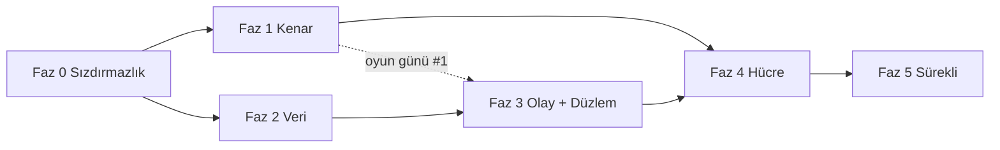

# Küresel Ölçek Dönüşümü — Uygulama Planı

> **Tasarım:** `docs/architecture/2026-09-13-global-scale-cell-architecture-and-ddos.md`
> (önce onu oku; bu plan oradan argüman alır, tekrar etmez).
> **Takvim ve kilometre taşları:** `docs/plans/2026-09-13-global-scale-roadmap.md` (fazların haftalara, sprintlere ve karar noktalarına bağlanması).
> **Biçim:** Her görev dosya adı, kabul ölçütü ve onay kutusu taşır. Bir görev
> "bitti" sayılmak için kabul ölçütünün **ölçülmüş** olması gerekir; "yaptım" yetmez
> (`docs/openidx-k8s-always-on.md` §4'ün dersi).
> **Sıra:** Fazlar bağımlılık sırasındadır. Faz 0 ve Faz 1 paralel gidebilir; Faz 2,
> Faz 3'ün önkoşuludur; Faz 4 hepsini bekler.

---

## Küresel kısıtlar

- Her davranış değişikliği bir bayrak arkasında, varsayılan bugünkü davranış
  (depo geleneği: `ACCESS_ASSIGNMENT_ENFORCE`, `STEPUP_GATE` tri-state modeli).
- Migrasyon yüksek su çizgisi **v187**; bu plan v188'den başlar, numaralar görevlerde.
  `DO $$` blokları yok.
- `orgscope` yeşil kalır; RLS entegrasyon testleri (`internal/common/database/rls_enforcement_test.go`)
  her faz sonunda **pgcat arkasında** da koşar.
- `make lint`, `make test`, `make k8s-chaos` (statik) her PR'da; canlı kaos faz kapısında.
- Hiçbir görev PR'ı "kenar sağlayıcı seçimi" gibi ürün kararını sessizce almaz;
  karar ADR'de, PR onu uygular.

## Roller

| Rol | Sahip olduğu fazlar |
|---|---|
| Kenar / Ağ mimarı | Faz 1, Faz 4 yönlendirme |
| Platform / Veri | Faz 0 (Redis, PG), Faz 2 |
| Servis mühendisliği | Faz 3 |
| SRE / Güvenlik | Faz 0 (zaman aşımı, kota), Faz 5, tüm oyun günleri |

---

## Faz 0 — Sızdırmazlık (2 hafta, kod değişikliği küçük, etki büyük)

Amaç: bugün bir kenar sağlayıcısı öne konduğunda **kendini DDoS eden** noktaları kapatmak.
Hepsi tasarım §3 bulgularının doğrudan karşılığıdır.

### 0.1 Redis'i rollere ayır (B2)

**Dosyalar:** `internal/common/config/config.go`, `internal/common/database/database.go`,
`cmd/*/main.go`, `deployments/docker/docker-compose.yml`, Helm `values*.yaml`, `templates/configmap.yaml`
- [x] `REDIS_RATELIMIT_URL`, `REDIS_SESSION_URL`, `REDIS_REVOCATION_URL` konfig alanları; boşsa `REDIS_URL`'e düşer (geri uyumlu).
- [x] `DistributedRateLimit` yalnız ratelimit istemcisini alır; `internal/revocation` tüketicileri revocation istemcisini; `leader` ve login/MFA oturum anahtarları session istemcisini.
- [x] Compose: üç `redis` servisi; ratelimit örneğinde `--maxmemory 256mb --maxmemory-policy allkeys-lru`; diğerlerinde `noeviction` + AOF.
- [x] Helm: `redis.ratelimit/session/revocation` alt-değerleri; prod'da üç ElastiCache/Azure Cache uç noktası (Terraform `modules/elasticache` üç kez).
- **Kabul:** `redis-cli -h ratelimit DEBUG POPULATE 5000000` ile bellek doldurulduğunda login **çalışmaya devam eder** (session Redis etkilenmez); test `internal/common/middleware/ratelimit_isolation_test.go`.

### 0.2 Gerçek IP zinciri (B3)

**Dosyalar:** `deployments/docker/apisix/apisix.yaml`, `deployments/apisix-edge/seed-edge-routes.sh`,
`internal/common/middleware/trustedproxies.go`, Helm `configmap.yaml`
- [x] APISIX global rule: `real-ip` eklentisi, `source: http_x_forwarded_for` **yalnız** `trusted_addresses` içinden; `limit-req`/`limit-count` anahtarı `$remote_addr` (real-ip sonrası).
- [x] `OIDX_TRUSTED_PROXIES` Helm'de kenar CIDR listesini alan bir değerden üretilir (`edge.trustedCidrs` → `OIDX_EDGE_TRUSTED_CIDRS`, servislerde birleştirilir); `*` değeri `ValidateProduction()`'da **reddedilir**.
- [x] CronJob `edge-cidr-sync`: sağlayıcı CIDR listesini çeker, ConfigMap'i günceller, alınamazsa eskiyi korur. *(Sayaç yerine Job başarısızlığı kullanılır: `OpenIDXEdgeCidrSyncFailed` kuralı `kube_job_status_failed` üzerinden; bir CronJob Prometheus sayacı yayamaz.)*
- **Kabul:** İki farklı `X-Forwarded-For` ile aynı kenar IP'sinden gelen istekler **ayrı** kovalara düşer (test `ratelimit_realip_test.go`); güvenilmeyen kaynaktan sahte XFF yok sayılır.

### 0.3 Zaman aşımı ve boyut sertleştirme (B5, Y2)

**Dosyalar:** `cmd/*/main.go` (http.Server), `internal/server/graceful.go`, `deployments/docker/nginx/nginx.conf`, APISIX rotaları
- [x] Tüm servislerde `ReadHeaderTimeout: 5s`, `MaxHeaderBytes: 16<<10`; ortak yapıcı `server.NewHTTP(cfg)` ile tek yerde (bugün her `main.go` kendi yazıyor).
- [x] `http.MaxBytesReader` rota gruplarına: oauth/governance/audit 1 MB, admin-api ve provisioning (SCIM bulk) 5 MB, identity (CSV import) 10 MB; access ve gateway kenara bırakıldı (yayınlanan uygulamaları proxy'ler). *(Audit search GET'tir; gövde sınırı yerine sorgu zaman aşımı Faz 2.4'te.)*
- [x] HTTP/2: `http2.Server{MaxConcurrentStreams: 100}`.
- [x] nginx: `client_body_timeout 10s; client_header_timeout 10s; limit_conn_zone ... limit_conn perip 50; http2 on`.
- [x] APISIX: her rotada `limit-conn` (ISSUE 200, ADMIN 100, VERIFY 1000 eşzamanlı), `proxy_read_timeout` düzlem başına; ISSUE `retries: 0`.
- **Kabul:** `slowhttptest -c 2000 -H` origin'e karşı: sağlıklı istek p99 < 2× baseline. *(Uygulamada `openidx_http_header_timeout_total` sayacı eklenmedi: Go `http.Server` başlık zaman aşımını olay olarak dışa vermez; birim testi bunun yerine yavaş başlığın `ReadHeaderTimeout` içinde kesildiğini ölçer — `internal/server/http_test.go`.)*

### 0.4 `/health/ready` ve `/metrics` dışa kapansın

- [x] APISIX'te `/health/*`, `/metrics`, `/ready` için `priority: 100` rota → 404; iç ağdan probe'lar doğrudan pod'a.
- **Kabul:** Kenar üzerinden `GET /health/ready` → 404; K8s probe'ları yeşil.

### 0.5 HPA açık ve doğru sinyal (Y1)

**Dosyalar:** Helm `values-prod.yaml`, `templates/hpa.yaml`
- [x] `autoscaling.enabled: true` tüm servislerde; `behavior.scaleUp` 60 s'de ×2, `scaleDown` 300 s stabilizasyon.
- [x] Geçici: CPU %60 (KEDA Faz 3'te gelir).
- **Kabul:** `k6` ile 3× baseline yük → 2 dk içinde replika artar, p99 SLO içinde kalır.

### 0.6 CORS tutarlılığı (O1, O2)

- [x] `cmd/oauth-service/main.go:159-170` satır içi CORS kaldırılır; `ValidateProduction()`'ın izin verdiği ortak CORS middleware'i kullanılır; OAuth için `*` **bilinçli** istisna ise `OAUTH_CORS_WILDCARD=true` bayrağı ve belgede gerekçe.
- [x] APISIX rotalarındaki CORS kopyaları (compose 11, loader 7) tek global rule'a; protokol uçları (token, introspect, revoke, userinfo, discovery) rota seviyesinde `*` — tasarım gereği, çerez taşımaz. *(Kiracı alan adlarından dinamik üretim Faz 4.1 kiracı dizini ile gelir.)*
- **Kabul:** `docs/THREAT-MODEL.md` TB1 satırı kodla uyuşur; kiracı origin listesi `apisix.yaml`'da **tam bir kez** geçer (test: `deployments/docker/apisix_test.go`).

### 0.7 Redis kaybında ISSUE için kademeli düşüş

**Dosya:** `internal/common/middleware/ratelimit.go`
- [x] Redis hatasında auth yolları için replika-yerel sayaç (kota/`RATE_LIMIT_REPLICA_HINT`), süre `RATE_LIMIT_LOCAL_FALLBACK_MAX` (varsayılan 60 s), sonra kapalı-başarısız; `openidx_rate_limit_local_fallback_seconds` gauge; `OpenIDXRateLimitOnLocalFallback` uyarısı 10 s'de.
- **Kabul:** Redis restart (10 s) sırasında login başarı oranı > %99; 60 s'ten uzun kesintide 503 (test `ratelimit_fallback_window_test.go`).

**Faz 0 çıkış kapısı:** Yukarıdaki yedi kabul ölçütü staging hücresinde ölçülmüş;
`docs/architecture/...-ddos.md` §3'te B2, B3, B5, Y1, Y2, O1, O2 satırları "kapandı" işaretli.

**Durum (2026-09-13):** Yedi görevin kodu birleşti; her biri kendi commit'inde ve
birim/entegrasyon düzeyinde ölçüldü (testler: `internal/common/database/redis_roles_test.go`,
`internal/common/middleware/ratelimit_{isolation,realip,fallback_window}_test.go`,
`internal/server/http_test.go`, `deployments/docker/{apisix,nginx,routes,config}_test.go`,
`deployments/apisix-edge/seed-edge-routes.test.sh`; Helm: lint + kubeconform 64/0).
**Staging ölçüm günü henüz yapılmadı** — k6/slowhttptest/`DEBUG POPULATE` ölçümleri bir
hücre gerektirir. M0 bu ölçüm yapılıp `docs/evidence/` altına yazılınca ilan edilir;
kod bitmiş olması M0 değildir.

---

## Faz 1 — Küresel kenar ve origin gizleme (4–6 hafta)

### 1.1 Kenar sağlayıcı modülü (ADR-3)

**Dosyalar:** `deployments/terraform/modules/edge-cloudflare/`, `modules/edge-aws/` (CloudFront + Shield Advanced + WAFv2), `modules/edge-azure/` (Front Door Premium)
- [x] Ortak arayüz: girdi `edge_hostnames[]`, `zone_domain`, `origin_hostname`, `rules_file`; çıktı `edge_cidrs[]`, `origin_verification` (mTLS CA / gizli başlık / `X-Azure-FDID`), `edge_hostname`. Kök: `deployments/terraform/edge` tek `edge_provider` değişkeniyle seçer.
- [x] Her modül `terraform validate` ile CI'da (`.github/workflows/terraform.yml`): kök + cloudflare + azure; aws kök üzerinden (us-east-1 alias gerektirir).
- [x] Kural seti Git'te: `modules/edge-common/rules.json` (§5.3 tablosu); `deployments/terraform/edge_rules_test.go` her kuralın tabloda adlandırıldığını ve boyut sınırlarının Go tabanıyla eşit olduğunu doğrular.
- **Kabul:** Üç modül aynı kök girdisiyle `terraform validate` geçer (ölçüldü: 3/3); kural seti belgede ve kodda aynı (test). *`terraform plan` gerçek hesap ister — K1 verilince.*

### 1.2 Origin gizleme (§5.2)

- [ ] NLB güvenlik grubu / NSG yalnız `edge_cidrs`; origin mTLS: APISIX `ssl.client` ile sağlayıcı istemci sertifikası zorunlu.
- [ ] Origin hostname'i `origin-<cell>.<internal>`; DNS'te kamuya yayınlanmaz.
- **Kabul:** Sağlayıcı dışı IP'den `curl https://origin-...` → TCP reset; sağlayıcı üzerinden 200. CT log'daki sertifika ile doğrudan erişim denemesi başarısız.

### 1.3 Önbellek ve statik yük

- [x] SPA hash'li varlıklar `Cache-Control: public, immutable` + 1 yıl (üç nginx yapılandırmasında: üretim imajı, geliştirme imajı, kenar kutusu); `index.html` `no-cache` (güvenlik başlıkları tekrarlanarak — nginx `add_header` birleştirmez); `/.well-known/openid-configuration` 3600 s ve `jwks.json` 300 s başlıkları zaten handler'larda vardı. **Bulgu:** compose TLS proxy'sindeki `proxy_cache_valid` yıllardır zone'suzdu — hiçbir şey önbelleklenmiyordu; `openidx_edge` zone'u tanımlandı, `proxy_cache_lock` + `use_stale` eklendi.
- **Kabul:** 100k rps JWKS floodu → origin'e ≤ 10 rps. *(Kenar sağlayıcısı önbelleği `edge-common/rules.json` `cache_rules` ile geldi; ölçüm oyun günü #1'de.)*

### 1.4 Bot direnci ve hesap-başına sayaç (Y3)

**Dosyalar:** `internal/common/middleware/ratelimit.go`, `internal/risk`, `internal/oauth/service.go` (handleLogin), `internal/stepup`
- [x] `login_fail:{org}:{sha256(username)}` sayacı (session Redis, `internal/botgate`); eşik `LOGIN_FAIL_CHALLENGE_AFTER` (5) / `LOGIN_FAIL_WINDOW_SECONDS` (900) → `403 challenge_required`; kenar skoru `X-Edge-Bot-Score` (eşik altı → ilk hatadan önce challenge); Cloudflare Turnstile doğrulayıcı (`TURNSTILE_SECRET`), `challenge_token` ile yeniden gönderim.
- [x] Bayrak `BOT_GATE=off|observe|enforce`; observe modunda karar `unified_audit_events`'e `bot_gate` eylemiyle (`would_challenge`); `ReportModeGates` sayımına eklendi.
- [ ] **Kalan:** admin-console login sayfası `challenge_required` yanıtında Turnstile widget'ını gösterip `challenge_token` ile yeniden göndermeli (frontend işi; K1 Cloudflare ise). Şimdilik enforce modunda challenge = pencere sonuna kadar yumuşak kilit.
- **Kabul:** 10.000 IP'den hesap başına 3 deneme simülasyonu (k6) → 5. denemede challenge; meşru kullanıcı (doğru parola) challenge görmez. *(Birim testte ölçüldü: `internal/botgate/botgate_test.go` — adres bağımsız 6. deneme challenge, doğru parola sayaç sıfırlar; k6 senaryosu 1.5'te.)*

### 1.5 DDoS oyun günü #1

- [x] `test/load/ddos/` altında altı k6 senaryosu: JWKS flood, token flood (geçersiz client), login spray, slowloris, SCIM bulk, audit search; ortak `common.js` VERIFY p99 (<30 ms) ve ISSUE meşru başarı (>%99) eşiklerini paylaşır. `scripts/ddos-drill.sh` (`--check` kümesiz sözdizimi+yapı doğrular, canlı koşu STAGING url'sine karşı, üretim/loopback reddedilir), `scripts/ddos-drill.test.sh`, `make ddos-drill`, CI adımı.
- [x] Runbook `docs/runbooks/ddos-under-attack.md` (tasarım §5.7'nin tam sürümü: alarm sinyalleri, kenar "under attack", dar kaynak kesimi, ADMIN'den ISSUE'ya kaynak, hücre hedefi, ters sırayla stand-down).
- [ ] **Kalan (canlı koşu):** k6 + STAGING hücresi gerektirir. `--check` ve self-test CI'da yeşil; gerçek "VERIFY p99 değişmedi / ISSUE > %99" ölçümü **oyun günü M1'de** `docs/evidence/`'e yazılır.
- **Kabul:** Her senaryoda VERIFY p99 < 30 ms **değişmez**; ISSUE meşru trafik başarı > %99; olay zaman çizelgesi belgelenir. *(Senaryolar ve eşikler kodda; ölçüm oyun günü M1.)*

---

## Faz 2 — Veri katmanı (6–8 hafta)

### 2.1 RLS `SET LOCAL` refactor (B1, ADR-4)

**Dosyalar:** `internal/common/database/rls.go`, `database.go`, yeni `tx.go`, `tools/orgscope`
- [ ] `database.WithTx(ctx, fn)`: `BEGIN` → `SET LOCAL app.org_id / app.bypass_rls` → fn → `COMMIT`. Tek-ifade sorgular için `db.Exec/Query` sarmalayıcıları aynı paketlemeyi `pgx.Batch` ile yapar.
- [ ] `beforeAcquire` kancası bayrakla kapatılabilir: `RLS_MODE=session|local` (varsayılan `session`).
- [ ] `orgscope`: `local` modda ham `pool.Query` çağrısı **hata** (sarmalayıcı dışı sorgu yok).
- [ ] `rls_enforcement_test.go` iki modda da koşar; ek test: transaction pooler arkasında iki kiracı eşzamanlı 10k sorgu, sızıntı = 0.
- **Kabul:** Kanarya hücrede `RLS_MODE=local` 2 hafta; `orgscope` yeşil; sızıntı testi 0.

### 2.2 pgcat transaction pooler

**Dosyalar:** Helm `templates/pgcat.yaml`, `values-prod.yaml`, Terraform RDS parametreleri
- [ ] pgcat ×2 (hücre), `pool_mode: transaction`, hücre bütçesi `max_connections` %80.
- [ ] Servis `DB_MAX_CONNS` 10 → 4; `OpenIDXDBPoolSaturation` alarmı pgcat gauge'una taşınır.
- **Kabul:** ISSUE HPA 30 replikaya çıkarken PG bağlantı sayısı sabit; `docs/architecture/db-pooling.md` §"Why NOT pgbouncer" bölümü "artık uygulanabilir (RLS_MODE=local)" notuyla güncellenir.

### 2.3 Okuma replikası varsayılan (ADMIN)

- [ ] `values-prod.yaml` `readReplica: true`; ADMIN düzlemi sorguları `Reader()`; ISSUE/VERIFY birincil.
- **Kabul:** `make ha-drill` replika kaybında ADMIN birincile düşer, ISSUE etkilenmez.

### 2.4 Düzlem başına PG rolü ve `statement_timeout`

- [ ] Migrasyon **v188**: roller `openidx_issue`, `openidx_admin`, `openidx_event` (hepsi `openidx_app`'ten miras, FORCE RLS aynı), `statement_timeout` 2 s / 10 s / 30 s.
- **Kabul:** ADMIN'de 15 s'lik yapay sorgu → iptal; ISSUE etkilenmez.

### 2.5 Keyset sayfalama

- [ ] Audit olay listesi ve SCIM `/Users` `OFFSET` → keyset (`(ts,id)` imleci); API `next_cursor` alanı, `startIndex` geri uyumlu.
- **Kabul:** 50M satırda sayfa 1000 → p99 < 100 ms.

---

## Faz 3 — Olay omurgası ve servis düzlemleri (6–8 hafta)

### 3.1 Outbox platform ilkeli (B4, ADR-6)

**Dosyalar:** `internal/common/events/outbox.go`, migrasyon **v189** (`outbox` tablosu, `org_id`, RLS), `cmd/event-relay/`
- [ ] `OutboxBus.Publish(ctx, ev)` aktif `pgx.Tx`'i context'ten alır; yoksa hata (yayın işlem dışında yapılamaz).
- [ ] Relay worker: lider seçimli, 100'lük batch, NATS JetStream'e `events.<cell>.<org>.<type>`; başarıda `published_at`.
- [ ] Mevcut SSF ve SCIM outbound outbox'ları bu ilkele göç eder (iki ayrı tablo kalkar).
- **Kabul:** Relay 10 dk kapalı → olay kaybı 0, kuyruğa alınan sayı = üretilen sayı; idempotent tüketici çift teslimi yutar (test `outbox_relay_test.go`).

### 3.2 NATS JetStream (hücre içi)

- [ ] Helm `templates/nats.yaml` ×3, stream retention 7 gün, kiracı bazlı konu izinleri.
- **Kabul:** Bir NATS pod kaybı → yayın sürer; `make k8s-chaos` canlı moda eklenir.

### 3.3 Tüketiciler

- [ ] Audit indexer (PG sıcak + ES); `internal/audit/service.go` çift yazımı kalkar, `StartESReconciler` emekli.
- [ ] Webhook deliverer: satır içi ateşleme kalkar; `internal/webhooks` tüketici olur.
- [ ] Kill-switch olayı → Ziti reconciler + session revoker; hedef p95 < 2 s (ADR-11).
- [ ] Cache invalidation: rol/izin değişimi → session Redis anahtarları.
- **Kabul:** Kill-switch uçtan uca p95 ölçülür ve panoda; audit olayı ES'te ≤ 5 s.

### 3.4 Düzlem ayrımı (ADR-2)

**Dosyalar:** `cmd/verify-service/`, `cmd/identity-auth/` (veya identity-service bayrakla iki profil), `cmd/*-worker/`, Helm şablonları, `networkpolicy.yaml`
- [ ] `verify-service`: JWKS sunumu, introspection, `/access/.auth/*` forward-auth; PG bağımlılığı **yok** (import guard testi: `internal/common/importguard` deseniyle `pgx` importu yasak).
- [ ] identity-service `SERVICE_PROFILE=auth|admin`: auth profili yalnız login/MFA/passwordless rotalarını kaydeder.
- [ ] governance/provisioning/audit ticker'ları `cmd/<svc>-worker` binary'lerine; API pod'larında `RunPeriodic` çağrısı yok.
- [ ] APISIX upstream'leri düzlem başına; NetworkPolicy düzlem etiketleriyle; `nodeSelector: plane=issue` ayrı düğüm havuzu.
- **Kabul:** ADMIN düzlemine 10× yük → ISSUE p99 değişmez (k6 senaryosu "admin flood"); verify-service pod'unda PG bağlantısı 0.

### 3.5 Kabul denetleyicisi ve maliyet kotası (ADR-10)

**Dosyalar:** `internal/common/middleware/admission.go`, `ratelimit.go`
- [ ] `Admission(cfg)`: `MaxInflight`, `QueueTimeout`, 503 + `Retry-After`; metrik `openidx_admission_{inflight,rejected_total,queue_wait_seconds}`.
- [ ] Rota maliyeti tablosu (`RouteCost`), kiracı bütçesi birim/dk; bayrak `RATELIMIT_COST_MODE=off|observe|enforce`.
- **Kabul:** Token floodu (maliyet 5) kiracı bütçesini tüketir, aynı kiracının JWKS/okuma istekleri (maliyet 1) **etkilenmez**; komşu kiracı hiç etkilenmez.

### 3.6 KEDA

- [ ] Prometheus tetikleyicileri: ISSUE kuyruk bekleme p95, VERIFY rps/pod, EVENT NATS lag.
- **Kabul:** Faz 0.5 HPA testi tekrar; ölçekleme CPU'dan **önce** tetiklenir.

---

## Faz 4 — Hücre modeli ve ikinci bölge (8–12 hafta)

### 4.1 Kiracı dizini (küresel kontrol düzlemi, minimal)

**Dosyalar:** `cmd/tenant-directory/` (küçük, salt-okur ağır), migrasyon **v190** (`org_cells`), Terraform `modules/global-control-plane`
- [ ] `org → {cell_id, region, residency, status}`; yazma yalnız kayıt/taşıma; okuma kenar KV'ye itilir (60 s TTL).
- [ ] JWT `cell` claim'i; yanlış hücreye gelen istek `421 Misdirected Request` + `X-OpenIDX-Cell`.
- **Kabul:** Kiracı dizini 10 dk kapalı → mevcut kiracılar için sıfır etki (kenar önbelleği); yeni kayıt kuyruğa.

### 4.2 Hücre Terraform modülü

- [ ] `modules/cell`: VPC/VNet, küme, pgcat+PG (Multi-AZ), 3 Redis, NATS, ES, Ziti fabric, Helm release; girdi `cell_id, region, size=s|m|l`.
- [ ] "Küçük hücre" profili (tek AZ, min replika) ilk pazarlar için.
- **Kabul:** `terraform apply` sıfırdan hücre < 90 dk; `make k8s-chaos` canlı yeşil; `make dr-game-day` geçer.

### 4.3 İkinci bölge ve kanarya hücre

- [ ] `eu-1` (mevcut) + `us-1`; `canary-1` küçük hücre, sürüm dalgası: canary → eu-1 → us-1.
- [ ] Release workflow (`.github/workflows/release.yml`) hücre sıralı dağıtım adımı.
- **Kabul:** Bir hücrenin tamamen kapatılması (oyun günü) diğer hücrenin SLO'larını **hiç** etkilemez; ölçüm panoda.

### 4.4 Hücre başına anahtar ve KEK

- [ ] JWT imza anahtarı `kid=<cell>-<n>`; `cmd/rekey` hücre kapsamı; OpenBao/KMS hücre başına.
- **Kabul:** Bir hücrenin imza anahtarının sızması diğer hücrede token doğrulatamaz (test: çapraz hücre JWT → 401).

### 4.5 Ziti kontrol düzlemi koruması (Y4)

- [ ] Controller/router ayrı hostname + L4 LB, kenar HTTP yolundan çıkar; enrollment JWT 15 dk, tek kullanımlık, kiracı başına saatte N (`access-service`).
- **Kabul:** Enrollment floodu (k6, 10k/dk) → controller Raft sağlıklı, kurulu tüneller kesilmez, meşru enrollment < 5 s.

---

## Faz 5 — Sürekli (çeyreklik)

- [ ] DDoS oyun günü (Faz 1.5 senaryoları + yeni vektörler) her çeyrek, her hücrede.
- [ ] `make k8s-chaos` canlı aylık; sonuç `docs/evidence/` altına.
- [ ] SLO incelemesi; hata bütçesi politikası (`docs/PRODUCTION-READINESS.md`'e bölüm).
- [ ] Kenar CIDR/kural drift denetimi (Git ↔ sağlayıcı) haftalık CI.
- [ ] Bu plan ve tasarım belgesi çeyrek sonunda yeniden doğrulanır; kapanan bulgular çizilir.

---

## Bağımlılık grafiği

## Başarı tanımı (proje sonu)

| Ölçüt | Hedef | Nasıl ölçülür |
|---|---|---|
| Hücre kaybı blast radius | Yalnız o hücrenin kiracıları | Faz 4.3 oyun günü |
| Verify p99 saldırı altında | < 30 ms, değişmez | Faz 1.5 / 5 k6 |
| Issue meşru başarı saldırı altında | > %99 | aynı |
| PG bağlantısı vs replika | Bağımsız (pgcat) | Faz 2.2 |
| Kill-switch uçtan uca | p95 < 2 s | Faz 3.3 panosu |
| Kiracı sızıntısı | 0, iki RLS modunda | Faz 2.1 testi, `orgscope` |
| Origin'e doğrudan erişim | İmkânsız | Faz 1.2 |
