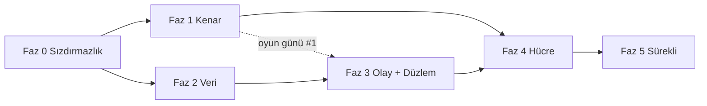

# Küresel Ölçek Dönüşümü — Uygulama Planı

> **Tasarım:** `docs/architecture/2026-09-13-global-scale-cell-architecture-and-ddos.md`
> (önce onu oku; bu plan oradan argüman alır, tekrar etmez).
> **Takvim ve kilometre taşları:** `docs/plans/2026-09-13-global-scale-roadmap.md` (fazların haftalara, sprintlere ve karar noktalarına bağlanması).
> **Biçim:** Her görev dosya adı, kabul ölçütü ve onay kutusu taşır. Bir görev
> "bitti" sayılmak için kabul ölçütünün **ölçülmüş** olması gerekir; "yaptım" yetmez
> (`docs/openidx-k8s-always-on.md` §4'ün dersi).
> **Sıra:** Fazlar bağımlılık sırasındadır. Faz 0 ve Faz 1 paralel gidebilir; Faz 2,
> Faz 3'ün önkoşuludur; Faz 4 hepsini bekler.

---

## Küresel kısıtlar

- Her davranış değişikliği bir bayrak arkasında, varsayılan bugünkü davranış
  (depo geleneği: `ACCESS_ASSIGNMENT_ENFORCE`, `STEPUP_GATE` tri-state modeli).
- Migrasyon yüksek su çizgisi **v187**; bu plan v188'den başlar, numaralar görevlerde.
  `DO $$` blokları yok.
- `orgscope` yeşil kalır; RLS entegrasyon testleri (`internal/common/database/rls_enforcement_test.go`)
  her faz sonunda **pgcat arkasında** da koşar.
- `make lint`, `make test`, `make k8s-chaos` (statik) her PR'da; canlı kaos faz kapısında.
- Hiçbir görev PR'ı "kenar sağlayıcı seçimi" gibi ürün kararını sessizce almaz;
  karar ADR'de, PR onu uygular.

## Roller

| Rol | Sahip olduğu fazlar |
|---|---|
| Kenar / Ağ mimarı | Faz 1, Faz 4 yönlendirme |
| Platform / Veri | Faz 0 (Redis, PG), Faz 2 |
| Servis mühendisliği | Faz 3 |
| SRE / Güvenlik | Faz 0 (zaman aşımı, kota), Faz 5, tüm oyun günleri |

---

## Faz 0 — Sızdırmazlık (2 hafta, kod değişikliği küçük, etki büyük)

Amaç: bugün bir kenar sağlayıcısı öne konduğunda **kendini DDoS eden** noktaları kapatmak.
Hepsi tasarım §3 bulgularının doğrudan karşılığıdır.

### 0.1 Redis'i rollere ayır (B2)

**Dosyalar:** `internal/common/config/config.go`, `internal/common/database/database.go`,
`cmd/*/main.go`, `deployments/docker/docker-compose.yml`, Helm `values*.yaml`, `templates/configmap.yaml`
- [x] `REDIS_RATELIMIT_URL`, `REDIS_SESSION_URL`, `REDIS_REVOCATION_URL` konfig alanları; boşsa `REDIS_URL`'e düşer (geri uyumlu).
- [x] `DistributedRateLimit` yalnız ratelimit istemcisini alır; `internal/revocation` tüketicileri revocation istemcisini; `leader` ve login/MFA oturum anahtarları session istemcisini.
- [x] Compose: üç `redis` servisi; ratelimit örneğinde `--maxmemory 256mb --maxmemory-policy allkeys-lru`; diğerlerinde `noeviction` + AOF.
- [x] Helm: `redis.ratelimit/session/revocation` alt-değerleri; prod'da üç ElastiCache/Azure Cache uç noktası (Terraform `modules/elasticache` üç kez).
- **Kabul:** `redis-cli -h ratelimit DEBUG POPULATE 5000000` ile bellek doldurulduğunda login **çalışmaya devam eder** (session Redis etkilenmez); test `internal/common/middleware/ratelimit_isolation_test.go`.

### 0.2 Gerçek IP zinciri (B3)

**Dosyalar:** `deployments/docker/apisix/apisix.yaml`, `deployments/apisix-edge/seed-edge-routes.sh`,
`internal/common/middleware/trustedproxies.go`, Helm `configmap.yaml`
- [x] APISIX global rule: `real-ip` eklentisi, `source: http_x_forwarded_for` **yalnız** `trusted_addresses` içinden; `limit-req`/`limit-count` anahtarı `$remote_addr` (real-ip sonrası).
- [x] `OIDX_TRUSTED_PROXIES` Helm'de kenar CIDR listesini alan bir değerden üretilir (`edge.trustedCidrs` → `OIDX_EDGE_TRUSTED_CIDRS`, servislerde birleştirilir); `*` değeri `ValidateProduction()`'da **reddedilir**.
- [x] CronJob `edge-cidr-sync`: sağlayıcı CIDR listesini çeker, ConfigMap'i günceller, alınamazsa eskiyi korur. *(Sayaç yerine Job başarısızlığı kullanılır: `OpenIDXEdgeCidrSyncFailed` kuralı `kube_job_status_failed` üzerinden; bir CronJob Prometheus sayacı yayamaz.)*
- **Kabul:** İki farklı `X-Forwarded-For` ile aynı kenar IP'sinden gelen istekler **ayrı** kovalara düşer (test `ratelimit_realip_test.go`); güvenilmeyen kaynaktan sahte XFF yok sayılır.

### 0.3 Zaman aşımı ve boyut sertleştirme (B5, Y2)

**Dosyalar:** `cmd/*/main.go` (http.Server), `internal/server/graceful.go`, `deployments/docker/nginx/nginx.conf`, APISIX rotaları
- [x] Tüm servislerde `ReadHeaderTimeout: 5s`, `MaxHeaderBytes: 16<<10`; ortak yapıcı `server.NewHTTP(cfg)` ile tek yerde (bugün her `main.go` kendi yazıyor).
- [x] `http.MaxBytesReader` rota gruplarına: oauth/governance/audit 1 MB, admin-api ve provisioning (SCIM bulk) 5 MB, identity (CSV import) 10 MB; access ve gateway kenara bırakıldı (yayınlanan uygulamaları proxy'ler). *(Audit search GET'tir; gövde sınırı yerine sorgu zaman aşımı Faz 2.4'te.)*
- [x] HTTP/2: `http2.Server{MaxConcurrentStreams: 100}`.
- [x] nginx: `client_body_timeout 10s; client_header_timeout 10s; limit_conn_zone ... limit_conn perip 50; http2 on`.
- [x] APISIX: her rotada `limit-conn` (ISSUE 200, ADMIN 100, VERIFY 1000 eşzamanlı), `proxy_read_timeout` düzlem başına; ISSUE `retries: 0`.
- **Kabul:** `slowhttptest -c 2000 -H` origin'e karşı: sağlıklı istek p99 < 2× baseline. *(Uygulamada `openidx_http_header_timeout_total` sayacı eklenmedi: Go `http.Server` başlık zaman aşımını olay olarak dışa vermez; birim testi bunun yerine yavaş başlığın `ReadHeaderTimeout` içinde kesildiğini ölçer — `internal/server/http_test.go`.)*

### 0.4 `/health/ready` ve `/metrics` dışa kapansın

- [x] APISIX'te `/health/*`, `/metrics`, `/ready` için `priority: 100` rota → 404; iç ağdan probe'lar doğrudan pod'a.
- **Kabul:** Kenar üzerinden `GET /health/ready` → 404; K8s probe'ları yeşil.

### 0.5 HPA açık ve doğru sinyal (Y1)

**Dosyalar:** Helm `values-prod.yaml`, `templates/hpa.yaml`
- [x] `autoscaling.enabled: true` tüm servislerde; `behavior.scaleUp` 60 s'de ×2, `scaleDown` 300 s stabilizasyon.
- [x] Geçici: CPU %60 (KEDA Faz 3'te gelir).
- **Kabul:** `k6` ile 3× baseline yük → 2 dk içinde replika artar, p99 SLO içinde kalır.

### 0.6 CORS tutarlılığı (O1, O2)

- [x] `cmd/oauth-service/main.go:159-170` satır içi CORS kaldırılır; `ValidateProduction()`'ın izin verdiği ortak CORS middleware'i kullanılır; OAuth için `*` **bilinçli** istisna ise `OAUTH_CORS_WILDCARD=true` bayrağı ve belgede gerekçe.
- [x] APISIX rotalarındaki CORS kopyaları (compose 11, loader 7) tek global rule'a; protokol uçları (token, introspect, revoke, userinfo, discovery) rota seviyesinde `*` — tasarım gereği, çerez taşımaz. *(Kiracı alan adlarından dinamik üretim Faz 4.1 kiracı dizini ile gelir.)*
- **Kabul:** `docs/THREAT-MODEL.md` TB1 satırı kodla uyuşur; kiracı origin listesi `apisix.yaml`'da **tam bir kez** geçer (test: `deployments/docker/apisix_test.go`).

### 0.7 Redis kaybında ISSUE için kademeli düşüş

**Dosya:** `internal/common/middleware/ratelimit.go`
- [x] Redis hatasında auth yolları için replika-yerel sayaç (kota/`RATE_LIMIT_REPLICA_HINT`), süre `RATE_LIMIT_LOCAL_FALLBACK_MAX` (varsayılan 60 s), sonra kapalı-başarısız; `openidx_rate_limit_local_fallback_seconds` gauge; `OpenIDXRateLimitOnLocalFallback` uyarısı 10 s'de.
- **Kabul:** Redis restart (10 s) sırasında login başarı oranı > %99; 60 s'ten uzun kesintide 503 (test `ratelimit_fallback_window_test.go`).

**Faz 0 çıkış kapısı:** Yukarıdaki yedi kabul ölçütü staging hücresinde ölçülmüş;
`docs/architecture/...-ddos.md` §3'te B2, B3, B5, Y1, Y2, O1, O2 satırları "kapandı" işaretli.

**Durum (2026-09-13):** Yedi görevin kodu birleşti; her biri kendi commit'inde ve
birim/entegrasyon düzeyinde ölçüldü (testler: `internal/common/database/redis_roles_test.go`,
`internal/common/middleware/ratelimit_{isolation,realip,fallback_window}_test.go`,
`internal/server/http_test.go`, `deployments/docker/{apisix,nginx,routes,config}_test.go`,
`deployments/apisix-edge/seed-edge-routes.test.sh`; Helm: lint + kubeconform 64/0).
**Staging ölçüm günü henüz yapılmadı** — k6/slowhttptest/`DEBUG POPULATE` ölçümleri bir
hücre gerektirir. M0 bu ölçüm yapılıp `docs/evidence/` altına yazılınca ilan edilir;
kod bitmiş olması M0 değildir.

---

## Faz 1 — Küresel kenar ve origin gizleme (4–6 hafta)

### 1.1 Kenar sağlayıcı modülü (ADR-3)

**Dosyalar:** `deployments/terraform/modules/edge-cloudflare/`, `modules/edge-aws/` (CloudFront + Shield Advanced + WAFv2), `modules/edge-azure/` (Front Door Premium)
- [x] Ortak arayüz: girdi `edge_hostnames[]`, `zone_domain`, `origin_hostname`, `rules_file`; çıktı `edge_cidrs[]`, `origin_verification` (mTLS CA / gizli başlık / `X-Azure-FDID`), `edge_hostname`. Kök: `deployments/terraform/edge` tek `edge_provider` değişkeniyle seçer.
- [x] Her modül `terraform validate` ile CI'da (`.github/workflows/terraform.yml`): kök + cloudflare + azure; aws kök üzerinden (us-east-1 alias gerektirir).
- [x] Kural seti Git'te: `modules/edge-common/rules.json` (§5.3 tablosu); `deployments/terraform/edge_rules_test.go` her kuralın tabloda adlandırıldığını ve boyut sınırlarının Go tabanıyla eşit olduğunu doğrular.
- **Kabul:** Üç modül aynı kök girdisiyle `terraform validate` geçer (ölçüldü: 3/3); kural seti belgede ve kodda aynı (test). *`terraform plan` gerçek hesap ister — K1 verilince.*

### 1.2 Origin gizleme (§5.2)

**K1 = Azure Front Door Premium** olduğu için origin gizleme mTLS ile değil, **iki katman** ile yapılır (Cloudflare seçilseydi Authenticated Origin Pulls tek başına yeterdi):

- [x] **Ağ katmanı:** AKS alt ağına NSG — yalnız `AzureFrontDoor.Backend` servis etiketi 80/443'e girebilir, `Internet` açıkça reddedilir (`deployments/terraform/azure/main.tf`). Servis etiketi, elle kopyalanmış CIDR listesinin aksine Azure tarafından güncel tutulur. Çıktı: `origin_locked_to_front_door`.
- [x] **Uygulama katmanı:** servis etiketi **her kiracının** Front Door'unu kabul eder, bu yüzden origin ayrıca "hangi Front Door" sorusunu sorar: `X-Azure-FDID` = profil GUID'i. Ingress `configuration-snippet` ile 403 döner (`edge.originVerify.*`; yarı yapılandırma render'ı düşürür), APISIX kenarı için `EDGE_ORIGIN_VERIFY_HEADER/VALUE` global `request-validation` kuralı. Controller'da `allow-snippet-annotations: "true"` (1.9'dan beri varsayılan kapalı — açılmazsa annotation sessizce yok sayılırdı).
- [x] Origin hostname'i kamuya yayınlanmaz; **ama** CT log'u hostname'leri yayınladığı için "kimse bilmiyor" bir kontrol sayılmaz — kontrol yukarıdaki iki katmandır.
- **Kabul:** Sağlayıcı dışı IP'den origin'e istek → NSG'de reddedilir; servis etiketinden gelen ama `X-Azure-FDID` taşımayan istek → **403**. *(Render ve seed düzeyinde ölçüldü: annotation üç durumda da doğru — kapalı/açık/yarı; canlı `curl` ölçümü M1 oyun gününde.)*

### 1.3 Önbellek ve statik yük

- [x] SPA hash'li varlıklar `Cache-Control: public, immutable` + 1 yıl (üç nginx yapılandırmasında: üretim imajı, geliştirme imajı, kenar kutusu); `index.html` `no-cache` (güvenlik başlıkları tekrarlanarak — nginx `add_header` birleştirmez); `/.well-known/openid-configuration` 3600 s ve `jwks.json` 300 s başlıkları zaten handler'larda vardı. **Bulgu:** compose TLS proxy'sindeki `proxy_cache_valid` yıllardır zone'suzdu — hiçbir şey önbelleklenmiyordu; `openidx_edge` zone'u tanımlandı, `proxy_cache_lock` + `use_stale` eklendi.
- **Kabul:** 100k rps JWKS floodu → origin'e ≤ 10 rps. *(Kenar sağlayıcısı önbelleği `edge-common/rules.json` `cache_rules` ile geldi; ölçüm oyun günü #1'de.)*

### 1.4 Bot direnci ve hesap-başına sayaç (Y3)

**Dosyalar:** `internal/common/middleware/ratelimit.go`, `internal/risk`, `internal/oauth/service.go` (handleLogin), `internal/stepup`
- [x] `login_fail:{org}:{sha256(username)}` sayacı (session Redis, `internal/botgate`); eşik `LOGIN_FAIL_CHALLENGE_AFTER` (5) / `LOGIN_FAIL_WINDOW_SECONDS` (900) → `403 challenge_required`; kenar skoru `X-Edge-Bot-Score` (eşik altı → ilk hatadan önce challenge); Cloudflare Turnstile doğrulayıcı (`TURNSTILE_SECRET`), `challenge_token` ile yeniden gönderim.
- [x] Bayrak `BOT_GATE=off|observe|enforce`; observe modunda karar `unified_audit_events`'e `bot_gate` eylemiyle (`would_challenge`); `ReportModeGates` sayımına eklendi.
- [ ] **Kalan:** admin-console login sayfası `challenge_required` yanıtında Turnstile widget'ını gösterip `challenge_token` ile yeniden göndermeli (frontend işi; K1 Cloudflare ise). Şimdilik enforce modunda challenge = pencere sonuna kadar yumuşak kilit.
- **Kabul:** 10.000 IP'den hesap başına 3 deneme simülasyonu (k6) → 5. denemede challenge; meşru kullanıcı (doğru parola) challenge görmez. *(Birim testte ölçüldü: `internal/botgate/botgate_test.go` — adres bağımsız 6. deneme challenge, doğru parola sayaç sıfırlar; k6 senaryosu 1.5'te.)*

### 1.5 DDoS oyun günü #1

- [x] `test/load/ddos/` altında altı k6 senaryosu: JWKS flood, token flood (geçersiz client), login spray, slowloris, SCIM bulk, audit search; ortak `common.js` VERIFY p99 (<30 ms) ve ISSUE meşru başarı (>%99) eşiklerini paylaşır. `scripts/ddos-drill.sh` (`--check` kümesiz sözdizimi+yapı doğrular, canlı koşu STAGING url'sine karşı, üretim/loopback reddedilir), `scripts/ddos-drill.test.sh`, `make ddos-drill`, CI adımı.
- [x] Runbook `docs/runbooks/ddos-under-attack.md` (tasarım §5.7'nin tam sürümü: alarm sinyalleri, kenar "under attack", dar kaynak kesimi, ADMIN'den ISSUE'ya kaynak, hücre hedefi, ters sırayla stand-down).
- [ ] **Kalan (canlı koşu):** k6 + STAGING hücresi gerektirir. `--check` ve self-test CI'da yeşil; gerçek "VERIFY p99 değişmedi / ISSUE > %99" ölçümü **oyun günü M1'de** `docs/evidence/`'e yazılır.
- **Kabul:** Her senaryoda VERIFY p99 < 30 ms **değişmez**; ISSUE meşru trafik başarı > %99; olay zaman çizelgesi belgelenir. *(Senaryolar ve eşikler kodda; ölçüm oyun günü M1.)*

---

## Faz 2 — Veri katmanı (6–8 hafta)

### 2.1 RLS `SET LOCAL` refactor (B1, ADR-4)

**Dosyalar:** `internal/common/database/rls.go`, `database.go`, yeni `tx.go`, `tools/orgscope`
- [x] `database.WithTx(ctx, fn)`: `BEGIN` → `set_config(..., true)` (SET LOCAL; `SET LOCAL app.org_id = $1` geçerli SQL değil, parametreli `set_config` kullanılır) → fn → `COMMIT`. Tek-ifade sorgular için `db.Exec/Query/QueryRow` sarmalayıcıları; `Query`/`QueryRow` işlemi satırların ömrü boyunca açık tutar ve `Close`/`Scan` ile kapatır.
- [x] `beforeAcquire` kancası bayrakla kapatılır: `RLS_MODE=session|local` (varsayılan `session`); yedi servis başlangıçta `SetRLSMode` çağırır (migrate hariç: DDL, tek bağlantı, bypass).
- [x] **Tasarım değişti — daha güvenli ve çok daha küçük.** Plan 1.950 çağrı yerinin elle taşınmasını öngörüyordu; **her atlanan satır sessizce kapsamsız bir sorgu** olurdu (FORCE RLS altında sıfır satır döner, test kırmızıya dönmez). Bunun yerine kapsam **tipe** taşındı: `database.ScopedPool` (`scopedpool.go`), `PostgresDB.Pool`'un tipi. Metot kümesi `*pgxpool.Pool` ile aynı olduğu için **1.933 çağrı yeri tek karakter değişmeden** kapsamlı hale geldi; soru "bu satırı hatırladık mı?" yerine "derleniyor mu?" oldu. Derleyici 11 değer-geçişi yerini buldu; her biri tek tek incelendi (`Raw()` = kurulum-geneli/istatistik, arayüz = kiracı tablosu okuyanlar). **Bulgu:** `audit.CrossOrgAuditor` bypass bağlamıyla yazıyor — `Raw()` verilseydi local modda hiç işaret taşımaz ve zorunlu çapraz-org denetim satırı `WITH CHECK` tarafından reddedilirdi; arayüze çevrildi.
- [x] **`orgscope` `Raw()` kuralı** (`tools/orgscope/rawpool.go`). Üç bulgu: (1) `Raw()` üzerinden erişilen kiracı tablosu — **SQL'de `org_id` yazması bulguyu temizlemez**, çünkü politika onu `current_setting('app.org_id')` ile karşılaştırır, kapsam yoksa satır görünmez; (2) `Raw()` üzerinden yapılan, SQL'i okunamayan bir çağrı (bu depoda sorgular çoğunlukla değişkende) → **kapalı düşer**, `Begin()` dahil; (3) vetlenmemiş bir fonksiyona verilen kapsamsız havuz — `rawHandoffAllowed` kaydı, her girdi gerekçesiyle (`installWideTables` ile aynı desen). Kaçış yolu aynı `//orgscope:ignore <gerekçe>`. CI kapısı artık `./internal ./cmd` (meşru handoff'lar `cmd/`'de yaşıyor). 16 test; ayrıca gerçek ağaçta mutasyonla doğrulandı.
- [x] **Bulgu — 2.1b'nin bıraktığı gerçek delik: `Reader()`.** Tip değişimi `db.Pool`'u kapsamlı yaptı ama `Reader()` çıplak `*pgxpool.Pool` döndürmeye devam ediyordu. Replika yapılandırılmadığında `Reader()` birincile düşer, yani **hiçbir şey bozulmadı, hiçbir şey derlenmedi bile denemedi** — ve local modda ~12 okuma yolu sorgusu (kullanıcı id/kullanıcı adı/e-posta ile, oturumlar, gruplar, oauth istemcileri) hiç `app.org_id` taşımayacaktı. FORCE RLS altında bu hata değil, **sıfır satır**: login "böyle bir kullanıcı yok" derdi. `Reader()` artık `*ScopedPool` döndürüyor; **tek bir üretim çağrı yeri** (`WithReadTx`) derlemeyi kırdı, kalan ~12'si değişmeden kapsamlı hale geldi. Gerçek Postgres'e karşı ölçüldü (`TestScopedPool_ReaderIsScopedToo`) ve `Reader().Raw()` mutasyonuyla kırmızıya döndüğü (`no rows in result set`) doğrulandı.
- [x] `rls_local_test.go` iki modda da koşar, **tek bağlantılı** havuzda (pooler'ın yarattığı şekil): iki kiracı dönüşümlü 25 tur, 200 eşzamanlı okuma, sızıntı = 0; commit sonrası kapsam bağlantıda kalmıyor (pooling'i güvenli kılan özellik); çapraz-kiracı yazma `WITH CHECK` ile reddediliyor; hata yollarında bağlantı sızıntısı yok. Süit **superuser rolü reddeder** (Postgres superuser'ı her politikadan muaf tutar — aksi halde kemer kesikken de yeşil yanardı) ve iki mutasyonla kırmızıya döndüğü doğrulandı. CI işi: `rls-isolation`.
- **Kabul:** Kanarya hücrede `RLS_MODE=local` 2 hafta; `orgscope` yeşil; sızıntı testi 0.

### 2.2 pgcat transaction pooler

**Dosyalar:** Helm `templates/pgcat.yaml`, `_helpers.tpl`, sekiz servis şablonu, `prometheus-rules.yaml`, `values.yaml`, `.github/workflows/helm.yml`
- [x] pgcat ×2, `pool_mode = "transaction"`, `maxUnavailable: 0`, PDB `minAvailable: 1`, düğümler arası anti-affinity. **Varsayılan kapalı.**
- [x] **Kilit (override yok):** `pgcat.enabled=true` iken `config.rlsMode != "local"` ise chart **render olmayı reddeder**. Gerekçe ölçüm: kenar durumu değil, `docs/evidence/2026-09-13-rls-transaction-pooling.md` §1. İkinci ret: `preparedStatementsCacheSize = 0` (pgcat'in **kendi varsayılanı**) → tek sorgu koşturamayan bir filo.
- [x] **Yönlendirme chart'ın işi, operatörün değil.** Sekiz istek-sunan Deployment `DATABASE_URL`'ı `<release>-pgcat:6432`'ye çevirir (`env`, `envFrom`'u yener); **migrate Job'ı, bootstrap hook'u ve backup CronJob'ı doğrudan DSN'de kalır** — hiçbiri transaction pooling'de yaşamaz (migrasyonun advisory lock'u session kapsamlı, `pg_dump` tek oturumda tek anlık görüntü ister). Plan bunu "operatör `DATABASE_URL`'ı çevirir" diye bırakıyordu; bu, hiçbir şeyin kullanmadığı ya da yarısının kullandığı bir pooler demekti.
- [x] Bağlantı bütçesi `replicaCount × poolSize` = 2 × 40 = **80, sabit** (poolerʼsız: `8 × replika × DB_MAX_CONNS`, HPA ile çarpılır).
- [x] Görünürlük: pgcat Prometheus exporter'ı açık + kendi ServiceMonitor'ı; `OpenIDXPoolerClientsWaiting` (havuz tükendi → istek kuyrukta) `OpenIDXDBPoolSaturation`'ın yerini alır, `OpenIDXPoolerNoRedundancy` veritabanının önündeki yeni tek hata noktasını korur. Metrik adları pgcat v1.2.0 kaynağından doğrulandı (`pgcat_pools_*`).
- [x] CI: "The transaction pooler is safe by construction" — beş iddia (varsayılan kapalı, iki ret, sekiz servis yönlendirildi, Job'lar yönlendirilmedi, `pgcat.toml` TOML olarak ayrışır ve `prepared_statements_cache_size` **pool** bölümünde). **Her biri koruduğu şey kırılarak** kırmızıya döndürüldü.
- [x] **Plan'dan sapma — `DB_MAX_CONNS` 10 → 4 yapılmadı.** Pooler'ın arkasında bu sayı artık Postgres'i korumuyor; pooler'a açılan *ucuz istemci* bağlantılarını boyutluyor. Düşürmek yalnızca servis içi eşzamanlılığı kısardı, backend sayısını değil. Gerekçe koda ve `values.yaml`'a yazıldı.
- [x] **Bulgular (hepsi kaynak/registry denetiminden, çalışan pgcat'ten değil):** `1.1.1` etiketi **yok** (registry'de tek sürüm etiketi `v1.2.0`); `prepared_statements` diye bir `[general]` anahtarı yok ve pgcat bilinmeyen anahtarları **sessizce yok sayıyor**; imajda `ENTRYPOINT` yok (`CMD ["pgcat"]`), yani yalnız `args` vermek binary'yi TOML dosyasıyla değiştiriyordu. Üçü de `helm lint`, `helm template` ve kubeconform'dan geçiyordu.
- [ ] **Kalan:** `values-prod.yaml`'da açılması, Terraform RDS `max_connections`, ve asıl ölçüm.
- **Kabul:** ISSUE HPA 30 replikaya çıkarken PG bağlantı sayısı sabit. *(Ölçülmedi — kanarya kapısı geçerli: `RLS_MODE=local` 2 hafta + `orgscope` bitmiş olmalı. `docs/architecture/db-pooling.md` "the chart ships the pooler" notuyla güncellendi.)*

### 2.3 Okuma replikası varsayılan (ADMIN)

- [x] **Önce kabul kriterinin kendisi yalandı, onu düzelttik.** Üç yerde (`Reader()` yorumu, sağlık denetleyicisi, `values-prod.yaml`) "replika kaybında trafik şeffafça birincile düşer" yazıyordu. Bu **yalnızca açılışta** doğruydu: `NewPostgres` replika havuzunu açamazsa `readPool` nil kalır ve `Reader()` sonsuza dek birincili döndürür. Havuz bir kez açıldıktan sonra `Reader()` onu koşulsuz veriyordu — saat 03:00'te ölen bir replika (failover, yeniden başlatma, ağ bölünmesi, RDS bakım penceresi) o replikaya yönlenmiş **her okumayı, süreç yeniden başlatılana kadar** düşürürdü. Replika denetleyicisi tasarımı gereği kritik olmadığı için readiness bu süre boyunca yeşil kalırdı.
- [x] **Gerçek geri düşüş** (`internal/common/database/readerfallback.go`): replika havuzu birincile bir referans ve bir devre kesici taşır. **Altyapı hatası** (bağlantı reddi, kırık boru, havuz tükendi) → çağrı birincide yeniden denenir; `Reader()` sözleşme gereği salt-okunur olduğu için yeniden deneme güvenli. **`PgError`** → sunucu *cevap verdi*; sorgu hatalı ve birincide de aynı şekilde hatalı olurdu — buna **25006 (salt-okunur işlemde yazma)** dahil, ki bu "`Reader()`'ı asla yazma için kullanma" kuralını uygulanabilir tutan şeydir (aksi halde yazma sessizce birincile yönlenirdi). Üç ardışık altyapı hatasından sonra kesici 30 sn açılır; kesinti başına istek başına bir başarısız çevirme değil, soğuma başına bir tane maliyeti olur. Soğuma bitince kesici kapanmaz, **tek bir yoklama** geçirir.
- [x] **Ölçüldü, iddia edilmedi:** gerçekten dinlenmeyen bir porta bakan replika havuzuyla `QueryRow`/`Query`/`Begin` hepsi cevap vermeye devam ediyor — birinciden, ve **hâlâ kiracı-kapsamlı**; kesicinin açıldığı da doğrulanıyor (`TestReaderFallback_deadReplicaStillServesReads`). Ters yön de: cevap veren bir replika kendi okumasını sunuyor, etrafından dolaşılmıyor. Üç mutasyonla kırmızıya döndürüldü (bağlama yok, kesici hiç açılmıyor, `PgError` altyapı hatası sayılıyor).
- [x] Görünürlük: `openidx_db_replica_fallback_total{reason}` ve `openidx_db_replica_breaker_open`; `OpenIDXReadReplicaOffloadLost` (kesici 5 dk açık → offload kayıp, istekler iyi) ve `OpenIDXReadReplicaFlapping` (kesici oturmadan sürekli geri düşüş → her istek yolunda boşa bir çevirme). `make ha-drill` yeni bir bölüm kazandı.
- [x] **Bulgu — `rls-isolation` CI işi `-run 'RLS'` çalıştırıyordu**, ve `TestScopedPool_*` bu üç harfi içermiyor: 2.1b'nin ~1.950 çağrı yerinin kapsamlı olduğunu kanıtlayan süit **CI'da hiç koşmamıştı**. Regex genişletildi ve dört testin adı tek tek "PASS etti mi" diye denetleniyor (`-run` hiçbir şeyle eşleşmezse 0 ile çıkar — sessiz yeşil).
- [ ] **Kalan — `values-prod.yaml` `readReplica: true` YAPILMADI.** Adım 1 (mağazaya `database-read-url` yazmak) olmadan bayrağı açmak, ExternalSecret'ı var olmayan bir anahtara referans verdirir ve **tüm gizin** senkronizasyonunu düşürür — taze bir cutover'da her bağlantı dizesini. Varsayılan, kurulabilen olmalı; açma adımı runbook'ta.
- [ ] **ADMIN düzlemi sorgularının `Reader()`'a taşınması — 1. parti yapıldı (2026-09-13).** Analitik/pano yüzeyi: `analytics_enhanced.go`, `risk_analytics.go`, `predictive_analytics.go`, `dashboard.go` — **26 okuma**, sıfır yazma. Hepsi `audit_events`, `login_history`, `user_sessions` ve `users` üzerinde gün/saat/hafta kovalarına göre toplulaştırma; bir konsol grafiği bir saniyelik gecikmeyi gösteremez. Bunlar aynı zamanda **en pahalı** ADMIN sorguları, yani offload'ın var olma sebebi.
  - **Varsayılanda davranış değişmiyor:** `Reader()` replika yapılandırılmamışken `db.Pool` döndürüyor, yani `readReplica` kapalı her kurulumda çağrı birebir aynı havuza gidiyor.
  - **Muhafaza iki yönlü** (`internal/admin/replica_offload_test.go`), çünkü yalnız biri akla geliyor: (a) bildirilen bir dosya **yalnız** replikayı kullanmalı ve **yazmamalı** — `Reader()` üzerinden yazma sunucuda 25006 ile reddedilir, yani hata üretimde çıkar, CI'da değil; (b) bildirilmemiş bir dosya `Reader()`'a **hiç dokunamaz** — bir sorgunun, gecikmeye dayanıp dayanmadığına kimse karar vermeden geçişte offload edilmesini durduran şey bu.
  - Her girdi **neden** gecikmeye dayandığını yazmak zorunda; "bu bir okuma" gerekçe sayılmıyor (bir oku-yazdıktan-sonra da okumadır) ve test 30 karakterden kısa gerekçeyi reddediyor.
  - **Kanıt:** dört mutasyon kırmızı — bir okumayı birincile geri almak, offload edilmiş dosyaya yazma sızdırmak, bildirilmemiş bir dosyayı replikaya geçirmek, gerekçeyi boşaltmak.
  - **2. parti (aynı gün):** `ai_intelligence.go` (8) ve `pam_overview.go` (7) — 15 okuma daha. İkisi de tam okuma: risk ortalamaları, uyarı sayıları, sır/rotasyon/erişim-talebi sayaçları. Hepsi geçmişin özeti, hiçbiri bir şeye karar vermiyor.
  - **Sayımın ikinci yarısı eklendi: `stayOnPrimary`.** Okuması olup yazması olmayan bir dosya, yukarıdaki testlerin aynısını geçtiği için *offload edilebilir görünüyor* — ama hepsi değil. `dsar_processor.go` bir **worker**: `data_subject_requests`'i birazdan üzerinde işlem yapacağı iş için yokluyor, yani gecikmeli bir replika ona başka bir replikanın aldığı talebi verir ya da bekleyen birini gizler — ders kitabı oku-yazdıktan-sonra. `tilequery.go` ise **çağıranın verdiği SQL'i** koşan genel bir yardımcı; onu offload etmek bütün çağıranları aynı anda, kimsenin okumadıkları dahil, offload etmek olurdu. Gerekçeler yazıldı ki bir sonraki parti bunları yeniden türetmek zorunda kalmasın.
  - **Yeni muhafız — karar verilmemiş dosya kalamaz** (`TestEveryReadOnlyFileIsDecided`): okuması olup yazması olmayan her dosya iki listeden **tam birinde** olmak zorunda. Hiçbirinde olmayan dosya, karar verilmemiş dosyadır; bir sonraki kişinin tahmin etmesi böyle başlar.
  - **Kanıt (2. parti):** iki mutasyon daha kırmızı — offload edilmiş bir dosyayı listeden düşürmek, ve birincide kalması gereken worker'ı replikaya geçirmek (bu ikisi *iki ayrı testten* birden yakalanıyor).
  - **3. parti: sayım tamamlandı, ve sınır ölçülerek bulundu (aynı gün).** Kalan 22 dosyanın **hepsinde yazma var** ve hepsi CRUD yüzeyi. Bu önemli, çünkü konsol yazmadan sonra ne yapıyor: TanStack Query uygulaması ve değiştirdiği listeyi **anında geçersiz kılıyor**. Sayıldı: **384 `invalidateQueries` çağrısı, 81 dosyada** — mutasyon yapan 90 dosyanın neredeyse tamamı. Yani bu ekranlarda "liste" gecikmeye dayanan bir okuma **değil**; POST döndükten milisaniyeler sonra yapılan bir oku-yazdıktan-sonra. Bir yönlendirme kuralı oluşturup tazelenen listede göremeyen yönetici beklemez, bir daha oluşturur.
  - **Dosya düzeyinde 2.3 burada bitiyor:** 1. ve 2. parti sınırın diğer tarafındaki her şeyi aldı; geriye dosya düzeyinde aday kalmadı. Yirmi iki dosyanın her biri gerekçesiyle `stayOnPrimary`'de, ve sayım artık **okuması olan her dosyanın** iki listeden tam birinde olmasını şart koşuyor (yalnız salt-okuma olanların değil). Bir yazması da olan dosya yine de bir karar gerektiriyor; karar neredeyse hep aynı, ve onu yazmak bir sonraki kişinin yeniden türetmesini engelliyor.
  - **Sıradaki adım "fonksiyon düzeyi sayım" sanılmıştı; ölçüm onu çürüttü.** Bu dosyalarda okuyup hiç yazmayan **132 fonksiyon** ve onlarda **194 sorgu** var — kalan fırsat gibi görünüyor, ta ki adları okunana kadar: `handleListAIAgents`, `handleGetAttestationCampaign`, `handleListRecommendations`. Bunlar tam da oku-yazdıktan-sonra olan okumalar. Yazma aynı fonksiyonda değil, `handleCreateX`'te; ilişki konsolun **oluştur-sonra-tazele** akışında kuruluyor ve iki işleyiciye yayılıyor. Yani "bu fonksiyon yazmıyor" ölçütü, yapılmaması gereken hamlelere tam olarak izin verirdi.
  - **Ölçüt yapısal değil, anlamsal:** mesele *ekranın* ne yaptığı ve bunu Go kaynağının hiçbir şekli karara bağlayamaz. Gerçekten kalan (kimsenin az önce yazmadığı tarihsel toplamlar üzerindeki işleyiciler — `ispm GetPostureTrends`, `mfa_management MFAEnrollmentStats` gibi) ekran ekran, konsola bakarak, o kartın bir mutasyondan sonra tazelenip tazelenmediğini söyleyebilecek biri tarafından karara bağlanmalı. *(Bu cümlenin son yarısı — "daha fazla makine yardımcı olmaz" — 4. partide yanlış çıktı; düzeltmesi aşağıda.)*
  - **Kanıt (3. parti):** iki mutasyon daha kırmızı — bir CRUD dosyasını karar listesinden düşürmek, ve güvenlik-kritik `settings_repository.go`'yu replikaya geçirmek (ikincisi yine iki ayrı testten yakalanıyor).
  - **4. parti (2026-09-14): "daha fazla makine yardımcı olmaz" yarısı yanlıştı.** *Go kaynağı üzerinde* makine yardımcı olmuyor — o kısım doğru. Ama ölçüt konsolun ne yaptığıysa ve **konsol bu depoda duruyorsa**, ölçütün makinel bir cevabı var: TanStack Query uygulamasında bir kart, bir mutasyon onun anahtarını geçersiz kılıyorsa tazelenir, kılmıyorsa tazelenmez. Bu bir sezgi değil, konsolun oku-yazdıktan-sonra tanımının kendisi — ve grep'lenebilir.
  - **Karar, kanıtıyla birlikte.** İki işleyici taşındı: `ispm.go` `handleGetPostureTrends` (`ispm_scores` üzerinde 90 günlük anlık görüntü, grafik olarak çiziliyor) ve `mfa_management.go` `handleMFAEnrollmentStats` (kiracı genelinde faktör başına kayıt sayıları). Her iki anahtar da (`ispm-trends`, `mfa-enrollment-stats`) konsolda **tam bir kez** geçiyor — kendi `useQuery`'sinde — ve **hiçbir `invalidateQueries` çağrısında geçmiyor.
    - `ispm-trends`: tarama (`scan`) bugünün satırını *yazıyor*, ama `['ispm-score']` ve `['ispm-findings']` geçersiz kılıp bu anahtarı kılmıyor. Yani grafik taramadan sonra zaten tazelenmiyor; bir saniyelik replikasyon gecikmesi, ekran yeniden kurulana kadar süren bir bayatlığın yanında görünmez.
    - `mfa-enrollment-stats`: bu ekran **politika** yazıyor, kayıt değil — kayıt, kullanıcının kendi self-servis akışında, başka bir serviste yazılıyor. Ekrandaki üç mutasyonun üçü de `['mfa-policies']` geçersiz kılıyor. Bu `mfa_*` tablolarına dokunan tek ADMIN yazması `privacy.go`'daki DSAR silme ve o başka bir ekranda, başka anahtarlarla.
  - **Muhafaza: zincirin tamamı çivilendi** (`offloadedHandlers`, `internal/admin/replica_offload_test.go`). Konsol anahtarı → `queryFn`'in çektiği URL → `service.go`'daki rota kaydı → işleyici → replika. Halkalardan biri kopsa gerekçe artık var olmayan bir ekranı anlatıyor olurdu. En önemlisi: **konsolda bu anahtarlardan biri geçersiz kılınmaya başlarsa test kırmızıya döner** — değişiklikle aynı depoda, aynı CI'da. Dosya düzeyi sayımın veremeyeceği özellik bu: karar, dayandığı şey her kımıldadığında makinece yeniden denetleniyor.
  - Ayrıca `invalidateQueries()` (argümansız — **her şeyi** tazeler) artık bildirilmek zorunda: tek örneği `tenant-selector.tsx`, ve o bir oku-yazdıktan-sonra değil, kiracı bağlamının değişmesi. Bildirilmemiş yeni bir tanesi testi düşürür, çünkü offload edilmiş her kartı sessizce oku-yazdıktan-sonra hâline getirecek şey tam olarak odur.
  - **Birincide kalan dosyada tek tek işleyici muhafazası sayarak çalışıyor, yasaklayarak değil:** dosyadaki `.Reader()` sayısı, bildirilen işleyici gövdelerindeki sayıyı aşarsa test düşer. Yani "bu dosya zaten izinli" diye ikinci bir sorgu sessizce replikaya kayamıyor.
  - **2.3'ün ölçülmemiş varsayımı da ölçüldü (aynı gün).** `Reader()` üzerinden bir okuma çıplak bir `SELECT` değil: `RLS_MODE=local`'da `BEGIN` + `set_config('app.org_id', …, true)` + `SELECT`. Replika ise yazma saydığı her şeye 25006 diyor. Bu şekil reddedilseydi kırılan tek bir işleyici olmazdı — `values-prod.yaml` `readReplica: true` yaptığı gün **offload edilmiş altı dosyanın hepsi birden** kırılırdı. `default_transaction_read_only=on` oturumuyla (aynı sunucu, aynı ret) ölçüldü: iki işleyici de cevap veriyor, **kiracı-kapsamlı** kalıyor, ve okudukları havuz bir yazmayı gerçekten 25006 ile reddediyor. CI'ya kendi adımı eklendi.
  - **Kanıt (4. parti): on bir mutasyon kırmızı.** Konsol tarafı: taramaya `['ispm-trends']` geçersizleştirmesi eklemek; bildirilmemiş argümansız `invalidateQueries()`; anahtarı yeniden adlandırmak; `tenant-selector` girdisini düşürmek; konsol yolunu kırmak (boş dizinde her iddia sessizce geçerdi). Go tarafı: işleyiciyi `db.Pool`'a geri almak; aynı dosyada bildirilmemiş ikinci bir `.Reader()`; `service.go`'da rotayı yeniden adlandırmak. Ölçüm tarafı: replikayı salt-okunur olmaktan çıkarmak; okuma havuzunu hiç açmamak; işleyiciden `WHERE org_id = $1`'i düşürmek.
- **Kabul:** `make ha-drill` replika kaybında ADMIN birincile düşer, ISSUE etkilenmez. *(Geri düşüşün kendisi ölçüldü ve drill'e eklendi. Kod tarafı 4. partiyle bitti: dosya düzeyi sayım kapalı, fonksiyon düzeyi kalan iki kalem kanıtıyla taşındı, ve okumaların salt-okunur bir sunucuda çalıştığı ölçüldü. Geriye yalnızca **dağıtım** adımı kalıyor: mağazaya `database-read-url`, sonra `values-prod.yaml` `readReplica: true`.)*

### 2.4 Düzlem başına PG rolü ve `statement_timeout`

- [x] **Migrasyon v189** (plan v188 diyordu; o numarayı `temp_link_pam_entry` almış): `openidx_issue` (2 s), `openidx_admin` (10 s), `openidx_event` (30 s). Hepsi `IN ROLE openidx_app` ile yaratılıyor — v53'ün DML izinlerini **ve onlarla birlikte v37 FORCE RLS politikalarını** miras alıyorlar (politikalar `TO openidx_app` verildiği için, o ayrıcalıklara sahip her role uygulanır). Yani bir düzlem rolü `openidx_app` kadar kiracı-kapsamlı; daha az yetkili olabilir, daha fazla asla. `NOBYPASSRLS` yine de tek tek yazılı: kemeri sessizce atlayan bir rol **hata vermez, her kiracının satırını döndürür**.
- [x] **Neden rol, neden DSN parametresi değil.** `statement_timeout` bağlantı başına da verilebilirdi (`options=-c statement_timeout=2000`) ve daha küçük bir değişiklik olurdu — ama o zaman DSN'de yaşar, yani kimsenin diff'lemediği bir values dosyasında yanlış olmaya bir kopyala-yapıştır uzaklıktadır ve veritabanına "bu servis ne yapabilir" diye sormanın yolu yoktur. Role bağlıyken **sunucunun bir özelliği**: `\drds` listeler, operatör bir gizi düzenleyerek kaybedemez, gece 3'te o rolle açılan bir psql oturumunda da yürürlüktedir.
- [x] **Neden uygulama zaman aşımı yetmez.** Context iptali Go çağrısını terk eder; backend CPU'yu yakmaya ve kilitleri tutmaya devam eder. Sorgu *çalışırken* onu durdurabilecek tek katman veritabanıdır.
- [x] **Plandan sapma — `idle_in_transaction_session_timeout` da eklendi** (60 s/120 s/300 s). Yalnız `statement_timeout` önemsizce atlatılır: `BEGIN`, bir hızlı sorgu, sonra işlemi açık tut — backend çivilenir, kilitleri durur, vacuum en eski anlık görüntüyü geçemez. Değerler bilerek çok daha gevşek, ki yalnızca gerçekten takılmış işi yakalasın.
- [x] **Ölçüldü:** gerçek PostgreSQL'e karşı üç rol de kendi kiracısını görüyor, diğerini görmüyor, çapraz-kiracı yazma reddediliyor ve hiçbiri `BYPASSRLS` taşımıyor; ADMIN rolünde 15 s'lik sorgu **sunucu tarafından ~10 s'de iptal ediliyor** (test 10,05 s sürüyor) ve bağlantı iptalden sağ çıkıyor; ISSUE bağımsız (kendi girişi, kendi 2 s'si). Dört mutasyonla kırmızıya döndü — en önemlisi `BYPASSRLS`: rol o anda **iki kiracının da satırlarını görüyor**.
- [x] CI: `rls-isolation` işine yeni adım (süperuser DSN'i gerektirir — `CREATE ROLE` tam da uygulamanın kendi rolünün yapamadığı şey, ki v53'ün amacı bu). Üç testin adı tek tek "PASS etti mi" diye denetleniyor.
- [x] **Bulgu — roller migrasyona ait değil, bootstrap hook'una ait.** İlk hâli `CREATE ROLE` yapan düz bir migrasyondu; `TestMigrationsRunAsLeastPrivilegedOwner` onu **`permission denied to create role` ile düşürdü** ve haklıydı: migrasyon Job'ı veritabanı *sahibi* olarak bağlanır, Bitnami alt-chart'ının yarattığı düz `NOCREATEROLE` bir login rolüdür — `CREATE ROLE`, `GRANT` ve `ALTER ROLE ... SET`'in üçü de orada reddedilir. Bu yüzden roller v53'ün `openidx_app`'i gibi **süperuser bootstrap hook'unda** yaratılıyor; v189'un her ayrıcalıklı ifadesi "zaten öyle mi?" ile korunuyor, yani hook koştuktan sonra migrasyon yalnızca `pg_roles` ve `pg_db_role_setting` okuyup hiçbir şey değiştirmiyor. Ayrıcalıklı DSN'li harici veritabanında işi kendisi yapar; ayrıcalıksız ve ön-yaratımsız bir kurulumda **yüksek sesle düşer** — v53'ün belgelediği sözleşmenin aynısı. Ayrıca önceden var olan bir düzlem rolü `BYPASSRLS` taşıyorsa migrasyon **sessizce onarmaz, istisna fırlatır**: bu kaymış bir ayar değil, orada olmayan bir kiracı sınırıdır.
- [x] **Dağıtım yarısı — `database.planeRoles` (2026-09-13).** Varsayılan kapalı; açıldığında sekiz servisin her biri kendi düzleminin rolüyle bağlanıyor. Atama tabloda (`database.planeRoles.assignments`), yani şablon düzenlemeden değiştirilebiliyor: oauth→ISSUE, audit→EVENT, kalan altısı→ADMIN.
  - **Açık kalan iki soru cevaplandı, birincisi kabul edilerek:** (a) `identity-service` hâlâ iki düzleme birden hizmet ettiği için **ADMIN (10 s)** alıyor — daha sıkısı konsol sorgularını keserdi; `SERVICE_PROFILE` süreci ikiye böldüğünde auth yarısı `issue`'ya geçecek. (b) pgcat ile birlikte açılamıyor: chart **render etmeyi reddediyor** ve nedenini söylüyor — ikisi de `DATABASE_URL`'ı `env` olarak enjekte ediyor, *ve* asıl mesele bir transaction pooler'ın sunucu bağlantılarını kendi havuz kullanıcısıyla açması; bütçeleri geri almak pgcat'e üç havuz kullanıcısı vermek, yani hücrenin backend bütçesini üçe bölmek demek. Bu bir bayrak değil, maliyeti olan bir boyutlandırma kararı.
  - **Sessiz olacak olan etkileşim yakalandı ve ölçüldü.** `DB_STATEMENT_TIMEOUT` bağlantı *runtime parametresi* olarak gönderiliyor ve runtime parametresi, role iliştirilmiş `ALTER ROLE ... SET` değerini **ezer**. `values-prod.yaml` `statementTimeout: "30s"` ayarlıyor — yani bayrağı çevirmek üç düzleme de 30 saniye verirdi, her serviste, hiçbir logda tek satır olmadan. Ölçüm: `DB_STATEMENT_TIMEOUT=45s` ile test üç rol için de 45 000 ms raporluyor. Chart bu bileşimi de reddediyor ve temizlenecek dosyayı adıyla söylüyor.
  - **Asıl açık soru buydu ve ölçüldü:** roller izinlerini *miras alıyor*, kendileri hiçbirine sahip değil — 220 tablo 190 küsur migrasyona yayılmış, kimi `openidx_app`'e açıkça GRANT veriyor, kalanı v53'ün default privileges'ına güveniyor. İkisini de almayan tek bir tablo, ayağa kalkan, sağlık kontrolünü geçen ve tek bir uçta `permission denied for table` diyen bir servis demek. Tam zinciri en az ayrıcalıklı sahiple uygulayıp ölçtük: **üç rol de 220 tablonun tamamına ve her sequence'a erişiyor** (`TestV189PlaneRolesReachEveryTableAfterTheFullChain`), ve bütçeler `database.NewPostgres`'in açtığı havuzda hayatta kalıyor (`...BudgetsSurviveTheApplicationPool`).
  - **Altı kilit**, her biri çözecek düğmeyi adıyla söylüyor: pgcat ile birlikte; `statementTimeout` doluyken; kimlik bilgisi yokken; üç URL'den yalnız ikisi verilmişken; harici veritabanına `password` verilmişken; atama tablosunda düzlem olmayan bir ad varken. Hepsi CI'da (`helm.yml`, "Each plane connects as its own role, or none of them does") ve her biri koruduğu şey kırılarak doğrulandı — atamayı değiştirmek ve bir servisin bağlantısını kaldırmak dahil.
- **Kabul:** ADMIN'de 15 s'lik yapay sorgu → iptal; ISSUE etkilenmez. *(Ölçüldü ve CI'da koşuyor.)* Düzlemler artık gerçekten o rollerle bağlanıyor — ama hiçbiri üretim trafiği görmedi: chart desteğini göndermek onu çalıştırmış olmakla aynı şey değil.

### 2.5 Keyset sayfalama

- [x] **Audit olay listesi**: `?cursor=` ile keyset. İmleç `(timestamp, id)` konumunu taşıyan, sürüm önekli, opak bir değer; `X-Next-Cursor` başlığıyla dönüyor. Bozuk imleç **400**, sessizce ilk sayfaya düşmüyor — düşseydi çağırana zaten okuduğu sayfayı "sonraki" diye verirdi, ki denetim kaydında bu hatadan beter. `OFFSET` yolu aynen duruyor (`X-Total-Count` yayınlanmış bir başlık ve konsol onu okuyor).
- [x] **Migrasyon v190:** `(org_id, timestamp DESC, id DESC)`. Mevcut iki indeks bu sorguyu karşılayamıyordu: `idx_audit_events_timestamp` tek sütunlu ve **kurulum geneli** (yani taraması her kiracının olaylarını gezip sizinkiler dışındakileri atıyor — v176'nın `(org_id, event_type)` için düzelttiği kusur), `(org_id, event_type)` ise sıralama sorgusu için yanlış ikinci sütunla başlıyor. İki sütunda da `DESC` süs değil: bileşik bir indeks geriye okunurken **her** sütunu ters çevirmek zorundadır.
- [x] **Bulgu — `ORDER BY timestamp DESC` tek başına tam sıralama değil.** Sütunun varsayılanı `NOW()` ve bir patlama aynı mikrosaniyede birkaç satır yazıyor; eşit satırlar herhangi bir sırada ve her seferinde aynı sırada gelmek zorunda değil. `OFFSET` sayfalamasıyla bu, bir satırın **iki ardışık sayfada birden ya da hiçbirinde** görünmesi demek — denetim kaydında mevcut en kötü yanlış cevap. Yani `id` ile eşitlik bozma, imlecin zaten ihtiyaç duyduğu bir **doğruluk düzeltmesi**.
- [x] **Bulgu — asıl maliyetin yarısı `COUNT(*)` ve keyset ona dokunmuyor.** Aynı filtrelerle sayım her eşleşen satırı okur: sayfa numarası ne olursa olsun bu fonksiyondaki pahalı ifade odur, dolayısıyla yalnız `OFFSET`'i düzelten bir imleç derin-sayfa bütçesini yine patlatırdı. İmleç yolunda sayım **hiç çalıştırılmıyor** (imleçle gezen çağıran 1000. sayfaya atlamıyor, kaydı yürüyor) ve sayım yapılmadığı için `X-Total-Count` sıfır gönderilmek yerine **hiç gönderilmiyor** — satır döndürürken "toplam 0" diyen bir liste, başlıksız olandan daha kötü.
- [x] Ölçüldü: gerçek Postgres'e karşı imleçle sayfalama **her satırı tam bir kez**, sırayla, eşitlik patlaması dahil geziyor; başka kiracının satırı hiç gelmiyor; `EXPLAIN` v190 indeksini kullanıyor ve **sıralama yapmıyor**. Üç mutasyon kırmızıya döndü (sayım imleç yolunda da koşuyor, karşılaştırma yönü ters, indeks `org_id` ile başlamıyor).
- [x] **Dördüncü mutasyon tutmadı, bu yüzden testin şekli değişti.** Eşitlik bozmayı kaldırmak davranış testlerini **yeşil bırakıyor**: Postgres eşit satırları seçtiği indeksin sırasında döndürüyor ve v190'ın indeksi `id` taşıyor, yani tehlike gizli kalıyor. Garanti `ORDER BY`'dan gelmek zorunda — planlayıcı sıralama seçmekte özgür ve o gün eşitler yığın sırasında gelir. Sıralama tek bir yerde (`eventOrdering`) ve **bir karar olarak** sabitlendi; mutasyonu artık kırmızı.
- [x] **Kalan iş yapıldı (2026-09-13) — ama beklenen şekilde değil, ve nedeni önemli.** SCIM **imleç olamaz**: RFC 7644 §3.4.2.4 bir ListResponse'u `startIndex` ile sayfalıyor ve `totalResults`'ı **zorunlu** kılıyor, yani offset'i istemci seçiyor ve sayım hesaplanmak zorunda — ikisinden birini bırakmak taramayı kurtarmıyor, protokolü bozuyor. Düzeltilebilecek olan sıralamaydı, ve o zaten indeks gerekmeden önce **doğruluk** gerekçesiyle düzeltilmeliydi.
  - **Eşitlikler burada garanti, nadir değil.** `created_at` varsayılanı `NOW()`, ve Postgres'te `NOW()` **işlem** zaman damgası: bir işlemin yazdığı her satır birebir aynı değeri taşır. Ölçüldü: *tek işlemde 200 satır → 1 farklı `created_at`*. Bir SCIM toplu oluşturma, bir dizin senkronu, bir CSV içe aktarma — her biri tam eşitlenen bir blok indiriyor.
  - Sıralama artık `(created_at, id)` ve tek bir yerde (`internal/provisioning/scim_ordering.go`), `TestSCIMOrderingIsTotal` ile bir **karar** olarak sabitli. **Migrasyon v191** `users` ve `groups` üzerine `(org_id, created_at, id)` ekliyor: `org_id` ile başlıyor çünkü her SCIM okuması önce kiracı-kapsamlı — `(created_at)` indeksi kurulum geneli olur ve sizinkini bulmak için her kiracının satırını gezerdi (v176'nın `audit_events` için düzelttiği, v190'ın kaçındığı kusur).
  - `internal/audit/reports.go` ve `service.go` rapor listeleri aynı sınıf kusuru taşıyordu; eşitlik bozma eklendi. **İmleç eklenmedi ve nedeni yazıldı:** bunlar kiracı başına onlarca satırlık rapor listeleri — 2.5'in hedeflediği derin-sayfa maliyetini ödeyecek kimse yok, imleç karşılıksız karmaşıklık olurdu.
  - **Protokolün izin vermediği kısım açıkça yazıldı:** iki sayfa arasında istemcinin konumunun önüne bir satır girerse sonraki her `OFFSET` bir kayıyor ve sınırdaki satır hiç dönmüyor. Aynı şekilde ölçüldü: *tek bir eşzamanlı eklemeden sonra 200 kullanıcının 1'i sessizce kayıp*. Bu, indeks tabanlı sayfalamanın bir özelliği; kaldıran şey imleç ve SCIM'in imleci koyacak yeri yok.
- [x] **Sıralamayı test ederken bulunan üretim hatası — SCIM listesi isimsiz kullanıcıları sessizce düşürüyordu.** `users.first_name`, `last_name` ve `email` nullable; liste ise düz `string`'lere tarıyordu, yani soyadı olmayan her kullanıcıda `rows.Scan` düşüyordu — ve döngü buna **`continue`** ile cevap veriyordu. Cevap `totalResults = N` taşıyor, içinde N kullanıcının **hiçbiri** yok, HTTP 200, hiçbir logda iz yok. SCIM istemcisi kısa sayfayı tam dizin olarak okur: o hesaplar her alt uygulama açısından **yoktur**. Eşzamanlılık ya da eşitlik gerektirmediği için sayfalama kusurundan da beter. `COALESCE` + tarama hatasını döndürme ile düzeltildi (gruplarda da).
  - **İki düzeltme üst üste biniyor ve biri diğerini gizliyor:** `COALESCE` varken hiçbir tarama düşmüyor, yani `continue`'yu geri koymak davranış testlerini **yeşil** bırakıyor. Bu yüzden `continue` kaynakta ayrıca sabitlendi (`TestSCIMListLoopsDoNotSwallowScanErrors`) — mutasyonu artık kırmızı.
  - **Kanıt:** beş mutasyon kırmızı — eşitlik bozmayı kaldırmak (1 kullanıcı iki sayfada, 2 kullanıcı hiçbirinde), sıralama sabitini SQL'de kullanmamak, `COALESCE`'u geri almak, `continue`'yu geri koymak, ve premisin kendisi (tek işlem → tek zaman damgası) ölçüldü.
- **Kabul:** 50M satırda sayfa 1000 → p99 < 100 ms. *(50M satırlık ölçüm yapılmadı — bu bir yük ortamı işi. Test edilen, iddianın mekanizması: plan indekse **seek** ediyor, tarama yapmıyor, ve sayım imleç yolunda hiç koşmuyor. Zamanlama iddiası bu makineyi ölçerdi, değişikliği değil.)*

---

## Faz 3 — Olay omurgası ve servis düzlemleri (6–8 hafta)

### 3.1 Outbox platform ilkeli (B4, ADR-6)

**Dosyalar:** `internal/common/events/outbox.go`, migrasyon **v192** (`outbox` tablosu, `org_id`, RLS), `cmd/event-relay/`

> Migrasyon numarası **v189 → v192**: v189 bu arada düzlem rollerine gitti (2.4), v190 audit keyset indeksi, v191 SCIM sıralama indeksi.

- [x] `OutboxBus.Publish(ctx, ev)` aktif `pgx.Tx`'i context'ten alır; yoksa hata (yayın işlem dışında yapılamaz). **(2026-09-13)**
  - **Tek garanti atomiklik.** Satırı yaz sonra yayınla: aradaki çökme olayı kaybeder ve veritabanında onu borçlu olduğumuzu söyleyen hiçbir şey kalmaz. Yayınla sonra yaz: platform olmamış bir şeyi duyurmuş olur. İkisi de yeniden denemeyle kapanmaz, çünkü yeniden denemesi gereken süreç ölen süreçtir. Olayı **aynı işleme** yazmak pencereyi tamamen kaldırıyor: ya iki taahhüt birden ya hiçbiri.
  - **İşlem context'te taşınıyor** (`PostgresDB.WithTxCtx`), elle aşağı geçirilmiyor. Elle geçirmeyi zahmetli bulan ilk çağrı yeri olayı işlem dışına yazar — ve bu kod okurken aynı görünür. Kapanışın yakaladığı **dış** context ile yayın yapmak da aynı sebeple gürültülü biçimde hata veriyor; yanlışın gitmesi gereken yön bu.
  - **id bir imleç değil ve bu ölçüldü.** `bigserial` numarayı INSERT anında verir, işlem COMMIT anında görünür olur; bunlar farklı anlardır ve sırası ters olabilir. İki eşzamanlı işlem elle sürüldü: **düşük id ikinci taahhüt etti**, `id > lastSeen` ile sayfalayan bir röle o satırı **kalıcı olarak kaybetti**, durum tabanlı talep (`published_at IS NULL ... FOR UPDATE SKIP LOCKED` — v95'ten beri SCIM kuyruğunun kullandığı şekil) ikisini de teslim etti.
  - **v192 bu ölçümün etrafında şekillendi:** geri kalan iş indeksi **kısmi** (`WHERE published_at IS NULL`), yani tablonun değil birikmiş işin boyunda kalıyor; `org_id` doğuştan `NOT NULL` + gerçek foreign key ve FORCE RLS kemeri tabloyla **birlikte** geliyor (sonraki bir migrasyona bırakılan kemer, aradaki her satırı denetlenmiş değil güvenilmiş yapar); `UNIQUE (org_id, event_id)` tüketicinin yeniden teslimi tanımasını sağlıyor — kiracı bazında, çünkü kiracılar arası çakışma bir rastlantıdır ve bir kiracının yazmasını başkasının yüzünden düşürmemeli.
  - **Teslim en-az-bir-kez ve bunu söylüyor.** Röle satırı, broker kabul ettikten *sonra* işaretliyor; iki olgu arasındaki çökme yeniden teslim eder. Tam-bir-kez, broker ile bu veritabanının birlikte taahhüt etmesini gerektirirdi; edemezler.
  - **Kanıt:** altı mutasyon kırmızı — işlemsiz yayını sessizce başarılı saymak, kiracı şartını kaldırmak, `WithTxCtx`'in dış context'i vermesi, tablonun `FORCE` olmaması, geri-kalan-iş indeksinin kısmi olmaması, `event_id`'nin kiracı yerine küresel tekil olması.
- [x] **Süreç içi bus silindi.** `internal/common/events` bir `Bus` arayüzü, `MemoryBus`, abonelikler ve paket düzeyinde global `Publish`/`Subscribe` taşıyordu — 346 satır artı 315 satır test — ve ağaçta **kendi dosyası dışında tek bir yayıncı ya da abone yoktu**. Outbox'ın yanında bırakmak, kullanılmamış bırakmaktan kötüydü: "olay bus'ı" arayan biri hangisi daha kolay okunuyorsa onu seçerdi ve aradaki fark, birinin süreç ölünce her şeyi kaybetmesi. Olay zarfı ve olay-tipi sözlüğü kaldı; bir outbox satırı onlardan yapılıyor.
- [x] Relay worker: 100'lük batch, `Sink` arayüzüne teslim, başarıda `published_at`. **(2026-09-13)** — *NATS JetStream ve `events.<cell>.<org>.<type>` konu şeması 3.2'de; `Sink` tam da bunun için bir arayüz, böylece rölenin garantileri broker olmadan ölçülebiliyor.*
  - **Lider seçimi YOK ve bu plandan kasıtlı bir sapma.** `FOR UPDATE SKIP LOCKED` zaten koordinasyonun kendisi: başka bir rölenin tuttuğu satır bu röleye görünmüyor. Lider, bir kiralama (lease) getirir; kiralama ise bu tasarımda olmayan bir başarısızlık kipi ekler — lider öldüğü an ile kiralaması dolduğu an arasında **hiç kimse** röle yapmaz ve biriken iş tam o süre kadar büyür. Liderin satın alacağı şey küresel sıralamadır; bu outbox küresel sıralama **vaat etmiyor** (id bir dizi değeri, taahhüt sırası değil). Vermediğimiz bir garanti için erişilebilirlik boşluğu ödemek yanlış takas. **Ölçüldü: eşzamanlı dört röle 60 olayı tam 60 kez teslim etti**, hiçbir satır iki kez talep edilmedi.
  - **Talep, yayın ve işaretleme tek işlem.** SKIP LOCKED'ın aldığı satır kilidi işlem bitene kadar sürüyor; bu yüzden ne bir `claim` sütunu var, ne `processing` durumu, ne de ölü rölenin bıraktığı satırları toplayan bir süpürücü — ölmek işlemi geri alır ve satır yeniden serbest kalır. Bedeli, işlemin ağ yayını boyunca açık kalması: EVENT düzleminin `idle_in_transaction` bütçesi (300 s, 2.4) tam bunun için boyutlandırılmış, ve o bütçeyi aşacak kadar yavaş bir sink, uğruna sessizce işlem tutulacak değil bağırılacak bir sink.
  - **Zehirli olay** `MaxAttempts`'te duruyor ve **tabloda kalıyor**, son hatasıyla: araştırılacak bir şey, silinecek bir şey değil.
  - **Kanıt:** beş mutasyon kırmızı — sink kabul etmeden önce işaretlemek (en-fazla-bir-kez'e çevirir), `SKIP LOCKED`'ı kaldırmak, deneme sınırını kaldırmak, reddedilen teslimi yine de yayınlanmış saymak, rölenin çapraz-kiracı bypass'ını kaldırmak.
- [x] **Saklama süpürücüsü (`SweepPublished`).** v192 süpürücü için bir indeks ekliyordu; kullanıcısı olmayan indeks tam da bu deponun kovaladığı kusur, o yüzden süpürücü de burada. Teslim edilmiş satır bir makbuz — bir olaydan sonra ilk soru "bu olay yayınlandı mı, ne zaman" — ama tablo her servisin yazma yolunda, dolayısıyla sonsuza kadar saklamak haftalar önce bitmiş bir fayda için her vacuum'u yavaşlatır. Silme **sınırlı gruplar** hâlinde: bir aylık olayı tek `DELETE` ile silmek, her servisin yazdığı tabloda uzun bir kilit demek — bu programın tekrar tekrar bulduğu şeklin ta kendisi. Yüklem `published_at IS NOT NULL` içeriyor, yani teslim edilmemiş bir olay **hiçbir zaman** yaşlandırılamaz; dikkatsiz bir yüklemin yanlış yaptığı vaka ölçüldü: **sink'in reddettiği doksan günlük bir olay** her turdan sağ çıkıyor, kırk günlük teslim edilmiş satırlar gidiyor. `KeepFor` sıfırken kapalı. **Üç mutasyon kırmızı:** yüklemi `created_at`'e çevirmek, sıfır `KeepFor`'u "hepsini sil"e çevirmek, grup sınırını kaldırmak.
- [ ] Mevcut SSF ve SCIM outbound outbox'ları bu ilkele göç eder (iki ayrı tablo kalkar).
- [x] **KAPANDI (2026-09-15): `cmd/event-relay/` röleyi koşturuyor.** Aşağıdaki madde, açık kaldığı sürece doğruydu; 3.2 Sink'i getirdi, bu binary de onu röleye bağladı. Yeni muhafız `TestSomeBinaryRunsTheOutboxRelay`, `cmd/` altında `events.NewRelay` **ve** `events.NewNATSSink` çağıran bir binary arıyor — ikinci yarısı önemli, çünkü bir stub'a bağlı röle "röle koşuyor" cümlesinin harfini yerine getirir ve hiçbir şey teslim etmez. *(Üretici tarafı — oturum iptali, kiracı silme, kill-switch — hâlâ 3.3'ün işi.)* Özgün madde, kaydı bozulmasın diye aşağıda duruyor:
- [ ] **Açık ve altı çizilerek yazılıyor: bu outbox'a henüz hiçbir üretim kodu yazmıyor ve röleyi hiçbir süreç koşturmuyor.** İlkel, röle ve saklama gerçek bir PostgreSQL'e karşı ölçüldü; ama bir mekanizmanın *gönderilmiş* olması *çalıştırılmış* olmakla aynı şey değil — 2.4'te düzlem rolleri için yazılan cümlenin aynısı. Üretici tarafı (oturum iptali, kiracı silme, kill-switch) 3.3'ün işi; `cmd/event-relay/` binary'si ise bir Sink gerektiriyor, o da 3.2. **Bu durum, az önce sildiğim süreç-içi bus'ın kusurunun aynısına bir adım mesafede:** hiçbir şeyin yazmadığı bir tablo, hiçbir şeyin import etmediği bir paketten yalnızca niyetiyle ayrılır. Fark, sıralamanın planlı olması ve burada yazılı olması; o yüzden ilk üretici gelene kadar bu madde açık kalıyor.
- **Kabul:** Relay 10 dk kapalı → olay kaybı 0, kuyruğa alınan sayı = üretilen sayı; idempotent tüketici çift teslimi yutar (test `outbox_relay_test.go`). *(Karşılandı. Kesinti, uyumak yerine her denemeyi reddeden bir sink ile kuruldu — kesintiyi kesinti yapan şey her denemenin başarısız olması ve röle on dakikalık bir reddedişle on saniyelik olanı ayırt edemez. Beş tam drain boyunca sink her seferinde reddetti: teslim 0, birikmiş iş bozulmadan 25 satır. Sink dönünce 25'inin hepsi, her biri **bir kez** geldi. Kabulden sonra zorlanan bir çökme üç olayın üçünü de yeniden teslim etti ve aynı üç `event_id` ikişer kez göründü — idempotent tüketici altı teslimde üç olay sayıyor.)*

### 3.2 NATS JetStream (hücre içi)

- [x] **Helm `templates/nats.yaml` ×3 (2026-09-15).** Varsayılan KAPALI ve kapalıyken render'da tek bir `nats` satırı bile yok. StatefulSet (Deployment değil: her eş hem rota listesindeki kararlı adı hem de KENDİ store'unu istiyor), headless + istemci Service, ConfigMap, Secret, PDB ve kendi ServiceMonitor'ı.
  - **Muhafaza pgcat dersinin aynısı: uymayan değeri render etmek yerine REDDET.** Yedi ret ölçüldü: `replicaCount` 2/4/0 (Raft çoğunlukla commit eder — iki eşte çoğunluk yine iki, yani bir pod kaybı yazmayı durdurur; tek düğümden *daha kötü*, çünkü tek düğüm hiç söz vermemişti), iki parola, boş `jetstream.size`, boş `subjectPrefix`. 1, 3 ve 5 render oluyor.
  - **`store_dir` bağlı birimde, çünkü başka türlü olamaz:** kapsayıcı `securityContext`'i `readOnlyRootFilesystem` dayatıyor ve kullanılamayan bir store sessizce belleğe düşmüyor, `[FTL] Can't start JetStream` + çıkış 1 veriyor.
  - **Komut satırının iki yarısı da yazılı.** İmaj `ENTRYPOINT` taşıyor (pgcat'in tersi), yani yalnız `args` doğru olurdu — yine de `command` de yazıldı, ki kubelet'in ne çalıştırdığı bu deponun hiç koşmadığı bir kabuk betiğine bağlı olmasın.
  - **PDB bütçesi quorum'dan türetiliyor**, yuvarlak bir sayıdan değil: `(n-1)/2`. Üç eşte bu 1, yani sabit bir `1` ile aynı görünür — bu yüzden CI adımı **beş eşte de** render edip 2 bekliyor.
  - **Bulgu — `1Gi`, `1GB` ve `1073741824` nats-server'da AYNI**, ama `1G` değil: o ondalık, %7 küçük ve sessizce geçerli. `nats-server -t`'nin bastığı sha256 ile ölçüldü, o yüzden Kubernetes birimleri dönüştürülmeden geçiyor.
  - **Bulgu — sunucu düz metin parolaya `[WRN] Plaintext passwords detected, use nkeys or bcrypt` diyor.** Parola bir Kubernetes Secret'ında duruyor ve config'e `$VAR` olarak giriyor, ama sunucu genişletilmiş hâli görüyor. Helm'in bcrypt'i yok; nkeys'e geçiş 3.3 ile birlikte değerlendirilecek, ve o zamana kadar uyarı **bastırılmadı** — susturulan bir uyarı verilmiş bir karar gibi görünür, oysa verilmedi.
- [x] **Kiracı bazlı konu izinleri — ve tam olarak ne oldukları.** İki kullanıcı: röle `{prefix}.>` ve `$JS.API.>` yayımlayabilir, `_INBOX.>` dinleyebilir; tüketici `{prefix}.>` + `_INBOX.>` dinleyebilir, yalnız `$JS.API.>` yayımlayabilir. **Chart'ın kendi render ettiği config ile başlatılan gerçek sunucuya karşı beşinin de ölçüldü:** röle `openidx.org-1.user.created` yayımlıyor (izinli), `secrets.exfiltrate` yayımlayamıyor, `openidx.>` dinleyemiyor; tüketici dinleyebiliyor, yayımlayamıyor. NATS izin ihlali **asenkron** geliyor (Publish nil döner, `-ERR` sonra gelir), o yüzden her durum flush edip hata işleyicisinin yakaladığını okuyor.
  - **İddia edilmeyen:** bu bir KİRACI sınırı değil. Konular `{prefix}.<org_id>.<event>` ve bir izin listesi çalışma zamanında yaratılan organizasyonları sayamaz. Bu yoldaki kiracı yalıtımı, yayımcının `org_id` damgalaması ve tüketicinin yazmasını kapsaması — veritabanının taşıdığı kemerin aynısı. Bunu config'in içine yazmak, birinin ileride o bloğu olmadığı bir sınır sanmasından ucuz.
- [x] **`cmd/event-relay/` ve uçtan uca ölçüm (2026-09-15).** Röleyi koşturan süreç: Postgres + NATS + `NATSSink` + `Relay.Run`, artı lider-kapılı saklama süpürücüsü (`leader.RunPeriodic`; süpürücü bir *talep* değil, yani her replika aynı satırların kendi grubunu silerdi). Drenaj **lider seçmiyor** ve bu bir eksik değil: `FOR UPDATE SKIP LOCKED` koordinasyonun kendisi.
  - **Broker yoksa başlamayı reddediyor.** Sink'i olmayan bir röle dışarıdan sağlıklı görünür: satırları talep eder, teslim edemez, geri alır, yeniden talep eder. Hiçbir şey kaybolmaz — outbox tam bunun için — ama hiçbir şey de teslim edilmez ve kusurun görünür olduğu tek yer, kimsenin en son baktığı yer olan tablodur. Açılışta ölmek, aynı olgunun yüksek sesli hâli. **Ölçüldü:** `NATS_URL` boşken çıkış kodu 1 ve sebebi yazıyor; CI adımı bunu her koşuda deniyor.
  - **UÇTAN UCA ÖLÇÜM BİR KUSUR BULDU, ve kusur 3.2'de birleşmişti.** Parçaların her biri tek tek ölçülmüştü; *birlikte* çalıştıkları ölçülmemişti. İş işlemi içinde yazılan üç olay talep edildi ve **sıfırı teslim edildi**: sink'in konu doğrulaması nokta içeren her şeyi reddediyordu, ve bu platformun olay sözlüğü **noktalı** (`event.go`: `user.created`, `session.revoked`). Kural ilkeli görünüyordu ve paketin kendi yayımladığı sözlüğü reddediyordu; birim testi de aynı yanlış kuralı kodladığı için yeşildi.
    - **Düzeltme, iki yarıyı ayırmak:** kiracı token'ı **tek token** kalıyor (oradaki bir nokta olayı başka bir kiracının konumuna taşır; UUID zaten tek token), olay tipi ise **noktalı bir hiyerarşi olabilir** — abonenin `<prefix>.<org>.user.>` ile abone olmasının sebebi bu. İkisi de joker (`*`, `>`), boşluk, kontrol karakteri ve boş token reddediyor.
    - **Ders, kuraldan büyük:** birim testi kodla aynı varsayımı paylaşıyordu, o yüzden ikisi birlikte yanlıştı ve ikisi birlikte yeşildi. Bunu yalnız *kompozisyon* yakalayabilirdi.
  - **Kesinti ölçüldü:** reddeden bir sink'e karşı üç tam drenaj, beş satır her seferinde yerinde; sink dönünce beşinin hepsi **birer kez** teslim edildi. Outbox'ın tablosunu hak ettiren özellik bu.
  - **Kanıt: üç mutasyon kırmızı** — röleyi başlatmamak, sink'i bir stub ile değiştirmek, ve nokta yasağını geri getirmek (sonuncusu hem birim hem uçtan uca testte).
- [x] **Röle dağıtılabilir hâle geldi (2026-09-15).** `Dockerfile.event-relay`, `docker.yml` matrisinde bir imaj, `templates/event-relay.yaml` (Deployment + Service + PDB) ve `eventRelay` values bloğu. Varsayılan kapalı. Port 8009 yalnız `/health` ve `/metrics` taşıyor: röle istek sunmuyor, o yüzden Ingress yok ve Service'in tek işi Prometheus'a bir hedef vermek.
  - **Birden fazla replika güvenli ve zaten amaç bu.** Drenaj satırları `FOR UPDATE SKIP LOCKED` ile talep ediyor, yani bir rölenin tuttuğu satır diğerlerine görünmüyor — lider yok, kiralama yok, ve replikalar bir *quorum* değil *kapasite*. PDB bu yüzden `minAvailable: 1`: tek röle bile tabloyu boşaltır, bütçenin işi yalnızca birikmiş işi sahipsiz bırakmamak.
  - **Kilit: broker'sız röle render edilmiyor.** Binary `NATS_URL` yoksa başlamayı reddediyor — bilerek, çünkü başlayıp her yayını düşüren bir röle sağlıklı görünürken birikmiş iş kimsenin bakmadığı yerde büyür. O ret doğru ve aynı zamanda bir CrashLoopBackOff; chart aynı soruyu bir katman önce, hiçbir maliyeti olmadan cevaplıyor. Harici bir broker (`eventRelay.natsUrl`) da geçerli bir cevap — kilit *sahip olmak* hakkında, chart'ın sahibi olması hakkında değil.
  - **Bağlantı broker'dan türetiliyor, yanına tekrar yazılmıyor:** `NATS_URL` chart'ın **istemci** Service'inden (headless olandan değil — o, eşlerin birbirini bulma yolu), parola broker'ın kendi Secret'ından, konu ön eki `nats.subjectPrefix`'ten. Yanlış host, yanlış parola ya da izinlerinin kapsamadığı bir ön ek, sunucu tarafından **her olayda** reddedilir; values dosyası bu sapmanın görünmez olacağı yerdir.
  - **Kanıt: dört mutasyon kırmızı** — kilidi sessiz bir varsayılana çevirmek, `NATS_URL`'i headless Service'e yöneltmek, ön eki sabitlemek, ve varsayılan-kapalı kapısını kaldırmak. (İlk denemede ikisi *şablonu bozarak* kırmızı olmuştu; derlenmeyen bir mutasyon sinyal değildir, o yüzden ikisi de şablon geçerli kalacak şekilde yeniden yazıldı.)
  - **CI adımını yazarken iki tuzak ölçülerek bulundu:** `render | grep -q` kalıbı, `grep -q` ilk eşleşmede boruyu kapattığı için helm'i SIGPIPE ile öldürüyor ve `pipefail` **başarılı** bir eşleşmeyi düşmüş adıma çeviriyor — harici broker URL'si render'da dururken "ulaşmadı" dedi. İkincisi aynı ailenin üyesi: başarısız bir render ile eşleşmeyen bir grep, boru hattı için aynı cevap. İkisi de önce dosyaya yazarak çözüldü.
- [x] **CI: "The broker is safe by construction" (`helm.yml`).** Altı özellik, ve sonuncusu bu adımın kubeconform'a yaslanmak yerine var olma sebebi: bir chart, ConfigMap'i SUNUCUNUN reddettiği bir config taşıyan, sözdizimsel olarak geçerli bir Kubernetes manifest'i render edebilir — ve bunu ilk öğrenen kubelet olur. `nats-server -t` config'i ayrıştırıp çıkıyor, ayrıştırıcı her derinlikte katı, ve adım chart'ın *gerçekten render ettiği* config'i ona okutuyor. Binary modül proxy'sinden kuruluyor: tek statik dosya, kapsayıcı çalıştırıcısı yok, Go'nun zaten kullandığının ötesinde yeni bir güven kökü yok.
  - **Kanıt: yedi mutasyon.** Altısı ilk seferde kırmızı (quorum kilidini gevşetmek, `command`'ı düşürmek, store'u birimin dışına almak, bütçeyi `1`e sabitlemek, rotaları tek eşten üretmek, ve bir izin anahtarını `alow` diye yazmak — sonuncusunu **yalnız gerçek ayrıştırıcı** yakalıyor).
  - **Yedincisi YEŞİL kaldı ve muhafızın kendisinde bir boşluk buldu.** "Varsayılan kapalı" kontrolü `if render | grep -q ...` biçimindeydi; `enabled` kapısı kaldırılmış bir şablonda render *parola eksikliğinden başarısız oluyor*, grep hiçbir şey görmüyor, ve bir boru hattı için "çıktıda NATS yok" ile "çıktı yok" aynı cevap. `set -e` de `if` koşulunun içinde yardım etmiyor. Render artık kendi satırında bir dosyaya yazılıyor; mutasyon şimdi kırmızı.
- [x] **Go yarısı: `NATSSink` (2026-09-15).** `internal/common/events/nats_sink.go`, `Sink` arayüzünü gerçekleyen tek uygulama. `go.mod`'a `nats.go` v1.53.1 eklendi — bu commit'in tek yeni bağımlılığı.
  - **`js.Publish`, ve fiyatı yazılı.** Ölçüm 3.2 keşif turunda yapılmıştı; şimdi deponun kendi kodunda tekrarlandı: 200 yayın, hepsi çağrı döndüğünde stream'de, **233 µs/olay**. Mutasyonla `PublishAsync`'e çevrildiğinde aynı 200 yayın **11 µs/olay**'a düşüyor — yirmi kat "hızlanma", ve olaylar kayboluyor. Bir profil bir gün bu satırı gösterecek; muhafız (`no_async_publish_test.go`) o anda kırmızıya dönsün diye var. **Grep değil AST**, çünkü dosyanın kendi yorumu iki yasak çağrının da adını geçiriyor: cümleyi çağrıdan ayıramayan bir muhafız, etrafından dolaşılır — ve insanlar etrafından, cümleyi yazmayarak dolaşır.
  - **Mesaj kimliği tekilleştirme için, iz alanı için değil.** Röle **tasarımı gereği** at-least-once: yayımlar, sonra işareti commit eder, ve ikisi arasındaki çökme yeniden teslim eder. Bu doğru takas (kopya tanınabilir, kayıp olay tanınamaz) ve kopyaları olağan trafik yapar. `Nats-Msg-Id` = olay kimliği olunca broker tekrarı iki dakikalık pencerede düşürüyor, yani olağan çökme-yeniden-teslimi tüketiciye **hiç ulaşmıyor**. Pencere varsayılandan uzun: bir röle yeniden başlamasını aşmayan pencere hiçbir şey satın almaz.
  - **Konu inşa ediliyor, interpolasyon yapılmıyor.** `.` token ayırıcı, `*` ve `>` joker: `user.>` tipinde bir olay, iddia ettiği yerden başka bir yere yayımlanır ve dar izinli bir abonenin aldığını genişletir. Sekiz şekil reddediliyor (iki joker, iki ayırıcı, iki boş, boşluk, satır sonu), ve reddin **yayından önce** olduğu gerçek broker'a karşı ölçüldü: stream'de sıfır mesaj.
  - **Yedi günlük saklama STREAM'in özelliği**, sunucunun config'inin değil — bu yüzden chart'ta değil burada, ve sink stream'i kendisi yaratıyor: başkasının farklı ayarlarla yarattığı bir stream, rölenin garantisini röleye dokunmadan değiştirirdi. Geri okunarak doğrulanıyor.
  - **Kanıt: beş mutasyon kırmızı** — `PublishAsync`'e çevirmek (iki testten birden), mesaj kimliğini düşürmek, konu doğrulamasını kaldırmak, saklamayı 1 güne indirmek, kiracıyı gövdeden çıkarmak.
  - **CI: "The event sink does not return before the broker has the event"** — `rls-isolation` işine, gerçek bir `nats-server` başlatarak. Yedi testin adı tek tek "PASS etti mi" diye denetleniyor, çünkü `TEST_NATS_URL` yoksa hepsi *atlanır* ve atlanan bir süit yeşil görünür.
- **Kabul:** Bir NATS pod kaybı → yayın sürer; `make k8s-chaos` canlı moda eklenir. *(İŞARETSİZ ve ölçülene kadar öyle kalacak: gerçek bir küme ister, tek süreç üç replikalı quorum değil. Chart'ın üç eşi render ettiği ve bütçesinin quorum'dan türediği ölçüldü; eşin gerçekten kaybedilmesi ölçülmedi.)*

#### Keşif ölçümleri (2026-09-14) — kod yazılmadan önce

Bu kalem "ölçecek broker yok" diye park edilmişti. **Bu yanlıştı ve ölçerek düzeltildi:**
`nats-server` bir Go modülü, ve modül proxy'sinden inip *bu kapta çalışıyor*
(`go install github.com/nats-io/nats-server/v2@v2.14.6`, 23 MB'lık tek binary, bağımlılık yok).
Yani 3.2'nin hem yapılandırma hem de yayın yarısı, hiçbir küme olmadan, gerçek sunucuya karşı
ölçülebilir. Aşağıdakiler bu binary'ye ve gerçek registry'ye karşı **ölçüldü**, belgeden okunmadı.

- **Röle sözleşmesi ölçüldü, ve ihlali sessiz.** `internal/common/events/relay.go` `Sink`
  arayüzü şunu yazıyor: *"Publish must be synchronous: returning nil means the broker has
  ACCEPTED the event. A sink that returns before then turns this relay's at-least-once into
  at-most-once, silently."* NATS istemcisinde üç yayın API'si var ve ikisi bu sözleşmeyi
  sessizce bozuyor. 200 mesaj yayımlanıp **çağrı döndüğü anda** stream'in kaç mesaj tuttuğu
  sayıldı:

  | API | Gönderilen | Çağrı döndüğünde stream'de | 750 ms sonra | Süre |
  |---|---|---|---|---|
  | `nc.Publish` (core, ateşle-unut) | 200 | **33** | 200 | 0,1 ms |
  | `js.PublishAsync` (ACK sonra gelir) | 200 | **60** | 200 | 0,6 ms |
  | `js.Publish` (PubAck'i bekler) | 200 | **200** | 200 | 32,5 ms |

  Röle `Publish` nil dönünce outbox satırını **siliyor**. İlk iki satır, satırların %83'ünün ve
  %70'inin broker onu kabul etmeden silineceği anlamına geliyor — kayıp, kimse bir şey
  görmeden. Doğru API `js.Publish` ve maliyeti gerçek: mesaj başına 163 µs'ye karşı 0,5 µs.
  Bu, garantinin fiyatı; kimse ne takas ettiğini bilmeden "optimize etmesin" diye buraya yazıldı.
  Sink yazıldığında muhafız da yazılacak: dosya `nc.Publish` ya da `PublishAsync` çağıramaz.

- **pgcat tuzağı burada YOK: `nats-server` bilinmeyen anahtarı reddediyor.** 2.2'de pgcat'in
  `[general]` altındaki bilinmeyen bir anahtarı **sessizce yok sayması** gerçek bir kusurdu.
  Aynı soru üç düzeyde soruldu ve üçünde de sunucu **başlamayı reddetti**, satır ve sütun vererek:
  - üst düzey bilinmeyen alan → `unknown field "this_key_does_not_exist"`
  - `permissions` içinde yanlış yazılmış anahtar → `Unknown field "publsh" parsing permissions`
  - `publish` içinde `allow` yerine `alow` → `only 'allow' or 'deny' are permitted`

  Bu, kiracı bazlı konu izinleri için **güvenlik açısından belirleyici**: yanlış yazılmış bir
  izin anahtarı sessizce "kısıtlama yok"a dönüşmüyor. Yani bu sınıf için ek makine
  yazmaya gerek yok — ve bir sonraki kişi bunu yeniden araştırmasın diye burada yazılı.

- **İmaj denetimi (registry'den, `library/nats`).** Güncel `2.14.6` (ayrıca bakımdaki `2.12.15`
  hattı); `2.14.6-alpine3.22` mevcut. Config blob'undan okunanlar:
  - `Entrypoint = ["docker-entrypoint.sh"]`, `Cmd = ["nats-server", "--config", "/etc/nats/nats-server.conf"]`
    — yani **pgcat'in tersi**: orada `ENTRYPOINT` yoktu ve yalnız `args` vermek binary'yi config
    dosyasıyla değiştiriyordu. Burada yalnız `args` vermek doğru; entrypoint yerinde kalır.
  - Varsayılan config yolu **`/etc/nats/nats-server.conf`** — ConfigMap ya oraya bağlanmalı ya
    da `args` başka bir yol vermeli.
  - `User = None`, yani **root**. Chart'ın `runAsNonRoot` duruşuyla çakışıp çakışmadığı
    şablon yazılırken ilk bakılacak şey.
  - Açık portlar: 4222 (istemci), 6222 (küme), 8222 (izleme).

- **Ölçülemeyen ve öyle kalacak olan:** "Bir NATS pod kaybı → yayın sürer" kabul kriteri
  gerçek bir küme istiyor. Tek süreçlik bir sunucu üç replikalı bir quorum'u taklit etmez;
  `ziti_reconciler.go`'ya verilen dürüstlüğün aynısı, o satır ölçülene kadar işaretlenmeyecek.

- **Şablonun karşılaşacağı üç kısıt, şablon yazılmadan önce ölçüldü.** Chart'ın güvenlik
  duruşu `values.yaml`'da tek yerde: `podSecurityContext` = `fsGroup: 1000` + `runAsNonRoot`,
  kapsayıcı `securityContext` = `runAsUser: 1000`, `readOnlyRootFilesystem: true`, bütün
  yetenekler düşürülmüş. Her iş yükü şablonu ikisini de uyguluyor — pgcat dahil. İmaj ise
  root koşuyor (yukarıdaki `User = None`), yani:
  1. `runAsUser: 1000` uygulanacak ve sorun değil — `nats-server` root istemiyor.
  2. `readOnlyRootFilesystem: true` ile JetStream'in `store_dir`'i **bağlanmış bir birim
     olmak zorunda**; imajın kök dosya sistemindeki bir yol olamaz. `fsGroup: 1000` da
     PVC'yi grup-yazılabilir yapan parça, yani ikisi birlikte çalışıyor.
     Sessizce bellek moduna düşme **yok**: kullanılamayan bir store ile sunucu
     `[FTL] Can't start JetStream` verip **1 ile çıkıyor** (ölçüldü).
  3. İmajın varsayılan config yolu `/etc/nats/nats-server.conf` ve dosya yoksa sunucu
     `no such file or directory` ile **başlamıyor** (ölçüldü) — yani ConfigMap oraya
     bağlanmazsa hata sessiz değil, pod CrashLoopBackOff'a düşer. Bağlama noktaları kök
     dosya sisteminden ayrı olduğu için `readOnlyRootFilesystem` buna engel değil.

### 3.3 Tüketiciler

- [ ] Audit indexer (PG sıcak + ES); `internal/audit/service.go` çift yazımı kalkar, `StartESReconciler` emekli.
  - **ÖNCE KARARA BAĞLANMASI GEREKEN BİR DAĞITIM KISITI VAR ve bu madde onu yazmıyordu (ölçüldü, 2026-09-15).** `values.yaml`: `elasticsearch.enabled: true` (**varsayılan açık**), `nats.enabled: false`, `eventRelay.enabled: false` (**ikisi de varsayılan kapalı**). Yani bu madde harfiyen uygulanırsa — çift yazım kalkar, indeksleme yolu veri yoluna taşınır — **mevcut her varsayılan kurulumda denetim aramasının ES yarısı çalışmayı bırakır**: olaylar outbox'a yazılır, röle koşmadığı için orada kalır, konsol boş bir dizin arar. Bu bir kod sorunu değil; *broker'ı, bugün brokersiz çalışan bir özellik için zorunlu hâle getirme* kararı.
  - **Üç seçenek var ve üçü de bedelini açık yazıyor:** (a) NATS'ı ES denetim araması için zorunlu kıl (chart kilidi: `elasticsearch.enabled && !nats.enabled` → `fail`), yani mevcut kurulumlar yükseltmede broker açmak zorunda; (b) iki yol birlikte yaşasın (bus varsa bus, yoksa bugünkü ateşle-unut + uzlaştırıcı) — **ama bu tam olarak bugün bulunan 3 numaralı kusurun şekli**: ayrı yazılmış iki yarı zamanla birbirinden uzaklaşır; (c) ES indekslemesi outbox'a hiç taşınmasın, çift yazım kalsın ve madde yalnızca *uzlaştırıcının* emekliliğini kapsasın. Karar alınmadan kod yazılmamalı; alternatifi, yükseltmede sessizce arama kaybeden bir kurulum.
  - **Bu arada maddenin tek "bedava" yarısı yapıldı ve makineye bağlandı:** `LogEvent`'in yorumu *"uzlaştırıcı yakalar — ES arama bütünlüğünü garanti eder"* diyor; bu cümle bu fonksiyon hakkında değil, **bütün dağıtım** hakkında bir iddia. `StartESReconciler` tek bir binary'de koşuyor ve ES istemcisi de tek bir binary'de kuruluyor; ikisi aynı binary, dolayısıyla cümle doğru — ama **hiçbir şey onu doğru tutmuyordu**. ES istemcisi verilen ikinci bir servis (konsolun denetim araması, bir raporlama worker'ı) ateşle-unut indeksler ve arkasında uzlaştırıcı olmaz: ES'in düşürdüğü her yazım sessizce kaybolur, `indexed_at` sonsuza dek NULL kalır, satır PostgreSQL'dedir ve konsolun araması onu hiç göstermez.
  - `TestEveryBinaryWithAnElasticsearchClientRunsTheReconciler` artık `cmd/` altındaki binary'leri **kendisi buluyor** (süpürücü sayımıyla aynı şekil, bir listeye güvenmiyor) ve iki yönü de denetliyor: istemcisi olup uzlaştırıcısı olmayan bir binary, **ve** uzlaştırıcısı olup istemcisi olmayan bir binary — ikincisi `s.es == nil` ile hemen dönen bir no-op'tur ve kapsama gibi okunur.
  - **Kanıt: üç mutasyon kırmızı** — başka bir binary'ye ES istemcisi vermek, uzlaştırıcıyı başlatmayı bırakmak, istemcisiz bir uzlaştırıcı çağrısı eklemek.
- [x] **Bu maddenin gerekçesi ölçülürken çift yazımda canlı bir kusur çıktı: arama dizini, PostgreSQL'in REDDETTİĞİ denetim olayını alıyordu (2026-09-15).** Çift yazımı kaldırmadan önce onun ne yaptığını ölçmek gerekiyordu; `LogEvent` INSERT'in sonucuna **bakmadan** ES yazımını başlatıyordu.
  - **İki mağaza var ve yalnız biri kayıt.** PostgreSQL'deki `audit_events` kurcalamaya-karşı-kanıtlı mağaza: v181 ona `chain_seq`, `prev_hash` ve `event_hash` verdi ve mühürleyici her satırı org başına bir diziye zincirliyor. Elasticsearch arama için bir kopya tutuyor ve **konsolun okuduğu o**. Aradaki gecikme tek yönlü olmak zorunda: PostgreSQL dizinin önünde olabilir (yazım ateşle-unut, uzlaştırıcı arkasını topluyor), ama **dizin PostgreSQL'in önünde olamaz** — kaydın hiç kabul etmediği bir belgenin sıra numarası, özeti ve mührü yoktur, zincir doğrulaması da yalnızca *var olan* satırları yürür. Yani zincir "sağlam" demeye devam ederken konsol, zincirin hakkında hiçbir şey söylemediği bir olayı gösterir.
  - **Karşı taraf: kiracılar arası üzerine yazma.** `id` aynı zamanda Elasticsearch **belge kimliği** ve `POST /api/v1/audit/events` gövdesinden geliyor; bu uç nokta bilerek kimlik doğrulamasız (servisten servise, ağ yalıtımıyla korunuyor). `audit_events.id` üzerindeki PRIMARY KEY, o belge kimliğini tekil yapan sistemdeki **tek** şey. Dolayısıyla başka bir kiracının olay kimliğini veren bir çağrı INSERT'i reddettiriyor ve dizindeki belgeyi **üzerine yazıyordu** — ölçüldü: org A'nın reddedilen olayı org B'nin belgesinin yerine geçti, PostgreSQL'de org B'nin satırı olduğu gibi durdu. Kaydın hiçbir yerinde bunun olduğu yazmıyor.
  - **Saldırgan da gerekmiyor, ve bu hâli zaten yaşandı:** `LogEvent`'in kendi yorumu, access-service'in yaydığı **her** denetim olayının reddedildiği bir dönemi kaydediyor (kimlik boştu, sütun `uuid`). Bu taraftan bakınca o dönem olayların hepsini dizine, hiçbirini zincire gönderdi. Bugünkü aynı şekil ise 2.4'ün düzlem başına koyduğu `statement_timeout` — ve o, tam olarak yük altında geliyor.
  - **Düzeltme tek satır ve gerekçesi kaynakta yazılı:** `err != nil` ise `LogEvent` dizin yazımına hiç gelmeden dönüyor. Ters yön (PG kabul etti, ES düşürdü) **değişmedi**; tasarlanmış durum o ve uzlaştırıcı onu kapatıyor.
  - **Ölçüm gerçek PostgreSQL + gerçek HTTP Elasticsearch ile** (ürünün kendi istemcisi, tel üzerinden) — soru iki gidiş-dönüş arasındaki *sıralama* hakkında, ki bu bir mock'un sahip olabileceği bir şey değil. Testler `audit_events`'i kendi şemalarında kuruyor: uygulama rolü şema açamaz ve paylaşılan tabloyu ezmek aynı işteki diğer adımları da düşürürdü.
  - **Kanıt: beş mutasyon kırmızı** — düzeltmeyi geri almak (iki test), hiçbir şeyi dizine yazmamak (boşluk muhafızı, üç test), belgeden org damgasını düşürmek, `indexed_at` damgasını düşürmek, uzlaştırıcının arka toplamasını durdurmak.
  - **Bir doğrulama da yapıldı, varsayılmadı:** `LogEvent`'in yorumu "uzlaştırıcı yakalar" diyor, ama uzlaştırıcıyı yalnızca `cmd/audit-service` başlatıyor. Sayıldı — ES istemcisi de zaten yalnızca orada kuruluyor (`database.NewElasticsearchFromConfig` ağaçta tek çağrı yerinde), dolayısıyla ES'i olan her süreç uzlaştırıcıyı da koşuyor ve cümle doğru.
- [ ] Webhook deliverer: satır içi ateşleme kalkar; `internal/webhooks` tüketici olur.
- [x] **Mevcut teslimatçı ölçüldü ve dört canlı kusur çıktı; hepsi tek bir eksiğe bağlıydı: kuyruk Redis, kayıt PostgreSQL ve hangi teslimatın zaten kuyrukta olduğunu hiçbir şey yazmıyordu (2026-09-15).** Satır içi ateşlemeyi kaldırmadan önce teslimatçının ne yaptığını ölçmek gerekiyordu.
  - **1 — Süpürücü sırt çantasını çoğaltıyordu.** `Publish` satırı `pending` olarak yazıp Redis'i dürtüyor; `processRetryBatch` ise `pending` satırları tarayıp kuyruğa geri koyuyor, ki bu Redis'te kaybolan bir dürtüyü kurtarmak için **doğru**. Ayırt edemediği şey şuydu: hiç kuyruğa girmemiş bir teslimat ile tüketicinin henüz sırası gelmemiş bir teslimat. Satır kuyrukta beklerken **ve** HTTP çağrısı boyunca `pending` kalıyor. Yani her otuz saniyede boşalmamış sırt çantasının tamamı yeniden kuyruğa giriyordu — **ölçüldü: üç turdan sonra tek olay için dört kayıt**, ve dört süpürücü aynı anda koştuğunda 20 teslimat için **80 kayıt**. Bu "en az bir kez" değil; en az bir kez *tekrarlayabilen* bir teslimattır, buysa çıktısı tüketicinin ne kadar geride olduğuyla büyüyen bir geri besleme döngüsü — yani tüketici zaten zorlanırken en hızlı büyüyen şey.
  - **2 — Lider kapısı tek koruma olarak kalmıştı.** Yukarıdaki 80 sayısı tam olarak Redis düştüğünde olan şey: `leader.RunPeriodic` istemci yokken "her replika koşar"a düşüyor ve süpürücü talep etmediği için sırt çantası replika sayısıyla çarpılıyordu.
  - **3 — Geri çekilme yazılıp bir satır sonra hükümsüz kılınıyordu.** `scheduleRetry` `next_retry_at`'i bir, beş ve otuz dakika sonrasına yazıyor, **ardından teslimat kimliğini doğrudan Redis kuyruğuna geri itiyordu**. Tüketici `BRPop` üzerinde bloke olduğu için onu milisaniyeler içinde geri alıyor; tüketici tarafında `next_retry_at`'i okuyan hiçbir şey yok. Sonuç, uç noktanın dövülmesi değil — deneme tavanı üç. Sonuç, **üç denemenin de bir saniyenin altında tükenmesi ve teslimatın `failed` damgalanması**: otuz altı dakikalık bir kesintiyi atlatmak için var olan bir yeniden deneme politikası hiçbir şeyi atlatmıyordu, ve on saniyede geri gelen bir müşteri uç noktası olayı çoktan kaybetmiş oluyordu.
  - **4 — Tekillik muhafızı bir okuma, talep değil.** `deliverWebhook` satır `delivered` diyorsa erken dönüyor; bu, birincisi bittikten **sonra** tüketilen bir kopyayı yutuyor — **doğrulandı**, ve tek tüketicili bir boşaltmada 1. maddenin kopyalarının neden POST olarak görünmediğinin sebebi bu. **Aynı anda** tüketilen kopyayı yutamıyor: kontrol bir `SELECT` ve gönderim onunla `UPDATE` arasında. Ölçüldü: dört tüketici, tek olay, **dört POST**.
  - **Düzeltme: `queued_at` (v194) talebi taşıyor.** Süpürücü `UPDATE ... RETURNING` ile seçtiğini talep ediyor; tüketici satırı okumak yerine talep ediyor (`queued_at` geleceğe itiliyor, ikinci tüketici READ COMMITTED altında yüklemi taahhüt edilmiş satıra karşı yeniden değerlendirip eşleşmiyor); `scheduleRetry` artık Redis'i dürtmüyor ve deneme bitince **talebi bırakıyor** (`queued_at = NULL`); `Publish` kuyruğa koyduğunu yazıyor.
  - **Neden ikinci bir sütun, neden `next_retry_at` yeniden kullanılmadı — ve bu, düzeltmenin ilk sürümü kırıldığı için biliniyor:** ikisi farklı soruları yanıtlıyor. `next_retry_at` teslimatın **ne zaman vadesi geldiğini**, `queued_at` ise **onu birinin tutup tutmadığını** söylüyor. Talebi `next_retry_at`'e katlamak, süpürücünün kendi talebini tüketiciye "vadesi gelmemiş teslimat" gibi gösterdi: süpürücü kuyruğa koydu, tüketici reddetti ve **müşterinin uç noktası sıfır kez çağrıldı**. Uçtan uca test bunu yakaladı; tek sütun iki anlamı taşıyamıyor, çünkü süpürücünün az önce talep ettiği satırı bir tüketiciye devredebilmesi gerekiyor.
  - **Yeni bir durum değeri yok, dolayısıyla hiçbir şey askıda kalamaz:** teslimatı tutan sürece ne olursa olsun satır `deliveryClaimFor` sonrasında yeniden talep edilebilir hâle geliyor. Kaybolan dürtünün kurtarılması artık otuz saniye yerine talep penceresini bekliyor; süpürücü kaybolmuş bir dürtüyle yavaş bir tüketiciyi ayırt edemiyor ve diğer yönde yanılmak kuyruğu çarpan şeydi. Bedeli kaynakta yazılı.
  - **Ölçüm gerçek PostgreSQL + gerçek Redis + isabet sayan gerçek bir HTTP uç noktasıyla**; her soru iki sürecin tek satıra aynı anda ne yaptığı hakkında.
  - **Kanıt: altı mutasyon kırmızı** — süpürücünün talep yerine taraması, tüketicinin satırı kimin tuttuğuna bakmaması, tüketicinin vadeyi yok sayması, süpürücünün vadeyi yok sayması, denemenin talebi bırakmaması, `Publish`'in kuyruğa koyduğunu yazmaması.
  - **Bir mutasyon yeşil kaldı ve kalması doğru:** `scheduleRetry`'ın Redis dürtüsünü geri koymak. Tüketici artık vadesi gelmemiş bir teslimatı reddettiği için o dürtü **zararsız** — kuyruğu boşuna çalkalıyor, ama erken bir gönderime dönüşemiyor. Dürtüyü kaldırmak bu yüzden hijyen, düzeltmenin kendisi değil; ve testler mekanizmayı değil davranışı ölçtüğü için kırmızıya dönmemeleri gerekiyor. Ölçüm sayımındaki `SKIP LOCKED` / düz `FOR UPDATE` kaydıyla aynı şekil, aynı sebeple.
  - **İlk mutasyon turunda üçü uygulanmadan "yeşil" göründü** (kabuk tırnak hatası) ve bu sayılmadı: uygulanmayan bir mutasyon sinyal değil. Yeniden koşulduklarında ikisi, testlerin hangi savunmanın yük taşıdığını ayırt edemediğini gösterdi — geri çekilme hem tüketicide hem süpürücüde ayrı ayrı korunuyordu ve hiçbir test ikisini ayıramıyordu. İki test daha eklendi (`TestTheSweepLeavesADeliveryAloneUntilItsRetryIsDue`, `TestAConsumerRefusesADeliveryWhoseBackoffHasNotElapsed`) ve ikisi de kırmızıya döndü.
- [ ] Kill-switch olayı → Ziti reconciler + session revoker; hedef p95 < 2 s (ADR-11).
- [x] **Kill-switch'in yanındaki on altı yol sayıldı: bir kullanıcının erişimini kesen yolların çoğu iptal işaretçisini hiç yazmıyordu (2026-09-15).** `internal/revocation`'ın kendi paket yorumu kusurun bir yarısını kaydediyor (governance işaretçiyi hiçbir şeyin okumadığı bir anahtara yazıyordu) ve diğer yarısını adlandırıyor: *"aynı kusurun öteki yarısı, bir kullanıcının erişimini kesip işaretçiyi hiç yazmayan bir yol — ve kesme yolları tam olarak buydu."* `deprovisionUser` ile kill-switch düzeltilmişti. **Geri kalanı kimse saymamıştı.**
  - **Sayım (AST + çağrı grafiği, isimle erişilebilirlik):** bir kullanıcı satırını `enabled=false` yapan ya da silen **on yedi** fonksiyon var; başlangıçta **ikisi** (kill-switch ve `DeleteSCIMUser`) işaretçiyi yazıyordu. Diğerleri yalnızca **bir sonraki girişi** durduruyor: `/oauth/userinfo` ve `/oauth/introspect` kullanıcı-başına işaretçiyi ve token-başına kara listeyi okuyor, başka hiçbir şeyi — dolayısıyla tarayıcıdaki erişim token'ı kendi süresi dolana kadar cevap vermeye devam ediyor.
  - **Üçü bu turda düzeltildi ve üçü de "hesap ele geçirildi" yolları:**
    - **CAEP alıcısı (`applyCAEPEvent`)** — federe bir partner `session-revoked`, `account-disabled` ya da `credential-change` gönderiyor; kod oturumları ve yenileme token'larını iptal edip hesabı kapatıyordu, erişim token'ına dokunmuyordu. **CAEP'in var olma sebebi tam olarak bu sinyal.** Paket yorumunun kill-switch için anlattığı kusurun birebir aynısı, bir katman üstte.
    - **Risk otomatik kilidi (`RemediateAccountLock`)** — imkânsız seyahat, kaba kuvvet, engelli IP tespit edildiğinde hesabı kilitliyor; yani ürünün "bu hesap ele geçirildi" dediği an.
    - **Ayrılan çalışan çıkışı (`handleOffboardUser`)** — işlem hesabı kapatıyor, API anahtarlarını iptal ediyor, rolleri/grupları söküyor, oturum satırlarını siliyor. İşaretçi Redis'te olduğu için **commit'ten sonra** yazılıyor: işlemin içine giremez, öncesine yazmak ise geri alınan bir çıkışta kullanıcıyı boşuna keserdi.
  - **On biri kayda geçti, düzeltilmedi — ve sebebi işin kendisinden daha önemli.** `internal/identity/user_repository.go::Delete` sayımda kusur gibi *görünüyor* ama değil: çağıranı (`Service.DeleteUser`) `deprovisionUser`'ı **bilerek önce** çağırıyor, ki eşzamanlı bir yenileme hâlâ var olan kullanıcıya karşı sızmasın. Toplu bir yama oraya ikinci bir işaretçi yazımı eklerdi ve hiçbir şey kırmızıya dönmezdi. Her kalem çağıranı okunarak karara bağlanmalı.
  - **Asıl bulgu: `internal/directory`'nin iptal istemcisi yok.** HRIS ve Azure AD senkronları bir insanın ayrıldığına karar verip hesabı kapatıyor, ama zorlama noktasının okuduğu Redis'e ulaşamayan bir serviste koşuyorlar — yani "buraya `RevokeUserTokens` ekle" onlar için mevcut bir seçenek değil. Bu eksik bir satır değil; **3.3'ün tüketici işinin somut, ölçülmüş gerekçesi**: tek bir `user.severed` olayı, onu iptale çeviren tek bir tüketici, ve bu yolların her biri elinde olmayabilecek bir istemciye uzanmak yerine yayın yapar.
  - **Kayıt yalnızca küçülüyor** (`deadservice` ve süpürücü sayımıyla aynı şekil): artık üremeyen bir kayıt satırı da, kayıtta olmayan yeni bir kesme yolu da koşuyu düşürüyor.
  - **Aynı turda kayıt 12'den 5'e indi.** `internal/admin`'in altı yolu ve `internal/identity`'nin JML eylem koşucusu — hepsi iptal istemcisi olan bir `*Service` üzerinde — düzeltildi: toplu kapatma/silme, yaşam döngüsü politikası, ISPM düzeltmesi, DSAR silme ve kısıtlama, bayat hesap temizliği, ve `disable_user` / `revoke_sessions` yaşam döngüsü eylemleri.
  - **Bayat hesap temizliği yüklem ile kesiyordu, kimlikle değil** (`WHERE ... last_login_at < 90 gün`), yani iptal edecek kimlik listesi yoktu. `RETURNING id` eklendi; kimlik listesi eksik gelirse bu sessizce az-iptal etmek yerine hata olarak kaydediliyor.
  - **IBDR karantinası kendi Redis istemcisini almadı, iptal *fonksiyonunu* aldı.** `ibdrService` admin `Service`'inden kuruluyor; ona ayrı bir istemci vermek, bu üründe aynı işaretçi yazımının birkaç elle yazılmış kopyasının nasıl oluştuğunun ta kendisi. Alan `nil` iken panik yok — kesinti müdahalesi yine koşmalı — ve tam da bu yüzden alanın sessizce `nil` kalması fark edilmezdi.
  - **Sayımın göremediği yer ölçüldü ve kendi muhafızıyla kapatıldı.** Sayım erişilebilirliği *isimle* çözüyor; bir struct alanı üzerinden yapılan çağrının bildirilmiş adı yok, dolayısıyla bu yol takip edilemiyor — kayıtta `revokes-indirectly` olarak yazılı, "sorun yok" diye değil. **Ölçüldü:** üç kurulumun hepsinden enjeksiyonu kaldırmak sayımı yeşil bırakıyor. Bu yüzden kablolama, sorunun yanıtlanabildiği yerde — kurulumların yanında — ayrı bir testle denetleniyor ve o mutasyon kırmızıya dönüyor.
  - **DÜZELTME — "`internal/directory`'nin iptal istemcisi yok" iddiası YANLIŞTI ve aynı turda düzeltildi.** İddia `SyncEngine` struct'ına bakılarak kuruldu (bir veritabanı tutamacı, bir logger, başka bir şey yok) ve oradan paketin tamamı hakkında bir iddiaya, oradan da "bunu ancak olay veri yolu çözer" sonucuna atladı. **Çağrı yerlerine bakmak iki dakika sürdü ve tersini gösterdi:** `Service` zaten `SetRedis` ile bir `*redis.Client` alıyor ve zamanlayıcıyı **başlatan** iki binary'nin (`identity-service`, `admin-api`) ikisi de onu geçiriyor. (`oauth-service` servisi kuruyor ama başlatmıyor, yani senkron yolları hiç koşmuyor.)
  - Bağlantı küçük bir değişiklikti, dolayısıyla henüz var olmayan bir mimariye ertelenmek yerine **yapıldı**: `SyncEngine` bir `revoke` geri çağrısı alıyor (IBDR karantinasıyla aynı desen), `Service.SetRevoker` onu iletiyor ve iki binary `revocation.Revoker(redis.RevocationDB(), log)` ile bağlıyor. **`SetRedis`'ten ayrı bir metot olması kasıtlı:** o genel istemciyi lider kapısı için alıyor, işaretçi ise **iptal** Redis'ine gitmek zorunda — roller üçe ayrıldı ve zorlama noktası yalnız onu okuyor. Yanlış istemciye yazmak, bu paketin kendi yorumundaki kusurun ta kendisi olurdu.
  - **Hatanın şekli kaydedilmeye değer:** iki alanlı bir struct o struct hakkında kanıttır, çağıranlarının neye ulaşabildiği hakkında değil; ve "bunun için veri yolu gerekiyor", bakmamaktan çıkarılabilecek en pahalı sonuç.
  - **Üç kayıt listede kalıyor çünkü sayım düzeltmeyi GÖREMİYOR** — `e.revoke(...)` bir struct alanı üzerinden çağrı, isimle erişilebilirliğin takip edeceği bildirilmiş bir adı yok. Göremediği yeri iki muhafız kapatıyor: `revoker_wiring_test.go` zamanlayıcıyı başlatan bir binary geri çağrıyı vermediğinde kırmızıya dönüyor, `deprovision_revokes_testdb_test.go` ise gerçek bir PostgreSQL'e karşı gerçek bir deprovision sürüyor ve motor geri çağrıyı çağırmazsa düşüyor.
  - **Geri çağrı `nil` iken panik yok ve bu da ölçülü:** iptal istemcisi olmayan bir kurulum yine deprovision yapabilmeli, çünkü koşmayı reddeden bir senkron, canlı token bırakan bir senkrondan kötüdür.
  - **Sayım çağrının VAR olduğunu kanıtlar, ATEŞLENDİĞİNİ değil — bu ayrım ölçüldü.** On üç çağrı yeri artık tek bir yardımcıya dayanıyor ve bayat hesap temizliğinin ifadesi `Exec`'ten `Query ... RETURNING id`'ye değişti (kimlik listesi olmadan iptal edilecek hiçbir şey yoktu). İkisi de gerçek PostgreSQL + gerçek Redis'e karşı sürülüyor ve işaretçi, **zorlama noktasının okuduğu anahtardan** geri okunuyor.
  - **Testler genel ve iptal rollerine İKİ AYRI Redis veritabanı bağlıyor, kasıtlı olarak.** Tek istemci ile "işaretçi yanlış role gitti" görünmez olurdu — ve hiçbir şeyin okumadığı bir yere yazılan işaretçi, `internal/revocation`'ın var olma sebebi olan kusurun ta kendisi. **Ölçüldü:** `RevocationDB()` yerine genel istemciyi koymak iki testi de kırmızıya çeviriyor.
  - **Kanıt (bu yarı için): üç mutasyon kırmızı** — temizliğin kapatıp iptal etmemesi, yardımcının `nil` güvenli olmaktan çıkması, ve işaretçinin genel Redis'e yazılması. Dördüncüsü derlenmedi ve sayılmadı.
  - **Kanıt: beş mutasyon kırmızı** — CAEP düzeltmesini geri almak (kayıtsız yeni bir kesme yolu), üremeyen bir kayıt satırı bırakmak, artık iptal eden bir yolu `unaudited` olarak listede tutmak, admin düzeltmelerinden birini (ISPM) geri almak, ve karantina servisinin iptal enjeksiyonunu düşürmek.
  - **İki mutasyon turu sayılmadı ve sebebi kaydedildi.** Biri uygulanmadan "yeşil" göründü (kabuk tırnak hatası). Diğerinde `git checkout` ile geri alma, **henüz commit edilmemiş kendi ISPM düzeltmemi sildi** ve sonraki mutasyonun sonucunu maskeledi — bunu yakalayan şey sayımın kendisi oldu. İkisi de temiz bir ağaçta yeniden koşuldu.
  - **CI iki kırmızı verdi ve ikisi de bu turun kendi işiydi (2026-09-15).**
    - **Üçüncü kırmızı, ve bu sefer kusur ürünün değil koşum takımının içindeydi.** `rls-isolation` işi `internal/access`'i kapsayan bir adımda düştü — bu PR'ın dokunmadığı bir paket — ve **sebebi logdan çıkarılamadı, çünkü logda sebep yoktu.** On altı adımın hepsi `out=$(go test ... 2>&1)` + `echo "$out"` kalıbıyla, `set -euo pipefail` altında yazılmış: test DÜŞTÜĞÜNDE kabuk atamada duruyor ve echo satırına hiç gelmiyor. Bu adımlar "hangi isimli test koştu ve geçti" demek için eklenmişti; tam da göstermek üzere kuruldukları başarısızlığı gizlediler. Bu, serinin konusu olan kusurun ürün yerine koşum takımındaki hâli. Her yakalama artık `|| { echo "$out"; exit 1; }` ile bitiyor; ölçüldü — eski şekil hiçbir şey yazmadan 1 ile çıkıyor, yenisi ayrıntıyı yazıp 1 ile çıkıyor, ve dosyadaki her `run:` bloğu değişiklikten sonra `bash -n` ile yeniden ayrıştırıldı.
    - **`internal/access` düşüşü DÜZELTİLMEDİ ve düzeltilmiş gibi yazılmıyor:** o adımın yedi testi de, CI'ın kurduğu şekilde (taze, `openidx_app` sahipli) bir veritabanına karşı yerelde geçiyor. Ortada henüz düzeltilecek bir şey yok; yapılan şey, bir sonraki tekrarın ne olduğunu söyleyebilmesini sağlamak.
    - **İptal, Redis olmadığında kesme isteğini çökertiyordu.** Her çağıran `RevocationDB()` üzerinden geçiyor; sözleşmesi `nil` güvenli olmak ve Redis yoksa `nil` bir `*redis.Client` döndürmek. O `nil` bir `redis.UniversalClient` parametresine geçiyor — ve **arayüz içindeki nil işaretçi, nil arayüz değildir**, dolayısıyla `client == nil` muhafızı onu geçiriyor ve bir sonraki satır `nil` alıcı üzerinde `Set` çağırıyor. Elden geldiğince çalışan bir kesme için **panik en kötü sonuç**: "token'lar kesilmedi" yerine "kesme hiç bitmedi" oluyor ve hesap paniğin böldüğü yarım durumda kalıyor. Muhafız tek bir boğaz noktasında — `RevokeUserTokens` ve `Revoker`'ın paylaştığı yerde — düzeltildi; `IsNil`'den önce `Kind` bakılıyor, çünkü `IsNil` nil olamayan bir tür üzerinde panikler ve arayüzü karşılayan bir değer türü kullanılabilirdir, yok sayılmamalıdır.
    - **Redis hakkında hiçbir iddiası olmayan bir suit yakaladı:** yaşam döngüsü kiracı-yalıtım testleri `Service`'i veritabanı ve logger ile kuruyor, başka hiçbir şeyle — yani `executeLifecycleAction`'ın `disable_user` dalı istemcisiz iptale ulaşıyor. **Mutasyon:** eski `client == nil` muhafızını geri koymak hem o suiti hem de yeni birim testlerini CI'daki paniğin aynısıyla kırmızıya çeviriyor.
    - **Bir anahtar iddiası hâlâ `perms:v2:` yazıyordu.** İzin önbelleği anahtarı bu seride `perms:v3:`e (kaçışlı rol adlarıyla) taşınmıştı; yetki devri önbellek-zehirlenmesi testi ise geri okuduğu anahtarı **elle** kuruyordu, yani artık hiçbir şeyin yazmadığı bir anahtarı Redis'ten istiyor ve yazılma amacı olan şey yerine önbellek okumasında düşüyordu. Artık zorlama noktasının kullandığı tek yapıcıyı (`PermissionCacheKey`) çağırıyor; ikisi bir daha ayrışamaz.
- [x] **Kill-switch'in *yazdığı* şey ölçüldü ve iptal kendi kendini geri alıyordu (2026-09-15).** p95 hedefine bakmadan önce iptalin *kalıcı* olup olmadığı sorusu vardı; değilmiş.
  - **Bir iptal, iptal ettiği şeyden daha uzun yaşamak zorundadır.** Bu pakette iki iptal mekanizması var ve bu soruyu farklı yanıtlıyorlardı. **Token-başına kara liste doğru yapıyor:** `MarkAccessTokenRevoked` Redis TTL'ini token'ın kendi bitişinden türetiyor (`ttl := time.Until(expiresAt)`), yani kayıt token ne zaman ölürse o zaman ölüyor. **Kullanıcı-başına işaretçi** — `/oauth/logout-all`'ın, bir erişim gözden geçirmesinin, ayrılan bir çalışanın kaldırılmasının ve **kill-switch'in** yazdığı şey — sabit bir `revocation.MarkerTTL` (yedi gün) kullanıyor ve kendi yorumu bunu *"bu ürünün ürettiği herhangi bir erişim token'ından rahatça uzun (varsayılan bir saat)"* diye gerekçelendiriyor.
  - **Bir saat varsayılan, sınır değil.** `access_token_lifetime` **istemci başına** bir `INTEGER` sütunu, istemci kaydı üzerinden ayarlanıyor ve **hiçbir şey onu sınırlamıyordu** (`Role` gibi burada da `binding` doğrulaması yok; `oauth_client_store.go` yalnızca sıfırsa 3600 yapıyordu). Otuz güne ayarlanmış bir istemci otuz günlük token üretiyor; onu iptal eden işaretçi yedi günde sona eriyor. `IsAccessTokenRevoked` **eksik bir işaretçiyi "iptal edilmemiş" olarak okuyor** — doğru olarak, çünkü hiç-iptal-edilmemiş ile süresi-dolmuş arasında ayrım yapamaz — yani sekizinci günde iptal edilmiş token yeniden kabul ediliyor.
  - **Kendi kendini geri alan bir iptal, hiç iptal olmamasından kötüdür**, çünkü bir operatör onun başarıyla tamamlandığını gördü.
  - **Değişmez tek cümle:** *hiçbir yol, onu iptal edebilecek işaretçiden daha uzun yaşayan bir erişim token'ı üretmez.* `maxAccessTokenLifetimeSeconds` artık `revocation.MarkerTTL`'den **türetiliyor** (bir politika tercihi değil, iptal edebilen şeyin uzunluğu), `EffectiveAccessTokenLifetime()` üretimde kırpıyor ve istemci kaydı fazlasını **reddediyor**.
  - **Kırpma ve reddetme aynı şey değil ve ikisi de gerekli:** kırpma, sütunu zaten uzun ayarlamış kurulumlardaki satırları kapsıyor (üretim anında reddetmek çalışan bir istemciyi en kötü anda bozardı); reddetme ise **yeni** bir istemciyi yapılandıran kişinin otuz gün isteyip yedi gün alarak ilk sayıya inanmasını engelliyor.
  - **Üretim yollarının sayımı da test:** yedi yerde `client.AccessTokenLifetime` okunuyordu. Bir kırpma yalnızca onu kullanan çağrı yerlerinde yardım eder ve gelecek yıl eklenecek yeni bir izin türü, yanındaki koda tıpatıp benzeyen tek bir alan okumasıyla iptal edilemeyen bir token üretebilir. Sayım AST ile yapılıyor (alan adı bu dosyanın kendi yorumlarında da geçiyor) ve kırpmanın kendisi ile sütunu veritabanına yazan mağaza muaf.
  - **Kanıt: altı mutasyon kırmızı** — kırpmayı kaldırmak, üç ayrı üretim yolunu ham alana döndürmek, tavanı işaretçinin üstüne çıkarmak, kayıttaki reddi kaldırmak. Sonuncusu ilk turda **yeşil kaldı** ve sebebi basitti: reddi ölçen bir test yazmamıştım. İki test eklendi — reddin kendisi ve `Create` ile `Update`'in **ikisinin de** onu çağırdığı (yalnızca `Create`'e bağlanmış bir ret, mevcut bir istemciyi bir ekran sonra sınırın ötesine düzenlemeye izin verirdi).
  - *p95 < 2 s ölçümü hâlâ açık: uçtan uca bir kill-switch olayı için üretici tarafı (outbox'a yazan kod) gerekiyor, o da bu maddenin geri kalanı.*
- [ ] Cache invalidation: rol/izin değişimi → session Redis anahtarları.
- [x] **Mevcut geçersiz kılma ölçüldü: iptal edilen bir izin, rolün adına bağlı olarak yürürlükte kalabiliyordu (2026-09-15).** `PermissionResolver`, bir rol kümesinin etkin izinlerini `perms:v2:<org>:<sıralı rol adları>` altında önbelleğe alıyor ve `RequirePermission` kararı **o önbellekten** veriyor. Yazma yolu (`SetRolePermissions`) `invalidatePermissionCache`'i çağırıyordu; o da `perms:*<rolAdı>*` deseniyle bir Redis `SCAN` yapıyordu. **Bir rol adı desen değildir.**
  - **1 — Asıl bulgu: `ops[x]` adlı bir rolün izni iptal edildiğinde geçersiz kılma HİÇBİR ŞEYLE eşleşmiyordu.** `[x]` Redis glob'unda bir karakter sınıfı; `perms:*ops[x]*` deseni "ops" ardından **tek bir `x` karakteri** arıyor, oysa silinmesi gereken anahtar gerçek bir `[` içeriyor. Rol adları `handleCreateRole`'da **hiçbir doğrulamadan geçmeden** istek gövdesinden bağlanıyor (`Role` struct'ında `binding` etiketi yok). Sonuç: iptal commit oluyor, API 200 dönüyor ve zorlama noktası izni TTL dolana kadar (beş dakika) vermeye devam ediyor. **Konusu erişim denetimi olan bir üründe, başarı raporlayıp yürürlüğe girmeyen bir iptal kusurun kendisidir**; önbellek yalnızca kusurun yaşadığı yer. Gerçek Redis'e karşı ölçüldü, üç ad için (`ops[x]`, `team[a-z`, `back\slash`).
  - **2 — Alt dize rol değildir.** `perms:*ops*` deseni `devops`'u da siliyordu.
  - **3 — Desende kiracı terimi yoktu.** Rol adları kiracı başına; aynı `admin` her organizasyonda var. Bir kiracının rol düzenlemesi, **diğer bütün kiracıların** o addaki önbellek girdisini boşaltıyordu: büyük bir kurulumda tek bir düzenleme, platformdaki her yöneticiyi aynı anda yeniden sorgulatıyor.
  - **4 — Virgül, adın içinde de geçebiliyorsa ayraç değildir.** v2 anahtarı rol adlarını `,` ile birleştiriyordu; dolayısıyla `{reader, writer}` **kümesi** ile adı tam olarak `reader,writer` olan **tek bir rol** aynı anahtarı üretiyordu. İki farklı izin kümesi, tek girdi, ve hangisi önce doldurduysa diğerine o servis ediliyordu.
  - **Düzeltme: anahtar tek bir yerde inşa ediliyor ve orada çözümleniyor** (`internal/common/middleware/permcachekey.go`). Kaçış nedeni de bu: iki yarı ayrı ayrı yazıldığı için birbirinden uzaklaşmışlardı — biri birleştiriyor, diğeri tahmin ediyordu. Adlar anahtarın **içinde kalıyor** (geçersiz kılmanın girdileri role göre bulması gerekiyor, bir özet bunu gizlerdi) ama her biri kaçışlanıyor, böylece ayraç tek bir anlama geliyor ve bir ad yapı taşıyamıyor. Geçersiz kılma artık yalnızca **kendi organizasyonunun** girdilerini tarıyor ve üyeliği, çözülmüş adlar üzerinde **tam eşitlikle** karara bağlıyor — alt dize ya da glob ile değil.
  - **`v3:` segmenti eski anahtarları emekliye ayırıyor** (`v2:`'nin karışmış yetkilendirmeleri emekliye ayırdığı gibi). Kademeli dağıtımda eski pod'lar v2, yeniler v3 okuyup yazıyor; her ikisi kendi içinde doğru, ama yeni bir pod üzerinden yapılan iptal, eski bir pod'un servis ettiği v2 girdisini temizlemiyor — beş dakikalık bir pencere, ve bedeli burada yazılı.
  - **Kısmi bir tarama artık sessiz değil:** `iter.Err()` kontrol ediliyor ve hata kaydediliyor, çünkü yarım kalmış bir tarama tam olarak bu fonksiyonun engellemek için var olduğu şeyi — yürürlükte kalan bayat yetkiler — bırakır.
  - **Kanıt: altı mutasyon kırmızı** — v2 anahtar biçimine dönmek, kaçışı kaldırmak, glob taramasına dönmek, üyeliği alt dizeye çevirmek, desenden kiracı terimini düşürmek, desendeki glob kaçışını kaldırmak. Sonuncusu ilk turda **yeşil kaldı** ve sebebi bulundu: org kimlikleri UUID, yani bugün glob meta karakteri içeremiyorlar — kaçış, hâlâ var olmayan bir çağrıya karşı bir muhafız. Ölçülebilir hâle getirmek için `permcachekey_test.go`'ya doğrudan bir birim testi eklendi ve mutasyon kırmızıya döndü.
- **Kabul:** Kill-switch uçtan uca p95 ölçülür ve panoda; audit olayı ES'te ≤ 5 s.

### 3.4 Düzlem ayrımı (ADR-2)

**Dosyalar:** `cmd/verify-service/`, `cmd/identity-auth/` (veya identity-service bayrakla iki profil), `cmd/*-worker/`, Helm şablonları, `networkpolicy.yaml`
- [ ] `verify-service`: JWKS sunumu, introspection, `/access/.auth/*` forward-auth; PG bağımlılığı **yok** (import guard testi: `internal/common/importguard` deseniyle `pgx` importu yasak).
- [x] identity-service `SERVICE_PROFILE=auth|admin`: auth profili yalnız login/MFA/passwordless rotalarını kaydeder. **(2026-09-13)**
  - Sınıflandırma *tipte*: `internal/identity/profile.go` içindeki `planeGroup`, `*gin.RouterGroup` yerine geçer ve düzlemi servis edilmeyen rotayı kaydetmez — 182 kayıt satırı olduğu gibi kaldı (2.1b'deki `ScopedPool` hamlesinin aynısı).
  - 182 rotanın tamamı `routePlanes` tablosunda: 71 ISSUE, 111 ADMIN. Tabloda olmayan bir rota **her iki profilde de** servis edilir (üretimde sessiz kaybolma yok) ve `TestEveryIdentityRouteIsClassified` kırmızıya döner.
  - `SERVICE_PROFILE` yazım hatası **ölümcül**: bayrağın işi rota *kaldırmak*; sessizce hepsini servis eden bir süreç, uğruna bölündüğü yalıtımı geri verirdi.
  - Portal ve bildirim grupları (`cmd/identity-service/main.go`) ADMIN'e bağlandı; arka plan worker'ları bu adımda değişmedi (aşağıdaki `cmd/*-worker` maddesi).
  - Sınıflandırma veri olarak da yayımlanıyor: `files/identity-planes.json`, `go run ./tools/identityplanes` ile üretilir ve `TestPlaneManifestMatchesTheRouteTable` tabloyla senkron tutar — kenar yönlendirme kuralları bunun üzerinden üretilecek.
  - **Kanıt:** dört mutasyon kırmızı — login rotasını ADMIN'e taşımak, bir rotayı sınıflandırma dışı bırakmak, bilinmeyen profili sessizce `all` yapmak, filtreyi tamamen devre dışı bırakmak. Manifest için iki mutasyon daha.
  - **Helm yarısı ve kenar yönlendirmesi de tamam (`identityService.planeSplit`).** Kapalıyken tek Deployment — render **bayt bayt** eskisiyle aynı. Açıkken `-identity-auth` (`SERVICE_PROFILE=auth`) ve `-identity-admin` (`SERVICE_PROFILE=admin`), Ingress ISSUE yollarını birinciye, kalan her şeyi ikinciye gönderiyor.
  - **Bileşen etiketi bilerek `identity-service` kaldı** iki yarıda da: NetworkPolicy, ServiceMonitor ve PDB onun üzerinden seçiyor; yeniden adlandırmak pod'ları üçünden birden sessizce düşürürdü — önemlisi NetworkPolicy. Yarılar ek `openidx.io/plane` etiketiyle ayrılıyor, ki bu etiket split kapalıyken hiç yok: mevcut Deployment'ın (değiştirilemez) selector'ı aynı kalıyor.
  - **Kenar kuralları manifestten üretiliyor**, elle yazılmıyor: 77 ISSUE rotası 65 kurala indirgeniyor (61 Exact + 4 Prefix), geri kalan her şey catch-all ile ADMIN'e düşüyor. Sınıflandırılmamış yeni bir rota da ADMIN'e düşer ve **cevaplanır** (`ProfileAdmin` sınıflandırılmamış her rotayı sunar), 404 almaz.
  - **Yönlendirilebilirlik bir kısıt olarak yazıldı** (`TestThePlaneSplitIsRoutable`): aynı yolu iki düzlem sunamaz (Ingress metoda bakamaz) ve bir ISSUE öneki bir ADMIN rotasının üzerine uzanamaz. Altı giriş kurala uymuyor ve nedeni tabloda yazılı; hepsi ISSUE'ya kaydı, çünkü maliyetler simetrik değil — yanlışlıkla ISSUE'da olan rota ucuz düzleme biraz yük ekler, yanlışlıkla ADMIN'de olan rota düzlem atıldığı anda çalışmaz.
  - **CI'daki render simülasyonu Go testindeki bir hatayı buldu:** Kubernetes `Prefix` eşleşmesi *eleman bazlı*, string öneki değil — yani `/invitations` kuralı `/invitations`'ın kendisini de talep ediyor. İlk sürüm bunu `strings.HasPrefix` sanmıştı ve `GET|POST /invitations`'ı ADMIN'de bırakmıştı; gerçek Ingress kurallarını 182 rotanın somut yoluyla süren adım itiraz etti. Artık iki taraf da aynı semantiği kullanıyor.
- [x] **Süpürücü sayımı ve üç düzeltme (2026-09-13).** Bu maddenin gerekçesi ölçülürken **üç canlı kusur** çıktı: bir servisin `main`'inde başlatılan süpürücü o Deployment'ın **her pod'unda** koşuyor; `access-service` iki replika ile geliyor ve üretimde sekize, `audit-service` üç ile gelip ona ölçekleniyor. Ağaçtaki **on iki** süpürücü zaten `leader.RunPeriodic` üzerinden geçiyordu; üçü geçmiyordu ve özel bir yanları yoktu.
  - **EDR yoklayıcısı müşterinin CrowdStrike / Intune / Jamf kiracısını replika başına bir kez arıyordu.** Süpürücü hiçbir şeyi talep etmiyor: `last_sync_at`'i aralığından eski olan kaynakları seçiyor ve `last_sync_at` yalnız senkron **bittiğinde** yazılıyor — yani her replika aynı dakikada aynı kaynağı "zamanı gelmiş" görüyor. Beş dakikada bir yoklaması istenen bir kaynak o pencerede iki ila sekiz kez, **müşterinin kendi rate limit'i üzerinden** yokladı; üstelik her senkron, Ziti zorlama yolunun erişimi iptal etmek için okuduğu posture sonuçlarını yazıyor.
  - **Guacamole dış denetim senkronu** her uzak oturumu **taze bir uuid** birincil anahtarıyla ekliyor, dolayısıyla `ON CONFLICT DO NOTHING` mantıksal bir kopya için **asla** tetiklenemiyor: aynı pencereyi yoklayan iki replika, bir kayıtlı oturum için iki denetim satırı yazdı. Bir uyumluluk ürününde bu israf değil, **yanlış cevap** — ayrıcalıklı uzak oturumları sayan bir denetçi gerçeğin replika sayısı katını görür. Ayrıca hiçbir replikanın kilitlemediği tek bir ortak imleci ilerletiyor.
  - **Elasticsearch uzlaştırıcısı** aynı 500 belgeyi replika başına bir kez indeksliyor ve `indexed_at`'i replika başına bir kez damgalıyordu. ES yazımları belge kimliğiyle idempotent olduğu için bozulma yok; bedeli, ürünün **en yüksek hacimli** yolunda N kat yazma yükü — hem de tam ES'in zaten geride olduğu anda, ki uzlaştırıcının yapacak işi olduğu tek an o.
  - **Dördüncüsü ve en pahalısı: kullanım ölçümü (faturalama).** Rollup tekil bir imleç satırını okuyor, sonrasındaki olayları çekiyor, her biri için `count = count + 1` yapıyor — **artırma**, idempotent yazma değil — ve imleci ilerletiyor. İmleç **kilitsiz** okunuyordu; üç `audit-service` replikası aynı imleci okudu, aynı grubu çekti, her sayacı artırdı ve imleci aynı yere taşıdı. Rollup'ın üstündeki yorum "imleç her olayın en fazla bir kez toplanmasını garantiler" diyordu: tek süreç için doğru, üç süreç için yanlış. **Müşterinin faturalandığı günlük kullanım replika sayısı kadar şişiyordu.**
    - Düzeltme, imleç satırına tüm grup boyunca tutulan bir `FOR UPDATE SKIP LOCKED` — **lider kapısı değil.** Lider seçimi Redis üzerinde koşuyor ve istemci yokken "her replika koşar"a düşüyor; yalnızca işi tekrarlayan bir süpürücü için kabul edilebilir, çift saymaması gereken bir sayaç için değil. Kilit, koruduğu sayının bulunduğu veritabanında duruyor.
    - **Ölçüldü:** 40 olay üzerinde dört eşzamanlı toplayıcı 40 fatura ediyor; kilit kaldırıldığında daha fazlasını ediyor. **Eksik imleç satırı** artık sessizlik değil, hata kaydı — hiçbir şeyi toplamamak, çift faturalamanın yanlış yaptığı kadar geliri kaybettirir ve sağlıklı boş bir worker gibi görünür.
    - **Bir mutasyon yeşil kaldı ve kalması doğru:** `SKIP LOCKED` yerine düz `FOR UPDATE` de doğru — beklemek çift saymıyor, sadece replikayı beş yüz satırlık bir grubun arkasına kuyruğa sokuyor. Bu bir doğruluk değil işletme tercihi ve testin kırmızıya dönmemesi gerekiyor; tercih kaynakta yazılı.
  - **Beşincisi: SIEM iletici.** Ölçüm imleciyle aynı şekil — kilitsiz okuma, grup, teslim, ilerlet. Aşağı akıştaki veri yanlış değil (SIEM olay kimliğiyle tekilleştiriyor; kodun imleç ilerletme hatasını zaten tolere etmesinin sebebi de bu) ama SIEM ürünleri **alım hacmi üzerinden faturalandırıyor**: müşteri tek bir denetim akışı için replika sayısı kadar ödedi ve karşı taraftaki her korelasyon kuralı her olayı üç kez gördü. Aynı şekilde düzeltildi — imleç satırı tüm grup boyunca `FOR UPDATE SKIP LOCKED` ile tutuluyor, çünkü "Redis her düştüğünde müşterinin SIEM faturası üçe katlanıyor" kimsenin onaylayacağı bir bozulma değil. Eksik imleç satırı artık sessizce duran bir akış değil, hata kaydı.
  - **Denetim zinciri mühürleyicisi zaten güvenliydi ve artık öyle kayıtlı:** org başına `pg_advisory_xact_lock` alıyor — iş talep edilebilir bir *satır kümesi* değil, yalnızca tek bir yazarın uzatabileceği bir dizi olduğunda doğru ilkel budur. Sayım, bunu olmadığı bir şekle zorlamak yerine dördüncü geçerli cevap olarak `advisory-lock`'u kazandı.
  - Üçü de artık `leader.RunPeriodic` üzerinden geçiyor. **Türetilmiş bir sayım** (`internal/common/leader/sweeps_census_test.go`) `internal/` ve `cmd/` altındaki her `time.NewTicker`'ı kendisi buluyor ve hiçbir kaydın adlandırmadığı biri varsa kırmızıya dönüyor; böylece dördüncüsü sessizce eklenemiyor — yazan kişi hangi cevabın geçerli olduğunu söylemek zorunda: lider, `FOR UPDATE SKIP LOCKED` talebi, ya da gerçekten süreç-başına. `SKIP LOCKED` içermeyen bir `claim` kaydı ve artık ticker'ı olmayan bir dosya için kalan kayıt da kırmızı. **On bir ticker açıkça "karar verilmedi" olarak duruyor** — sayılıyor ve adlandırılıyor, sessizce geçirilmiyor; orgscope'un `needsScoping` kütüğüyle aynı şekil, aynı sebeple.
  - **Kanıt:** üç mutasyon kırmızı — EDR süpürücüsünü çıplak ticker'a geri döndürmek, talep etmeyen bir dosyayı `claim` olarak kaydetmek, ticker'ı olmayan bir dosya için kayıt bırakmak.
- [x] **Sayımdan bir kalem karara bağlandı: `lifecycle_sweep.go` → "idempotent" (2026-09-14).** Bu süpürücü her replikada koşuyor ve kendi yorumu bunun sorun olmadığını söylüyordu: "her ifade yalnızca hâlâ etkin satırlara dokunur, tekrar eden tur'lar (ya da yarışan replikalar) zararsızdır." Bu, eşzamanlılık altındaki SQL hakkında bir iddia — yani bu programın tekrar tekrar "tek süreç için doğru, birkaç süreç için yanlış" bulduğu türden. **Doğru çıktı ve artık ölçümü var: sekiz eşzamanlı süpürücü tek bir süpürücüyle aynı duruma iniyor, üstelik oturmuş bir duruma** — sonrasında atılan bir tur daha hiçbir şeyi değiştirmiyor.
  - **Sebebi adlandırmaya değer:** süpürücünün yazmaları `UPDATE ... WHERE <hâlâ etkin>` şeklinde ve READ COMMITTED altında ikinci güncelleyici satır kilidinde bekleyip yüklemini *taahhüt edilmiş* satıra karşı yeniden değerlendiriyor — dolayısıyla hiçbir şeyle eşleşmiyor. **Koordinasyonu veritabanı yapıyor**; burada ne lider ne talep gerekmesinin sebebi bu.
  - **Sayım beşinci bir cevap kazandı (`idempotent`).** Bu cevap bir mekanizmaya değil gerekçesine dayandığı için, bekçi bu ağaçta *gerçekten yanlış çıkmış* iki şekli kontrol ediyor: tur başına bir `INSERT` (Guacamole denetim senkronu replika başına bir kopya satır yazıyordu) ve oku-değiştir-yaz artırma (ölçüm rollup'ı müşteriyi replika başına bir kez faturalandırıyordu). İkisi de idempotentliği kanıtlamıyor; ikisi de onun en yaygın yokluğunu yakalıyor. "Karar verilmedi" listesi 11'den 10'a indi.
  - **Kanıt:** dört mutasyon kırmızı — hibe bitişini şimdi yerine geleceğe itmek, çekiliş iptalinden "hâlâ etkin" yüklemini düşürmek, etkin kullanıcıları da iptal etmek, yükseltme işaretlemesinden id filtresini düşürmek.
  - **Testin ilk taslağı bunlardan ikincisini kaçırdı** ve bu kayda değer: satır *sayıyordu* — "kaç çekilişte `returned_at` var" — yani her turda o damgayı taze bir `NOW()` ile yeniden yazan bir süpürücü hiçbir sayacı oynatmıyordu. Oysa idempotentliği sağlayan şey tam da o yüklem. Test artık sayıları değil, yeniden yazılacak **değerleri** özetliyor.
- [x] **Sayımdan ikinci kalem: `posture.go` → "idempotent" (2026-09-14).** 15 dakikalık ticker'ın gövdesi tek bir ifade: `DELETE FROM device_posture_results WHERE expires_at < NOW()`. Tekrar etme yarısı burada neredeyse bedava — ikinci replikanın sileceği satırlar zaten yok. Ölçülmeye değer olan diğer yarısıydı: **bu süpürücü hiçbir şeye karar vermiyor.**
  - **Neden önemliydi:** boşalttığı tablo erişim vekilinin duruş (posture) zorlamasını besliyor; bir cihazın duruş verisini silen bir süpürücü, o cihazı *izinli*den *reddedilmiş*e taşıyan şey olabilirdi — yani Zero Trust zorlama yolunda, replika başına bir kez koşan bir **geçiş**. Değil: `EvaluateIdentityPosture` sonucu **süresi dolmuş** bir kontrolü de, **hiç sonucu olmayan** bir kontrolü de aynı şekilde başarısız sayıyor. Dolayısıyla zaten süresi dolmuş bir satırı silmek hiçbir kararı değiştiremez.
  - **Test satır saymıyor, kararı ölçüyor** (`posture_expiry_testdb_test.go`): kontrol başına izinli/reddedilmiş haritası süpürücünün öncesi ve sonrasında birebir aynı olmak zorunda. Satır saymak, canlı sonuçları da silen bir süpürücüyü geçirirdi — ve o süpürücü, duruşu hâlâ geçerli olan her cihaza karşı sessiz bir hizmet reddi olurdu. Üç mutasyon kırmızı: süresi dolmuşlar yerine canlı satırları silmek, `WHERE`'i tamamen düşürmek, hiçbir şey silmemek. Sekiz eşzamanlı süpürücü tek süpürücüyle aynı yere iniyor ve durum oturuyor.
  - **Bekçinin kapsamı yanlıştı, bunu açığa çıkaran bu kalem oldu.** İdempotentlik bekçisi idempotentliği bozan iki şekli **dosyanın tamamında** arıyordu; süpürücüsünden başka bir şey barındırmayan 145 satırlık bir dosyada işe yaradı ve denenen ikinci kayıtta yanlış alarm verdi: `posture.go` 1054 satır ve istek yolunda beş alakasız `INSERT` içeriyor. Cevap dosyaya değil **süpürücüye** dair olduğu için, `idempotent` kaydı artık kendi fonksiyonunu adlandırıyor ve bekçi yalnızca o fonksiyonun gövdesini okuyor. Fonksiyon adlandırmayan ya da dosyada olmayan bir fonksiyonu adlandıran kayıt kırmızı. "Karar verilmedi" listesi 10'dan 9'a indi.
- [x] **Sayımdan üçüncü kalem: `sms_config_watcher.go` → "süreç-başına" (2026-09-14).** Tur tek bir `system_settings` satırını okuyor ve **hiçbir şey yazmıyor**: bu sürecin kendi SMS sağlayıcısını ve OTP ayarlarını değiştiriyor, `lastUpdatedAt` su-seviyesi de watcher'ın kendi goroutine'indeki yerel bir değişken. Lidere bağlamak **kusurun kendisi** olurdu: lider olmayan her pod, yöneticinin az önce değiştirdiği sağlayıcı üzerinden kod göndermeye ayakta kaldığı sürece devam ederdi. "Karar verilmedi" listesi 9'dan 8'e indi.
- [x] **İmza anahtarı yenileme her SAML imzasıyla yarışıyordu (2026-09-14).** `signer.go` sayımda (doğru biçimde) "süreç-başına" duruyor — yenilemeyi lidere bağlamak on iki `oauth-service` replikasının on birini bayat bir JWKS sunar hâle getirirdi. Ama o kaydı denetlerken başka bir şey çıktı: `refreshSigner` anlık görüntüyü atomik işaretçiyle takas ettikten **sonra** `s.privateKey` ve `s.publicKey` düz alanlarını da atıyordu; bu alanları SAML imzalama yolları (`signRedirectBinding`, `signAssertionEnveloped`, `samlSigningCertBase64`, step-up jetonu) **istek goroutine'lerinde**, kilitsiz okuyor. Üstelik yazan yalnızca ticker değil: `verificationKeyfunc` bilinmeyen bir `kid` gördüğünde yenilemeyi satır içi çağırıyor, yani bir istek diğeriyle yarışabiliyordu.
  - **Ölçüldü:** `go test -race` ilk denemede bildirdi — hem işaretçi alanı hem de gösterdiği `rsa.PrivateKey` yapısı için. Düzeltmeden sonra aynı test temiz (`internal/oauth/signer_race_testdb_test.go`).
  - **Düzeltme:** yenileme artık atomik işaretçiden başka bir şey yazmıyor; tüm okuyucular `activePrivateKey()` / `activePublicKey()` üzerinden geçiyor (anlık görüntü yoksa kurulum anındaki anahtara düşüyor — birim testleri `Service`'i veritabanısız kuruyor). Eski alanlar yalnızca `NewService` içinde, bir kez yazılıyor.
  - **Düzeltmenin iki yarısı birbirinin yerine geçmiyor ve bu da varsayılmadı, ölçüldü.** Yarış için hem yazma hem senkronsuz okuma gerekiyor: `-race` testi **okuma** yarısını tutuyor (imzalama yoluna alan okumasını geri koyun, kırmızıya döner); yalnızca **yazmayı** geri koymak testi yeşil bırakıyor, çünkü artık alanı eşzamanlı okuyan yok. Bu yüzden yazma yarısının kendi türetilmiş muhafızı var: paketin kendi kaynaklarını okuyup kurulum dışındaki her atamada kırmızıya dönüyor.
- [x] **Sayımdan dördüncü kalem ve yeni bir kusur: `ziti_fabric.go` → "lider" (2026-09-14).** 30 saniyelik tur tek fonksiyonda iki farklı iş yapıyor ve sayımdaki sorunun iki ayrı cevabı varmış. Sağlık kontrolü ve yeniden kimlik doğrulama **süreç-başına** ve her replikada koşmalı: her pod kendi SDK oturumunu tutuyor, lider başkası diye kendi yeniden bağlanmasını atlayan bir pod bağlantısız kalırdı. Ardından yazdığı yedi metrik ise tam tersi — çevrimiçi yönlendirici, servis/kimlik/politika sayısı **fabric'in** özellikleri, pod'un değil.
  - **Sonuç:** sekiz replika aynı olguyu sekiz kez yazıyordu ve bedeli yalnızca depolama değildi: fabric genel bakışı `ziti_metrics`'in **en son 50 satırını** okuyor; bu pencere ~3,5 dakikalık geçmişten, aynı anın sekiz kopyasıyla **26 saniyeye** düşüyordu.
  - **Düzeltme ve ölçüm:** metrik yarısı `leader.IsLeaderForTick` ile tur başına kapılandı; sağlık kontrolü ve yeniden doğrulama olduğu gibi kaldı. Gerçek Redis ve gerçek veritabanıyla aynı kovada yarışan sekiz replika **yedi** satır yazıyor (kapı sorulup sonucu yok sayıldığında **elli altı**), ve Redis'siz bir kurulum metriklerini yine kaydediyor — tek replikanın koordine olacağı bir eşi yok. "Karar verilmedi" listesi 8'den 7'ye indi.
- [x] **Sayımdan beşinci kalem ve duran olmayan bir süpürücü: `guacamole_users.go` → "idempotent" (2026-09-14).** Tek ticker iki süpürücü çalıştırıyor. Deprovision süpürücüsü önce broker hesabını sonra eşleme satırını siliyor; ikinci replikanın zaten silinmiş hesabı silmesi tolere edilen 404, satır her hâlükârda gidiyor — yakınsıyor. **Stale-grant süpürücüsü ise işini hiç işaretlemiyordu:** biten bir oturumun bıraktığı READ yetkisini iptal edip hiçbir şey yazmıyordu, dolayısıyla aynı satırlar her turda yeniden eşleşiyordu — Mart'ta biten bir oturum Haziran'da hâlâ, beş dakikada bir iptal ediliyordu. Görünmezdi, çünkü olmayan bir yetkiyi iptal etmek de tolere edilen 404: **süpürücü hiç hata vermediği için çalışıyor görünüyordu.**
  - **Asıl bedel boşa giden çağrılar değil:** sorgu ilerleme işareti olmadan `LIMIT 200` taşıyor, yani eşleşen satır sayısı ikiyüzü geçtiğinde (kurulum yaşlandıkça artar, hiç azalmaz) süpürücü rastgele ikiyüzünü tekrar geziyor, kalanlara hiç ulaşmayabiliyordu — ve en çok iptal edilmesi gereken yetkiler (tarayıcısı kapatılmış, başka hiçbir şeyin temizlemediği oturumlar) tam da o limitin arkasında kalabilenler.
  - **v193** `pam_entry_sessions.guac_revoked_at` kolonunu ve süpürücünün kendi yüklemi üzerine kısmi bir indeks ekliyor; işaret **yalnızca broker onayladığında** yazılıyor. Reddedilen bir iptal satırı işaretsiz bırakıyor ki bir sonraki tur yeniden denesin — erişim ayaktayken "iptal edildi" yazmak, bu süpürücünün kapatmak için var olduğu sessiz deliğin ta kendisi.
  - **Ölçüm:** gerçek PostgreSQL + HTTP broker ile ilk tur biten ve 13 saatlik oturumu iptal ediyor, canlı oturuma dokunmuyor; **ikinci tur broker'ı sıfır kez çağırıyor.** Üç mutasyon kırmızı: yüklemden işareti düşürmek (eski süpürücü — ikinci turda yine iptal ediyor), reddedilen iptali "yapıldı" saymak, bayatlık penceresini daraltıp canlı oturumları kesmek. "Karar verilmedi" listesi 7'den 6'ya indi.
- [x] **Sayımdan altıncı kalem: `remote_support_api.go` → "idempotent" (2026-09-14).** Janitor, `status IN ('pending','active')` olan satırları `'expired'` yapıyor — cevabın dayandığı şekil tam da bu: yazma işleminin kendisi yüklemi yanlış kılıyor, ikinci replika hiçbir şeyle eşleşmiyor. Sekiz eşzamanlı janitor iki öksüz oturumu birer kez sonlandırıyor, aktivitesi taze olana dokunmuyor ve durum oturuyor.
  - **Test satır saymıyor, değerleri özetliyor** ve bu burada teknik bir ayrıntı değil: kusur şekli, her turda kendini yeniden uygulayıp `ended_at`'i taze bir `NOW()` ile yeniden yazan bir süpürücü. Destek oturumlarını uyumluluk için kaydeden bir üründe ileri kayan bir `ended_at`, "bu oturum ne zaman bitti" sorusuna **yanlış cevap**tır; boşa yazma değil. İki mutasyon kırmızı: kendini temizleyen yüklemi düşürmek ve boşta kalma penceresini ters çevirip canlı oturumları operatörünün elinden almak.
  - Dosyadaki **diğer** ticker süpürücü değil: `runPeer`'ınki tek bir bağlı eş için websocket keepalive'ı — tanımı gereği süreç-başına; onu lidere bağlamak, bir liderin başka bir pod'un websocket'ini açık tutması demek olurdu. "Karar verilmedi" listesi 6'dan 5'e indi.
- [x] **Sayımdan yedinci kalem: `agent_api.go` → "idempotent" (2026-09-14).** Sayımdaki soru "bir tur bir şey İTİYOR mu?" idi; itiyor: askıya aldığı her ajan için birleşik denetim akışına bir `agent.suspended` satırı yazıyor. Bu, Guacamole denetim senkronunun yanlış yaptığı şeklin ta kendisi — tek bir kayıtlı olay için replika başına bir satır; uyumluluk ürününde bu israf değil, **yanlış cevap**.
  - **Burada doğru olmasının sebebi:** talep ile iş **aynı ifade** — `UPDATE ... WHERE compliance_status = 'grace_period' ... RETURNING`. İkinci replika satır kilidinde bekliyor, yüklemini taahhüt edilmiş satıra karşı yeniden değerlendiriyor, geriye hiçbir satır almıyor ve denetim INSERT'ine hiç ulaşmıyor. Sekiz eşzamanlı uygulayıcı iki ajanı askıya alıyor ve her birini **birer kez** duyuruyor. İki mutasyon kırmızı: yüklemi kendini temizlemez hâle getirmek, ve müsamaha penceresini ters çevirip hâlâ süresi içindeki cihazı askıya almak.
  - **Testte her replikanın kendi bağlantı havuzu var ve bu düzen merakı değil:** süpürücü `RETURNING` imlecini bir bağlantıda açık tutarken denetim satırlarını başka bir bağlantıda yazıyor, yani bir replika aynı anda iki bağlantı istiyor. Tek havuzu paylaşan sekiz goroutine sekiz replika değildir — sekizmiş gibi yapan tek bir süreçtir ve birden fazlası satır aldığı anda havuz tükenmesinden kilitleniyor. Zor yoldan bulundu: ilk mutasyon koşusu **başarısız olmak yerine askıda kaldı.** "Karar verilmedi" listesi 5'ten 4'e indi.
- [x] **Sayımdan sekizinci kalem ve en ağır kusur: `remote_support_retention.go` → "idempotent" (2026-09-14).** Tek ticker beş süpürücü çalıştırıyor. Temizleme süpürücüleri zaten kendi işlerini temizliyordu (her aday sorgusu kendi `purged_at`'ini süzüyor); iş, kayıt **mühürleyicisindeydi** ve sayımdaki tahminden ("mühürleme zincir şeklinde bir yazma") çok daha kötü çıktı.
  - **İki replika bir kaydı mühürlediğinde kaydı yok ediyordu.** `sealOneGuacRecording` dosyayı **yerinde** şifreli metne çeviriyor, aday sorgusu ise `recording_sealed_at IS NULL` süzüp hiçbir şeyi **talep etmiyordu**. Aynı turdaki iki replika aynı satırı görüp aynı dosyayı mühürlüyor; ikincisi birincinin şifreli metnini düz metin sanarak yeniden şifreliyor. Diskteki sonuç **çift şifreli**, `recording_sha256` ikinci mühürleyicinin gördüğü şifreli metnin özeti, ve tek bir çözme geçişi oturumu değil şifreli metni veriyor. Ayrıcalıklı oturumları uyumluluk için kaydeden bir üründe bu, **sessizce yok edilmiş delil**: satır "mühürlendi" diyor, dosya mühürlü görünüyor, oynatma yok.
  - Süpürücünün kendi yorumu aynı bozulmayı başka bir yol için zaten adlandırmıştı: rename ile metadata yazımı arasında çöken bir tur, satır mühürsüz kalırken diski şifreli metne çeviriyor ve sonraki tur yeniden mühürlüyor — "elle uzlaştırma gerekir" diye kabul edilmişti.
  - **Düzeltme: mühürleyici şifreli metni reddediyor ve bu bir tahmin değil kanıt** — sonda ilk çerçeveyi çözüyor, AES-GCM doğruluyor. Böylece mühür her replika sayısında **yapısı gereği** idempotent oluyor ve çökme yolu da aynı satırla kapanıyor. Duyuru yarısı bir talep (`recordGuacSeal`): mührü kaydeden replika duyuran replikadır; "bu kayıt ne zaman, hangi anahtarla mühürlendi" sorusuna iki cevap olamaz.
  - **İkinci kusur, ölçümün kendisinden çıktı:** `nextFrame` çerçeve uzunluğunu dosyadan okunan bir `uint32` olarak **doğrulamadan** ayırıyordu — başlığı "dört gigabayt" diyen bir dosya oynatma yolunda dört gigabayt ayırtıyordu. Yazma tarafı hep sınırlıydı (`maxRecordingChunkBytes`); okuma tarafı değildi. Düz metin kayıtları sondalayan test üç küçük dosyayı **12,7 saniyede** okudu — bu, Go'nun o ayırmaları sıfırlaması. Sınırla birlikte onda bir saniyenin altında; sınırı devre dışı bırakan mutasyon 16 saniyelik takılmayı yeniden üretiyor.
  - **Yedi mutasyon kırmızı:** reddi kaldırmak, sondayı her şeye "evet" dedirtmek, çerçeve sınırını kapatmak, damgayı talep olmaktan çıkarmak, talebin cevabını yok saymak, kayıtta var olmayan bir fonksiyon adlandırmak, ve kardeş dosyadaki `INSERT` yapan bir fonksiyonu adlandırmak.
  - **Sayımın kendisi de düzeldi:** kayıt, ticker'ı başlatan dosyayı anahtar alıyor (doğru anahtar — yeni ticker orada belirir) ama mühürleyici kendi başına bir alt sistem olduğu için kardeş dosyada duruyor. Bekçi artık önce kaydın dosyasına, sonra paketine bakıyor; bekçiliğini koruyor (fonksiyon var olmalı ve okunan onun gövdesi) ama ticker ile süpürücülerinin aynı dosyada olduğu varsayımını bırakıyor. "Karar verilmedi" listesi 4'ten 3'e indi.
- [x] **Sayımdan dokuzuncu kalem: `ziti_user_sync.go` → "idempotent" (2026-09-14).** Yoklayıcı **iki sistem arasında** kontrol-sonra-uygula: kimliği olmayan on kullanıcıyı seçiyor (her replika aynı onu seçiyor), denetleyiciden kimlik istiyor, sonra kalıcılaştırıyor. Hiçbir şey bozulmuyor, çünkü aynı ad üzerinde her sistemde birer benzersizlik kısıtı var: denetleyici yinelenen kimlik adını reddediyor (kaybeden, kazananınkini benimsiyor — bu yol zaten var) ve `ziti_identities.name` UNIQUE, `name` = kullanıcı kimliği.
  - **Yakınsamayan şey RAPORDU.** Kaybeden INSERT benzersizlik ihlali veriyordu ve yoklayıcı `Auto-sync failed for user` diye **başarısızlık** yazıyordu — kaybeden replika başına, tur başına, az önce **başarıyla senkronlanmış** bir kullanıcı için. Senkron hatası bekleyen bir operatör otuz saniyede bir hiçbir şey ifade etmeyen bir alarm görüyordu; bu, insanlara o kanalı görmezden gelmeyi öğreten alarm türü. INSERT artık talep (`ON CONFLICT (name) DO NOTHING`).
  - **Denetleyici yarısı ÖLÇÜLMEDİ, sözleşmesinden OKUNDU** — erişilebilir bir Ziti denetleyicisi yok; sayımın `ziti_reconciler.go`'ya uyguladığı dürüstlüğün aynısı. **Veritabanı yarısı gerçek PostgreSQL'e karşı ölçüldü**, ve test ayakta kalan satırın bir kayıt jetonu taşıdığını da sabitliyor: kaybedenin yazdığı bir satır, benimsenen kimliğin boş JWT'sini taşırdı ve o kullanıcı hiçbir cihazı kaydettiremezdi. İki mutasyon kırmızı.
  - **Sayım bekçisi de öğrendi:** kuralı "tur başına bir INSERT, replika başına bir satır" idi — bu ağaçta gerçekten yanlış çıkan şekil — ama `ON CONFLICT (<kolon>) DO NOTHING` taşıyan bir INSERT **taleptir**: ikinci replikanın satırı yazılmaz, bir anahtar tarafından reddedilir. **Çakışma hedefi adlandırılmış olmalı ve sebebi Guacamole kusuru:** o senkron da `ON CONFLICT DO NOTHING` diyordu ve bunu hiç tetikleyemiyordu, çünkü eklediği satır taze üretilmiş bir uuid birincil anahtar taşıyordu. Hedefsiz `ON CONFLICT` hangi benzersiz indeksin var olduğuna dair bir cümledir; adlandırılmış olan, talebin dayandığı anahtara dair bir cümle. İki mutasyon daha kırmızı.
  - "Karar verilmedi" listesi 3'ten 2'ye indi (`ziti_hardening.go` ve bilerek park edilmiş `ziti_reconciler.go`).
- [x] **Sayımdan onuncu kalem: `ziti_hardening.go` → "idempotent" (2026-09-14).** Saatlik sertifika son-kullanma izleyicisi her replikada koşuyor ve her replika aynı sertifikaları listeliyor — ama rotasyon **her zaman talep ediyordu**: `UPDATE ziti_certificates SET status='rotating' WHERE id=$1 AND status='active'`, yani tam olarak bir replika döndürüyor, diğerleri çekiliyor. O kısım doğruydu.
  - **Yanlış olan, diğerlerinin ne DEDİĞİYDİ:** `Auto-rotation failed for certificate`, Error seviyesinde, başka bir replikanın doğru biçimde döndürdüğü bir sertifika hakkında. Sertifika rotasyonu güvenlikle ilgili bir işlem; her saat başı, aslında başarılı olmuş bir rotasyon için hata gören bir operatör o satırı atlamayı öğrenir — kullanıcı-senkron yoklayıcısındaki kusurun aynısı, birer birer alarm. Talebi kaybetmek artık kendi hata türü (`errRotationNotClaimed`) ve izleyici onu olduğu gibi kaydediyor. İki mutasyon kırmızı: talebin yüklemini düşürmek ve çekilmeyi yine başarısızlıktan ayırt edilemez kılmak.
  - Replika başına kalan maliyet listelemenin kendisi, saatte bir. "Karar verilmedi" listesi 2'den **1'e** indi — geriye yalnızca bilerek park edilmiş `ziti_reconciler.go` kaldı.
- [ ] governance/provisioning/audit ticker'ları `cmd/<svc>-worker` binary'lerine; API pod'larında `RunPeriodic` çağrısı yok.
- [ ] APISIX upstream'leri düzlem başına; `nodeSelector: plane=issue` ayrı düğüm havuzu. *(Kubernetes Ingress yarısı yapıldı — `identityService.planeSplit`; NetworkPolicy bilerek bileşen etiketiyle her iki yarıyı kapsıyor.)*
- **Kabul:** ADMIN düzlemine 10× yük → ISSUE p99 değişmez (k6 senaryosu "admin flood"); verify-service pod'unda PG bağlantısı 0.

### 3.5 Kabul denetleyicisi ve maliyet kotası (ADR-10)

**Dosyalar:** `internal/common/middleware/admission.go`, `ratelimit.go`
- [x] `Admission(cfg)`: `MaxInflight`, `QueueTimeout`, 503 + `Retry-After`; metrik `openidx_admission_{inflight,rejected_total,queue_wait_seconds}`. **(2026-09-13)**
  - **Bu bir hız sınırı değil ve fark önemli.** Depodaki hız sınırlayıcı **varışları** sınırlıyor ve sürecin *hâlihazırda ne taşıdığını göremiyor*: saniyede 200 istek, her biri 5 ms sürerken iyi, bozulmuş bir veritabanına karşı 2 s sürerken ölümcül — dakikalık bir sayaç ikisini ayırt edemez. Sabit bir kaynağı (bağlantı havuzu, CPU, bekleyen isteğin tuttuğu bellek) koruyan şey **aynı anda uçuşta kaç istek olduğuna** konan sınırdır.
  - **Önlediği başarısızlık "yavaş" değil.** Sınır yokken aşırı yüklü servis her şeyi kabul eder: goroutine'ler birikir, her biri gövdesini ve havuz sırasındaki yerini tutar, gecikme her istemcinin zaman aşımını geçer, istemciler yeniden dener, yük artar. Hiçbir şey tamamlanmaz ve süreç, kimsenin artık beklemediği işlerle dolu bir kuyrukla ölür. Sınırlı kuyruk + hızlı ret bunu *bozulmuş ama ayakta*'ya çevirir.
  - **Neden kuyruk var:** 20 ms süren bir patlama aşırı yük değil; onu reddetmek servisi sıradan titreşimde bozuk gösterirdi. Kuyruk patlamayı emer; kuyruğun **zaman aşımı** ise bir kesintiyi emmesini engeller.
  - **Varsayılan geçişli:** `MaxInflight <= 0` iken middleware hiçbir şey yapmıyor. Ölçülmeden tahmin edilen bir sınır, kendi eliyle yaratılmış bir kesintidir.
  - `/health`, `/ready`, `/metrics` **asla** kapıdan geçmiyor: kapının yük attığını operatörün öğrendiği yer orası, ve kendi aşırı yükünü gizleyen bir kapı hiç kapı olmamasından kötüdür.
  - Kuyrukta beklerken bağlantıyı kapatan istemci yerini **anında** bırakıyor; yoksa kuyruk gerçek talebi değil terk edilmiş istekleri ölçer.
  - `queue_wait_seconds` hem kabul edilen hem reddedilen istekler için gözleniyor — yalnız başarıda ölçülen bir kuyruk, var olma sebebi olan aşırı yükü gizler.
  - **Kanıt:** altı mutasyon kırmızı — slotu bırakmamak, `Retry-After`'ı göndermemek, kuyruğu kaldırmak, istemci iptalini dinlememek, health yolunu kapıya sokmak, ve `MaxInflight=0`'ı 1 slotlu kapıya çevirmek.
  - **Bir mutasyon yeşil kaldı, testin şekli değişti:** "geçişli" testi yalnız durum kodlarını sayıyordu ve 1 slotlu kapı onu geçiyordu (30 × 2 ms tek slottan 60 ms'de akıyor, varsayılan kuyruk bütçesinin çok altında). Özellik *eşzamanlılık* olduğu için ölçülen de artık eşzamanlılık; o mutasyon şimdi kırmızı.
- [x] Rota maliyeti tablosu (`RouteCost`), kiracı bütçesi birim/pencere; bayrak `RATELIMIT_COST_MODE=off|observe|enforce`. **(2026-09-13)**
  - **Ölçüldü, tartışılmadı.** Deponun kendi Argon2id parametrelerine karşı (`pwhash.Default`, m=19456 KiB, t=2): bir parola doğrulaması **37,3 ms ve 19.926.087 bayt**, bir JWKS cevabı **6,0 µs ve 540 bayt**. CPU'da altı bin kat, bellekte otuz yedi bin kat — ve tehlikeli olan yarısı bellek: yüz eşzamanlı giriş iki gigabayt Argon2 karalama alanı tutar, istek hızı hâlâ sıradan görünürken.
  - **Bu sayılar ağırlık olmuyor.** Oranı birebir yansıtan bir tablo bütçenin tamamını tek sınıfa harcatır ve mekanizmayı "fazladan aritmetiği olan bir giriş sınırlayıcısı"na çevirir — ki auth katmanı zaten odur. Ağırlıklar **sıralı (ordinal)**: 1, 2, 5, 10. Ölçüm **sırayı** belirliyor, tam sayıları değil.
  - **Aldığımız şey bir yük atma önceliği.** Bütçesini tüketen kiracı `/oauth/token`'da 429 alırken, aynı kiracının relying party'leri JWKS'i çekmeye ve ellerindeki token'ları doğrulamaya devam ediyor. Kiracıyı tümden kesmek, bir ekibin yük testini o ekibin çalıştırdığı her uygulama için kimlik doğrulama kesintisine çevirirdi.
  - **Maliyeti 1 olan rotalar ne atılıyor ne de harcatıyor.** JWKS yolunda bir Redis gidiş-dönüşü, isteği sunmaktan pahalı olurdu; ayrıca bir panonun yoklaması bütçeyi harcayabilseydi kiracının kendi konsolu kendi girişlerini attırabilirdi. Ucuz trafiği sınırlamak istek sayacının işi ve zaten yapıyor.
  - **Redis kaybında açık başarısızlık (fail open).** Bu bir kapasite denetimi, güvenlik denetimi değil: auth katmanı kaba kuvvet için kapalı başarısız oluyor, bu ise bir Redis kesintisinde filo çapında her pahalı isteği reddetmemek için açık — o reddediş, mekanizmanın önlemek için var olduğu kesintinin ta kendisi olurdu.
  - **`observe` bir mod değil, boyutlandırma yöntemi.** `openidx_ratelimit_cost_rejected_total{mode="observe"}` neyin reddedileceğini hiçbir şeyi reddetmeden söylüyor. Tanınmayan bir mod başlangıçta reddediliyor, sessizce `off` olmuyor.
  - **Önekler eleman bazlı eşleşiyor** (3.4'te Ingress'in öğrettiği ders): `/oauth/logout` ile `/oauth/logout-all` ayrı — string önekiyle bir oturum kapatma, her oturumu iptal eden bir fan-out'un maliyetini alırdı.
  - **Kanıt:** dokuz mutasyon kırmızı — iadeyi kaldırmak, ucuz rotaları harcatmak, kiracı ayrımını kaldırmak, string önekine dönmek, kapalı başarısız olmak, `observe`'ü reddettirmek, eşiği `after`'a kaydırmak, bilinmeyen modu sessizce `off` yapmak, token uç noktasını ucuza düşürmek. İki mutasyon daha montaj bekçisi için (bir servisten `Admission`'ı ya da bütçeyi düşürmek).
- [x] **Sekiz servise montaj + türetilmiş bekçi.** Bütçe **kiracı çözücüden sonra** bağlanıyor: öncesinde her istek atıfsız `"_"` kovasına düşer ve bir kiracının seli diğer her kiracının pahalı işini attırırdı. `gateway-service` gerekçesiyle muaf — Host'tan `X-Org-Slug` türetip arka uçların çözmesine bırakıyor, kendisi kiracı çözmüyor; slug ile anahtarlamak aynı kiracı için ikinci bir anahtar uzayı açardı ve iki bütçe de yanlış olurdu. Bekçi `cmd/`'den **türetiliyor**, listelenmiyor — gateway'in bir sürüm boyunca hiçbir şeyin okumadığı bir hız sınırı yapılandırması taşıması tam olarak bu yüzden.
- **Kabul:** Token floodu (maliyet 5) kiracı bütçesini tüketir, aynı kiracının JWKS/okuma istekleri (maliyet 1) **etkilenmez**; komşu kiracı hiç etkilenmez. *(Karşılandı ve tek bir yürüyüşte ölçülüyor — üçü tek bir özelliğin parçaları olduğu için: 40 token isteği 50 birimlik bütçeye karşı 10 kabul/30 ret verirken, aynı kiracının JWKS ve discovery istekleri **her turda** 200 dönüyor ve komşu kiracının sekiz girişinin hiçbiri reddedilmiyor.)*
- **Açık kalan:** hiçbir bütçe üretimde ölçülmedi. Rakam `observe` modunda bir hafta koşturulmadan `enforce`'a alınmamalı — ve bu bir ihtiyat cümlesi değil, mekanizmanın kullanım talimatı.
- **Bilinen boşluk:** `admission.go`'daki kapı eşzamanlılığı **tek biçimli** sınırlıyor — bir slot 19,9 MB Argon2 tutuyor da olabilir 540 bayt JSON de. Ucuz duruma göre boyutlanmış bir `MaxInflight` pahalı durumda yine OOM eder. Slotu rotanın maliyeti kadar saydırmak bariz sonraki adım ve **kasıtlı olarak atılmadı**: kapının hızlı yolunu değiştiriyor ve bu mekanizmanın sayıları üzerine bir şey inşa edilmeden önce `observe` ile ölçülmesi gerekiyor.

### 3.6 KEDA

- [x] Prometheus tetikleyicileri: ISSUE kuyruk bekleme p95, VERIFY rps/pod, EVENT outbox teslim gecikmesi p95. **(2026-09-13)** — `templates/keda-scaledobject.yaml`, `keda.*` değerleri; varsayılan **kapalı**.
  - **Neden zaten bir HPA varken.** 0.5'teki HPA CPU ve belleğe bakıyor; ikisi de **gecikmeli** göstergeler. Yük altındaki bir düzlem **önce kuyruğa girer**, CPU'yu sonra yakar: istekler slot, bağlantı, kilit bekler ve pod'un CPU'su %40'ta dururken her çağıran saniyelerce gecikme görür. CPU hedefi geçtiğinde kuyruk çoktan bir dakikadır derin, ve o an gelen replikalar onlarsız başlamış bir soruna bir dakika geç kalmış olur.
  - **ISSUE → `openidx_admission_queue_wait_seconds` p95.** Bu, 3.5'teki kabul kapısının ürettiği sayının ta kendisi ve düzlem geri kaldığı **anda** yükseliyor. (`ADMISSION_MAX_INFLIGHT` ayarlı olmalı; yoksa histogramın gözlemi olmaz ve tetikleyici sonsuza kadar sıfır okur — bu tetikleyicinin yazılı ön koşulu.)
  - **VERIFY → pod başına rps.** Doğrulama CPU biçimli ve durumsuz; rps/pod replika başına yükün doğrudan vekili ve kullanımdan önce hareket ediyor.
  - **EVENT → `openidx_outbox_relay_lag_seconds` p95.** Plan NATS tüketici gecikmesi diyordu; **NATS henüz yok (3.2)** ve EVENT düzleminin bugünkü kuyruğu outbox. Aynı soruyu var olan kuyruğa soruyoruz; NATS gelince bu bir tetikleyici **kazanır**, anlamı değişmez.
  - **Bir Deployment'ta iki otomatik ölçekleyici bir yapılandırma değil, bir hata.** KEDA pod'ları kendisi ölçeklemiyor: her ScaledObject için **kendi HPA'sını yaratıyor**. Yani hem bunu hem chart'ın kendi HPA'sını taşıyan bir servis, aynı `scaleTargetRef`'e bakan iki HorizontalPodAutoscaler alır; her biri kendi metriğinden bir replika sayısı hesaplar ve yazar. Pazarlık etmezler. Deployment **en son yazanı** izler ve ikisi var olduğu sürece salınır — bu salınım yük altında flapping gibi görünür, yani otomatik ölçeklemenin önlemek için açıldığı şey gibi. Chart bunu **render etmeyi reddediyor**; üretimde keşfedilecek bir şey değil.
  - **İkinci kilit:** `keda.prometheusAddress` boşken render başarısız. Okuyacak yeri olmayan bir tetikleyici, ScaledObject'i `minReplicas`'ta bırakır ve hatayı kimsenin bakmadığı bir `status` alanına yazar.
  - **Kanıt:** dört mutasyon kırmızı — ISSUE'yu CPU'ya bağlamak, iki-ölçekleyici kilidini kaldırmak, KEDA'yı varsayılan açık yapmak, adres kilidini kaldırmak.
- **Kabul:** Faz 0.5 HPA testi tekrar; ölçekleme CPU'dan **önce** tetiklenir. *(Render tarafı karşılandı ve CI'da: her düzlem kendi adına yazılmış sinyalle ölçekleniyor, hiçbir ScaledObject bir cpu/memory sorgusu taşımıyor — taşısaydı gecikmeli gösterge geri gelirdi ve hiçbir şey yanlış görünmezdi — ve KEDA'nın ölçeklediği hiçbir Deployment ayrıca chart'ın HPA'sını taşımıyor. **Ölçülmedi:** "CPU'dan önce tetiklendi" cümlesi bir chart render'ından çıkarılamaz; 0.5'in kendi kabulü gibi **oyun günü M1'de** ölçülüp `docs/evidence/`'e yazılacak.)*

---

## Faz 4 — Hücre modeli ve ikinci bölge (8–12 hafta)

### 4.1 Kiracı dizini (küresel kontrol düzlemi, minimal)

**Dosyalar:** `cmd/tenant-directory/` (küçük, salt-okur ağır), migrasyon **v190** (`org_cells`), Terraform `modules/global-control-plane`
- [ ] `org → {cell_id, region, residency, status}`; yazma yalnız kayıt/taşıma; okuma kenar KV'ye itilir (60 s TTL).
- [ ] JWT `cell` claim'i; yanlış hücreye gelen istek `421 Misdirected Request` + `X-OpenIDX-Cell`.
- **Kabul:** Kiracı dizini 10 dk kapalı → mevcut kiracılar için sıfır etki (kenar önbelleği); yeni kayıt kuyruğa.

### 4.2 Hücre Terraform modülü

- [ ] `modules/cell`: VPC/VNet, küme, pgcat+PG (Multi-AZ), 3 Redis, NATS, ES, Ziti fabric, Helm release; girdi `cell_id, region, size=s|m|l`.
- [ ] "Küçük hücre" profili (tek AZ, min replika) ilk pazarlar için.
- **Kabul:** `terraform apply` sıfırdan hücre < 90 dk; `make k8s-chaos` canlı yeşil; `make dr-game-day` geçer.

### 4.3 İkinci bölge ve kanarya hücre

- [ ] `eu-1` (mevcut) + `us-1`; `canary-1` küçük hücre, sürüm dalgası: canary → eu-1 → us-1.
- [ ] Release workflow (`.github/workflows/release.yml`) hücre sıralı dağıtım adımı.
- **Kabul:** Bir hücrenin tamamen kapatılması (oyun günü) diğer hücrenin SLO'larını **hiç** etkilemez; ölçüm panoda.

### 4.4 Hücre başına anahtar ve KEK

- [ ] JWT imza anahtarı `kid=<cell>-<n>`; `cmd/rekey` hücre kapsamı; OpenBao/KMS hücre başına.
- **Kabul:** Bir hücrenin imza anahtarının sızması diğer hücrede token doğrulatamaz (test: çapraz hücre JWT → 401).

### 4.5 Ziti kontrol düzlemi koruması (Y4)

- [ ] Controller/router ayrı hostname + L4 LB, kenar HTTP yolundan çıkar; enrollment JWT 15 dk, tek kullanımlık, kiracı başına saatte N (`access-service`).
- **Kabul:** Enrollment floodu (k6, 10k/dk) → controller Raft sağlıklı, kurulu tüneller kesilmez, meşru enrollment < 5 s.

---

## Faz 5 — Sürekli (çeyreklik)

- [ ] DDoS oyun günü (Faz 1.5 senaryoları + yeni vektörler) her çeyrek, her hücrede.
- [ ] `make k8s-chaos` canlı aylık; sonuç `docs/evidence/` altına.
- [ ] SLO incelemesi; hata bütçesi politikası (`docs/PRODUCTION-READINESS.md`'e bölüm).
- [ ] Kenar CIDR/kural drift denetimi (Git ↔ sağlayıcı) haftalık CI.
- [ ] Bu plan ve tasarım belgesi çeyrek sonunda yeniden doğrulanır; kapanan bulgular çizilir.

---

## Bağımlılık grafiği

## Başarı tanımı (proje sonu)

| Ölçüt | Hedef | Nasıl ölçülür |
|---|---|---|
| Hücre kaybı blast radius | Yalnız o hücrenin kiracıları | Faz 4.3 oyun günü |
| Verify p99 saldırı altında | < 30 ms, değişmez | Faz 1.5 / 5 k6 |
| Issue meşru başarı saldırı altında | > %99 | aynı |
| PG bağlantısı vs replika | Bağımsız (pgcat) | Faz 2.2 |
| Kill-switch uçtan uca | p95 < 2 s | Faz 3.3 panosu |
| Kiracı sızıntısı | 0, iki RLS modunda | Faz 2.1 testi, `orgscope` |
| Origin'e doğrudan erişim | İmkânsız | Faz 1.2 |
