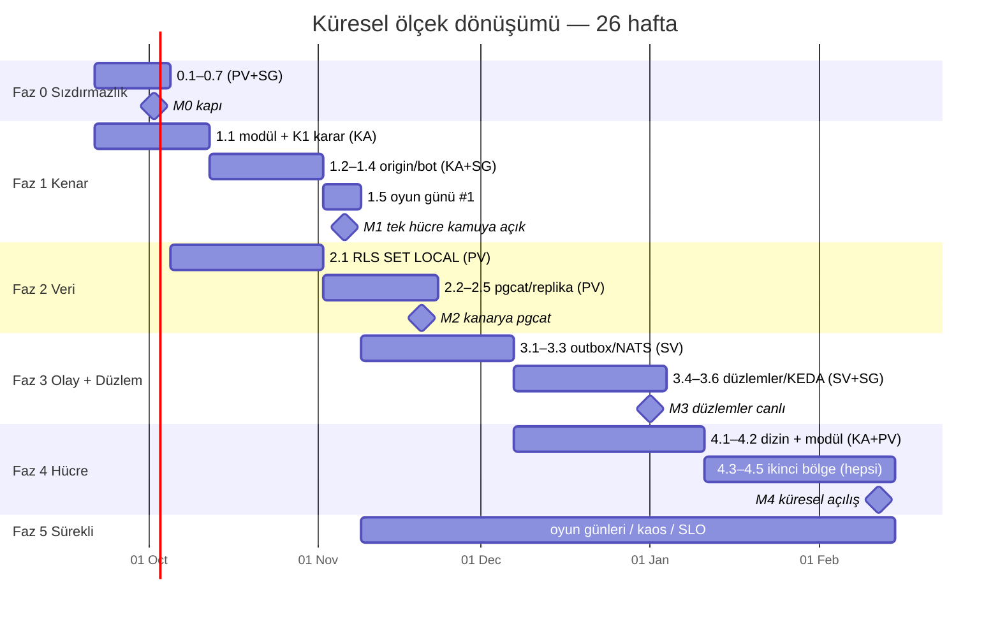

# Küresel Ölçek Dönüşümü — Faz Takvimi ve Yol Haritası

> **Tasarım:** `docs/architecture/2026-09-13-global-scale-cell-architecture-and-ddos.md`
> **Görev listesi:** `docs/plans/2026-09-13-global-scale-cell-architecture-plan.md`
> (görev numaraları — 0.1, 2.1, 3.4 … — oradaki başlıklardır; bu belge onları takvime bağlar,
> içeriğini tekrar etmez.)
>
> **Bu belge neye cevap verir:** Hangi faz ne zaman başlar ve biter, hangi sprintte hangi
> görev alınır, bir faza girmek ve çıkmak için neyin ölçülmüş olması gerekir, hangi kararlar
> hangi haftada verilmelidir, kim neye sahiptir, plan kayarsa hangi sıra korunur.

---

## 0. Varsayımlar (değişirse takvim değişir)

| Varsayım | Değer | Değişirse |
|---|---|---|
| Başlangıç | **Pazartesi 2026-09-21** (Hafta 1) | Tüm tarihler kayar, sıralar kaymaz |
| Sprint | 2 hafta, S1 = H1–H2 | — |
| Ekip | 4 kişi tam zamanlı: Kenar/Ağ (KA), Platform/Veri (PV), Servis (SV), SRE/Güvenlik (SG) | 3 kişi → Faz 1 ve Faz 2 paralel gidemez, +6 hafta |
| Ortamlar | `staging` hücresi (küçük profil) H1'de var; `canary-1` Faz 2'de kurulur | staging yoksa Faz 0 kabul ölçütleri ölçülemez → **başlamayın** |
| Kenar sağlayıcı kararı | En geç **H3** (bkz. K1) | Geç karar Faz 1'i doğrudan öteler |
| Kod dondurma | Yok; özellik işi devam eder, ancak Faz 2.1 (RLS refactor) sırasında yeni SQL yolu açan PR'lar `orgscope` `local` modunu da geçmek zorundadır | — |

---

## 1. Tek bakışta takvim

| Kilometre taşı | Tarih | Anlamı | Kanıt |
|---|---|---|---|
| **M0** | H2 sonu, 2026-10-02 | Sistem bir kenar sağlayıcısının arkasına **konulabilir**; kendini DDoS etmez | 7 Faz 0 kabul ölçütü staging'de ölçüldü |
| **M1** | H7 sonu, 2026-11-06 | **Tek hücre kamuya açılış adayı.** Kenar canlı, origin gizli, bot kapısı `observe` | Oyun günü #1 raporu `docs/evidence/` |
| **M2** | H9 sonu, 2026-11-20 | PG bağlantı tavanı kalktı; `RLS_MODE=local` kanaryada 2 hafta temiz | Sızıntı testi 0, pgcat gauge sabit |
| **M3** | H15 sonu, 2027-01-01 | Düzlemler ayrı; login, admin'e gelen 10× yükten etkilenmez; kill-switch p95 < 2 s | "admin flood" k6 senaryosu, pano |
| **M4** | H21 sonu, 2027-02-12 | **Küresel açılış.** İki bölge, kanarya hücre, kiracı→hücre yönlendirme | Hücre kapatma oyun günü: komşu SLO değişmedi |

Kritik yol: **Faz 0 → Faz 2 → Faz 3 → Faz 4** (2 + 7 + 7 + 5 ≈ 21 hafta). Faz 1 kritik
yolda değildir ama **M1'i tek başına üretir**; en erken kamu değeri oradadır.

---

## 2. Karar noktaları

Bunlar plan PR'larının sessizce alamayacağı kararlardır. Her biri bir ADR ekiyle kapanır.

| # | Karar | Son tarih | Sahip | Girdi | Verilmezse |
|---|---|---|---|---|---|
| **K1** | Kenar sağlayıcısı: Cloudflare / AWS (CloudFront+Shield+WAF) / Azure Front Door | **H3** | KA + ürün | Maliyet, mevcut bulut (AWS eu-west-1 + Azure AKS ikisi de IaC'de), residency, bot yönetimi kalitesi | Faz 1.2–1.5 başlayamaz; M1 hafta hafta kayar |
| **K2** | İlk kamu pazarı ve bölge (M1 hücresi nerede?) | H3 | Ürün | Kullanıcı coğrafyası, residency | Origin hostname ve sertifika planı belirsiz |
| **K3** | mTLS: Linkerd mi, uygulama-seviyesi TLS mi (ADR-8) | H8 | SG + SV | Faz 2 sırasında staging'de Linkerd denemesi | Faz 3.4 NetworkPolicy tasarımı iki kez yazılır |
| **K4** | Olay omurgası: NATS JetStream onayı (ADR-6) veya yönetilen alternatif | H8 | SV + PV | Faz 3.1 öncesi 1 haftalık PoC: outbox → NATS → ES, 50k olay/sn | Faz 3.1 arayüzü yazılır ama taşıyıcı yok |
| **K5** | İkinci bölge ve hücre boyut profili (`s`/`m`) | H14 | Ürün + KA | M1 sonrası gerçek trafik, maliyet | Faz 4.2 modül parametreleri tahminle yazılır |
| **K6** | Kamu açılış tarihi (M4 = M4 mü, yoksa M1 sonrası kademeli mi?) | H16 | Ürün | M3 kanıtları | Faz 5 oyun günü takvimi bağlanamaz |

---

## 3. Faz kartları

Her kart aynı şablonu izler: amaç, giriş koşulu, sprint kırılımı, çıkış kapısı, sahip,
riskler, "erken durdur" sinyali.

### Faz 0 — Sızdırmazlık · H1–H2 (S1) · PV + SG

**Amaç.** Kenar arkasına konulduğunda kendini DDoS eden dört noktayı kapat; küçük kod,
büyük etki.

**Giriş koşulu.** `staging` hücresi çalışıyor ve k6 çalıştırabilen bir yük makinesi var.
Yoksa ilk iş bu; Faz 0 ölçülemeden "bitti" denemez.

| Hafta | Görevler | Sahip | Not |
|---|---|---|---|
| H1 | 0.1 Redis üç role (konfig + istemci dağıtımı) · 0.3 ortak `server.NewHTTP` + zaman aşımı · 0.4 health/metrics dışa kapalı | PV: 0.1 · SG: 0.3, 0.4 | 0.1 en riskli; ilk gün başla |
| H2 | 0.2 gerçek IP zinciri · 0.5 HPA açık · 0.6 CORS · 0.7 Redis kaybında kademeli düşüş · **ölçüm günü** (Cuma) | SG: 0.2, 0.5 · PV: 0.6, 0.7 | Ölçüm günü: 7 kabul ölçütü tek oturumda |

**Çıkış kapısı (M0).** Yedi kabul ölçütü staging'de ölçülmüş ve `docs/evidence/2026-10-faz0.md`
altında sayılarla kayıtlı. Tasarım §3'te B2, B3, B5, Y1, Y2, O1, O2 "kapandı".

**Riskler.** Redis istemci dağıtımı 19 pakete dokunur (`redis.` kullanan paket sayısı);
yanlış istemciye düşen bir anahtar sessiz hata üretir → her rol için ayrı prefix ve
`redis-cli MONITOR` ile ölçüm gününde doğrulama.

**Erken durdur.** H1 sonunda 0.1 birleşmemişse H2 görevlerini S2'ye it; **M0'ı 0.1 olmadan
ilan etme.**

---

### Faz 1 — Küresel kenar · H1–H7 (S1–S4) · KA (+SG H4'ten itibaren)

**Amaç.** L3/L4 ve hacimsel L7'yi satın alınan kenara ver, origin'i gizle, issue yoluna bot
direnci ekle, ilk oyun gününü yap.

**Giriş koşulu.** Faz 1.1 için yok (IaC iskeleti sağlayıcı-bağımsız). 1.2'den itibaren
**K1 verilmiş** ve **M0 geçilmiş** olmalı (gerçek IP zinciri olmadan kenar arkasına geçilmez).

| Hafta | Görevler | Sahip | Not |
|---|---|---|---|
| H1–H3 | 1.1 üç kenar modülü iskeleti, ortak arayüz, CI `terraform validate`; **K1 kararı için maliyet/özellik tablosu** | KA | K1 H3 Cuma |
| H4–H5 | 1.2 origin gizleme (SG grubu, origin mTLS, gizli hostname) · 1.3 önbellek başlıkları | KA · SG | Faz 0.2'nin CIDR CronJob'u burada gerçek listeye bağlanır |
| H6 | 1.4 bot direnci: hesap-başına sayaç, `BOT_GATE=observe`, kenar challenge entegrasyonu | SG + SV (yarım) | `enforce` **M1'de değil**, 2 hafta observe verisinden sonra |
| H7 | 1.5 k6 saldırı senaryoları + runbook + **oyun günü #1** (Perşembe), rapor (Cuma) | Hepsi | Oyun günü 4 saat, kenar sağlayıcı temsilcisi davetli |

**Çıkış kapısı (M1).** Oyun günü #1'de altı senaryonun hepsinde VERIFY p99 değişmedi,
ISSUE meşru başarı > %99; sağlayıcı dışı IP'den origin'e TCP reset; runbook denendi.
Rapor `docs/evidence/2026-11-oyun-gunu-1.md`.

**Riskler.** Sağlayıcı bot skoru başlığının biçimi ürüne göre değişir → 1.4 kodunda başlık
adı konfigürasyon, Go tarafı yalnız 0–100 tamsayı okur.

**Erken durdur.** K1 H3'te verilmezse KA H4'ü Faz 4.2 hücre modülünün iskeletine kaydırır;
Faz 1 dondurulur, M1 kayar. Bunu gizlemeyin: takvimdeki M1 tarihini PR ile güncelleyin.

---

### Faz 2 — Veri katmanı · H3–H9 (S2–S5) · PV

**Amaç.** PG bağlantı sayısını replika sayısından bağımsızlaştır; ADMIN yükünü replikaya ver;
pahalı sorguyu düzlem başına kes.

**Giriş koşulu.** M0 geçilmiş (özellikle 0.1: Redis ayrımı, çünkü 2.1 testleri Redis
oturum durumuna dayanır). `canary-1` hücresi H5'e kadar kurulmuş olmalı (küçük profil,
gerçek trafik yok, sentetik yük var).

| Hafta | Görevler | Sahip | Not |
|---|---|---|---|
| H3–H4 | 2.1a `database.WithTx` + tek-ifade sarmalayıcıları; `RLS_MODE` bayrağı (`session` varsayılan) | PV | Kod yolu değişmez, yalnız yeni API |
| H5–H6 | 2.1b `orgscope` `local` modu kuralı; sarmalayıcı dışı sorguları paket paket taşı (öncelik: oauth, identity, access); `rls_enforcement_test` iki modda | PV (+SV yarım: oauth/identity taşıması) | En uzun iş; 158 KLOC'ta sorgu sayısını H3'te ölç ve buraya yaz |
| H7 | 2.1c `canary-1`'de `RLS_MODE=local` aç; eşzamanlı iki kiracı sızıntı testi | PV | 2 haftalık gözlem burada başlar (H7–H9) |
| H7–H8 | 2.2 pgcat ×2, `DB_MAX_CONNS` 10→4, alarm taşıma · 2.4 düzlem PG rolleri (**v188**) | PV | pgcat yalnız `local` mod hücrede |
| H9 | 2.3 okuma replikası ADMIN varsayılan · 2.5 keyset sayfalama (audit, SCIM) · **M2 ölçümü** | PV | |

**Çıkış kapısı (M2).** `canary-1`'de `RLS_MODE=local` 2 hafta, sızıntı 0, `orgscope`
yeşil; ISSUE HPA 30 replikaya çıkarken PG bağlantı sayısı sabit (grafik kanıt);
`db-pooling.md` "artık uygulanabilir" notuyla güncellendi.

**Riskler.** En büyük proje riski buradadır: kaçırılan bir sorgu yolu = kiracı sızıntısı.
Azaltım: `orgscope` `local` modu **merge-blocking** olur; `session` mod prod'da M3'e kadar
kalır (iki mod paralel yaşar, geri dönüş bir bayrak).

**Erken durdur.** H6 sonunda taşınan sorgu yolu oranı < %70 ise S5'e bir sprint ekle ve
Faz 3.1'i (outbox, PV'ye bağlı değil) SV ile paralel başlat; Faz 3.4'ü (düzlem ayrımı)
M2'ye kadar başlatma.

---

### Faz 3 — Olay omurgası ve düzlemler · H8–H15 (S4–S8) · SV (+SG, +PV yarım)

**Amaç.** Servisler arası iletişimi "aynı tabloya yaz"dan at-least-once olaya taşı; 8
servisi 5 düzleme yerleştir; yük atma ve maliyet kotası; KEDA.

**Giriş koşulu.** 3.1–3.3 için K4 (NATS PoC) H8'de verilmiş; 3.4 için **M2 geçilmiş**
(düzlem başına PG rolü ve pgcat olmadan düzlem ayrımı yalnızca pod etiketi olur).

| Hafta | Görevler | Sahip | Not |
|---|---|---|---|
| H8 | K4 PoC: outbox → NATS → ES, 50k olay/sn staging'de | SV | Bir hafta, sonuç ADR-6 ekine |
| H9–H10 | 3.1 `OutboxBus` + **v189** + relay worker; SSF ve SCIM outbound outbox'larının göçü · 3.2 NATS ×3 Helm | SV · PV (Helm) | Relay lider seçimli (mevcut `leader` paketi) |
| H11–H12 | 3.3 tüketiciler: audit indexer (çift yazım kalkar), webhook deliverer, kill-switch, cache invalidation | SV | Kill-switch p95 panosu H12'de |
| H12–H13 | 3.4a `verify-service` (PG import guard) · identity `SERVICE_PROFILE` · worker binary'leri | SV | Bayrakla; eski binary'ler M3'e kadar kalır |
| H13–H14 | 3.4b APISIX düzlem upstream'leri, NetworkPolicy düzlem etiketleri, `plane=issue` düğüm havuzu · K3 mTLS uygulaması | SG + KA | Linkerd seçildiyse burada kurulur |
| H14 | 3.5 kabul denetleyicisi + maliyet kotası (`observe`) | SV | `enforce` M3 sonrası 2 hafta observe ile |
| H15 | 3.6 KEDA tetikleyicileri · **M3 ölçümü**: "admin flood" k6 | SG | |

**Çıkış kapısı (M3).** ADMIN'e 10× yük → ISSUE p99 değişmez; verify-service pod'unda PG
bağlantısı 0; kill-switch uçtan uca p95 < 2 s panoda; audit olayı ES'te ≤ 5 s; relay 10 dk
kapatıldığında olay kaybı 0.

**Riskler.** identity-service'in auth/admin profillere bölünmesi rota kayıt kodunda
karışıklık yaratabilir → profil bir tablo (rota grubu → profil), `if` zinciri değil.

**Erken durdur.** K4 PoC 50k olay/sn'ye ulaşmazsa (ör. 20k) omurga yine seçilir ama
tasarım §1.1 audit hedefi ölçülen sayıya çekilir; **hedef sayı tahmine geri dönmez.**

---

### Faz 4 — Hücre modeli ve ikinci bölge · H12–H21 (S6–S11) · KA + PV, sonra hepsi

**Amaç.** Kiracı→hücre yönlendirmesi, hücreyi tek Terraform modülüyle kurma, ikinci bölge,
kanarya hücre, hücre başına anahtar, Ziti kontrol düzlemi koruması.

**Giriş koşulu.** 4.1–4.2 için **M1** (kenar KV/worker var) yeter; 4.3 için **M3**
(düzlemler ve olay omurgası hücre içinde tamam olmadan ikinci hücre kurulmaz — iki
kez düzeltirsiniz). K5 H14'te verilmiş.

| Hafta | Görevler | Sahip | Not |
|---|---|---|---|
| H12–H13 | 4.1 kiracı dizini (**v190**), kenar KV itme, JWT `cell` claim, `421` davranışı | KA + SV (yarım) | Küçük servis; salt-okur ağır |
| H13–H16 | 4.2 `modules/cell` Terraform: `staging` ve `canary-1`'i bu modülle **yeniden** kur (drift sıfırlama) | PV + KA | Mevcut hücreleri modüle geçirmek, yeni hücre kurmaktan önce |
| H16–H18 | 4.4 hücre başına imza anahtarı ve KEK (`kid=<cell>-<n>`, `cmd/rekey` kapsamı) · 4.5 Ziti ayrı hostname + L4 LB + enrollment kotası | SG · KA | 4.4 M4 öncesi şart: ikinci hücre ilk günden ayrı anahtarla doğar |
| H18–H20 | 4.3 ikinci bölge hücresi (`us-1` veya K5 kararı), release workflow'da hücre sıralı dağıtım (canary → eu → us) | Hepsi | İlk kiracılar sentetik; gerçek kiracı taşıma M4 sonrası |
| H21 | **Oyun günü #2: bir hücreyi tamamen kapat**, komşu hücre SLO'ları ölç; DR game day (`make dr-game-day`) ikinci hücrede · **M4 ölçümü** | Hepsi | |

**Çıkış kapısı (M4).** Bir hücrenin kapatılması diğerinin SLO'larını değiştirmedi (pano
kanıtı); sıfırdan hücre `terraform apply` < 90 dk; çapraz hücre JWT → 401; enrollment floodu
altında Ziti Raft sağlıklı ve kurulu tüneller kesilmedi.

**Riskler.** Terraform modülüne mevcut hücreleri taşımak "çalışanı bozma" korkusu üretir →
önce `staging`, sonra `canary-1`, prod hücresi en son ve `terraform plan` sıfır fark
gösterdiğinde.

**Erken durdur.** K5 H14'te verilmezse 4.3 yerine 4.4 ve 4.5 öne alınır; M4 "ikinci bölge"
yerine "ikinci hücre aynı bölgede" olarak ilan edilir ve bu fark belgede açıkça yazılır.

---

### Faz 5 — Sürekli · M1'den itibaren · SG

Takvime bağlı değil, ritme bağlı:

| Ritim | İş | İlk tarih |
|---|---|---|
| Aylık | `make k8s-chaos` canlı, her hücre; sonuç `docs/evidence/` | H8 (M1 sonrası ilk ay) |
| Çeyreklik | DDoS oyun günü: Faz 1.5 senaryoları + o çeyrekte görülen yeni vektör | H20 (Q1 2027) |
| Çeyreklik | SLO ve hata bütçesi incelemesi; tasarım/plan belgelerinin yeniden doğrulanması | H13, H26 |
| Haftalık (CI) | Kenar CIDR/kural drift denetimi Git ↔ sağlayıcı | H5'ten itibaren |
| Her sürüm | Hücre sıralı dağıtım; kanaryada 24 saat bekleme | H20'den itibaren |

---

## 4. Sprint özeti (kim, ne zaman, ne)

| Sprint | Haftalar | KA (Kenar/Ağ) | PV (Platform/Veri) | SV (Servis) | SG (SRE/Güvenlik) |
|---|---|---|---|---|---|
| S1 | H1–H2 | 1.1 modül iskeleti, K1 tablosu | 0.1, 0.6, 0.7 | özellik işi | 0.2, 0.3, 0.4, 0.5; ölçüm günü |
| S2 | H3–H4 | K1 kararı; 1.2 başlar | 2.1a WithTx | özellik işi | 1.2 origin mTLS |
| S3 | H5–H6 | 1.2 biter, 1.3 | 2.1b taşıma | 2.1b oauth/identity taşıması (yarım); 1.4 (yarım) | 1.4 bot kapısı |
| S4 | H7–H8 | 1.5 oyun günü #1 · **M1** | 2.1c kanarya `local`; 2.2 pgcat | K4 NATS PoC | 1.5 runbook; K3 Linkerd denemesi |
| S5 | H9–H10 | Faz 4.2 hücre modülü keşfi | 2.3, 2.4, 2.5 · **M2**; 3.2 NATS Helm | 3.1 OutboxBus + v189 | aylık kaos #1 |
| S6 | H11–H12 | 4.1 kiracı dizini | 4.2 modül başlar | 3.3 tüketiciler; 3.4a verify-service | kill-switch panosu |
| S7 | H13–H14 | 3.4b APISIX düzlemleri; K5 | 4.2 staging'i modüle taşı | 3.4a devam; 3.5 kabul denetleyicisi | 3.4b NetworkPolicy, K3 mTLS; SLO incelemesi |
| S8 | H15–H16 | 4.2 canary'yi modüle taşı | 4.2 devam | 3.6 KEDA ile SG · **M3** | 3.6 KEDA; 4.4 anahtar başlar |
| S9 | H17–H18 | 4.5 Ziti hostname/LB | 4.3 ikinci hücre altyapısı | 4.3 release workflow | 4.4 KEK/rekey |
| S10 | H19–H20 | 4.3 ikinci hücre kenar yönlendirme | 4.3 veri katmanı ikinci hücre | 4.3 sentetik kiracı | oyun günü #3 hazırlığı |
| S11 | H21–H22 | **Oyun günü #2 · M4** | DR game day ikinci hücre | destek | rapor; Faz 5 ritmi devralır |

---

## 5. Kayma kuralları (plan kayarsa ne korunur)

1. **Sıra korunur, tarih kayar.** Hiçbir faz bir öncekinin çıkış kapısı ölçülmeden
   "başladı" sayılmaz; kapı sayıları `docs/evidence/` altında yoksa faz açılmamıştır.
2. **M0 kayarsa her şey kayar, gizlenmez.** Faz 0 iki haftayı aşarsa bu belgedeki tarihler
   PR ile güncellenir; sözlü "biraz gecikti" yok.
3. **Faz 1 tek başına değerlidir.** Kritik yol tıkanırsa (ör. 2.1 uzarsa) KA ve SG Faz 1'i
   bitirir; M1 kamu değeri en erken buradadır.
4. **Faz 2.1 kısaltılmaz.** RLS refactor'unda "yüzde 90 taşındı, kalanı sonra" kabul
   edilmez; `orgscope` `local` modu merge-blocking olmadan `RLS_MODE=local` prod'a çıkmaz.
5. **İkinci hücre M3'ten önce kurulmaz.** Düzlemler ve omurga hücre içinde bitmeden çoğaltmak,
   her düzeltmeyi iki kez yapmaktır.
6. **`observe` → `enforce` her zaman iki hafta veriyle.** Bot kapısı, maliyet kotası,
   kabul denetleyicisi: önce kim etkilenirdi görülür, sonra açılır (depo geleneği).

---

## 6. Başlangıç haftası kontrol listesi (H1, Pazartesi)

- [ ] `staging` hücresi çalışıyor; k6 yük makinesi hücreye ulaşıyor; baseline p99 ölçülüp
      `docs/evidence/2026-09-baseline.md`'ye yazıldı (kayma kurallarının referansı).
- [ ] Dört rol isimle atanmış; bu belgenin §4 tablosundaki hücreler kişi adlarıyla güncellenmiş.
- [ ] K1 için maliyet/özellik tablosu şablonu açılmış (KA), karar toplantısı H3 Cuma takvimde.
- [ ] Faz 0 yedi görevi issue olarak açılmış; her issue plan belgesindeki kabul ölçütünü
      birebir taşıyor.
- [ ] `docs/evidence/` altında faz klasörleri oluşturulmuş; boş dosya yok, yalnız ölçüm.
- [ ] Bu belge, tasarım ve görev planı ekibe okutulmuş; itirazlar ADR olarak yazılmış,
      sözlü kalmamış.
